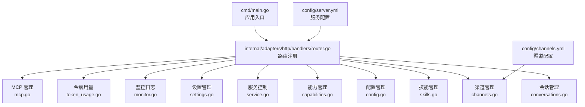
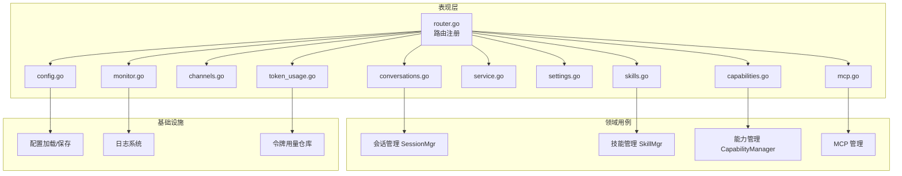
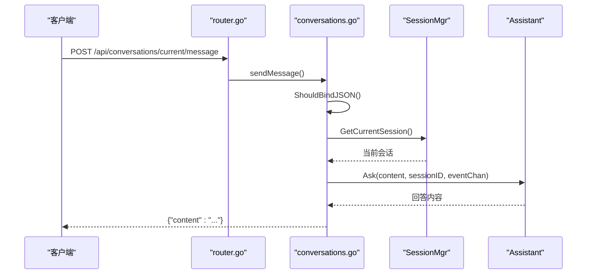
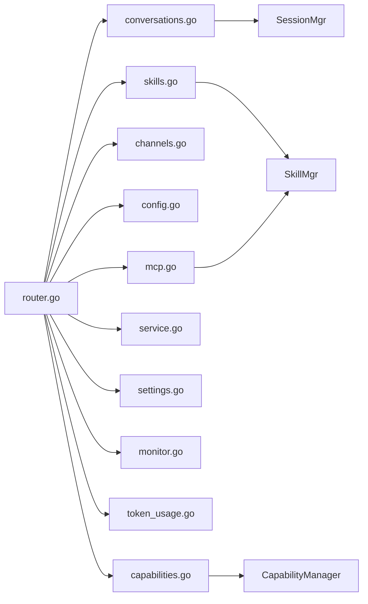

# API 接口文档

<cite>
**本文档引用的文件**
- [cmd/main.go](file://cmd/main.go)
- [internal/adapters/http/handlers/router.go](file://internal/adapters/http/handlers/router.go)
- [internal/adapters/http/handlers/conversations.go](file://internal/adapters/http/handlers/conversations.go)
- [internal/adapters/http/handlers/skills.go](file://internal/adapters/http/handlers/skills.go)
- [internal/adapters/http/handlers/channels.go](file://internal/adapters/http/handlers/channels.go)
- [internal/adapters/http/handlers/config.go](file://internal/adapters/http/handlers/config.go)
- [internal/adapters/http/handlers/capabilities.go](file://internal/adapters/http/handlers/capabilities.go)
- [internal/adapters/http/handlers/service.go](file://internal/adapters/http/handlers/service.go)
- [internal/adapters/http/handlers/settings.go](file://internal/adapters/http/handlers/settings.go)
- [internal/adapters/http/handlers/token_usage.go](file://internal/adapters/http/handlers/token_usage.go)
- [internal/adapters/http/handlers/monitor.go](file://internal/adapters/http/handlers/monitor.go)
- [internal/adapters/http/handlers/mcp.go](file://internal/adapters/http/handlers/mcp.go)
- [config/server.yml](file://config/server.yml)
- [config/channels.yml](file://config/channels.yml)
</cite>

## 目录
1. [简介](#简介)
2. [项目结构](#项目结构)
3. [核心组件](#核心组件)
4. [架构概览](#架构概览)
5. [详细组件分析](#详细组件分析)
6. [依赖关系分析](#依赖关系分析)
7. [性能考虑](#性能考虑)
8. [故障排除指南](#故障排除指南)
9. [结论](#结论)
10. [附录](#附录)

## 简介
本文件为 MindX 的完整 API 接口文档，覆盖 REST API 和 WebSocket 接口规范。REST API 通过 HTTP 提供服务控制、会话管理、技能管理、渠道管理、配置管理、监控与日志、令牌用量统计以及 MCP（Model Context Protocol）服务器管理等功能；WebSocket 接口用于实时消息交互。文档详细说明端点、请求/响应模式、认证方式、参数验证、错误处理策略，并提供调用示例与最佳实践。

## 项目结构
MindX 的 API 层位于 internal/adapters/http/handlers 目录，采用分层架构：
- 路由注册：统一在 router.go 中注册各模块路由
- 控制器：每个业务域对应一个处理器（如 conversations、skills、channels 等）
- 配置：通过 config/*.yml 提供服务端口、模型、渠道等配置
- 服务入口：cmd/main.go 初始化构建信息并启动 CLI/服务

**图表来源**
- [cmd/main.go](file://cmd/main.go#L1-L21)
- [internal/adapters/http/handlers/router.go](file://internal/adapters/http/handlers/router.go#L1-L150)

**章节来源**
- [cmd/main.go](file://cmd/main.go#L1-L21)
- [internal/adapters/http/handlers/router.go](file://internal/adapters/http/handlers/router.go#L1-L150)
- [config/server.yml](file://config/server.yml#L1-L21)
- [config/channels.yml](file://config/channels.yml#L1-L96)

## 核心组件
- 路由注册器：集中注册所有 API 路由，按功能域分组
- 业务处理器：封装具体业务逻辑，负责请求解析、参数校验、调用领域用例、返回响应
- 配置模块：提供服务配置、模型配置、能力配置、MCP 配置等读写接口
- 日志与监控：提供系统日志读取与清理接口
- 令牌用量：提供按模型与总体统计的令牌使用情况查询

**章节来源**
- [internal/adapters/http/handlers/router.go](file://internal/adapters/http/handlers/router.go#L18-L149)
- [internal/adapters/http/handlers/monitor.go](file://internal/adapters/http/handlers/monitor.go#L1-L188)
- [internal/adapters/http/handlers/token_usage.go](file://internal/adapters/http/handlers/token_usage.go#L1-L49)

## 架构概览
MindX 的 API 采用分层设计：
- 表现层：Gin 路由与处理器
- 领域用例：会话管理、技能管理、能力管理、MCP 管理等
- 基础设施：配置加载与保存、日志、持久化存储等

**图表来源**
- [internal/adapters/http/handlers/router.go](file://internal/adapters/http/handlers/router.go#L18-L149)
- [internal/adapters/http/handlers/conversations.go](file://internal/adapters/http/handlers/conversations.go#L1-L248)
- [internal/adapters/http/handlers/skills.go](file://internal/adapters/http/handlers/skills.go#L1-L496)
- [internal/adapters/http/handlers/channels.go](file://internal/adapters/http/handlers/channels.go#L1-L214)
- [internal/adapters/http/handlers/config.go](file://internal/adapters/http/handlers/config.go#L1-L256)
- [internal/adapters/http/handlers/capabilities.go](file://internal/adapters/http/handlers/capabilities.go#L1-L141)
- [internal/adapters/http/handlers/service.go](file://internal/adapters/http/handlers/service.go#L1-L283)
- [internal/adapters/http/handlers/settings.go](file://internal/adapters/http/handlers/settings.go#L1-L112)
- [internal/adapters/http/handlers/monitor.go](file://internal/adapters/http/handlers/monitor.go#L1-L188)
- [internal/adapters/http/handlers/token_usage.go](file://internal/adapters/http/handlers/token_usage.go#L1-L49)
- [internal/adapters/http/handlers/mcp.go](file://internal/adapters/http/handlers/mcp.go#L1-L248)

## 详细组件分析

### 服务控制接口
- 健康检查
  - 方法：GET
  - URL：/api/health
  - 认证：无
  - 成功：200 OK
  - 失败：500 内部错误
- 启动服务
  - 方法：POST
  - URL：/api/service/start
  - 请求体：无
  - 响应：{"message":"服务启动成功","running":true}
- 停止服务
  - 方法：POST
  - URL：/api/service/stop
  - 请求体：无
  - 响应：{"message":"服务停止成功","running":false}
- Ollama 检测
  - 方法：GET
  - URL：/api/service/ollama-check
  - 响应：{"installed":bool,"running":bool,"models":""}
- Ollama 安装
  - 方法：POST
  - URL：/api/service/ollama-install
  - 响应：{"message":"Ollama 安装已启动"} 或 {"error":"请手动安装"}
- 模型测试
  - 方法：POST
  - URL：/api/service/model-test
  - 请求体：{"model_name":"模型名"}
  - 响应：{"supports_fc":bool}

**章节来源**
- [internal/adapters/http/handlers/router.go](file://internal/adapters/http/handlers/router.go#L26-L32)
- [internal/adapters/http/handlers/service.go](file://internal/adapters/http/handlers/service.go#L26-L188)

### 会话管理接口
- 列出会话
  - 方法：GET
  - URL：/api/conversations
  - 查询参数：limit（可选）
  - 响应：数组，元素包含 id、title、timestamp、messageCount、startTime
- 创建新会话
  - 方法：POST
  - URL：/api/conversations
  - 请求体：无
  - 响应：{"id":"","messages":[]}
- 获取当前会话
  - 方法：GET
  - URL：/api/conversations/current
  - 响应：{"id":"","messages":[]}
- 当前会话发送消息
  - 方法：POST
  - URL：/api/conversations/current/message
  - 请求体：{"type":"text","content":"用户输入"}
  - 响应：{"content":"助手回复"}
- 获取指定会话详情
  - 方法：GET
  - URL：/api/conversations/:id
  - 响应：{"id":"","messages":[{"role":"","content":""}]}
- 切换会话
  - 方法：POST
  - URL：/api/conversations/:id/switch
  - 请求体：无
  - 响应：{"id":"","messages":[]}
- 删除会话
  - 方法：DELETE
  - URL：/api/conversations/:id
  - 响应：{"message":"对话已删除"}

**图表来源**
- [internal/adapters/http/handlers/router.go](file://internal/adapters/http/handlers/router.go#L34-L45)
- [internal/adapters/http/handlers/conversations.go](file://internal/adapters/http/handlers/conversations.go#L54-L79)

**章节来源**
- [internal/adapters/http/handlers/router.go](file://internal/adapters/http/handlers/router.go#L34-L45)
- [internal/adapters/http/handlers/conversations.go](file://internal/adapters/http/handlers/conversations.go#L54-L200)

### 技能管理接口
- 列出技能
  - 方法：GET
  - URL：/api/skills
  - 响应：{"skills":[],"count":int,"isReIndexing":bool,"reIndexError":""}
- 重索引状态
  - 方法：GET
  - URL：/api/skills/reindex/status
  - 响应：{"isReIndexing":bool,"reIndexError":""}
- 触发重索引
  - 方法：POST
  - URL：/api/skills/reindex
  - 响应：{"message":"重索引已在后台启动"}
- 获取技能详情
  - 方法：GET
  - URL：/api/skills/:name
  - 响应：{"name":"","skill":{}}
- 获取依赖
  - 方法：GET
  - URL：/api/skills/:name/dependencies
  - 响应：{"name":"","missing_bins":[]}
- 获取环境变量
  - 方法：GET
  - URL：/api/skills/:name/env
  - 响应：{"name":"","env":{}}
- 获取统计信息
  - 方法：GET
  - URL：/api/skills/:name/stats
  - 响应：{"name":"","enabled":bool,"tags":[],"version":""}
- 转换技能
  - 方法：POST
  - URL：/api/skills/:name/convert
  - 响应：{"message":"技能转换成功","name":""}
- 安装依赖
  - 方法：POST
  - URL：/api/skills/:name/install
  - 请求体：{"binary":""}
  - 响应：{"message":"依赖已安装"}
- 安装运行时
  - 方法：POST
  - URL：/api/skills/:name/install/runtime
  - 响应：{"message":"运行时安装成功","name":""}
- 设置环境变量
  - 方法：POST
  - URL：/api/skills/:name/env
  - 请求体：{"键":"值"}
  - 响应：{"message":"环境变量已更新"}
- 校验技能
  - 方法：POST
  - URL：/api/skills/:name/validate
  - 响应：{"name":"","valid":bool,"errors":[]}
- 启用技能
  - 方法：POST
  - URL：/api/skills/:name/enable
  - 响应：{"message":"已启用"}
- 禁用技能
  - 方法：POST
  - URL：/api/skills/:name/disable
  - 响应：{"message":"已禁用"}
- 批量转换
  - 方法：POST
  - URL：/api/skills/batch/convert
  - 请求体：{"names":["技能名1","技能名2"]}
  - 响应：{"message":"","success_count":int,"failed_count":int,"success":[],"failed":[]}
- 批量安装
  - 方法：POST
  - URL：/api/skills/batch/install
  - 请求体：{"names":["技能名1","技能名2"]}
  - 响应：{"message":"","success_count":int,"failed_count":int,"success":[],"failed":[]}

**章节来源**
- [internal/adapters/http/handlers/router.go](file://internal/adapters/http/handlers/router.go#L59-L79)
- [internal/adapters/http/handlers/skills.go](file://internal/adapters/http/handlers/skills.go#L27-L496)

### 渠道管理接口
- 获取渠道列表
  - 方法：GET
  - URL：/api/channels
  - 响应：{"enabled_channels":[],"channels":{"渠道ID":{"enabled":bool,"name":"","icon":"","config":{}}}}
- 更新渠道配置
  - 方法：PUT/POST
  - URL：/api/channels/:id/config
  - 请求体：渠道配置对象
  - 响应：{"message":"通道配置更新成功"}
- 切换渠道状态
  - 方法：POST
  - URL：/api/channels/:id/toggle
  - 请求体：{"enabled":bool}
  - 响应：{"message":"通道状态更新成功"}
- 启动渠道
  - 方法：POST
  - URL：/api/channels/:id/start
  - 响应：{"message":"通道启动成功"}
- 停止渠道
  - 方法：POST
  - URL：/api/channels/:id/stop
  - 响应：{"message":"通道停止成功"}

**章节来源**
- [internal/adapters/http/handlers/router.go](file://internal/adapters/http/handlers/router.go#L47-L57)
- [internal/adapters/http/handlers/channels.go](file://internal/adapters/http/handlers/channels.go#L31-L214)
- [config/channels.yml](file://config/channels.yml#L1-L96)

### 配置管理接口
- 获取通用配置
  - 方法：GET
  - URL：/api/config/general
  - 响应：{"workplace":"","server":{"address":"","port":0}}
- 保存通用配置
  - 方法：POST
  - URL：/api/config/general
  - 请求体：{"workplace":"","server":{"address":"","port":int}}
  - 响应：{"message":"General config saved successfully"}
- 获取服务端配置
  - 方法：GET
  - URL：/api/config/server
  - 响应：{"server":{}}
- 保存服务端配置
  - 方法：POST
  - URL：/api/config/server
  - 请求体：{"server":{}}
  - 响应：{"message":"Server config saved successfully"}
- 获取模型配置
  - 方法：GET
  - URL：/api/config/models
  - 响应：{"models":[]}
- 保存模型配置
  - 方法：POST
  - URL：/api/config/models
  - 请求体：{"models":[]}
  - 响应：{"message":"Models config saved successfully"}
- 获取能力配置
  - 方法：GET
  - URL：/api/config/capabilities
  - 响应：{"capabilities":[],"models":[]}
- 保存能力配置
  - 方法：POST
  - URL：/api/config/capabilities
  - 请求体：{"capabilities":[]}
  - 响应：{"message":"Capabilities config saved successfully"}
- 同步 Ollama 模型
  - 方法：POST
  - URL：/api/config/ollama-sync
  - 响应：{"message":"Ollama models synced successfully"}

**章节来源**
- [internal/adapters/http/handlers/router.go](file://internal/adapters/http/handlers/router.go#L109-L119)
- [internal/adapters/http/handlers/config.go](file://internal/adapters/http/handlers/config.go#L19-L256)
- [config/server.yml](file://config/server.yml#L1-L21)

### 能力管理接口
- 列出能力
  - 方法：GET
  - URL：/api/capabilities
  - 响应：{"capabilities":[],"count":int}
- 重索引状态
  - 方法：GET
  - URL：/api/capabilities/reindex/status
  - 响应：{"isReIndexing":bool,"error":""}
- 触发重索引
  - 方法：POST
  - URL：/api/capabilities/reindex
  - 响应：{"message":"重新索引已启动"}
- 新增能力
  - 方法：POST
  - URL：/api/capabilities
  - 请求体：能力定义对象
  - 响应：{"message":"能力添加成功"}
- 更新能力
  - 方法：PUT
  - URL：/api/capabilities
  - 查询参数：name（必需）
  - 请求体：能力定义对象
  - 响应：{"message":"能力更新成功"}
- 删除能力
  - 方法：DELETE
  - URL：/api/capabilities
  - 查询参数：name（必需）
  - 响应：{"message":"能力删除成功"}

**章节来源**
- [internal/adapters/http/handlers/router.go](file://internal/adapters/http/handlers/router.go#L81-L91)
- [internal/adapters/http/handlers/capabilities.go](file://internal/adapters/http/handlers/capabilities.go#L22-L141)

### 设置管理接口
- 获取设置
  - 方法：GET
  - URL：/api/settings
  - 响应：{"model_config":{},"app_config":{}}
- 保存设置
  - 方法：POST
  - URL：/api/settings
  - 请求体：设置对象
  - 响应：{"message":"Settings saved successfully"}

**章节来源**
- [internal/adapters/http/handlers/router.go](file://internal/adapters/http/handlers/router.go#L99-L103)
- [internal/adapters/http/handlers/settings.go](file://internal/adapters/http/handlers/settings.go#L38-L112)

### 高级配置接口
- 获取高级配置
  - 方法：GET
  - URL：/api/config/advanced
  - 响应：{"配置项":{}}
- 保存高级配置
  - 方法：POST
  - URL：/api/config/advanced
  - 请求体：配置对象
  - 响应：{"message":"保存成功"}

**章节来源**
- [internal/adapters/http/handlers/router.go](file://internal/adapters/http/handlers/router.go#L104-L107)
- [internal/adapters/http/handlers/router.go](file://internal/adapters/http/handlers/router.go#L108-L110)

### 监控日志接口
- 获取日志
  - 方法：GET
  - URL：/api/monitor
  - 查询参数：level（可选）、limit（可选）、since（可选）
  - 响应：{"logs":[],"lastTimestamp":"","count":int}
- 清空日志
  - 方法：DELETE
  - URL：/api/monitor
  - 响应：{"success":true,"message":""}

**章节来源**
- [internal/adapters/http/handlers/router.go](file://internal/adapters/http/handlers/router.go#L121-L124)
- [internal/adapters/http/handlers/monitor.go](file://internal/adapters/http/handlers/monitor.go#L48-L188)

### 令牌用量接口
- 按模型汇总
  - 方法：GET
  - URL：/api/token-usage/by-model
  - 响应：{"data":[]}
- 总体统计
  - 方法：GET
  - URL：/api/token-usage/summary
  - 响应：{"data":{}}

**章节来源**
- [internal/adapters/http/handlers/router.go](file://internal/adapters/http/handlers/router.go#L126-L132)
- [internal/adapters/http/handlers/token_usage.go](file://internal/adapters/http/handlers/token_usage.go#L20-L49)

### MCP 服务器管理接口
- 列表
  - 方法：GET
  - URL：/api/mcp/servers
  - 响应：{"servers":[],"count":int}
- 新增
  - 方法：POST
  - URL：/api/mcp/servers
  - 请求体：{"name":"","type":"","command":"","args":[],"env":{},"url":"","headers":{},"enabled":bool}
  - 响应：{"message":"MCP server added","name":""}
- 删除
  - 方法：DELETE
  - URL：/api/mcp/servers/:name
  - 响应：{"message":"MCP server removed","name":""}
- 重启
  - 方法：POST
  - URL：/api/mcp/servers/:name/restart
  - 响应：{"message":"MCP server restarted","name":""}
- 获取工具
  - 方法：GET
  - URL：/api/mcp/servers/:name/tools
  - 响应：{"server":"","tools":[{"name":"","description":"","inputSchema":{}}],"count":int}
- 目录市场
  - 获取目录：GET /api/mcp/catalog
  - 从目录安装：POST /api/mcp/catalog/install

**章节来源**
- [internal/adapters/http/handlers/router.go](file://internal/adapters/http/handlers/router.go#L134-L147)
- [internal/adapters/http/handlers/mcp.go](file://internal/adapters/http/handlers/mcp.go#L25-L248)

### WebSocket 接口
- 连接地址
  - 服务端口：ws://localhost:ws_port
  - 参考配置：config/server.yml 中的 ws_port 字段
- 消息格式
  - 文本帧：JSON 对象
  - 结构：包含必要的会话标识与消息内容
- 事件类型
  - thinking：思考阶段事件
  - message：消息内容片段
  - done：流结束标记
- 实时交互模式
  - 客户端订阅会话频道
  - 服务端推送增量内容
  - 支持中断与重连

**章节来源**
- [config/server.yml](file://config/server.yml#L4-L5)
- [internal/adapters/http/handlers/conversations.go](file://internal/adapters/http/handlers/conversations.go#L67-L78)

## 依赖关系分析
- 路由到处理器的依赖：router.go 统一注册，各处理器独立实现业务逻辑
- 处理器到用例的依赖：会话、技能、能力等通过各自的管理器或服务访问
- 处理器到配置的依赖：配置读取与保存通过 config 包完成
- 处理器到基础设施的依赖：日志、令牌用量通过相应仓库与日志接口访问

**图表来源**
- [internal/adapters/http/handlers/router.go](file://internal/adapters/http/handlers/router.go#L18-L149)
- [internal/adapters/http/handlers/conversations.go](file://internal/adapters/http/handlers/conversations.go#L47-L52)
- [internal/adapters/http/handlers/skills.go](file://internal/adapters/http/handlers/skills.go#L19-L25)
- [internal/adapters/http/handlers/capabilities.go](file://internal/adapters/http/handlers/capabilities.go#L16-L20)
- [internal/adapters/http/handlers/mcp.go](file://internal/adapters/http/handlers/mcp.go#L18-L23)

**章节来源**
- [internal/adapters/http/handlers/router.go](file://internal/adapters/http/handlers/router.go#L18-L149)

## 性能考虑
- 分页与限制：会话列表支持 limit 参数，避免一次性返回过多数据
- 流式响应：会话消息发送支持事件通道，实现增量返回
- 异步操作：技能与能力的重索引、MCP 服务器安装采用异步执行，避免阻塞 HTTP 响应
- 缓存与索引：技能与能力的向量化索引提升检索效率

[本节为通用指导，无需特定文件来源]

## 故障排除指南
- 常见错误码
  - 400：请求参数无效或缺失
  - 404：资源不存在
  - 409：冲突（如重索引已在进行）
  - 500：内部错误
- 健康检查
  - 使用 /api/health 确认服务可用
- 日志查看
  - 使用 /api/monitor 获取系统日志，支持按级别与时间过滤
- Ollama 集成
  - 使用 /api/service/ollama-check 检查安装与运行状态
  - 使用 /api/service/ollama-install 安装 Ollama
- 配置同步
  - 使用 /api/config/ollama-sync 同步模型配置

**章节来源**
- [internal/adapters/http/handlers/service.go](file://internal/adapters/http/handlers/service.go#L74-L117)
- [internal/adapters/http/handlers/monitor.go](file://internal/adapters/http/handlers/monitor.go#L48-L98)
- [internal/adapters/http/handlers/config.go](file://internal/adapters/http/handlers/config.go#L157-L182)

## 结论
MindX 的 API 设计清晰、职责明确，覆盖了服务控制、会话交互、技能与能力管理、渠道接入、配置与监控、令牌统计及 MCP 服务器管理等核心功能。WebSocket 接口支持实时交互，适合构建富交互的智能体应用。建议在生产环境中结合日志与监控接口进行持续运维，并遵循参数验证与错误处理的最佳实践。

[本节为总结性内容，无需特定文件来源]

## 附录

### API 调用示例（示意）
- 获取会话列表
  - curl -X GET http://localhost:911/api/conversations
- 发送消息
  - curl -X POST http://localhost:911/api/conversations/current/message -H "Content-Type: application/json" -d '{"type":"text","content":"你好"}'
- 获取技能详情
  - curl -X GET http://localhost:911/api/skills/calculator
- 获取日志
  - curl -X GET "http://localhost:911/api/monitor?level=error&limit=50"

[本节为示例说明，无需特定文件来源]

### 参数验证规则
- 必填字段：新增 MCP 服务器时，stdio 类型需要 command，sse 类型需要 url
- 查询参数：会话列表支持 limit，监控日志支持 level、limit、since
- 请求体绑定：使用框架内置绑定与错误处理，非法 JSON 返回 400

**章节来源**
- [internal/adapters/http/handlers/mcp.go](file://internal/adapters/http/handlers/mcp.go#L47-L69)
- [internal/adapters/http/handlers/conversations.go](file://internal/adapters/http/handlers/conversations.go#L81-L102)
- [internal/adapters/http/handlers/monitor.go](file://internal/adapters/http/handlers/monitor.go#L48-L72)

### 安全考虑
- 认证：当前 API 未内置认证机制，建议在网关层或反向代理中启用认证与授权
- 敏感信息：技能环境变量中的敏感键会被屏蔽显示
- 输入校验：严格校验请求体与路径参数，避免注入与越权

**章节来源**
- [internal/adapters/http/handlers/skills.go](file://internal/adapters/http/handlers/skills.go#L216-L250)

### 速率限制
- 当前未实现内置速率限制，建议在网关或反向代理层配置限流策略

[本节为通用指导，无需特定文件来源]

### API 版本管理与兼容性
- 配置文件版本：config/server.yml 中包含 version 字段，可用于配置版本管理
- 向后兼容：建议在新增字段时保持默认值，避免破坏既有行为

**章节来源**
- [config/server.yml](file://config/server.yml#L2-L2)