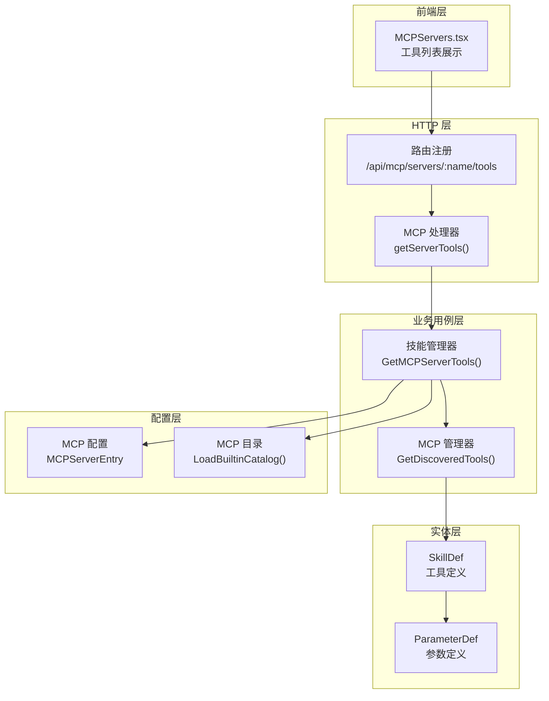
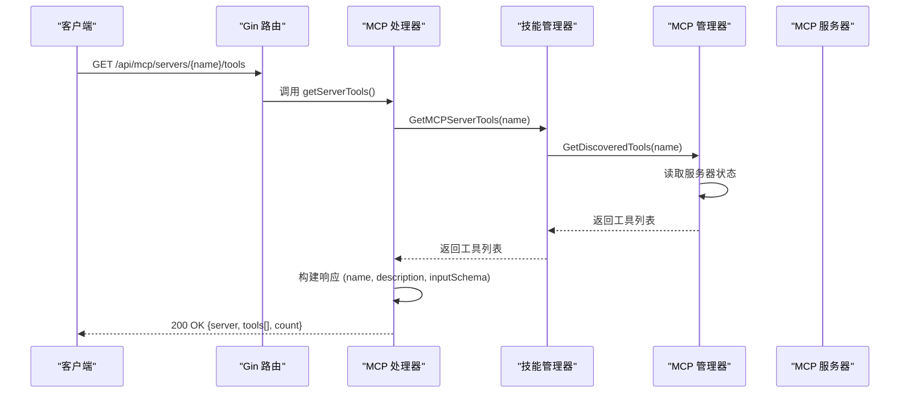
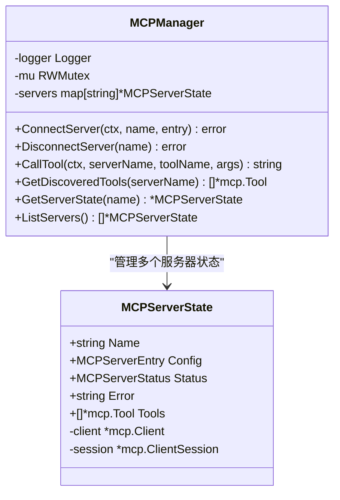
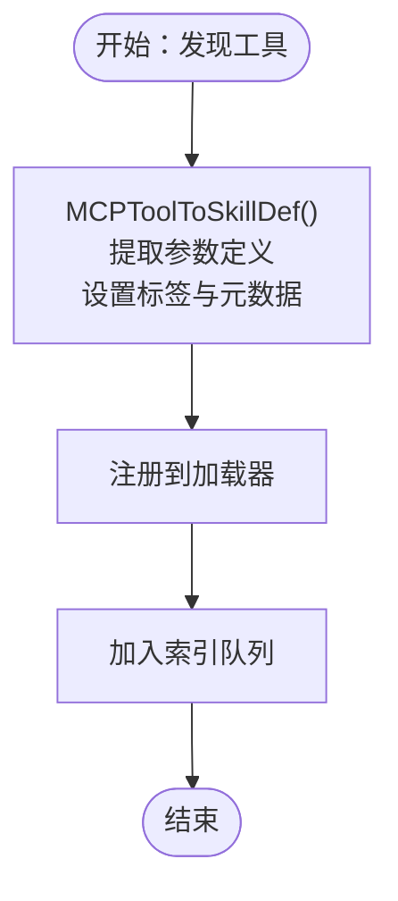
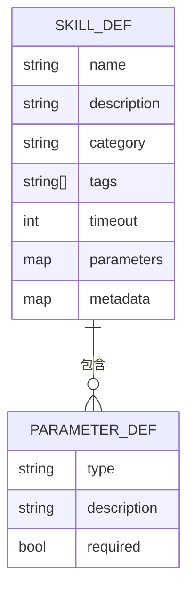
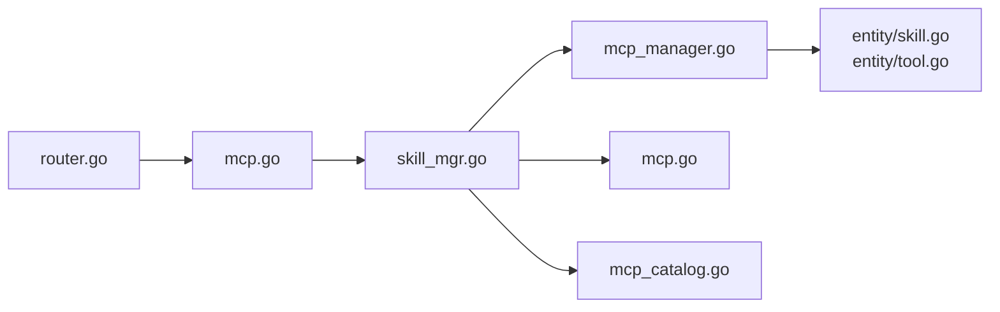
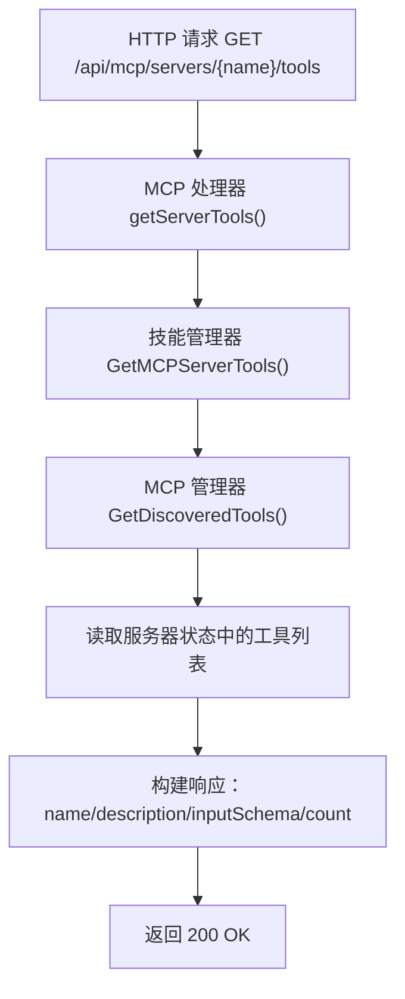

# MCP 工具发现与查询

<cite>
**本文引用的文件**
- [internal/adapters/http/handlers/mcp.go](file://internal/adapters/http/handlers/mcp.go)
- [internal/adapters/http/handlers/router.go](file://internal/adapters/http/handlers/router.go)
- [internal/usecase/skills/mcp_manager.go](file://internal/usecase/skills/mcp_manager.go)
- [internal/usecase/skills/mcp_utils.go](file://internal/usecase/skills/mcp_utils.go)
- [internal/usecase/skills/skill_mgr.go](file://internal/usecase/skills/skill_mgr.go)
- [internal/config/mcp.go](file://internal/config/mcp.go)
- [internal/config/mcp_catalog.go](file://internal/config/mcp_catalog.go)
- [internal/entity/skill.go](file://internal/entity/skill.go)
- [internal/entity/tool.go](file://internal/entity/tool.go)
- [dashboard/src/components/MCPServers.tsx](file://dashboard/src/components/MCPServers.tsx)
- [dashboard/src/components/mcp/types.ts](file://dashboard/src/components/mcp/types.ts)
- [config/mcp_servers.json.template](file://config/mcp_servers.json.template)
</cite>

## 目录
1. [简介](#简介)
2. [项目结构](#项目结构)
3. [核心组件](#核心组件)
4. [架构概览](#架构概览)
5. [详细组件分析](#详细组件分析)
6. [依赖关系分析](#依赖关系分析)
7. [性能考虑](#性能考虑)
8. [故障排除指南](#故障排除指南)
9. [结论](#结论)
10. [附录](#附录)

## 简介
本文档详细介绍了 MindX MCP 工具发现与查询功能，重点围绕 `/api/mcp/servers/{name}/tools` 接口，解释如何查询特定 MCP 服务器提供的工具列表。文档涵盖了工具元数据结构、工作流程、请求响应示例以及工具调用的最佳实践。

## 项目结构
MCP 功能主要分布在以下层次：
- HTTP 层：路由注册与处理器
- 业务用例层：MCP 管理器与技能管理器
- 配置层：MCP 服务器配置与目录
- 实体层：技能与工具定义
- 前端层：MCP 服务器管理界面

**图表来源**
- [internal/adapters/http/handlers/router.go](file://internal/adapters/http/handlers/router.go#L134-L147)
- [internal/adapters/http/handlers/mcp.go](file://internal/adapters/http/handlers/mcp.go#L114-L136)
- [internal/usecase/skills/mcp_manager.go](file://internal/usecase/skills/mcp_manager.go#L217-L227)
- [internal/config/mcp.go](file://internal/config/mcp.go#L17-L29)

**章节来源**
- [internal/adapters/http/handlers/router.go](file://internal/adapters/http/handlers/router.go#L134-L147)
- [internal/adapters/http/handlers/mcp.go](file://internal/adapters/http/handlers/mcp.go#L1-L248)

## 核心组件
本节介绍与工具发现查询直接相关的组件及其职责。

- **MCP 处理器 (MCPHandler)**：负责 HTTP 路由处理，包括列出服务器、添加/删除服务器、重启服务器以及查询特定服务器的工具列表。
- **技能管理器 (SkillMgr)**：协调 MCP 服务器连接与工具发现，将发现的工具转换为内部技能定义，并维护工具注册状态。
- **MCP 管理器 (MCPManager)**：封装 MCP 客户端连接、工具发现、工具调用等底层操作。
- **配置系统**：管理 MCP 服务器配置（命令行、SSE 端点、环境变量等）与目录（内置目录与远程目录合并）。
- **实体模型**：定义技能与参数的结构，用于工具元数据的序列化与前端展示。

**章节来源**
- [internal/adapters/http/handlers/mcp.go](file://internal/adapters/http/handlers/mcp.go#L13-L23)
- [internal/usecase/skills/mcp_manager.go](file://internal/usecase/skills/mcp_manager.go#L36-L47)
- [internal/config/mcp.go](file://internal/config/mcp.go#L13-L29)
- [internal/entity/skill.go](file://internal/entity/skill.go#L6-L25)

## 架构概览
下图展示了工具发现与查询的端到端流程，从 HTTP 请求到 MCP 服务器连接、工具发现，再到响应构建。

**图表来源**
- [internal/adapters/http/handlers/router.go](file://internal/adapters/http/handlers/router.go#L142-L142)
- [internal/adapters/http/handlers/mcp.go](file://internal/adapters/http/handlers/mcp.go#L114-L136)
- [internal/usecase/skills/mcp_manager.go](file://internal/usecase/skills/mcp_manager.go#L217-L227)

## 详细组件分析

### HTTP 路由与处理器
- **路由注册**：在 `/api/mcp/servers` 下注册了工具查询接口 `GET /:name/tools`。
- **处理器实现**：`getServerTools()` 方法从技能管理器获取工具列表，然后将每个工具的名称、描述和输入模式（inputSchema）序列化为响应对象。

关键实现要点：
- 参数校验：从路径中提取服务器名称。
- 错误处理：当工具不存在时返回 404。
- 响应格式：包含服务器名称、工具数组（每项含 name/description/inputSchema）与数量。

**章节来源**
- [internal/adapters/http/handlers/router.go](file://internal/adapters/http/handlers/router.go#L134-L147)
- [internal/adapters/http/handlers/mcp.go](file://internal/adapters/http/handlers/mcp.go#L114-L136)

### MCP 管理器与工具发现
- **连接与发现**：`ConnectServer()` 支持 stdio 与 SSE 两种传输方式；成功连接后调用 `ListTools()` 获取工具清单。
- **工具存储**：发现的工具以 `mcp.Tool` 结构存储在服务器状态中，供后续查询使用。
- **工具查询**：`GetDiscoveredTools()` 提供只读访问，避免并发问题。

**图表来源**
- [internal/usecase/skills/mcp_manager.go](file://internal/usecase/skills/mcp_manager.go#L36-L47)
- [internal/usecase/skills/mcp_manager.go](file://internal/usecase/skills/mcp_manager.go#L25-L34)

**章节来源**
- [internal/usecase/skills/mcp_manager.go](file://internal/usecase/skills/mcp_manager.go#L49-L141)
- [internal/usecase/skills/mcp_manager.go](file://internal/usecase/skills/mcp_manager.go#L217-L227)

### 技能管理器与工具转换
- **工具注册**：`connectAndRegisterMCP()` 连接服务器后获取工具，通过 `MCPToolToSkillDef()` 转换为内部技能定义，并注册到加载器。
- **参数提取**：从 `InputSchema` 中解析参数类型、描述与必填信息，填充到 `ParameterDef`。
- **目录集成**：利用目录中的中文描述与标签覆盖或增强工具元数据。

**图表来源**
- [internal/usecase/skills/skill_mgr.go](file://internal/usecase/skills/skill_mgr.go#L470-L506)
- [internal/usecase/skills/mcp_utils.go](file://internal/usecase/skills/mcp_utils.go#L56-L97)

**章节来源**
- [internal/usecase/skills/skill_mgr.go](file://internal/usecase/skills/skill_mgr.go#L470-L506)
- [internal/usecase/skills/mcp_utils.go](file://internal/usecase/skills/mcp_utils.go#L56-L131)

### 工具元数据结构
工具元数据在系统中以多种形态出现：
- **MCP 工具结构**：来自 MCP 服务器的原始工具定义，包含名称、描述与输入模式。
- **技能定义 (SkillDef)**：内部统一的工具抽象，包含名称、描述、分类、标签、参数、元数据等。
- **参数定义 (ParameterDef)**：描述单个参数的类型、描述与是否必填。

**图表来源**
- [internal/entity/skill.go](file://internal/entity/skill.go#L6-L25)
- [internal/entity/skill.go](file://internal/entity/skill.go#L44-L49)

**章节来源**
- [internal/entity/skill.go](file://internal/entity/skill.go#L6-L25)
- [internal/entity/skill.go](file://internal/entity/skill.go#L44-L49)
- [internal/entity/tool.go](file://internal/entity/tool.go#L4-L10)

### 前端交互与工具展示
- **工具列表获取**：前端组件通过 `/api/mcp/servers/{name}/tools` 获取工具列表，并缓存展开状态。
- **本地化支持**：前端类型定义支持多语言描述的本地化显示。

**章节来源**
- [dashboard/src/components/MCPServers.tsx](file://dashboard/src/components/MCPServers.tsx#L120-L135)
- [dashboard/src/components/mcp/types.ts](file://dashboard/src/components/mcp/types.ts#L3-L6)

## 依赖关系分析
MCP 工具发现涉及以下关键依赖链：
- HTTP 路由 -> 处理器 -> 技能管理器 -> MCP 管理器 -> MCP 服务器
- 技能管理器 -> 配置系统（服务器配置与目录）
- 实体模型 -> 参数提取逻辑

**图表来源**
- [internal/adapters/http/handlers/router.go](file://internal/adapters/http/handlers/router.go#L134-L147)
- [internal/adapters/http/handlers/mcp.go](file://internal/adapters/http/handlers/mcp.go#L114-L136)
- [internal/usecase/skills/skill_mgr.go](file://internal/usecase/skills/skill_mgr.go#L470-L506)
- [internal/usecase/skills/mcp_manager.go](file://internal/usecase/skills/mcp_manager.go#L217-L227)
- [internal/config/mcp.go](file://internal/config/mcp.go#L17-L29)
- [internal/config/mcp_catalog.go](file://internal/config/mcp_catalog.go#L58-L90)
- [internal/entity/skill.go](file://internal/entity/skill.go#L6-L25)
- [internal/entity/tool.go](file://internal/entity/tool.go#L4-L10)

**章节来源**
- [internal/adapters/http/handlers/router.go](file://internal/adapters/http/handlers/router.go#L134-L147)
- [internal/adapters/http/handlers/mcp.go](file://internal/adapters/http/handlers/mcp.go#L1-L248)
- [internal/usecase/skills/mcp_manager.go](file://internal/usecase/skills/mcp_manager.go#L1-L292)
- [internal/config/mcp.go](file://internal/config/mcp.go#L1-L106)
- [internal/config/mcp_catalog.go](file://internal/config/mcp_catalog.go#L1-L252)
- [internal/entity/skill.go](file://internal/entity/skill.go#L1-L83)
- [internal/entity/tool.go](file://internal/entity/tool.go#L1-L11)

## 性能考虑
- **连接复用**：MCP 管理器维护服务器会话，避免重复连接带来的开销。
- **并发安全**：使用读写锁保护服务器状态，确保高并发下的数据一致性。
- **超时控制**：工具调用采用超时机制，防止长时间阻塞影响用户体验。
- **重试策略**：对可重试的连接错误进行指数退避重试，提高稳定性。

[本节为通用性能讨论，无需具体文件来源]

## 故障排除指南
常见问题与排查建议：
- **服务器未找到**：确认服务器名称正确且已在配置中注册。
- **连接失败**：检查命令行参数、SSE 端点、认证头与环境变量。
- **工具发现失败**：查看 MCP 服务器日志，确认其支持工具发现协议。
- **工具调用错误**：验证输入参数与必填字段，检查服务器返回内容。

**章节来源**
- [internal/usecase/skills/mcp_manager.go](file://internal/usecase/skills/mcp_manager.go#L106-L141)
- [internal/usecase/skills/mcp_manager.go](file://internal/usecase/skills/mcp_manager.go#L170-L204)
- [internal/usecase/skills/skill_mgr.go](file://internal/usecase/skills/skill_mgr.go#L451-L468)

## 结论
MCP 工具发现与查询功能通过清晰的分层架构实现了从 HTTP 请求到 MCP 服务器工具发现的完整闭环。处理器负责接口契约，管理器负责连接与发现，配置与目录提供元数据支撑，实体模型保证跨层的数据一致性。该设计既满足了易用性需求，又具备良好的扩展性与稳定性。

[本节为总结性内容，无需具体文件来源]

## 附录

### API 规范：查询特定 MCP 服务器的工具列表
- **端点**：`GET /api/mcp/servers/{name}/tools`
- **路径参数**：
  - `name`：MCP 服务器名称
- **响应体字段**：
  - `server`：服务器名称
  - `tools`：工具数组，每项包含：
    - `name`：工具名称
    - `description`：工具描述
    - `inputSchema`：输入模式（JSON Schema）
  - `count`：工具总数
- **状态码**：
  - `200 OK`：成功
  - `404 Not Found`：服务器不存在或工具未发现

**章节来源**
- [internal/adapters/http/handlers/router.go](file://internal/adapters/http/handlers/router.go#L142-L142)
- [internal/adapters/http/handlers/mcp.go](file://internal/adapters/http/handlers/mcp.go#L114-L136)

### 工具元数据结构详解
- **技能定义 (SkillDef)**：
  - 字段：名称、描述、分类、标签、超时、参数、元数据
  - 用途：统一内部工具抽象，便于索引与执行
- **参数定义 (ParameterDef)**：
  - 字段：类型、描述、是否必填
  - 来源：从工具的输入模式（InputSchema）解析
- **MCP 工具 (mcp.Tool)**：
  - 字段：名称、描述、输入模式（InputSchema）
  - 来源：MCP 服务器工具发现

**章节来源**
- [internal/entity/skill.go](file://internal/entity/skill.go#L6-L25)
- [internal/entity/skill.go](file://internal/entity/skill.go#L44-L49)
- [internal/usecase/skills/mcp_utils.go](file://internal/usecase/skills/mcp_utils.go#L56-L131)

### 工具发现工作流程

**图表来源**
- [internal/adapters/http/handlers/mcp.go](file://internal/adapters/http/handlers/mcp.go#L114-L136)
- [internal/usecase/skills/mcp_manager.go](file://internal/usecase/skills/mcp_manager.go#L217-L227)

### 前端最佳实践
- **工具列表展示**：使用前端组件按需加载工具详情，避免一次性渲染大量数据。
- **本地化处理**：利用目录中的多语言描述，根据用户语言动态选择显示文本。
- **错误提示**：对工具获取失败进行友好提示，并提供重试机制。

**章节来源**
- [dashboard/src/components/MCPServers.tsx](file://dashboard/src/components/MCPServers.tsx#L120-L135)
- [dashboard/src/components/mcp/types.ts](file://dashboard/src/components/mcp/types.ts#L38-L46)

### 配置与目录
- **服务器配置**：支持 stdio（本地子进程）与 SSE（远端 HTTP SSE）两种传输方式，可配置命令、参数、环境变量与认证头。
- **目录系统**：内置目录提供预设的 MCP 服务器模板，支持远程目录合并与变量替换。

**章节来源**
- [internal/config/mcp.go](file://internal/config/mcp.go#L17-L29)
- [internal/config/mcp_catalog.go](file://internal/config/mcp_catalog.go#L58-L90)
- [config/mcp_servers.json.template](file://config/mcp_servers.json.template#L1-L4)