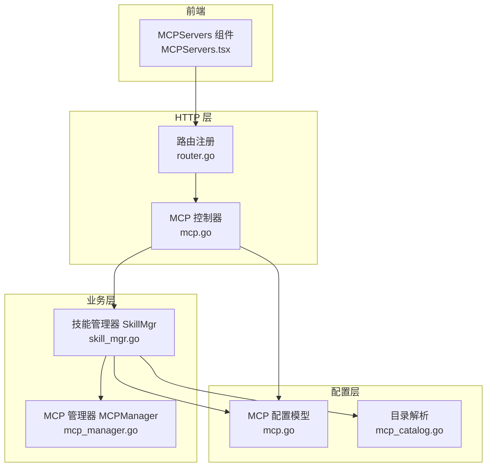
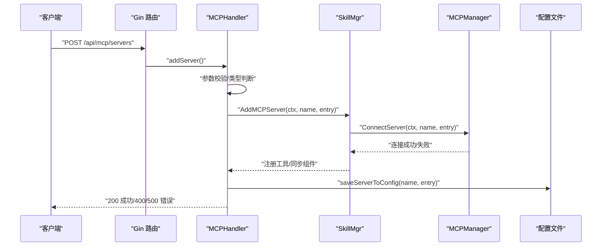
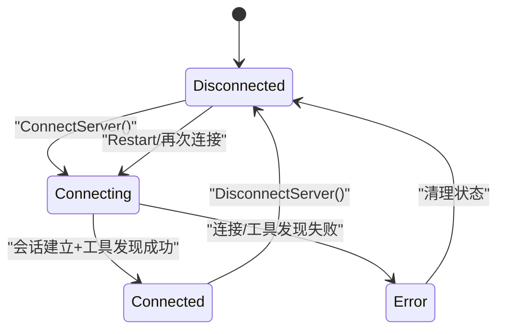
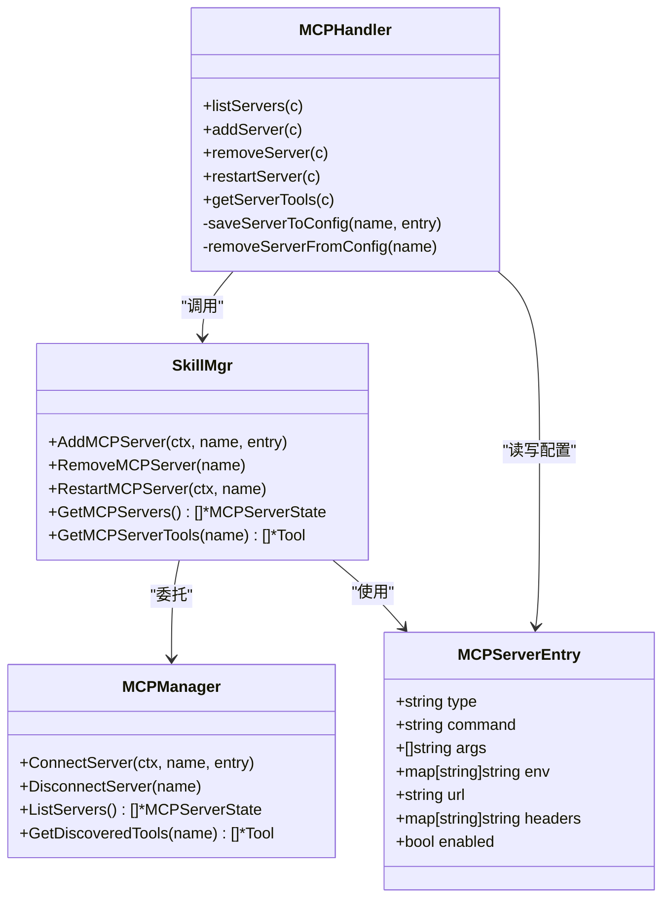

# MCP 服务器管理

<cite>
**本文引用的文件**
- [internal/adapters/http/handlers/mcp.go](file://internal/adapters/http/handlers/mcp.go)
- [internal/adapters/http/handlers/router.go](file://internal/adapters/http/handlers/router.go)
- [internal/usecase/skills/skill_mgr.go](file://internal/usecase/skills/skill_mgr.go)
- [internal/usecase/skills/mcp_manager.go](file://internal/usecase/skills/mcp_manager.go)
- [internal/config/mcp.go](file://internal/config/mcp.go)
- [internal/config/mcp_catalog.go](file://internal/config/mcp_catalog.go)
- [dashboard/src/components/MCPServers.tsx](file://dashboard/src/components/MCPServers.tsx)
- [config/mcp_servers.json.template](file://config/mcp_servers.json.template)
</cite>

## 目录
1. [简介](#简介)
2. [项目结构](#项目结构)
3. [核心组件](#核心组件)
4. [架构总览](#架构总览)
5. [详细组件分析](#详细组件分析)
6. [依赖关系分析](#依赖关系分析)
7. [性能与可靠性](#性能与可靠性)
8. [故障排查指南](#故障排查指南)
9. [结论](#结论)

## 简介
本文件为 MindX MCP 服务器管理功能的详细 API 文档，覆盖以下内容：
- MCP 服务器的增删改查操作：/api/mcp/servers 列表、新增、删除、重启
- MCP 服务器配置参数：stdio 类型的 command、args、env 与 SSE 类型的 url、headers
- 服务器状态管理与连接生命周期
- 请求响应示例、配置验证规则、错误处理机制、配置持久化策略
- 服务器连接状态监控与故障恢复机制

## 项目结构
MCP 服务器管理由三层组成：
- HTTP 层：路由与控制器，负责接收请求、参数校验、调用业务层、持久化配置
- 业务层：技能管理器，负责连接/断开/重启 MCP 服务器、注册工具、同步组件
- 配置层：MCP 配置模型与目录解析，负责配置读写与目录项解析

**图表来源**
- [internal/adapters/http/handlers/router.go](file://internal/adapters/http/handlers/router.go#L134-L147)
- [internal/adapters/http/handlers/mcp.go](file://internal/adapters/http/handlers/mcp.go#L1-L247)
- [internal/usecase/skills/skill_mgr.go](file://internal/usecase/skills/skill_mgr.go#L470-L558)
- [internal/usecase/skills/mcp_manager.go](file://internal/usecase/skills/mcp_manager.go#L49-L141)
- [internal/config/mcp.go](file://internal/config/mcp.go#L13-L80)
- [internal/config/mcp_catalog.go](file://internal/config/mcp_catalog.go#L119-L161)

**章节来源**
- [internal/adapters/http/handlers/router.go](file://internal/adapters/http/handlers/router.go#L134-L147)
- [internal/adapters/http/handlers/mcp.go](file://internal/adapters/http/handlers/mcp.go#L1-L247)

## 核心组件
- HTTP 控制器：提供 /api/mcp/servers 的 GET/POST/DELETE/POST/:name/restart 以及 /api/mcp/catalog 的 GET/POST 接口
- 技能管理器：封装 MCP 服务器连接、工具注册、重启、状态查询等业务逻辑
- MCP 管理器：具体实现 MCP 连接（stdio/SSE）、会话管理、工具发现、状态维护
- 配置模型：MCPServerEntry、MCPServersConfig；目录解析与变量替换
- 前端组件：MCPServers.tsx 提供 UI 交互，调用上述 API

**章节来源**
- [internal/adapters/http/handlers/mcp.go](file://internal/adapters/http/handlers/mcp.go#L13-L136)
- [internal/usecase/skills/skill_mgr.go](file://internal/usecase/skills/skill_mgr.go#L508-L558)
- [internal/usecase/skills/mcp_manager.go](file://internal/usecase/skills/mcp_manager.go#L25-L141)
- [internal/config/mcp.go](file://internal/config/mcp.go#L13-L80)
- [internal/config/mcp_catalog.go](file://internal/config/mcp_catalog.go#L119-L161)
- [dashboard/src/components/MCPServers.tsx](file://dashboard/src/components/MCPServers.tsx#L62-L280)

## 架构总览
MCP 服务器管理采用“HTTP 控制器 -> 业务层 -> 配置/连接”的分层架构。HTTP 层负责输入校验与持久化，业务层负责连接生命周期与工具注册，配置层负责配置文件读写与目录解析。

**图表来源**
- [internal/adapters/http/handlers/mcp.go](file://internal/adapters/http/handlers/mcp.go#L33-L90)
- [internal/usecase/skills/skill_mgr.go](file://internal/usecase/skills/skill_mgr.go#L508-L514)
- [internal/usecase/skills/mcp_manager.go](file://internal/usecase/skills/mcp_manager.go#L49-L141)
- [internal/config/mcp.go](file://internal/config/mcp.go#L66-L80)

## 详细组件分析

### HTTP 接口定义与行为

- 列表接口
  - 方法与路径：GET /api/mcp/servers
  - 功能：返回所有 MCP 服务器的状态列表（含名称、配置、状态、错误、工具数量等）
  - 响应：包含 servers 数组与 count 字段
  - 示例响应片段：
    - servers: [{ name, config, status, error, tools }]
    - count: 服务器数量

- 新增服务器接口
  - 方法与路径：POST /api/mcp/servers
  - 请求体字段：
    - name: 必填
    - type: 可选，默认 stdio
    - stdio 类型：command 必填；args/env 可选
    - sse 类型：url 必填；headers 可选
    - enabled: 可选布尔值
  - 行为：
    - 校验必填字段（type=stdio 时要求 command，type=sse 时要求 url）
    - 调用业务层 AddMCPServer
    - 立即持久化到配置文件（mcp_servers.json）
  - 成功：200 {"message","name"}
  - 参数错误：400 {"error": "..."}
  - 连接失败：500 {"error": "..."}

- 删除服务器接口
  - 方法与路径：DELETE /api/mcp/servers/:name
  - 行为：调用业务层 RemoveMCPServer，然后从配置文件移除对应条目
  - 成功：200 {"message","name"}

- 重启服务器接口
  - 方法与路径：POST /api/mcp/servers/:name/restart
  - 行为：调用业务层 RestartMCPServer，内部先注销旧工具，再按原配置重新连接并注册工具
  - 成功：200 {"message","name"}
  - 失败：500 {"error": "..."}

- 查询服务器工具接口
  - 方法与路径：GET /api/mcp/servers/:name/tools
  - 行为：返回该服务器已发现的工具列表（名称、描述、输入模式）
  - 成功：200 {"server","tools":[{name,description,inputSchema}], "count"}

- 目录市场接口
  - GET /api/mcp/catalog：返回内置目录与已安装服务器标识
  - POST /api/mcp/catalog/install：根据目录项与变量解析为 MCPServerEntry，持久化配置并异步连接

**章节来源**
- [internal/adapters/http/handlers/mcp.go](file://internal/adapters/http/handlers/mcp.go#L25-L136)
- [internal/adapters/http/handlers/router.go](file://internal/adapters/http/handlers/router.go#L134-L147)

### 配置模型与持久化

- 配置结构
  - MCPServersConfig：包含 mcpServers 映射
  - MCPServerEntry：
    - type: "stdio" 或 "sse"（默认 stdio）
    - stdio：command、args[]、env map
    - sse：url、headers map
    - enabled: 布尔值
- 加载与保存
  - LoadMCPServersConfig：从工作区配置目录读取 mcp_servers.json，不存在则返回空配置
  - SaveMCPServersConfig：将配置写回 mcp_servers.json
- 环境变量解析
  - ResolveEnvVars/ResolveEnvVarsWithContext：支持 ${VAR} 占位符解析，优先使用本地上下文，再回退到系统环境

**章节来源**
- [internal/config/mcp.go](file://internal/config/mcp.go#L13-L80)
- [internal/config/mcp.go](file://internal/config/mcp.go#L82-L105)
- [config/mcp_servers.json.template](file://config/mcp_servers.json.template#L1-L3)

### 连接生命周期与状态管理

- 状态枚举
  - connected：已建立会话并完成工具发现
  - disconnected：未连接
  - error：连接或工具发现失败
- 生命周期步骤
  - 连接：根据 type 选择 SSE 或 stdio 传输，建立会话，记录状态与错误
  - 工具发现：调用 ListTools 获取工具列表，记录到状态
  - 断开：关闭会话，清空 client/session，重置状态
  - 重启：注销旧工具，按原配置重新连接并注册
  - 移除：断开连接并从内存中删除
- SSE 认证
  - 支持在 headers 中使用 ${VAR} 占位符，并通过 headerRoundTripper 注入到 HTTP 请求头

**图表来源**
- [internal/usecase/skills/mcp_manager.go](file://internal/usecase/skills/mcp_manager.go#L17-L34)
- [internal/usecase/skills/mcp_manager.go](file://internal/usecase/skills/mcp_manager.go#L49-L141)
- [internal/usecase/skills/mcp_manager.go](file://internal/usecase/skills/mcp_manager.go#L143-L167)

**章节来源**
- [internal/usecase/skills/mcp_manager.go](file://internal/usecase/skills/mcp_manager.go#L17-L34)
- [internal/usecase/skills/mcp_manager.go](file://internal/usecase/skills/mcp_manager.go#L49-L167)

### 工具注册与目录集成

- 工具注册流程
  - 连接成功后调用 ListTools 获取工具
  - 从目录获取中文描述与标签，覆盖/增强工具描述与关键词
  - 将工具转换为技能定义并注册到技能加载器
  - 触发索引队列生成向量索引
- 目录解析
  - 支持内置目录与远程目录合并，远程条目覆盖同 ID 的内置条目
  - 变量解析：支持 ${VAR} 占位符，按变量类型（string/secret/path/url）与是否必填进行校验

**章节来源**
- [internal/usecase/skills/skill_mgr.go](file://internal/usecase/skills/skill_mgr.go#L470-L506)
- [internal/config/mcp_catalog.go](file://internal/config/mcp_catalog.go#L58-L161)

### 错误处理与重试机制

- 参数校验
  - type=stdio 时必须提供 command
  - type=sse 时必须提供 url
  - 目录安装时对 Required 变量进行校验，必要时使用默认值
- 连接错误分类
  - 可重试：超时、I/O 超时、连接拒绝
  - 不可重试：EOF、方法不允许等
- 重试策略
  - 达到最大尝试次数前按线性延迟重试
  - 达到上限后记录警告并跳过

**章节来源**
- [internal/adapters/http/handlers/mcp.go](file://internal/adapters/http/handlers/mcp.go#L57-L69)
- [internal/adapters/http/handlers/mcp.go](file://internal/adapters/http/handlers/mcp.go#L213-L229)
- [internal/usecase/skills/skill_mgr.go](file://internal/usecase/skills/skill_mgr.go#L427-L468)

## 依赖关系分析

**图表来源**
- [internal/adapters/http/handlers/mcp.go](file://internal/adapters/http/handlers/mcp.go#L13-L160)
- [internal/usecase/skills/skill_mgr.go](file://internal/usecase/skills/skill_mgr.go#L508-L558)
- [internal/usecase/skills/mcp_manager.go](file://internal/usecase/skills/mcp_manager.go#L25-L141)
- [internal/config/mcp.go](file://internal/config/mcp.go#L17-L29)

**章节来源**
- [internal/adapters/http/handlers/mcp.go](file://internal/adapters/http/handlers/mcp.go#L13-L160)
- [internal/usecase/skills/skill_mgr.go](file://internal/usecase/skills/skill_mgr.go#L508-L558)
- [internal/usecase/skills/mcp_manager.go](file://internal/usecase/skills/mcp_manager.go#L25-L141)
- [internal/config/mcp.go](file://internal/config/mcp.go#L17-L29)

## 性能与可靠性

- 连接超时与重试
  - 对于超时、网络瞬断等可重试错误，按尝试次数递增延迟重试，避免频繁抖动
- SSE 认证与环境变量
  - SSE headers 支持 ${VAR} 占位符解析，减少硬编码，提高灵活性
- 工具发现与索引
  - 工具发现完成后立即注册并进入索引队列，缩短可用时间
- 配置持久化
  - 新增/删除均实时写入配置文件，保证重启后状态一致

[本节为通用建议，无需特定文件来源]

## 故障排查指南

- 常见错误与定位
  - 400 参数错误：检查 type 与必填字段（stdio 的 command、sse 的 url）
  - 500 连接失败：查看服务器状态与错误信息，确认命令可执行、URL 可访问、认证头正确
  - 重启失败：确认服务器名称存在且当前状态可重启
- 日志与状态
  - 服务器状态包含 error 字段，可用于快速定位问题
  - SSE 认证失败通常表现为连接阶段报错
- 建议排查步骤
  - 检查配置文件 mcp_servers.json 是否正确
  - 尝试手动连接（stdio：检查命令与权限；sse：检查 URL 与 headers）
  - 查看系统日志与服务器输出

**章节来源**
- [internal/adapters/http/handlers/mcp.go](file://internal/adapters/http/handlers/mcp.go#L47-L84)
- [internal/usecase/skills/mcp_manager.go](file://internal/usecase/skills/mcp_manager.go#L105-L114)
- [internal/usecase/skills/mcp_manager.go](file://internal/usecase/skills/mcp_manager.go#L143-L167)

## 结论
MindX 的 MCP 服务器管理提供了完善的增删改查、配置持久化与连接生命周期管理。通过清晰的分层架构与严格的参数校验、错误分类与重试策略，系统在易用性与稳定性之间取得良好平衡。结合目录市场与工具自动注册，用户可以快速扩展 MCP 生态。