# MCP 目录市场管理

<cite>
**本文档引用的文件**
- [internal/adapters/http/handlers/mcp.go](file://internal/adapters/http/handlers/mcp.go)
- [internal/adapters/http/handlers/router.go](file://internal/adapters/http/handlers/router.go)
- [internal/config/mcp_catalog.go](file://internal/config/mcp_catalog.go)
- [internal/config/mcp.go](file://internal/config/mcp.go)
- [internal/usecase/skills/mcp_manager.go](file://internal/usecase/skills/mcp_manager.go)
- [internal/usecase/skills/skill_mgr.go](file://internal/usecase/skills/skill_mgr.go)
- [internal/config/catalog/mcp_catalog.json](file://internal/config/catalog/mcp_catalog.json)
- [dashboard/src/components/mcp/types.ts](file://dashboard/src/components/mcp/types.ts)
- [dashboard/src/components/mcp/CatalogGrid.tsx](file://dashboard/src/components/mcp/CatalogGrid.tsx)
- [dashboard/src/components/mcp/CatalogInstallDialog.tsx](file://dashboard/src/components/mcp/CatalogInstallDialog.tsx)
- [config/mcp_servers.json.template](file://config/mcp_servers.json.template)
</cite>

## 目录
1. [简介](#简介)
2. [项目结构](#项目结构)
3. [核心组件](#核心组件)
4. [架构概览](#架构概览)
5. [详细组件分析](#详细组件分析)
6. [依赖关系分析](#依赖关系分析)
7. [性能考虑](#性能考虑)
8. [故障排除指南](#故障排除指南)
9. [结论](#结论)

## 简介

MindX MCP 目录市场管理功能是一个完整的 MCP（Model Context Protocol）服务器目录管理系统，提供了 MCP 目录查询接口和一键安装功能。该系统允许用户浏览 MCP 服务器目录、查看服务器详细信息、一键安装 MCP 服务器，并管理已安装的 MCP 服务器。

系统采用前后端分离架构，后端使用 Go 语言实现，前端使用 React 构建用户界面。核心功能包括：

- **目录查询接口**：提供 `/api/mcp/catalog` 接口获取 MCP 服务器目录列表
- **一键安装功能**：提供 `/api/mcp/catalog/install` 接口实现 MCP 服务器的一键安装
- **目录条目管理**：支持目录条目的结构化管理和变量配置机制
- **版本管理和同步**：支持内置目录和远程目录的合并与同步
- **安装流程管理**：提供完整的 MCP 服务器安装、连接、工具发现和管理流程

## 项目结构

系统采用分层架构设计，主要分为以下几个层次：

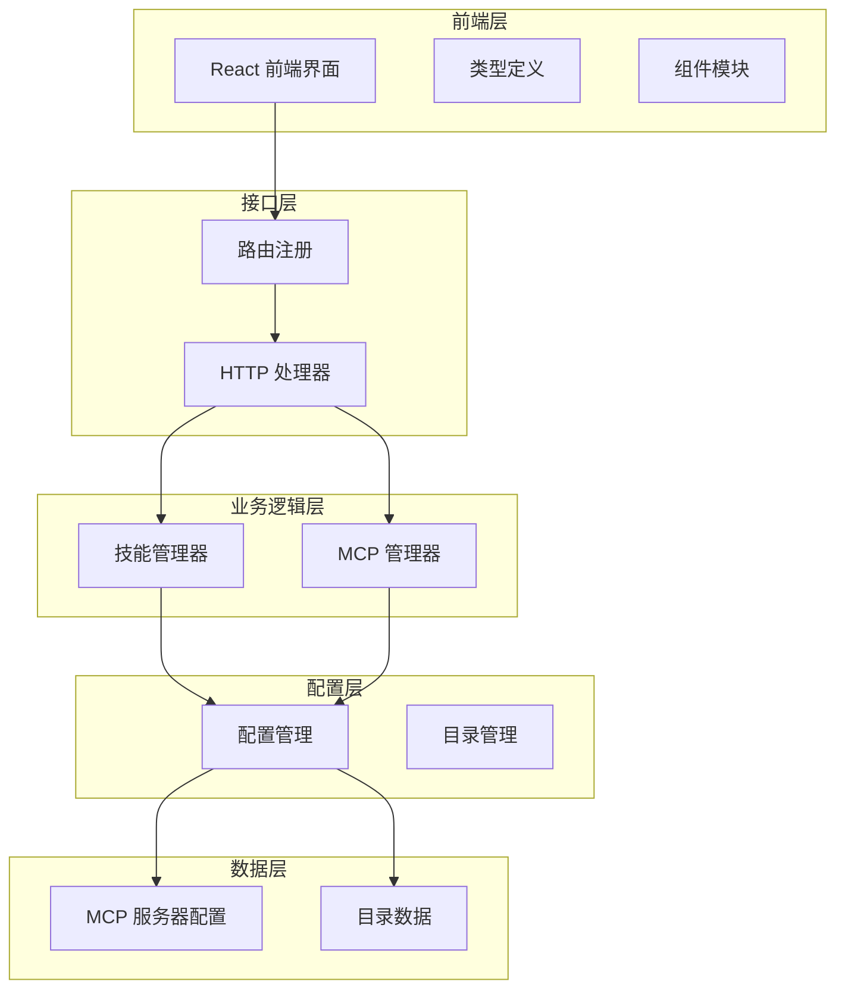

**图表来源**
- [internal/adapters/http/handlers/router.go](file://internal/adapters/http/handlers/router.go#L18-L149)
- [internal/adapters/http/handlers/mcp.go](file://internal/adapters/http/handlers/mcp.go#L1-L248)

**章节来源**
- [internal/adapters/http/handlers/router.go](file://internal/adapters/http/handlers/router.go#L18-L149)
- [internal/adapters/http/handlers/mcp.go](file://internal/adapters/http/handlers/mcp.go#L1-L248)

## 核心组件

### 1. HTTP 处理器层

HTTP 处理器负责处理 MCP 相关的 HTTP 请求，提供 RESTful API 接口。

**核心处理器结构**：
- `MCPHandler`：MCP 相关的 HTTP 处理器
- 提供目录查询、服务器管理、工具查询等功能

**主要接口**：
- `getCatalog()`：获取 MCP 目录列表
- `installFromCatalog()`：从目录一键安装 MCP 服务器
- `listServers()`：列出已安装的 MCP 服务器
- `addServer()`：添加新的 MCP 服务器
- `removeServer()`：移除 MCP 服务器

### 2. 配置管理层

配置管理层负责管理 MCP 服务器的配置和目录数据。

**核心配置结构**：
- `MCPServersConfig`：MCP 服务器配置集合
- `MCPServerEntry`：单个 MCP 服务器配置
- `MCPCatalog`：MCP 目录结构
- `CatalogEntry`：目录条目结构

### 3. 业务逻辑层

业务逻辑层实现了 MCP 服务器的连接、管理和工具发现功能。

**核心管理器**：
- `SkillMgr`：技能管理器，包含 MCP 管理功能
- `MCPManager`：MCP 服务器管理器

### 4. 前端组件层

前端组件提供了用户友好的界面来管理 MCP 服务器。

**核心组件**：
- `CatalogGrid`：目录网格展示组件
- `CatalogInstallDialog`：安装对话框组件
- `MCPServers`：MCP 服务器管理组件

**章节来源**
- [internal/adapters/http/handlers/mcp.go](file://internal/adapters/http/handlers/mcp.go#L13-L248)
- [internal/config/mcp.go](file://internal/config/mcp.go#L13-L106)
- [internal/config/mcp_catalog.go](file://internal/config/mcp_catalog.go#L16-L56)
- [internal/usecase/skills/mcp_manager.go](file://internal/usecase/skills/mcp_manager.go#L36-L47)

## 架构概览

系统采用分层架构，各层职责明确，耦合度低，便于维护和扩展。

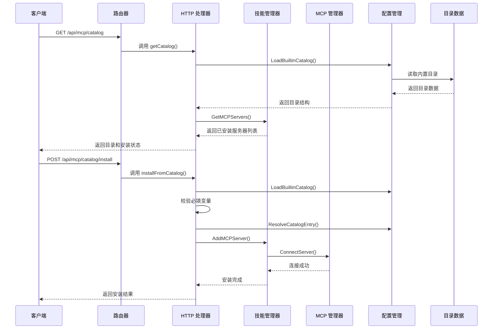

**图表来源**
- [internal/adapters/http/handlers/router.go](file://internal/adapters/http/handlers/router.go#L145-L147)
- [internal/adapters/http/handlers/mcp.go](file://internal/adapters/http/handlers/mcp.go#L162-L247)
- [internal/usecase/skills/skill_mgr.go](file://internal/usecase/skills/skill_mgr.go#L470-L514)

## 详细组件分析

### 目录查询接口

目录查询接口提供 MCP 服务器目录的查询功能，支持获取内置目录和远程目录的合并结果。

**接口定义**：
- **URL**: `/api/mcp/catalog`
- **方法**: GET
- **功能**: 获取 MCP 服务器目录列表和已安装状态

**响应结构**：
```json
{
  "servers": [
    {
      "id": "string",
      "name": {"zh": "string", "en": "string"},
      "description": {"zh": "string", "en": "string"},
      "icon": "string",
      "category": "string",
      "tags": ["string"],
      "author": "string",
      "homepage": "string",
      "connection": {
        "type": "string",
        "command": "string",
        "args": ["string"],
        "url": "string",
        "headers": {"string": "string"},
        "env": {"string": "string"}
      },
      "variables": [
        {
          "key": "string",
          "label": {"zh": "string", "en": "string"},
          "description": {"zh": "string", "en": "string"},
          "type": "string",
          "required": true,
          "default": "string"
        }
      ],
      "tools": [
        {
          "name": "string",
          "description": {"zh": "string", "en": "string"}
        }
      ]
    }
  ],
  "installed": ["string"]
}
```

**实现流程**：
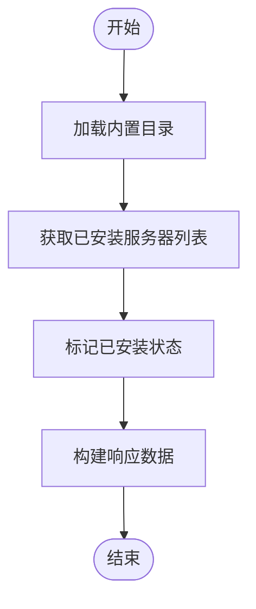

**图表来源**
- [internal/adapters/http/handlers/mcp.go](file://internal/adapters/http/handlers/mcp.go#L162-L181)

**章节来源**
- [internal/adapters/http/handlers/mcp.go](file://internal/adapters/http/handlers/mcp.go#L162-L181)
- [internal/config/mcp_catalog.go](file://internal/config/mcp_catalog.go#L58-L65)

### 一键安装功能

一键安装功能允许用户从目录中选择 MCP 服务器并进行安装，支持变量配置和必填验证。

**接口定义**：
- **URL**: `/api/mcp/catalog/install`
- **方法**: POST
- **功能**: 从目录一键安装 MCP 服务器

**请求结构**：
```json
{
  "id": "string",
  "variables": {
    "key": "value"
  }
}
```

**安装流程**：
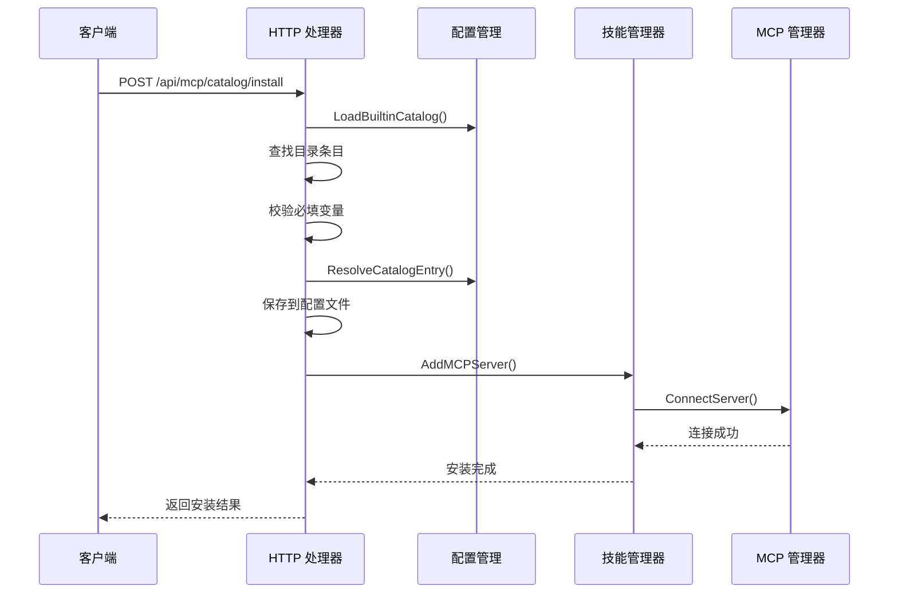

**图表来源**
- [internal/adapters/http/handlers/mcp.go](file://internal/adapters/http/handlers/mcp.go#L183-L247)
- [internal/config/mcp_catalog.go](file://internal/config/mcp_catalog.go#L119-L161)

**章节来源**
- [internal/adapters/http/handlers/mcp.go](file://internal/adapters/http/handlers/mcp.go#L183-L247)
- [internal/config/mcp_catalog.go](file://internal/config/mcp_catalog.go#L119-L161)

### 目录条目结构

目录条目定义了 MCP 服务器的完整描述和配置信息。

**目录条目结构**：
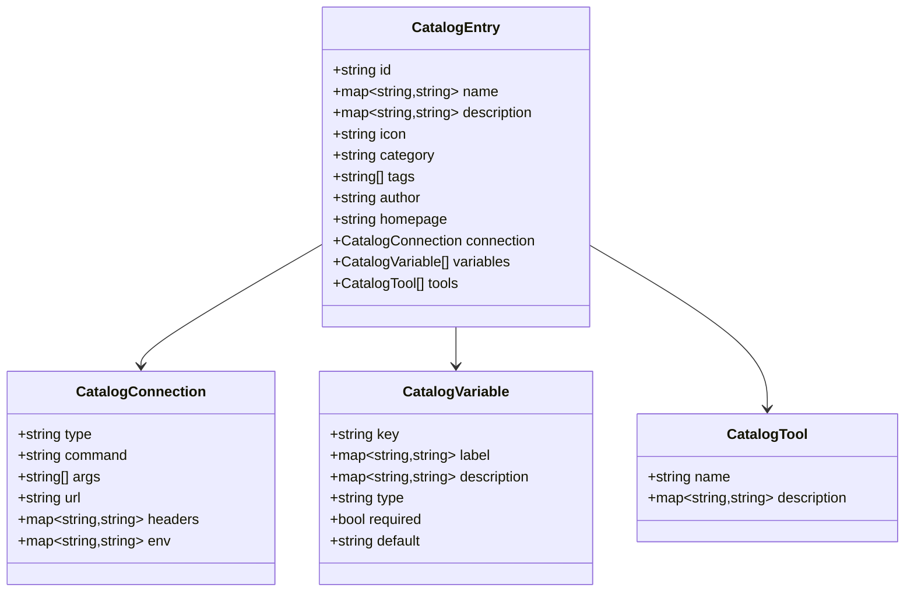

**图表来源**
- [internal/config/mcp_catalog.go](file://internal/config/mcp_catalog.go#L21-L56)

**章节来源**
- [internal/config/mcp_catalog.go](file://internal/config/mcp_catalog.go#L21-L56)

### 变量配置机制

系统支持灵活的变量配置机制，允许目录条目中定义可配置的参数。

**变量类型**：
- `string`：普通字符串变量
- `secret`：敏感变量，前端显示为密码输入框
- `path`：路径变量
- `url`：URL 变量

**变量处理流程**：
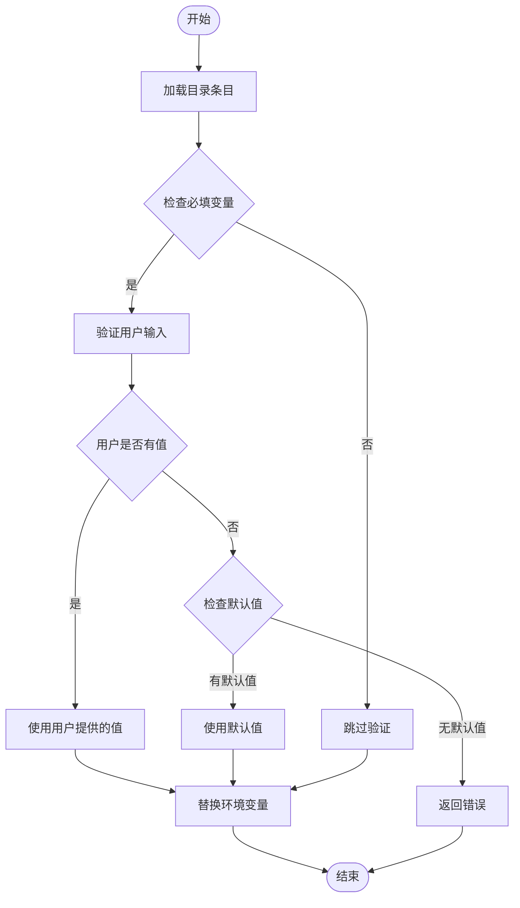

**图表来源**
- [internal/adapters/http/handlers/mcp.go](file://internal/adapters/http/handlers/mcp.go#L213-L229)
- [internal/config/mcp_catalog.go](file://internal/config/mcp_catalog.go#L119-L161)

**章节来源**
- [internal/adapters/http/handlers/mcp.go](file://internal/adapters/http/handlers/mcp.go#L213-L229)
- [internal/config/mcp_catalog.go](file://internal/config/mcp_catalog.go#L44-L51)

### 必填变量验证和默认值处理

系统实现了严格的必填变量验证机制，确保安装过程的可靠性。

**验证规则**：
1. 检查目录条目中定义的必填变量
2. 验证用户提供的变量值
3. 使用默认值替代空值
4. 对于仍为空的必填变量，返回错误

**默认值处理流程**：
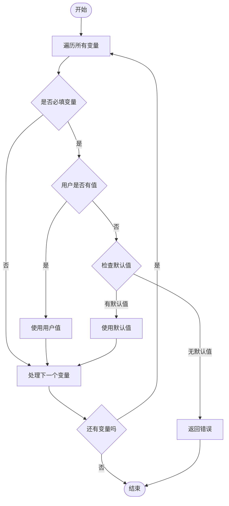

**图表来源**
- [internal/adapters/http/handlers/mcp.go](file://internal/adapters/http/handlers/mcp.go#L213-L229)

**章节来源**
- [internal/adapters/http/handlers/mcp.go](file://internal/adapters/http/handlers/mcp.go#L213-L229)

### 目录同步策略

系统支持内置目录和远程目录的同步，提供灵活的目录管理策略。

**同步策略**：
1. **内置目录**：系统自带的标准 MCP 服务器目录
2. **远程目录**：用户可配置的外部 MCP 服务器目录
3. **合并策略**：远程目录覆盖同 ID 的内置条目，新增条目追加到末尾

**合并算法**：
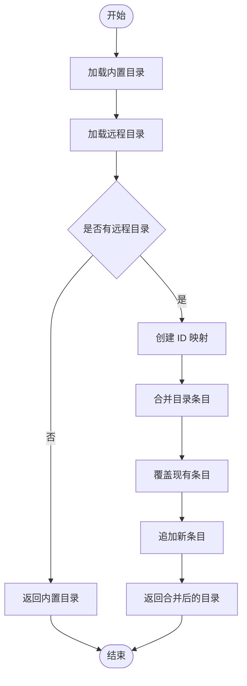

**图表来源**
- [internal/config/mcp_catalog.go](file://internal/config/mcp_catalog.go#L92-L117)

**章节来源**
- [internal/config/mcp_catalog.go](file://internal/config/mcp_catalog.go#L92-L117)

### 版本管理

系统实现了目录版本管理机制，确保目录数据的兼容性和一致性。

**版本管理特性**：
- **版本号**：目录数据包含版本信息
- **向后兼容**：新版本保持对旧版本的兼容
- **升级策略**：支持版本升级和降级

**版本处理流程**：
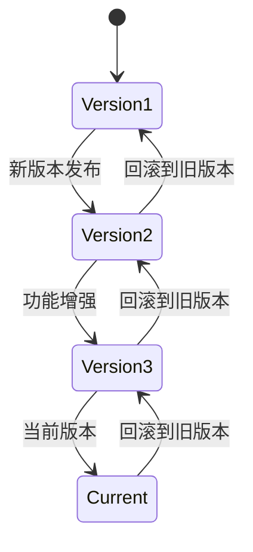

**章节来源**
- [internal/config/mcp_catalog.go](file://internal/config/mcp_catalog.go#L16-L19)

### 安装流程

系统提供了完整的 MCP 服务器安装流程，包括连接、工具发现和注册。

**安装流程**：
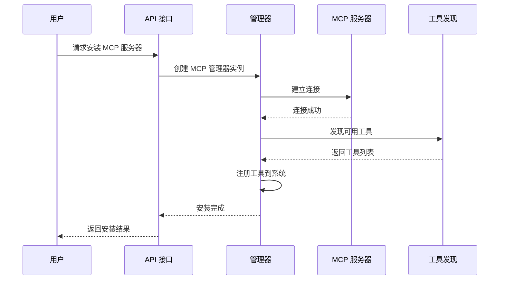

**图表来源**
- [internal/usecase/skills/skill_mgr.go](file://internal/usecase/skills/skill_mgr.go#L470-L506)
- [internal/usecase/skills/mcp_manager.go](file://internal/usecase/skills/mcp_manager.go#L49-L141)

**章节来源**
- [internal/usecase/skills/skill_mgr.go](file://internal/usecase/skills/skill_mgr.go#L470-L506)
- [internal/usecase/skills/mcp_manager.go](file://internal/usecase/skills/mcp_manager.go#L49-L141)

## 依赖关系分析

系统各组件之间的依赖关系清晰，遵循依赖倒置原则，便于测试和维护。

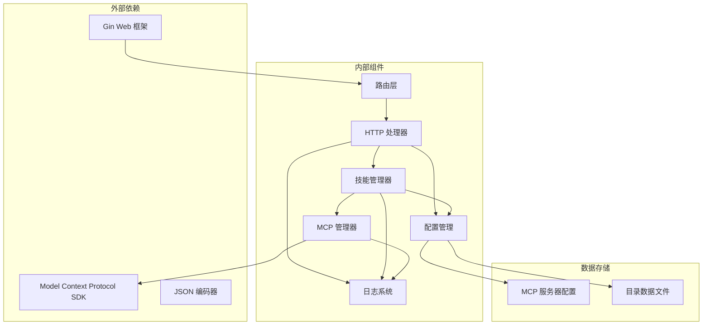

**图表来源**
- [internal/adapters/http/handlers/router.go](file://internal/adapters/http/handlers/router.go#L3-L12)
- [internal/adapters/http/handlers/mcp.go](file://internal/adapters/http/handlers/mcp.go#L3-L11)

**章节来源**
- [internal/adapters/http/handlers/router.go](file://internal/adapters/http/handlers/router.go#L3-L12)
- [internal/adapters/http/handlers/mcp.go](file://internal/adapters/http/handlers/mcp.go#L3-L11)

## 性能考虑

系统在设计时充分考虑了性能优化，采用了多种策略来提升响应速度和资源利用率。

### 连接超时策略

系统为不同类型的 MCP 服务器连接设置了不同的超时时间：

- **SSE 类型**：30 秒超时
- **STDIO 类型**：120 秒超时（考虑 npx 冷启动时间）

### 重试机制

对于可重试的连接错误，系统实现了智能重试机制：

- **重试条件**：仅对超时和临时网络错误进行重试
- **重试次数**：最多 3 次
- **重试间隔**：按 5 秒递增
- **不可重试错误**：EOF、协议不兼容等永久性错误

### 并发处理

系统支持并发初始化多个 MCP 服务器，提升整体性能：

- **并发连接**：每个服务器独立连接，互不影响
- **独立超时**：每个连接有独立的超时控制
- **资源隔离**：连接失败不会影响其他服务器的连接

## 故障排除指南

### 常见问题及解决方案

**1. 目录加载失败**
- **症状**：`failed to load catalog`
- **原因**：目录文件损坏或无法读取
- **解决方案**：检查目录文件完整性，重新部署系统

**2. MCP 服务器连接超时**
- **症状**：`context deadline exceeded` 或 `i/o timeout`
- **原因**：服务器启动缓慢或网络问题
- **解决方案**：增加等待时间，检查服务器状态

**3. 变量配置错误**
- **症状**：`missing required variable`
- **原因**：必填变量未提供或为空
- **解决方案**：检查变量配置，提供必要的参数

**4. 服务器工具发现失败**
- **症状**：`tools/list failed`
- **原因**：服务器协议不兼容或工具定义错误
- **解决方案**：检查服务器版本，更新目录配置

### 调试建议

1. **启用详细日志**：检查系统日志获取详细错误信息
2. **验证配置文件**：确保 JSON 格式正确
3. **测试网络连接**：确认服务器可达性
4. **检查权限设置**：确保有足够的系统权限

**章节来源**
- [internal/adapters/http/handlers/mcp.go](file://internal/adapters/http/handlers/mcp.go#L164-L168)
- [internal/usecase/skills/mcp_manager.go](file://internal/usecase/skills/mcp_manager.go#L106-L114)
- [internal/usecase/skills/skill_mgr.go](file://internal/usecase/skills/skill_mgr.go#L451-L468)

## 结论

MindX MCP 目录市场管理功能是一个设计精良、功能完整的 MCP 服务器管理解决方案。系统具有以下特点：

**优势**：
- **模块化设计**：清晰的分层架构，便于维护和扩展
- **完整的生命周期管理**：从目录查询到服务器安装的全流程支持
- **灵活的配置机制**：支持变量配置和环境变量替换
- **健壮的错误处理**：完善的错误检测和恢复机制
- **良好的用户体验**：直观的前端界面和流畅的操作体验

**应用场景**：
- **企业级 MCP 服务器管理**：统一管理多个 MCP 服务器
- **开发工具集成**：为开发者提供丰富的 MCP 工具集
- **AI 助手增强**：通过 MCP 服务器扩展 AI 助手的功能
- **自动化工作流**：构建基于 MCP 的自动化解决方案

**未来发展方向**：
- **性能优化**：进一步提升连接速度和并发处理能力
- **功能扩展**：支持更多类型的 MCP 服务器和工具
- **安全增强**：加强认证授权和数据保护机制
- **监控完善**：提供更全面的系统监控和告警功能

该系统为 MCP 生态系统的发展提供了坚实的技术基础，为用户提供了便捷高效的 MCP 服务器管理体验。