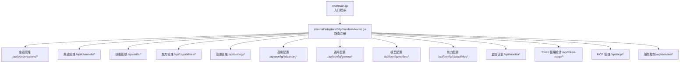
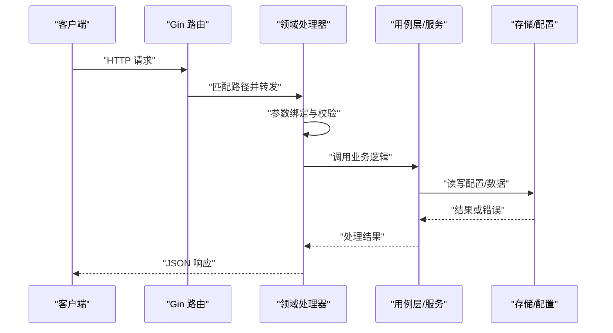
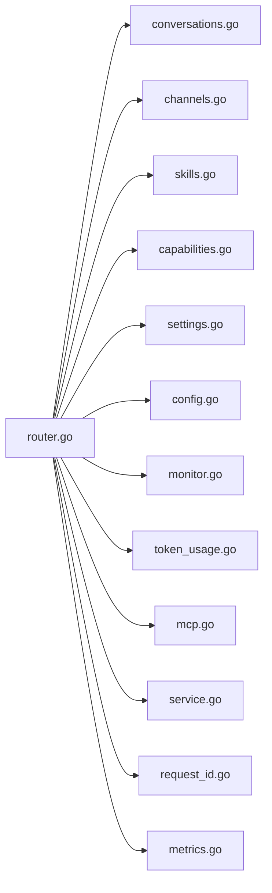

# REST API 接口

<cite>
**本文引用的文件**
- [cmd/main.go](file://cmd/main.go)
- [internal/adapters/http/handlers/router.go](file://internal/adapters/http/handlers/router.go)
- [internal/adapters/http/handlers/conversations.go](file://internal/adapters/http/handlers/conversations.go)
- [internal/adapters/http/handlers/channels.go](file://internal/adapters/http/handlers/channels.go)
- [internal/adapters/http/handlers/skills.go](file://internal/adapters/http/handlers/skills.go)
- [internal/adapters/http/handlers/capabilities.go](file://internal/adapters/http/handlers/capabilities.go)
- [internal/adapters/http/handlers/token_usage.go](file://internal/adapters/http/handlers/token_usage.go)
- [internal/adapters/http/handlers/settings.go](file://internal/adapters/http/handlers/settings.go)
- [internal/adapters/http/handlers/config.go](file://internal/adapters/http/handlers/config.go)
- [internal/adapters/http/handlers/monitor.go](file://internal/adapters/http/handlers/monitor.go)
- [internal/adapters/http/handlers/mcp.go](file://internal/adapters/http/handlers/mcp.go)
- [internal/adapters/http/handlers/service.go](file://internal/adapters/http/handlers/service.go)
- [internal/adapters/http/middleware/request_id.go](file://internal/adapters/http/middleware/request_id.go)
- [internal/adapters/http/middleware/metrics.go](file://internal/adapters/http/middleware/metrics.go)
</cite>

## 目录
1. [简介](#简介)
2. [项目结构](#项目结构)
3. [核心组件](#核心组件)
4. [架构总览](#架构总览)
5. [详细组件与接口定义](#详细组件与接口定义)
6. [依赖关系分析](#依赖关系分析)
7. [性能与指标](#性能与指标)
8. [故障排查指南](#故障排查指南)
9. [结论](#结论)
10. [附录：调用示例与最佳实践](#附录调用示例与最佳实践)

## 简介
本文件为 MindX 的 REST API 接口文档，覆盖会话管理、渠道管理、技能管理、配置管理、监控日志、Token 使用统计、MCP 服务器与目录、服务控制等核心功能。文档提供每个端点的 HTTP 方法、URL 模式、请求参数、响应格式、错误码、认证与安全建议、数据模型与返回值结构，并给出可直接参考的调用示例与最佳实践。

## 项目结构
MindX 的 HTTP 服务基于 Gin 框架构建，路由注册集中在路由处理器中，各业务域通过独立处理器实现。中间件提供请求 ID 与 Prometheus 指标采集。

图表来源
- [cmd/main.go](file://cmd/main.go#L1-L21)
- [internal/adapters/http/handlers/router.go](file://internal/adapters/http/handlers/router.go#L18-L149)

章节来源
- [cmd/main.go](file://cmd/main.go#L1-L21)
- [internal/adapters/http/handlers/router.go](file://internal/adapters/http/handlers/router.go#L1-L150)

## 核心组件
- 路由注册器：集中注册所有 /api 前缀下的子路由，按领域划分组。
- 处理器：每个领域一个处理器，负责请求解析、校验、调用用例层并返回响应。
- 中间件：统一注入请求 ID；采集 HTTP 与 LLM 指标，便于可观测性。

章节来源
- [internal/adapters/http/handlers/router.go](file://internal/adapters/http/handlers/router.go#L18-L149)
- [internal/adapters/http/middleware/request_id.go](file://internal/adapters/http/middleware/request_id.go#L1-L23)
- [internal/adapters/http/middleware/metrics.go](file://internal/adapters/http/middleware/metrics.go#L1-L69)

## 架构总览
下图展示 API 调用链路：客户端 → 路由 → 处理器 → 用例层/存储 → 响应。

图表来源
- [internal/adapters/http/handlers/router.go](file://internal/adapters/http/handlers/router.go#L18-L149)

## 详细组件与接口定义

### 会话管理 /api/conversations/*
- 基础路径：/api/conversations
- 子路径与方法
  - GET /api/conversations
    - 查询参数：limit（整数，>0）
    - 成功：200，返回数组，元素为会话摘要对象
    - 失败：500
  - POST /api/conversations
    - 成功：200，返回当前会话对象
    - 失败：500
  - GET /api/conversations/current
    - 成功：200，返回当前会话对象（可能为空）
    - 失败：无
  - POST /api/conversations/current/message
    - 请求体：{"type":"text","content":"..."}
    - 成功：200，返回 {"content":"回答内容"}
    - 参数错误：400
    - 无当前会话：400
    - 内部错误：500
  - GET /api/conversations/:id
    - 成功：200，返回会话详情对象
    - 不存在：404
    - 失败：500
  - POST /api/conversations/:id/switch
    - 成功：200，返回切换后的当前会话对象
    - 不存在：404
    - 失败：500
  - DELETE /api/conversations/:id
    - 成功：200，返回 {"message":"对话已删除"}
    - 失败：500

- 数据模型
  - 会话摘要：{"id":"","title":"","timestamp":0,"messageCount":0,"start_time":""}
  - 会话详情：{"id":"","messages":[{"role":"","content":""}]}
  - 当前会话响应：{"id":"","messages":[{"role":"","content":""}]}

- 安全与参数
  - 请求体 JSON 绑定失败返回 400
  - 会话相关操作依赖会话管理器，异常返回 500

章节来源
- [internal/adapters/http/handlers/conversations.go](file://internal/adapters/http/handlers/conversations.go#L14-L248)

### 渠道管理 /api/channels/*
- 基础路径：/api/channels
- 子路径与方法
  - GET /api/channels
    - 成功：200，返回 {"enabled_channels":[],"channels":{"id":{"enabled":true,"name":"","icon":"","config":{}}}}
    - 失败：500
  - PUT /api/channels/:id
    - 或 POST /api/channels/:id/config
    - 请求体：任意 JSON 对象（作为新配置）
    - 成功：200
    - 缺少参数/无效体：400
    - 未找到通道：404
    - 保存失败：500
  - POST /api/channels/:id/toggle
    - 请求体：{"enabled":true/false}
    - 成功：200
    - 无效体：400
    - 未找到通道：404
    - 保存失败：500
  - POST /api/channels/:id/start
    - 成功：200
    - 无效体：400
    - 未找到通道：404
  - POST /api/channels/:id/stop
    - 成功：200
    - 无效体：400
    - 未找到通道：404

- 数据模型
  - ChannelInfo：{"enabled":bool,"name":"","icon":"","config":{}}

- 安全与参数
  - 通道配置来自本地配置文件，更新后会持久化
  - 通道启停为逻辑开关，具体运行状态以服务管理为准

章节来源
- [internal/adapters/http/handlers/channels.go](file://internal/adapters/http/handlers/channels.go#L17-L214)

### 技能管理 /api/skills/*
- 基础路径：/api/skills
- 子路径与方法
  - GET /api/skills
    - 成功：200，返回 {"skills":[],"count":0,"isReIndexing":false,"reIndexError":""}
    - 不可用：503
  - GET /api/skills/reindex/status
    - 成功：200，返回 {"isReIndexing":false,"reIndexError":""}
    - 不可用：503
  - POST /api/skills/reindex
    - 成功：200，{"message":"重索引已在后台启动"}
    - 正在重索引：409
    - 不可用：503
  - GET /api/skills/:name
    - 成功：200，{"name":"","skill":{}}
    - 不存在：404
    - 不可用：503
  - GET /api/skills/:name/dependencies
    - 成功：200，{"name":"","missing_bins":[]}
    - 不可用：503
  - GET /api/skills/:name/env
    - 成功：200，{"name":"","env":{}}
    - 敏感键会被掩码显示
  - GET /api/skills/:name/stats
    - 成功：200，{"name":"","enabled":true,"tags":[],"version":""}
    - 不存在：404
  - POST /api/skills/:name/convert
    - 成功：200，{"message":"技能转换成功","name":""}
    - 失败：500
  - POST /api/skills/:name/install
    - 请求体：{"binary":""}
    - 成功：200，{"message":"依赖已安装"}
    - 失败：500
  - POST /api/skills/:name/install/runtime
    - 成功：200，{"message":"运行时安装成功","name":""}
    - 失败：500
  - POST /api/skills/:name/env
    - 请求体：{"key":"value",...}
    - 成功：200，{"message":"环境变量已更新"}
  - POST /api/skills/:name/validate
    - 成功：200，{"name":"","valid":true,"errors":[]}
    - 不存在：404
  - POST /api/skills/:name/enable
    - 成功：200，{"message":"已启用"}
    - 失败：500
  - POST /api/skills/:name/disable
    - 成功：200，{"message":"已禁用"}
    - 失败：500
  - POST /api/skills/batch/convert
    - 请求体：{"names":["a","b"]}
    - 成功：200，返回成功/失败计数与列表
    - 无效体：400
  - POST /api/skills/batch/install
    - 请求体：{"names":["a","b"]}
    - 成功：200，返回成功/失败计数与列表
    - 无效体：400

- 数据模型
  - 技能信息对象由技能管理器提供，包含定义与状态

- 安全与参数
  - 环境变量敏感键会被掩码
  - 批量操作会异步执行，响应仅表示已触发

章节来源
- [internal/adapters/http/handlers/skills.go](file://internal/adapters/http/handlers/skills.go#L14-L496)

### 能力管理 /api/capabilities/*
- 基础路径：/api/capabilities
- 子路径与方法
  - GET /api/capabilities
    - 成功：200，{"capabilities":[],"count":0}
    - 不可用：503
  - GET /api/capabilities/reindex/status
    - 成功：200，{"isReIndexing":false,"error":""}
    - 不可用：503
  - POST /api/capabilities/reindex
    - 成功：202，{"message":"重新索引已启动"}
    - 正在重索引：409
    - 不可用：503
  - POST /api/capabilities
    - 请求体：能力定义对象
    - 成功：201，{"message":"能力添加成功"}
    - 失败：400
  - PUT /api/capabilities?name=...
    - 请求体：能力更新数据
    - 成功：200，{"message":"能力更新成功"}
    - 缺少参数：400
    - 不存在：404
  - DELETE /api/capabilities?name=...
    - 成功：200，{"message":"能力删除成功"}
    - 缺少参数：400
    - 不存在：404

- 数据模型
  - 能力对象由实体层定义

- 安全与参数
  - 更新/删除需要提供 name 查询参数

章节来源
- [internal/adapters/http/handlers/capabilities.go](file://internal/adapters/http/handlers/capabilities.go#L12-L141)

### 设置管理 /api/settings*
- 基础路径：/api/settings
- 子路径与方法
  - GET /api/settings
    - 成功：200，返回设置对象
    - 失败：500
  - POST /api/settings
    - 请求体：设置对象
    - 成功：200，{"message":"Settings saved successfully"}
    - 无效体：400
    - 保存失败：500

- 数据模型
  - Settings：{"model_config":{},"app_config":{}}
  - AppConfig：{"theme":"","language":"","enable_notifications":bool,"auto_save_history":bool}

- 安全与参数
  - 设置文件位于用户主目录下的特定路径，首次读取不存在时返回默认值

章节来源
- [internal/adapters/http/handlers/settings.go](file://internal/adapters/http/handlers/settings.go#L13-L112)

### 配置管理 /api/config/*
- 通用配置 /api/config/general
  - GET /api/config/general
    - 成功：200，{"workplace":"","server":{"address":"","port":0}}
    - 失败：500
  - POST /api/config/general
    - 请求体：{"workplace":"","server":{"address":"","port":int}}
    - 成功：200，{"message":"General config saved successfully"}
    - 失败：400/500
- 服务器配置 /api/config/server
  - GET /api/config/server
    - 成功：200，{"server":{}}
    - 失败：500
  - POST /api/config/server
    - 请求体：{"server":{}}
    - 成功：200，{"message":"Server config saved successfully"}
    - 失败：400/500
- 模型配置 /api/config/models
  - GET /api/config/models
    - 成功：200，{"models":[]}
    - 失败：500
  - POST /api/config/models
    - 请求体：{"models":[]}
    - 成功：200，{"message":"Models config saved successfully"}
    - 失败：400/500
- 能力配置 /api/config/capabilities
  - GET /api/config/capabilities
    - 成功：200，{"capabilities":{},"models":[]}
    - 失败：500
  - POST /api/config/capabilities
    - 请求体：{"capabilities":{}}
    - 成功：200，{"message":"Capabilities config saved successfully"}
    - 失败：400/500
- Ollama 同步 /api/config/ollama-sync
  - POST /api/config/ollama-sync
    - 成功：200，{"message":"Ollama models synced successfully"}
    - 失败：500

- 数据模型
  - 服务器/模型/能力配置由相应配置模块定义

- 安全与参数
  - 保存配置会写入对应配置文件

章节来源
- [internal/adapters/http/handlers/config.go](file://internal/adapters/http/handlers/config.go#L13-L256)

### 监控日志 /api/monitor*
- 基础路径：/api/monitor
- 子路径与方法
  - GET /api/monitor
    - 查询参数：level（字符串）、limit（字符串，默认100）、since（时间戳）
    - 成功：200，{"logs":[],"lastTimestamp":"","count":0}
    - 失败：500
  - DELETE /api/monitor
    - 成功：200，{"success":true,"message":""}
    - 失败：500

- 数据模型
  - 日志条目：{"timestamp":"","level":"","message":"","logger":"","caller":"","extra":{}}

- 安全与参数
  - 读取系统日志文件，支持按级别过滤与增量拉取

章节来源
- [internal/adapters/http/handlers/monitor.go](file://internal/adapters/http/handlers/monitor.go#L16-L188)

### Token 使用统计 /api/token-usage/*
- 基础路径：/api/token-usage
- 子路径与方法
  - GET /api/token-usage/by-model
    - 成功：200，{"data":[]}
    - 失败：500
  - GET /api/token-usage/summary
    - 成功：200，{"data":{}}
    - 失败：500

- 数据模型
  - 统计聚合由仓库层提供

章节来源
- [internal/adapters/http/handlers/token_usage.go](file://internal/adapters/http/handlers/token_usage.go#L10-L49)

### MCP 服务器管理 /api/mcp/*
- 基础路径：/api/mcp/servers
- 子路径与方法
  - GET /api/mcp/servers
    - 成功：200，{"servers":[],"count":0}
  - POST /api/mcp/servers
    - 请求体：{"name":"","type":"","stdio/或sse字段组合","enabled":bool}
    - 成功：200，{"message":"","name":""}
    - 字段缺失：400
  - DELETE /api/mcp/servers/:name
    - 成功：200，{"message":"","name":""}
  - POST /api/mcp/servers/:name/restart
    - 成功：200，{"message":"","name":""}
  - GET /api/mcp/servers/:name/tools
    - 成功：200，{"server":"","tools":[{"name":"","description":"","inputSchema":{}}],"count":0}
    - 不存在：404
- 目录市场
  - GET /api/mcp/catalog
    - 成功：200，{"servers":[],"installed":[]}
  - POST /api/mcp/catalog/install
    - 请求体：{"id":"","variables":{}}
    - 成功：200，{"message":"","name":""}
    - 缺少变量：400
    - 不存在：404

- 数据模型
  - MCP 服务器条目与目录项由配置模块定义

- 安全与参数
  - SSE 类型需要提供 URL，stdio 类型需要提供命令
  - 变量必填且有默认值回填

章节来源
- [internal/adapters/http/handlers/mcp.go](file://internal/adapters/http/handlers/mcp.go#L13-L248)

### 服务控制 /api/service/*
- 基础路径：/api/service
- 子路径与方法
  - POST /api/service/start
    - 成功：200，{"message":"","running":true}
    - 失败：500
  - POST /api/service/stop
    - 成功：200，{"message":"","running":false}
    - 失败：500
  - GET /api/service/ollama-check
    - 成功：200，{"installed":false,"running":false,"models":""}
  - POST /api/service/ollama-install
    - 成功：200，{"message":""}
    - 不支持平台：400
  - POST /api/service/model-test
    - 请求体：{"model_name":""}
    - 成功：200，{"supports_fc":true/false}
    - 失败：500

- 数据模型
  - 无固定结构，返回检测结果

- 安全与参数
  - 依赖系统服务管理工具与本地进程

章节来源
- [internal/adapters/http/handlers/service.go](file://internal/adapters/http/handlers/service.go#L16-L283)

## 依赖关系分析
- 路由层依赖各领域处理器构造函数与用例层实例（如会话管理器、技能管理器、能力管理器等）
- 处理器依赖配置模块读写配置文件，或调用用例层/存储层
- 中间件对所有路由生效，提供请求 ID 与指标采集

图表来源
- [internal/adapters/http/handlers/router.go](file://internal/adapters/http/handlers/router.go#L18-L149)
- [internal/adapters/http/middleware/request_id.go](file://internal/adapters/http/middleware/request_id.go#L1-L23)
- [internal/adapters/http/middleware/metrics.go](file://internal/adapters/http/middleware/metrics.go#L1-L69)

章节来源
- [internal/adapters/http/handlers/router.go](file://internal/adapters/http/handlers/router.go#L18-L149)

## 性能与指标
- HTTP 指标
  - mindx_http_requests_total：按方法、路径、状态计数
  - mindx_http_request_duration_seconds：按方法、路径直方图
- LLM 指标
  - mindx_llm_calls_total：按模型、状态计数
  - mindx_llm_call_duration_seconds：按模型直方图
  - mindx_token_usage_total：按模型、类型计数
- 通道消息与连接
  - mindx_channel_messages_total：按通道、方向计数
  - mindx_active_ws_connections：活动 WebSocket 连接数

章节来源
- [internal/adapters/http/middleware/metrics.go](file://internal/adapters/http/middleware/metrics.go#L12-L49)

## 故障排查指南
- 常见错误码
  - 400：请求体绑定失败、缺少必要参数、字段校验失败
  - 404：资源不存在（如会话、通道、技能、能力）
  - 409：冲突（如重索引已在进行）
  - 500：内部错误（读写文件、调用外部服务失败）
  - 503：服务不可用（技能/能力管理器未就绪）
- 建议排查步骤
  - 检查请求体 JSON 结构与字段命名
  - 确认目标资源是否存在（如会话 ID、技能名、通道 ID）
  - 查看系统日志接口返回的最近日志条目定位问题
  - 关注 Prometheus 指标判断流量与延迟趋势

章节来源
- [internal/adapters/http/handlers/conversations.go](file://internal/adapters/http/handlers/conversations.go#L54-L79)
- [internal/adapters/http/handlers/channels.go](file://internal/adapters/http/handlers/channels.go#L56-L100)
- [internal/adapters/http/handlers/skills.go](file://internal/adapters/http/handlers/skills.go#L77-L95)
- [internal/adapters/http/handlers/monitor.go](file://internal/adapters/http/handlers/monitor.go#L48-L98)

## 结论
本接口文档覆盖了 MindX 的主要 REST 能力，围绕会话、渠道、技能、能力、配置、监控、统计与 MCP 等维度提供了清晰的端点定义与数据模型说明。配合中间件提供的可观测性指标，开发者可快速集成并稳定运维。

## 附录：调用示例与最佳实践

- 认证与安全
  - 本项目未内置鉴权中间件，建议在网关或反向代理层统一接入鉴权（如 JWT、API Key）
  - 对外暴露的接口建议通过 HTTPS 与限流策略保护
  - 对敏感配置与环境变量进行最小权限访问与审计

- 请求头与追踪
  - 建议携带请求头 X-Request-ID，便于跨服务追踪
  - 服务端会透传该头部，便于日志关联

- 健康检查
  - GET /api/health
  - 成功：200，用于探活

- 会话管理
  - 创建会话：POST /api/conversations
  - 发送消息：POST /api/conversations/current/message
  - 列表与详情：GET /api/conversations 与 GET /api/conversations/:id
  - 切换会话：POST /api/conversations/:id/switch
  - 删除会话：DELETE /api/conversations/:id

- 渠道管理
  - 获取列表：GET /api/channels
  - 更新配置：PUT /api/channels/:id 或 POST /api/channels/:id/config
  - 启用/禁用：POST /api/channels/:id/toggle
  - 启动/停止：POST /api/channels/:id/start, POST /api/channels/:id/stop

- 技能管理
  - 列表与状态：GET /api/skills, GET /api/skills/reindex/status
  - 触发重索引：POST /api/skills/reindex
  - 单个技能：GET /api/skills/:name, GET /api/skills/:name/stats, GET /api/skills/:name/env
  - 环境变量：POST /api/skills/:name/env
  - 启用/禁用：POST /api/skills/:name/enable, POST /api/skills/:name/disable
  - 转换/安装：POST /api/skills/:name/convert, POST /api/skills/:name/install, POST /api/skills/:name/install/runtime
  - 批量：POST /api/skills/batch/convert, POST /api/skills/batch/install

- 能力管理
  - 列表：GET /api/capabilities
  - 新增/更新/删除：POST /api/capabilities, PUT /api/capabilities?name=..., DELETE /api/capabilities?name=...

- 配置管理
  - 通用：GET/POST /api/config/general
  - 服务器：GET/POST /api/config/server
  - 模型：GET/POST /api/config/models
  - 能力：GET/POST /api/config/capabilities
  - Ollama 同步：POST /api/config/ollama-sync

- 监控日志
  - 获取日志：GET /api/monitor?level=&limit=&since=
  - 清空日志：DELETE /api/monitor

- Token 使用统计
  - 按模型汇总：GET /api/token-usage/by-model
  - 总体统计：GET /api/token-usage/summary

- MCP 管理
  - 服务器：GET/POST/DELETE /api/mcp/servers, POST /api/mcp/servers/:name/restart, GET /api/mcp/servers/:name/tools
  - 目录：GET /api/mcp/catalog, POST /api/mcp/catalog/install

- 服务控制
  - 启动/停止：POST /api/service/start, POST /api/service/stop
  - Ollama 检测/安装/模型测试：GET/POST /api/service/ollama-check, POST /api/service/ollama-install, POST /api/service/model-test

- 最佳实践
  - 对外部依赖（如 Ollama）增加超时与重试策略
  - 对批量操作采用异步执行并提供状态查询
  - 对敏感字段（如 API Key）在响应中进行掩码处理
  - 使用 X-Request-ID 实现端到端链路追踪
  - 通过 Prometheus 指标持续监控关键路径延迟与错误率