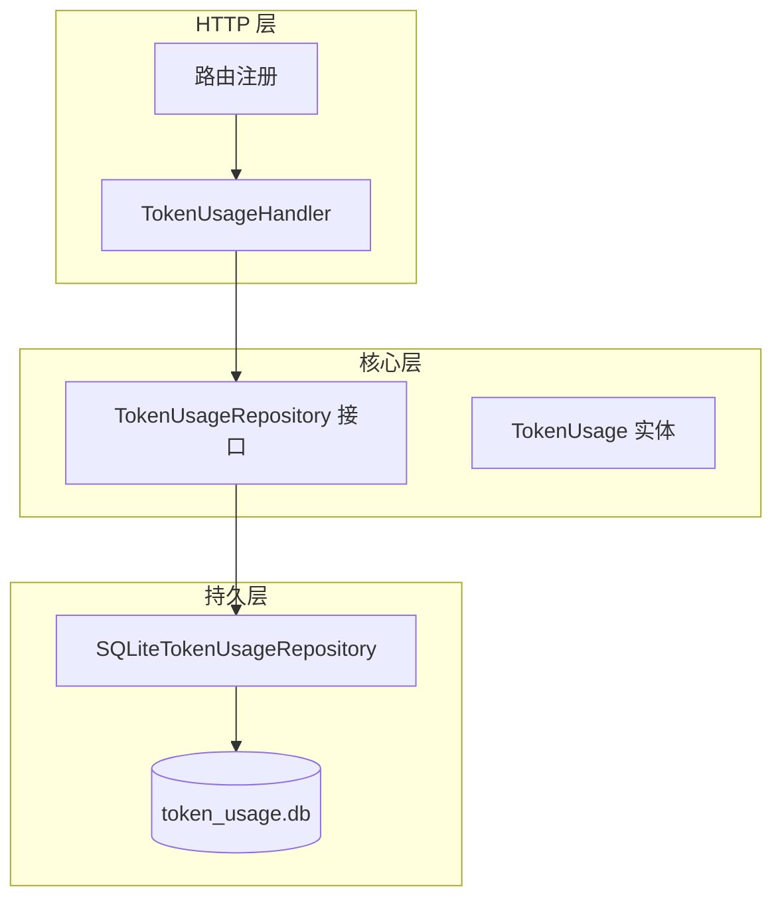
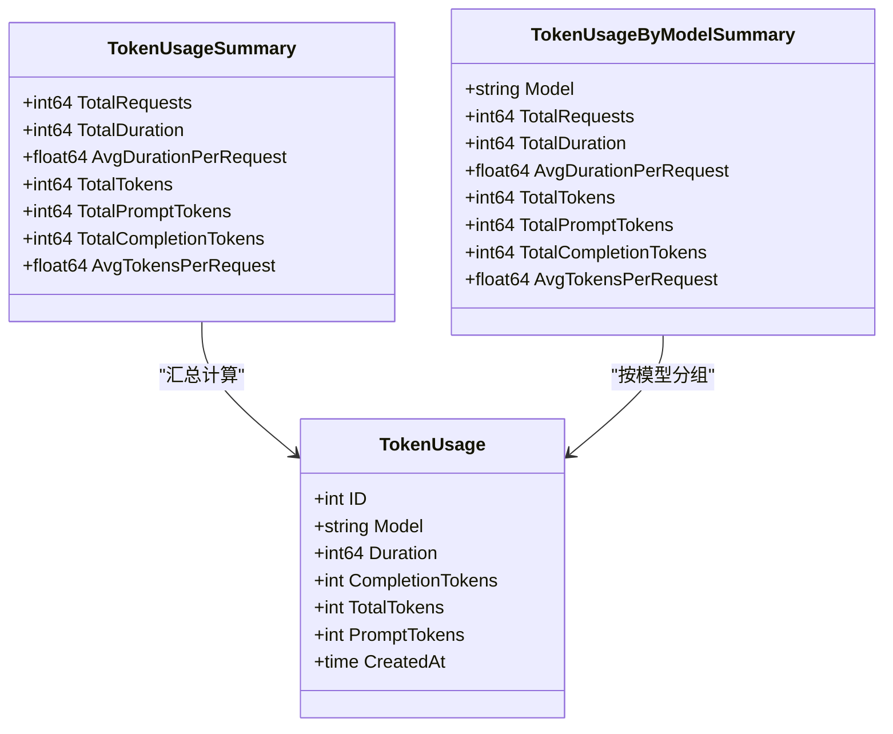
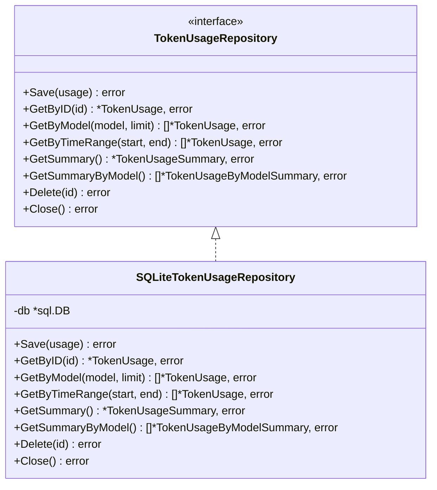
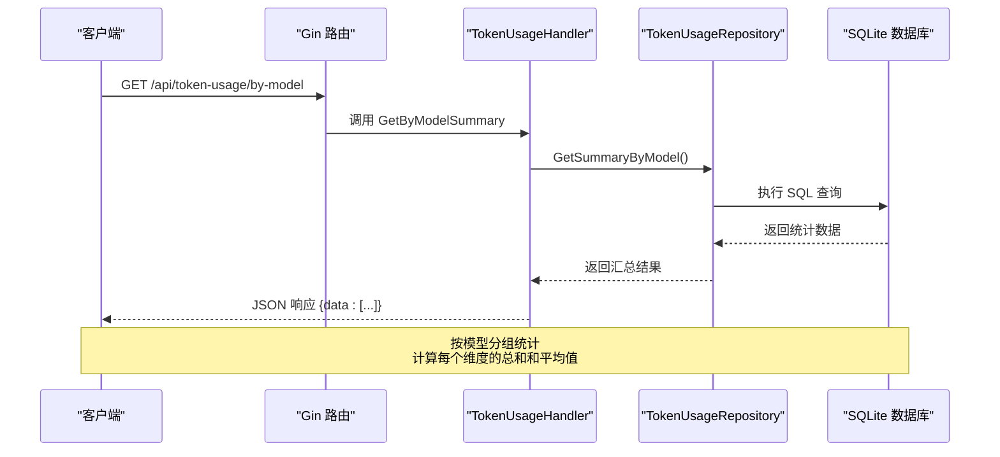
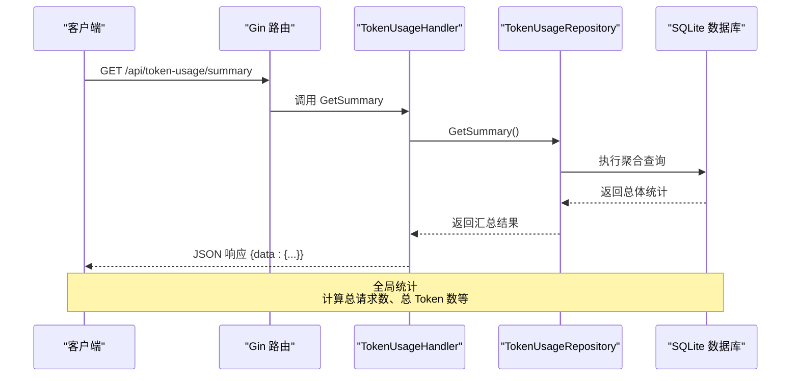
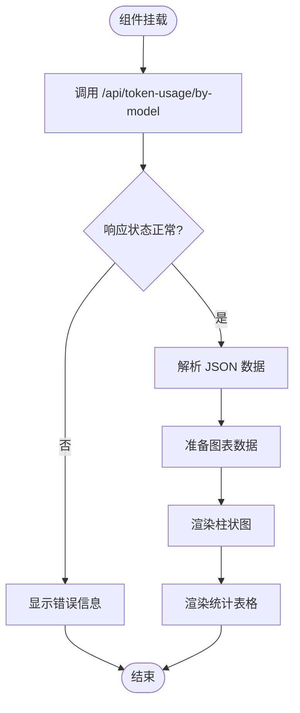
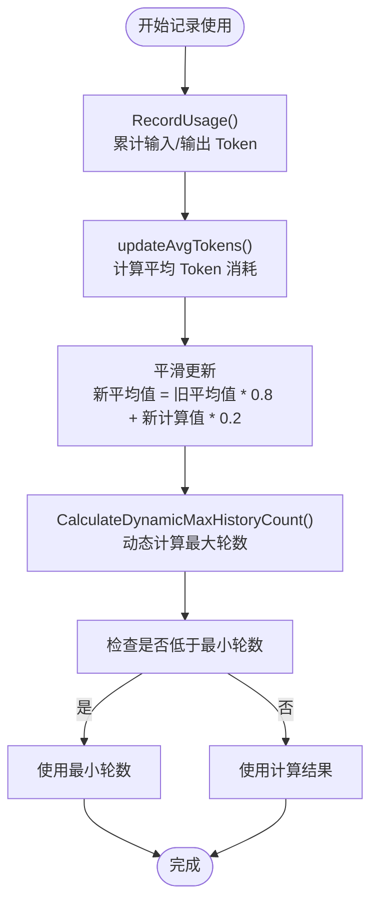
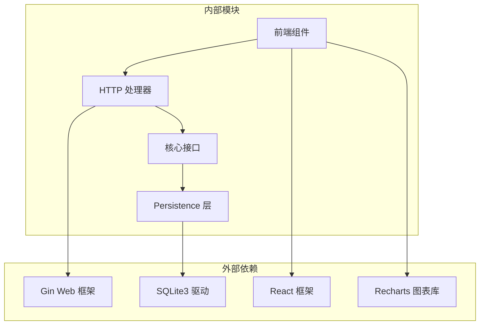

# Token 使用统计

<cite>
**本文引用的文件**
- [internal/adapters/http/handlers/token_usage.go](file://internal/adapters/http/handlers/token_usage.go)
- [internal/adapters/http/handlers/router.go](file://internal/adapters/http/handlers/router.go)
- [internal/core/token_usage.go](file://internal/core/token_usage.go)
- [internal/entity/token_usage.go](file://internal/entity/token_usage.go)
- [internal/infrastructure/persistence/token_usage_repository.go](file://internal/infrastructure/persistence/token_usage_repository.go)
- [dashboard/src/components/Usage.tsx](file://dashboard/src/components/Usage.tsx)
- [dashboard/src/components/settings/TokenBudgetSection.tsx](file://dashboard/src/components/settings/TokenBudgetSection.tsx)
- [dashboard/src/components/settings/types.ts](file://dashboard/src/components/settings/types.ts)
- [internal/usecase/brain/token_budget.go](file://internal/usecase/brain/token_budget.go)
- [internal/usecase/brain/token_budget_test.go](file://internal/usecase/brain/token_budget_test.go)
</cite>

## 目录
1. [简介](#简介)
2. [项目结构](#项目结构)
3. [核心组件](#核心组件)
4. [架构概览](#架构概览)
5. [详细组件分析](#详细组件分析)
6. [依赖关系分析](#依赖关系分析)
7. [性能考虑](#性能考虑)
8. [故障排除指南](#故障排除指南)
9. [结论](#结论)

## 简介
本文档详细介绍了 MindX 的 Token 使用统计接口，涵盖 `/api/token-usage` 系列端点，包括按模型汇总和总体摘要统计功能。文档说明了统计数据的计算方式、时间范围选择、聚合维度和精度控制，并提供了成本分析和使用趋势的可视化示例。同时描述了 Token 计费规则、预算控制和超限告警机制。

## 项目结构
MindX 的 Token 使用统计功能由三层架构组成：
- HTTP 层：处理 API 请求并返回 JSON 响应
- 核心层：定义仓库接口和实体模型
- 数据持久层：使用 SQLite 存储 Token 使用记录



**图表来源**
- [internal/adapters/http/handlers/router.go](file://internal/adapters/http/handlers/router.go#L126-L132)
- [internal/adapters/http/handlers/token_usage.go](file://internal/adapters/http/handlers/token_usage.go#L10-L18)
- [internal/core/token_usage.go](file://internal/core/token_usage.go#L8-L33)
- [internal/infrastructure/persistence/token_usage_repository.go](file://internal/infrastructure/persistence/token_usage_repository.go#L12-L43)

**章节来源**
- [internal/adapters/http/handlers/router.go](file://internal/adapters/http/handlers/router.go#L1-L150)
- [internal/adapters/http/handlers/token_usage.go](file://internal/adapters/http/handlers/token_usage.go#L1-L49)
- [internal/core/token_usage.go](file://internal/core/token_usage.go#L1-L34)
- [internal/infrastructure/persistence/token_usage_repository.go](file://internal/infrastructure/persistence/token_usage_repository.go#L1-L300)

## 核心组件
本节详细介绍 Token 使用统计系统的核心组件及其职责。

### 数据实体模型
系统使用三个核心实体来表示 Token 使用数据：



**图表来源**
- [internal/entity/token_usage.go](file://internal/entity/token_usage.go#L5-L38)

### 仓库接口设计
TokenUsageRepository 接口定义了完整的数据访问能力：



**图表来源**
- [internal/core/token_usage.go](file://internal/core/token_usage.go#L8-L33)
- [internal/infrastructure/persistence/token_usage_repository.go](file://internal/infrastructure/persistence/token_usage_repository.go#L12-L43)

**章节来源**
- [internal/entity/token_usage.go](file://internal/entity/token_usage.go#L1-L38)
- [internal/core/token_usage.go](file://internal/core/token_usage.go#L1-L34)
- [internal/infrastructure/persistence/token_usage_repository.go](file://internal/infrastructure/persistence/token_usage_repository.go#L1-L300)

## 架构概览
Token 使用统计系统的整体架构采用分层设计，确保关注点分离和可维护性。



**图表来源**
- [internal/adapters/http/handlers/router.go](file://internal/adapters/http/handlers/router.go#L126-L132)
- [internal/adapters/http/handlers/token_usage.go](file://internal/adapters/http/handlers/token_usage.go#L20-L33)
- [internal/infrastructure/persistence/token_usage_repository.go](file://internal/infrastructure/persistence/token_usage_repository.go#L226-L271)

系统还支持总体摘要统计：



**图表来源**
- [internal/adapters/http/handlers/router.go](file://internal/adapters/http/handlers/router.go#L126-L132)
- [internal/adapters/http/handlers/token_usage.go](file://internal/adapters/http/handlers/token_usage.go#L35-L48)
- [internal/infrastructure/persistence/token_usage_repository.go](file://internal/infrastructure/persistence/token_usage_repository.go#L194-L224)

## 详细组件分析

### HTTP 处理器组件
TokenUsageHandler 是 API 的入口点，负责处理两个主要端点：

#### 按模型分组统计
- 端点：`GET /api/token-usage/by-model`
- 功能：返回按模型分组的使用统计信息
- 响应格式：`{data: [TokenUsageByModelSummary]}`

#### 总体摘要统计
- 端点：`GET /api/token-usage/summary`
- 功能：返回全局的使用统计摘要
- 响应格式：`{data: TokenUsageSummary}`

**章节来源**
- [internal/adapters/http/handlers/token_usage.go](file://internal/adapters/http/handlers/token_usage.go#L1-L49)

### 数据持久化组件
SQLiteTokenUsageRepository 实现了完整的数据访问逻辑：

#### 数据库表结构
```sql
CREATE TABLE IF NOT EXISTS token_usage (
    id INTEGER PRIMARY KEY AUTOINCREMENT,
    model TEXT NOT NULL,
    duration INTEGER NOT NULL,
    completion_tokens INTEGER NOT NULL,
    total_tokens INTEGER NOT NULL,
    prompt_tokens INTEGER NOT NULL,
    created_at DATETIME NOT NULL
);

CREATE INDEX IF NOT EXISTS idx_model ON token_usage(model);
CREATE INDEX IF NOT EXISTS idx_created_at ON token_usage(created_at);
```

#### 统计查询实现

##### 按模型分组统计查询
```sql
SELECT
    model,
    COUNT(*) as total_requests,
    COALESCE(SUM(duration), 0) as total_duration,
    COALESCE(SUM(total_tokens), 0) as total_tokens,
    COALESCE(SUM(prompt_tokens), 0) as total_prompt_tokens,
    COALESCE(SUM(completion_tokens), 0) as total_completion_tokens
FROM token_usage
GROUP BY model
ORDER BY total_tokens DESC
```

##### 总体摘要统计查询
```sql
SELECT
    COUNT(*) as total_requests,
    COALESCE(SUM(duration), 0) as total_duration,
    COALESCE(SUM(total_tokens), 0) as total_tokens,
    COALESCE(SUM(prompt_tokens), 0) as total_prompt_tokens,
    COALESCE(SUM(completion_tokens), 0) as total_completion_tokens
FROM token_usage
```

**章节来源**
- [internal/infrastructure/persistence/token_usage_repository.go](file://internal/infrastructure/persistence/token_usage_repository.go#L45-L64)
- [internal/infrastructure/persistence/token_usage_repository.go](file://internal/infrastructure/persistence/token_usage_repository.go#L226-L271)
- [internal/infrastructure/persistence/token_usage_repository.go](file://internal/infrastructure/persistence/token_usage_repository.go#L194-L224)

### 前端可视化组件
Usage.tsx 组件提供了直观的 Token 使用数据可视化：

#### 数据获取流程


**图表来源**
- [dashboard/src/components/Usage.tsx](file://dashboard/src/components/Usage.tsx#L22-L42)

#### 可视化展示内容
- 模型用量对比柱状图
- 总 Token 数、总请求数、总时长统计卡片
- 详细的数据表格，包含各维度的统计信息

**章节来源**
- [dashboard/src/components/Usage.tsx](file://dashboard/src/components/Usage.tsx#L1-L184)

### Token 预算控制系统
系统还集成了 Token 预算管理功能，用于控制和优化 Token 使用：

#### 预算配置参数
- `reserved_output_tokens`: 预留给输出的 Token 数
- `min_history_rounds`: 最小历史对话轮数
- `avg_tokens_per_round`: 单轮平均 Token 数

#### 动态预算调整算法


**图表来源**
- [internal/usecase/brain/token_budget.go](file://internal/usecase/brain/token_budget.go#L51-L93)
- [internal/usecase/brain/token_budget.go](file://internal/usecase/brain/token_budget.go#L95-L130)

**章节来源**
- [dashboard/src/components/settings/TokenBudgetSection.tsx](file://dashboard/src/components/settings/TokenBudgetSection.tsx#L1-L48)
- [dashboard/src/components/settings/types.ts](file://dashboard/src/components/settings/types.ts#L1-L61)
- [internal/usecase/brain/token_budget.go](file://internal/usecase/brain/token_budget.go#L1-L226)

## 依赖关系分析



**图表来源**
- [internal/adapters/http/handlers/router.go](file://internal/adapters/http/handlers/router.go#L3-L12)
- [internal/infrastructure/persistence/token_usage_repository.go](file://internal/infrastructure/persistence/token_usage_repository.go#L3-L9)
- [dashboard/src/components/Usage.tsx](file://dashboard/src/components/Usage.tsx#L1-L4)

系统的主要依赖关系：
- HTTP 层依赖 Gin 框架进行路由处理
- 持久层依赖 SQLite3 驱动进行数据存储
- 前端依赖 React 和 Recharts 进行数据可视化
- 核心接口定义了清晰的抽象层次

**章节来源**
- [internal/adapters/http/handlers/router.go](file://internal/adapters/http/handlers/router.go#L1-L150)
- [internal/infrastructure/persistence/token_usage_repository.go](file://internal/infrastructure/persistence/token_usage_repository.go#L1-L300)

## 性能考虑

### 数据库优化策略
1. **索引优化**：为 `model` 和 `created_at` 字段建立索引，提高查询性能
2. **WAL 模式**：启用写-ahead logging 模式，提升并发读写性能
3. **查询优化**：使用聚合函数直接在数据库层面计算统计信息

### 缓存策略
- 前端可以缓存最近的统计数据，减少重复请求
- 可以实现增量更新机制，避免全量重新计算

### 扩展性考虑
- 支持分页查询，避免大量数据一次性传输
- 可以添加时间范围过滤参数
- 支持多种聚合粒度（按小时、按天、按周）

## 故障排除指南

### 常见错误类型
1. **数据库连接失败**：检查数据库文件路径和权限
2. **SQL 查询错误**：验证表结构和字段名
3. **JSON 序列化失败**：确认实体结构与前端接口一致

### 调试建议
1. **启用详细日志**：在开发环境中开启 SQL 查询日志
2. **单元测试**：运行现有的测试用例验证功能正确性
3. **API 测试**：使用 curl 或 Postman 直接测试 API 端点

**章节来源**
- [internal/infrastructure/persistence/token_usage_repository.go](file://internal/infrastructure/persistence/token_usage_repository.go#L18-L43)
- [internal/usecase/brain/token_budget_test.go](file://internal/usecase/brain/token_budget_test.go#L59-L137)

## 结论
MindX 的 Token 使用统计系统提供了完整的监控和分析能力。通过分层架构设计，系统实现了良好的可维护性和扩展性。HTTP 层提供了简洁的 API 接口，核心层定义了清晰的抽象，持久层保证了数据的可靠存储。

系统的主要优势包括：
- **实时统计**：支持按模型分组和总体摘要统计
- **可视化展示**：前端提供直观的数据图表
- **预算控制**：集成动态 Token 预算管理
- **性能优化**：数据库索引和查询优化

未来可以考虑的功能增强：
- 添加时间范围过滤参数
- 实现更丰富的聚合维度
- 增加成本分析和预测功能
- 提供导出和报表生成功能