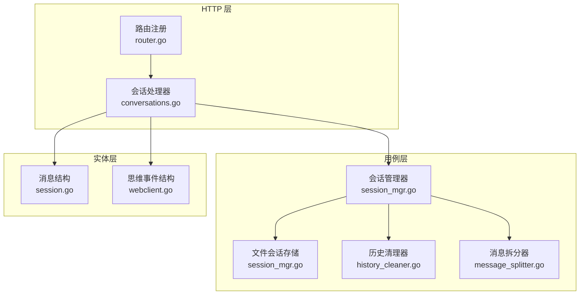
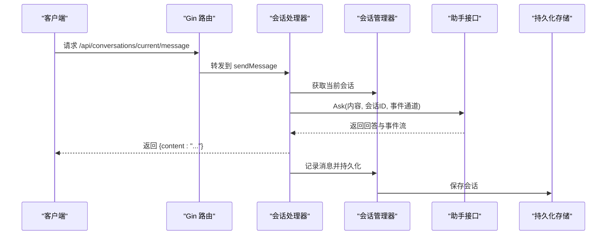
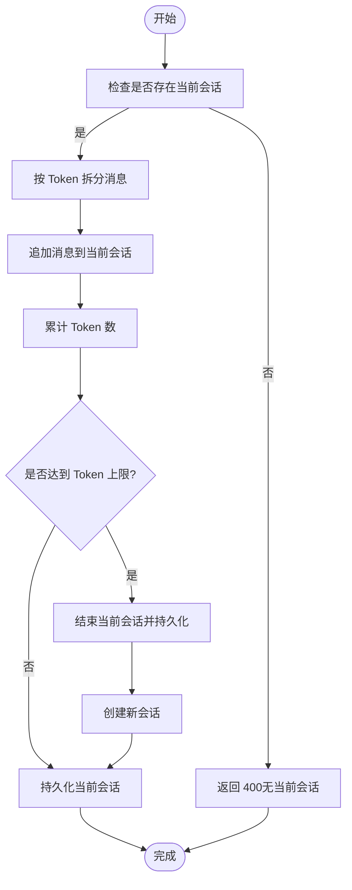
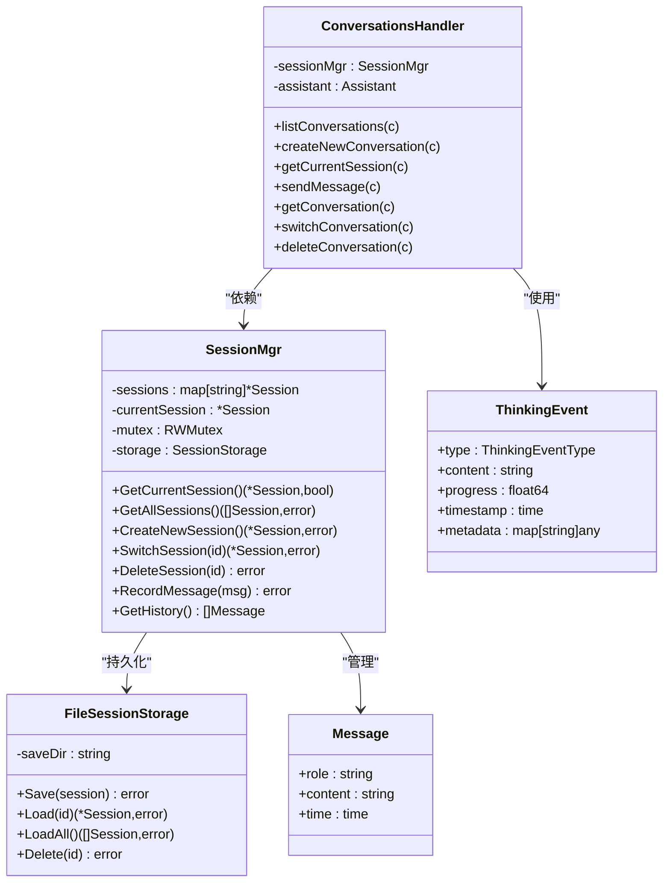
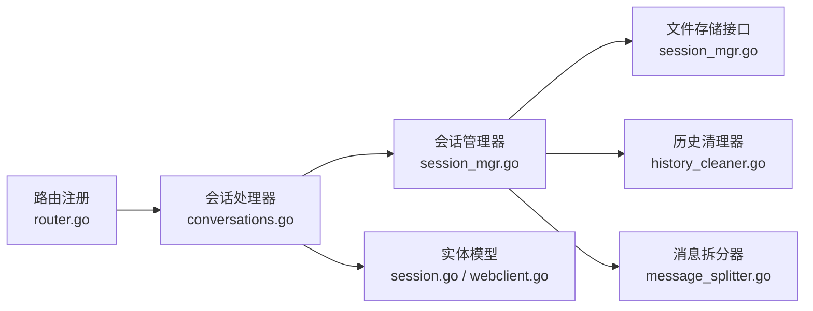

# 会话管理

<cite>
**本文引用的文件**
- [internal/adapters/http/handlers/conversations.go](file://internal/adapters/http/handlers/conversations.go)
- [internal/adapters/http/handlers/router.go](file://internal/adapters/http/handlers/router.go)
- [internal/entity/session.go](file://internal/entity/session.go)
- [internal/usecase/session/session_mgr.go](file://internal/usecase/session/session_mgr.go)
- [internal/usecase/session/history_cleaner.go](file://internal/usecase/session/history_cleaner.go)
- [internal/usecase/session/message_splitter.go](file://internal/usecase/session/message_splitter.go)
- [internal/entity/webclient.go](file://internal/entity/webclient.go)
</cite>

## 目录
1. [简介](#简介)
2. [项目结构](#项目结构)
3. [核心组件](#核心组件)
4. [架构总览](#架构总览)
5. [详细组件分析](#详细组件分析)
6. [依赖关系分析](#依赖关系分析)
7. [性能考量](#性能考量)
8. [故障排查指南](#故障排查指南)
9. [结论](#结论)
10. [附录](#附录)

## 简介
本文件为 MindX 会话管理接口的详细 API 文档，覆盖 /api/conversations 系列端点，包括：
- 会话列表查询
- 创建新会话
- 获取当前会话
- 发送消息
- 切换会话
- 删除会话

文档同时阐述会话生命周期管理、消息格式规范、会话 ID 生成规则以及并发处理机制，并提供关键流程的时序图与类图，帮助开发者快速理解与集成。

## 项目结构
会话管理相关代码主要分布在以下层次：
- HTTP 层：路由注册与控制器实现，负责接收请求、参数解析、响应构造
- 用例层：会话管理器与持久化存储，负责会话状态、消息记录、历史清理与切分
- 实体层：消息与会话数据结构，定义对外可见的数据字段
- 并发与事件：思维事件类型与通道，支持流式事件推送

图表来源
- [internal/adapters/http/handlers/router.go](file://internal/adapters/http/handlers/router.go#L34-L45)
- [internal/adapters/http/handlers/conversations.go](file://internal/adapters/http/handlers/conversations.go#L19-L52)
- [internal/usecase/session/session_mgr.go](file://internal/usecase/session/session_mgr.go#L16-L27)
- [internal/usecase/session/history_cleaner.go](file://internal/usecase/session/history_cleaner.go#L11-L21)
- [internal/usecase/session/message_splitter.go](file://internal/usecase/session/message_splitter.go#L9-L19)
- [internal/entity/session.go](file://internal/entity/session.go#L7-L22)
- [internal/entity/webclient.go](file://internal/entity/webclient.go#L21-L27)

章节来源
- [internal/adapters/http/handlers/router.go](file://internal/adapters/http/handlers/router.go#L18-L45)
- [internal/adapters/http/handlers/conversations.go](file://internal/adapters/http/handlers/conversations.go#L1-L248)
- [internal/usecase/session/session_mgr.go](file://internal/usecase/session/session_mgr.go#L1-L430)
- [internal/usecase/session/history_cleaner.go](file://internal/usecase/session/history_cleaner.go#L1-L200)
- [internal/usecase/session/message_splitter.go](file://internal/usecase/session/message_splitter.go#L1-L205)
- [internal/entity/session.go](file://internal/entity/session.go#L1-L23)
- [internal/entity/webclient.go](file://internal/entity/webclient.go#L1-L39)

## 核心组件
- 会话处理器（ConversationsHandler）
  - 负责 /api/conversations 下的所有端点
  - 依赖会话管理器与助手接口以执行业务逻辑
- 会话管理器（SessionMgr）
  - 提供会话 CRUD、历史清理、消息记录、会话切分与持久化
  - 内部使用互斥锁保证并发安全
- 文件会话存储（FileSessionStorage）
  - 基于 JSON 文件的持久化实现
- 历史清理器（HistoryCleaner）
  - 去重与相似度清洗，提升历史记录质量
- 消息拆分器（MessageSplitter）
  - 基于 Token 数与语义边界的拆分策略
- 实体（Message、ThinkingEvent）
  - 定义消息与思维事件的数据结构

章节来源
- [internal/adapters/http/handlers/conversations.go](file://internal/adapters/http/handlers/conversations.go#L19-L52)
- [internal/usecase/session/session_mgr.go](file://internal/usecase/session/session_mgr.go#L16-L27)
- [internal/usecase/session/history_cleaner.go](file://internal/usecase/session/history_cleaner.go#L11-L21)
- [internal/usecase/session/message_splitter.go](file://internal/usecase/session/message_splitter.go#L9-L19)
- [internal/entity/session.go](file://internal/entity/session.go#L7-L22)
- [internal/entity/webclient.go](file://internal/entity/webclient.go#L21-L27)

## 架构总览
会话管理采用“HTTP 控制器 -> 用例层 -> 存储”的分层架构，配合并发控制与事件通道，确保高可用与可观测性。

图表来源
- [internal/adapters/http/handlers/router.go](file://internal/adapters/http/handlers/router.go#L34-L45)
- [internal/adapters/http/handlers/conversations.go](file://internal/adapters/http/handlers/conversations.go#L54-L79)
- [internal/usecase/session/session_mgr.go](file://internal/usecase/session/session_mgr.go#L164-L201)

## 详细组件分析

### 会话管理 API 规范
- 基础路径：/api/conversations
- 认证与鉴权：未在路由中显式声明，具体取决于部署配置
- 内容协商：JSON；请求与响应均使用 application/json

端点一览
- GET /api/conversations
  - 功能：列出会话摘要（按时间倒序）
  - 查询参数：limit（可选，整数）
  - 成功响应：数组，元素为会话摘要对象
  - 错误码：500（内部错误）
- POST /api/conversations
  - 功能：创建新会话
  - 请求体：无
  - 成功响应：当前会话对象（含 id 与空消息列表）
  - 错误码：500（内部错误）
- GET /api/conversations/current
  - 功能：获取当前会话详情
  - 请求体：无
  - 成功响应：当前会话对象（含 id 与消息列表）
  - 错误码：200（无当前会话时返回空消息）
- POST /api/conversations/current/message
  - 功能：向当前会话发送消息
  - 请求体：{ type: string, content: string }
  - 成功响应：{ content: string }
  - 错误码：400（无当前会话或请求体无效）、500（内部错误）
- GET /api/conversations/:id
  - 功能：获取指定会话详情
  - 路径参数：id（会话 ID）
  - 成功响应：会话详情对象（含 id 与消息列表）
  - 错误码：404（会话不存在）、500（内部错误）
- POST /api/conversations/:id/switch
  - 功能：切换到指定会话
  - 路径参数：id（会话 ID）
  - 成功响应：当前会话对象（含 id 与消息列表）
  - 错误码：404（会话不存在）、500（内部错误）
- DELETE /api/conversations/:id
  - 功能：删除指定会话
  - 路径参数：id（会话 ID）
  - 成功响应：{ message: "对话已删除" }
  - 错误码：500（内部错误）

章节来源
- [internal/adapters/http/handlers/router.go](file://internal/adapters/http/handlers/router.go#L34-L45)
- [internal/adapters/http/handlers/conversations.go](file://internal/adapters/http/handlers/conversations.go#L81-L200)

### 数据模型与消息格式
- 消息（Message）
  - 字段：role（"user" 或 "assistant"）、content（文本）、time（时间戳）
- 会话（Session）
  - 字段：id（内部生成）、messages（消息列表）、tokens_used（累计 Token 数）、is_ended（是否结束）、created_at、ended_at
- 会话摘要（ConversationSummary）
  - 字段：id、title、timestamp、messageCount、start_time
- 会话详情（ConversationDetail）
  - 字段：id、messages（每条消息含 role 与 content）
- 当前会话响应（CurrentSessionResponse）
  - 字段：id、messages（每条消息含 role 与 content）
- 思维事件（ThinkingEvent）
  - 字段：type（事件类型）、content（文本）、progress（进度百分比）、timestamp（时间戳）、metadata（元数据）

章节来源
- [internal/entity/session.go](file://internal/entity/session.go#L7-L22)
- [internal/adapters/http/handlers/conversations.go](file://internal/adapters/http/handlers/conversations.go#L24-L45)
- [internal/entity/webclient.go](file://internal/entity/webclient.go#L21-L27)

### 会话生命周期管理
- 创建会话
  - 若当前会话存在且包含消息，先标记为结束并持久化
  - 生成新的会话 ID，初始化消息列表与 Token 统计
- 发送消息
  - 校验是否存在当前会话
  - 通过助手接口生成回答，同时通过事件通道推送思维过程
  - 消息按 Token 数拆分后写入当前会话，累计 Token 数
  - 达到 Token 上限时自动结束当前会话并开启新会话
- 获取会话
  - 列表：加载全部会话，提取摘要并按时间倒序
  - 详情：根据 ID 查找并返回消息明细
- 切换会话
  - 从存储加载目标会话，更新当前会话指针并持久化
- 删除会话
  - 若删除的是当前会话，自动创建新会话
  - 同步清理内存与持久化存储

图表来源
- [internal/adapters/http/handlers/conversations.go](file://internal/adapters/http/handlers/conversations.go#L54-L79)
- [internal/usecase/session/session_mgr.go](file://internal/usecase/session/session_mgr.go#L164-L201)
- [internal/usecase/session/session_mgr.go](file://internal/usecase/session/session_mgr.go#L248-L290)

章节来源
- [internal/usecase/session/session_mgr.go](file://internal/usecase/session/session_mgr.go#L130-L162)
- [internal/usecase/session/session_mgr.go](file://internal/usecase/session/session_mgr.go#L292-L317)
- [internal/usecase/session/session_mgr.go](file://internal/usecase/session/session_mgr.go#L409-L429)

### 会话 ID 生成规则
- 生成策略：基于当前纳秒级时间戳拼接固定前缀
- 格式：session_{UnixNano}
- 特性：全局唯一、天然有序、便于按时间检索

章节来源
- [internal/usecase/session/session_mgr.go](file://internal/usecase/session/session_mgr.go#L340-L342)

### 消息格式规范
- 角色（role）
  - 用户消息：user
  - 助手消息：assistant
- 内容（content）
  - 支持任意文本；当内容过长时，将按 Token 数与语义边界进行拆分
- 时间（time）
  - 自动记录消息写入时间

章节来源
- [internal/entity/session.go](file://internal/entity/session.go#L7-L12)
- [internal/usecase/session/message_splitter.go](file://internal/usecase/session/message_splitter.go#L21-L33)

### 并发处理机制
- 互斥锁（sync.RWMutex）
  - 保护会话集合、当前会话指针与持久化操作
  - 读多写少场景下，读锁降低竞争
- 事件通道（ThinkingEvent）
  - 通过通道异步推送思维事件，避免阻塞主流程
  - 控制缓冲区大小，防止事件堆积

章节来源
- [internal/usecase/session/session_mgr.go](file://internal/usecase/session/session_mgr.go#L16-L27)
- [internal/adapters/http/handlers/conversations.go](file://internal/adapters/http/handlers/conversations.go#L67-L68)
- [internal/entity/webclient.go](file://internal/entity/webclient.go#L21-L27)

### 类图（代码级）

图表来源
- [internal/adapters/http/handlers/conversations.go](file://internal/adapters/http/handlers/conversations.go#L19-L52)
- [internal/usecase/session/session_mgr.go](file://internal/usecase/session/session_mgr.go#L16-L27)
- [internal/usecase/session/session_mgr.go](file://internal/usecase/session/session_mgr.go#L38-L46)
- [internal/entity/session.go](file://internal/entity/session.go#L7-L12)
- [internal/entity/webclient.go](file://internal/entity/webclient.go#L21-L27)

## 依赖关系分析
- 路由层依赖控制器层，控制器层依赖会话管理器与助手接口
- 会话管理器依赖存储接口、历史清理器与消息拆分器
- 实体层为跨层共享的数据契约

图表来源
- [internal/adapters/http/handlers/router.go](file://internal/adapters/http/handlers/router.go#L18-L45)
- [internal/adapters/http/handlers/conversations.go](file://internal/adapters/http/handlers/conversations.go#L19-L52)
- [internal/usecase/session/session_mgr.go](file://internal/usecase/session/session_mgr.go#L16-L27)
- [internal/usecase/session/history_cleaner.go](file://internal/usecase/session/history_cleaner.go#L11-L21)
- [internal/usecase/session/message_splitter.go](file://internal/usecase/session/message_splitter.go#L9-L19)
- [internal/entity/session.go](file://internal/entity/session.go#L7-L22)
- [internal/entity/webclient.go](file://internal/entity/webclient.go#L21-L27)

章节来源
- [internal/adapters/http/handlers/router.go](file://internal/adapters/http/handlers/router.go#L18-L45)
- [internal/adapters/http/handlers/conversations.go](file://internal/adapters/http/handlers/conversations.go#L19-L52)
- [internal/usecase/session/session_mgr.go](file://internal/usecase/session/session_mgr.go#L16-L27)

## 性能考量
- Token 上限控制
  - 当累计 Token 数达到阈值时自动结束当前会话并开启新会话，避免上下文过长导致性能下降
- 消息拆分
  - 基于 Token 数与段落、句子边界拆分，减少单条消息过大带来的处理压力
- 历史清洗
  - 去重与相似度清洗，减少冗余消息，提升检索与展示效率
- 并发安全
  - 使用读写锁降低锁竞争，事件通道异步化避免阻塞

章节来源
- [internal/usecase/session/session_mgr.go](file://internal/usecase/session/session_mgr.go#L196-L198)
- [internal/usecase/session/message_splitter.go](file://internal/usecase/session/message_splitter.go#L21-L33)
- [internal/usecase/session/history_cleaner.go](file://internal/usecase/session/history_cleaner.go#L23-L36)

## 故障排查指南
- 常见错误与定位
  - 400（无当前会话）：确认是否已创建或切换到有效会话
  - 404（会话不存在）：检查会话 ID 是否正确
  - 500（内部错误）：查看服务端日志，关注持久化与助手调用异常
- 关键日志点
  - 会话恢复、开始新会话、记录消息、持久化失败、会话结束、切换成功/失败、删除成功/失败
- 建议排查步骤
  - 确认会话管理器初始化与存储目录权限
  - 检查 Token 上限配置与消息拆分策略
  - 核对并发访问是否引入竞态（如多实例共享同一存储目录）

章节来源
- [internal/adapters/http/handlers/conversations.go](file://internal/adapters/http/handlers/conversations.go#L61-L65)
- [internal/usecase/session/session_mgr.go](file://internal/usecase/session/session_mgr.go#L150-L162)
- [internal/usecase/session/session_mgr.go](file://internal/usecase/session/session_mgr.go#L248-L290)
- [internal/usecase/session/session_mgr.go](file://internal/usecase/session/session_mgr.go#L376-L407)
- [internal/usecase/session/session_mgr.go](file://internal/usecase/session/session_mgr.go#L348-L374)

## 结论
MindX 的会话管理接口以清晰的分层架构与完善的并发控制为基础，结合 Token 上限、消息拆分与历史清洗等机制，提供了稳定高效的会话生命周期管理能力。通过统一的 API 规范与明确的错误处理策略，开发者可以快速集成并扩展会话功能。

## 附录

### API 示例（概念性）
- 创建新会话
  - 请求：POST /api/conversations
  - 响应：{ id: "session_...", messages: [] }
- 发送消息
  - 请求：POST /api/conversations/current/message
  - 请求体：{ type: "text", content: "你好" }
  - 响应：{ content: "你好，有什么可以帮助你的吗？" }
- 获取当前会话
  - 请求：GET /api/conversations/current
  - 响应：{ id: "session_...", messages: [{ role: "user", content: "..." }] }
- 切换会话
  - 请求：POST /api/conversations/{id}/switch
  - 响应：{ id: "session_...", messages: [...] }
- 删除会话
  - 请求：DELETE /api/conversations/{id}
  - 响应：{ message: "对话已删除" }