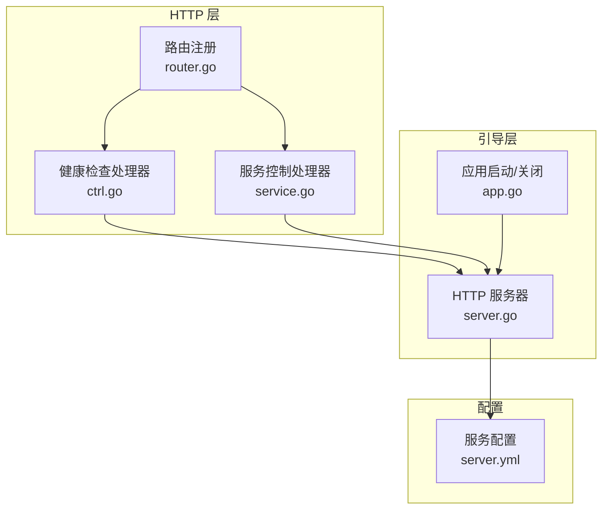
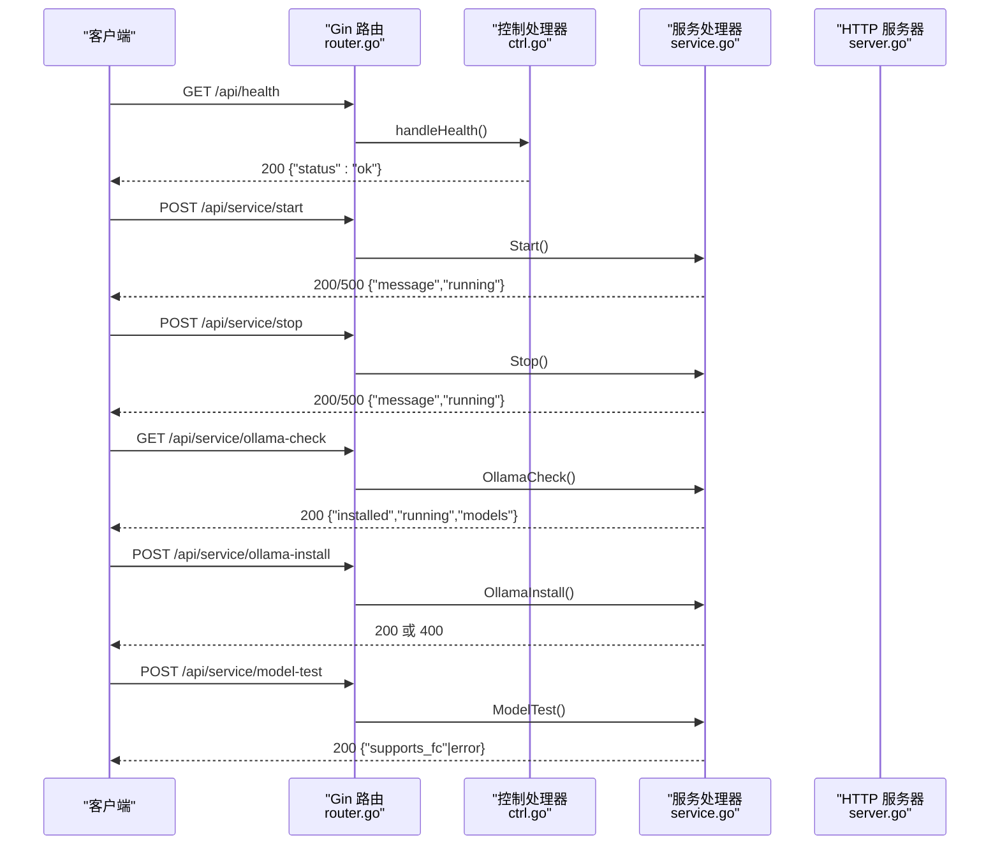
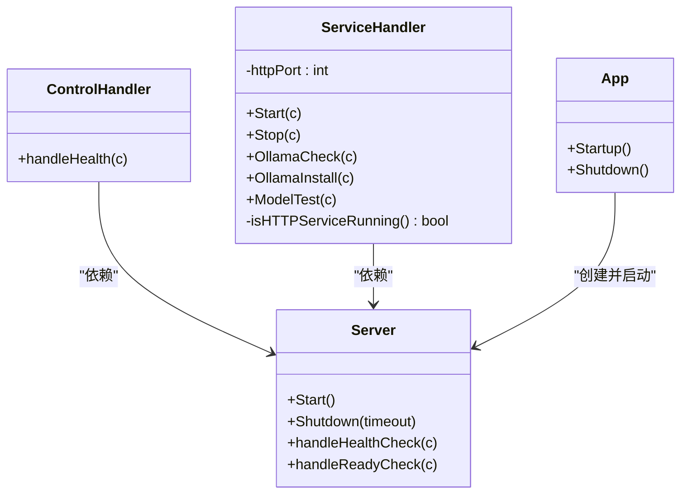

# 健康检查与服务控制

<cite>
**本文引用的文件**
- [cmd/main.go](file://cmd/main.go)
- [internal/adapters/http/handlers/router.go](file://internal/adapters/http/handlers/router.go)
- [internal/adapters/http/handlers/ctrl.go](file://internal/adapters/http/handlers/ctrl.go)
- [internal/adapters/http/handlers/service.go](file://internal/adapters/http/handlers/service.go)
- [internal/infrastructure/bootstrap/server.go](file://internal/infrastructure/bootstrap/server.go)
- [internal/infrastructure/bootstrap/app.go](file://internal/infrastructure/bootstrap/app.go)
- [config/server.yml](file://config/server.yml)
- [internal/infrastructure/embedding/ollama.go](file://internal/infrastructure/embedding/ollama.go)
- [internal/adapters/cli/srvctrl.go](file://internal/adapters/cli/srvctrl.go)
- [scripts/ollama.sh](file://scripts/ollama.sh)
- [scripts/doctor.sh](file://scripts/doctor.sh)
</cite>

## 目录
1. [简介](#简介)
2. [项目结构](#项目结构)
3. [核心组件](#核心组件)
4. [架构总览](#架构总览)
5. [详细组件分析](#详细组件分析)
6. [依赖关系分析](#依赖关系分析)
7. [性能考量](#性能考量)
8. [故障排除指南](#故障排除指南)
9. [结论](#结论)

## 简介
本文件面向 MindX 的健康检查与系统服务控制接口，聚焦以下两类端点：
- 健康检查端点：/api/health
- 服务控制系列端点：/api/service/start、/api/service/stop、/api/service/ollama-check、/api/service/ollama-install、/api/service/model-test

文档覆盖每个端点的 HTTP 方法、请求参数、响应格式、状态码、调用示例与 curl 命令，并提供服务状态监控、错误处理与故障排除建议。同时阐述系统资源检查与依赖服务验证机制。

## 项目结构
MindX 的 HTTP API 由 Gin 引擎承载，路由在注册阶段集中挂载。健康检查与服务控制接口位于 HTTP 层 handlers 中，底层由引导层 bootstrap 启动并提供静态资源与指标端点。

图表来源
- [internal/adapters/http/handlers/router.go](file://internal/adapters/http/handlers/router.go#L18-L33)
- [internal/adapters/http/handlers/ctrl.go](file://internal/adapters/http/handlers/ctrl.go#L15-L17)
- [internal/adapters/http/handlers/service.go](file://internal/adapters/http/handlers/service.go#L16-L24)
- [internal/infrastructure/bootstrap/server.go](file://internal/infrastructure/bootstrap/server.go#L18-L54)
- [internal/infrastructure/bootstrap/app.go](file://internal/infrastructure/bootstrap/app.go#L382-L434)
- [config/server.yml](file://config/server.yml#L1-L21)

章节来源
- [internal/adapters/http/handlers/router.go](file://internal/adapters/http/handlers/router.go#L18-L33)
- [internal/infrastructure/bootstrap/server.go](file://internal/infrastructure/bootstrap/server.go#L18-L54)
- [internal/infrastructure/bootstrap/app.go](file://internal/infrastructure/bootstrap/app.go#L382-L434)
- [config/server.yml](file://config/server.yml#L1-L21)

## 核心组件
- 控制处理器 ControlHandler：提供 /api/health 健康检查。
- 服务处理器 ServiceHandler：提供服务启动/停止、Ollama 检查/安装、模型测试等。
- HTTP 服务器 Server：负责启动/关闭、静态资源、就绪检查与指标端点。
- 应用启动 App：负责装配各子系统并在启动后注册 API 路由。

章节来源
- [internal/adapters/http/handlers/ctrl.go](file://internal/adapters/http/handlers/ctrl.go#L9-L17)
- [internal/adapters/http/handlers/service.go](file://internal/adapters/http/handlers/service.go#L16-L24)
- [internal/infrastructure/bootstrap/server.go](file://internal/infrastructure/bootstrap/server.go#L18-L54)
- [internal/infrastructure/bootstrap/app.go](file://internal/infrastructure/bootstrap/app.go#L382-L434)

## 架构总览
下图展示健康检查与服务控制接口在整体架构中的位置与交互。

图表来源
- [internal/adapters/http/handlers/router.go](file://internal/adapters/http/handlers/router.go#L22-L32)
- [internal/adapters/http/handlers/ctrl.go](file://internal/adapters/http/handlers/ctrl.go#L15-L17)
- [internal/adapters/http/handlers/service.go](file://internal/adapters/http/handlers/service.go#L26-L188)
- [internal/infrastructure/bootstrap/server.go](file://internal/infrastructure/bootstrap/server.go#L63-L68)

## 详细组件分析

### 健康检查端点 /api/health
- HTTP 方法：GET
- 路由注册：在路由注册阶段绑定到 /api/health
- 处理逻辑：返回固定 JSON，包含状态字段
- 响应格式：{"status":"ok"}
- 状态码：200 OK
- 调用示例：
  - curl：curl -s http://localhost:911/api/health
- 说明：该端点与底层 HTTP 服务器的 /health 保持一致，便于外部探针或负载均衡器进行存活检测。

章节来源
- [internal/adapters/http/handlers/router.go](file://internal/adapters/http/handlers/router.go#L22-L24)
- [internal/adapters/http/handlers/ctrl.go](file://internal/adapters/http/handlers/ctrl.go#L15-L17)
- [internal/infrastructure/bootstrap/server.go](file://internal/infrastructure/bootstrap/server.go#L175-L181)

### 服务控制端点

#### /api/service/start
- HTTP 方法：POST
- 请求体：无
- 响应：
  - 成功：{"message":"服务已在运行中"|"服务启动成功","running":true|false}
  - 失败：{"message":"启动服务失败: ...","running":false}
- 状态码：200 成功；500 失败
- 逻辑要点：
  - 若检测到 HTTP 服务已在运行则直接返回成功
  - 否则根据操作系统调用对应的服务启动命令
- 平台差异：
  - macOS：通过 launchctl 启动服务
  - Linux：通过 systemctl 启动服务
  - Windows：通过 sc 启动服务
- 调用示例：
  - curl：curl -s -X POST http://localhost:911/api/service/start

章节来源
- [internal/adapters/http/handlers/service.go](file://internal/adapters/http/handlers/service.go#L26-L48)
- [internal/adapters/http/handlers/service.go](file://internal/adapters/http/handlers/service.go#L204-L242)

#### /api/service/stop
- HTTP 方法：POST
- 请求体：无
- 响应：
  - 成功：{"message":"服务未运行"|"服务停止成功","running":false|true}
  - 失败：{"message":"停止服务失败: ...","running":true}
- 状态码：200 成功；500 失败
- 逻辑要点：
  - 若检测到 HTTP 服务未运行则直接返回
  - 否则根据操作系统调用对应的服务停止命令
- 调用示例：
  - curl：curl -s -X POST http://localhost:911/api/service/stop

章节来源
- [internal/adapters/http/handlers/service.go](file://internal/adapters/http/handlers/service.go#L50-L72)
- [internal/adapters/http/handlers/service.go](file://internal/adapters/http/handlers/service.go#L244-L282)

#### /api/service/ollama-check
- HTTP 方法：GET
- 请求体：无
- 响应：
  - {"installed":false|true,"running":false|true,"models":""|"<model1>\n<model2>"}
- 状态码：200 OK
- 逻辑要点：
  - 检测系统 PATH 是否存在 ollama 可执行文件
  - 向本地 Ollama 服务（默认端口 11434）查询模型列表
  - 返回已安装、运行状态与模型名称列表
- 调用示例：
  - curl：curl -s http://localhost:911/api/service/ollama-check

章节来源
- [internal/adapters/http/handlers/service.go](file://internal/adapters/http/handlers/service.go#L74-L117)

#### /api/service/ollama-install
- HTTP 方法：POST
- 请求体：无
- 响应：
  - macOS/Linux：{"message":"Ollama 安装已启动"}
  - 其他平台：{"error":"请手动安装 Ollama: https://ollama.com/download"}
- 状态码：200 成功；400 不支持的平台
- 逻辑要点：
  - 通过 curl 安装脚本在后台启动安装流程
  - 仅对 macOS 与 Linux 提供自动安装
- 调用示例：
  - curl：curl -s -X POST http://localhost:911/api/service/ollama-install

章节来源
- [internal/adapters/http/handlers/service.go](file://internal/adapters/http/handlers/service.go#L119-L133)

#### /api/service/model-test
- HTTP 方法：POST
- 请求体：{"model_name":"<模型名>"}
- 响应：
  - {"supports_fc":true|false}
  - 或 {"supports_fc":false,"error":"..."}
- 状态码：200 OK
- 逻辑要点：
  - 向本地 Ollama 服务的 OpenAI 兼容端点发起测试请求
  - 解析响应判断是否支持函数调用（tool_calls）
- 调用示例：
  - curl：curl -s -X POST http://localhost:911/api/service/model-test -H "Content-Type: application/json" -d '{"model_name":"qwen3:0.6b"}'

章节来源
- [internal/adapters/http/handlers/service.go](file://internal/adapters/http/handlers/service.go#L135-L188)

### 服务状态监控与依赖验证机制
- HTTP 服务运行状态检测：
  - 通过向本地特定端口（默认 911）的 /api/health 发起短超时请求判断服务是否在线
- Ollama 依赖验证：
  - 检查系统 PATH 是否存在 ollama 可执行文件
  - 向 http://localhost:11434/api/tags 查询模型列表，判断服务是否可用
- 模型兼容性测试：
  - 通过向本地 Ollama 的 OpenAI 兼容端点发起一次 chat/completions 请求，验证函数调用能力

章节来源
- [internal/adapters/http/handlers/service.go](file://internal/adapters/http/handlers/service.go#L190-L202)
- [internal/adapters/http/handlers/service.go](file://internal/adapters/http/handlers/service.go#L88-L114)
- [internal/adapters/http/handlers/service.go](file://internal/adapters/http/handlers/service.go#L144-L187)

## 依赖关系分析

图表来源
- [internal/adapters/http/handlers/ctrl.go](file://internal/adapters/http/handlers/ctrl.go#L9-L17)
- [internal/adapters/http/handlers/service.go](file://internal/adapters/http/handlers/service.go#L16-L24)
- [internal/infrastructure/bootstrap/server.go](file://internal/infrastructure/bootstrap/server.go#L18-L54)
- [internal/infrastructure/bootstrap/app.go](file://internal/infrastructure/bootstrap/app.go#L382-L434)

章节来源
- [internal/adapters/http/handlers/router.go](file://internal/adapters/http/handlers/router.go#L18-L33)
- [internal/infrastructure/bootstrap/server.go](file://internal/infrastructure/bootstrap/server.go#L18-L54)
- [internal/infrastructure/bootstrap/app.go](file://internal/infrastructure/bootstrap/app.go#L382-L434)

## 性能考量
- 健康检查与服务控制端点均为轻量级操作，主要涉及系统调用与少量 HTTP 请求，响应延迟通常较低。
- Ollama 检查与模型测试端点对本地 Ollama 服务有网络依赖，建议在本地网络稳定且 Ollama 服务正常运行时调用。
- 对于频繁调用的场景，建议在客户端侧增加必要的重试与退避策略，避免对服务造成不必要的压力。

## 故障排除指南

### 常见问题与排查步骤
- 无法访问 /api/health
  - 检查服务监听端口是否正确（默认 911），可通过配置文件确认
  - 使用 curl 测试：curl -s http://localhost:911/api/health
- /api/service/start 失败
  - 检查操作系统平台是否受支持（macOS/Linux/Windows）
  - 查看系统服务管理器（launchctl/systemctl/sc）是否可用
  - 参考 CLI 启动方式验证：kernel start
- /api/service/stop 失败
  - 确认服务确实在运行
  - 检查权限与服务管理器状态
- /api/service/ollama-check 返回未运行
  - 确认 Ollama 已安装且可执行文件在 PATH 中
  - 确认 Ollama 服务在默认端口 11434 上运行
  - 可使用脚本辅助安装与拉取模型：scripts/ollama.sh
- /api/service/model-test 失败
  - 确认目标模型已存在并可被 Ollama 加载
  - 参考 doctor 脚本检查必要模型是否已安装：scripts/doctor.sh

### 诊断工具与脚本
- Ollama 安装与模型拉取：scripts/ollama.sh
- 系统与模型健康检查：scripts/doctor.sh
- 服务状态与控制（CLI）：internal/adapters/cli/srvctrl.go

章节来源
- [scripts/ollama.sh](file://scripts/ollama.sh#L1-L27)
- [scripts/doctor.sh](file://scripts/doctor.sh#L47-L94)
- [internal/adapters/cli/srvctrl.go](file://internal/adapters/cli/srvctrl.go#L63-L133)

## 结论
MindX 的健康检查与服务控制接口提供了简洁而实用的运维能力：
- /api/health 用于快速确认服务存活
- /api/service/* 系列端点覆盖服务启停、Ollama 依赖检查与安装、模型兼容性测试
- 通过 CLI 与脚本可实现更全面的系统诊断与自动化部署
- 建议在生产环境中结合探针与告警策略，确保服务可用性与稳定性