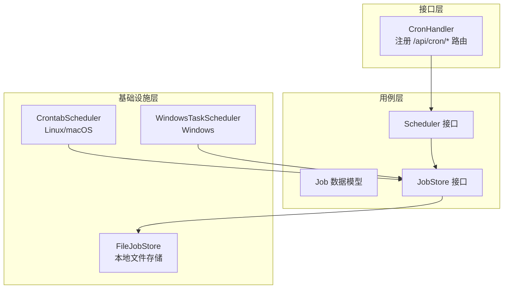
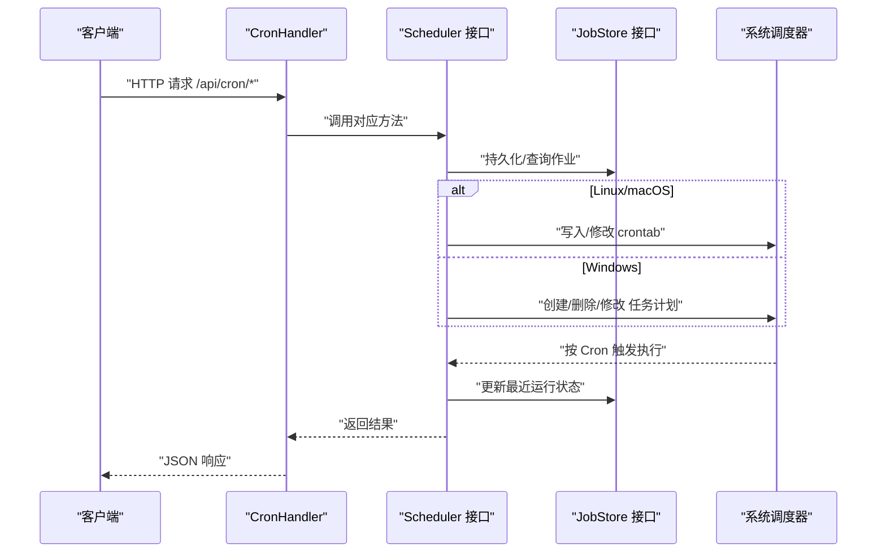
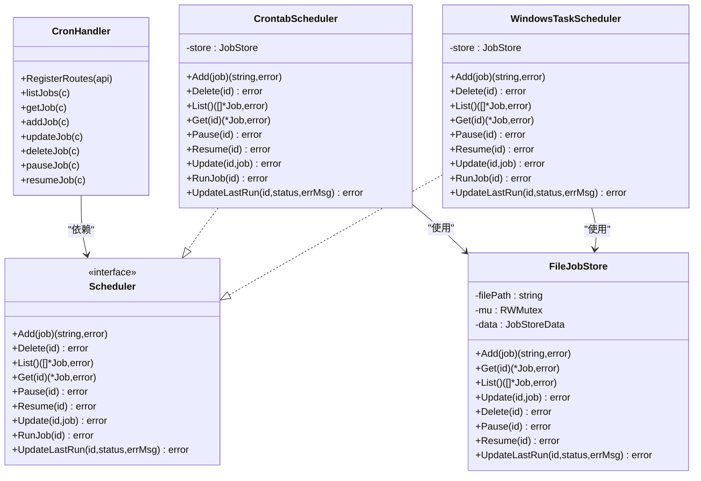

# 定时任务管理

<cite>
**本文引用的文件**
- [internal/adapters/http/handlers/cron.go](file://internal/adapters/http/handlers/cron.go)
- [internal/usecase/cron/scheduler.go](file://internal/usecase/cron/scheduler.go)
- [internal/usecase/cron/job.go](file://internal/usecase/cron/job.go)
- [internal/usecase/cron/store.go](file://internal/usecase/cron/store.go)
- [internal/infrastructure/cron/crontab.go](file://internal/infrastructure/cron/crontab.go)
- [internal/infrastructure/cron/file_store.go](file://internal/infrastructure/cron/file_store.go)
- [internal/infrastructure/cron/windows.go](file://internal/infrastructure/cron/windows.go)
- [internal/infrastructure/cron/windows_stub.go](file://internal/infrastructure/cron/windows_stub.go)
- [internal/infrastructure/bootstrap/app.go](file://internal/infrastructure/bootstrap/app.go)
- [dashboard/src/components/Cron.tsx](file://dashboard/src/components/Cron.tsx)
- [skills/cron/SKILL.md](file://skills/cron/SKILL.md)
</cite>

## 目录
1. [简介](#简介)
2. [项目结构](#项目结构)
3. [核心组件](#核心组件)
4. [架构总览](#架构总览)
5. [详细组件分析](#详细组件分析)
6. [依赖关系分析](#依赖关系分析)
7. [性能考量](#性能考量)
8. [故障排查指南](#故障排查指南)
9. [结论](#结论)
10. [附录](#附录)

## 简介
本文件为 MindX 定时任务管理接口的详细 API 文档，覆盖 /api/cron 系列端点，包括任务查询、创建、更新、删除、暂停/恢复等操作。文档同时说明 Cron 表达式格式、任务配置参数、执行历史字段、错误处理策略，并提供配置示例、调度策略建议、任务执行上下文、并发控制与失败重试机制说明。

## 项目结构
定时任务管理由三层组成：
- 接口层：HTTP 路由与控制器，负责接收请求、绑定参数、调用用例层并返回响应。
- 用例层：定义调度器接口、作业数据模型与持久化接口，屏蔽底层实现差异。
- 基础设施层：根据平台选择具体调度器实现（Linux/macOS 使用 crontab，Windows 使用系统任务计划程序），并提供本地文件存储。

图表来源
- [internal/adapters/http/handlers/cron.go](file://internal/adapters/http/handlers/cron.go#L18-L29)
- [internal/usecase/cron/scheduler.go](file://internal/usecase/cron/scheduler.go#L3-L13)
- [internal/usecase/cron/job.go](file://internal/usecase/cron/job.go#L14-L25)
- [internal/usecase/cron/store.go](file://internal/usecase/cron/store.go#L3-L12)
- [internal/infrastructure/cron/crontab.go](file://internal/infrastructure/cron/crontab.go#L13-L25)
- [internal/infrastructure/cron/windows.go](file://internal/infrastructure/cron/windows.go#L13-L25)
- [internal/infrastructure/cron/file_store.go](file://internal/infrastructure/cron/file_store.go#L16-L55)

章节来源
- [internal/adapters/http/handlers/cron.go](file://internal/adapters/http/handlers/cron.go#L18-L29)
- [internal/usecase/cron/scheduler.go](file://internal/usecase/cron/scheduler.go#L3-L13)
- [internal/usecase/cron/job.go](file://internal/usecase/cron/job.go#L14-L25)
- [internal/usecase/cron/store.go](file://internal/usecase/cron/store.go#L3-L12)
- [internal/infrastructure/cron/crontab.go](file://internal/infrastructure/cron/crontab.go#L13-L25)
- [internal/infrastructure/cron/windows.go](file://internal/infrastructure/cron/windows.go#L13-L25)
- [internal/infrastructure/cron/file_store.go](file://internal/infrastructure/cron/file_store.go#L16-L55)

## 核心组件
- CronHandler：HTTP 控制器，注册 /api/cron 路由组及各端点。
- Scheduler 接口：抽象调度器能力，包含增删改查、暂停/恢复、立即执行、更新最近运行状态等。
- Job：定时任务数据模型，包含标识、名称、Cron 表达式、消息内容、命令、启用状态、创建时间、最近运行时间、状态与错误信息。
- JobStore 接口：抽象作业持久化能力，支持增删改查、启停、更新最近运行状态。
- CrontabScheduler：基于系统 crontab 的实现，Linux/macOS 平台使用；负责将作业写入 crontab 并通过命令行执行。
- WindowsTaskScheduler：基于 Windows 任务计划程序的实现，负责创建/删除/修改/运行任务计划。
- FileJobStore：本地文件存储实现，以 JSON 文件持久化作业列表，支持并发读写锁保护。

章节来源
- [internal/adapters/http/handlers/cron.go](file://internal/adapters/http/handlers/cron.go#L10-L16)
- [internal/usecase/cron/scheduler.go](file://internal/usecase/cron/scheduler.go#L3-L13)
- [internal/usecase/cron/job.go](file://internal/usecase/cron/job.go#L14-L25)
- [internal/usecase/cron/store.go](file://internal/usecase/cron/store.go#L3-L12)
- [internal/infrastructure/cron/crontab.go](file://internal/infrastructure/cron/crontab.go#L13-L25)
- [internal/infrastructure/cron/windows.go](file://internal/infrastructure/cron/windows.go#L13-L25)
- [internal/infrastructure/cron/file_store.go](file://internal/infrastructure/cron/file_store.go#L16-L55)

## 架构总览
定时任务管理采用“接口层-用例层-基础设施层”的分层架构。接口层通过 Gin 路由将 HTTP 请求委派给 CronHandler，后者调用 Scheduler 接口；Scheduler 根据平台选择具体实现（CrontabScheduler 或 WindowsTaskScheduler），并通过 JobStore 将作业持久化到本地文件。作业在系统层面按 Cron 表达式触发，执行时通过命令行调用 MindX CLI 的 send 子命令或 Windows 任务计划程序触发。

图表来源
- [internal/adapters/http/handlers/cron.go](file://internal/adapters/http/handlers/cron.go#L31-L107)
- [internal/usecase/cron/scheduler.go](file://internal/usecase/cron/scheduler.go#L3-L13)
- [internal/infrastructure/cron/crontab.go](file://internal/infrastructure/cron/crontab.go#L27-L122)
- [internal/infrastructure/cron/windows.go](file://internal/infrastructure/cron/windows.go#L27-L167)
- [internal/infrastructure/cron/file_store.go](file://internal/infrastructure/cron/file_store.go#L57-L167)

## 详细组件分析

### HTTP 接口定义
- 路由组：/api/cron
- 支持端点：
  - GET /jobs：列出所有任务
  - GET /jobs/:id：获取单个任务详情
  - POST /jobs：新增任务
  - PUT /jobs/:id：更新任务
  - DELETE /jobs/:id：删除任务
  - POST /jobs/:id/pause：暂停任务
  - POST /jobs/:id/resume：恢复任务

请求与响应要点：
- 新增任务时，请求体需包含任务名称、Cron 表达式与消息内容；成功返回新建任务的 ID。
- 更新任务时，请求体可部分字段更新。
- 暂停/恢复任务时，仅需提供任务 ID。
- 所有端点均返回标准 JSON 结构，错误时返回包含错误信息的对象。

章节来源
- [internal/adapters/http/handlers/cron.go](file://internal/adapters/http/handlers/cron.go#L18-L29)
- [internal/adapters/http/handlers/cron.go](file://internal/adapters/http/handlers/cron.go#L31-L107)

### Cron 表达式格式与调度策略
- 表达式格式：分 时 日 月 周
- 取值范围：
  - 分：0-59
  - 时：0-23
  - 日：1-31
  - 月：1-12
  - 周：0-7（0 和 7 均表示周日）
- 常用示例：
  - 每天 9:00：0 9 * * *
  - 工作日 9:00：0 9 * * 1-5
  - 每周六 9:00：0 9 * * 6
  - 每月 1 日 9:00：0 9 1 * *
  - 每 30 分钟：*/30 * * * *

调度策略建议：
- 使用系统原生调度器（crontab/任务计划程序），确保即使应用未运行也能按时触发。
- 对于高频任务（如每分钟），建议结合业务需求评估系统负载与资源消耗。
- 为关键任务设置合理的错误记录与告警，便于后续排查。

章节来源
- [skills/cron/SKILL.md](file://skills/cron/SKILL.md#L77-L98)
- [internal/infrastructure/cron/crontab.go](file://internal/infrastructure/cron/crontab.go#L11-L11)

### 任务配置参数
- 必填字段（新增时）：名称、Cron 表达式、消息内容
- 可选字段：命令（可为空，由系统自动生成）
- 系统字段（由系统维护）：ID、创建时间、启用状态、最近运行时间、最近状态、最近错误信息

字段说明（来自数据模型）：
- id：任务唯一标识
- name：任务名称
- cron：Cron 表达式
- message：定时触发时发送的消息
- command：实际执行的命令（可由系统生成）
- enabled：是否启用
- created_at：创建时间
- last_run：最近运行时间（可空）
- last_status：最近状态（pending/running/success/error）
- last_error：最近错误信息（可空）

章节来源
- [internal/usecase/cron/job.go](file://internal/usecase/cron/job.go#L14-L25)
- [internal/infrastructure/cron/file_store.go](file://internal/infrastructure/cron/file_store.go#L57-L167)

### 执行历史与状态监控
- 最近运行时间与状态用于前端展示与历史追踪。
- 状态枚举：pending（等待中）、running（运行中）、success（成功）、error（错误）。
- 错误信息可为空，表示无错误。

章节来源
- [internal/usecase/cron/job.go](file://internal/usecase/cron/job.go#L5-L12)
- [internal/infrastructure/cron/file_store.go](file://internal/infrastructure/cron/file_store.go#L152-L167)
- [dashboard/src/components/Cron.tsx](file://dashboard/src/components/Cron.tsx#L14-L16)

### 并发控制与失败重试机制
- 并发控制：系统调度器按 Cron 表达式独立触发任务，不保证同一任务在同一时刻不会重复触发。若需严格去重，请在任务内部自行实现幂等或外部锁。
- 失败重试：当前实现未内置自动重试机制。建议在消息处理层或业务逻辑中实现重试与退避策略，或通过更短周期的 Cron 表达式配合状态检查实现补偿。

章节来源
- [internal/infrastructure/cron/crontab.go](file://internal/infrastructure/cron/crontab.go#L111-L122)
- [internal/infrastructure/cron/windows.go](file://internal/infrastructure/cron/windows.go#L148-L167)

### 错误处理
- 参数校验失败：返回 400，包含错误信息。
- 资源不存在：GET /jobs/:id 返回 404。
- 内部错误：返回 500，包含错误信息。
- 平台不支持：Windows 任务计划程序在非 Windows 平台不可用，初始化时会记录警告。

章节来源
- [internal/adapters/http/handlers/cron.go](file://internal/adapters/http/handlers/cron.go#L52-L60)
- [internal/adapters/http/handlers/cron.go](file://internal/adapters/http/handlers/cron.go#L43-L45)
- [internal/infrastructure/bootstrap/app.go](file://internal/infrastructure/bootstrap/app.go#L248-L260)
- [internal/infrastructure/cron/windows_stub.go](file://internal/infrastructure/cron/windows_stub.go#L10-L12)

### 任务执行上下文
- 任务执行时，系统通过命令行调用 MindX CLI 的 send 子命令，将消息内容作为参数传递，从而触发完整的对话流程。
- Windows 平台通过任务计划程序创建每日 00:00 的计划，实际执行时更新运行状态并在必要时触发后续处理。

章节来源
- [internal/infrastructure/cron/crontab.go](file://internal/infrastructure/cron/crontab.go#L50-L61)
- [internal/infrastructure/cron/crontab.go](file://internal/infrastructure/cron/crontab.go#L111-L122)
- [internal/infrastructure/cron/windows.go](file://internal/infrastructure/cron/windows.go#L148-L167)

### 前端交互与示例
- 前端组件提供任务列表、新增/编辑、暂停/恢复、删除等操作，调用 /api/cron 系列端点。
- 示例表单字段：任务名称、Cron 表达式、消息内容、命令（可选）、启用状态。
- 常用 Cron 示例与说明见技能文档。

章节来源
- [dashboard/src/components/Cron.tsx](file://dashboard/src/components/Cron.tsx#L22-L156)
- [skills/cron/SKILL.md](file://skills/cron/SKILL.md#L89-L145)

## 依赖关系分析

图表来源
- [internal/adapters/http/handlers/cron.go](file://internal/adapters/http/handlers/cron.go#L10-L16)
- [internal/usecase/cron/scheduler.go](file://internal/usecase/cron/scheduler.go#L3-L13)
- [internal/infrastructure/cron/crontab.go](file://internal/infrastructure/cron/crontab.go#L13-L25)
- [internal/infrastructure/cron/windows.go](file://internal/infrastructure/cron/windows.go#L13-L25)
- [internal/infrastructure/cron/file_store.go](file://internal/infrastructure/cron/file_store.go#L16-L55)

章节来源
- [internal/adapters/http/handlers/cron.go](file://internal/adapters/http/handlers/cron.go#L10-L16)
- [internal/usecase/cron/scheduler.go](file://internal/usecase/cron/scheduler.go#L3-L13)
- [internal/infrastructure/cron/crontab.go](file://internal/infrastructure/cron/crontab.go#L13-L25)
- [internal/infrastructure/cron/windows.go](file://internal/infrastructure/cron/windows.go#L13-L25)
- [internal/infrastructure/cron/file_store.go](file://internal/infrastructure/cron/file_store.go#L16-L55)

## 性能考量
- 系统级调度：使用系统原生调度器，避免应用常驻进程中的轮询开销，降低 CPU 占用。
- I/O 与并发：FileJobStore 使用读写锁保护，适合轻量到中量的任务规模；若任务数量较大，建议评估磁盘 I/O 与 JSON 文件大小对性能的影响。
- 平台差异：Linux/macOS 通过 crontab 注入/修改条目，Windows 通过任务计划程序创建/删除任务，两者均在系统层面调度，减少应用侧负担。

[本节为通用性能讨论，不直接分析具体文件]

## 故障排查指南
常见问题与处理：
- 新增任务报错：检查请求体是否包含名称、Cron 表达式与消息内容；确认系统调度器可用（Linux/macOS 需可执行 crontab，Windows 需可执行 schtasks）。
- 获取任务 404：确认任务 ID 是否正确。
- 暂停/恢复失败：确认任务存在且平台支持相应操作。
- 平台不支持：在非 Windows 平台初始化 Windows 任务计划程序会返回错误，属于预期行为。

章节来源
- [internal/adapters/http/handlers/cron.go](file://internal/adapters/http/handlers/cron.go#L52-L60)
- [internal/adapters/http/handlers/cron.go](file://internal/adapters/http/handlers/cron.go#L43-L45)
- [internal/infrastructure/bootstrap/app.go](file://internal/infrastructure/bootstrap/app.go#L248-L260)
- [internal/infrastructure/cron/windows_stub.go](file://internal/infrastructure/cron/windows_stub.go#L10-L12)

## 结论
MindX 的定时任务管理通过清晰的分层架构与系统原生调度器实现了稳定可靠的自动化执行能力。接口层提供简洁易用的 REST API，用例层抽象了调度与存储，基础设施层针对不同平台提供了可替换的实现。建议在生产环境中结合业务需求合理规划 Cron 表达式、监控执行状态并完善错误处理与重试策略。

[本节为总结性内容，不直接分析具体文件]

## 附录

### API 端点一览
- GET /api/cron/jobs：获取任务列表
- GET /api/cron/jobs/:id：获取任务详情
- POST /api/cron/jobs：新增任务
- PUT /api/cron/jobs/:id：更新任务
- DELETE /api/cron/jobs/:id：删除任务
- POST /api/cron/jobs/:id/pause：暂停任务
- POST /api/cron/jobs/:id/resume：恢复任务

章节来源
- [internal/adapters/http/handlers/cron.go](file://internal/adapters/http/handlers/cron.go#L18-L29)

### Cron 表达式参考
- 格式：分 时 日 月 周
- 取值范围：分 0-59，时 0-23，日 1-31，月 1-12，周 0-7
- 常用示例：每天 9:00、工作日 9:00、每周六 9:00、每月 1 日 9:00、每 30 分钟

章节来源
- [skills/cron/SKILL.md](file://skills/cron/SKILL.md#L77-L98)

### 任务配置示例
- 新增任务（示例参数）：名称、Cron 表达式、消息内容
- 列出任务：返回任务数组
- 删除/暂停/恢复任务：传入任务 ID

章节来源
- [skills/cron/SKILL.md](file://skills/cron/SKILL.md#L101-L145)
- [dashboard/src/components/Cron.tsx](file://dashboard/src/components/Cron.tsx#L128-L156)