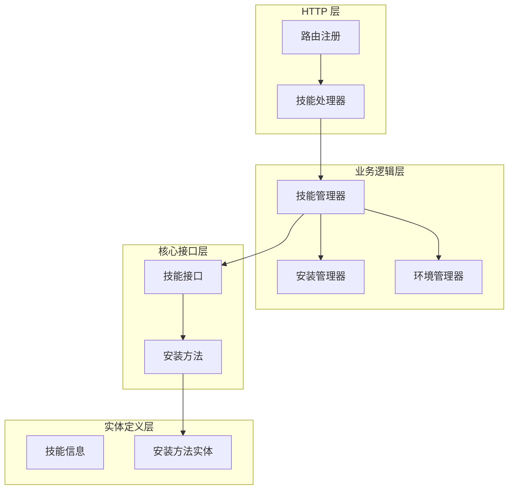
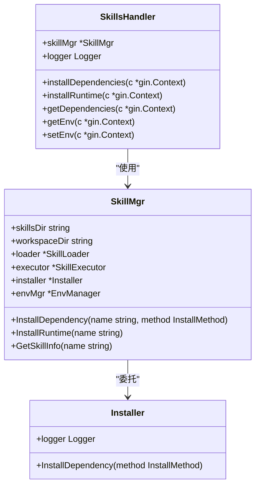
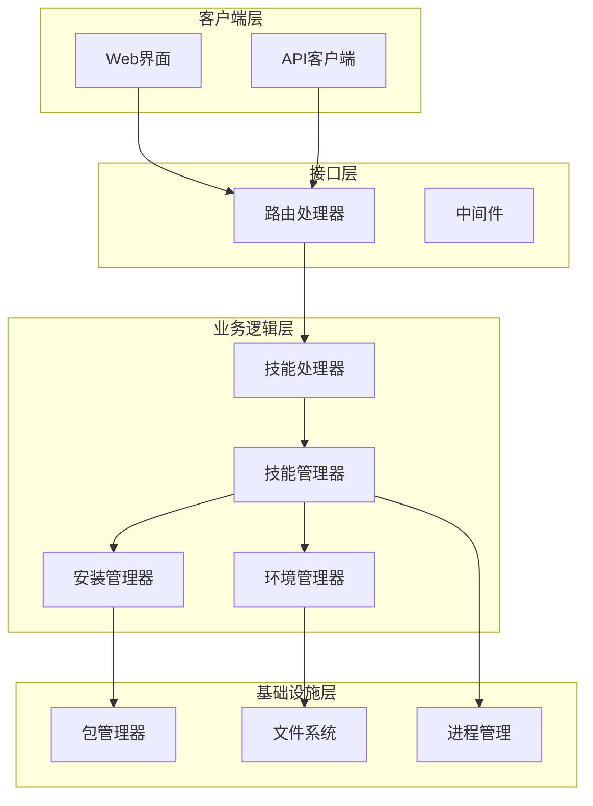
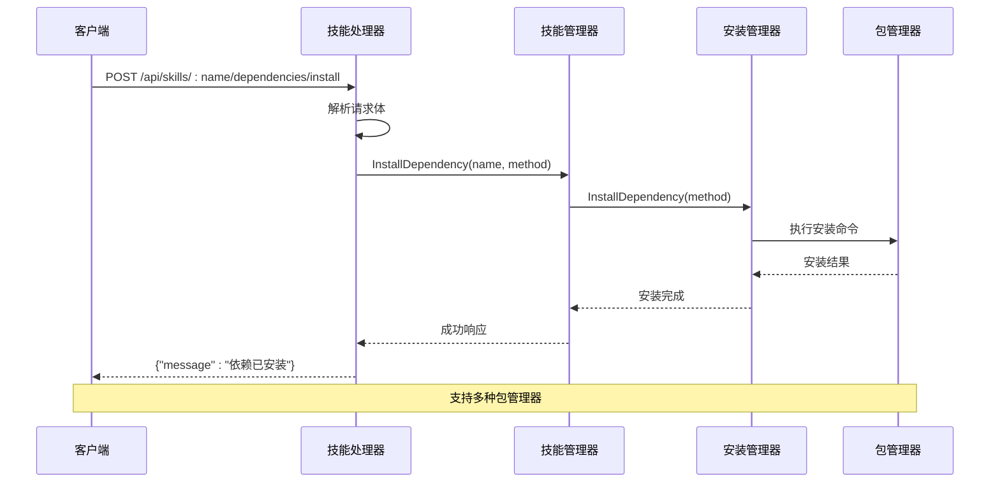
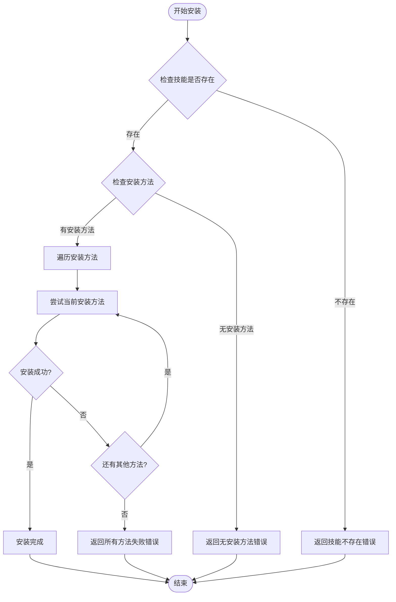
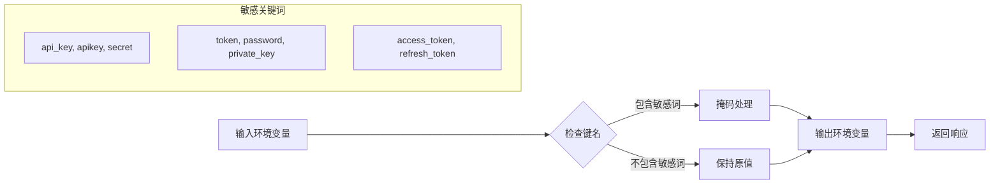
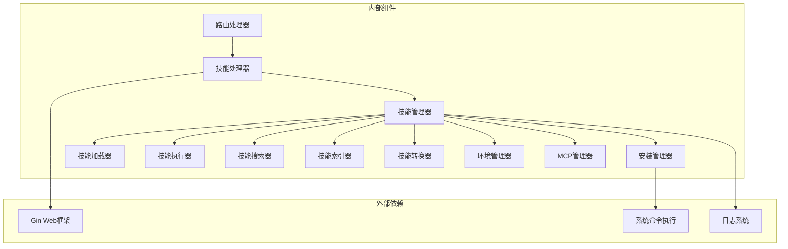

# 技能依赖管理

<cite>
**本文档引用的文件**
- [internal/adapters/http/handlers/skills.go](file://internal/adapters/http/handlers/skills.go)
- [internal/adapters/http/handlers/router.go](file://internal/adapters/http/handlers/router.go)
- [internal/usecase/skills/skill_mgr.go](file://internal/usecase/skills/skill_mgr.go)
- [internal/usecase/skills/skill_installer.go](file://internal/usecase/skills/skill_installer.go)
- [internal/core/skillmgr.go](file://internal/core/skillmgr.go)
- [internal/usecase/skills/README.md](file://internal/usecase/skills/README.md)
- [internal/usecase/skills/SKILL_DEVELOPMENT.md](file://internal/usecase/skills/SKILL_DEVELOPMENT.md)
</cite>

## 目录
1. [简介](#简介)
2. [项目结构](#项目结构)
3. [核心组件](#核心组件)
4. [架构概览](#架构概览)
5. [详细组件分析](#详细组件分析)
6. [依赖关系分析](#依赖关系分析)
7. [性能考虑](#性能考虑)
8. [故障排除指南](#故障排除指南)
9. [结论](#结论)

## 简介

MindX 技能依赖管理系统提供了完整的技能依赖生命周期管理功能，包括依赖安装、运行时安装和依赖查询等核心能力。该系统通过统一的 API 接口为技能开发者和用户提供便捷的依赖管理服务。

系统支持多种包管理器（Homebrew、APT、YUM、DNF、NPM、PIP、Snap、Chocolatey），能够自动检测和安装技能运行所需的系统依赖。同时提供环境变量管理和敏感信息保护机制，确保系统的安全性和稳定性。

## 项目结构

技能依赖管理功能主要分布在以下层次：



**图表来源**
- [internal/adapters/http/handlers/router.go](file://internal/adapters/http/handlers/router.go#L59-L79)
- [internal/adapters/http/handlers/skills.go](file://internal/adapters/http/handlers/skills.go#L14-L25)
- [internal/usecase/skills/skill_mgr.go](file://internal/usecase/skills/skill_mgr.go#L20-L34)

**章节来源**
- [internal/adapters/http/handlers/router.go](file://internal/adapters/http/handlers/router.go#L18-L79)
- [internal/adapters/http/handlers/skills.go](file://internal/adapters/http/handlers/skills.go#L1-L50)

## 核心组件

### HTTP 路由处理器

技能管理器通过 HTTP 处理器提供 RESTful API 接口，包含以下核心端点：

- `POST /api/skills/:name/dependencies/install` - 安装技能依赖
- `POST /api/skills/:name/runtime/install` - 安装运行时环境
- `GET /api/skills/:name/dependencies` - 查询依赖状态

### 技能管理器

技能管理器是整个依赖管理系统的核心，负责协调各个子组件的工作：



**图表来源**
- [internal/adapters/http/handlers/skills.go](file://internal/adapters/http/handlers/skills.go#L14-L25)
- [internal/usecase/skills/skill_mgr.go](file://internal/usecase/skills/skill_mgr.go#L20-L34)
- [internal/usecase/skills/skill_installer.go](file://internal/usecase/skills/skill_installer.go#L12-L22)

**章节来源**
- [internal/adapters/http/handlers/skills.go](file://internal/adapters/http/handlers/skills.go#L142-L214)
- [internal/usecase/skills/skill_mgr.go](file://internal/usecase/skills/skill_mgr.go#L185-L324)

## 架构概览

技能依赖管理系统的整体架构采用分层设计，确保了良好的可维护性和扩展性：



**图表来源**
- [internal/adapters/http/handlers/router.go](file://internal/adapters/http/handlers/router.go#L19-L79)
- [internal/adapters/http/handlers/skills.go](file://internal/adapters/http/handlers/skills.go#L19-L25)
- [internal/usecase/skills/skill_mgr.go](file://internal/usecase/skills/skill_mgr.go#L40-L62)

## 详细组件分析

### 依赖安装功能

依赖安装功能通过 `POST /api/skills/:name/dependencies/install` 端点提供，支持以下特性：

#### 请求格式

```json
{
  "binary": "curl"
}
```

#### 安装流程



**图表来源**
- [internal/adapters/http/handlers/skills.go](file://internal/adapters/http/handlers/skills.go#L142-L169)
- [internal/usecase/skills/skill_mgr.go](file://internal/usecase/skills/skill_mgr.go#L185-L187)
- [internal/usecase/skills/skill_installer.go](file://internal/usecase/skills/skill_installer.go#L24-L66)

#### 支持的包管理器

系统支持以下包管理器进行依赖安装：

| 包管理器 | 操作系统 | 命令示例 |
|---------|---------|---------|
| brew | macOS/Linux | `brew install curl` |
| apt | Ubuntu/Debian | `sudo apt install -y curl` |
| yum | CentOS/RHEL | `sudo yum install -y curl` |
| dnf | Fedora | `sudo dnf install -y curl` |
| npm | Node.js | `npm install -g curl` |
| pip/pip3 | Python | `pip3 install curl` |
| snap | Linux | `sudo snap install curl` |
| choco | Windows | `choco install -y curl` |

**章节来源**
- [internal/usecase/skills/skill_installer.go](file://internal/usecase/skills/skill_installer.go#L24-L53)
- [internal/usecase/skills/README.md](file://internal/usecase/skills/README.md#L104-L110)

### 运行时安装功能

运行时安装功能通过 `POST /api/skills/:name/runtime/install` 端点提供，用于安装技能的完整运行时环境：

#### 安装策略



**图表来源**
- [internal/adapters/http/handlers/skills.go](file://internal/adapters/http/handlers/skills.go#L171-L194)
- [internal/usecase/skills/skill_mgr.go](file://internal/usecase/skills/skill_mgr.go#L290-L324)

#### 安装过程

系统会按照技能定义中的安装方法列表依次尝试安装，直到找到可用的方法为止。每个安装方法都包含以下信息：

- `id`: 安装方法唯一标识
- `kind`: 包管理器类型
- `package`: 包名称
- `formula`: Homebrew formula 名称（可选）
- `label`: 显示名称
- `os`: 适用操作系统列表

**章节来源**
- [internal/usecase/skills/SKILL_DEVELOPMENT.md](file://internal/usecase/skills/SKILL_DEVELOPMENT.md#L132-L142)

### 依赖查询功能

依赖查询功能通过 `GET /api/skills/:name/dependencies` 端点提供，用于检查技能的依赖状态：

#### 查询响应

```json
{
  "name": "weather",
  "missing_bins": []
}
```

#### 缺失依赖检测

系统会检查技能运行所需的所有二进制文件是否可用，并返回缺失的依赖列表。当前实现返回空数组，实际检测逻辑在技能管理器中实现。

**章节来源**
- [internal/adapters/http/handlers/skills.go](file://internal/adapters/http/handlers/skills.go#L196-L214)

### 环境变量管理

系统提供完整的环境变量管理功能，包括读取、设置和敏感信息保护：

#### 敏感信息保护



**图表来源**
- [internal/adapters/http/handlers/skills.go](file://internal/adapters/http/handlers/skills.go#L464-L476)
- [internal/adapters/http/handlers/skills.go](file://internal/adapters/http/handlers/skills.go#L216-L236)

#### 环境变量操作

- `GET /api/skills/:name/env`: 获取技能环境变量
- `POST /api/skills/:name/env`: 设置技能环境变量

**章节来源**
- [internal/adapters/http/handlers/skills.go](file://internal/adapters/http/handlers/skills.go#L216-L250)

## 依赖关系分析

技能依赖管理系统的组件间依赖关系如下：



**图表来源**
- [internal/adapters/http/handlers/router.go](file://internal/adapters/http/handlers/router.go#L3-L12)
- [internal/usecase/skills/skill_mgr.go](file://internal/usecase/skills/skill_mgr.go#L36-L62)

**章节来源**
- [internal/usecase/skills/skill_mgr.go](file://internal/usecase/skills/skill_mgr.go#L1-L85)

## 性能考虑

### 并发处理

技能管理器使用读写锁确保线程安全，支持高并发场景下的依赖管理操作。

### 错误处理

系统实现了完善的错误处理机制，包括：
- 包管理器命令执行失败的捕获和报告
- 技能不存在的优雅处理
- 系统资源不可用时的状态反馈

### 缓存策略

技能信息和环境变量采用缓存机制，减少重复的文件系统访问。

## 故障排除指南

### 常见问题及解决方案

| 问题类型 | 症状 | 可能原因 | 解决方案 |
|---------|------|---------|---------|
| 包管理器安装失败 | 返回安装失败错误 | 权限不足或网络问题 | 检查 sudo 权限和网络连接 |
| 技能不存在 | 返回技能不存在错误 | 技能名称拼写错误 | 验证技能名称正确性 |
| 系统资源不可用 | 返回服务不可用 | 技能管理器初始化失败 | 检查系统资源和依赖项 |
| 敏感信息泄露 | 环境变量明文显示 | 敏感信息保护机制失效 | 检查敏感关键词配置 |

### 调试建议

1. 查看系统日志以获取详细的错误信息
2. 验证包管理器命令的可执行性
3. 检查技能定义文件的完整性
4. 确认环境变量的安全配置

**章节来源**
- [internal/adapters/http/handlers/skills.go](file://internal/adapters/http/handlers/skills.go#L120-L123)
- [internal/adapters/http/handlers/skills.go](file://internal/adapters/http/handlers/skills.go#L154-L157)

## 结论

MindX 技能依赖管理系统提供了完整、可靠的技能依赖管理解决方案。系统通过清晰的分层架构、完善的错误处理机制和安全的信息保护措施，为用户提供了便捷的技能依赖管理体验。

主要特点包括：
- 支持多种包管理器的统一安装接口
- 完善的环境变量管理和敏感信息保护
- 可扩展的安装方法配置机制
- 优雅的错误处理和状态反馈
- 安全的权限控制和资源管理

该系统为 MindX 生态系统中的技能开发和部署提供了坚实的基础支撑。