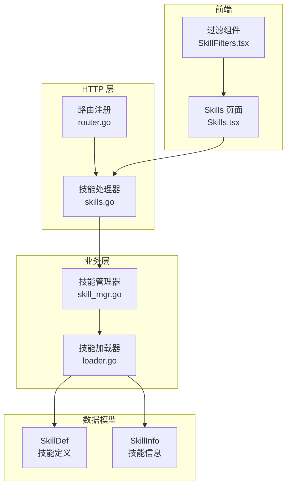
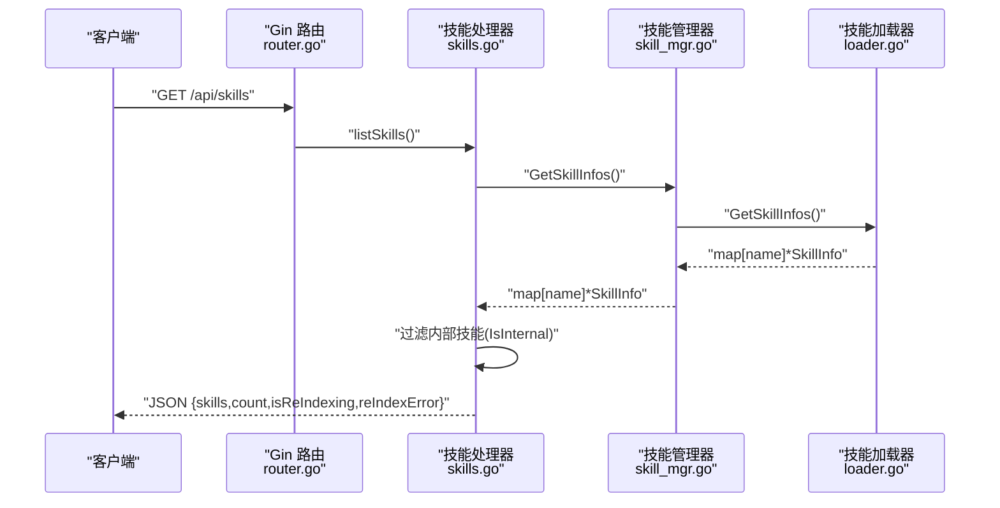
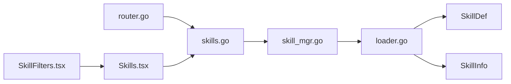
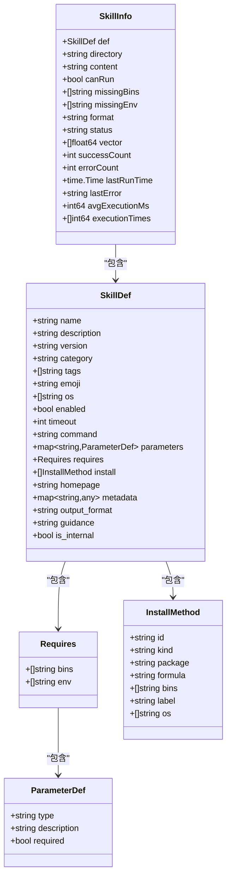

# 技能列表查询

<cite>
**本文引用的文件**
- [internal/adapters/http/handlers/skills.go](file://internal/adapters/http/handlers/skills.go)
- [internal/adapters/http/handlers/router.go](file://internal/adapters/http/handlers/router.go)
- [internal/entity/skill.go](file://internal/entity/skill.go)
- [internal/usecase/skills/loader.go](file://internal/usecase/skills/loader.go)
- [internal/usecase/skills/skill_mgr.go](file://internal/usecase/skills/skill_mgr.go)
- [skills/calculator/SKILL.md](file://skills/calculator/SKILL.md)
- [skills/web_search/SKILL.md](file://skills/web_search/SKILL.md)
- [dashboard/src/components/Skills.tsx](file://dashboard/src/components/Skills.tsx)
- [dashboard/src/components/skills/SkillFilters.tsx](file://dashboard/src/components/skills/SkillFilters.tsx)
</cite>

## 目录
1. [简介](#简介)
2. [项目结构](#项目结构)
3. [核心组件](#核心组件)
4. [架构总览](#架构总览)
5. [详细组件分析](#详细组件分析)
6. [依赖关系分析](#依赖关系分析)
7. [性能考量](#性能考量)
8. [故障排查指南](#故障排查指南)
9. [结论](#结论)
10. [附录](#附录)

## 简介
本文件为 MindX 技能列表查询接口的详细 API 文档，聚焦于 GET /api/skills 端点。内容涵盖：
- 接口功能与用途
- 请求与响应格式
- 技能列表数据结构与字段含义
- 过滤逻辑（内部技能排除与客户端显示规则）
- 分页参数说明（当前实现不支持分页）
- 重索引状态与错误信息
- 请求与响应示例

## 项目结构
围绕技能列表查询的关键文件组织如下：
- HTTP 层：路由注册与处理器
- 业务层：技能管理器与加载器
- 数据模型：技能定义与技能信息
- 前端展示：过滤与状态显示

图表来源
- [internal/adapters/http/handlers/router.go](file://internal/adapters/http/handlers/router.go#L18-L79)
- [internal/adapters/http/handlers/skills.go](file://internal/adapters/http/handlers/skills.go#L14-L56)
- [internal/usecase/skills/skill_mgr.go](file://internal/usecase/skills/skill_mgr.go#L20-L84)
- [internal/usecase/skills/loader.go](file://internal/usecase/skills/loader.go#L18-L123)
- [internal/entity/skill.go](file://internal/entity/skill.go#L5-L82)
- [dashboard/src/components/Skills.tsx](file://dashboard/src/components/Skills.tsx#L1-L33)
- [dashboard/src/components/skills/SkillFilters.tsx](file://dashboard/src/components/skills/SkillFilters.tsx#L1-L31)

章节来源
- [internal/adapters/http/handlers/router.go](file://internal/adapters/http/handlers/router.go#L18-L79)
- [internal/adapters/http/handlers/skills.go](file://internal/adapters/http/handlers/skills.go#L14-L56)
- [internal/usecase/skills/skill_mgr.go](file://internal/usecase/skills/skill_mgr.go#L20-L84)
- [internal/usecase/skills/loader.go](file://internal/usecase/skills/loader.go#L18-L123)
- [internal/entity/skill.go](file://internal/entity/skill.go#L5-L82)
- [dashboard/src/components/Skills.tsx](file://dashboard/src/components/Skills.tsx#L1-L33)
- [dashboard/src/components/skills/SkillFilters.tsx](file://dashboard/src/components/skills/SkillFilters.tsx#L1-L31)

## 核心组件
- 路由注册：在 /api/skills 下注册 GET /api/skills 等端点。
- 技能处理器：负责获取技能信息、过滤内部技能、返回重索引状态与错误信息。
- 技能管理器：提供技能集合、启用/禁用、重索引、搜索等能力。
- 技能加载器：解析 SKILL.md，构建 SkillDef 与 SkillInfo，并设置技能状态与格式。
- 数据模型：SkillDef 描述技能元数据；SkillInfo 包含运行状态、格式、统计信息等。

章节来源
- [internal/adapters/http/handlers/router.go](file://internal/adapters/http/handlers/router.go#L59-L79)
- [internal/adapters/http/handlers/skills.go](file://internal/adapters/http/handlers/skills.go#L27-L56)
- [internal/usecase/skills/skill_mgr.go](file://internal/usecase/skills/skill_mgr.go#L130-L149)
- [internal/usecase/skills/loader.go](file://internal/usecase/skills/loader.go#L60-L123)
- [internal/entity/skill.go](file://internal/entity/skill.go#L5-L82)

## 架构总览
GET /api/skills 的调用链路如下：

图表来源
- [internal/adapters/http/handlers/router.go](file://internal/adapters/http/handlers/router.go#L60-L66)
- [internal/adapters/http/handlers/skills.go](file://internal/adapters/http/handlers/skills.go#L27-L56)
- [internal/usecase/skills/skill_mgr.go](file://internal/usecase/skills/skill_mgr.go#L147-L149)
- [internal/usecase/skills/loader.go](file://internal/usecase/skills/loader.go#L136-L144)

## 详细组件分析

### 端点定义与路由
- 路径：/api/skills
- 方法：GET
- 功能：返回所有可用技能的列表，同时包含计数、重索引状态与错误信息。

章节来源
- [internal/adapters/http/handlers/router.go](file://internal/adapters/http/handlers/router.go#L60-L66)

### 请求与响应
- 请求
  - 无需查询参数或请求体。
  - 当前实现不支持分页参数（如 page、size），返回所有技能列表。
- 响应
  - 成功：200 OK，JSON 对象包含以下字段：
    - skills: 技能数组（SkillInfo[]，内部技能已过滤）
    - count: 技能数量（整数）
    - isReIndexing: 是否正在重索引（布尔）
    - reIndexError: 重索引错误信息（字符串，若无错误则为空）

章节来源
- [internal/adapters/http/handlers/skills.go](file://internal/adapters/http/handlers/skills.go#L27-L56)

### 技能过滤逻辑
- 内部技能排除
  - 处理器在组装响应前，遍历所有技能信息，跳过定义中标记为内部技能的条目（IsInternal 为真）。
- 客户端显示规则
  - 前端根据技能的 status 字段与 format 字段进行本地过滤与展示：
    - status: ready（准备就绪）、installed（已安装）、error（错误）
    - format: standard（标准）、external（外部）、mcp（MCP 技能）
  - 前端还会在重索引过程中显示 overlay 提示与错误信息。

章节来源
- [internal/adapters/http/handlers/skills.go](file://internal/adapters/http/handlers/skills.go#L33-L40)
- [internal/usecase/skills/loader.go](file://internal/usecase/skills/loader.go#L96-L101)
- [dashboard/src/components/Skills.tsx](file://dashboard/src/components/Skills.tsx#L182-L192)
- [dashboard/src/components/skills/SkillFilters.tsx](file://dashboard/src/components/skills/SkillFilters.tsx#L1-L31)

### 技能列表数据结构
技能数组中的每个元素为 SkillInfo，其关键字段说明：
- def: 技能定义（SkillDef）
  - name: 名称
  - description: 描述
  - version: 版本
  - category: 分类
  - tags: 标签数组
  - emoji: 表情符号
  - os: 支持的操作系统
  - enabled: 是否启用
  - timeout: 超时时间
  - command: 执行命令
  - parameters: 参数定义
  - requires: 依赖要求
  - install: 安装方法
  - homepage: 主页
  - metadata: 元数据
  - output_format: 输出格式
  - guidance: 引导说明
  - is_internal: 是否为内部技能
- directory: 技能目录路径
- content: 技能文件内容
- canRun: 是否可运行（依赖满足）
- missingBins: 缺失的二进制依赖
- missingEnv: 缺失的环境变量依赖
- format: 技能格式（standard/external/mcp）
- status: 技能状态（ready/error/disabled）
- vector: 向量（用于相似性搜索）
- successCount/errorCount/lastRunTime/lastError/avgExecutionMs/executionTimes: 统计信息

章节来源
- [internal/entity/skill.go](file://internal/entity/skill.go#L59-L82)
- [internal/usecase/skills/loader.go](file://internal/usecase/skills/loader.go#L103-L114)

### 技能定义示例
- 标准技能示例：calculator
  - 包含基础元数据、参数定义与示例。
- 内部技能示例：web_search
  - 包含 is_internal 标记，因此不会出现在 GET /api/skills 的响应中。

章节来源
- [skills/calculator/SKILL.md](file://skills/calculator/SKILL.md#L1-L37)
- [skills/web_search/SKILL.md](file://skills/web_search/SKILL.md#L1-L67)

### 重索引状态与错误信息
- isReIndexing：指示当前是否正在进行重索引。
- reIndexError：记录最近一次重索引的错误信息，若无错误则为空字符串。
- 前端在重索引期间会显示 overlay，并根据 reIndexError 提示用户。

章节来源
- [internal/adapters/http/handlers/skills.go](file://internal/adapters/http/handlers/skills.go#L42-L55)
- [internal/usecase/skills/skill_mgr.go](file://internal/usecase/skills/skill_mgr.go#L262-L268)
- [dashboard/src/components/Skills.tsx](file://dashboard/src/components/Skills.tsx#L197-L207)

### 分页参数
- 当前实现不支持分页参数（如 page、size）。响应将返回所有过滤后的技能列表。
- 若需分页，建议在客户端或网关层自行实现。

章节来源
- [internal/adapters/http/handlers/skills.go](file://internal/adapters/http/handlers/skills.go#L27-L56)

### 请求与响应示例
- 请求
  - GET /api/skills
- 响应（示例结构）
  - skills: 技能数组（SkillInfo[]，内部技能已过滤）
  - count: 整数（技能数量）
  - isReIndexing: 布尔（是否正在重索引）
  - reIndexError: 字符串（重索引错误信息，可能为空）

章节来源
- [internal/adapters/http/handlers/skills.go](file://internal/adapters/http/handlers/skills.go#L50-L55)

## 依赖关系分析
- 路由到处理器：/api/skills -> listSkills
- 处理器到管理器：listSkills -> GetSkillInfos
- 管理器到加载器：GetSkillInfos -> loader.GetSkillInfos
- 加载器到模型：SkillDef/SkillInfo
- 前端到处理器：Skills 页面通过 /api/skills 获取数据，结合本地过滤与状态显示

图表来源
- [internal/adapters/http/handlers/router.go](file://internal/adapters/http/handlers/router.go#L60-L66)
- [internal/adapters/http/handlers/skills.go](file://internal/adapters/http/handlers/skills.go#L27-L56)
- [internal/usecase/skills/skill_mgr.go](file://internal/usecase/skills/skill_mgr.go#L147-L149)
- [internal/usecase/skills/loader.go](file://internal/usecase/skills/loader.go#L136-L144)
- [internal/entity/skill.go](file://internal/entity/skill.go#L5-L82)
- [dashboard/src/components/Skills.tsx](file://dashboard/src/components/Skills.tsx#L1-L33)
- [dashboard/src/components/skills/SkillFilters.tsx](file://dashboard/src/components/skills/SkillFilters.tsx#L1-L31)

## 性能考量
- 技能列表一次性返回：当前实现返回所有技能，未做分页，适合技能规模较小的场景。
- 内部技能过滤在处理器侧完成，避免了前端重复处理。
- 重索引状态与错误信息实时返回，便于前端及时反馈。

## 故障排查指南
- 服务不可用
  - 现象：返回 503 Service Unavailable，包含错误信息。
  - 原因：技能管理器为空。
  - 处理：检查服务启动与依赖初始化。
- 重索引冲突
  - 现象：触发重索引时返回 409 Conflict，提示“重索引已在进行中”。
  - 原因：已有重索引任务在执行。
  - 处理：等待当前重索引完成后再次尝试。
- 重索引错误
  - 现象：reIndexError 非空。
  - 原因：重索引过程中发生异常。
  - 处理：查看服务日志，修复索引相关问题后重试。

章节来源
- [internal/adapters/http/handlers/skills.go](file://internal/adapters/http/handlers/skills.go#L28-L31)
- [internal/adapters/http/handlers/skills.go](file://internal/adapters/http/handlers/skills.go#L83-L86)
- [internal/adapters/http/handlers/skills.go](file://internal/adapters/http/handlers/skills.go#L46-L48)

## 结论
GET /api/skills 提供了 MindX 技能列表的核心访问入口，具备以下特点：
- 返回所有可用技能（内部技能已过滤）
- 包含计数与重索引状态/错误信息
- 不支持分页参数
- 前端可基于 status 与 format 进行本地过滤与展示

## 附录

### 数据模型类图

图表来源
- [internal/entity/skill.go](file://internal/entity/skill.go#L5-L82)