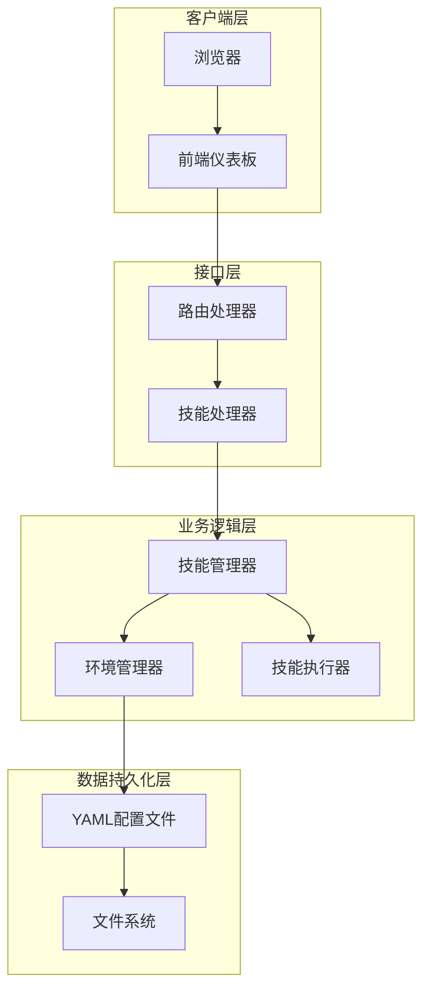
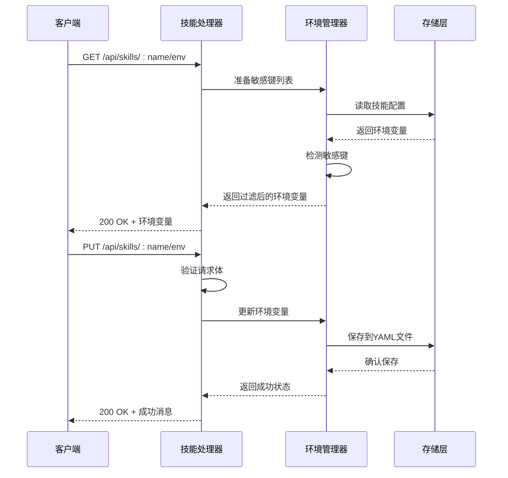
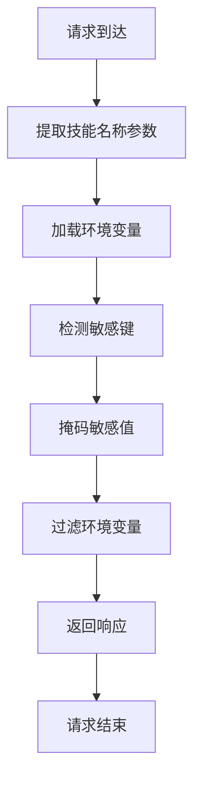
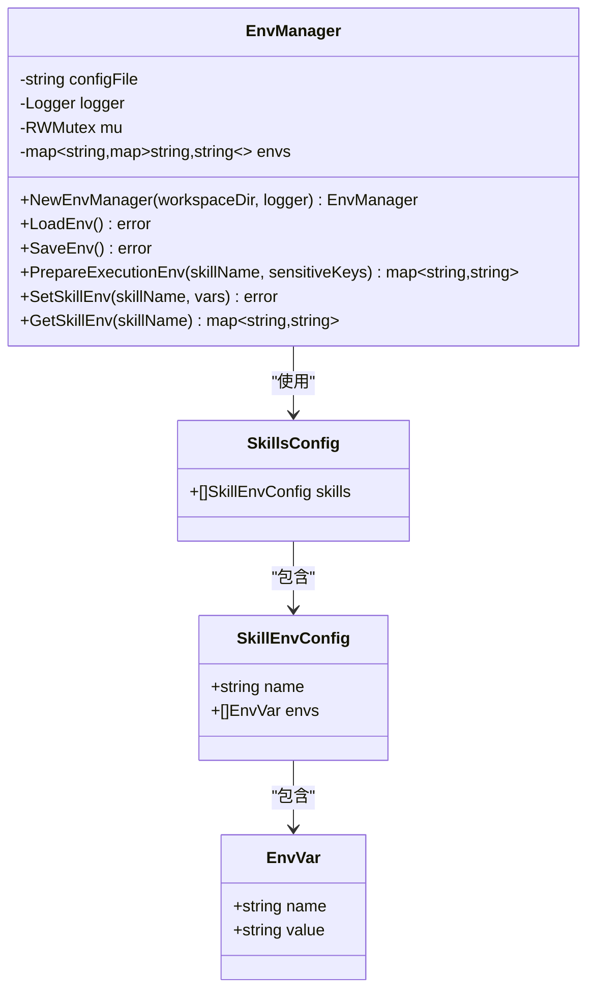
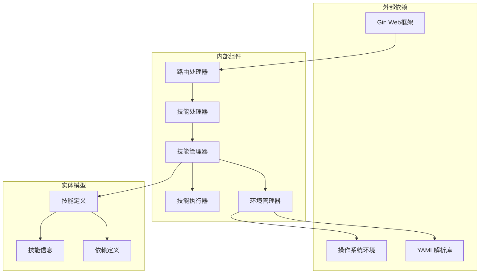

# 技能环境配置

<cite>
**本文档引用的文件**
- [cmd/main.go](file://cmd/main.go)
- [internal/adapters/http/handlers/router.go](file://internal/adapters/http/handlers/router.go)
- [internal/adapters/http/handlers/skills.go](file://internal/adapters/http/handlers/skills.go)
- [internal/usecase/skills/skill_env.go](file://internal/usecase/skills/skill_env.go)
- [internal/usecase/skills/skill_mgr.go](file://internal/usecase/skills/skill_mgr.go)
- [internal/entity/skill.go](file://internal/entity/skill.go)
- [dashboard/src/components/Skills.tsx](file://dashboard/src/components/Skills.tsx)
- [dashboard/src/components/skills/SkillEnvDialog.tsx](file://dashboard/src/components/skills/SkillEnvDialog.tsx)
</cite>

## 目录
1. [简介](#简介)
2. [项目结构](#项目结构)
3. [核心组件](#核心组件)
4. [架构概览](#架构概览)
5. [详细组件分析](#详细组件分析)
6. [依赖关系分析](#依赖关系分析)
7. [性能考虑](#性能考虑)
8. [故障排除指南](#故障排除指南)
9. [结论](#结论)

## 简介

MindX 技能环境配置接口提供了对技能运行时环境变量的完整管理功能。该系统支持环境变量的查询、设置和安全保护，确保敏感信息得到适当的处理和保护。

系统采用分层架构设计，包含HTTP接口层、业务逻辑层和数据持久化层，实现了环境变量的安全存储、动态加载和执行时的环境准备。

## 项目结构



**图表来源**
- [internal/adapters/http/handlers/router.go](file://internal/adapters/http/handlers/router.go#L59-L79)
- [internal/adapters/http/handlers/skills.go](file://internal/adapters/http/handlers/skills.go#L14-L25)
- [internal/usecase/skills/skill_mgr.go](file://internal/usecase/skills/skill_mgr.go#L20-L34)

**章节来源**
- [cmd/main.go](file://cmd/main.go#L1-L21)
- [internal/adapters/http/handlers/router.go](file://internal/adapters/http/handlers/router.go#L59-L79)

## 核心组件

### 技能环境管理系统

系统的核心是EnvManager组件，负责环境变量的生命周期管理：

- **配置文件管理**: 使用YAML格式存储技能环境配置
- **内存缓存**: 提供线程安全的环境变量缓存机制
- **执行时准备**: 为技能执行准备完整的环境变量集合

### 敏感信息保护机制

系统实现了多层次的敏感信息保护：

- **敏感键检测**: 自动识别潜在的敏感环境变量键名
- **自动掩码**: 在响应中自动隐藏敏感值
- **权限控制**: 通过文件权限限制配置文件的访问

**章节来源**
- [internal/usecase/skills/skill_env.go](file://internal/usecase/skills/skill_env.go#L28-L42)
- [internal/adapters/http/handlers/skills.go](file://internal/adapters/http/handlers/skills.go#L464-L476)

## 架构概览



**图表来源**
- [internal/adapters/http/handlers/skills.go](file://internal/adapters/http/handlers/skills.go#L216-L250)
- [internal/usecase/skills/skill_env.go](file://internal/usecase/skills/skill_env.go#L70-L98)

## 详细组件分析

### HTTP接口层

#### 路由配置

系统在HTTP路由中定义了技能环境相关的端点：

- `GET /api/skills/:name/env` - 查询技能环境变量
- `PUT /api/skills/:name/env` - 设置技能环境变量

#### 环境变量查询接口

查询接口实现了完整的敏感信息保护机制：



**图表来源**
- [internal/adapters/http/handlers/skills.go](file://internal/adapters/http/handlers/skills.go#L216-L236)

#### 环境变量设置接口

设置接口提供了基础的环境变量更新功能：

- **请求验证**: 验证JSON请求体的有效性
- **日志记录**: 记录环境变量更新操作
- **响应处理**: 返回操作结果

**章节来源**
- [internal/adapters/http/handlers/router.go](file://internal/adapters/http/handlers/router.go#L68-L73)
- [internal/adapters/http/handlers/skills.go](file://internal/adapters/http/handlers/skills.go#L238-L250)

### 业务逻辑层

#### 环境管理器

EnvManager是环境变量管理的核心组件：



**图表来源**
- [internal/usecase/skills/skill_env.go](file://internal/usecase/skills/skill_env.go#L14-L42)

#### 敏感信息检测机制

系统实现了智能的敏感信息检测算法：

- **前缀匹配**: 检测以敏感词开头的键名
- **后缀匹配**: 检测以敏感词结尾的键名  
- **完全匹配**: 精确匹配敏感键名

**章节来源**
- [internal/adapters/http/handlers/skills.go](file://internal/adapters/http/handlers/skills.go#L464-L476)

### 数据持久化层

#### YAML配置格式

环境变量配置采用YAML格式存储：

```yaml
skills:
  - name: skill-name
    envs:
      - name: API_KEY
        value: "masked"
      - name: DATABASE_URL
        value: "production"
```

#### 文件权限管理

配置文件具有严格的权限控制：
- **读取权限**: 仅限当前用户
- **写入权限**: 仅限当前用户
- **文件夹权限**: 755权限，允许读取但限制写入

**章节来源**
- [internal/usecase/skills/skill_env.go](file://internal/usecase/skills/skill_env.go#L70-L98)

## 依赖关系分析



**图表来源**
- [internal/adapters/http/handlers/skills.go](file://internal/adapters/http/handlers/skills.go#L3-L12)
- [internal/usecase/skills/skill_mgr.go](file://internal/usecase/skills/skill_mgr.go#L36-L48)

**章节来源**
- [internal/entity/skill.go](file://internal/entity/skill.go#L6-L31)

## 性能考虑

### 缓存策略

系统采用了多层缓存机制来优化性能：

- **内存缓存**: EnvManager维护内存中的环境变量缓存
- **读写分离**: 使用RWMutex实现高效的并发访问
- **懒加载**: 配置文件仅在需要时加载

### 并发安全

- **线程安全**: 所有共享资源都使用互斥锁保护
- **无阻塞读取**: 读操作使用读锁，允许多个并发读取
- **写操作串行化**: 写操作使用写锁，确保数据一致性

## 故障排除指南

### 常见问题及解决方案

#### 环境变量查询异常

**症状**: 查询技能环境变量时返回错误

**可能原因**:
1. 技能名称不存在
2. 配置文件损坏
3. 权限不足

**解决步骤**:
1. 验证技能名称的正确性
2. 检查配置文件格式
3. 确认文件权限设置

#### 环境变量设置失败

**症状**: 设置环境变量后无法生效

**可能原因**:
1. 请求格式不正确
2. 配置文件写入失败
3. 文件权限问题

**解决步骤**:
1. 验证JSON格式的有效性
2. 检查磁盘空间和权限
3. 查看系统日志获取详细错误信息

**章节来源**
- [internal/adapters/http/handlers/skills.go](file://internal/adapters/http/handlers/skills.go#L216-L250)

## 结论

MindX技能环境配置系统提供了一个完整、安全且高效的环境变量管理解决方案。系统通过以下特性确保了良好的用户体验和安全性：

- **完整的API覆盖**: 支持环境变量的查询和设置操作
- **智能安全保护**: 自动检测和掩码敏感信息
- **可靠的持久化**: 使用YAML格式确保配置的可读性和可维护性
- **高性能设计**: 采用缓存和并发控制机制优化性能
- **清晰的架构**: 分层设计便于维护和扩展

该系统为MindX平台的技能执行提供了坚实的基础，确保了技能运行时环境的灵活性和安全性。