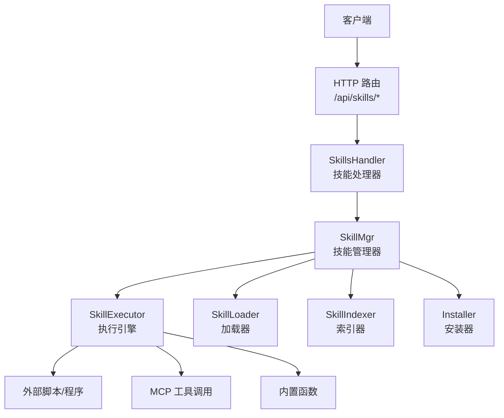
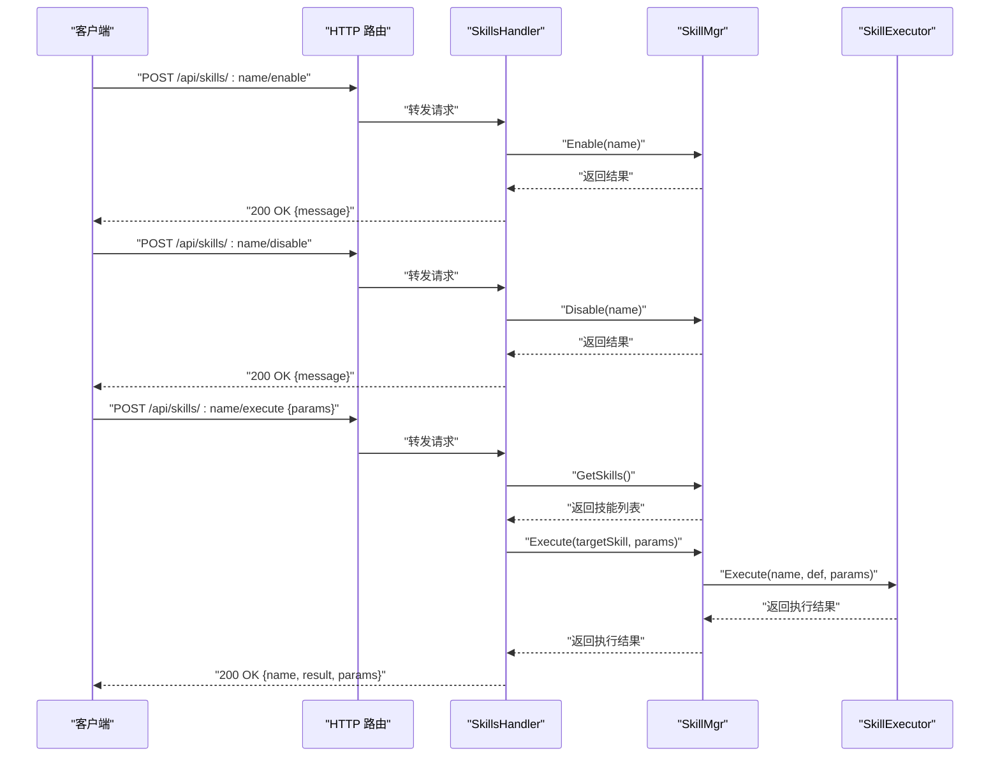
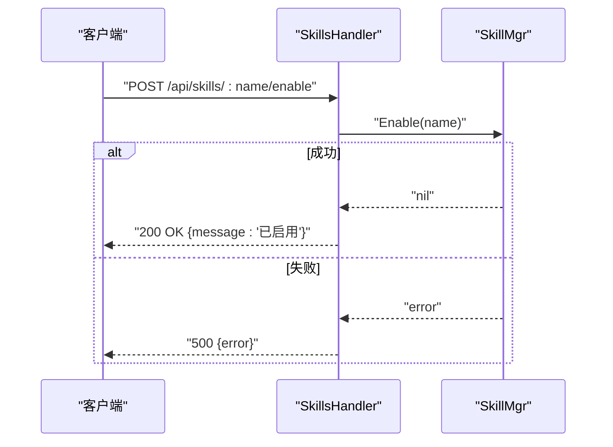
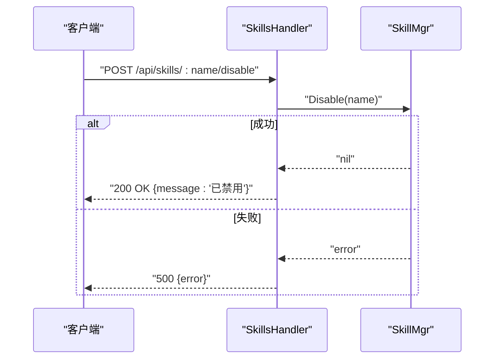
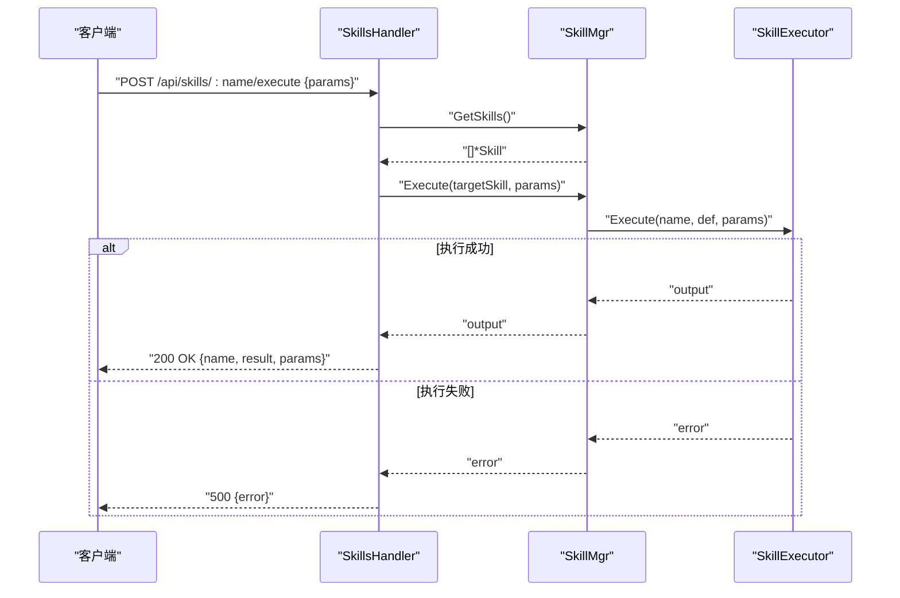
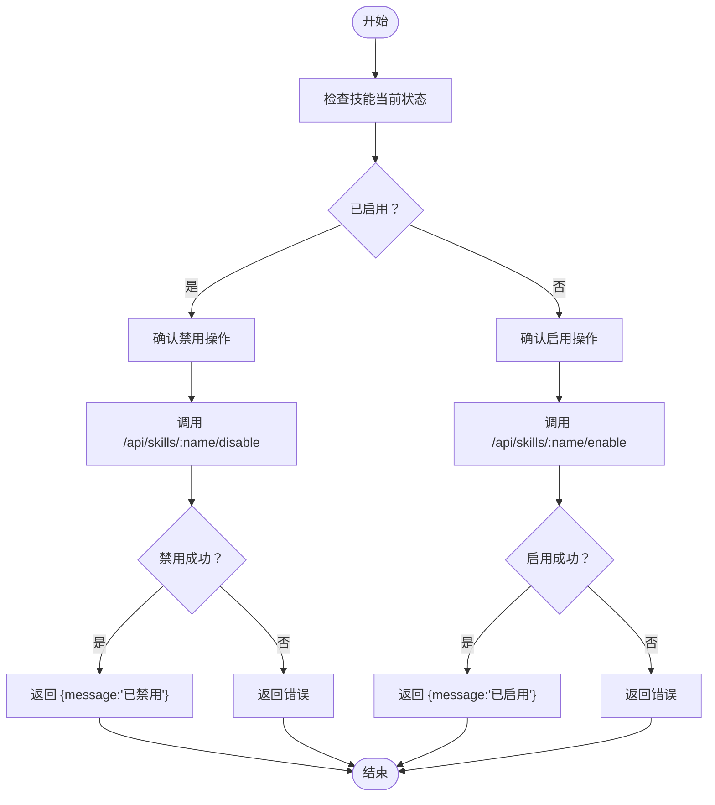
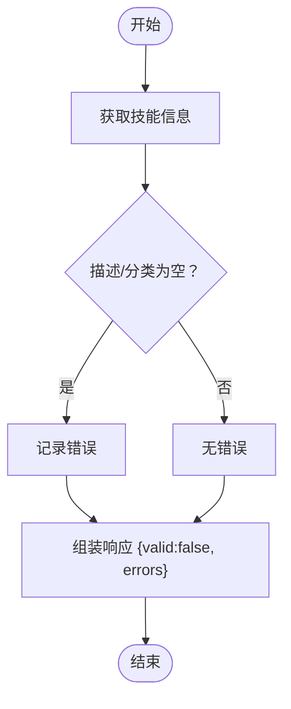
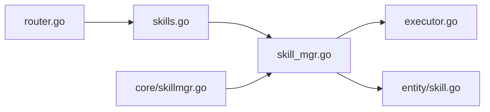

# 技能生命周期管理

<cite>
**本文引用的文件**
- [cmd/main.go](file://cmd/main.go)
- [internal/adapters/http/handlers/router.go](file://internal/adapters/http/handlers/router.go)
- [internal/adapters/http/handlers/skills.go](file://internal/adapters/http/handlers/skills.go)
- [internal/core/skillmgr.go](file://internal/core/skillmgr.go)
- [internal/entity/skill.go](file://internal/entity/skill.go)
- [internal/usecase/skills/skill_mgr.go](file://internal/usecase/skills/skill_mgr.go)
- [internal/usecase/skills/executor.go](file://internal/usecase/skills/executor.go)
- [internal/usecase/training/validator.go](file://internal/usecase/training/validator.go)
</cite>

## 目录
1. [简介](#简介)
2. [项目结构](#项目结构)
3. [核心组件](#核心组件)
4. [架构总览](#架构总览)
5. [详细组件分析](#详细组件分析)
6. [依赖关系分析](#依赖关系分析)
7. [性能考量](#性能考量)
8. [故障排查指南](#故障排查指南)
9. [结论](#结论)
10. [附录](#附录)

## 简介
本文件面向 MindX 技能生命周期管理接口，聚焦以下核心端点与流程：
- POST /api/skills/:name/enable：启用指定技能
- POST /api/skills/:name/disable：禁用指定技能
- POST /api/skills/:name/execute：执行指定技能并传参

文档将详细说明各端点的功能、参数、返回值、错误处理，并给出技能状态变更与执行的完整流程示例；同时解释技能验证机制与质量检查流程。

## 项目结构
MindX 的技能管理由 HTTP 层路由、处理器、领域模型与用例层共同组成。核心路径如下：
- 路由注册：在 HTTP 路由中挂载 /api/skills 下的所有技能相关端点
- 处理器：SkillsHandler 提供技能列表、查询、启用/禁用、执行、验证等接口
- 用例层：SkillMgr 负责技能启用/禁用、执行调度、索引与批量操作
- 执行引擎：SkillExecutor 负责内部/外部/MCP 技能的实际执行与参数传递
- 实体模型：SkillDef、SkillInfo 描述技能元数据与状态

图表来源
- [internal/adapters/http/handlers/router.go](file://internal/adapters/http/handlers/router.go#L59-L79)
- [internal/adapters/http/handlers/skills.go](file://internal/adapters/http/handlers/skills.go#L14-L25)
- [internal/usecase/skills/skill_mgr.go](file://internal/usecase/skills/skill_mgr.go#L20-L62)
- [internal/usecase/skills/executor.go](file://internal/usecase/skills/executor.go#L19-L42)

章节来源
- [internal/adapters/http/handlers/router.go](file://internal/adapters/http/handlers/router.go#L18-L148)
- [internal/adapters/http/handlers/skills.go](file://internal/adapters/http/handlers/skills.go#L14-L25)

## 核心组件
- 技能实体模型
  - SkillDef：技能定义，包含名称、描述、版本、分类、标签、命令、参数定义、依赖、安装方法、元数据等
  - SkillInfo：技能完整信息，包含定义、目录、内容、可运行性、缺失依赖、向量、统计信息等
- 技能管理器 SkillMgr
  - 提供 Enable/Disable、Execute、GetSkills、ReIndex、批量转换/安装等能力
- 执行引擎 SkillExecutor
  - 支持内部函数、外部脚本、MCP 工具三种执行路径，统一参数传递与超时控制
- HTTP 处理器 SkillsHandler
  - 对外暴露 /api/skills/:name/enable、disable、execute 等端点

章节来源
- [internal/entity/skill.go](file://internal/entity/skill.go#L5-L82)
- [internal/core/skillmgr.go](file://internal/core/skillmgr.go#L3-L17)
- [internal/usecase/skills/skill_mgr.go](file://internal/usecase/skills/skill_mgr.go#L20-L84)
- [internal/usecase/skills/executor.go](file://internal/usecase/skills/executor.go#L19-L79)

## 架构总览
下图展示技能生命周期管理的端到端调用链：

图表来源
- [internal/adapters/http/handlers/router.go](file://internal/adapters/http/handlers/router.go#L59-L79)
- [internal/adapters/http/handlers/skills.go](file://internal/adapters/http/handlers/skills.go#L319-L396)
- [internal/usecase/skills/skill_mgr.go](file://internal/usecase/skills/skill_mgr.go#L151-L202)
- [internal/usecase/skills/executor.go](file://internal/usecase/skills/executor.go#L57-L79)

## 详细组件分析

### 端点：POST /api/skills/:name/enable
- 功能
  - 启用指定技能，将其标记为可用
- 请求
  - 路径参数：name（技能名）
  - 无请求体
- 响应
  - 成功：200 OK，返回 {message: "已启用"}
  - 失败：500 Internal Server Error，返回 {error: "<错误信息>"}
- 处理流程
  - SkillsHandler 接收请求，调用 SkillMgr.Enable(name)
  - SkillMgr 加锁更新技能定义中的 Enabled 字段并同步组件
- 错误处理
  - 技能不存在：返回 500 并包含错误信息
  - 管理器不可用：返回 503（当前实现中该分支主要出现在其他端点）

图表来源
- [internal/adapters/http/handlers/skills.go](file://internal/adapters/http/handlers/skills.go#L319-L334)
- [internal/usecase/skills/skill_mgr.go](file://internal/usecase/skills/skill_mgr.go#L151-L166)

章节来源
- [internal/adapters/http/handlers/skills.go](file://internal/adapters/http/handlers/skills.go#L319-L334)
- [internal/usecase/skills/skill_mgr.go](file://internal/usecase/skills/skill_mgr.go#L151-L166)

### 端点：POST /api/skills/:name/disable
- 功能
  - 禁用指定技能，使其不可用
- 请求
  - 路径参数：name（技能名）
  - 无请求体
- 响应
  - 成功：200 OK，返回 {message: "已禁用"}
  - 失败：500 Internal Server Error，返回 {error: "<错误信息>"}
- 处理流程
  - SkillsHandler 调用 SkillMgr.Disable(name)，加锁更新 Enabled=false 并同步组件
- 错误处理
  - 技能不存在：返回 500 并包含错误信息

图表来源
- [internal/adapters/http/handlers/skills.go](file://internal/adapters/http/handlers/skills.go#L336-L351)
- [internal/usecase/skills/skill_mgr.go](file://internal/usecase/skills/skill_mgr.go#L168-L183)

章节来源
- [internal/adapters/http/handlers/skills.go](file://internal/adapters/http/handlers/skills.go#L336-L351)
- [internal/usecase/skills/skill_mgr.go](file://internal/usecase/skills/skill_mgr.go#L168-L183)

### 端点：POST /api/skills/:name/execute
- 功能
  - 执行指定技能，支持传入任意 JSON 参数对象
- 请求
  - 路径参数：name（技能名）
  - 请求体：JSON 对象，作为技能执行参数
- 响应
  - 成功：200 OK，返回 {name, result, params}
  - 失败：400/404/500，返回 {error: "<错误信息>"}
- 参数传递机制
  - 处理器将请求体绑定为 map[string]any 并传给 SkillMgr.Execute
  - SkillMgr 查找目标技能并委托 SkillExecutor.Execute
  - SkillExecutor 根据技能类型（内部/外部/MCP）执行，并将参数序列化写入子进程标准输入
- 返回值格式
  - 返回字符串形式的执行输出（通常是 JSON 或文本），以及原始传入的 params
- 错误处理
  - 请求体无效：400
  - 技能管理器不可用：503（当前实现中该分支主要出现在其他端点）
  - 技能不存在：404
  - 执行失败：500，包含错误信息

图表来源
- [internal/adapters/http/handlers/skills.go](file://internal/adapters/http/handlers/skills.go#L353-L396)
- [internal/usecase/skills/skill_mgr.go](file://internal/usecase/skills/skill_mgr.go#L189-L202)
- [internal/usecase/skills/executor.go](file://internal/usecase/skills/executor.go#L57-L79)

章节来源
- [internal/adapters/http/handlers/skills.go](file://internal/adapters/http/handlers/skills.go#L353-L396)
- [internal/usecase/skills/executor.go](file://internal/usecase/skills/executor.go#L138-L195)

### 技能状态变更流程示例
以下流程以“启用 -> 禁用”为例，展示状态检查、操作确认与结果反馈：

图表来源
- [internal/adapters/http/handlers/skills.go](file://internal/adapters/http/handlers/skills.go#L319-L351)
- [internal/usecase/skills/skill_mgr.go](file://internal/usecase/skills/skill_mgr.go#L151-L183)

章节来源
- [internal/adapters/http/handlers/skills.go](file://internal/adapters/http/handlers/skills.go#L319-L351)
- [internal/usecase/skills/skill_mgr.go](file://internal/usecase/skills/skill_mgr.go#L151-L183)

### 技能验证机制与质量检查
- 技能验证端点
  - GET /api/skills/:name/validate：校验技能描述与分类是否为空，返回 {name, valid, errors}
- 质量检查流程
  - 前端可调用该端点进行快速质量检查，若 errors 为空则视为有效
  - 若需更全面的运行时依赖检查，可结合技能信息中的缺失二进制与环境变量字段进行提示
- 注意
  - 当前验证逻辑较为基础，仅检查描述与分类字段；如需更严格的依赖与运行时检查，可在前端或业务侧扩展

图表来源
- [internal/adapters/http/handlers/skills.go](file://internal/adapters/http/handlers/skills.go#L252-L281)

章节来源
- [internal/adapters/http/handlers/skills.go](file://internal/adapters/http/handlers/skills.go#L252-L281)

## 依赖关系分析
- 路由与处理器
  - 路由在 /api/skills 下注册多个端点，SkillsHandler 作为控制器持有 SkillMgr 引用
- 处理器与用例层
  - SkillsHandler 在执行 Enable/Disable/Execute 时直接调用 SkillMgr 的方法
- 用例层与执行引擎
  - SkillMgr.Execute 最终委托 SkillExecutor.Execute，后者根据技能类型分派执行策略
- 实体模型
  - SkillDef/SkillInfo 描述技能元数据与状态，影响执行与验证行为

图表来源
- [internal/adapters/http/handlers/router.go](file://internal/adapters/http/handlers/router.go#L59-L79)
- [internal/adapters/http/handlers/skills.go](file://internal/adapters/http/handlers/skills.go#L14-L25)
- [internal/usecase/skills/skill_mgr.go](file://internal/usecase/skills/skill_mgr.go#L20-L62)
- [internal/usecase/skills/executor.go](file://internal/usecase/skills/executor.go#L19-L42)
- [internal/entity/skill.go](file://internal/entity/skill.go#L5-L82)
- [internal/core/skillmgr.go](file://internal/core/skillmgr.go#L3-L17)

章节来源
- [internal/adapters/http/handlers/router.go](file://internal/adapters/http/handlers/router.go#L59-L79)
- [internal/adapters/http/handlers/skills.go](file://internal/adapters/http/handlers/skills.go#L14-L25)
- [internal/usecase/skills/skill_mgr.go](file://internal/usecase/skills/skill_mgr.go#L20-L62)
- [internal/usecase/skills/executor.go](file://internal/usecase/skills/executor.go#L19-L42)
- [internal/entity/skill.go](file://internal/entity/skill.go#L5-L82)
- [internal/core/skillmgr.go](file://internal/core/skillmgr.go#L3-L17)

## 性能考量
- 执行超时
  - 外部脚本执行默认超时为 30 秒，若技能定义中设置了 Timeout，则按定义执行
- 统计与监控
  - 执行引擎维护技能的成功/失败计数、最近运行时间、平均执行耗时，并持久化到存储
- 并发与锁
  - 启用/禁用与执行均使用互斥锁保护共享状态，避免竞态
- 索引与检索
  - 技能向量索引异步重建，执行前确保索引就绪可减少检索开销

章节来源
- [internal/usecase/skills/executor.go](file://internal/usecase/skills/executor.go#L145-L148)
- [internal/usecase/skills/executor.go](file://internal/usecase/skills/executor.go#L266-L300)
- [internal/usecase/skills/skill_mgr.go](file://internal/usecase/skills/skill_mgr.go#L151-L183)

## 故障排查指南
- 启用/禁用失败
  - 确认技能是否存在；若返回“技能不存在”，请检查技能名是否正确
  - 检查服务日志，定位具体错误原因
- 执行失败
  - 检查请求体是否为合法 JSON；非法请求体会导致 400
  - 检查技能是否启用；未启用的技能无法执行
  - 检查外部脚本或 MCP 工具的依赖与权限；必要时使用批量安装功能
- 验证失败
  - 若描述或分类为空，将导致验证失败；请完善 SKILL.md 中的元数据
- 日志与可观测性
  - 执行引擎会在成功/失败时记录日志，便于定位问题

章节来源
- [internal/adapters/http/handlers/skills.go](file://internal/adapters/http/handlers/skills.go#L353-L396)
- [internal/usecase/skills/executor.go](file://internal/usecase/skills/executor.go#L138-L195)
- [internal/adapters/http/handlers/skills.go](file://internal/adapters/http/handlers/skills.go#L252-L281)

## 结论
MindX 的技能生命周期管理通过清晰的分层设计实现了“启用/禁用/执行/验证”的完整闭环。HTTP 层负责对外暴露端点，用例层负责状态变更与执行编排，执行引擎负责跨类型（内部/外部/MCP）的一致执行与参数传递。建议在生产环境中配合批量安装、重索引与日志监控，以保障技能的稳定性与可维护性。

## 附录
- 关键实现参考路径
  - 路由注册：[internal/adapters/http/handlers/router.go](file://internal/adapters/http/handlers/router.go#L59-L79)
  - 技能处理器：[internal/adapters/http/handlers/skills.go](file://internal/adapters/http/handlers/skills.go#L319-L396)
  - 技能管理器：[internal/usecase/skills/skill_mgr.go](file://internal/usecase/skills/skill_mgr.go#L151-L202)
  - 执行引擎：[internal/usecase/skills/executor.go](file://internal/usecase/skills/executor.go#L57-L195)
  - 实体模型：[internal/entity/skill.go](file://internal/entity/skill.go#L5-L82)
  - 核心接口：[internal/core/skillmgr.go](file://internal/core/skillmgr.go#L3-L17)
  - 训练验证器（模型质量评估，非技能验证）：[internal/usecase/training/validator.go](file://internal/usecase/training/validator.go#L43-L85)