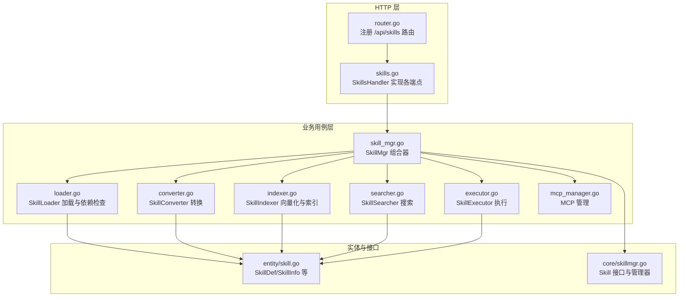
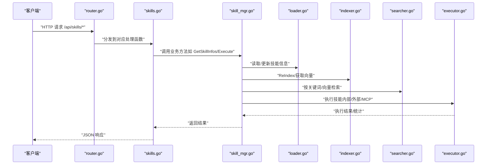
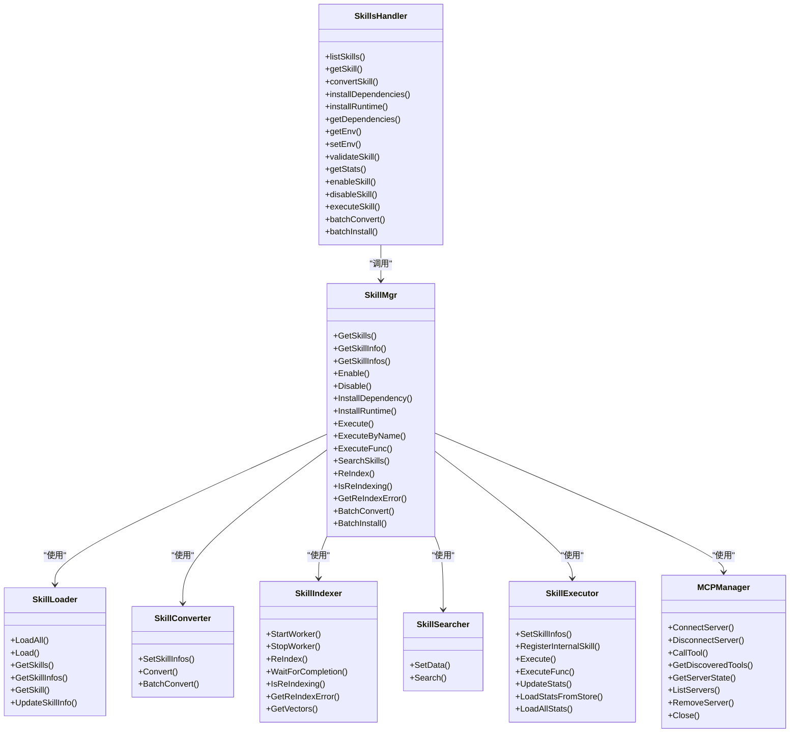

# 技能管理

<cite>
**本文引用的文件**
- [internal/adapters/http/handlers/skills.go](file://internal/adapters/http/handlers/skills.go)
- [internal/adapters/http/handlers/router.go](file://internal/adapters/http/handlers/router.go)
- [internal/usecase/skills/skill_mgr.go](file://internal/usecase/skills/skill_mgr.go)
- [internal/usecase/skills/loader.go](file://internal/usecase/skills/loader.go)
- [internal/usecase/skills/converter.go](file://internal/usecase/skills/converter.go)
- [internal/usecase/skills/indexer.go](file://internal/usecase/skills/indexer.go)
- [internal/usecase/skills/searcher.go](file://internal/usecase/skills/searcher.go)
- [internal/usecase/skills/executor.go](file://internal/usecase/skills/executor.go)
- [internal/usecase/skills/mcp_manager.go](file://internal/usecase/skills/mcp_manager.go)
- [internal/entity/skill.go](file://internal/entity/skill.go)
- [internal/core/skillmgr.go](file://internal/core/skillmgr.go)
- [cmd/main.go](file://cmd/main.go)
</cite>

## 目录
1. [简介](#简介)
2. [项目结构](#项目结构)
3. [核心组件](#核心组件)
4. [架构总览](#架构总览)
5. [详细组件分析](#详细组件分析)
6. [依赖关系分析](#依赖关系分析)
7. [性能考量](#性能考量)
8. [故障排查指南](#故障排查指南)
9. [结论](#结论)
10. [附录](#附录)

## 简介
本文件面向 MindX 技能管理接口，聚焦 /api/skills 系列端点，提供完整的 API 文档与实现解析。内容涵盖：
- 技能列表查询、技能详情获取、依赖管理、环境配置、统计信息、转换与安装等能力
- 技能开发与部署的端到端流程示例（含验证、批量操作与运行时管理）
- 技能生命周期管理、依赖解析与版本控制机制说明

## 项目结构
MindX 的技能管理由“HTTP 层处理器 + 业务用例层 + 实体与核心接口”构成，路由在 HTTP 层统一注册，业务逻辑集中在 usecase 层，实体与核心接口位于 entity 与 core 包。

图表来源
- [internal/adapters/http/handlers/router.go](file://internal/adapters/http/handlers/router.go#L59-L79)
- [internal/adapters/http/handlers/skills.go](file://internal/adapters/http/handlers/skills.go#L14-L25)
- [internal/usecase/skills/skill_mgr.go](file://internal/usecase/skills/skill_mgr.go#L20-L62)
- [internal/entity/skill.go](file://internal/entity/skill.go#L5-L82)
- [internal/core/skillmgr.go](file://internal/core/skillmgr.go#L3-L17)

章节来源
- [internal/adapters/http/handlers/router.go](file://internal/adapters/http/handlers/router.go#L18-L79)
- [internal/adapters/http/handlers/skills.go](file://internal/adapters/http/handlers/skills.go#L14-L25)

## 核心组件
- SkillsHandler：HTTP 层技能管理处理器，负责接收请求、校验参数、调用 SkillMgr 并返回 JSON 响应。
- SkillMgr：技能管理器组合器，聚合加载器、执行器、搜索器、索引器、转换器、安装器、环境管理器与 MCP 管理器。
- SkillLoader：扫描 skills 目录，解析 SKILL.md，构建 Skill 与 SkillInfo，并检查依赖。
- SkillConverter：将 SKILL.md 的 YAML Frontmatter 解析为 SkillDef 并写回文件，补充默认值。
- SkillIndexer：异步计算技能关键字向量，持久化索引，支持全量/增量 ReIndex。
- SkillSearcher：基于向量相似度与关键词的混合检索。
- SkillExecutor：执行内部技能、外部脚本与 MCP 工具，记录统计信息。
- MCPManager：管理 MCP 服务器连接、工具发现与调用。
- Entity/SkillDef/SkillInfo：技能元数据、安装方法、参数定义、统计信息等数据结构。
- Core/Skill 接口：抽象技能对象与管理器接口。

章节来源
- [internal/adapters/http/handlers/skills.go](file://internal/adapters/http/handlers/skills.go#L14-L25)
- [internal/usecase/skills/skill_mgr.go](file://internal/usecase/skills/skill_mgr.go#L20-L62)
- [internal/usecase/skills/loader.go](file://internal/usecase/skills/loader.go#L18-L33)
- [internal/usecase/skills/converter.go](file://internal/usecase/skills/converter.go#L16-L29)
- [internal/usecase/skills/indexer.go](file://internal/usecase/skills/indexer.go#L32-L51)
- [internal/usecase/skills/searcher.go](file://internal/usecase/skills/searcher.go#L15-L22)
- [internal/usecase/skills/executor.go](file://internal/usecase/skills/executor.go#L19-L28)
- [internal/usecase/skills/mcp_manager.go](file://internal/usecase/skills/mcp_manager.go#L36-L40)
- [internal/entity/skill.go](file://internal/entity/skill.go#L5-L82)
- [internal/core/skillmgr.go](file://internal/core/skillmgr.go#L3-L17)

## 架构总览
下图展示 /api/skills 端点与 SkillMgr 的交互关系，以及关键数据流。

图表来源
- [internal/adapters/http/handlers/router.go](file://internal/adapters/http/handlers/router.go#L59-L79)
- [internal/adapters/http/handlers/skills.go](file://internal/adapters/http/handlers/skills.go#L27-L56)
- [internal/usecase/skills/skill_mgr.go](file://internal/usecase/skills/skill_mgr.go#L87-L98)
- [internal/usecase/skills/loader.go](file://internal/usecase/skills/loader.go#L125-L157)
- [internal/usecase/skills/indexer.go](file://internal/usecase/skills/indexer.go#L188-L253)
- [internal/usecase/skills/searcher.go](file://internal/usecase/skills/searcher.go#L42-L62)
- [internal/usecase/skills/executor.go](file://internal/usecase/skills/executor.go#L57-L79)

## 详细组件分析

### HTTP 路由与端点定义
- 路由注册位置：在 router.go 中通过 Group("/api/skills") 注册所有技能相关端点。
- 端点一览（均以 HTTP 方法 + 路径形式列出）：
  - GET /api/skills
  - GET /api/skills/reindex/status
  - POST /api/skills/reindex
  - GET /api/skills/:name
  - GET /api/skills/:name/dependencies
  - GET /api/skills/:name/env
  - GET /api/skills/:name/stats
  - POST /api/skills/:name/convert
  - POST /api/skills/:name/install
  - POST /api/skills/:name/install/runtime
  - POST /api/skills/:name/env
  - POST /api/skills/:name/validate
  - POST /api/skills/:name/enable
  - POST /api/skills/:name/disable
  - POST /api/skills/batch/convert
  - POST /api/skills/batch/install

章节来源
- [internal/adapters/http/handlers/router.go](file://internal/adapters/http/handlers/router.go#L59-L79)

### 技能列表查询（GET /api/skills）
- 功能：返回所有非内部技能的列表，同时返回当前是否处于重索引状态及错误信息。
- 关键实现：
  - SkillsHandler.listSkills 调用 SkillMgr.GetSkillInfos 过滤内部技能后返回。
  - 同时读取 SkillMgr.IsReIndexing 与 GetReIndexError 一并返回。
- 响应结构要点：
  - skills：技能数组（不含内部技能）
  - count：数量
  - isReIndexing：是否正在重索引
  - reIndexError：重索引错误字符串

章节来源
- [internal/adapters/http/handlers/skills.go](file://internal/adapters/http/handlers/skills.go#L27-L56)
- [internal/usecase/skills/skill_mgr.go](file://internal/usecase/skills/skill_mgr.go#L147-L149)

### 重索引状态与触发（GET/POST /api/skills/reindex/*）
- GET /api/skills/reindex/status：返回 isReIndexing 与 reIndexError。
- POST /api/skills/reindex：若未在重索引中，则后台启动一次 ReIndex；若已在进行中则返回冲突状态码。
- 关键实现：
  - SkillsHandler.getReIndexStatus 与 triggerReIndex 分别读取与触发。
  - SkillMgr.ReIndex 负责全量重建向量索引，完成后同步组件。
  - SkillIndexer 异步工作线程处理任务队列，支持持久化队列与等待完成。

章节来源
- [internal/adapters/http/handlers/skills.go](file://internal/adapters/http/handlers/skills.go#L58-L95)
- [internal/usecase/skills/skill_mgr.go](file://internal/usecase/skills/skill_mgr.go#L232-L241)
- [internal/usecase/skills/indexer.go](file://internal/usecase/skills/indexer.go#L75-L114)

### 技能详情获取（GET /api/skills/:name）
- 功能：根据技能名返回技能完整信息（含定义、目录、内容、可运行性、缺失依赖、格式、状态、向量与统计）。
- 关键实现：
  - SkillsHandler.getSkill 调用 SkillMgr.GetSkillInfo 并返回。
  - SkillLoader.Load/LoadAll 解析 SKILL.md 生成 SkillInfo，CheckDependencies 检查缺失二进制与环境变量。

章节来源
- [internal/adapters/http/handlers/skills.go](file://internal/adapters/http/handlers/skills.go#L97-L115)
- [internal/usecase/skills/loader.go](file://internal/usecase/skills/loader.go#L60-L123)
- [internal/usecase/skills/loader.go](file://internal/usecase/skills/loader.go#L186-L204)

### 依赖管理（GET/POST /api/skills/:name/dependencies, /api/skills/:name/install, /api/skills/:name/install/runtime）
- GET /api/skills/:name/dependencies：返回缺失的二进制与环境变量（当前实现返回空集合占位）。
- POST /api/skills/:name/install：安装依赖（请求体包含 binary 字段，但当前未使用）。
- POST /api/skills/:name/install/runtime：根据技能定义中的 Install 方法逐个尝试安装，任一成功即返回。
- 关键实现：
  - SkillsHandler.getDependencies 与 installDependencies/InstallRuntime 调用 SkillMgr.InstallDependency/InstallRuntime。
  - SkillMgr.InstallRuntime 读取 SkillDef.Install 并交由 Installer 执行。

章节来源
- [internal/adapters/http/handlers/skills.go](file://internal/adapters/http/handlers/skills.go#L196-L194)
- [internal/adapters/http/handlers/skills.go](file://internal/adapters/http/handlers/skills.go#L142-L169)
- [internal/adapters/http/handlers/skills.go](file://internal/adapters/http/handlers/skills.go#L171-L194)
- [internal/usecase/skills/skill_mgr.go](file://internal/usecase/skills/skill_mgr.go#L185-L187)
- [internal/usecase/skills/skill_mgr.go](file://internal/usecase/skills/skill_mgr.go#L290-L324)

### 环境配置（GET/POST /api/skills/:name/env）
- GET /api/skills/:name/env：返回技能环境变量映射，敏感键值会被掩码处理。
- POST /api/skills/:name/env：设置环境变量（请求体为键值对映射）。
- 关键实现：
  - 敏感键匹配规则与掩码策略在处理器内实现。
  - 环境变量最终由 EnvManager 在执行阶段准备。

章节来源
- [internal/adapters/http/handlers/skills.go](file://internal/adapters/http/handlers/skills.go#L216-L250)
- [internal/adapters/http/handlers/skills.go](file://internal/adapters/http/handlers/skills.go#L464-L476)

### 统计信息（GET /api/skills/:name/stats）
- 功能：返回技能启用状态、标签、版本等统计信息。
- 关键实现：
  - SkillsHandler.getStats 读取 SkillInfo 并返回 enabled/tags/version。

章节来源
- [internal/adapters/http/handlers/skills.go](file://internal/adapters/http/handlers/skills.go#L283-L303)
- [internal/usecase/skills/skill_mgr.go](file://internal/usecase/skills/skill_mgr.go#L142-L149)

### 转换与安装（POST /api/skills/:name/convert, /api/skills/batch/convert, /api/skills/batch/install）
- POST /api/skills/:name/convert：将 SKILL.md 的 YAML Frontmatter 解析为 SkillDef 并写回文件，补充默认值，然后同步组件。
- POST /api/skills/batch/convert：批量转换，返回成功/失败列表。
- POST /api/skills/batch/install：批量安装运行时，返回成功/失败列表。
- 关键实现：
  - SkillConverter.Convert/BatchConvert 负责单个/批量转换。
  - SkillMgr.BatchConvert/BatchInstall 调用转换器与安装器并同步组件。

章节来源
- [internal/adapters/http/handlers/skills.go](file://internal/adapters/http/handlers/skills.go#L117-L140)
- [internal/adapters/http/handlers/skills.go](file://internal/adapters/http/handlers/skills.go#L398-L429)
- [internal/adapters/http/handlers/skills.go](file://internal/adapters/http/handlers/skills.go#L431-L462)
- [internal/usecase/skills/converter.go](file://internal/usecase/skills/converter.go#L37-L104)
- [internal/usecase/skills/converter.go](file://internal/usecase/skills/converter.go#L106-L121)
- [internal/usecase/skills/skill_mgr.go](file://internal/usecase/skills/skill_mgr.go#L282-L288)
- [internal/usecase/skills/skill_mgr.go](file://internal/usecase/skills/skill_mgr.go#L326-L346)

### 启用/禁用（POST /api/skills/:name/enable, /api/skills/:name/disable）
- 功能：切换技能的启用状态，更新内存中的 SkillInfo 并同步组件。
- 关键实现：
  - SkillsHandler.enableSkill/disableSkill 调用 SkillMgr.Enable/Disable。
  - SkillMgr.Enable/Disable 修改 Def.Enabled 并调用 loader.UpdateSkillInfo 与 syncComponents。

章节来源
- [internal/adapters/http/handlers/skills.go](file://internal/adapters/http/handlers/skills.go#L319-L351)
- [internal/usecase/skills/skill_mgr.go](file://internal/usecase/skills/skill_mgr.go#L151-L183)

### 验证（POST /api/skills/:name/validate）
- 功能：验证技能定义的关键字段（如描述、分类）是否为空，返回验证结果与错误列表。
- 关键实现：
  - SkillsHandler.validateSkill 读取 SkillInfo.Def 并检查空值。

章节来源
- [internal/adapters/http/handlers/skills.go](file://internal/adapters/http/handlers/skills.go#L252-L281)

### 执行（POST /api/skills/:name）
- 功能：执行指定技能，支持内部技能、外部脚本与 MCP 工具。
- 请求体：JSON 对象，键为参数名，值为参数值。
- 关键实现：
  - SkillsHandler.executeSkill 读取参数，查找目标技能并调用 SkillMgr.Execute。
  - SkillMgr.Execute 调用 SkillExecutor.Execute，按类型选择执行路径。
  - SkillExecutor.executeInternal/exeucteMCP/exeucteExternal 分别处理内部、MCP 与外部脚本。
  - 执行结果与统计信息（成功/失败次数、平均耗时、最近运行时间等）由执行器维护。

章节来源
- [internal/adapters/http/handlers/skills.go](file://internal/adapters/http/handlers/skills.go#L353-L396)
- [internal/usecase/skills/skill_mgr.go](file://internal/usecase/skills/skill_mgr.go#L189-L211)
- [internal/usecase/skills/executor.go](file://internal/usecase/skills/executor.go#L57-L79)
- [internal/usecase/skills/executor.go](file://internal/usecase/skills/executor.go#L81-L136)
- [internal/usecase/skills/executor.go](file://internal/usecase/skills/executor.go#L138-L195)

### 数据模型与实体
- SkillDef：技能定义，包含名称、描述、版本、分类、标签、图标、操作系统、启用状态、超时、命令、参数定义、依赖、安装方法、主页、元数据、输出格式、指导语、是否内部等。
- Requires：依赖定义，包含所需二进制与环境变量。
- InstallMethod：安装方法，包含 ID、类型（brew/apt/npm/pip/snap/choco 等）、包名、公式、二进制列表、标签、适用系统。
- ParameterDef：参数定义，包含类型、描述、是否必填。
- SkillStats：技能统计数据，包含成功次数、失败次数、执行时间序列、最近运行时间。
- SkillInfo：技能完整信息，包含定义、目录、内容、可运行性、缺失二进制/环境变量、前端字段、向量、统计信息等。

章节来源
- [internal/entity/skill.go](file://internal/entity/skill.go#L5-L82)

### 技能生命周期与版本控制
- 生命周期：
  - 加载：SkillLoader.LoadAll/Load 解析 SKILL.md，检查依赖，生成 SkillInfo。
  - 转换：SkillConverter.Convert 补充默认值并写回文件。
  - 索引：SkillIndexer.ReIndex 计算关键字向量并持久化。
  - 搜索：SkillSearcher 支持向量与关键词混合检索。
  - 执行：SkillExecutor.Execute 选择内部/外部/MCP 执行路径。
  - 统计：SkillExecutor.UpdateStats 记录执行统计。
- 版本控制：
  - SkillDef.Version 用于标识技能版本，默认值在转换时补齐。
  - SkillIndexer.computeSkillHash 基于名称、描述、分类、标签、目录计算哈希，用于判断是否需要重新索引。

章节来源
- [internal/usecase/skills/loader.go](file://internal/usecase/skills/loader.go#L60-L123)
- [internal/usecase/skills/converter.go](file://internal/usecase/skills/converter.go#L75-L84)
- [internal/usecase/skills/indexer.go](file://internal/usecase/skills/indexer.go#L178-L186)
- [internal/usecase/skills/searcher.go](file://internal/usecase/skills/searcher.go#L42-L62)
- [internal/usecase/skills/executor.go](file://internal/usecase/skills/executor.go#L266-L300)

### 依赖解析与运行时管理
- 依赖解析：
  - CheckDependencies 检查 Requires.Bins 是否存在于 PATH，Requires.Env 是否在环境变量中。
  - 缺失项记录在 SkillInfo.MissingBins 与 MissingEnv。
- 运行时安装：
  - InstallDependency 交由 Installer 执行（具体实现文件未在本次分析范围内）。
  - InstallRuntime 读取 SkillDef.Install 数组，依次尝试安装，任一成功即返回。

章节来源
- [internal/usecase/skills/loader.go](file://internal/usecase/skills/loader.go#L186-L204)
- [internal/usecase/skills/skill_mgr.go](file://internal/usecase/skills/skill_mgr.go#L185-L187)
- [internal/usecase/skills/skill_mgr.go](file://internal/usecase/skills/skill_mgr.go#L290-L324)

### MCP 工具集成
- 运行时添加/移除/重启 MCP 服务器，自动发现工具并注册为技能。
- 调用 MCP 工具时，按超时与状态进行连接与调用，失败时更新状态并返回错误。

章节来源
- [internal/usecase/skills/skill_mgr.go](file://internal/usecase/skills/skill_mgr.go#L406-L506)
- [internal/usecase/skills/mcp_manager.go](file://internal/usecase/skills/mcp_manager.go#L49-L141)
- [internal/usecase/skills/mcp_manager.go](file://internal/usecase/skills/mcp_manager.go#L169-L204)

## 依赖关系分析

图表来源
- [internal/adapters/http/handlers/skills.go](file://internal/adapters/http/handlers/skills.go#L14-L25)
- [internal/usecase/skills/skill_mgr.go](file://internal/usecase/skills/skill_mgr.go#L20-L62)
- [internal/usecase/skills/loader.go](file://internal/usecase/skills/loader.go#L18-L33)
- [internal/usecase/skills/converter.go](file://internal/usecase/skills/converter.go#L16-L29)
- [internal/usecase/skills/indexer.go](file://internal/usecase/skills/indexer.go#L32-L51)
- [internal/usecase/skills/searcher.go](file://internal/usecase/skills/searcher.go#L15-L22)
- [internal/usecase/skills/executor.go](file://internal/usecase/skills/executor.go#L19-L28)
- [internal/usecase/skills/mcp_manager.go](file://internal/usecase/skills/mcp_manager.go#L36-L40)

## 性能考量
- 异步索引与队列：SkillIndexer 使用通道队列与工作线程异步处理索引任务，支持持久化队列与等待完成，避免阻塞主线程。
- 向量搜索降级：当嵌入服务不可用或向量表为空时，SkillSearcher 自动回退到关键词匹配，保证可用性。
- 执行超时控制：外部脚本与 MCP 工具调用均设置超时，防止长时间阻塞。
- 统计与缓存：SkillExecutor 维护执行统计并在存储中持久化，减少重复计算。

## 故障排查指南
- 重索引失败：通过 /api/skills/reindex/status 获取错误信息；若失败，查看 SkillIndexer 的日志与队列文件。
- 依赖缺失：通过 /api/skills/:name/dependencies 与 /api/skills/:name/env 检查缺失项与环境变量；必要时使用 /api/skills/:name/install/runtime 或 /api/skills/:name/install 安装。
- 执行异常：查看 /api/skills/:name/stats 中的错误计数与最近错误；检查执行器日志与脚本输出。
- MCP 工具问题：通过 /api/mcp/servers 查看服务器状态与工具列表，必要时重启或移除服务器。

章节来源
- [internal/adapters/http/handlers/skills.go](file://internal/adapters/http/handlers/skills.go#L58-L95)
- [internal/usecase/skills/indexer.go](file://internal/usecase/skills/indexer.go#L321-L331)
- [internal/usecase/skills/executor.go](file://internal/usecase/skills/executor.go#L266-L300)
- [internal/usecase/skills/mcp_manager.go](file://internal/usecase/skills/mcp_manager.go#L238-L247)

## 结论
MindX 的技能管理接口围绕 SkillMgr 组合器展开，通过加载、转换、索引、搜索、执行与 MCP 集成形成完整的技能生命周期管理。HTTP 层提供清晰的 REST API，业务层具备良好的扩展性与容错能力。建议在生产环境中结合重索引调度、依赖预检与执行超时策略，确保稳定性与性能。

## 附录

### API 端点一览与说明
- GET /api/skills：获取技能列表（过滤内部技能），返回重索引状态与错误信息
- GET /api/skills/reindex/status：获取重索引状态
- POST /api/skills/reindex：触发后台重索引（若未在进行中）
- GET /api/skills/:name：获取技能详情
- GET /api/skills/:name/dependencies：获取缺失依赖（占位）
- GET /api/skills/:name/env：获取环境变量（敏感键掩码）
- GET /api/skills/:name/stats：获取启用状态、标签、版本
- POST /api/skills/:name/convert：转换技能定义（补全默认值）
- POST /api/skills/:name/install：安装依赖（占位）
- POST /api/skills/:name/install/runtime：安装运行时（按定义的 Install 方法）
- POST /api/skills/:name/env：设置环境变量
- POST /api/skills/:name/validate：验证技能定义关键字段
- POST /api/skills/:name/enable：启用技能
- POST /api/skills/:name/disable：禁用技能
- POST /api/skills/batch/convert：批量转换
- POST /api/skills/batch/install：批量安装运行时
- POST /api/skills/:name：执行技能（请求体为参数映射）

章节来源
- [internal/adapters/http/handlers/router.go](file://internal/adapters/http/handlers/router.go#L59-L79)
- [internal/adapters/http/handlers/skills.go](file://internal/adapters/http/handlers/skills.go#L27-L396)