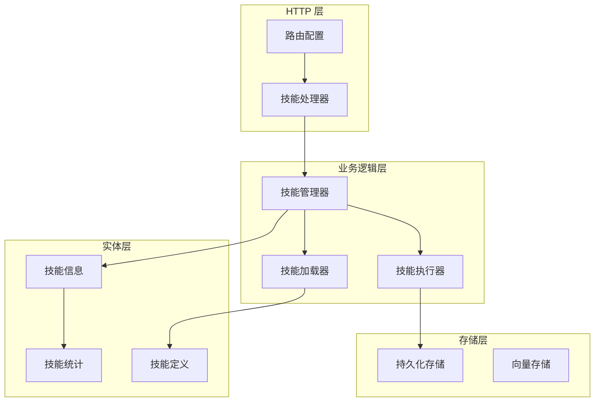
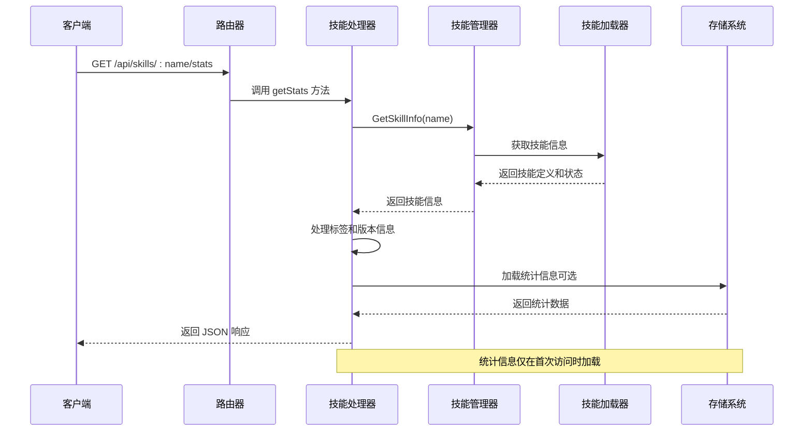
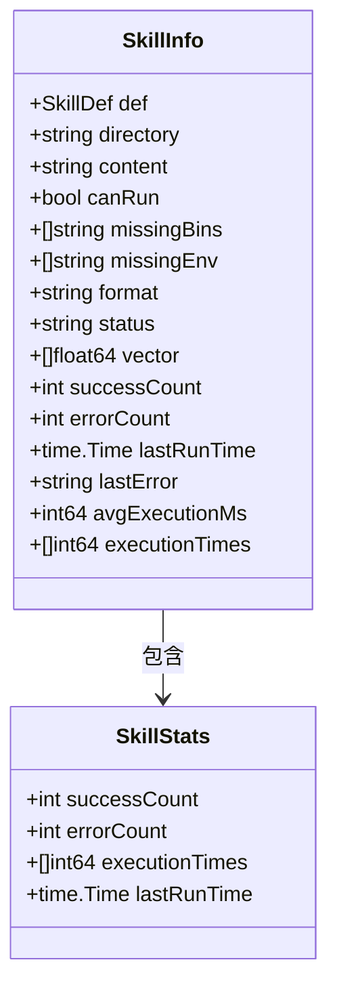
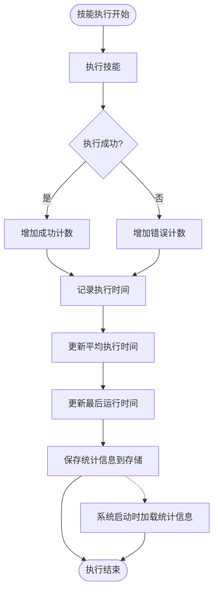
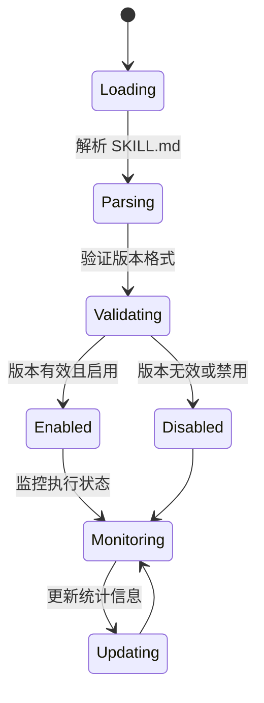
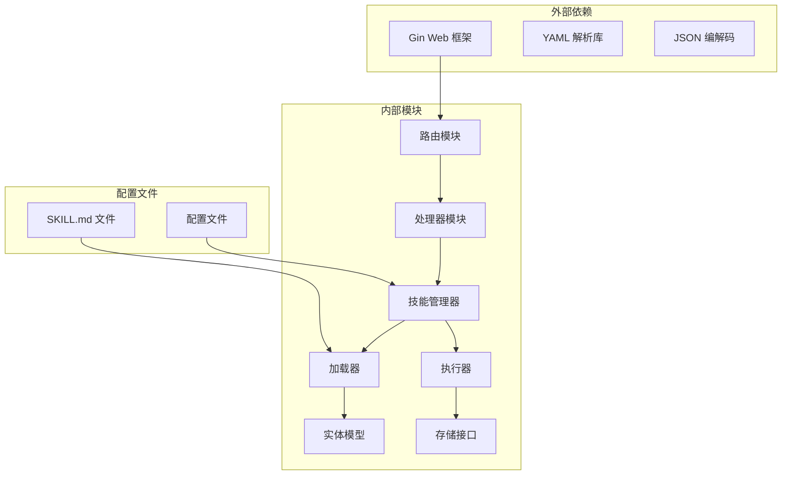

# 技能统计信息

<cite>
**本文档引用的文件**
- [internal/adapters/http/handlers/skills.go](file://internal/adapters/http/handlers/skills.go)
- [internal/adapters/http/handlers/router.go](file://internal/adapters/http/handlers/router.go)
- [internal/usecase/skills/executor.go](file://internal/usecase/skills/executor.go)
- [internal/usecase/skills/loader.go](file://internal/usecase/skills/loader.go)
- [internal/entity/skill.go](file://internal/entity/skill.go)
- [skills/calculator/SKILL.md](file://skills/calculator/SKILL.md)
- [skills/web_search/SKILL.md](file://skills/web_search/SKILL.md)
</cite>

## 目录
1. [简介](#简介)
2. [项目结构](#项目结构)
3. [核心组件](#核心组件)
4. [架构概览](#架构概览)
5. [详细组件分析](#详细组件分析)
6. [依赖关系分析](#依赖关系分析)
7. [性能考虑](#性能考虑)
8. [故障排除指南](#故障排除指南)
9. [结论](#结论)

## 简介

MindX 技能统计信息接口提供了对技能执行状态、标签管理和版本信息的统一查询功能。该接口支持通过 HTTP GET 请求获取单个技能的详细统计信息，包括启用状态、标签数组、版本信息和元数据。

本接口是 MindX 技能管理系统的重要组成部分，为前端界面和自动化工具提供了技能状态的实时监控能力。通过该接口，用户可以快速了解技能的运行状况、历史表现和配置信息。

## 项目结构

MindX 项目采用分层架构设计，技能统计信息功能位于以下层次：



**图表来源**
- [internal/adapters/http/handlers/router.go](file://internal/adapters/http/handlers/router.go#L18-L79)
- [internal/adapters/http/handlers/skills.go](file://internal/adapters/http/handlers/skills.go#L14-L25)

**章节来源**
- [internal/adapters/http/handlers/router.go](file://internal/adapters/http/handlers/router.go#L18-L79)
- [internal/adapters/http/handlers/skills.go](file://internal/adapters/http/handlers/skills.go#L14-L25)

## 核心组件

### 技能处理器 (SkillsHandler)

技能处理器是 HTTP 接口的核心实现，负责处理技能相关的 HTTP 请求。它继承自 `SkillsHandler` 结构体，包含以下关键特性：

- **路由绑定**: 通过 Gin 框架注册 `/api/skills/:name/stats` 路由
- **参数验证**: 验证技能名称参数的有效性
- **错误处理**: 提供统一的错误响应格式
- **数据转换**: 将内部数据结构转换为 API 响应格式

### 技能管理器 (SkillMgr)

技能管理器协调各个组件的工作，提供以下核心功能：

- **技能信息获取**: 从加载器中检索技能定义和状态信息
- **状态同步**: 维护技能状态与执行器统计信息的一致性
- **组件协调**: 协调加载器、执行器、索引器等组件的工作

### 技能执行器 (SkillExecutor)

技能执行器负责实际的技能执行和统计信息维护：

- **执行监控**: 监控技能执行的成功率和性能指标
- **统计收集**: 收集执行时间、成功率、错误率等统计信息
- **持久化存储**: 将统计信息持久化到存储系统中

**章节来源**
- [internal/adapters/http/handlers/skills.go](file://internal/adapters/http/handlers/skills.go#L14-L25)
- [internal/usecase/skills/executor.go](file://internal/usecase/skills/executor.go#L19-L42)

## 架构概览

技能统计信息接口的完整架构如下：



**图表来源**
- [internal/adapters/http/handlers/router.go](file://internal/adapters/http/handlers/router.go#L69-L69)
- [internal/adapters/http/handlers/skills.go](file://internal/adapters/http/handlers/skills.go#L283-L303)
- [internal/usecase/skills/executor.go](file://internal/usecase/skills/executor.go#L346-L373)

## 详细组件分析

### API 端点定义

#### GET /api/skills/:name/stats

**功能**: 获取指定技能的统计信息和配置详情

**请求参数**:
- `name` (路径参数): 技能名称，必需

**响应格式**:
```json
{
  "name": "string",
  "enabled": "boolean",
  "tags": ["string"],
  "version": "string"
}
```

**响应字段说明**:
- `name`: 技能名称
- `enabled`: 技能启用状态
- `tags`: 技能标签数组
- `version`: 技能版本号

**状态码**:
- `200 OK`: 成功获取技能信息
- `404 Not Found`: 技能不存在
- `503 Service Unavailable`: 技能管理器不可用

### 数据模型分析

#### 技能定义 (SkillDef)

技能定义包含了技能的所有静态配置信息：

```mermaid
classDiagram
class SkillDef {
+string name
+string description
+string version
+string category
+[]string tags
+string emoji
+[]string os
+bool enabled
+int timeout
+string command
+map[string]ParameterDef parameters
+Requires requires
+[]InstallMethod install
+string homepage
+map[string]interface{} metadata
+string outputFormat
+string guidance
+bool isInternal
}
class ParameterDef {
+string type
+string description
+bool required
}
class Requires {
+[]string bins
+[]string env
}
class InstallMethod {
+string id
+string kind
+string package
+string formula
+[]string bins
+string label
+[]string os
}
SkillDef --> ParameterDef : 包含
SkillDef --> Requires : 包含
SkillDef --> InstallMethod : 包含
```

**图表来源**
- [internal/entity/skill.go](file://internal/entity/skill.go#L5-L25)

#### 技能信息 (SkillInfo)

技能信息包含了技能的运行时状态和统计信息：



**图表来源**
- [internal/entity/skill.go](file://internal/entity/skill.go#L51-L82)

### 统计信息收集机制

技能统计信息通过以下流程自动收集和更新：



**图表来源**
- [internal/usecase/skills/executor.go](file://internal/usecase/skills/executor.go#L266-L300)
- [internal/usecase/skills/executor.go](file://internal/usecase/skills/executor.go#L346-L373)

### 标签管理功能

标签系统为技能提供了灵活的分类和过滤机制：

**标签特性**:
- 支持中英文标签
- 自动去重和排序
- 关键词提取用于搜索优化
- 标签变更自动同步到搜索索引

**标签处理流程**:


**图表来源**
- [internal/usecase/skills/skill_mgr.go](file://internal/usecase/skills/skill_mgr.go#L100-L120)

### 版本信息管理

版本信息提供了技能的版本追踪和兼容性管理：

**版本特性**:
- 遵循语义化版本控制
- 支持版本比较和兼容性检查
- 版本变更影响技能的启用状态
- 版本信息用于客户端显示和更新提示

**版本处理流程**:


**章节来源**
- [internal/adapters/http/handlers/skills.go](file://internal/adapters/http/handlers/skills.go#L283-L303)
- [internal/entity/skill.go](file://internal/entity/skill.go#L5-L25)
- [internal/usecase/skills/executor.go](file://internal/usecase/skills/executor.go#L266-L300)

## 依赖关系分析

技能统计信息接口的依赖关系如下：



**图表来源**
- [internal/adapters/http/handlers/router.go](file://internal/adapters/http/handlers/router.go#L3-L12)
- [internal/adapters/http/handlers/skills.go](file://internal/adapters/http/handlers/skills.go#L3-L12)

**章节来源**
- [internal/adapters/http/handlers/router.go](file://internal/adapters/http/handlers/router.go#L18-L79)
- [internal/adapters/http/handlers/skills.go](file://internal/adapters/http/handlers/skills.go#L3-L12)

## 性能考虑

### 统计信息缓存策略

技能统计信息采用懒加载策略，避免不必要的性能开销：

- **按需加载**: 仅在首次访问技能统计信息时从存储加载
- **内存缓存**: 加载后的统计信息缓存在内存中
- **批量操作**: 系统启动时批量加载所有技能的统计信息

### 执行时间窗口管理

为了保持统计信息的时效性，系统实现了执行时间窗口管理：

- **固定窗口大小**: 最多保留最近 100 次执行时间
- **自动滑动**: 新的执行时间添加时自动移除最旧的时间
- **平均值计算**: 实时计算平均执行时间，避免全量扫描

### 存储优化

统计信息存储采用了优化的数据结构：

- **键值存储**: 使用标准化的键名格式 `skill_stats:name`
- **JSON 序列化**: 统一的 JSON 格式便于跨组件共享
- **批量操作**: 支持批量读取和写入操作

## 故障排除指南

### 常见问题及解决方案

**问题 1: 技能不存在**
- **症状**: 返回 404 Not Found 错误
- **原因**: 技能名称拼写错误或技能已被删除
- **解决方案**: 验证技能名称，确认技能存在于 `skills/` 目录中

**问题 2: 技能管理器不可用**
- **症状**: 返回 503 Service Unavailable 错误
- **原因**: 技能管理器初始化失败或服务异常
- **解决方案**: 检查服务日志，重启服务后重试

**问题 3: 统计信息缺失**
- **症状**: 统计相关字段为空或为零
- **原因**: 技能尚未执行过或存储系统异常
- **解决方案**: 执行技能一次后重试，检查存储系统状态

**问题 4: 标签信息不正确**
- **症状**: 标签显示异常或缺失
- **原因**: SKILL.md 文件中的标签配置错误
- **解决方案**: 检查 SKILL.md 文件的 YAML 格式，确保标签数组正确配置

### 调试建议

1. **启用详细日志**: 在开发环境中启用调试日志以获取更多上下文信息
2. **检查文件权限**: 确保 SKILL.md 文件具有正确的读取权限
3. **验证 YAML 格式**: 使用在线 YAML 验证工具检查配置文件格式
4. **监控存储状态**: 定期检查存储系统的健康状态和可用空间

**章节来源**
- [internal/adapters/http/handlers/skills.go](file://internal/adapters/http/handlers/skills.go#L286-L295)
- [internal/usecase/skills/executor.go](file://internal/usecase/skills/executor.go#L346-L373)

## 结论

MindX 技能统计信息接口提供了一个完整、高效且易于使用的技能状态查询解决方案。通过合理的架构设计和优化的性能策略，该接口能够满足各种规模的应用需求。

主要优势包括：
- **简洁的 API 设计**: 直观的 JSON 响应格式和标准的状态码
- **高效的性能**: 懒加载策略和内存缓存减少资源消耗
- **强大的扩展性**: 模块化的架构支持功能扩展和定制
- **完善的错误处理**: 统一的错误响应格式便于客户端处理

未来可以考虑的改进方向：
- 添加更多的统计维度，如成功率趋势分析
- 实现增量更新机制，减少全量加载的开销
- 提供更丰富的过滤和排序选项
- 增加实时统计信息的 WebSocket 通知功能