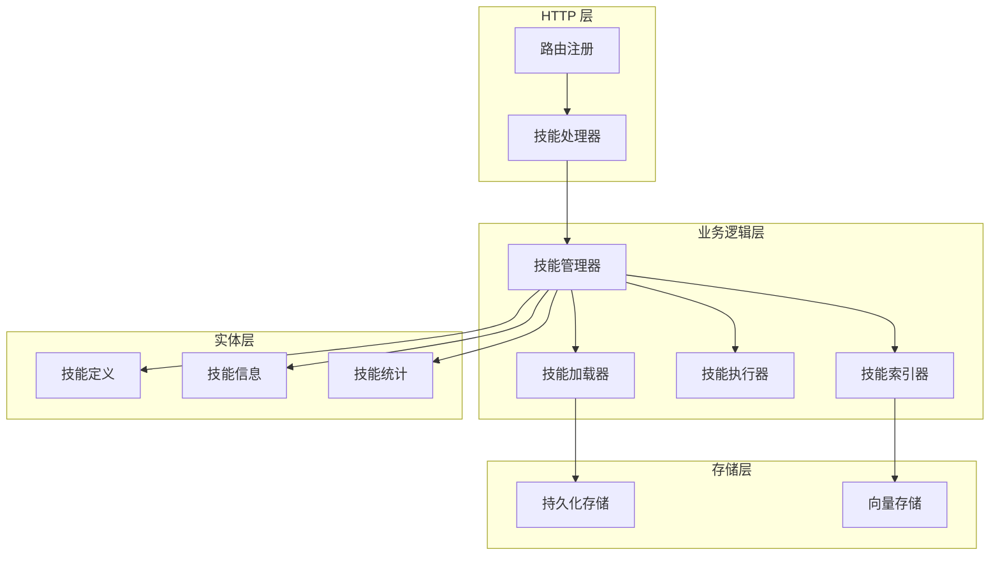
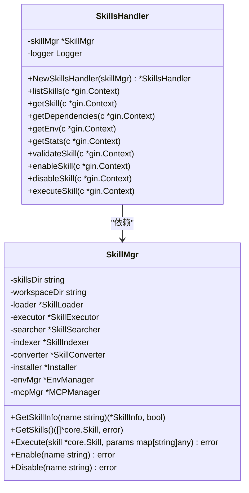
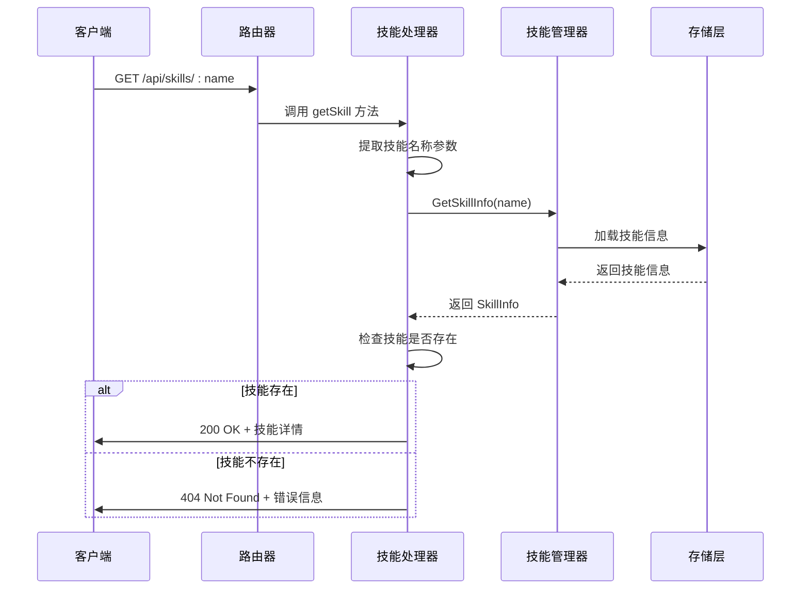
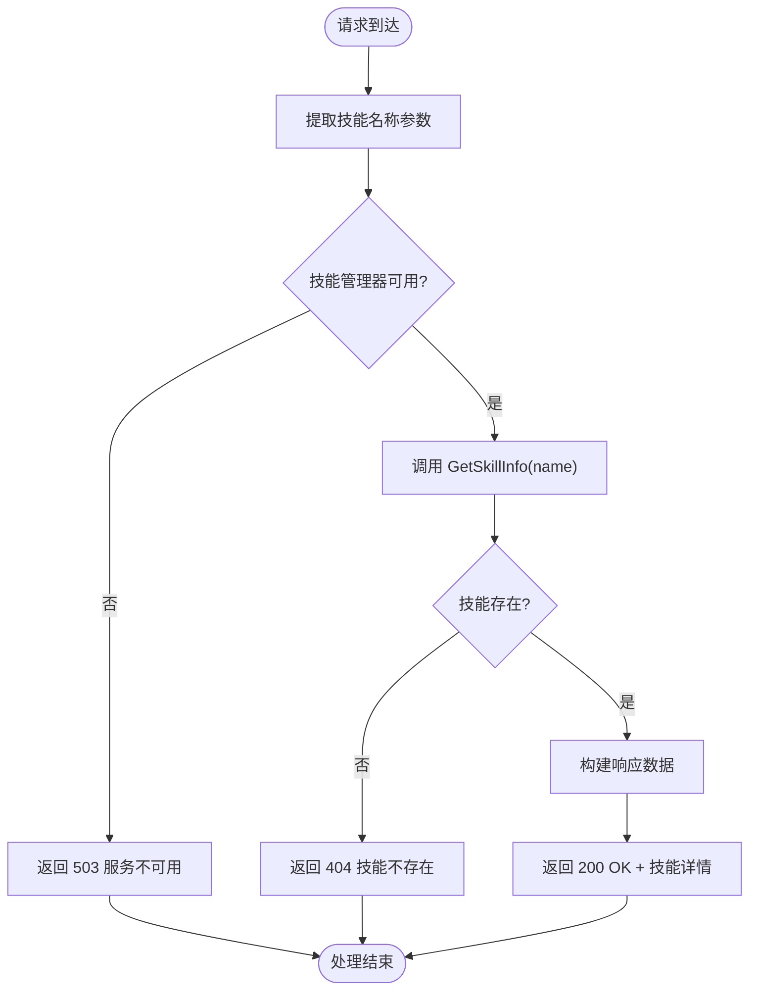
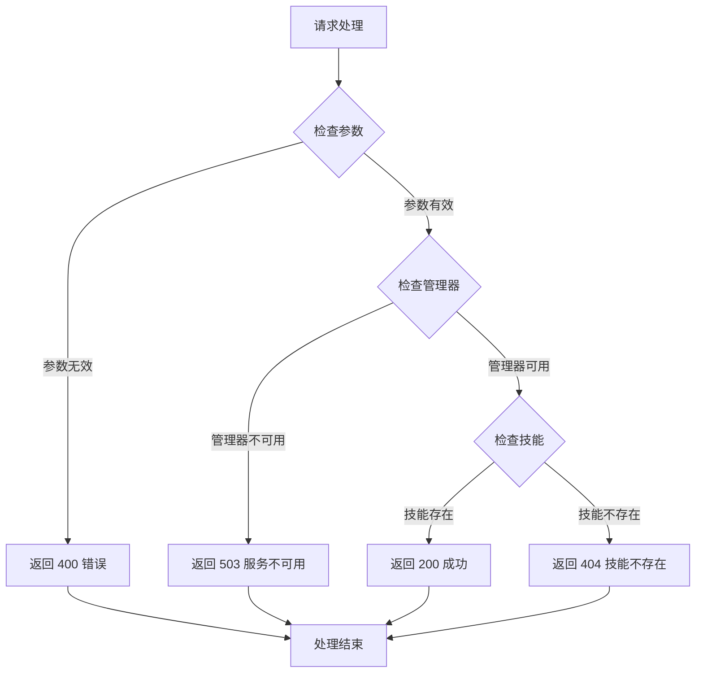
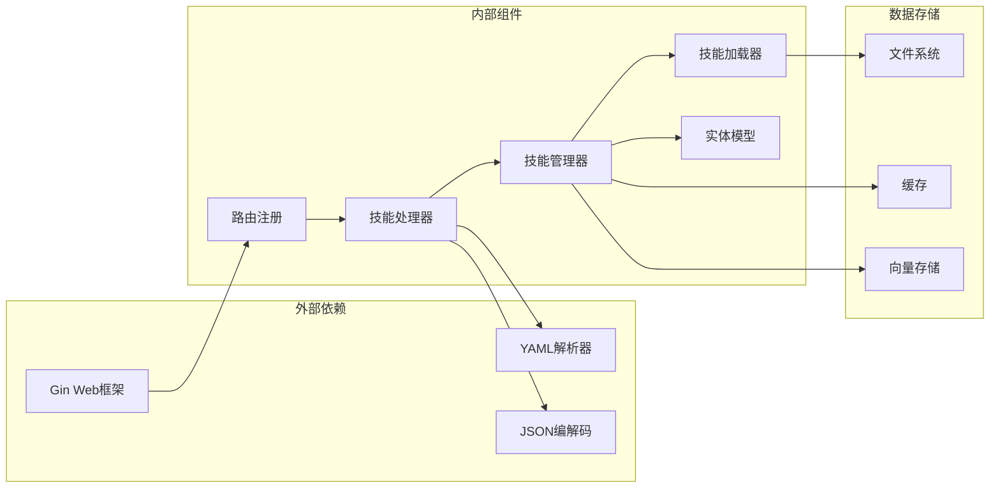

# 技能详情获取

<cite>
**本文档引用的文件**
- [skills.go](file://internal/adapters/http/handlers/skills.go)
- [router.go](file://internal/adapters/http/handlers/router.go)
- [skill.go](file://internal/entity/skill.go)
- [skill_mgr.go](file://internal/usecase/skills/skill_mgr.go)
- [SKILL.md](file://skills/weather/SKILL.md)
- [SKILL.md](file://skills/calculator/SKILL.md)
</cite>

## 目录
1. [简介](#简介)
2. [项目结构](#项目结构)
3. [核心组件](#核心组件)
4. [架构概览](#架构概览)
5. [详细组件分析](#详细组件分析)
6. [依赖关系分析](#依赖关系分析)
7. [性能考虑](#性能考虑)
8. [故障排除指南](#故障排除指南)
9. [结论](#结论)

## 简介

本文档详细说明了 MindX 技能系统的技能详情获取接口，重点介绍 `GET /api/skills/:name` 端点的功能和实现。该接口允许客户端获取指定技能的完整信息，包括技能定义、元数据、配置选项和状态信息。

MindX 是一个基于 Go 语言开发的智能技能平台，支持多种操作系统和技能类型。技能系统采用模块化设计，通过统一的接口管理技能的生命周期，包括加载、执行、索引和状态管理。

## 项目结构

技能详情获取功能位于 MindX 项目的 HTTP 适配层中，采用分层架构设计：

**图表来源**
- [router.go](file://internal/adapters/http/handlers/router.go#L19-L79)
- [skills.go](file://internal/adapters/http/handlers/skills.go#L14-L25)

**章节来源**
- [router.go](file://internal/adapters/http/handlers/router.go#L19-L79)

## 核心组件

### 技能处理器 (SkillsHandler)

技能处理器是 HTTP 层的核心组件，负责处理所有与技能相关的 HTTP 请求。它继承自 `SkillsHandler` 结构体，包含技能管理器实例和日志记录器。

**图表来源**
- [skills.go](file://internal/adapters/http/handlers/skills.go#L14-L25)
- [skill_mgr.go](file://internal/usecase/skills/skill_mgr.go#L20-L34)

### 技能实体模型

技能系统使用标准化的数据模型来表示技能信息，确保前后端数据的一致性和完整性。

**章节来源**
- [skill.go](file://internal/entity/skill.go#L5-L82)

## 架构概览

技能详情获取接口遵循 RESTful 设计原则，采用标准的 HTTP 方法和状态码：

**图表来源**
- [router.go](file://internal/adapters/http/handlers/router.go#L66-L66)
- [skills.go](file://internal/adapters/http/handlers/skills.go#L97-L115)
- [skill_mgr.go](file://internal/usecase/skills/skill_mgr.go#L142-L145)

## 详细组件分析

### 技能详情获取端点

#### 端点定义
- **方法**: GET
- **路径**: `/api/skills/:name`
- **参数**: 
  - `name` (路径参数): 技能名称，必填

#### 请求处理流程

**图表来源**
- [skills.go](file://internal/adapters/http/handlers/skills.go#L97-L115)

#### 响应数据结构

技能详情接口返回标准化的 JSON 响应，包含技能基本信息和状态信息：

| 字段 | 类型 | 描述 | 示例 |
|------|------|------|------|
| `name` | string | 技能名称 | `"weather"` |
| `skill` | object | 技能完整信息 | `{...}` |

技能信息对象包含以下子字段：

| 字段 | 类型 | 描述 | 示例 |
|------|------|------|------|
| `def` | object | 技能定义信息 | `{...}` |
| `directory` | string | 技能目录路径 | `"/skills/weather"` |
| `content` | string | 技能内容 | `"---\nname: weather\n..."` |
| `canRun` | boolean | 是否可运行 | `true` |
| `missingBins` | array | 缺失的二进制文件 | `[]` |
| `missingEnv` | array | 缺失的环境变量 | `[]` |
| `format` | string | 技能格式 | `"standard"` |
| `status` | string | 技能状态 | `"ready"` |
| `vector` | array | 向量表示 | `[0.1, 0.2, ...]` |
| `successCount` | integer | 成功执行次数 | `10` |
| `errorCount` | integer | 错误执行次数 | `2` |
| `lastRunTime` | string | 最后运行时间 | `"2024-01-15T10:30:00Z"` |
| `lastError` | string | 最后错误信息 | `"命令执行失败"` |
| `avgExecutionMs` | integer | 平均执行时间(ms) | `150` |
| `executionTimes` | array | 执行时间历史 | `[120, 145, 160]` |

#### 技能定义结构

技能定义对象包含技能的核心元数据：

| 字段 | 类型 | 描述 | 示例 |
|------|------|------|------|
| `name` | string | 技能名称 | `"weather"` |
| `description` | string | 技能描述 | `"天气查询技能，查询全球城市天气信息"` |
| `version` | string | 版本号 | `"1.0.0"` |
| `category` | string | 技能分类 | `"general"` |
| `tags` | array | 标签数组 | `["weather", "forecast"]` |
| `emoji` | string | 表情符号 | `"🌤️"` |
| `os` | array | 支持的操作系统 | `["darwin", "linux"]` |
| `enabled` | boolean | 是否启用 | `true` |
| `timeout` | integer | 超时时间(秒) | `60` |
| `command` | string | 执行命令 | `"./weather_cli.sh"` |
| `parameters` | object | 参数定义 | `{...}` |
| `requires` | object | 依赖要求 | `{...}` |
| `install` | array | 安装方法 | `[...]` |
| `homepage` | string | 主页链接 | `"https://example.com"` |
| `metadata` | object | 元数据 | `{...}` |
| `outputFormat` | string | 输出格式 | `"json"` |
| `guidance` | string | 使用指导 | `"..."` |
| `isInternal` | boolean | 是否内部技能 | `false` |

#### 参数定义结构

参数定义对象描述技能的输入参数：

| 字段 | 类型 | 描述 | 示例 |
|------|------|------|------|
| `type` | string | 参数类型 | `"string"` |
| `description` | string | 参数描述 | `"城市名称"` |
| `required` | boolean | 是否必需 | `true` |

#### 依赖要求结构

依赖要求对象描述技能运行所需的外部依赖：

| 字段 | 类型 | 描述 | 示例 |
|------|------|------|------|
| `bins` | array | 必需的二进制文件 | `["curl"]` |
| `env` | array | 必需的环境变量 | `["API_KEY"]` |

#### 安装方法结构

安装方法对象描述技能的安装方式：

| 字段 | 类型 | 描述 | 示例 |
|------|------|------|------|
| `id` | string | 安装方法标识 | `"brew"` |
| `kind` | string | 安装类型 | `"brew"` |
| `package` | string | 包名 | `"weather-cli"` |
| `formula` | string | 公式名 | `"weather-cli"` |
| `bins` | array | 生成的二进制文件 | `["weather"]` |
| `label` | string | 显示标签 | `"Homebrew"` |
| `os` | array | 支持的操作系统 | `["darwin"]` |

### 错误处理机制

技能详情获取接口实现了完善的错误处理机制：

**图表来源**
- [skills.go](file://internal/adapters/http/handlers/skills.go#L97-L115)

## 依赖关系分析

技能详情获取功能涉及多个组件的协作，形成了清晰的依赖关系：

**图表来源**
- [router.go](file://internal/adapters/http/handlers/router.go#L3-L12)
- [skills.go](file://internal/adapters/http/handlers/skills.go#L3-L12)

### 组件耦合度分析

技能详情获取接口展现了良好的模块化设计：

- **低耦合**: 处理器只依赖技能管理器接口，不直接操作底层存储
- **高内聚**: 相关的技能操作集中在技能管理器中
- **清晰的职责分离**: 路由层、处理层、业务层职责明确

**章节来源**
- [skill_mgr.go](file://internal/usecase/skills/skill_mgr.go#L20-L34)

## 性能考虑

技能详情获取接口在设计时充分考虑了性能因素：

### 缓存策略
- 技能信息在内存中缓存，避免重复的文件系统访问
- 向量索引数据缓存，支持快速相似度搜索
- 统计数据实时更新，保证数据准确性

### 异步处理
- 技能索引重建采用异步方式，不影响主请求处理
- MCP 服务器初始化支持并发处理
- 重试机制避免单点故障

### 资源管理
- 使用读写锁保护共享资源
- 连接池管理数据库连接
- 超时控制防止资源泄露

## 故障排除指南

### 常见问题及解决方案

#### 404 技能不存在
**症状**: 返回 `{"error": "技能不存在", "name": "技能名称"}`
**原因**: 
- 技能名称拼写错误
- 技能未正确安装
- 技能已被删除

**解决方案**:
1. 验证技能名称的正确性
2. 检查技能是否在技能目录中
3. 重新加载技能列表

#### 503 服务不可用
**症状**: 返回 `{"error": "技能管理器不可用"}`
**原因**:
- 技能管理器初始化失败
- 内存不足
- 系统资源紧张

**解决方案**:
1. 检查系统资源使用情况
2. 重启服务
3. 增加系统资源

#### 数据不一致
**症状**: 技能状态与实际不符
**原因**:
- 缓存未及时更新
- 并发访问冲突
- 存储异常

**解决方案**:
1. 清除缓存并重新加载
2. 检查并发访问控制
3. 验证存储完整性

### 调试技巧

1. **启用详细日志**: 检查系统日志中的错误信息
2. **验证技能文件**: 确认 SKILL.md 文件格式正确
3. **测试依赖项**: 验证外部依赖是否正常工作
4. **监控资源使用**: 关注内存和 CPU 使用情况

**章节来源**
- [skills.go](file://internal/adapters/http/handlers/skills.go#L97-L115)
- [skill_mgr.go](file://internal/usecase/skills/skill_mgr.go#L142-L145)

## 结论

MindX 技能详情获取接口展现了现代 Web 服务的良好实践：

### 设计优势
- **RESTful 设计**: 符合 HTTP 标准，易于理解和使用
- **模块化架构**: 清晰的分层设计，便于维护和扩展
- **完善的错误处理**: 标准化的错误响应，便于调试
- **性能优化**: 缓存和异步处理提升响应速度

### 技术特色
- **类型安全**: Go 语言的静态类型检查确保代码质量
- **并发安全**: 适当的并发控制避免数据竞争
- **可扩展性**: 插件化的技能系统支持功能扩展
- **可观测性**: 完善的日志和监控机制

### 最佳实践
1. **参数验证**: 始终验证输入参数的有效性
2. **错误处理**: 提供清晰的错误信息和状态码
3. **性能监控**: 关注关键指标，及时发现性能问题
4. **文档维护**: 保持 API 文档与实现同步

该接口为 MindX 技能系统的集成和使用提供了稳定可靠的基础，支持各种应用场景下的技能管理和调用需求。