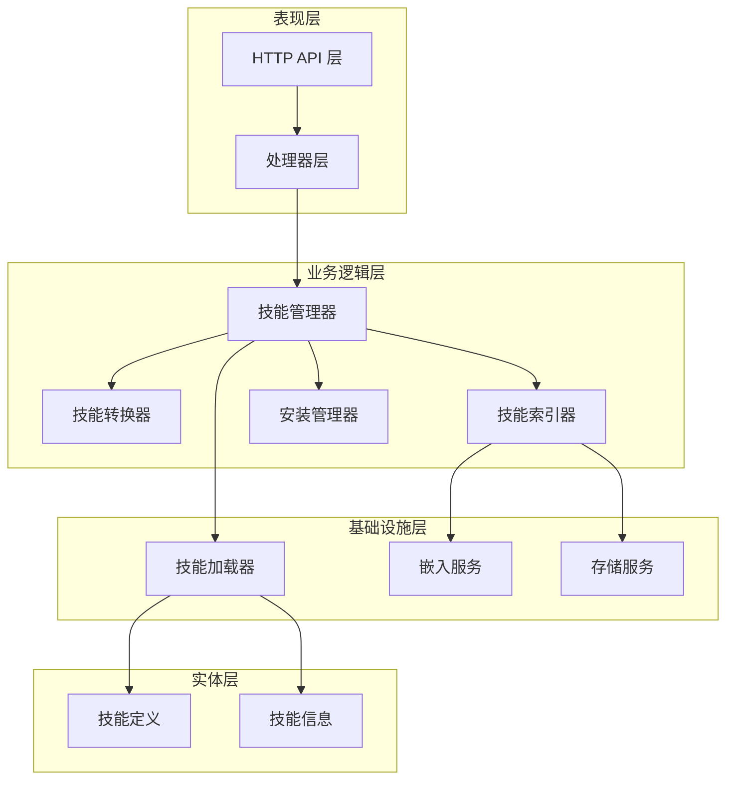
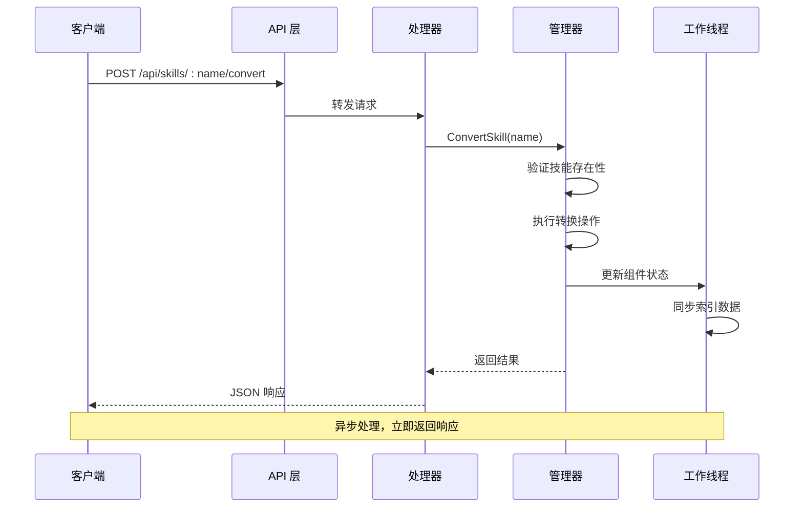
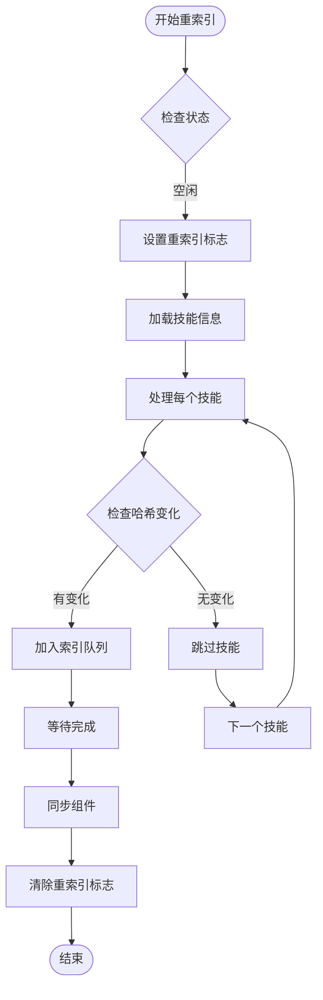
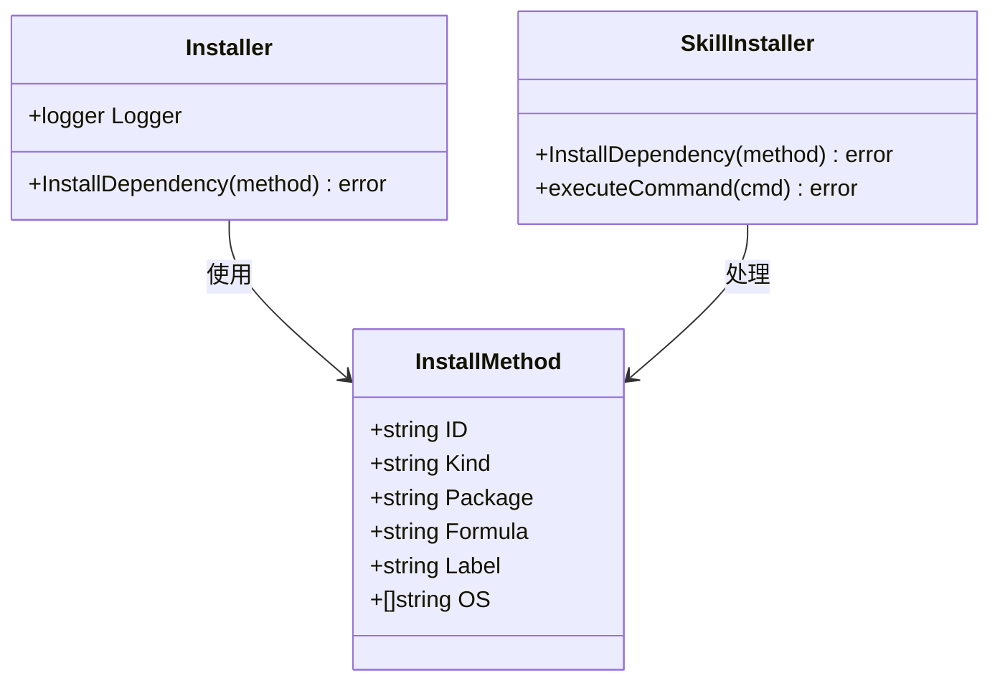
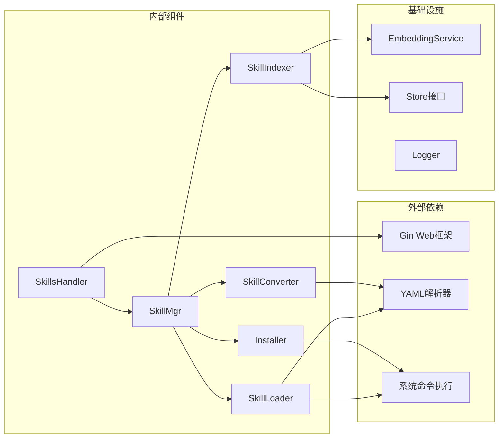

# 技能转换和批量操作

<cite>
**本文档引用的文件**
- [internal/adapters/http/handlers/skills.go](file://internal/adapters/http/handlers/skills.go)
- [internal/adapters/http/handlers/router.go](file://internal/adapters/http/handlers/router.go)
- [internal/usecase/skills/converter.go](file://internal/usecase/skills/converter.go)
- [internal/usecase/skills/skill_mgr.go](file://internal/usecase/skills/skill_mgr.go)
- [internal/usecase/skills/indexer.go](file://internal/usecase/skills/indexer.go)
- [internal/usecase/skills/skill_installer.go](file://internal/usecase/skills/skill_installer.go)
- [internal/entity/skill.go](file://internal/entity/skill.go)
- [internal/usecase/skills/loader.go](file://internal/usecase/skills/loader.go)
- [skills/calculator/SKILL.md](file://skills/calculator/SKILL.md)
- [skills/web_search/SKILL.md](file://skills/web_search/SKILL.md)
</cite>

## 目录
1. [简介](#简介)
2. [项目结构](#项目结构)
3. [核心组件](#核心组件)
4. [架构概览](#架构概览)
5. [详细组件分析](#详细组件分析)
6. [依赖关系分析](#依赖关系分析)
7. [性能考虑](#性能考虑)
8. [故障排除指南](#故障排除指南)
9. [结论](#结论)

## 简介

MindX 是一个智能技能管理系统，提供了完整的技能生命周期管理功能。本文档专注于技能转换和批量操作接口，详细说明了技能格式转换、批量转换和批量安装功能的实现原理和使用方法。

系统通过统一的 HTTP API 提供技能管理能力，包括单个技能转换、批量技能转换、批量技能安装等功能。所有操作都经过严格的错误处理和状态跟踪，确保系统的稳定性和可靠性。

## 项目结构

MindX 采用分层架构设计，主要分为以下几个层次：



**图表来源**
- [internal/adapters/http/handlers/router.go](file://internal/adapters/http/handlers/router.go#L18-L79)
- [internal/usecase/skills/skill_mgr.go](file://internal/usecase/skills/skill_mgr.go#L20-L62)

**章节来源**
- [internal/adapters/http/handlers/router.go](file://internal/adapters/http/handlers/router.go#L18-L79)
- [internal/usecase/skills/skill_mgr.go](file://internal/usecase/skills/skill_mgr.go#L36-L84)

## 核心组件

### 技能管理器 (SkillMgr)

技能管理器是整个技能系统的核心协调者，负责管理所有技能相关的操作：

- **职责**：协调技能转换、索引、安装、执行等操作
- **组件**：转换器、索引器、安装器、加载器、执行器
- **同步机制**：确保各组件状态一致

### 技能转换器 (SkillConverter)

专门负责技能格式转换的组件：

- **功能**：将技能文件转换为标准格式
- **处理**：解析 YAML frontmatter，验证技能定义
- **输出**：更新技能文件内容

### 技能索引器 (SkillIndexer)

负责技能向量化和索引管理：

- **异步处理**：使用工作队列处理索引任务
- **向量化**：生成技能关键词向量
- **持久化**：将索引数据存储到向量数据库

### 安装管理器 (Installer)

管理技能依赖和运行时环境：

- **多包管理器支持**：brew、apt、npm、pip 等
- **平台适配**：根据操作系统选择合适的安装方式
- **错误处理**：提供详细的安装过程反馈

**章节来源**
- [internal/usecase/skills/skill_mgr.go](file://internal/usecase/skills/skill_mgr.go#L20-L62)
- [internal/usecase/skills/converter.go](file://internal/usecase/skills/converter.go#L16-L35)
- [internal/usecase/skills/indexer.go](file://internal/usecase/skills/indexer.go#L32-L51)
- [internal/usecase/skills/skill_installer.go](file://internal/usecase/skills/skill_installer.go#L12-L22)

## 架构概览

系统采用事件驱动的异步架构，所有耗时操作都在后台线程中执行：



**图表来源**
- [internal/adapters/http/handlers/skills.go](file://internal/adapters/http/handlers/skills.go#L117-L140)
- [internal/usecase/skills/skill_mgr.go](file://internal/usecase/skills/skill_mgr.go#L282-L288)

**章节来源**
- [internal/adapters/http/handlers/skills.go](file://internal/adapters/http/handlers/skills.go#L117-L140)
- [internal/usecase/skills/skill_mgr.go](file://internal/usecase/skills/skill_mgr.go#L282-L288)

## 详细组件分析

### 技能转换接口

#### 单个技能转换

POST `/api/skills/:name/convert` 端点用于将指定技能转换为标准格式：

**请求参数**
- 路径参数：`:name` - 技能名称

**处理流程**
1. 验证技能管理器状态
2. 调用 `ConvertSkill(name)` 方法
3. 执行技能转换逻辑
4. 更新组件状态
5. 返回转换结果

**响应格式**
```json
{
  "message": "技能转换成功",
  "name": "技能名称"
}
```

#### 批量技能转换

POST `/api/skills/batch/convert` 端点支持同时转换多个技能：

**请求体**
```json
{
  "names": ["技能1", "技能2", "技能3"]
}
```

**处理流程**
1. 验证请求体格式
2. 检查技能名称数组
3. 调用 `BatchConvert(names)` 方法
4. 逐个执行转换操作
5. 收集成功和失败的结果

**响应格式**
```json
{
  "message": "批量转换完成",
  "success_count": 2,
  "failed_count": 1,
  "success": ["技能1", "技能2"],
  "failed": {
    "技能3": "错误信息"
  }
}
```

**章节来源**
- [internal/adapters/http/handlers/skills.go](file://internal/adapters/http/handlers/skills.go#L117-L140)
- [internal/adapters/http/handlers/skills.go](file://internal/adapters/http/handlers/skills.go#L398-L429)
- [internal/usecase/skills/converter.go](file://internal/usecase/skills/converter.go#L106-L120)

### 批量安装接口

POST `/api/skills/batch/install` 端点支持批量安装技能：

**请求体**
```json
{
  "names": ["技能1", "技能2", "技能3"]
}
```

**处理流程**
1. 验证请求体格式
2. 检查技能名称数组
3. 对每个技能调用 `InstallRuntime(name)`
4. 依次尝试不同的安装方法
5. 收集安装结果

**响应格式**
```json
{
  "message": "批量安装完成",
  "success_count": 2,
  "failed_count": 1,
  "success": ["技能1", "技能2"],
  "failed": {
    "技能3": "错误信息"
  }
}
```

**章节来源**
- [internal/adapters/http/handlers/skills.go](file://internal/adapters/http/handlers/skills.go#L431-L462)
- [internal/usecase/skills/skill_mgr.go](file://internal/usecase/skills/skill_mgr.go#L332-L346)

### 重索引机制

系统提供了完整的重索引功能，用于重建技能向量索引：

**触发方式**
- API 调用：POST `/api/skills/reindex`
- 状态查询：GET `/api/skills/reindex/status`

**后台处理流程**


**图表来源**
- [internal/adapters/http/handlers/skills.go](file://internal/adapters/http/handlers/skills.go#L77-L95)
- [internal/usecase/skills/skill_mgr.go](file://internal/usecase/skills/skill_mgr.go#L232-L241)

**章节来源**
- [internal/adapters/http/handlers/skills.go](file://internal/adapters/http/handlers/skills.go#L77-L95)
- [internal/usecase/skills/skill_mgr.go](file://internal/usecase/skills/skill_mgr.go#L232-L241)

### 安装管理器

安装管理器支持多种包管理器和安装方式：



**图表来源**
- [internal/usecase/skills/skill_installer.go](file://internal/usecase/skills/skill_installer.go#L12-L22)
- [internal/entity/skill.go](file://internal/entity/skill.go#L33-L42)

**章节来源**
- [internal/usecase/skills/skill_installer.go](file://internal/usecase/skills/skill_installer.go#L24-L66)
- [internal/entity/skill.go](file://internal/entity/skill.go#L33-L42)

## 依赖关系分析

系统组件之间的依赖关系如下：



**图表来源**
- [internal/adapters/http/handlers/skills.go](file://internal/adapters/http/handlers/skills.go#L3-L12)
- [internal/usecase/skills/skill_mgr.go](file://internal/usecase/skills/skill_mgr.go#L3-L18)

**章节来源**
- [internal/adapters/http/handlers/skills.go](file://internal/adapters/http/handlers/skills.go#L3-L12)
- [internal/usecase/skills/skill_mgr.go](file://internal/usecase/skills/skill_mgr.go#L3-L18)

## 性能考虑

### 异步处理策略

系统采用异步处理模式来提高响应性能：

- **后台线程**：重索引和批量操作在单独线程中执行
- **非阻塞I/O**：使用通道和队列进行异步通信
- **资源池**：合理管理并发资源，避免资源争用

### 缓存机制

- **技能信息缓存**：在内存中缓存技能定义和状态
- **向量索引缓存**：缓存技能向量以提高搜索性能
- **组件同步**：确保各组件间的数据一致性

### 错误处理优化

- **渐进式失败**：批量操作中单个失败不影响整体流程
- **详细日志**：记录详细的错误信息便于调试
- **超时控制**：为长时间操作设置合理的超时限制

## 故障排除指南

### 常见问题及解决方案

**技能转换失败**
- 检查技能文件格式是否正确
- 验证 YAML frontmatter 的完整性
- 确认技能目录权限

**批量操作超时**
- 检查网络连接状态
- 验证目标服务器可达性
- 调整超时参数设置

**索引重建异常**
- 检查嵌入服务状态
- 验证向量数据库连接
- 确认磁盘空间充足

**安装失败**
- 检查包管理器可用性
- 验证系统权限
- 确认网络连接正常

### 调试建议

1. **启用详细日志**：查看系统日志获取更多上下文信息
2. **分步验证**：先单独测试单个技能，再进行批量操作
3. **监控资源使用**：关注 CPU、内存和磁盘使用情况
4. **检查依赖服务**：确保所有依赖的服务正常运行

**章节来源**
- [internal/usecase/skills/skill_mgr.go](file://internal/usecase/skills/skill_mgr.go#L232-L241)
- [internal/usecase/skills/converter.go](file://internal/usecase/skills/converter.go#L37-L104)

## 结论

MindX 的技能转换和批量操作接口提供了完整的技能生命周期管理能力。通过模块化的架构设计和异步处理机制，系统能够高效地处理大量技能操作，同时保持良好的用户体验。

关键特性包括：
- **灵活的技能格式**：支持多种技能格式的转换
- **强大的批量处理**：支持大规模技能的批量操作
- **完善的错误处理**：提供详细的错误信息和恢复机制
- **高效的索引系统**：通过向量化技术提供快速技能检索
- **可靠的安装管理**：支持多种包管理器和安装方式

这些功能为企业级应用提供了坚实的技术基础，能够满足复杂的技能管理和自动化需求。