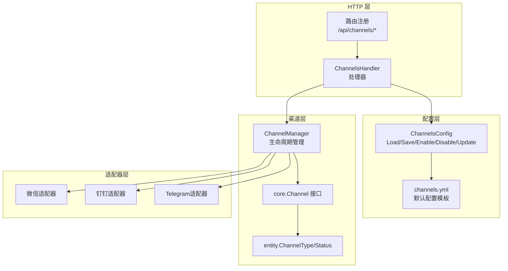
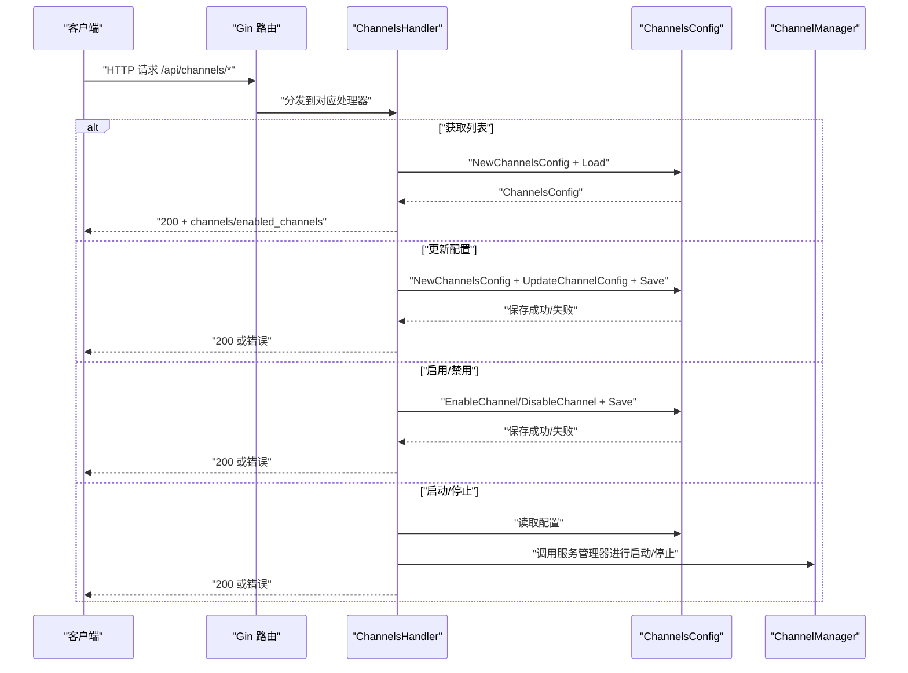
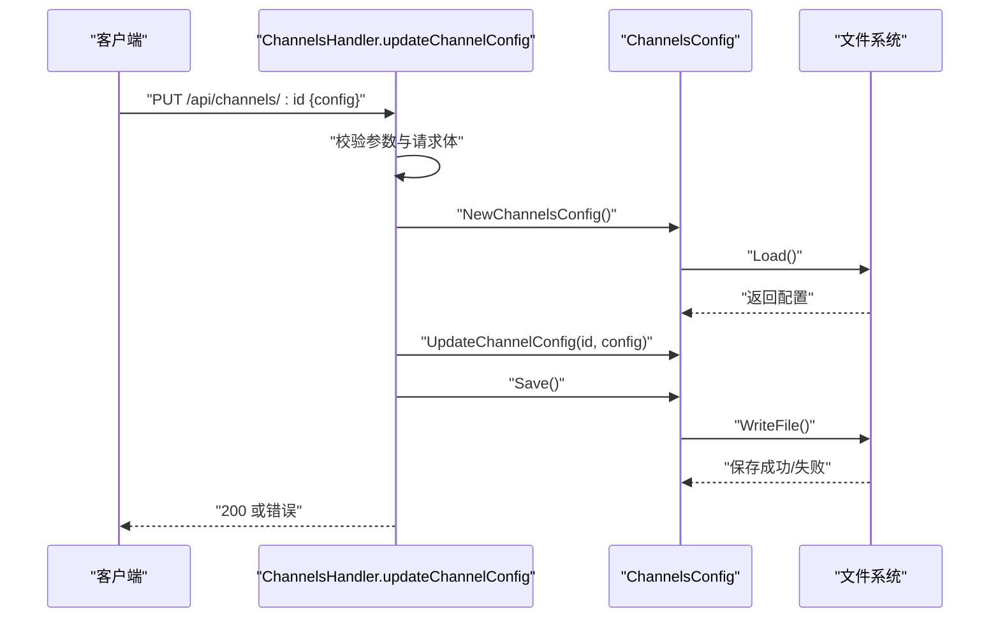
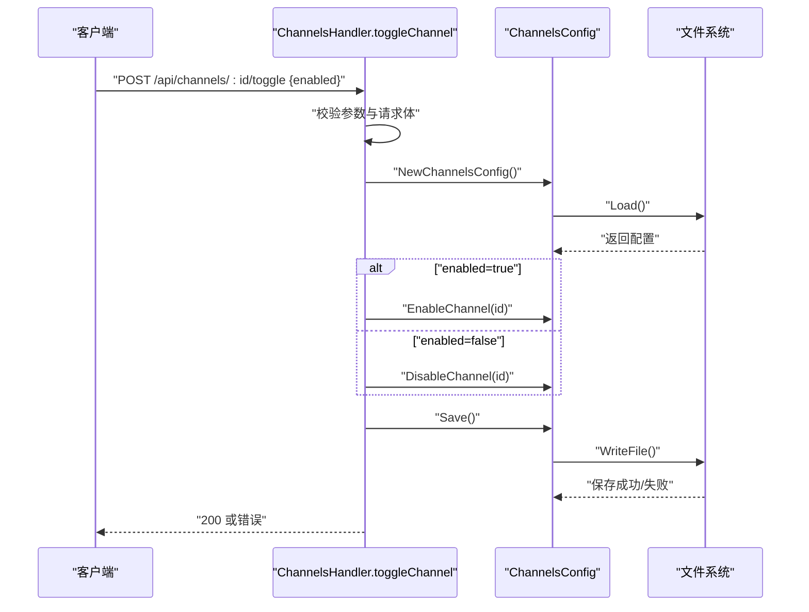
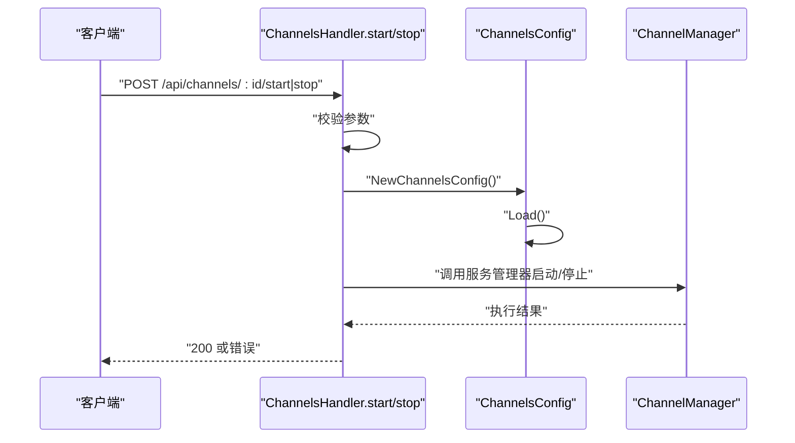
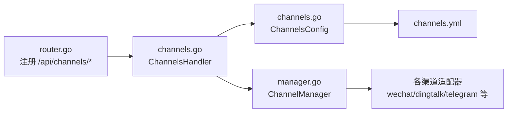

# 渠道管理

<cite>
**本文引用的文件**
- [internal/adapters/http/handlers/channels.go](file://internal/adapters/http/handlers/channels.go)
- [internal/adapters/http/handlers/router.go](file://internal/adapters/http/handlers/router.go)
- [internal/config/channels.go](file://internal/config/channels.go)
- [config/channels.yml](file://config/channels.yml)
- [internal/entity/channel.go](file://internal/entity/channel.go)
- [internal/core/channel.go](file://internal/core/channel.go)
- [internal/adapters/channels/manager.go](file://internal/adapters/channels/manager.go)
- [internal/adapters/channels/wechat.go](file://internal/adapters/channels/wechat.go)
- [internal/adapters/channels/telegramchannel.go](file://internal/adapters/channels/telegramchannel.go)
- [internal/adapters/channels/dingtalk.go](file://internal/adapters/channels/dingtalk.go)
- [internal/config/wechat.go](file://internal/config/wechat.go)
- [internal/config/telegram.go](file://internal/config/telegram.go)
- [internal/config/dingtalk.go](file://internal/config/dingtalk.go)
- [dashboard/src/components/channels/types.ts](file://dashboard/src/components/channels/types.ts)
</cite>

## 目录
1. [简介](#简介)
2. [项目结构](#项目结构)
3. [核心组件](#核心组件)
4. [架构总览](#架构总览)
5. [详细组件分析](#详细组件分析)
6. [依赖关系分析](#依赖关系分析)
7. [性能与可靠性](#性能与可靠性)
8. [故障排查指南](#故障排查指南)
9. [结论](#结论)
10. [附录](#附录)

## 简介
本文件为 MindX 渠道管理接口的详细 API 文档，聚焦 /api/channels 系列端点，覆盖以下能力：
- 获取渠道列表与基础元信息
- 更新指定渠道的配置
- 启用/禁用指定渠道
- 启动/停止指定渠道（注：实际运行由服务侧管理器负责）

文档同时给出各渠道类型的配置要点与参数说明，包括微信、钉钉、Telegram 等，帮助快速完成对接与运维。

## 项目结构
与渠道管理相关的关键位置如下：
- HTTP 层路由与处理器：/api/channels 下的 GET、PUT/POST、POST、POST、POST
- 配置模型与持久化：ChannelsConfig、Channel 及其 Load/Save
- 渠道类型与实体：ChannelType、ChannelStatus、IncomingMessage/OutgoingMessage
- 渠道管理器：ChannelManager 负责生命周期与并发创建
- 渠道适配器：各平台（微信、钉钉、Telegram 等）的工厂与实现
- 前端类型定义：ChannelsData/ChannelConfig 结构映射

图表来源
- [internal/adapters/http/handlers/router.go](file://internal/adapters/http/handlers/router.go#L47-L57)
- [internal/adapters/http/handlers/channels.go](file://internal/adapters/http/handlers/channels.go#L31-L213)
- [internal/config/channels.go](file://internal/config/channels.go#L23-L59)
- [internal/adapters/channels/manager.go](file://internal/adapters/channels/manager.go#L149-L200)
- [internal/core/channel.go](file://internal/core/channel.go#L10-L40)

章节来源
- [internal/adapters/http/handlers/router.go](file://internal/adapters/http/handlers/router.go#L47-L57)
- [internal/adapters/http/handlers/channels.go](file://internal/adapters/http/handlers/channels.go#L31-L213)
- [internal/config/channels.go](file://internal/config/channels.go#L23-L59)

## 核心组件
- ChannelsHandler：提供 /api/channels 的具体实现，包含获取列表、更新配置、启停、开关等方法。
- ChannelsConfig：封装 channels.yml 的读取、保存、启用/禁用、更新配置等操作。
- ChannelManager：根据配置批量创建并启动渠道，统一管理生命周期。
- core.Channel 接口：定义渠道的标准能力（启动、停止、发送消息、状态查询等）。
- entity.ChannelType/ChannelStatus：抽象渠道类型与状态模型，便于监控与展示。

章节来源
- [internal/adapters/http/handlers/channels.go](file://internal/adapters/http/handlers/channels.go#L13-L29)
- [internal/config/channels.go](file://internal/config/channels.go#L11-L21)
- [internal/adapters/channels/manager.go](file://internal/adapters/channels/manager.go#L15-L29)
- [internal/core/channel.go](file://internal/core/channel.go#L10-L40)
- [internal/entity/channel.go](file://internal/entity/channel.go#L7-L21)

## 架构总览
下图展示了 /api/channels 请求在系统中的流转路径：

图表来源
- [internal/adapters/http/handlers/router.go](file://internal/adapters/http/handlers/router.go#L47-L57)
- [internal/adapters/http/handlers/channels.go](file://internal/adapters/http/handlers/channels.go#L31-L213)
- [internal/config/channels.go](file://internal/config/channels.go#L23-L59)
- [internal/adapters/channels/manager.go](file://internal/adapters/channels/manager.go#L149-L200)

## 详细组件分析

### API 定义与行为
- 基础路径：/api/channels
- 路由注册位置：见路由文件中的 channelsGroup 分组

端点一览
- GET /api/channels
  - 功能：获取所有渠道的基础信息与已启用渠道列表
  - 请求参数：无
  - 成功响应字段：enabled_channels（数组）、channels（对象，键为渠道ID）
  - 错误码：500（加载配置失败）
  - 章节来源
    - [internal/adapters/http/handlers/router.go](file://internal/adapters/http/handlers/router.go#L51-L51)
    - [internal/adapters/http/handlers/channels.go](file://internal/adapters/http/handlers/channels.go#L31-L54)

- PUT /api/channels/:id
  - 功能：更新指定渠道的配置（完全替换）
  - 路径参数：id（渠道ID）
  - 请求体：任意 JSON 对象（将作为新配置写入）
  - 成功响应：200 + 成功消息
  - 错误码：400（缺少ID/请求体非法）、404（配置不存在/未找到渠道）、500（加载/保存失败）
  - 章节来源
    - [internal/adapters/http/handlers/router.go](file://internal/adapters/http/handlers/router.go#L53-L53)
    - [internal/adapters/http/handlers/channels.go](file://internal/adapters/http/handlers/channels.go#L56-L100)

- POST /api/channels/:id/config
  - 功能：同上，更新指定渠道配置（别名）
  - 路径参数：id（渠道ID）
  - 请求体：任意 JSON 对象
  - 成功响应：200 + 成功消息
  - 错误码：同上
  - 章节来源
    - [internal/adapters/http/handlers/router.go](file://internal/adapters/http/handlers/router.go#L54-L54)
    - [internal/adapters/http/handlers/channels.go](file://internal/adapters/http/handlers/channels.go#L56-L100)

- POST /api/channels/:id/toggle
  - 功能：启用或禁用指定渠道
  - 路径参数：id（渠道ID）
  - 请求体：{ enabled: true|false }
  - 成功响应：200 + 成功消息
  - 错误码：400（缺少ID/请求体非法）、404（配置不存在/未找到渠道）、500（启用/禁用/保存失败）
  - 章节来源
    - [internal/adapters/http/handlers/router.go](file://internal/adapters/http/handlers/router.go#L55-L55)
    - [internal/adapters/http/handlers/channels.go](file://internal/adapters/http/handlers/channels.go#L102-L155)

- POST /api/channels/:id/start
  - 功能：启动指定渠道（注：实际启动由服务管理器执行）
  - 路径参数：id（渠道ID）
  - 请求体：无
  - 成功响应：200 + 成功消息
  - 错误码：400（缺少ID）、404（配置不存在/未找到渠道）、500（加载失败）
  - 章节来源
    - [internal/adapters/http/handlers/router.go](file://internal/adapters/http/handlers/router.go#L56-L56)
    - [internal/adapters/http/handlers/channels.go](file://internal/adapters/http/handlers/channels.go#L157-L184)

- POST /api/channels/:id/stop
  - 功能：停止指定渠道（注：实际停止由服务管理器执行）
  - 路径参数：id（渠道ID）
  - 请求体：无
  - 成功响应：200 + 成功消息
  - 错误码：400（缺少ID）、404（配置不存在/未找到渠道）、500（加载失败）
  - 章节来源
    - [internal/adapters/http/handlers/router.go](file://internal/adapters/http/handlers/router.go#L57-L57)
    - [internal/adapters/http/handlers/channels.go](file://internal/adapters/http/handlers/channels.go#L186-L213)

### 配置模型与持久化
- ChannelsConfig
  - 字段：enabled_channels（启用渠道ID数组）、channels（渠道映射）
  - 方法：Load/Save（支持 .yaml/.yml/.json 自动识别）、EnableChannel/DisableChannel、UpdateChannelConfig、IsChannelEnabled、GetAllChannels
  - 章节来源
    - [internal/config/channels.go](file://internal/config/channels.go#L11-L21)
    - [internal/config/channels.go](file://internal/config/channels.go#L23-L59)
    - [internal/config/channels.go](file://internal/config/channels.go#L61-L100)
    - [internal/config/channels.go](file://internal/config/channels.go#L112-L115)
    - [internal/config/channels.go](file://internal/config/channels.go#L103-L110)

- 默认配置模板 channels.yml
  - 包含微信、钉钉、Telegram、飞书、QQ、WhatsApp、Facebook、iMessage 等渠道的默认项
  - 章节来源
    - [config/channels.yml](file://config/channels.yml#L1-L96)

- 前端类型映射
  - ChannelsData/ChannelConfig 与后端结构一致，便于前端渲染与表单提交
  - 章节来源
    - [dashboard/src/components/channels/types.ts](file://dashboard/src/components/channels/types.ts#L1-L15)

### 渠道类型与状态
- ChannelType
  - 支持类型：realtime、feishu、wechat、qq、doubao、dingtalk、whatsapp、facebook、telegram、imessage
  - 章节来源
    - [internal/entity/channel.go](file://internal/entity/channel.go#L10-L21)

- ChannelStatus
  - 字段：name、type、description、running、startTime、lastMessageTime、totalMessages、error、healthCheck
  - 章节来源
    - [internal/entity/channel.go](file://internal/entity/channel.go#L141-L184)

- core.Channel 接口
  - 方法：Name、Type、Description、Start、Stop、IsRunning、SetOnMessage、SendMessage、GetStatus
  - 章节来源
    - [internal/core/channel.go](file://internal/core/channel.go#L10-L40)

### 渠道管理器与生命周期
- ChannelManager
  - 职责：添加、获取、列出、批量停止、按配置创建并启动渠道
  - CreateChannelsFromConfig：遍历配置，按工厂函数创建并启动，支持并发与错误收集
  - 章节来源
    - [internal/adapters/channels/manager.go](file://internal/adapters/channels/manager.go#L15-L29)
    - [internal/adapters/channels/manager.go](file://internal/adapters/channels/manager.go#L149-L200)

### 各渠道配置要点与参数

- 微信（wechat）
  - 关键参数：app_id、app_secret、token、encoding_aes_key、port、path、type
  - 章节来源
    - [config/channels.yml](file://config/channels.yml#L71-L83)
    - [internal/config/wechat.go](file://internal/config/wechat.go#L3-L11)
    - [internal/adapters/channels/wechat.go](file://internal/adapters/channels/wechat.go#L26-L36)

- 钉钉（dingtalk）
  - 关键参数：agent_id、app_key、app_secret、encrypt_key、webhook_secret、port、path
  - 章节来源
    - [config/channels.yml](file://config/channels.yml#L3-L15)
    - [internal/config/dingtalk.go](file://internal/config/dingtalk.go#L3-L11)
    - [internal/adapters/channels/dingtalk.go](file://internal/adapters/channels/dingtalk.go#L27-L37)

- Telegram（telegram）
  - 关键参数：bot_token、webhook_url、secret_token、port、path、use_webhook
  - 章节来源
    - [config/channels.yml](file://config/channels.yml#L59-L70)
    - [internal/config/telegram.go](file://internal/config/telegram.go#L3-L10)
    - [internal/adapters/channels/telegramchannel.go](file://internal/adapters/channels/telegramchannel.go#L20-L29)

- 其他渠道（飞书、QQ、WhatsApp、Facebook、iMessage）
  - 关键参数与默认值可参考 channels.yml
  - 章节来源
    - [config/channels.yml](file://config/channels.yml#L28-L96)

### 配置更新流程（序列图）

图表来源
- [internal/adapters/http/handlers/channels.go](file://internal/adapters/http/handlers/channels.go#L56-L100)
- [internal/config/channels.go](file://internal/config/channels.go#L23-L59)

### 启用/禁用流程（序列图）

图表来源
- [internal/adapters/http/handlers/channels.go](file://internal/adapters/http/handlers/channels.go#L102-L155)
- [internal/config/channels.go](file://internal/config/channels.go#L61-L89)

### 启动/停止流程（序列图）

图表来源
- [internal/adapters/http/handlers/channels.go](file://internal/adapters/http/handlers/channels.go#L157-L213)
- [internal/adapters/channels/manager.go](file://internal/adapters/channels/manager.go#L149-L200)

## 依赖关系分析
- 路由到处理器：router.go 在 /api 下注册 channelsGroup，并将各端点映射到 ChannelsHandler 的具体方法
- 处理器到配置：ChannelsHandler 通过 NewChannelsConfig 加载/保存 channels.yml；对配置进行 Enable/Disable/Update
- 处理器到管理器：启动/停止端点在处理器中仅做参数校验与日志记录，实际运行由 ChannelManager 负责
- 配置到适配器：ChannelManager 根据 channels.yml 的 enabled_channels 与 channels 映射，使用工厂函数创建各渠道实例并启动

图表来源
- [internal/adapters/http/handlers/router.go](file://internal/adapters/http/handlers/router.go#L47-L57)
- [internal/adapters/http/handlers/channels.go](file://internal/adapters/http/handlers/channels.go#L31-L213)
- [internal/config/channels.go](file://internal/config/channels.go#L23-L59)
- [internal/adapters/channels/manager.go](file://internal/adapters/channels/manager.go#L149-L200)

章节来源
- [internal/adapters/http/handlers/router.go](file://internal/adapters/http/handlers/router.go#L47-L57)
- [internal/adapters/http/handlers/channels.go](file://internal/adapters/http/handlers/channels.go#L31-L213)
- [internal/config/channels.go](file://internal/config/channels.go#L23-L59)
- [internal/adapters/channels/manager.go](file://internal/adapters/channels/manager.go#L149-L200)

## 性能与可靠性
- 并发创建：ChannelManager 在创建多个渠道时采用 goroutine 并发，配合 WaitGroup 与错误通道，提升初始化效率
- 配置持久化：Save 使用 YAML/JSON 序列化写回，建议在高并发场景下避免频繁写盘
- 启停解耦：HTTP 层仅负责参数校验与落盘，实际运行交由 ChannelManager，降低耦合度
- 健康检查：ChannelStatus 提供健康状态字段，便于前端展示与告警

章节来源
- [internal/adapters/channels/manager.go](file://internal/adapters/channels/manager.go#L165-L200)
- [internal/entity/channel.go](file://internal/entity/channel.go#L141-L184)

## 故障排查指南
常见错误与定位建议
- 400 缺少渠道ID或请求体非法
  - 检查路径参数 id 是否传入，请求体是否为合法 JSON
  - 章节来源
    - [internal/adapters/http/handlers/channels.go](file://internal/adapters/http/handlers/channels.go#L59-L68)

- 404 通道配置不存在或未找到渠道
  - 检查 channels.yml 是否存在且包含目标渠道；确认 id 正确
  - 章节来源
    - [internal/adapters/http/handlers/channels.go](file://internal/adapters/http/handlers/channels.go#L76-L84)

- 500 加载/保存通道配置失败
  - 查看服务日志；确认 channels.yml 权限与格式正确；尝试手动修复后重试
  - 章节来源
    - [internal/adapters/http/handlers/channels.go](file://internal/adapters/http/handlers/channels.go#L34-L35)
    - [internal/adapters/http/handlers/channels.go](file://internal/adapters/http/handlers/channels.go#L91-L95)

- 启用/禁用失败
  - 确认目标渠道在 channels.yml 中存在；检查 Save 是否成功
  - 章节来源
    - [internal/adapters/http/handlers/channels.go](file://internal/adapters/http/handlers/channels.go#L134-L152)

- 启动/停止无效
  - 注意：HTTP 层仅记录日志；实际运行由服务管理器负责。检查 ChannelManager 的日志与状态
  - 章节来源
    - [internal/adapters/http/handlers/channels.go](file://internal/adapters/http/handlers/channels.go#L181-L183)
    - [internal/adapters/http/handlers/channels.go](file://internal/adapters/http/handlers/channels.go#L210-L212)

## 结论
MindX 的渠道管理通过清晰的分层设计实现了“配置即接口”的能力：
- HTTP 层提供简洁稳定的 API
- 配置层负责持久化与校验
- 管理器负责渠道生命周期与并发初始化
- 适配器层屏蔽平台差异，统一对外接口

该设计既满足了快速对接多种渠道的需求，也为后续扩展与运维提供了良好基础。

## 附录

### 渠道配置示例（字段说明）
- 微信（wechat）
  - app_id、app_secret、token、encoding_aes_key、port、path、type
  - 章节来源
    - [config/channels.yml](file://config/channels.yml#L71-L83)
    - [internal/config/wechat.go](file://internal/config/wechat.go#L3-L11)

- 钉钉（dingtalk）
  - agent_id、app_key、app_secret、encrypt_key、webhook_secret、port、path
  - 章节来源
    - [config/channels.yml](file://config/channels.yml#L3-L15)
    - [internal/config/dingtalk.go](file://internal/config/dingtalk.go#L3-L11)

- Telegram（telegram）
  - bot_token、webhook_url、secret_token、port、path、use_webhook
  - 章节来源
    - [config/channels.yml](file://config/channels.yml#L59-L70)
    - [internal/config/telegram.go](file://internal/config/telegram.go#L3-L10)

- 其他渠道（飞书、QQ、WhatsApp、Facebook、iMessage）
  - 章节来源
    - [config/channels.yml](file://config/channels.yml#L28-L96)