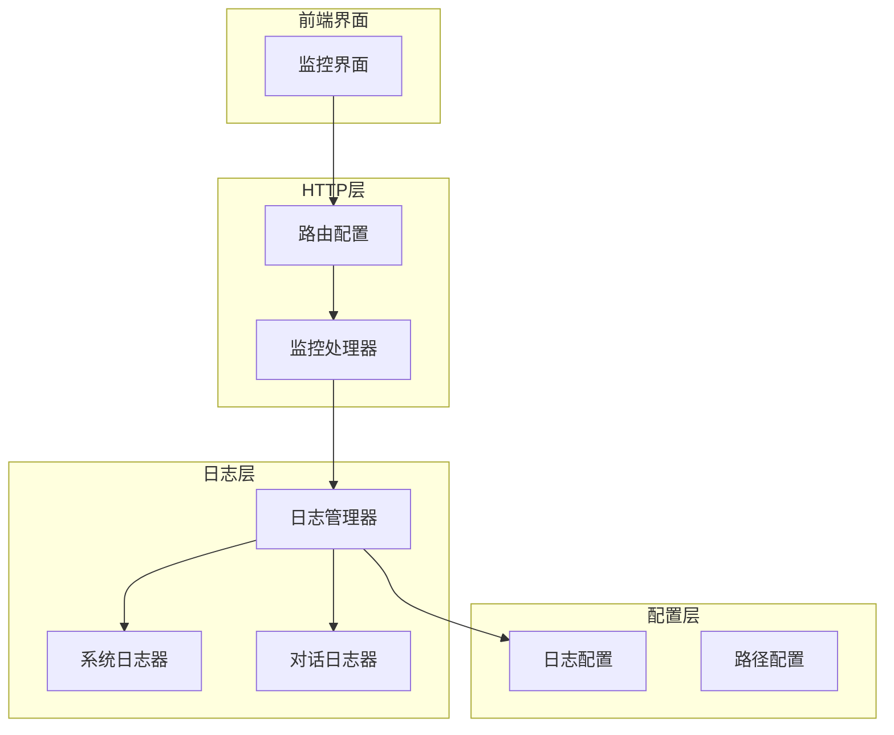
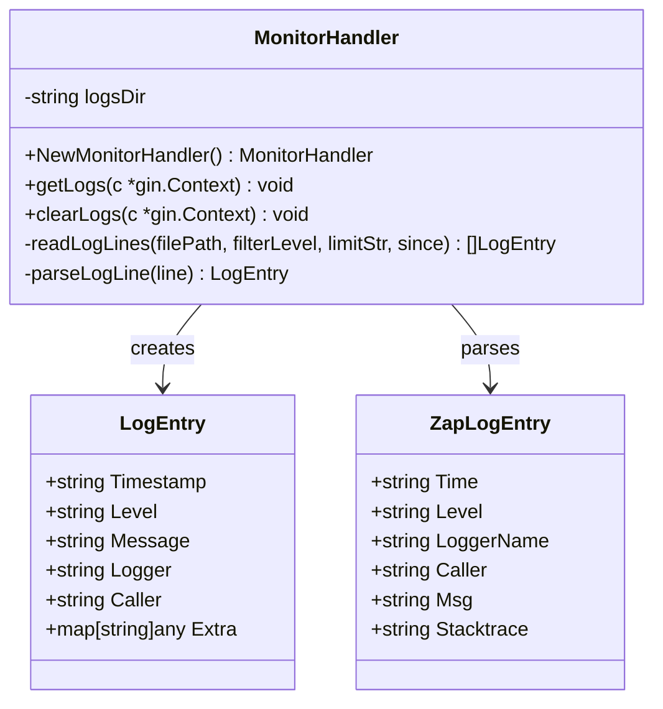
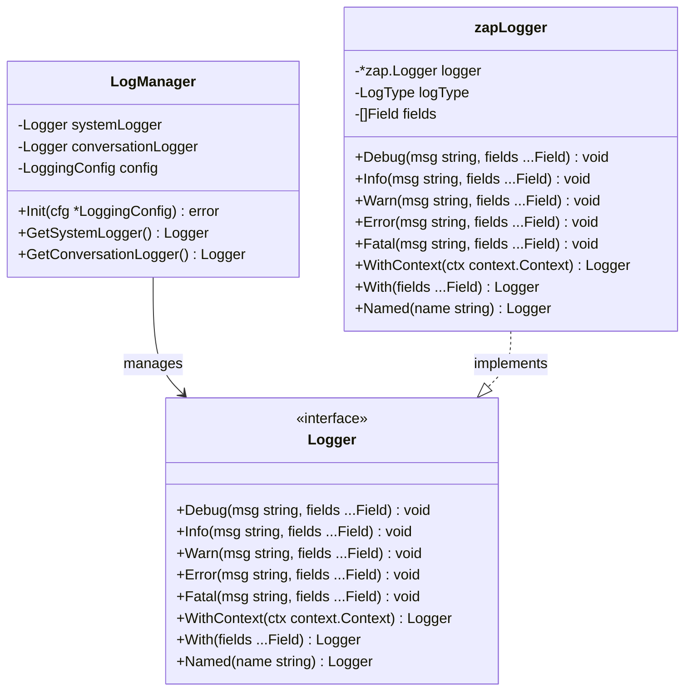
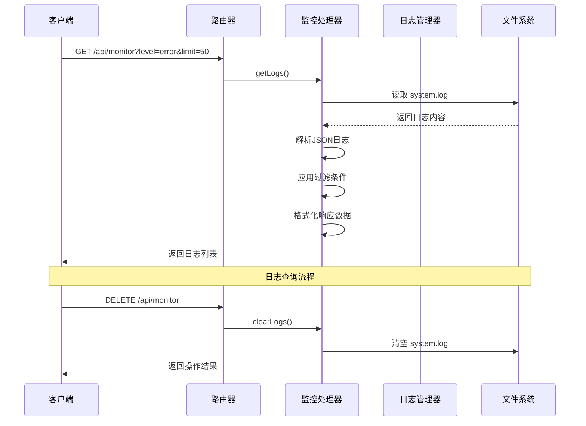
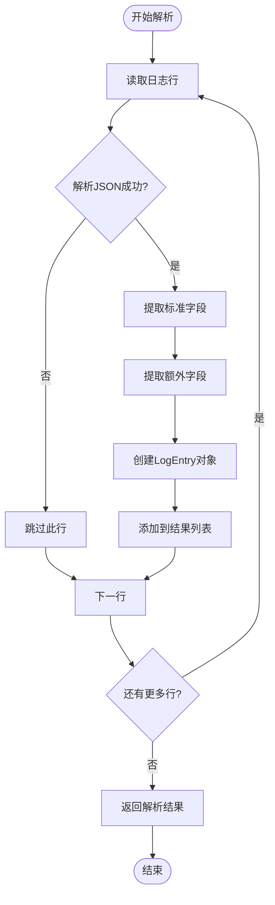
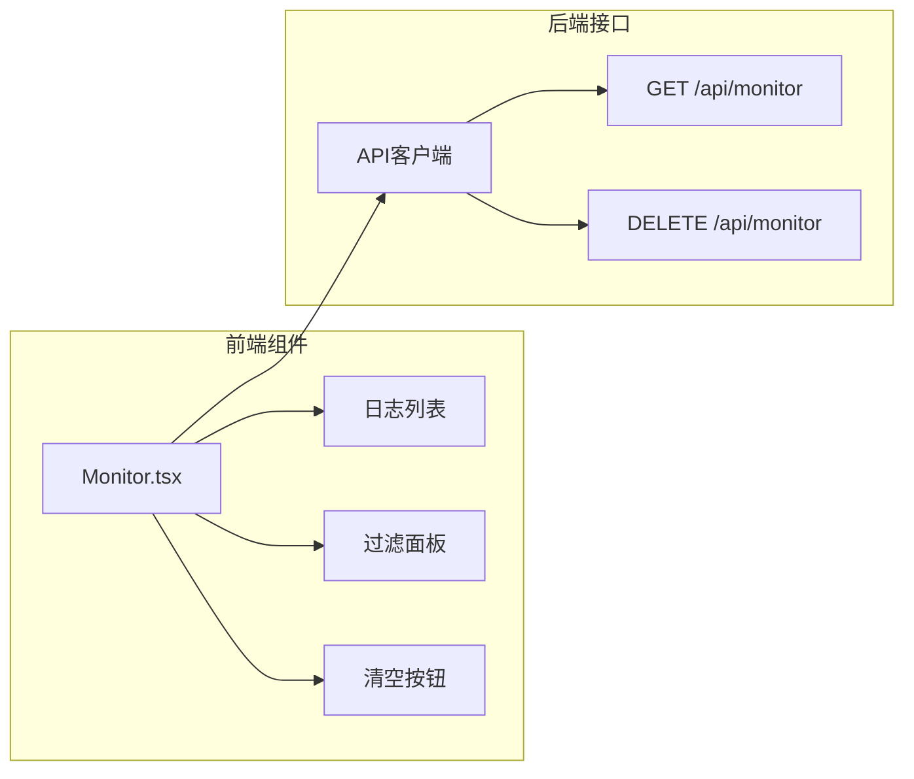
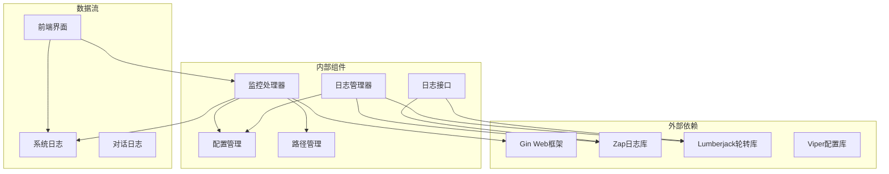

# 监控与日志

<cite>
**本文档引用的文件**
- [monitor.go](file://internal/adapters/http/handlers/monitor.go)
- [router.go](file://internal/adapters/http/handlers/router.go)
- [logger.go](file://pkg/logging/logger.go)
- [logging.go](file://internal/config/logging.go)
- [paths.go](file://internal/config/paths.go)
- [Monitor.tsx](file://dashboard/src/components/Monitor.tsx)
</cite>

## 目录
1. [简介](#简介)
2. [项目结构](#项目结构)
3. [核心组件](#核心组件)
4. [架构概览](#架构概览)
5. [详细组件分析](#详细组件分析)
6. [依赖关系分析](#依赖关系分析)
7. [性能考虑](#性能考虑)
8. [故障排除指南](#故障排除指南)
9. [结论](#结论)

## 简介

MindX 监控与日志接口提供了完整的系统监控能力，包括实时日志查看、日志清理和日志轮转功能。该接口通过 `/api/monitor` 端点提供服务，支持多种查询参数和过滤条件，帮助开发者和运维人员快速定位问题和分析系统运行状态。

## 项目结构

监控与日志功能主要分布在以下模块中：



**图表来源**
- [monitor.go](file://internal/adapters/http/handlers/monitor.go#L1-L188)
- [router.go](file://internal/adapters/http/handlers/router.go#L121-L124)
- [logger.go](file://pkg/logging/logger.go#L1-L402)

**章节来源**
- [monitor.go](file://internal/adapters/http/handlers/monitor.go#L1-L188)
- [router.go](file://internal/adapters/http/handlers/router.go#L121-L124)

## 核心组件

### 监控处理器 (MonitorHandler)

监控处理器是日志接口的核心组件，负责处理所有与日志相关的请求。



**图表来源**
- [monitor.go](file://internal/adapters/http/handlers/monitor.go#L16-L46)
- [monitor.go](file://internal/adapters/http/handlers/monitor.go#L20-L36)

### 日志管理器 (LogManager)

日志管理器负责创建和管理不同类型的日志记录器。



**图表来源**
- [logger.go](file://pkg/logging/logger.go#L58-L110)
- [logger.go](file://pkg/logging/logger.go#L24-L43)
- [logger.go](file://pkg/logging/logger.go#L51-L56)

**章节来源**
- [monitor.go](file://internal/adapters/http/handlers/monitor.go#L16-L46)
- [logger.go](file://pkg/logging/logger.go#L58-L110)

## 架构概览

监控系统的整体架构采用分层设计，确保了良好的可维护性和扩展性：



**图表来源**
- [router.go](file://internal/adapters/http/handlers/router.go#L121-L124)
- [monitor.go](file://internal/adapters/http/handlers/monitor.go#L48-L98)

## 详细组件分析

### API 端点定义

监控接口提供两个主要端点：

| 端点 | 方法 | 功能 | 参数 |
|------|------|------|------|
| `/api/monitor` | GET | 获取系统日志 | level, limit, since |
| `/api/monitor` | DELETE | 清空系统日志 | 无 |

#### GET /api/monitor - 日志获取

**查询参数说明：**

- `level`: 日志级别过滤 (debug, info, warn, error, fatal)
- `limit`: 返回日志数量限制 (默认 100)
- `since`: 时间戳过滤 (增量查询，返回指定时间戳之后的日志)

**响应格式：**

```json
{
  "logs": [
    {
      "timestamp": "2023-12-01T10:30:45.123Z",
      "level": "ERROR",
      "message": "数据库连接失败",
      "logger": "database",
      "caller": "database.go:45",
      "extra": {
        "error_code": "CONNECTION_FAILED",
        "host": "localhost"
      }
    }
  ],
  "lastTimestamp": "2023-12-01T10:30:45.123Z",
  "count": 1
}
```

#### DELETE /api/monitor - 日志清空

**响应格式：**

```json
{
  "success": true,
  "message": "日志已清空"
}
```

### 日志格式解析

系统使用 JSON 格式的日志记录，兼容 Zap 日志库的标准格式：



**图表来源**
- [monitor.go](file://internal/adapters/http/handlers/monitor.go#L161-L187)
- [monitor.go](file://internal/adapters/http/handlers/monitor.go#L100-L159)

### 日志轮转配置

系统使用 lumberjack 库实现日志轮转，支持以下配置选项：

| 配置项 | 类型 | 默认值 | 描述 |
|--------|------|--------|------|
| `level` | string | "info" | 日志级别 (debug, info, warn, error, fatal) |
| `output_path` | string | "logs/system.log" | 日志输出路径 |
| `max_size` | int | 100 | 单个文件最大大小(MB) |
| `max_backups` | int | 10 | 保留的历史文件数 |
| `max_age` | int | 30 | 保留的最大天数 |
| `compress` | bool | true | 是否压缩历史文件 |

### 前端监控界面集成

前端监控界面提供了实时日志显示和交互功能：



**图表来源**
- [Monitor.tsx](file://dashboard/src/components/Monitor.tsx#L146-L187)
- [router.go](file://internal/adapters/http/handlers/router.go#L121-L124)

**章节来源**
- [monitor.go](file://internal/adapters/http/handlers/monitor.go#L48-L98)
- [logger.go](file://pkg/logging/logger.go#L112-L191)
- [logging.go](file://internal/config/logging.go#L14-L44)

## 依赖关系分析

监控系统的依赖关系清晰明确，各组件职责分离：



**图表来源**
- [monitor.go](file://internal/adapters/http/handlers/monitor.go#L3-L14)
- [logger.go](file://pkg/logging/logger.go#L3-L14)
- [logging.go](file://internal/config/logging.go#L1-L45)

**章节来源**
- [monitor.go](file://internal/adapters/http/handlers/monitor.go#L3-L14)
- [logger.go](file://pkg/logging/logger.go#L3-L14)

## 性能考虑

### 日志查询优化

1. **增量查询**: 支持基于 `since` 参数的时间戳过滤，避免全量扫描
2. **内存管理**: 前端界面限制最多保留 2000 条日志，防止内存溢出
3. **分页机制**: 通过 `limit` 参数控制返回数量，默认 100 条

### 日志轮转策略

1. **文件大小限制**: 默认单文件 100MB，超过自动轮转
2. **历史文件管理**: 保留最近 10 个历史文件
3. **时间限制**: 历史文件保留最多 30 天
4. **压缩存储**: 历史文件自动压缩，节省磁盘空间

### 并发处理

- 监控处理器使用单线程顺序处理，避免并发访问日志文件
- 建议在高并发场景下增加适当的缓存层

## 故障排除指南

### 常见问题及解决方案

**问题1: 日志文件不存在**
- 症状: 查询返回空数组
- 解决方案: 检查日志文件路径配置，确认文件是否存在

**问题2: 权限不足**
- 症状: 清空日志失败，返回权限错误
- 解决方案: 确保应用程序对日志目录有写权限

**问题3: 日志解析失败**
- 症状: 部分日志行被跳过
- 解决方案: 检查日志格式是否符合 JSON 标准

**问题4: 内存占用过高**
- 症状: 前端界面卡顿
- 解决方案: 减少 `limit` 参数值，或刷新页面清理缓存

### 调试建议

1. **检查日志级别**: 确认当前日志级别设置是否合适
2. **验证路径配置**: 确认 `MINDX_WORKSPACE` 环境变量正确设置
3. **监控磁盘空间**: 定期检查日志文件大小，避免磁盘满载

**章节来源**
- [monitor.go](file://internal/adapters/http/handlers/monitor.go#L74-L98)
- [paths.go](file://internal/config/paths.go#L76-L90)

## 结论

MindX 的监控与日志接口提供了完整而高效的日志管理解决方案。通过清晰的 API 设计、灵活的查询参数和强大的日志轮转功能，用户可以轻松地监控系统运行状态、诊断问题并进行性能分析。

关键特性包括：
- 实时日志查看和过滤
- 增量查询支持
- 自动日志轮转
- 前后端一体化界面
- 可配置的日志级别和存储策略

该接口为 MindX 系统的稳定运行提供了重要的监控保障，建议在生产环境中合理配置日志轮转参数，并建立相应的监控告警机制。