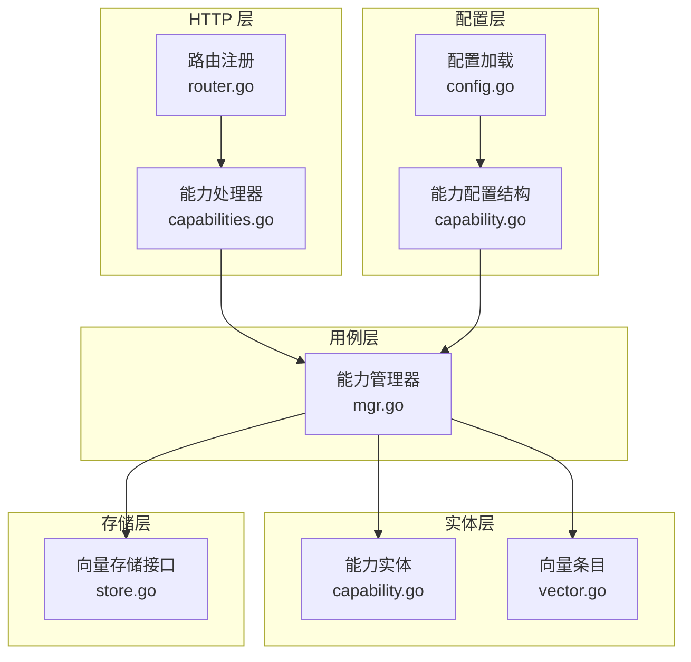
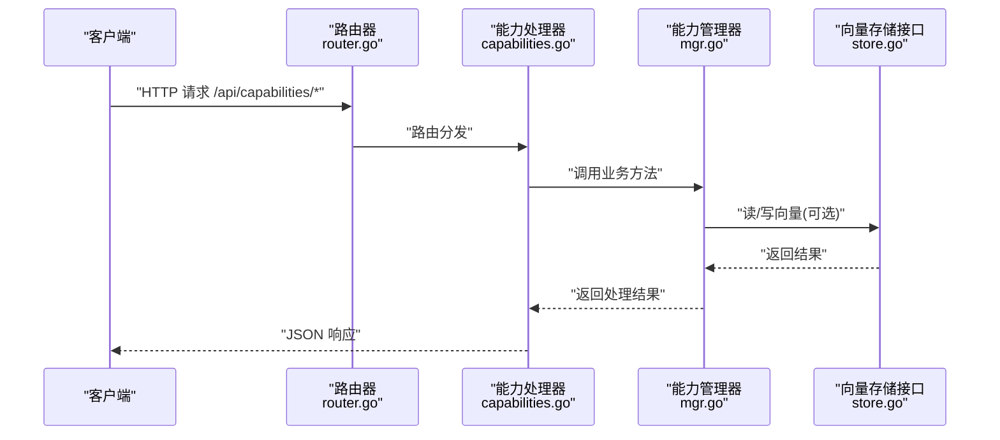
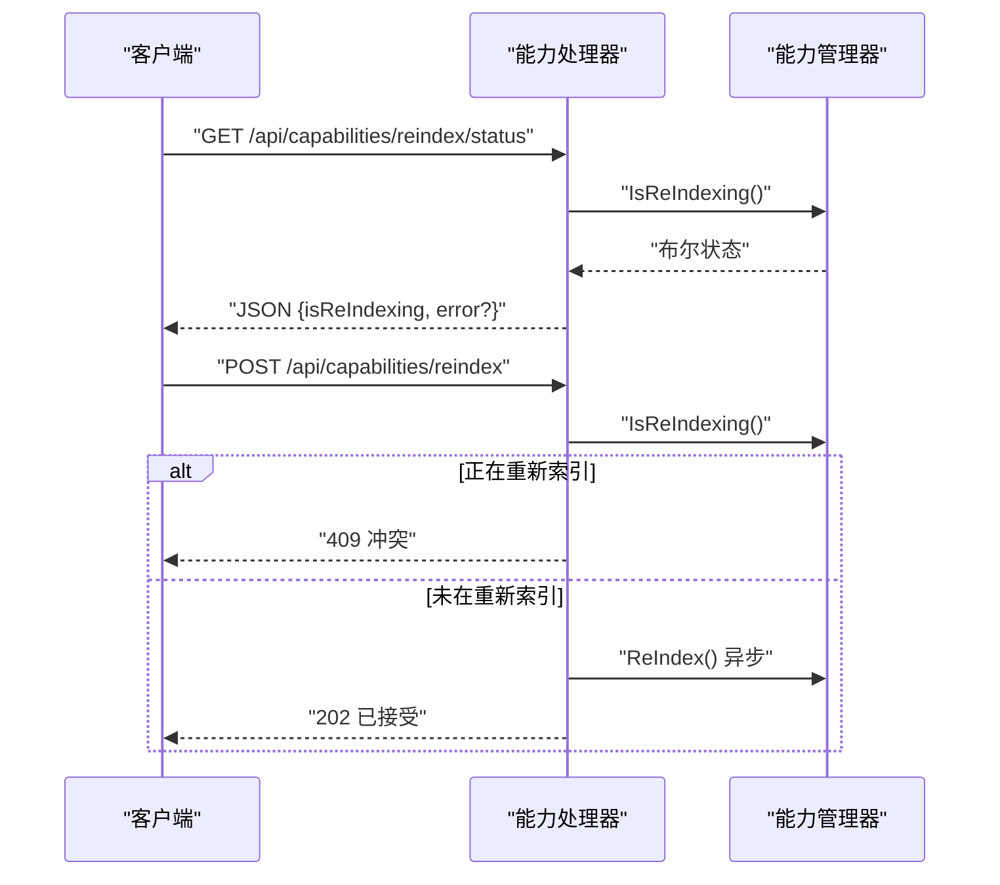
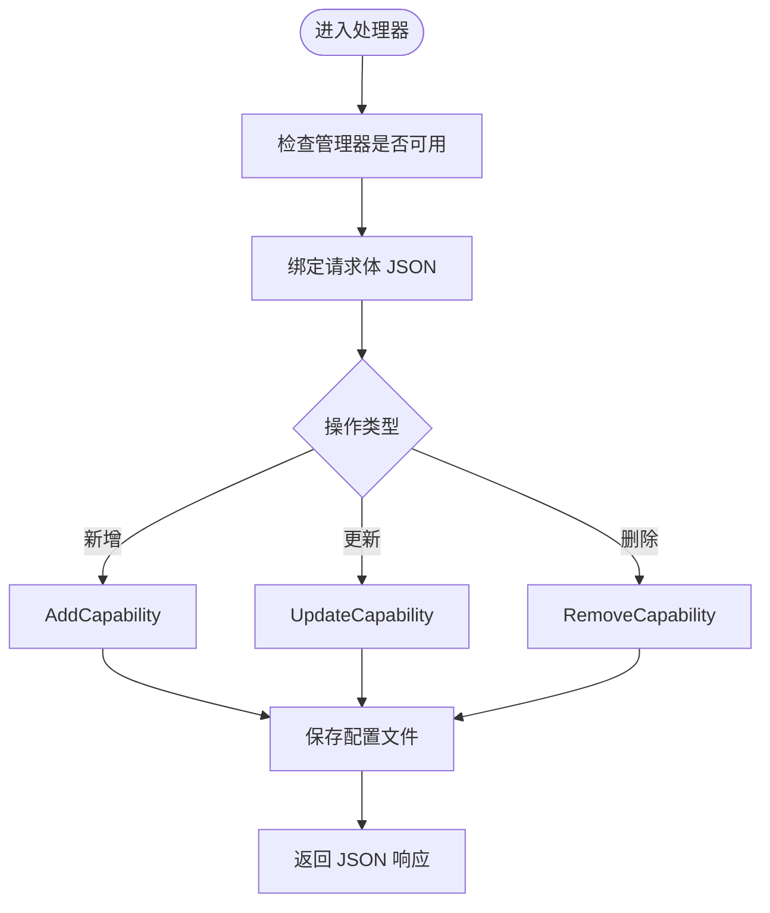
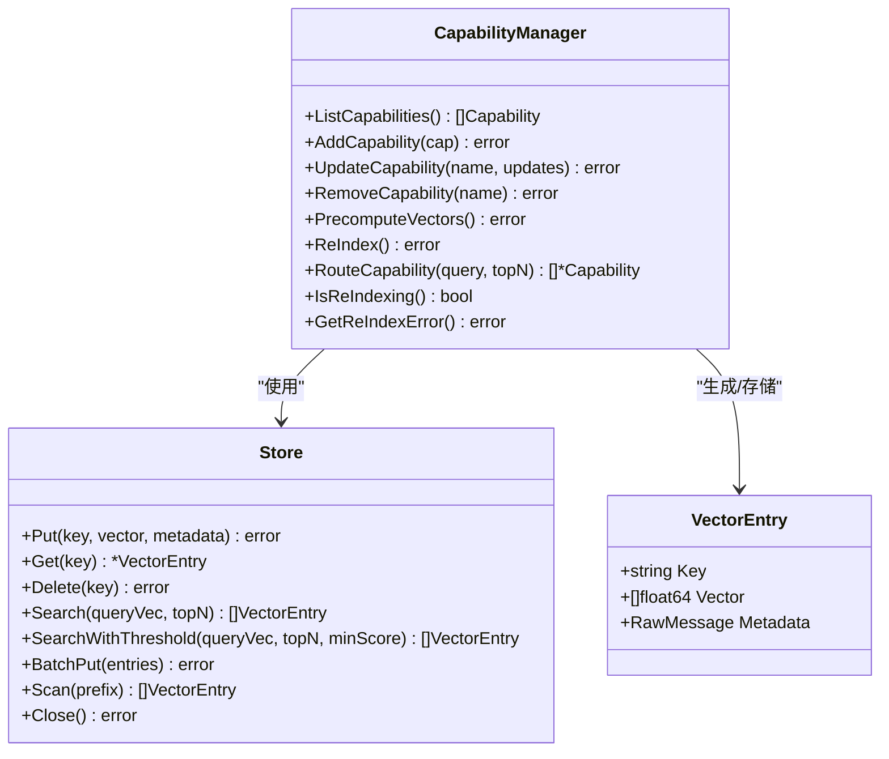
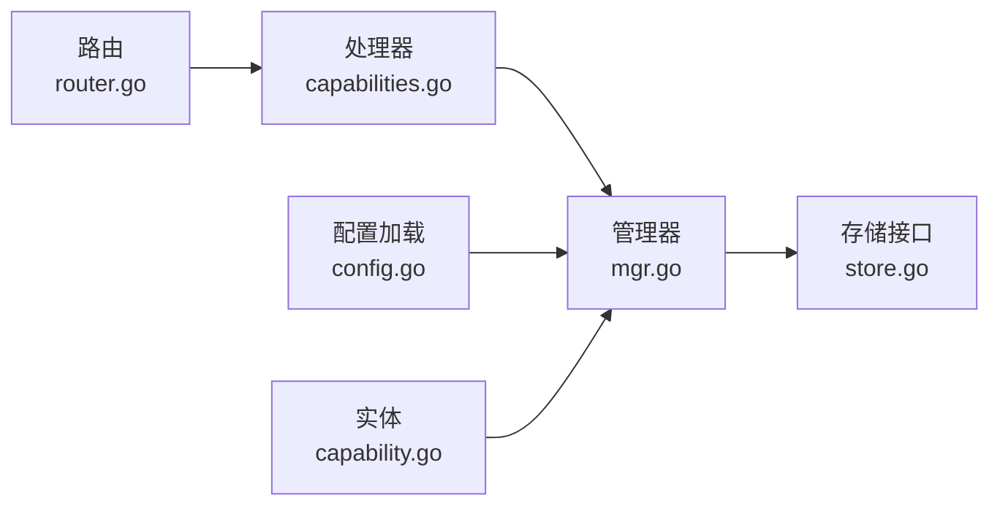

# 能力管理

<cite>
**本文引用的文件**
- [capabilities.go](file://internal/adapters/http/handlers/capabilities.go)
- [router.go](file://internal/adapters/http/handlers/router.go)
- [capability.go](file://internal/entity/capability.go)
- [mgr.go](file://internal/usecase/capability/mgr.go)
- [capability.go](file://internal/config/capability.go)
- [store.go](file://internal/core/store.go)
- [vector.go](file://internal/entity/vector.go)
- [config.go](file://internal/config/config.go)
- [Capabilities.tsx](file://dashboard/src/components/Capabilities.tsx)
</cite>

## 目录
1. [简介](#简介)
2. [项目结构](#项目结构)
3. [核心组件](#核心组件)
4. [架构总览](#架构总览)
5. [详细组件分析](#详细组件分析)
6. [依赖关系分析](#依赖关系分析)
7. [性能考虑](#性能考虑)
8. [故障排查指南](#故障排查指南)
9. [结论](#结论)
10. [附录](#附录)

## 简介
本文件为 MindX 能力管理接口的详细 API 文档，覆盖 /api/capabilities 系列端点，包括能力列表查询、重新索引状态查询与触发、新增/更新/删除能力等操作。文档同时阐述能力配置参数、索引机制、与技能的关系、以及性能优化策略与最佳实践。

## 项目结构
能力管理相关代码主要分布在以下层次：
- HTTP 层：路由注册与控制器，负责对外暴露 /api/capabilities 端点
- 用例层：能力管理器，负责能力的增删改查、向量化索引与路由
- 实体层：能力数据结构定义
- 配置层：能力配置结构与加载逻辑
- 存储层：向量存储接口与实体

图表来源
- [router.go](file://internal/adapters/http/handlers/router.go#L81-L91)
- [capabilities.go](file://internal/adapters/http/handlers/capabilities.go#L12-L20)
- [mgr.go](file://internal/usecase/capability/mgr.go#L16-L28)
- [capability.go](file://internal/entity/capability.go#L3-L15)
- [capability.go](file://internal/config/capability.go#L3-L28)
- [store.go](file://internal/core/store.go#L5-L15)
- [vector.go](file://internal/entity/vector.go#L5-L10)
- [config.go](file://internal/config/config.go#L124-L162)

章节来源
- [router.go](file://internal/adapters/http/handlers/router.go#L81-L91)
- [capabilities.go](file://internal/adapters/http/handlers/capabilities.go#L12-L20)
- [mgr.go](file://internal/usecase/capability/mgr.go#L16-L28)
- [capability.go](file://internal/entity/capability.go#L3-L15)
- [capability.go](file://internal/config/capability.go#L3-L28)
- [store.go](file://internal/core/store.go#L5-L15)
- [vector.go](file://internal/entity/vector.go#L5-L10)
- [config.go](file://internal/config/config.go#L124-L162)

## 核心组件
- 能力实体：包含能力标识、标题、图标、描述、模型、系统提示词、工具集、模态、启用状态及向量等字段
- 能力管理器：负责能力的增删改查、客户端初始化、向量化预计算与重新索引、路由能力
- 能力处理器：HTTP 控制器，对接 /api/capabilities 端点
- 路由注册：将能力相关路由挂载到 /api/capabilities 下
- 配置结构：支持 capabilities.yml 的加载与保存，包含默认能力与回退策略
- 向量存储接口：抽象向量的增删查、批量写入与扫描

章节来源
- [capability.go](file://internal/entity/capability.go#L3-L15)
- [mgr.go](file://internal/usecase/capability/mgr.go#L16-L28)
- [capabilities.go](file://internal/adapters/http/handlers/capabilities.go#L12-L20)
- [router.go](file://internal/adapters/http/handlers/router.go#L81-L91)
- [capability.go](file://internal/config/capability.go#L3-L28)
- [store.go](file://internal/core/store.go#L5-L15)

## 架构总览
能力管理的请求处理链路如下：
- 客户端通过 HTTP 请求访问 /api/capabilities 下的端点
- 路由器将请求分发给能力处理器
- 处理器调用能力管理器执行业务逻辑
- 能力管理器与向量存储交互，必要时调用嵌入服务生成向量
- 返回标准化的 JSON 响应

图表来源
- [router.go](file://internal/adapters/http/handlers/router.go#L81-L91)
- [capabilities.go](file://internal/adapters/http/handlers/capabilities.go#L22-L140)
- [mgr.go](file://internal/usecase/capability/mgr.go#L199-L338)
- [store.go](file://internal/core/store.go#L5-L15)

## 详细组件分析

### HTTP 端点定义与参数
- 路径前缀：/api/capabilities
- 路由注册位置：见“路由注册”小节

端点一览
- GET /api/capabilities
  - 功能：列出所有能力
  - 查询参数：无
  - 请求体：无
  - 成功响应：包含 capabilities 数组与 count 字段
  - 典型状态码：200
  - 参考实现：[capabilities.go](file://internal/adapters/http/handlers/capabilities.go#L22-L34)

- GET /api/capabilities/reindex/status
  - 功能：查询能力向量重新索引状态
  - 查询参数：无
  - 请求体：无
  - 成功响应：isReIndexing 布尔值；若发生错误则包含 error 字段
  - 典型状态码：200
  - 参考实现：[capabilities.go](file://internal/adapters/http/handlers/capabilities.go#L102-L119)

- POST /api/capabilities/reindex
  - 功能：触发能力向量重新索引（异步）
  - 查询参数：无
  - 请求体：无
  - 成功响应：message 字段表示已接受
  - 冲突响应：当正在重新索引时返回 409
  - 典型状态码：202 或 409
  - 参考实现：[capabilities.go](file://internal/adapters/http/handlers/capabilities.go#L122-L139)

- POST /api/capabilities
  - 功能：新增能力
  - 查询参数：无
  - 请求体：能力对象 JSON（见“能力配置参数”）
  - 成功响应：message 字段表示成功
  - 典型状态码：201 或 400
  - 参考实现：[capabilities.go](file://internal/adapters/http/handlers/capabilities.go#L36-L54)

- PUT /api/capabilities
  - 功能：更新能力
  - 查询参数：name（必填）
  - 请求体：能力对象 JSON（仅需提供需要更新的字段）
  - 成功响应：message 字段表示成功
  - 典型状态码：200 或 400
  - 参考实现：[capabilities.go](file://internal/adapters/http/handlers/capabilities.go#L56-L79)

- DELETE /api/capabilities
  - 功能：删除能力
  - 查询参数：name（必填）
  - 请求体：无
  - 成功响应：message 字段表示成功
  - 典型状态码：200 或 404
  - 参考实现：[capabilities.go](file://internal/adapters/http/handlers/capabilities.go#L82-L99)

章节来源
- [capabilities.go](file://internal/adapters/http/handlers/capabilities.go#L22-L140)
- [router.go](file://internal/adapters/http/handlers/router.go#L81-L91)

### 能力配置参数
能力实体字段说明（JSON 字段名与含义）：
- name：能力唯一标识（字符串）
- title：能力显示标题（字符串）
- icon：能力图标标识（字符串）
- description：能力描述（字符串）
- model：所使用的模型名称（字符串）
- system_prompt：系统提示词（字符串）
- tools：可用工具名称数组（字符串数组）
- modality：模态类型数组（字符串数组）
- enabled：是否启用（布尔）
- vector：向量（浮点数组，可选）

章节来源
- [capability.go](file://internal/entity/capability.go#L3-L15)

### 索引状态查询与操作流程
- 状态查询：GET /api/capabilities/reindex/status
  - 返回 isReIndexing 表示是否正在重新索引
  - 若有错误，返回 error 字段
- 触发重新索引：POST /api/capabilities/reindex
  - 若正在重新索引，返回 409
  - 否则以异步方式启动 ReIndex 流程，返回 202

图表来源
- [capabilities.go](file://internal/adapters/http/handlers/capabilities.go#L102-L139)
- [mgr.go](file://internal/usecase/capability/mgr.go#L526-L538)
- [mgr.go](file://internal/usecase/capability/mgr.go#L476-L524)

章节来源
- [capabilities.go](file://internal/adapters/http/handlers/capabilities.go#L102-L139)
- [mgr.go](file://internal/usecase/capability/mgr.go#L526-L538)
- [mgr.go](file://internal/usecase/capability/mgr.go#L476-L524)

### 能力 CRUD 操作流程
- 新增能力：POST /api/capabilities
  - 校验请求体 JSON
  - 调用 AddCapability，内部进行互斥锁保护与配置持久化
- 更新能力：PUT /api/capabilities?name=...
  - 校验 name 参数
  - 校验请求体 JSON
  - 调用 UpdateCapability，按需更新字段并重初始化客户端
- 删除能力：DELETE /api/capabilities?name=...
  - 校验 name 参数
  - 调用 RemoveCapability，移除映射与客户端

图表来源
- [capabilities.go](file://internal/adapters/http/handlers/capabilities.go#L36-L99)
- [mgr.go](file://internal/usecase/capability/mgr.go#L274-L338)
- [mgr.go](file://internal/usecase/capability/mgr.go#L145-L172)

章节来源
- [capabilities.go](file://internal/adapters/http/handlers/capabilities.go#L36-L99)
- [mgr.go](file://internal/usecase/capability/mgr.go#L274-L338)
- [mgr.go](file://internal/usecase/capability/mgr.go#L145-L172)

### 能力与技能的关系
- 能力与技能均采用向量检索与路由机制
- 能力管理器提供基于系统提示词与描述的向量路由
- 技能管理器提供基于关键词与描述的向量路由
- 两者共享相似的向量化与存储模式，但检索目标不同

章节来源
- [mgr.go](file://internal/usecase/capability/mgr.go#L422-L458)
- [indexer.go](file://internal/usecase/skills/indexer.go#L116-L176)

### 索引机制与向量存储
- 预计算向量：PrecomputeVectors 将每个能力的描述与系统提示词拼接后生成向量，并批量写入存储
- 重新索引：ReIndex 重新生成所有能力向量并写入存储，期间维护 isReIndexing 与 reIndexError 状态
- 路由能力：RouteCapability 接收查询文本，生成查询向量并在存储中检索，返回匹配的能力集合
- 存储接口：Store 提供 Put、Get、Delete、Search、SearchWithThreshold、BatchPut、Scan、Close 等方法

图表来源
- [mgr.go](file://internal/usecase/capability/mgr.go#L16-L28)
- [mgr.go](file://internal/usecase/capability/mgr.go#L389-L420)
- [mgr.go](file://internal/usecase/capability/mgr.go#L476-L524)
- [mgr.go](file://internal/usecase/capability/mgr.go#L422-L458)
- [store.go](file://internal/core/store.go#L5-L15)
- [vector.go](file://internal/entity/vector.go#L5-L10)

章节来源
- [mgr.go](file://internal/usecase/capability/mgr.go#L389-L420)
- [mgr.go](file://internal/usecase/capability/mgr.go#L476-L524)
- [mgr.go](file://internal/usecase/capability/mgr.go#L422-L458)
- [store.go](file://internal/core/store.go#L5-L15)
- [vector.go](file://internal/entity/vector.go#L5-L10)

### 配置示例与最佳实践
- 配置文件：capabilities.yml
  - 支持从工作区加载或模板复制生成
  - 包含 capabilities 数组、default_capability、fallback_to_local 等字段
- 最佳实践：
  - 在修改能力配置后，建议触发重新索引以确保向量一致性
  - 启用能力时确保对应模型配置正确且可用
  - 对于大规模能力列表，优先启用必要的能力以减少向量计算与存储开销
  - 使用异步重新索引避免阻塞请求

章节来源
- [config.go](file://internal/config/config.go#L124-L162)
- [capability.go](file://internal/config/capability.go#L3-L28)
- [mgr.go](file://internal/usecase/capability/mgr.go#L31-L120)

## 依赖关系分析
- 路由到处理器：/api/capabilities 下的所有端点均由能力处理器统一处理
- 处理器到管理器：所有业务逻辑委托给能力管理器
- 管理器到存储：向量的读写依赖向量存储接口
- 配置到管理器：能力配置通过配置加载模块注入到管理器

图表来源
- [router.go](file://internal/adapters/http/handlers/router.go#L81-L91)
- [capabilities.go](file://internal/adapters/http/handlers/capabilities.go#L12-L20)
- [mgr.go](file://internal/usecase/capability/mgr.go#L16-L28)
- [store.go](file://internal/core/store.go#L5-L15)
- [config.go](file://internal/config/config.go#L124-L162)
- [capability.go](file://internal/entity/capability.go#L3-L15)

章节来源
- [router.go](file://internal/adapters/http/handlers/router.go#L81-L91)
- [capabilities.go](file://internal/adapters/http/handlers/capabilities.go#L12-L20)
- [mgr.go](file://internal/usecase/capability/mgr.go#L16-L28)
- [store.go](file://internal/core/store.go#L5-L15)
- [config.go](file://internal/config/config.go#L124-L162)
- [capability.go](file://internal/entity/capability.go#L3-L15)

## 性能考虑
- 并发安全：管理器内部使用互斥锁保护配置与客户端的变更，避免竞态
- 异步重新索引：重新索引在后台 goroutine 执行，不阻塞请求
- 向量批量写入：预计算与重新索引使用 BatchPut 减少存储往返
- 路由降级：当嵌入服务不可用时，路由能力返回空结果，避免崩溃
- 缓存与阈值：向量存储接口提供带阈值的搜索方法，便于后续扩展

章节来源
- [mgr.go](file://internal/usecase/capability/mgr.go#L25-L28)
- [mgr.go](file://internal/usecase/capability/mgr.go#L540-L547)
- [mgr.go](file://internal/usecase/capability/mgr.go#L413-L417)
- [mgr.go](file://internal/usecase/capability/mgr.go#L424-L435)
- [store.go](file://internal/core/store.go#L5-L15)

## 故障排查指南
- 管理器不可用：处理器在管理器为空时返回 503
- 缺少参数：更新/删除能力时缺少 name 参数返回 400
- 能力不存在：更新/删除能力时返回 404
- 正在重新索引：再次触发重新索引返回 409
- 配置验证失败：配置中能力名称重复、模型或系统提示词缺失、默认能力不在列表中等情况
- 向量化服务未设置：预计算/重新索引时返回错误

章节来源
- [capabilities.go](file://internal/adapters/http/handlers/capabilities.go#L23-L25)
- [capabilities.go](file://internal/adapters/http/handlers/capabilities.go#L62-L66)
- [capabilities.go](file://internal/adapters/http/handlers/capabilities.go#L88-L92)
- [capabilities.go](file://internal/adapters/http/handlers/capabilities.go#L128-L131)
- [mgr.go](file://internal/usecase/capability/mgr.go#L340-L382)
- [mgr.go](file://internal/usecase/capability/mgr.go#L489-L494)

## 结论
MindX 的能力管理接口提供了完整的 CRUD 与向量索引能力，结合异步重新索引与并发安全机制，能够满足动态能力配置与智能路由的需求。通过规范的配置与最佳实践，可在保证性能的同时提升系统的可维护性与扩展性。

## 附录

### 端点一览表
- GET /api/capabilities：列出能力
- GET /api/capabilities/reindex/status：查询重新索引状态
- POST /api/capabilities/reindex：触发重新索引
- POST /api/capabilities：新增能力
- PUT /api/capabilities?name=...：更新能力
- DELETE /api/capabilities?name=...：删除能力

章节来源
- [router.go](file://internal/adapters/http/handlers/router.go#L81-L91)
- [capabilities.go](file://internal/adapters/http/handlers/capabilities.go#L22-L140)

### 前端集成参考
- 前端组件通过 /api/config/capabilities 读取与保存能力配置
- 支持刷新、切换启用状态、删除、更新系统提示词与添加能力

章节来源
- [Capabilities.tsx](file://dashboard/src/components/Capabilities.tsx#L56-L97)