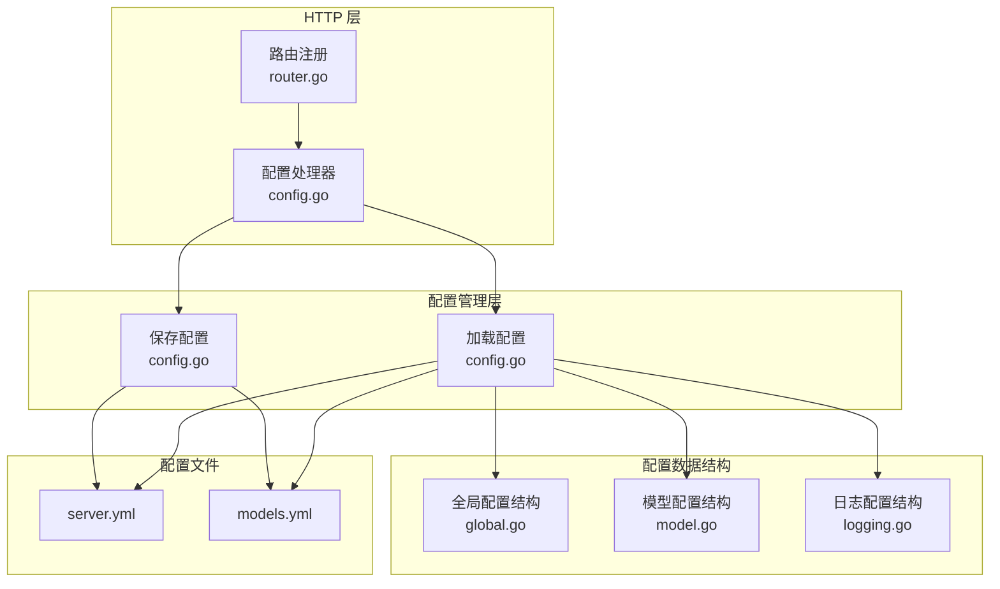
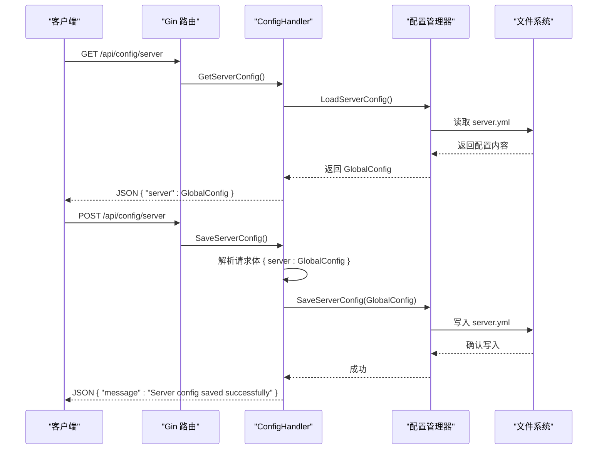
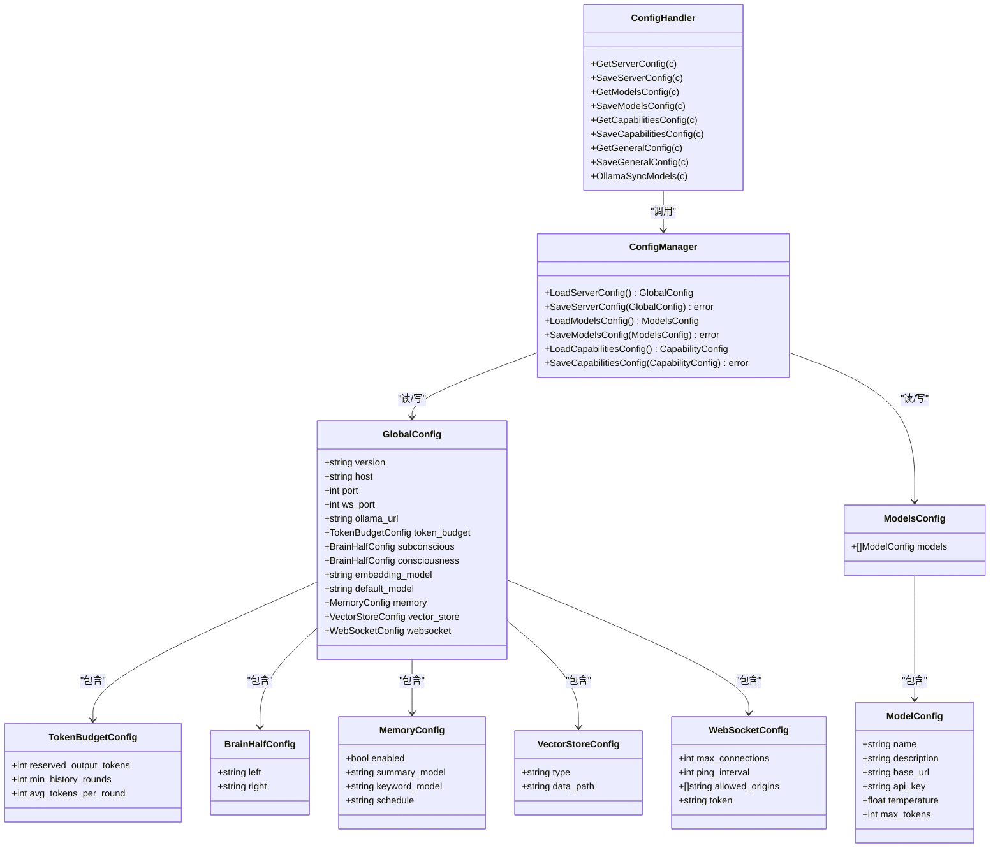

# 服务器配置接口

<cite>
**本文引用的文件**
- [config.go](file://internal/adapters/http/handlers/config.go)
- [router.go](file://internal/adapters/http/handlers/router.go)
- [config.go](file://internal/config/config.go)
- [global.go](file://internal/config/global.go)
- [model.go](file://internal/config/model.go)
- [server.yml](file://config/server.yml)
- [models.yml](file://config/models.yml)
- [logging.go](file://internal/config/logging.go)
</cite>

## 目录
1. [简介](#简介)
2. [项目结构](#项目结构)
3. [核心组件](#核心组件)
4. [架构概览](#架构概览)
5. [详细组件分析](#详细组件分析)
6. [依赖关系分析](#依赖关系分析)
7. [性能考量](#性能考量)
8. [故障排除指南](#故障排除指南)
9. [结论](#结论)

## 简介
本文档详细说明 MindX 服务器配置接口，重点覆盖 /api/config/server 端点的 GET 和 POST 功能。该接口允许获取当前服务器配置（包括主机地址、端口、Ollama URL、日志级别等）以及保存新的配置设置。文档还提供了完整的配置项说明、请求/响应格式、验证规则、默认值处理和配置热更新机制的说明。

## 项目结构
MindX 的配置接口位于 HTTP 处理器层，通过 Gin 框架注册路由，并由配置管理模块负责读写 YAML 配置文件。关键文件分布如下：
- HTTP 路由与处理器：internal/adapters/http/handlers/router.go, internal/adapters/http/handlers/config.go
- 配置加载与保存：internal/config/config.go
- 配置数据结构：internal/config/global.go, internal/config/model.go, internal/config/logging.go
- 示例配置文件：config/server.yml, config/models.yml

图表来源
- [router.go](file://internal/adapters/http/handlers/router.go#L113-L114)
- [config.go](file://internal/adapters/http/handlers/config.go#L19-L43)
- [config.go](file://internal/config/config.go#L39-L82)
- [global.go](file://internal/config/global.go#L3-L17)
- [model.go](file://internal/config/model.go#L3-L22)
- [logging.go](file://internal/config/logging.go#L15-L44)

章节来源
- [router.go](file://internal/adapters/http/handlers/router.go#L113-L114)
- [config.go](file://internal/adapters/http/handlers/config.go#L19-L43)
- [config.go](file://internal/config/config.go#L39-L82)

## 核心组件
本节概述 /api/config/server 接口的核心组件及其职责：
- 路由注册：在 /api 分组下注册 GET /config/server 和 POST /config/server 路由
- 处理器方法：
  - GetServerConfig：从配置文件加载服务器配置并返回
  - SaveServerConfig：接收请求体中的服务器配置并保存到配置文件
- 配置加载与保存：
  - LoadServerConfig：查找工作区配置目录下的 server.yml，若不存在则复制安装模板并重载
  - SaveServerConfig：将传入的配置写回 server.yml

章节来源
- [router.go](file://internal/adapters/http/handlers/router.go#L113-L114)
- [config.go](file://internal/adapters/http/handlers/config.go#L19-L43)
- [config.go](file://internal/config/config.go#L39-L82)

## 架构概览
GET /api/config/server 与 POST /api/config/server 的调用流程如下：

图表来源
- [router.go](file://internal/adapters/http/handlers/router.go#L113-L114)
- [config.go](file://internal/adapters/http/handlers/config.go#L19-L43)
- [config.go](file://internal/config/config.go#L39-L82)

## 详细组件分析

### GET /api/config/server
- 功能：返回当前服务器配置对象
- 请求参数：无
- 响应体：
  - server: GlobalConfig 对象，包含以下字段
- 错误处理：
  - 配置加载失败：返回 500 和错误信息
- 响应示例（结构示意）：
  - {
      "server": {
        "version": "0.0.1",
        "host": "localhost",
        "port": 911,
        "ws_port": 1314,
        "ollama_url": "http://localhost:11434",
        "token_budget": {
          "reserved_output_tokens": 8192,
          "min_history_rounds": 5,
          "avg_tokens_per_round": 200
        },
        "subconscious": {
          "left": "qwen3:0.6b",
          "right": "qwen3:0.6b"
        },
        "consciousness": {
          "left": "qwen3:0.6b",
          "right": "qwen3:1.7b"
        },
        "embedding_model": "qllama/bge-small-zh-v1.5:latest",
        "default_model": "qwen3:0.6b",
        "memory": {
          "enabled": true,
          "summary_model": "glm4:7b",
          "keyword_model": "glm4:7b",
          "schedule": "0 0 * * *"
        },
        "vector_store": {
          "type": "badger",
          "data_path": "./data/vectors"
        },
        "websocket": {
          "max_connections": 1000,
          "ping_interval": 30,
          "allowed_origins": ["*"],
          "token": ""
        }
      }
    }

章节来源
- [config.go](file://internal/adapters/http/handlers/config.go#L19-L26)
- [config.go](file://internal/config/config.go#L39-L82)
- [global.go](file://internal/config/global.go#L3-L17)
- [server.yml](file://config/server.yml#L1-L21)

### POST /api/config/server
- 功能：保存服务器配置
- 请求体：
  - server: GlobalConfig 对象，字段与 GET 响应相同
- 验证规则：
  - 请求体必须为有效的 JSON
  - server 字段必须为 GlobalConfig 结构
- 错误处理：
  - 请求体解析失败：返回 400 和错误信息
  - 保存失败：返回 500 和错误信息
- 成功响应：
  - JSON { "message": "Server config saved successfully" }

章节来源
- [config.go](file://internal/adapters/http/handlers/config.go#L28-L43)
- [config.go](file://internal/config/config.go#L215-L231)
- [global.go](file://internal/config/global.go#L3-L17)

### 配置项详细说明

#### 全局配置结构（GlobalConfig）
- version: 配置文件版本号
- host: 服务器监听的主机地址
- port: HTTP 服务端口
- ws_port: WebSocket 服务端口
- ollama_url: Ollama 服务地址（可选）
- token_budget: 令牌预算配置
- subconscious: 左右脑半球模型配置
- consciousness: 左右脑半球模型配置
- embedding_model: 嵌入模型名称
- default_model: 默认使用的模型名称
- memory: 记忆相关配置（可选）
- vector_store: 向量存储配置
- websocket: WebSocket 连接配置（可选）

章节来源
- [global.go](file://internal/config/global.go#L3-L17)
- [server.yml](file://config/server.yml#L1-L21)

#### 令牌预算配置（TokenBudgetConfig）
- reserved_output_tokens: 预留输出令牌数
- min_history_rounds: 最小历史对话轮数
- avg_tokens_per_round: 单轮对话平均令牌数

章节来源
- [model.go](file://internal/config/model.go#L24-L28)
- [server.yml](file://config/server.yml#L8-L11)

#### 脑半球配置（BrainHalfConfig）
- left: 左侧模型名称
- right: 右侧模型名称

章节来源
- [global.go](file://internal/config/global.go#L26-L29)
- [server.yml](file://config/server.yml#L12-L17)

#### 记忆配置（MemoryConfig）
- enabled: 是否启用记忆
- summary_model: 摘要模型名称
- keyword_model: 关键词模型名称
- schedule: 记忆维护计划任务表达式

章节来源
- [global.go](file://internal/config/global.go#L31-L36)

#### 向量存储配置（VectorStoreConfig）
- type: 存储类型（如 badger）
- data_path: 数据路径

章节来源
- [global.go](file://internal/config/global.go#L38-L41)
- [server.yml](file://config/server.yml#L6-L7)

#### WebSocket 配置（WebSocketConfig）
- max_connections: 最大连接数
- ping_interval: 心跳间隔（秒）
- allowed_origins: 允许的源列表
- token: 访问令牌（可选）

章节来源
- [global.go](file://internal/config/global.go#L19-L24)

#### 日志级别（LogLevel）
- 支持级别：debug, info, warn, error, fatal

章节来源
- [logging.go](file://internal/config/logging.go#L3-L12)

### 配置验证规则
- 请求体绑定：
  - 使用 Gin 的 ShouldBindJSON 对请求体进行绑定
  - 若绑定失败，返回 400 并包含错误信息
- 配置文件存在性：
  - LoadServerConfig 优先读取工作区 config 目录下的 server.yml
  - 若不存在，则尝试复制安装模板 server.yaml.template 到工作区并重载
- 字段完整性：
  - 通过 Viper 的 Unmarshal 将 YAML 解析为 GlobalConfig 结构
  - 未提供的字段按 Go 结构体默认值处理（如整型为 0、字符串为空、布尔为 false）

章节来源
- [config.go](file://internal/adapters/http/handlers/config.go#L28-L43)
- [config.go](file://internal/config/config.go#L39-L82)

### 默认值处理
- 未在配置文件中显式设置的字段将采用 Go 结构体的零值：
  - 整数字段默认为 0
  - 字符串字段默认为空
  - 布尔字段默认为 false
  - 结构体字段默认为 nil 或空结构
- 示例：若未设置 ollama_url，则在结构体中为空字符串；GET 响应中不会包含该字段（omitempty）

章节来源
- [global.go](file://internal/config/global.go#L8)
- [config.go](file://internal/config/config.go#L39-L82)

### 配置热更新机制
- 文件写入即时生效：
  - SaveServerConfig 使用 Viper.WriteConfigAs 直接写回 server.yml
  - 重启服务后生效；运行时是否立即应用取决于具体实现
- 建议：
  - 在生产环境中，建议先备份配置文件再进行修改
  - 修改后重启服务以确保所有组件加载最新配置

章节来源
- [config.go](file://internal/config/config.go#L215-L231)

### 完整配置项示例
- 网络设置
  - host: "localhost"
  - port: 911
  - ws_port: 1314
  - ollama_url: "http://localhost:11434"
- 性能参数
  - token_budget.reserved_output_tokens: 8192
  - token_budget.min_history_rounds: 5
  - token_budget.avg_tokens_per_round: 200
- 调试选项
  - memory.enabled: true
  - memory.summary_model: "glm4:7b"
  - memory.keyword_model: "glm4:7b"
  - memory.schedule: "0 0 * * *"
- 向量存储
  - vector_store.type: "badger"
  - vector_store.data_path: "./data/vectors"
- WebSocket
  - websocket.max_connections: 1000
  - websocket.ping_interval: 30
  - websocket.allowed_origins: ["*"]

章节来源
- [server.yml](file://config/server.yml#L1-L21)
- [global.go](file://internal/config/global.go#L3-L17)

## 依赖关系分析

图表来源
- [config.go](file://internal/adapters/http/handlers/config.go#L13-L43)
- [config.go](file://internal/config/config.go#L39-L231)
- [global.go](file://internal/config/global.go#L3-L41)
- [model.go](file://internal/config/model.go#L3-L28)

章节来源
- [config.go](file://internal/adapters/http/handlers/config.go#L13-L43)
- [config.go](file://internal/config/config.go#L39-L231)
- [global.go](file://internal/config/global.go#L3-L41)
- [model.go](file://internal/config/model.go#L3-L28)

## 性能考量
- 配置文件读写：
  - 使用 Viper 进行 YAML 解析与写入，性能稳定
  - 写入操作为同步磁盘写入，建议避免频繁保存
- 配置缓存：
  - 当前实现每次请求都重新读取配置文件，适合小规模部署
  - 大规模部署可考虑在内存中缓存配置并在保存后刷新
- 并发访问：
  - 保存配置时建议加锁，避免并发写入导致的数据竞争

## 故障排除指南
- GET /api/config/server 返回 500：
  - 检查工作区 config 目录是否存在 server.yml
  - 确认 server.yml 格式正确且包含 server 节点
- POST /api/config/server 返回 400：
  - 检查请求体是否为合法 JSON
  - 确认 server 字段结构与 GlobalConfig 一致
- POST /api/config/server 返回 500：
  - 检查目标路径是否有写权限
  - 确认 server.yml 未被其他进程锁定

章节来源
- [config.go](file://internal/adapters/http/handlers/config.go#L19-L43)
- [config.go](file://internal/config/config.go#L39-L82)

## 结论
/api/config/server 接口提供了对 MindX 服务器配置的完整读写支持。通过清晰的配置结构、严格的请求体验证和可靠的文件写入机制，用户可以安全地管理服务器的网络、性能和调试相关参数。建议在生产环境中配合备份策略和最小权限原则，确保配置变更的安全与可追溯。