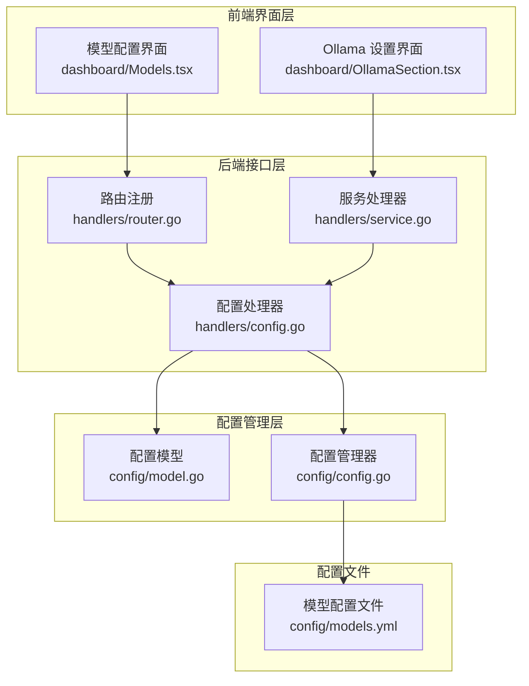
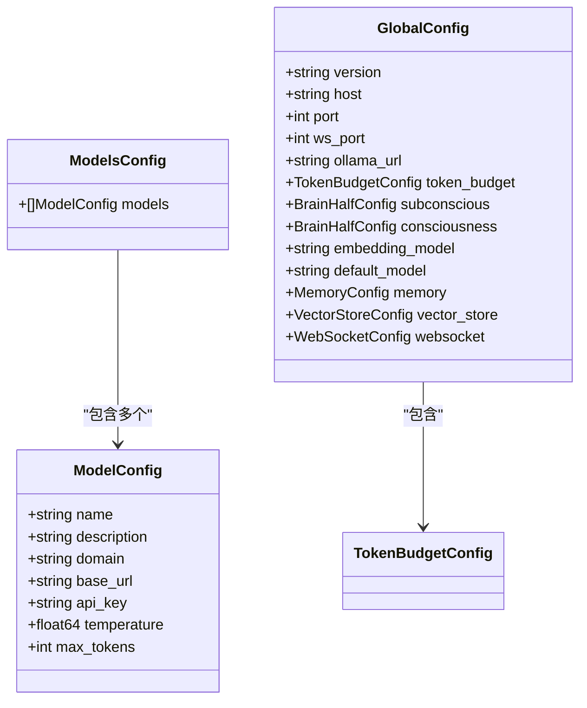
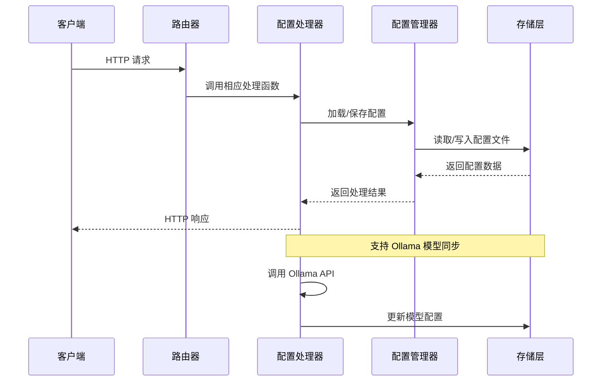
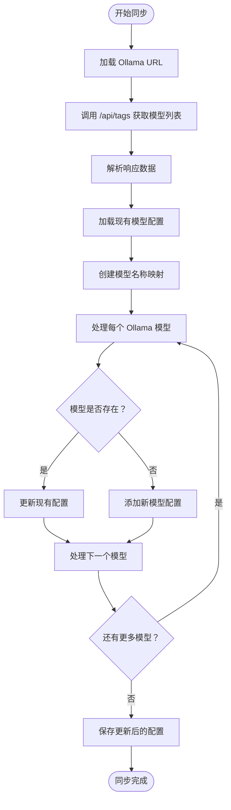
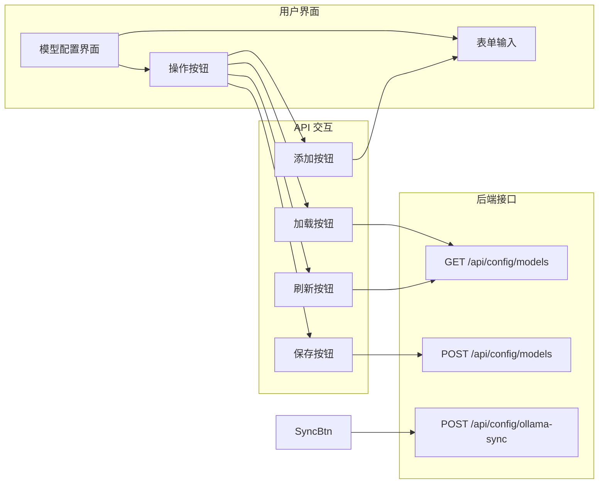
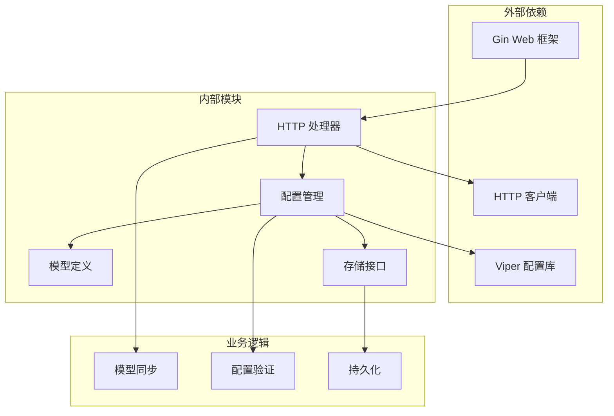

# 模型配置接口

<cite>
**本文档引用的文件**
- [internal/adapters/http/handlers/config.go](file://internal/adapters/http/handlers/config.go)
- [internal/adapters/http/handlers/router.go](file://internal/adapters/http/handlers/router.go)
- [internal/config/model.go](file://internal/config/model.go)
- [internal/config/config.go](file://internal/config/config.go)
- [config/models.yml](file://config/models.yml)
- [dashboard/src/components/Models.tsx](file://dashboard/src/components/Models.tsx)
- [dashboard/src/components/settings/OllamaSection.tsx](file://dashboard/src/components/settings/OllamaSection.tsx)
- [internal/adapters/http/handlers/service.go](file://internal/adapters/http/handlers/service.go)
</cite>

## 目录
1. [简介](#简介)
2. [项目结构](#项目结构)
3. [核心组件](#核心组件)
4. [架构概览](#架构概览)
5. [详细组件分析](#详细组件分析)
6. [依赖关系分析](#依赖关系分析)
7. [性能考虑](#性能考虑)
8. [故障排除指南](#故障排除指南)
9. [结论](#结论)

## 简介

MindX 模型配置接口提供了对 AI 模型配置的完整管理功能，包括模型列表查询、模型参数配置、以及与 Ollama 本地模型服务的同步功能。该接口支持多种模型提供商，包括本地 Ollama 模型和各种云端 AI 服务。

本接口主要通过以下端点提供服务：
- GET /api/config/models：获取当前模型配置列表
- POST /api/config/models：保存模型配置
- POST /api/config/ollama-sync：同步 Ollama 模型到配置

## 项目结构

模型配置相关的核心文件组织如下：



**图表来源**
- [internal/adapters/http/handlers/router.go](file://internal/adapters/http/handlers/router.go#L115-L119)
- [internal/adapters/http/handlers/config.go](file://internal/adapters/http/handlers/config.go#L13-L17)
- [internal/config/model.go](file://internal/config/model.go#L3-L22)

**章节来源**
- [internal/adapters/http/handlers/router.go](file://internal/adapters/http/handlers/router.go#L1-L150)
- [internal/adapters/http/handlers/config.go](file://internal/adapters/http/handlers/config.go#L1-L256)

## 核心组件

### 数据模型结构

模型配置采用统一的数据结构，支持多种配置字段：



**图表来源**
- [internal/config/model.go](file://internal/config/model.go#L3-L22)
- [internal/config/global.go](file://internal/config/global.go#L3-L17)

### 配置文件格式

系统支持 YAML 和 JSON 两种配置格式，模型配置文件示例：

| 字段名 | 类型 | 必需 | 描述 | 示例值 |
|--------|------|------|------|--------|
| name | string | 是 | 模型唯一标识符 | "qwen3:0.6b" |
| description | string | 否 | 模型描述信息 | "通义千问3 0.6b" |
| base_url | string | 是 | API 基础地址 | "http://localhost:11434/v1" |
| api_key | string | 否 | API 密钥 | "" |
| temperature | float64 | 否 | 采样温度 | 0.3 |
| max_tokens | int | 否 | 最大生成 tokens 数 | 40960 |

**章节来源**
- [internal/config/model.go](file://internal/config/model.go#L14-L22)
- [config/models.yml](file://config/models.yml#L1-L92)

## 架构概览

模型配置接口采用分层架构设计，确保了良好的可维护性和扩展性：



**图表来源**
- [internal/adapters/http/handlers/router.go](file://internal/adapters/http/handlers/router.go#L115-L119)
- [internal/adapters/http/handlers/config.go](file://internal/adapters/http/handlers/config.go#L45-L69)

## 详细组件分析

### GET /api/config/models 接口

该接口用于获取当前的模型配置列表，返回标准的 JSON 格式响应。

**请求格式**
- 方法：GET
- 路径：/api/config/models
- 认证：需要（基于应用的认证机制）

**响应格式**
```json
{
  "models": [
    {
      "name": "qwen3:0.6b",
      "description": "通义千问3 0.6b，体积小响应快,理解能力弱",
      "base_url": "http://localhost:11434/v1",
      "api_key": "",
      "temperature": 0.3,
      "max_tokens": 40960
    },
    {
      "name": "GLM-4-0520",
      "description": "智谱AI GLM-4，用于编程和技术任务",
      "base_url": "https://open.bigmodel.cn/api/paas/v4",
      "api_key": "",
      "temperature": 0.3,
      "max_tokens": 131072
    }
  ]
}
```

**错误处理**
- 500 Internal Server Error：配置文件加载失败时返回错误信息

**章节来源**
- [internal/adapters/http/handlers/config.go](file://internal/adapters/http/handlers/config.go#L45-L52)
- [internal/adapters/http/handlers/router.go](file://internal/adapters/http/handlers/router.go#L115-L116)

### POST /api/config/models 接口

该接口用于保存模型配置，支持批量更新模型参数。

**请求格式**
- 方法：POST
- 路径：/api/config/models
- Content-Type：application/json

**请求体结构**
```json
{
  "models": {
    "models": [
      {
        "name": "new-model",
        "description": "新模型描述",
        "base_url": "http://localhost:11434/v1",
        "api_key": "",
        "temperature": 0.7,
        "max_tokens": 8192
      }
    ]
  }
}
```

**响应格式**
```json
{
  "message": "Models config saved successfully"
}
```

**错误处理**
- 400 Bad Request：请求体绑定失败
- 500 Internal Server Error：配置保存失败

**章节来源**
- [internal/adapters/http/handlers/config.go](file://internal/adapters/http/handlers/config.go#L54-L69)
- [internal/adapters/http/handlers/router.go](file://internal/adapters/http/handlers/router.go#L116-L117)

### OllamaSyncModels 功能

Ollama 同步功能是模型配置接口的核心特性，实现了自动模型发现和配置更新。

#### 同步流程



**图表来源**
- [internal/adapters/http/handlers/config.go](file://internal/adapters/http/handlers/config.go#L157-L182)
- [internal/adapters/http/handlers/config.go](file://internal/adapters/http/handlers/config.go#L215-L255)

#### 同步策略

1. **模型发现**：从 Ollama API 获取所有可用模型
2. **配置合并**：将现有配置与新发现的模型进行合并
3. **智能更新**：仅更新现有模型的基础 URL，新增模型时添加默认配置
4. **持久化存储**：将更新后的配置保存到 models.yml 文件

**章节来源**
- [internal/adapters/http/handlers/config.go](file://internal/adapters/http/handlers/config.go#L157-L255)

### 前端集成

#### 模型配置界面

前端提供了直观的模型配置管理界面，支持实时编辑和保存：



**图表来源**
- [dashboard/src/components/Models.tsx](file://dashboard/src/components/Models.tsx#L14-L60)
- [dashboard/src/components/Models.tsx](file://dashboard/src/components/Models.tsx#L95-L117)

**章节来源**
- [dashboard/src/components/Models.tsx](file://dashboard/src/components/Models.tsx#L1-L261)

#### Ollama 集成界面

前端还提供了专门的 Ollama 集成界面，支持连接测试和模型同步：

**章节来源**
- [dashboard/src/components/settings/OllamaSection.tsx](file://dashboard/src/components/settings/OllamaSection.tsx#L1-L111)

## 依赖关系分析

模型配置接口的依赖关系清晰明确，遵循单一职责原则：



**图表来源**
- [internal/adapters/http/handlers/config.go](file://internal/adapters/http/handlers/config.go#L3-L11)
- [internal/config/config.go](file://internal/config/config.go#L3-L11)

**章节来源**
- [internal/adapters/http/handlers/config.go](file://internal/adapters/http/handlers/config.go#L1-L256)
- [internal/config/config.go](file://internal/config/config.go#L1-L294)

## 性能考虑

### 异步处理

- **Ollama API 调用**：使用 5 秒超时限制，避免阻塞主请求线程
- **配置文件读写**：采用异步文件操作，减少 I/O 等待时间
- **缓存策略**：配置变更后立即写入磁盘，确保数据一致性

### 错误恢复

- **重试机制**：网络请求失败时自动重试
- **降级策略**：配置加载失败时提供默认配置
- **监控告警**：异常情况及时记录日志并触发告警

## 故障排除指南

### 常见问题及解决方案

**问题1：Ollama 连接失败**
- 检查 Ollama 服务是否正常运行
- 验证 Ollama URL 配置是否正确
- 确认防火墙设置允许本地连接

**问题2：模型配置保存失败**
- 检查配置文件权限
- 验证 YAML 格式是否正确
- 确认磁盘空间充足

**问题3：同步功能异常**
- 查看 Ollama API 响应状态
- 检查网络连接稳定性
- 验证模型名称格式

**章节来源**
- [internal/adapters/http/handlers/service.go](file://internal/adapters/http/handlers/service.go#L74-L117)
- [internal/adapters/http/handlers/config.go](file://internal/adapters/http/handlers/config.go#L184-L213)

## 结论

MindX 模型配置接口提供了完整、灵活且易于使用的模型管理解决方案。通过标准化的数据结构、清晰的 API 设计和完善的错误处理机制，该接口能够满足从个人开发者到企业用户的各种需求。

关键优势包括：
- **多模型支持**：同时支持本地和云端模型提供商
- **自动化同步**：Ollama 模型自动发现和配置更新
- **用户友好**：提供直观的前端界面和丰富的配置选项
- **高可用性**：完善的错误处理和故障恢复机制

未来可以考虑的功能增强：
- 支持更多模型提供商
- 增加配置模板功能
- 提供配置导入导出工具
- 实现配置版本管理