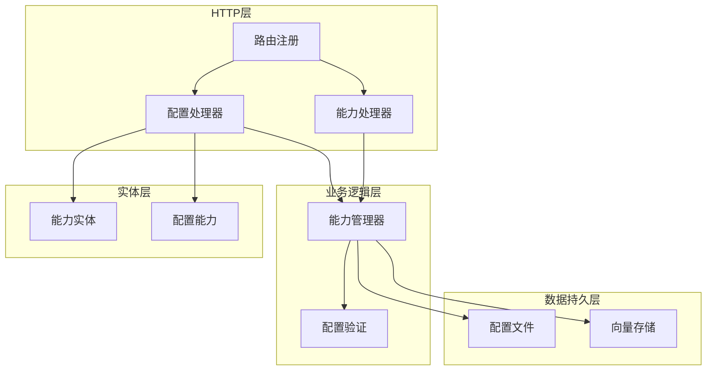
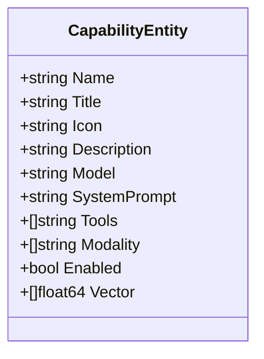
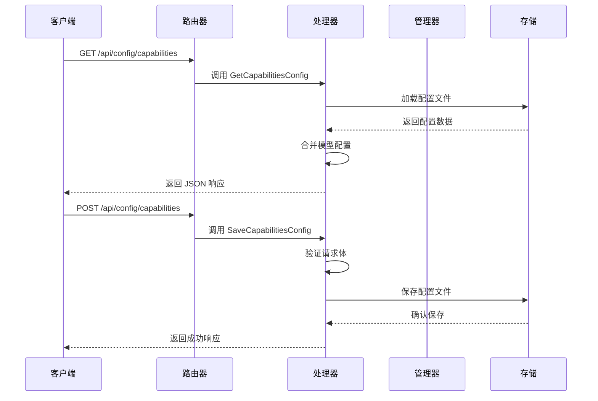
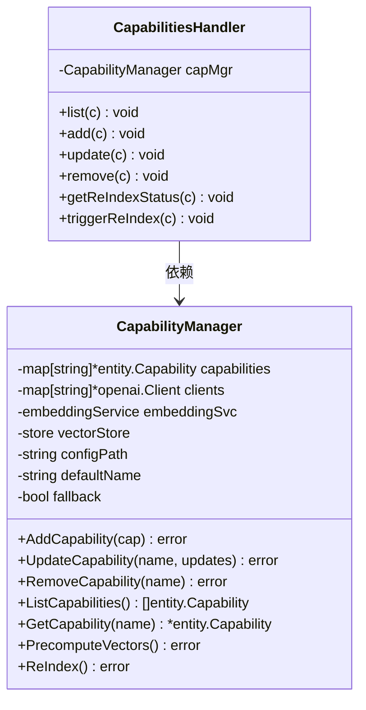
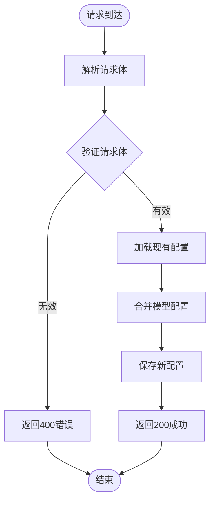
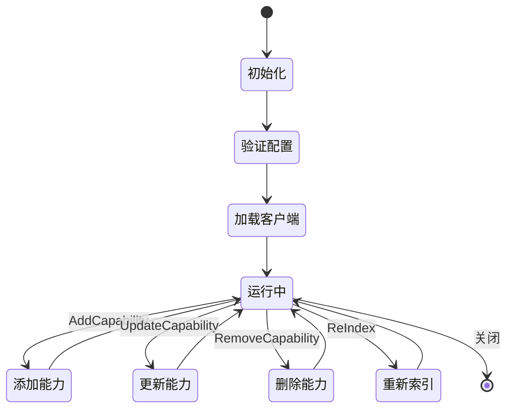
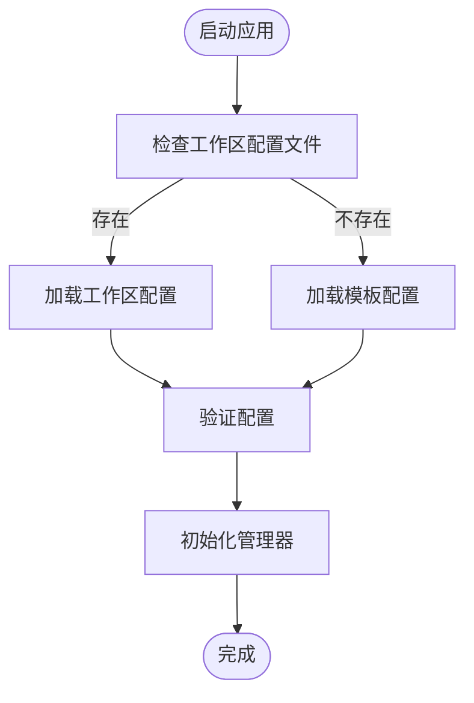
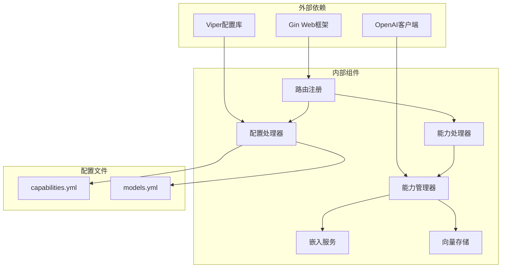
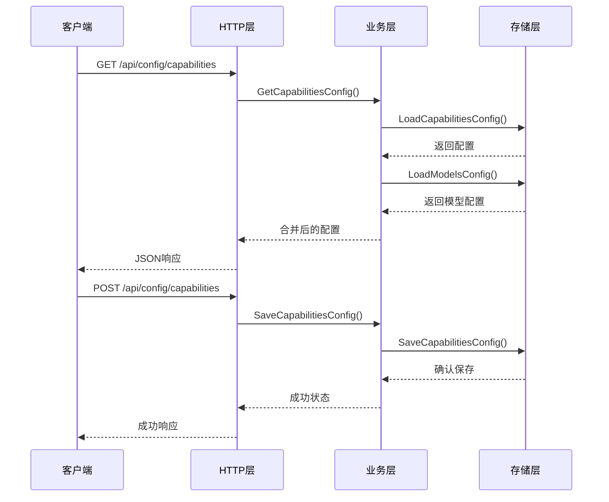

# 能力配置接口

<cite>
**本文档引用的文件**
- [capabilities.go](file://internal/adapters/http/handlers/capabilities.go)
- [router.go](file://internal/adapters/http/handlers/router.go)
- [config.go](file://internal/adapters/http/handlers/config.go)
- [capability.go](file://internal/config/capability.go)
- [capability.go](file://internal/entity/capability.go)
- [mgr.go](file://internal/usecase/capability/mgr.go)
- [config.go](file://internal/config/config.go)
- [models.yml](file://config/models.yml)
</cite>

## 目录
1. [简介](#简介)
2. [项目结构](#项目结构)
3. [核心组件](#核心组件)
4. [架构概览](#架构概览)
5. [详细组件分析](#详细组件分析)
6. [依赖关系分析](#依赖关系分析)
7. [性能考虑](#性能考虑)
8. [故障排除指南](#故障排除指南)
9. [结论](#结论)

## 简介

MindX 能力配置接口提供了对系统能力进行管理的完整 API，包括能力开关、权限控制、功能启用状态的获取和保存。该接口支持对渠道能力、技能能力和其他系统功能进行统一配置管理。

本接口主要包含两个核心端点：
- GET /api/config/capabilities：获取当前的能力配置
- POST /api/config/capabilities：保存新的能力配置

## 项目结构

能力配置接口在整个系统中的位置如下：



**图表来源**
- [router.go](file://internal/adapters/http/handlers/router.go#L81-L91)
- [config.go](file://internal/adapters/http/handlers/config.go#L13-L17)

**章节来源**
- [router.go](file://internal/adapters/http/handlers/router.go#L18-L149)

## 核心组件

### 能力配置数据结构

能力配置采用分层设计，包含实体层和配置层两种不同的数据结构：

#### 实体层能力结构


**图表来源**
- [capability.go](file://internal/entity/capability.go#L3-L15)

#### 配置层能力结构
```mermaid
classDiagram
class CapabilityConfig {
+string Name
+string Title
+string Icon
+string Description
+string Model
+string BaseURL
+string APIKey
+string SystemPrompt
+[]string Tools
+float64 Temperature
+int MaxTokens
+[]string Modality
+bool Enabled
+[]float64 Vector
+map[string]interface{} Extra
}
class CapabilityConfigStruct {
+[]CapabilityConfig Capabilities
+string DefaultCapability
+bool FallbackToLocal
+string Description
}
```

**图表来源**
- [capability.go](file://internal/config/capability.go#L3-L28)

**章节来源**
- [capability.go](file://internal/entity/capability.go#L1-L16)
- [capability.go](file://internal/config/capability.go#L1-L29)

## 架构概览

能力配置接口采用典型的三层架构模式：



**图表来源**
- [router.go](file://internal/adapters/http/handlers/router.go#L117-L118)
- [config.go](file://internal/adapters/http/handlers/config.go#L71-L104)

## 详细组件分析

### HTTP处理器组件

#### 能力处理器 (CapabilitiesHandler)
负责处理能力相关的HTTP请求，提供以下功能：
- 列出所有能力配置
- 添加新能力
- 更新现有能力
- 删除能力
- 重新索引能力向量



**图表来源**
- [capabilities.go](file://internal/adapters/http/handlers/capabilities.go#L12-L20)
- [mgr.go](file://internal/usecase/capability/mgr.go#L16-L28)

#### 配置处理器 (ConfigHandler)
专门处理配置相关的HTTP请求，包括能力配置的获取和保存：



**图表来源**
- [config.go](file://internal/adapters/http/handlers/config.go#L89-L104)

**章节来源**
- [capabilities.go](file://internal/adapters/http/handlers/capabilities.go#L1-L141)
- [config.go](file://internal/adapters/http/handlers/config.go#L1-L256)

### 能力管理器组件

#### 能力管理器 (CapabilityManager)
核心业务逻辑组件，负责能力配置的完整生命周期管理：



**图表来源**
- [mgr.go](file://internal/usecase/capability/mgr.go#L31-L120)
- [mgr.go](file://internal/usecase/capability/mgr.go#L274-L338)

#### 配置验证规则
能力配置具有严格的验证规则：

| 验证规则 | 描述 | 错误信息 |
|---------|------|----------|
| 能力数量 | 必须至少有一个能力 | "配置中未定义任何能力" |
| 能力名称唯一性 | 名称必须唯一且不为空 | "能力名称重复: {name}" |
| 模型名称必填 | 每个能力必须指定模型 | "能力 {name}: 模型名称为必需字段" |
| 系统提示词必填 | 每个能力必须有系统提示词 | "能力 {name}: 系统提示词为必需字段" |
| 默认能力存在性 | 如果设置了默认能力，必须存在于列表中 | "默认能力 '{default}' 不在能力列表中" |

**章节来源**
- [mgr.go](file://internal/usecase/capability/mgr.go#L340-L382)

### 配置文件管理

#### 配置文件加载机制
系统采用工作区优先的配置加载策略：



**图表来源**
- [config.go](file://internal/config/config.go#L124-L162)
- [mgr.go](file://internal/usecase/capability/mgr.go#L53-L89)

**章节来源**
- [config.go](file://internal/config/config.go#L1-L294)
- [mgr.go](file://internal/usecase/capability/mgr.go#L145-L172)

## 依赖关系分析

### 组件依赖图



**图表来源**
- [router.go](file://internal/adapters/http/handlers/router.go#L1-L15)
- [config.go](file://internal/config/config.go#L1-L11)

### 数据流分析

能力配置的数据流遵循以下模式：



**图表来源**
- [config.go](file://internal/adapters/http/handlers/config.go#L71-L104)
- [config.go](file://internal/config/config.go#L252-L272)

**章节来源**
- [router.go](file://internal/adapters/http/handlers/router.go#L1-L150)
- [config.go](file://internal/adapters/http/handlers/config.go#L1-L256)

## 性能考虑

### 并发安全
- 所有配置操作都使用互斥锁保护，确保线程安全
- 向量计算采用异步方式，避免阻塞主线程
- 客户端初始化按需进行，减少内存占用

### 缓存策略
- 能力向量预计算后存储在向量存储中
- 支持批量向量操作，提高搜索效率
- 默认能力缓存，减少查找时间

### 内存管理
- 及时清理禁用能力的客户端连接
- 向量数据按需加载，避免内存溢出
- 配置文件采用延迟加载机制

## 故障排除指南

### 常见错误及解决方案

| 错误类型 | 错误码 | 描述 | 解决方案 |
|---------|--------|------|----------|
| 配置验证失败 | 400 | 配置不符合规范 | 检查配置文件格式和必填字段 |
| 能力不存在 | 404 | 操作的目标能力不存在 | 确认能力名称正确性 |
| 服务不可用 | 503 | 能力管理器未初始化 | 检查系统启动状态 |
| 重新索引冲突 | 409 | 正在进行重新索引 | 等待当前操作完成 |

### 调试建议
1. 检查配置文件语法是否正确
2. 验证模型配置的有效性
3. 确认向量化服务正常运行
4. 查看系统日志获取详细错误信息

**章节来源**
- [capabilities.go](file://internal/adapters/http/handlers/capabilities.go#L22-L140)
- [mgr.go](file://internal/usecase/capability/mgr.go#L340-L382)

## 结论

MindX 能力配置接口提供了完整的配置管理解决方案，具有以下特点：

1. **完整的API覆盖**：支持能力的增删改查和重新索引功能
2. **严格的数据验证**：确保配置的完整性和一致性
3. **灵活的配置管理**：支持工作区和模板配置的混合使用
4. **高性能设计**：采用并发安全和缓存优化策略
5. **完善的错误处理**：提供详细的错误信息和恢复机制

该接口为MindX系统的扩展和定制提供了强大的基础，开发者可以通过简单的API调用来实现复杂的能力配置管理需求。