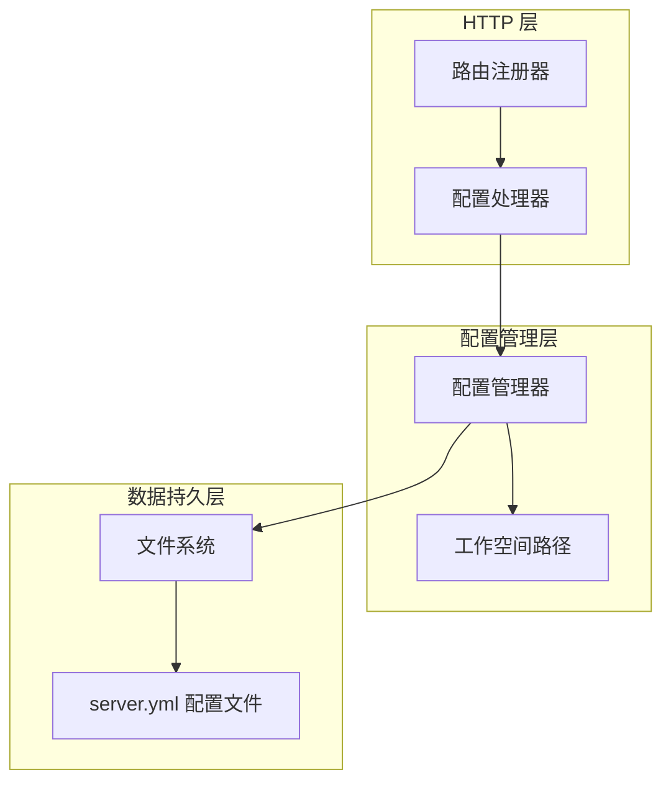
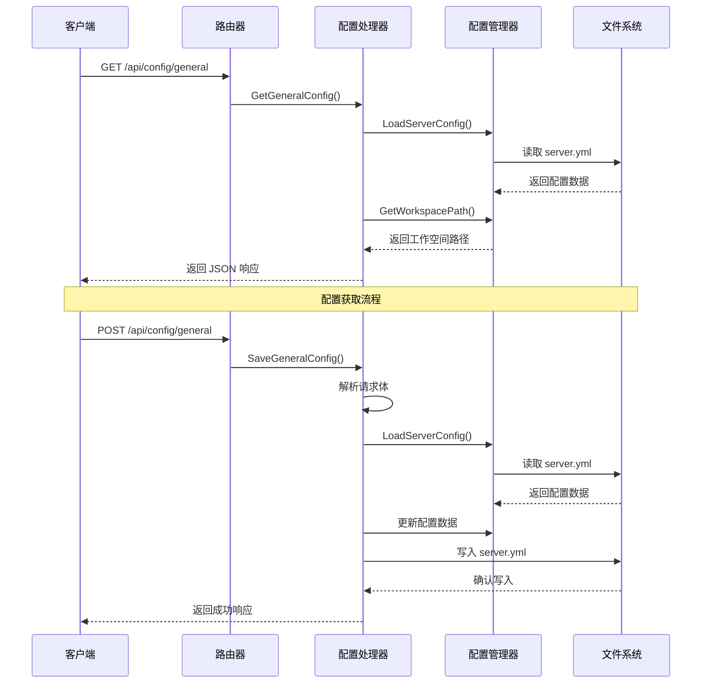
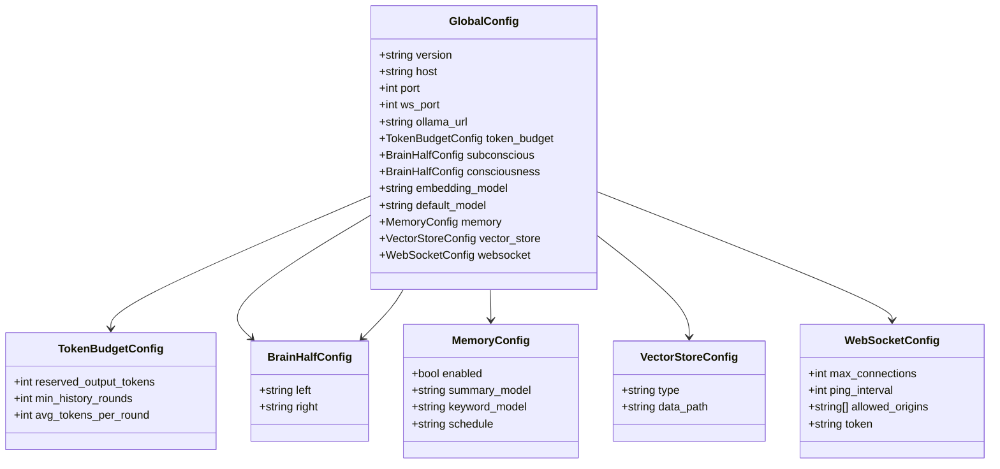
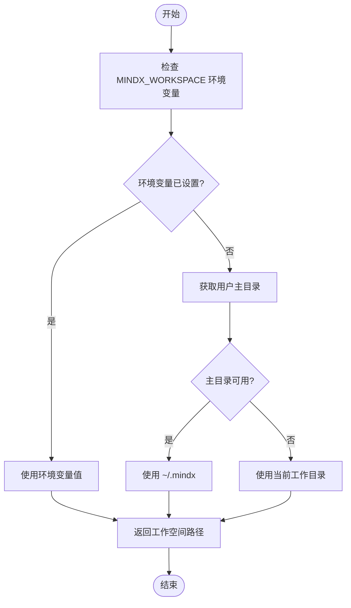
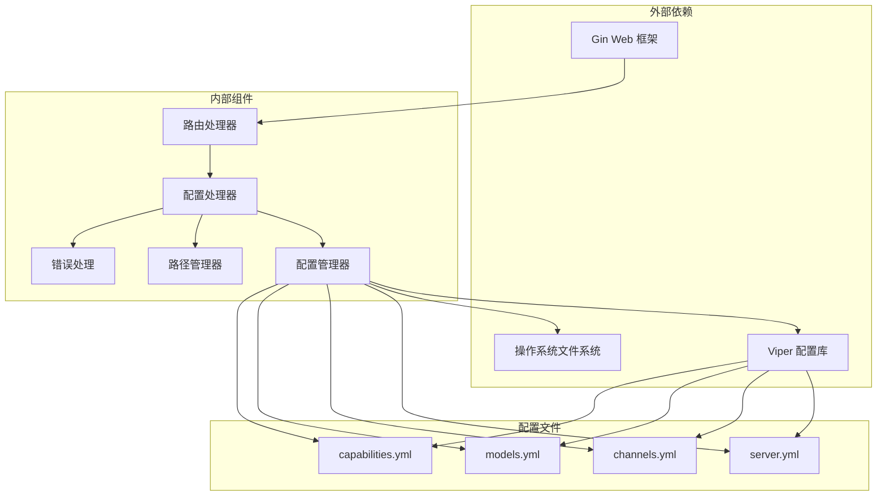

# 通用配置接口

<cite>
**本文档引用的文件**
- [internal/adapters/http/handlers/config.go](file://internal/adapters/http/handlers/config.go)
- [internal/adapters/http/handlers/router.go](file://internal/adapters/http/handlers/router.go)
- [internal/config/config.go](file://internal/config/config.go)
- [internal/config/global.go](file://internal/config/global.go)
- [internal/config/paths.go](file://internal/config/paths.go)
- [config/server.yml](file://config/server.yml)
- [internal/errors/errors.go](file://internal/errors/errors.go)
</cite>

## 目录
1. [简介](#简介)
2. [项目结构](#项目结构)
3. [核心组件](#核心组件)
4. [架构概览](#架构概览)
5. [详细组件分析](#详细组件分析)
6. [依赖关系分析](#依赖关系分析)
7. [性能考虑](#性能考虑)
8. [故障排除指南](#故障排除指南)
9. [结论](#结论)

## 简介

MindX 通用配置接口提供了对系统工作空间配置和服务器配置的统一管理能力。该接口通过 `/api/config/general` 端点实现了工作空间路径查询和服务器地址端口设置的获取与保存功能，为用户提供了便捷的系统配置管理界面。

本接口特别关注工作空间配置、服务器地址和端口设置的管理，支持动态获取当前配置状态并允许用户进行实时修改。接口设计遵循 RESTful 原则，提供了清晰的请求响应格式和完善的错误处理机制。

## 项目结构

MindX 通用配置接口位于系统的 HTTP 层，采用分层架构设计：



**图表来源**
- [internal/adapters/http/handlers/router.go](file://internal/adapters/http/handlers/router.go#L110-L118)
- [internal/adapters/http/handlers/config.go](file://internal/adapters/http/handlers/config.go#L106-L155)

**章节来源**
- [internal/adapters/http/handlers/router.go](file://internal/adapters/http/handlers/router.go#L1-L150)
- [internal/adapters/http/handlers/config.go](file://internal/adapters/http/handlers/config.go#L1-L256)

## 核心组件

### 配置处理器 (ConfigHandler)

配置处理器是通用配置接口的核心实现，负责处理所有配置相关的 HTTP 请求。它提供了以下关键功能：

- **GET /api/config/general**: 获取当前工作空间路径和服务器配置信息
- **POST /api/config/general**: 保存工作空间路径和服务器配置信息

处理器内部集成了多个配置管理方法，包括服务器配置、模型配置、能力配置等，确保了配置管理的一致性和完整性。

### 路由注册器

路由注册器负责将配置接口注册到 Gin Web 框架中，定义了完整的 URL 路径和 HTTP 方法映射关系。配置相关路由包括：

- `/api/config/general` - 通用配置接口
- `/api/config/server` - 服务器配置接口  
- `/api/config/models` - 模型配置接口
- `/api/config/capabilities` - 能力配置接口

**章节来源**
- [internal/adapters/http/handlers/config.go](file://internal/adapters/http/handlers/config.go#L13-L155)
- [internal/adapters/http/handlers/router.go](file://internal/adapters/http/handlers/router.go#L110-L118)

## 架构概览

通用配置接口采用分层架构设计，确保了良好的可维护性和扩展性：



**图表来源**
- [internal/adapters/http/handlers/router.go](file://internal/adapters/http/handlers/router.go#L110-L118)
- [internal/adapters/http/handlers/config.go](file://internal/adapters/http/handlers/config.go#L106-L155)
- [internal/config/config.go](file://internal/config/config.go#L39-L82)

## 详细组件分析

### GET /api/config/general 接口

#### 功能概述
GET 接口用于获取当前系统的工作空间路径和服务器配置信息。该接口返回一个包含工作空间路径和服务器配置的完整 JSON 对象。

#### 响应结构
```json
{
  "workplace": "string",
  "server": {
    "address": "string",
    "port": integer
  }
}
```

#### 字段说明
- **workplace**: 当前工作空间的绝对路径字符串
- **server.address**: 服务器监听的主机地址
- **server.port**: 服务器监听的端口号

#### 成功响应示例
```json
{
  "workplace": "/home/user/.mindx",
  "server": {
    "address": "localhost",
    "port": 911
  }
}
```

#### 错误处理
当无法获取配置信息时，接口返回 500 状态码和错误详情：
```json
{
  "error": "配置加载失败：找不到配置文件"
}
```

**章节来源**
- [internal/adapters/http/handlers/config.go](file://internal/adapters/http/handlers/config.go#L106-L125)
- [config/server.yml](file://config/server.yml#L1-L21)

### POST /api/config/general 接口

#### 功能概述
POST 接口用于保存工作空间路径和服务器配置信息。该接口接收包含配置参数的 JSON 请求体，并将其持久化到配置文件中。

#### 请求体结构
```json
{
  "workplace": "string",
  "server": {
    "address": "string",
    "port": integer
  }
}
```

#### 字段说明
- **workplace**: 新的工作空间路径（可选）
- **server.address**: 新的服务器地址（可选）
- **server.port**: 新的服务器端口（可选）

#### 请求验证规则
接口对请求参数进行严格的验证：

1. **JSON 格式验证**: 确保请求体为有效的 JSON 格式
2. **字段类型验证**: 
   - address 必须为字符串类型
   - port 必须为整数类型
3. **范围验证**: 
   - port 值必须在 1-65535 范围内
4. **路径验证**: 
   - workplace 必须为有效的文件系统路径

#### 成功响应示例
```json
{
  "message": "General config saved successfully"
}
```

#### 错误处理
接口支持多种错误场景：

1. **请求格式错误** (400 Bad Request):
```json
{
  "error": "JSON 解析失败：无效的 JSON 格式"
}
```

2. **配置保存失败** (500 Internal Server Error):
```json
{
  "error": "配置保存失败：权限不足或磁盘空间不足"
}
```

**章节来源**
- [internal/adapters/http/handlers/config.go](file://internal/adapters/http/handlers/config.go#L127-L155)

### 配置数据模型

#### 全局配置结构
系统使用 GlobalConfig 结构来表示服务器配置：



**图表来源**
- [internal/config/global.go](file://internal/config/global.go#L3-L42)

#### 工作空间路径管理
工作空间路径通过环境变量和默认策略确定：



**图表来源**
- [internal/config/paths.go](file://internal/config/paths.go#L76-L90)

**章节来源**
- [internal/config/global.go](file://internal/config/global.go#L1-L42)
- [internal/config/paths.go](file://internal/config/paths.go#L76-L90)

## 依赖关系分析

通用配置接口的依赖关系体现了清晰的分层架构：



**图表来源**
- [internal/adapters/http/handlers/router.go](file://internal/adapters/http/handlers/router.go#L1-L150)
- [internal/adapters/http/handlers/config.go](file://internal/adapters/http/handlers/config.go#L1-L256)
- [internal/config/config.go](file://internal/config/config.go#L1-L294)

**章节来源**
- [internal/adapters/http/handlers/router.go](file://internal/adapters/http/handlers/router.go#L1-L150)
- [internal/adapters/http/handlers/config.go](file://internal/adapters/http/handlers/config.go#L1-L256)
- [internal/config/config.go](file://internal/config/config.go#L1-L294)

## 性能考虑

通用配置接口在设计时充分考虑了性能和可靠性：

### 缓存策略
- **配置缓存**: 加载的配置信息会在内存中缓存，避免重复文件 I/O 操作
- **路径缓存**: 工作空间路径解析结果会被缓存，减少环境变量检查开销

### 并发安全
- **线程安全**: 配置读取操作是无状态的，天然支持并发访问
- **写入保护**: 配置保存操作使用文件锁机制，防止并发写入冲突

### 错误恢复
- **优雅降级**: 当配置文件损坏时，系统会自动回退到默认配置
- **重试机制**: 文件操作失败时提供有限次数的重试机会

## 故障排除指南

### 常见问题及解决方案

#### 配置文件加载失败
**症状**: GET 请求返回 500 错误
**原因**: 
- 配置文件不存在或权限不足
- 配置文件格式不正确
- 工作空间路径不可访问

**解决方案**:
1. 检查工作空间目录是否存在
2. 验证配置文件格式和权限
3. 确认有足够的磁盘空间

#### 权限错误
**症状**: POST 请求返回 403 或 500 错误
**原因**: 
- 缺少写入配置文件的权限
- 工作空间目录权限不足

**解决方案**:
1. 检查工作空间目录权限
2. 确保应用程序有写入权限
3. 考虑使用管理员权限运行

#### 端口占用
**症状**: 服务器启动失败或配置保存后无法访问
**原因**: 
- 指定的端口已被其他程序占用
- 端口范围超出有效范围

**解决方案**:
1. 更换为未被占用的端口
2. 确认端口号在 1-65535 范围内
3. 检查防火墙设置

**章节来源**
- [internal/errors/errors.go](file://internal/errors/errors.go#L1-L234)
- [internal/config/config.go](file://internal/config/config.go#L215-L231)

## 结论

MindX 通用配置接口通过简洁而强大的设计，为用户提供了直观的系统配置管理能力。接口设计遵循 RESTful 原则，具有良好的可扩展性和维护性。

### 主要优势
- **简单易用**: 直观的 JSON 接口设计，易于理解和使用
- **功能完整**: 支持配置的获取、验证和保存全流程
- **错误处理**: 完善的错误处理机制，提供清晰的错误信息
- **安全性**: 严格的参数验证和权限控制
- **可靠性**: 稳健的配置管理和故障恢复机制

### 未来改进方向
- **配置版本控制**: 支持配置的历史版本管理和回滚
- **批量操作**: 扩展批量配置更新功能
- **配置模板**: 提供标准配置模板和最佳实践建议
- **监控告警**: 增加配置变更的监控和告警功能

该接口为 MindX 系统的配置管理奠定了坚实的基础，为后续的功能扩展和优化提供了良好的架构支撑。