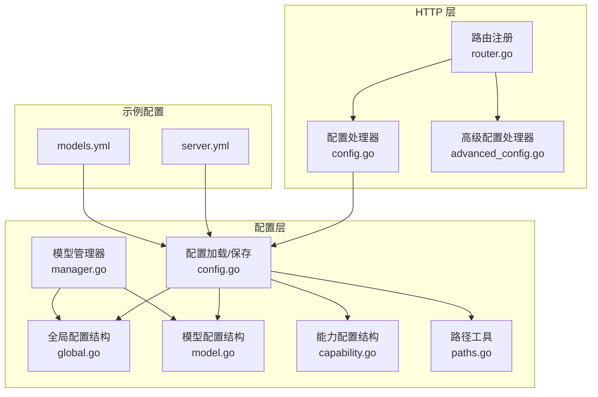
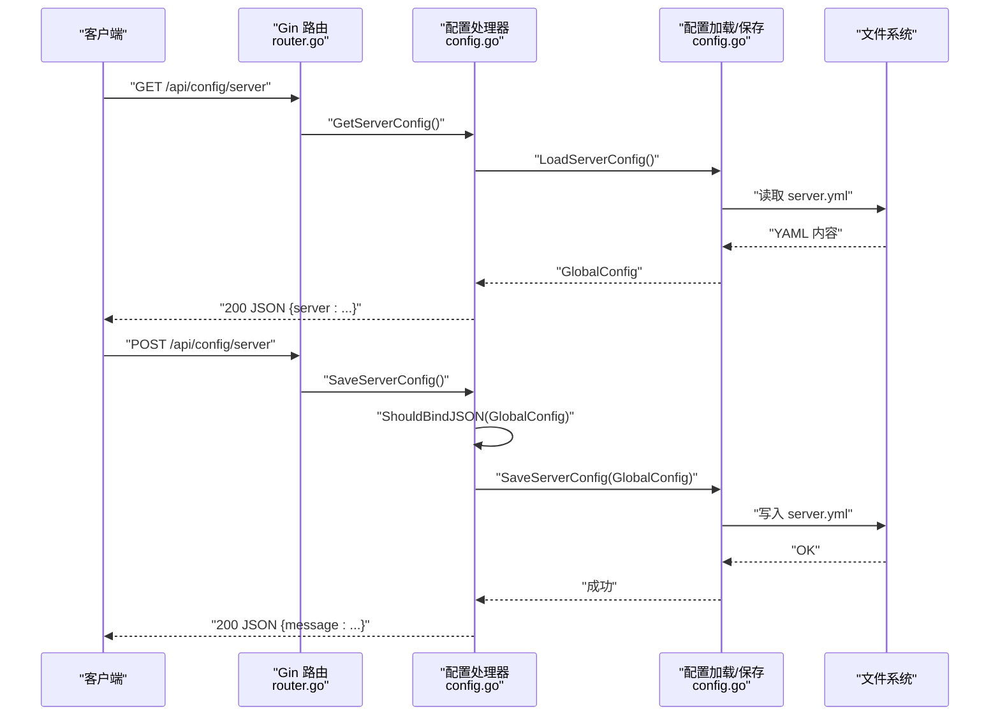
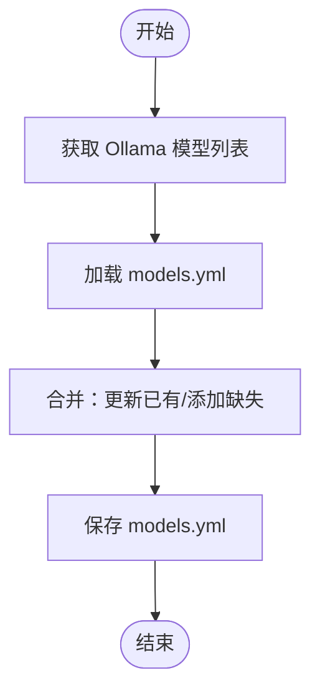
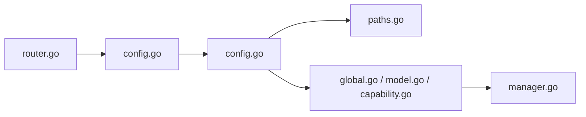

# 配置管理

<cite>
**本文引用的文件**
- [internal/adapters/http/handlers/router.go](file://internal/adapters/http/handlers/router.go)
- [internal/adapters/http/handlers/config.go](file://internal/adapters/http/handlers/config.go)
- [internal/adapters/http/handlers/advanced_config.go](file://internal/adapters/http/handlers/advanced_config.go)
- [internal/config/config.go](file://internal/config/config.go)
- [internal/config/global.go](file://internal/config/global.go)
- [internal/config/model.go](file://internal/config/model.go)
- [internal/config/capability.go](file://internal/config/capability.go)
- [internal/config/manager.go](file://internal/config/manager.go)
- [internal/config/paths.go](file://internal/config/paths.go)
- [config/server.yml](file://config/server.yml)
- [config/models.yml](file://config/models.yml)
</cite>

## 目录
1. [简介](#简介)
2. [项目结构](#项目结构)
3. [核心组件](#核心组件)
4. [架构总览](#架构总览)
5. [详细组件分析](#详细组件分析)
6. [依赖关系分析](#依赖关系分析)
7. [性能考量](#性能考量)
8. [故障排查指南](#故障排查指南)
9. [结论](#结论)
10. [附录](#附录)

## 简介
本文件为 MindX 配置管理接口的详细 API 文档，聚焦 /api/config 系列端点，覆盖通用配置、服务器配置、模型配置、能力配置的获取与保存，并包含高级配置管理入口与 Ollama 模型同步功能。文档同时说明各端点的 HTTP 方法、请求/响应数据结构、验证规则、更新流程，以及配置热更新、回滚策略与迁移方案的建议。

## 项目结构
配置管理相关代码主要分布在以下位置：
- HTTP 路由与处理器：internal/adapters/http/handlers/router.go、internal/adapters/http/handlers/config.go、internal/adapters/http/handlers/advanced_config.go
- 配置加载与保存：internal/config/config.go、internal/config/global.go、internal/config/model.go、internal/config/capability.go、internal/config/manager.go、internal/config/paths.go
- 示例配置文件：config/server.yml、config/models.yml

图表来源
- [internal/adapters/http/handlers/router.go](file://internal/adapters/http/handlers/router.go#L110-L119)
- [internal/adapters/http/handlers/config.go](file://internal/adapters/http/handlers/config.go#L1-L256)
- [internal/adapters/http/handlers/advanced_config.go](file://internal/adapters/http/handlers/advanced_config.go#L1-L81)
- [internal/config/config.go](file://internal/config/config.go#L1-L294)
- [internal/config/global.go](file://internal/config/global.go#L1-L42)
- [internal/config/model.go](file://internal/config/model.go#L1-L29)
- [internal/config/capability.go](file://internal/config/capability.go#L1-L29)
- [internal/config/manager.go](file://internal/config/manager.go#L1-L82)
- [internal/config/paths.go](file://internal/config/paths.go#L1-L285)
- [config/server.yml](file://config/server.yml#L1-L21)
- [config/models.yml](file://config/models.yml#L1-L92)

章节来源
- [internal/adapters/http/handlers/router.go](file://internal/adapters/http/handlers/router.go#L110-L119)
- [internal/adapters/http/handlers/config.go](file://internal/adapters/http/handlers/config.go#L1-L256)
- [internal/config/config.go](file://internal/config/config.go#L1-L294)

## 核心组件
- 路由注册：在 /api 下注册 /config 系列端点，包括通用配置、服务器配置、模型配置、能力配置与 Ollama 同步。
- 配置处理器：封装 JSON 绑定、参数校验、调用配置层加载/保存方法，并返回统一的 JSON 响应。
- 配置层：负责从工作区或安装目录读取/写入 YAML/JSON 配置文件；提供初始化与模板复制逻辑；暴露保存方法。
- 数据结构：GlobalConfig（服务器）、ModelsConfig/ModelConfig（模型）、CapabilityConfig/Capability（能力）。
- 模型管理器：基于 ModelsConfig 构建模型名到配置的映射，提供查询与默认模型等便捷方法。

章节来源
- [internal/adapters/http/handlers/router.go](file://internal/adapters/http/handlers/router.go#L110-L119)
- [internal/adapters/http/handlers/config.go](file://internal/adapters/http/handlers/config.go#L1-L256)
- [internal/config/config.go](file://internal/config/config.go#L1-L294)
- [internal/config/global.go](file://internal/config/global.go#L1-L42)
- [internal/config/model.go](file://internal/config/model.go#L1-L29)
- [internal/config/capability.go](file://internal/config/capability.go#L1-L29)
- [internal/config/manager.go](file://internal/config/manager.go#L1-L82)

## 架构总览
下图展示 /api/config 端点到配置层的调用链路与数据流：

图表来源
- [internal/adapters/http/handlers/router.go](file://internal/adapters/http/handlers/router.go#L113-L114)
- [internal/adapters/http/handlers/config.go](file://internal/adapters/http/handlers/config.go#L19-L43)
- [internal/config/config.go](file://internal/config/config.go#L39-L82)

## 详细组件分析

### 通用配置：/api/config/general
- 方法与路径
  - GET /api/config/general
  - POST /api/config/general
- 功能
  - GET：返回工作区路径 workplace 与服务器地址/端口 server.address/server.port。
  - POST：更新服务器地址与端口，保存至 server.yml。
- 请求体（POST）
  - workplace: 字符串（可选）
  - server.address: 字符串
  - server.port: 整数
- 响应
  - GET：包含 workplace、server.address、server.port 的对象。
  - POST：成功消息。
- 验证与错误
  - 参数绑定失败返回 400。
  - 文件读写失败返回 500。
- 更新流程
  - 读取现有 server.yml -> 修改 Host/Port -> 保存 server.yml。
- 最佳实践
  - 在修改前先 GET 获取当前值，避免遗漏字段。
  - 保持 server.port 合法范围与唯一性。

章节来源
- [internal/adapters/http/handlers/config.go](file://internal/adapters/http/handlers/config.go#L106-L155)
- [internal/config/config.go](file://internal/config/config.go#L39-L82)

### 服务器配置：/api/config/server
- 方法与路径
  - GET /api/config/server
  - POST /api/config/server
- 功能
  - GET：返回完整的 GlobalConfig 结构。
  - POST：保存 GlobalConfig。
- 请求体（POST）
  - server: GlobalConfig 对象
- 响应
  - GET：包含 server 字段的对象。
  - POST：成功消息。
- 验证与错误
  - 参数绑定失败返回 400。
  - 文件读写失败返回 500。
- 更新流程
  - 读取 server.yml -> 反序列化为 GlobalConfig -> 保存时写入 server: GlobalConfig。
- 数据结构要点（GlobalConfig）
  - 包含版本、主机、端口、WebSocket 端口、Ollama 地址、Token 预算、左右脑模型、嵌入模型、默认模型、内存、向量存储、WebSocket 配置等。
- 最佳实践
  - 修改前先 GET，确保字段完整性。
  - 修改后重启或触发服务热更新（见“热更新与回滚”）。

章节来源
- [internal/adapters/http/handlers/config.go](file://internal/adapters/http/handlers/config.go#L19-L43)
- [internal/config/config.go](file://internal/config/config.go#L39-L82)
- [internal/config/global.go](file://internal/config/global.go#L1-L42)
- [config/server.yml](file://config/server.yml#L1-L21)

### 模型配置：/api/config/models
- 方法与路径
  - GET /api/config/models
  - POST /api/config/models
- 功能
  - GET：返回 ModelsConfig（models 列表）。
  - POST：保存 ModelsConfig。
- 请求体（POST）
  - models: ModelsConfig 对象
- 响应
  - GET：包含 models 字段的对象。
  - POST：成功消息。
- 验证与错误
  - 参数绑定失败返回 400。
  - 文件读写失败返回 500。
- 更新流程
  - 读取 models.yml -> 反序列化为 ModelsConfig -> 保存时写入 models: [...ModelConfig]。
- 数据结构要点（ModelsConfig/ModelConfig）
  - 模型数组，每项包含 name、base_url、api_key、temperature、max_tokens、描述等。
- 最佳实践
  - 批量更新时一次性提交完整列表，避免部分覆盖。
  - 为常用模型设置合理 temperature 与 max_tokens。

章节来源
- [internal/adapters/http/handlers/config.go](file://internal/adapters/http/handlers/config.go#L45-L69)
- [internal/config/config.go](file://internal/config/config.go#L164-L203)
- [internal/config/model.go](file://internal/config/model.go#L1-L29)
- [config/models.yml](file://config/models.yml#L1-L92)

### 能力配置：/api/config/capabilities
- 方法与路径
  - GET /api/config/capabilities
  - POST /api/config/capabilities
- 功能
  - GET：返回 CapabilityConfig（capabilities 列表、默认能力、回退策略、描述），并附带当前模型列表（便于前端选择）。
  - POST：保存 CapabilityConfig。
- 请求体（POST）
  - capabilities: CapabilityConfig 对象
- 响应
  - GET：包含 capabilities、models 字段的对象。
  - POST：成功消息。
- 验证与错误
  - 参数绑定失败返回 400。
  - 文件读写失败返回 500。
- 更新流程
  - 读取 capabilities.yml -> 反序列化为 CapabilityConfig -> 保存时写入 capabilities、default_capability、fallback_to_local、description。
- 数据结构要点（CapabilityConfig/Capability）
  - 能力数组，每项包含名称、标题、图标、描述、模型、系统提示、工具集、温度、最大 tokens、模态、启用状态等。
- 最佳实践
  - 为每个能力指定明确的 tools 与 system_prompt。
  - 使用 default_capability 与 fallback_to_local 控制兜底行为。

章节来源
- [internal/adapters/http/handlers/config.go](file://internal/adapters/http/handlers/config.go#L71-L104)
- [internal/config/config.go](file://internal/config/config.go#L124-L162)
- [internal/config/capability.go](file://internal/config/capability.go#L1-L29)

### Ollama 模型同步：/api/config/ollama-sync
- 方法与路径
  - POST /api/config/ollama-sync
- 功能
  - 从本地 Ollama 实例拉取模型列表，与现有 models.yml 同步，自动补齐缺失模型并更新 BaseURL。
- 请求体
  - 无（内部通过配置读取 Ollama 地址）
- 响应
  - 成功消息。
- 流程
  - 读取 Ollama /api/tags -> 读取 models.yml -> 同步模型 -> 保存 models.yml。
- 注意事项
  - 需确保 Ollama 服务可达且端口正确。
  - 同步会为新增模型填充默认 temperature 与 max_tokens。

图表来源
- [internal/adapters/http/handlers/config.go](file://internal/adapters/http/handlers/config.go#L157-L182)
- [internal/adapters/http/handlers/config.go](file://internal/adapters/http/handlers/config.go#L184-L213)
- [internal/adapters/http/handlers/config.go](file://internal/adapters/http/handlers/config.go#L215-L255)

章节来源
- [internal/adapters/http/handlers/config.go](file://internal/adapters/http/handlers/config.go#L157-L255)

### 高级配置管理：/api/config/advanced
- 方法与路径
  - GET /api/config/advanced
  - POST /api/config/advanced
- 状态
  - 当前实现返回未完成（501），表示该接口需要针对新的配置系统进行重写。
- 建议
  - 保留端点以兼容未来扩展，当前请使用基础配置端点完成管理。

章节来源
- [internal/adapters/http/handlers/advanced_config.go](file://internal/adapters/http/handlers/advanced_config.go#L74-L80)

## 依赖关系分析
- 路由到处理器
  - /api/config/* 由 ConfigHandler 提供处理逻辑。
- 处理器到配置层
  - Get*/Save* 方法调用 internal/config/config.go 中的 Load*/Save* 函数。
- 配置层到文件系统
  - 通过 viper 或自定义 YAML/JSON 读写，结合 internal/config/paths.go 的路径解析。
- 配置层到数据结构
  - GlobalConfig、ModelsConfig、CapabilityConfig 定义于 internal/config/*.go。
- 模型管理器
  - ModelsManager 基于 ModelsConfig 构建模型映射，供上层使用。

图表来源
- [internal/adapters/http/handlers/router.go](file://internal/adapters/http/handlers/router.go#L110-L119)
- [internal/adapters/http/handlers/config.go](file://internal/adapters/http/handlers/config.go#L1-L256)
- [internal/config/config.go](file://internal/config/config.go#L1-L294)
- [internal/config/global.go](file://internal/config/global.go#L1-L42)
- [internal/config/model.go](file://internal/config/model.go#L1-L29)
- [internal/config/capability.go](file://internal/config/capability.go#L1-L29)
- [internal/config/manager.go](file://internal/config/manager.go#L1-L82)
- [internal/config/paths.go](file://internal/config/paths.go#L1-L285)

章节来源
- [internal/adapters/http/handlers/router.go](file://internal/adapters/http/handlers/router.go#L110-L119)
- [internal/adapters/http/handlers/config.go](file://internal/adapters/http/handlers/config.go#L1-L256)
- [internal/config/config.go](file://internal/config/config.go#L1-L294)

## 性能考量
- 配置读取
  - 使用 viper 进行 YAML/JSON 解析，I/O 开销较低；建议在启动阶段集中加载，减少频繁磁盘访问。
- 配置写入
  - 写入采用覆盖式写入，建议批量更新后再写入，避免频繁落盘。
- 模型同步
  - Ollama 同步涉及一次 HTTP 请求与一次文件写入，建议在后台定时执行，避免阻塞主流程。
- 并发安全
  - 配置文件为静态资源，建议在写入时加锁或原子替换，防止并发读写冲突。

## 故障排查指南
- 常见错误
  - 400 参数绑定失败：检查请求体 JSON 结构与字段类型是否匹配数据结构定义。
  - 500 读取/写入失败：检查工作区路径权限、磁盘空间、文件是否存在。
- 排查步骤
  - 先 GET 获取当前配置，确认字段完整性。
  - 使用最小化请求体进行 POST，逐步增加字段定位问题。
  - 查看服务日志定位具体错误位置。
- 回滚策略建议
  - 写入前备份 server.yml、models.yml、capabilities.yml。
  - 支持版本化配置文件，按日期生成备份副本。
  - 提供一键恢复脚本或 API。

章节来源
- [internal/adapters/http/handlers/config.go](file://internal/adapters/http/handlers/config.go#L28-L42)
- [internal/adapters/http/handlers/config.go](file://internal/adapters/http/handlers/config.go#L54-L68)
- [internal/adapters/http/handlers/config.go](file://internal/adapters/http/handlers/config.go#L89-L103)
- [internal/config/config.go](file://internal/config/config.go#L215-L272)

## 结论
MindX 的 /api/config 系列接口提供了对服务器、模型、能力与通用配置的完整读写能力，并内置了 Ollama 模型同步功能。通过清晰的数据结构与严格的错误处理，用户可以安全地管理配置。建议在生产环境中配合备份与回滚策略，确保变更可控。

## 附录

### API 端点一览
- GET /api/config/general
- POST /api/config/general
- GET /api/config/server
- POST /api/config/server
- GET /api/config/models
- POST /api/config/models
- GET /api/config/capabilities
- POST /api/config/capabilities
- POST /api/config/ollama-sync

章节来源
- [internal/adapters/http/handlers/router.go](file://internal/adapters/http/handlers/router.go#L110-L119)

### 数据结构速查
- GlobalConfig（服务器）
  - 关键字段：host、port、ws_port、token_budget、subconscious、consciousness、embedding_model、default_model、memory、vector_store、websocket。
- ModelsConfig/ModelConfig（模型）
  - 关键字段：name、base_url、api_key、temperature、max_tokens、description。
- CapabilityConfig/Capability（能力）
  - 关键字段：name、title、icon、description、model、system_prompt、tools、temperature、max_tokens、modality、enabled、vector。
- 模型管理器 ModelsManager
  - 提供 GetModel/ListModels/GetBrainModels/GetEmbeddingModel/GetDefaultModel 等便捷方法。

章节来源
- [internal/config/global.go](file://internal/config/global.go#L1-L42)
- [internal/config/model.go](file://internal/config/model.go#L1-L29)
- [internal/config/capability.go](file://internal/config/capability.go#L1-L29)
- [internal/config/manager.go](file://internal/config/manager.go#L1-L82)

### 配置文件示例
- server.yml：包含版本、主机、端口、WebSocket、Token 预算、左右脑模型、嵌入模型、默认模型、内存、向量存储等。
- models.yml：包含多个模型条目，每条目包含名称、描述、基础 URL、API Key、温度、最大 tokens 等。

章节来源
- [config/server.yml](file://config/server.yml#L1-L21)
- [config/models.yml](file://config/models.yml#L1-L92)