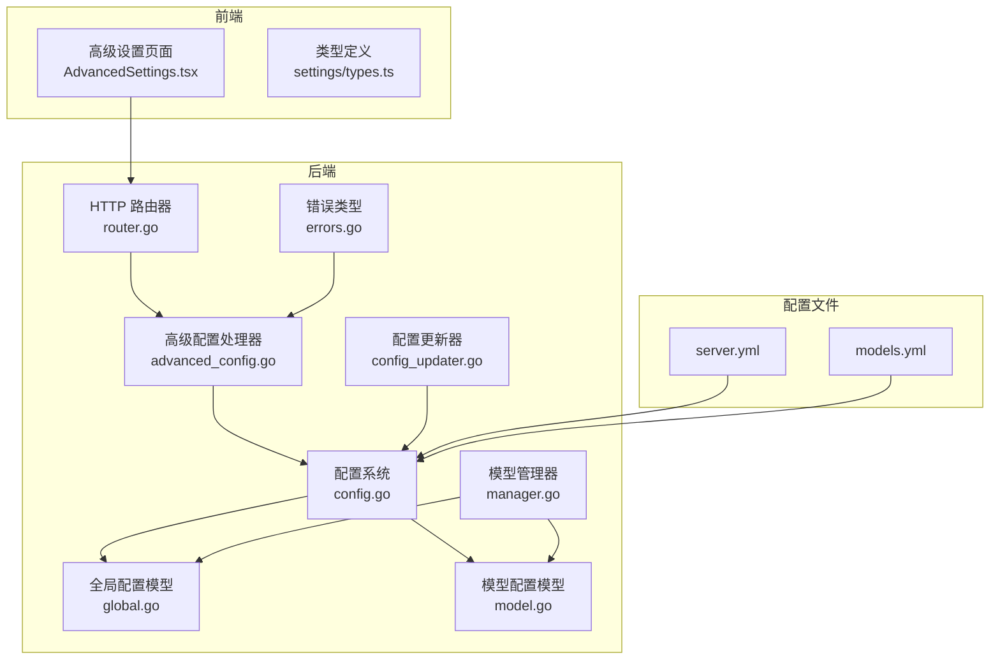
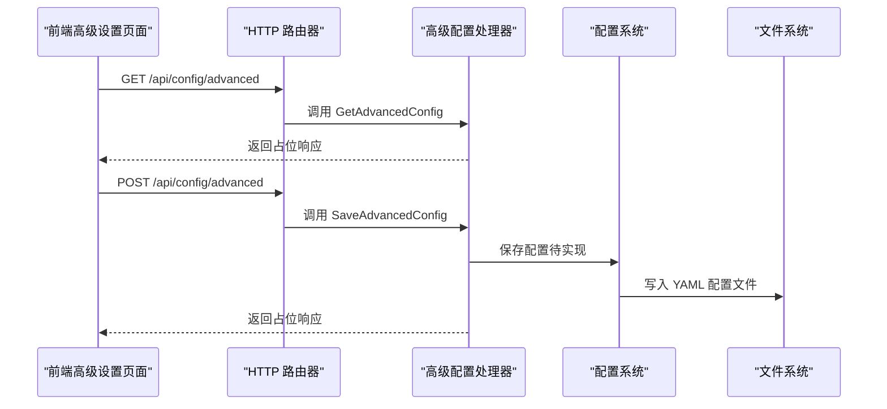
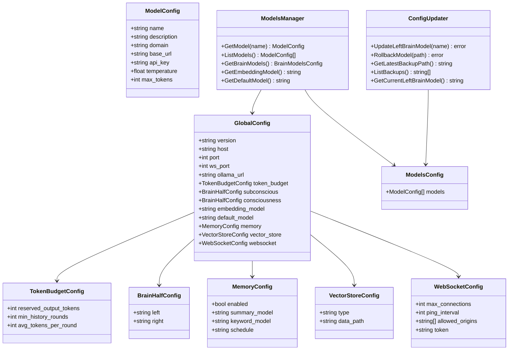
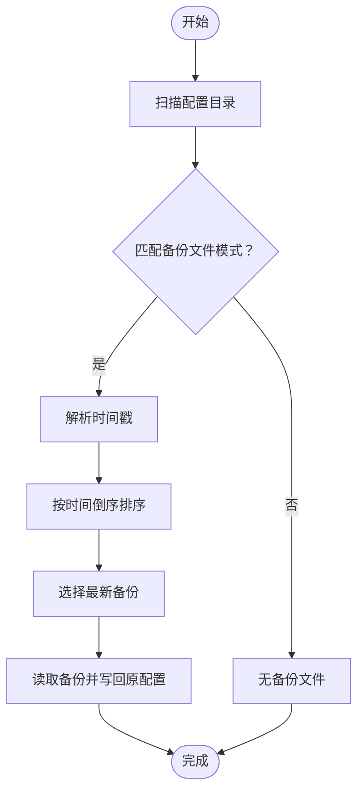
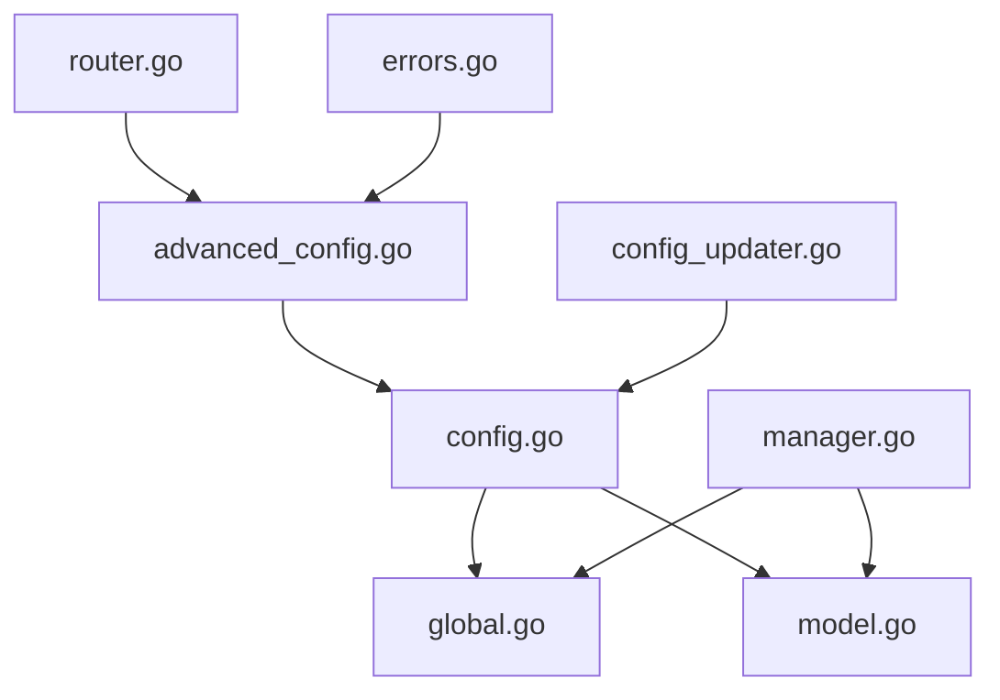

# 高级配置接口

<cite>
**本文档引用的文件**
- [internal/adapters/http/handlers/advanced_config.go](file://internal/adapters/http/handlers/advanced_config.go)
- [internal/adapters/http/handlers/router.go](file://internal/adapters/http/handlers/router.go)
- [internal/config/config.go](file://internal/config/config.go)
- [internal/config/global.go](file://internal/config/global.go)
- [internal/config/model.go](file://internal/config/model.go)
- [internal/config/manager.go](file://internal/config/manager.go)
- [internal/usecase/training/config_updater.go](file://internal/usecase/training/config_updater.go)
- [internal/errors/errors.go](file://internal/errors/errors.go)
- [dashboard/src/components/AdvancedSettings.tsx](file://dashboard/src/components/AdvancedSettings.tsx)
- [dashboard/src/components/settings/types.ts](file://dashboard/src/components/settings/types.ts)
- [config/server.yml](file://config/server.yml)
- [config/models.yml](file://config/models.yml)
</cite>

## 目录
1. [简介](#简介)
2. [项目结构](#项目结构)
3. [核心组件](#核心组件)
4. [架构总览](#架构总览)
5. [详细组件分析](#详细组件分析)
6. [依赖关系分析](#依赖关系分析)
7. [性能考虑](#性能考虑)
8. [故障排除指南](#故障排除指南)
9. [结论](#结论)
10. [附录](#附录)

## 简介
本文件为 MindX 高级配置接口的详细 API 文档，聚焦于系统配置、性能调优参数与安全设置等高级选项的获取与保存。当前高级配置接口处于重构过渡期，HTTP 层的高级配置路由已注册，但具体实现标记为“需要为新配置系统重写”。本文档基于现有代码结构与配置文件，梳理数据模型、配置项分类、验证规则、使用场景与注意事项，并提供备份与版本管理机制说明。

## 项目结构
高级配置相关的核心位置如下：
- 后端 HTTP 层：路由注册位于 HTTP 路由器，高级配置处理器位于适配器层
- 配置系统：通过 Viper 加载 YAML 配置文件，支持服务端配置、模型配置等
- 前端界面：高级设置页面负责展示与编辑配置，并调用后端 API

**图表来源**
- [internal/adapters/http/handlers/router.go](file://internal/adapters/http/handlers/router.go#L104-L107)
- [internal/adapters/http/handlers/advanced_config.go](file://internal/adapters/http/handlers/advanced_config.go#L1-L81)
- [internal/config/config.go](file://internal/config/config.go#L13-L37)
- [internal/config/global.go](file://internal/config/global.go#L3-L17)
- [internal/config/model.go](file://internal/config/model.go#L3-L28)
- [internal/config/manager.go](file://internal/config/manager.go#L13-L82)
- [internal/usecase/training/config_updater.go](file://internal/usecase/training/config_updater.go#L15-L28)
- [internal/errors/errors.go](file://internal/errors/errors.go#L9-L33)
- [config/server.yml](file://config/server.yml#L1-L21)
- [config/models.yml](file://config/models.yml#L1-L92)

**章节来源**
- [internal/adapters/http/handlers/router.go](file://internal/adapters/http/handlers/router.go#L104-L107)
- [internal/adapters/http/handlers/advanced_config.go](file://internal/adapters/http/handlers/advanced_config.go#L1-L81)
- [internal/config/config.go](file://internal/config/config.go#L13-L37)
- [internal/config/global.go](file://internal/config/global.go#L3-L17)
- [internal/config/model.go](file://internal/config/model.go#L3-L28)
- [internal/config/manager.go](file://internal/config/manager.go#L13-L82)
- [internal/usecase/training/config_updater.go](file://internal/usecase/training/config_updater.go#L15-L28)
- [internal/errors/errors.go](file://internal/errors/errors.go#L9-L33)
- [config/server.yml](file://config/server.yml#L1-L21)
- [config/models.yml](file://config/models.yml#L1-L92)

## 核心组件
- 高级配置处理器：负责高级配置的获取与保存（当前实现返回“需要重写”）
- 配置系统：通过 Viper 读取与写入 YAML 配置文件，提供加载与保存方法
- 全局配置模型：定义服务端配置字段（主机、端口、模型、内存、向量存储、WebSocket 等）
- 模型配置模型：定义模型列表与模型参数（名称、基础 URL、温度、最大 Token 等）
- 模型管理器：提供模型查询、默认模型、大脑模型等便捷访问
- 配置更新器：提供备份、恢复、列出备份等功能（针对旧 JSON 配置路径）
- 错误系统：统一错误类型与包装机制
- 前端高级设置页面：负责配置展示、编辑与保存调用

**章节来源**
- [internal/adapters/http/handlers/advanced_config.go](file://internal/adapters/http/handlers/advanced_config.go#L11-L81)
- [internal/config/config.go](file://internal/config/config.go#L13-L37)
- [internal/config/global.go](file://internal/config/global.go#L3-L17)
- [internal/config/model.go](file://internal/config/model.go#L3-L28)
- [internal/config/manager.go](file://internal/config/manager.go#L13-L82)
- [internal/usecase/training/config_updater.go](file://internal/usecase/training/config_updater.go#L15-L126)
- [internal/errors/errors.go](file://internal/errors/errors.go#L9-L33)
- [dashboard/src/components/AdvancedSettings.tsx](file://dashboard/src/components/AdvancedSettings.tsx#L64-L253)

## 架构总览
高级配置接口遵循“前端表单 -> HTTP 路由 -> 处理器 -> 配置系统”的调用链路。当前处理器返回占位响应，实际逻辑需对接新的配置系统。

**图表来源**
- [internal/adapters/http/handlers/router.go](file://internal/adapters/http/handlers/router.go#L104-L107)
- [internal/adapters/http/handlers/advanced_config.go](file://internal/adapters/http/handlers/advanced_config.go#L74-L80)
- [internal/config/config.go](file://internal/config/config.go#L215-L231)

## 详细组件分析

### 数据模型与配置项分类
- 全局配置（GlobalConfig）：版本、主机、端口、WebSocket 端口、Ollama 地址、Token 预预估、大脑左右半球模型、嵌入模型、默认模型、内存、向量存储、WebSocket 安全参数
- 模型配置（ModelsConfig/ModelConfig）：模型列表及其参数（名称、基础 URL、API 密钥、温度、最大 Token）
- 模型管理器（ModelsManager）：提供模型查询、默认模型、大脑模型便捷访问
- 配置更新器（ConfigUpdater）：提供备份、恢复、列出备份（针对旧 JSON 配置）

**图表来源**
- [internal/config/global.go](file://internal/config/global.go#L3-L42)
- [internal/config/model.go](file://internal/config/model.go#L3-L28)
- [internal/config/manager.go](file://internal/config/manager.go#L13-L82)
- [internal/usecase/training/config_updater.go](file://internal/usecase/training/config_updater.go#L15-L126)

**章节来源**
- [internal/config/global.go](file://internal/config/global.go#L3-L42)
- [internal/config/model.go](file://internal/config/model.go#L3-L28)
- [internal/config/manager.go](file://internal/config/manager.go#L13-L82)
- [internal/usecase/training/config_updater.go](file://internal/usecase/training/config_updater.go#L15-L126)

### 配置项分类与含义
- 系统与网络
  - 主机与端口：服务监听地址与 HTTP/WS 端口
  - WebSocket 安全：最大连接数、心跳间隔、允许来源、令牌
- 模型与推理
  - 左右半脑模型：子意识与意识分别使用的模型名称
  - 嵌入模型：向量化模型名称
  - 默认模型：未指定时使用的模型名称
  - 模型参数：基础 URL、API 密钥、温度、最大 Token
- 性能与资源
  - Token 预算：预留输出 Token、最小历史轮次、平均每轮 Token
- 记忆与向量存储
  - 内存开关、摘要模型、关键词模型、调度计划
  - 向量存储类型与数据路径
- Ollama 集成
  - Ollama 服务地址（用于模型同步与检查）

**章节来源**
- [internal/config/global.go](file://internal/config/global.go#L3-L42)
- [internal/config/model.go](file://internal/config/model.go#L3-L28)
- [config/server.yml](file://config/server.yml#L1-L21)
- [config/models.yml](file://config/models.yml#L1-L92)

### 验证规则与约束
- 字段存在性：配置文件必须包含必要的键（如 server、models 等）
- 类型一致性：Viper 解析时要求字段类型与模型一致
- 取值范围：温度通常应在合理范围内；最大 Token 不应超过模型上限
- 关联一致性：大脑模型名称需存在于模型列表中
- 文件存在性：配置文件缺失时，系统会尝试复制模板文件

**章节来源**
- [internal/config/config.go](file://internal/config/config.go#L39-L82)
- [internal/config/config.go](file://internal/config/config.go#L164-L203)
- [internal/config/model.go](file://internal/config/model.go#L14-L22)

### 使用场景与影响范围
- 性能调优：通过调整 Token 预算、模型温度与最大 Token 控制上下文长度与生成行为
- 并发控制：通过 WebSocket 最大连接数与心跳间隔控制并发与资源占用
- 安全设置：通过 allowed_origins 与 token 限制 WebSocket 访问来源与鉴权
- 记忆与缓存：通过内存开关、摘要与关键词模型影响长期记忆与检索效率
- 版本与兼容：通过版本字段与模板机制保证配置文件的演进与兼容

**章节来源**
- [internal/config/global.go](file://internal/config/global.go#L19-L42)
- [config/server.yml](file://config/server.yml#L1-L21)

### 修改注意事项
- 在线修改可能影响运行中的会话与记忆，请谨慎变更
- 模型切换需确保目标模型可用且参数合理
- WebSocket 安全参数变更需同步更新前端与客户端配置
- 备份与回滚：优先使用配置更新器提供的备份/恢复功能，避免直接手工修改配置文件

**章节来源**
- [internal/usecase/training/config_updater.go](file://internal/usecase/training/config_updater.go#L34-L46)
- [internal/usecase/training/config_updater.go](file://internal/usecase/training/config_updater.go#L48-L95)

### 高级配置示例（基于现有配置文件）
以下示例展示了典型配置项的组织方式（以路径代替具体代码内容）：
- 服务器配置示例：[config/server.yml](file://config/server.yml#L1-L21)
- 模型配置示例：[config/models.yml](file://config/models.yml#L1-L92)
- 前端配置类型定义：[dashboard/src/components/settings/types.ts](file://dashboard/src/components/settings/types.ts#L40-L61)
- 前端高级设置页面：[dashboard/src/components/AdvancedSettings.tsx](file://dashboard/src/components/AdvancedSettings.tsx#L25-L62)

**章节来源**
- [config/server.yml](file://config/server.yml#L1-L21)
- [config/models.yml](file://config/models.yml#L1-L92)
- [dashboard/src/components/settings/types.ts](file://dashboard/src/components/settings/types.ts#L40-L61)
- [dashboard/src/components/AdvancedSettings.tsx](file://dashboard/src/components/AdvancedSettings.tsx#L25-L62)

### 备份、恢复与版本管理
- 备份机制：配置更新器扫描配置目录，识别以“配置文件名.backup.yyyymmdd_hhmmss”命名的备份文件
- 恢复机制：读取备份文件内容并写回原配置文件，实现一键回滚
- 列出备份：按时间倒序列出所有备份文件，便于选择最近备份
- 注意事项：当前实现针对旧 JSON 配置路径，新 YAML 配置系统需另行实现对应逻辑

**图表来源**
- [internal/usecase/training/config_updater.go](file://internal/usecase/training/config_updater.go#L48-L95)
- [internal/usecase/training/config_updater.go](file://internal/usecase/training/config_updater.go#L97-L121)

**章节来源**
- [internal/usecase/training/config_updater.go](file://internal/usecase/training/config_updater.go#L34-L46)
- [internal/usecase/training/config_updater.go](file://internal/usecase/training/config_updater.go#L48-L95)
- [internal/usecase/training/config_updater.go](file://internal/usecase/training/config_updater.go#L97-L121)

## 依赖关系分析
- HTTP 路由器注册高级配置路由，指向高级配置处理器
- 高级配置处理器依赖配置系统进行读写
- 配置系统依赖 Viper 读取 YAML 文件，依赖模型管理器提供模型信息
- 配置更新器独立于新配置系统，仍可对旧 JSON 配置执行备份与恢复

**图表来源**
- [internal/adapters/http/handlers/router.go](file://internal/adapters/http/handlers/router.go#L104-L107)
- [internal/adapters/http/handlers/advanced_config.go](file://internal/adapters/http/handlers/advanced_config.go#L1-L81)
- [internal/config/config.go](file://internal/config/config.go#L13-L37)
- [internal/config/global.go](file://internal/config/global.go#L3-L17)
- [internal/config/model.go](file://internal/config/model.go#L3-L28)
- [internal/config/manager.go](file://internal/config/manager.go#L13-L82)
- [internal/usecase/training/config_updater.go](file://internal/usecase/training/config_updater.go#L15-L28)
- [internal/errors/errors.go](file://internal/errors/errors.go#L9-L33)

**章节来源**
- [internal/adapters/http/handlers/router.go](file://internal/adapters/http/handlers/router.go#L104-L107)
- [internal/adapters/http/handlers/advanced_config.go](file://internal/adapters/http/handlers/advanced_config.go#L1-L81)
- [internal/config/config.go](file://internal/config/config.go#L13-L37)
- [internal/config/manager.go](file://internal/config/manager.go#L13-L82)
- [internal/usecase/training/config_updater.go](file://internal/usecase/training/config_updater.go#L15-L28)
- [internal/errors/errors.go](file://internal/errors/errors.go#L9-L33)

## 性能考虑
- Token 预算：通过预留输出 Token 与平均每轮 Token 控制上下文长度，避免超出模型最大 Token 上限
- 并发控制：WebSocket 最大连接数与心跳间隔直接影响资源占用与延迟
- 模型参数：温度与最大 Token 影响生成质量与性能，需根据场景权衡
- 向量存储：选择合适的向量存储类型与数据路径，有助于提升检索性能

**章节来源**
- [internal/config/global.go](file://internal/config/global.go#L19-L42)
- [config/server.yml](file://config/server.yml#L8-L11)

## 故障排除指南
- 配置加载失败：检查配置文件是否存在与格式是否正确；系统会在缺失时尝试复制模板
- 保存配置失败：确认写权限与磁盘空间；查看错误日志定位具体原因
- 模型不可用：确认模型名称存在于模型列表，且基础 URL 与 API 密钥正确
- WebSocket 连接异常：检查 allowed_origins 与 token 配置，确保与前端一致
- 配置回滚：使用配置更新器的回滚功能，选择最近备份恢复

**章节来源**
- [internal/config/config.go](file://internal/config/config.go#L39-L82)
- [internal/config/config.go](file://internal/config/config.go#L215-L231)
- [internal/errors/errors.go](file://internal/errors/errors.go#L145-L153)
- [internal/usecase/training/config_updater.go](file://internal/usecase/training/config_updater.go#L34-L46)

## 结论
当前高级配置接口处于过渡阶段，HTTP 路由已就绪，但处理器实现尚未对接新配置系统。建议在实现新配置系统的高级配置读写逻辑时，严格遵循现有数据模型与验证规则，并完善备份与回滚机制。前端高级设置页面提供了良好的交互体验，后续可直接对接新的后端实现。

## 附录
- 前端类型定义：[dashboard/src/components/settings/types.ts](file://dashboard/src/components/settings/types.ts#L1-L61)
- 前端高级设置页面：[dashboard/src/components/AdvancedSettings.tsx](file://dashboard/src/components/AdvancedSettings.tsx#L1-L253)
- 配置文件示例：[config/server.yml](file://config/server.yml#L1-L21)、[config/models.yml](file://config/models.yml#L1-L92)