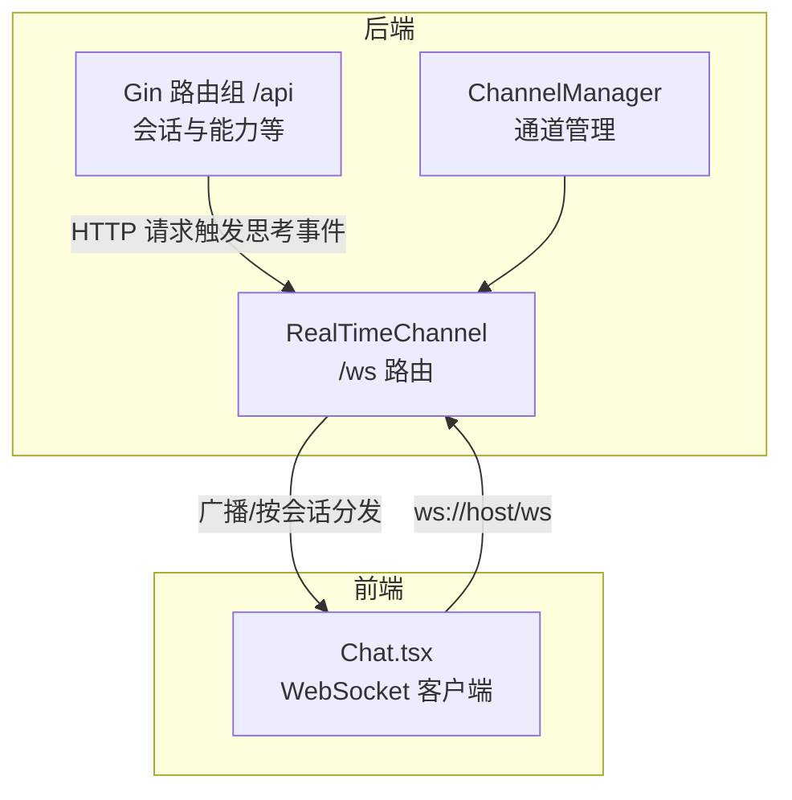
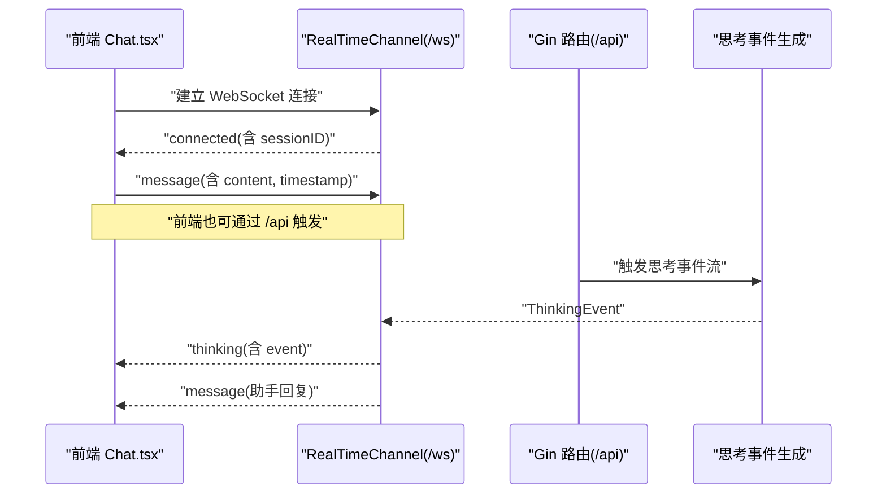
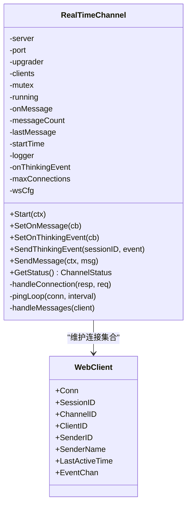
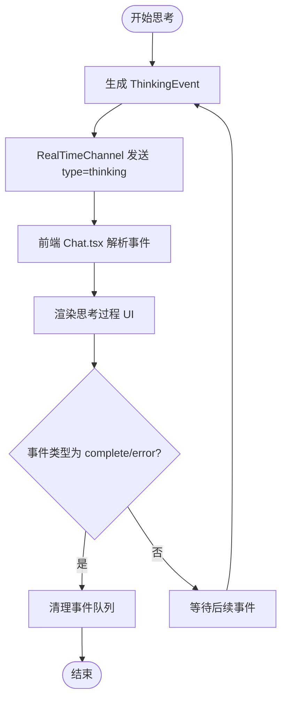
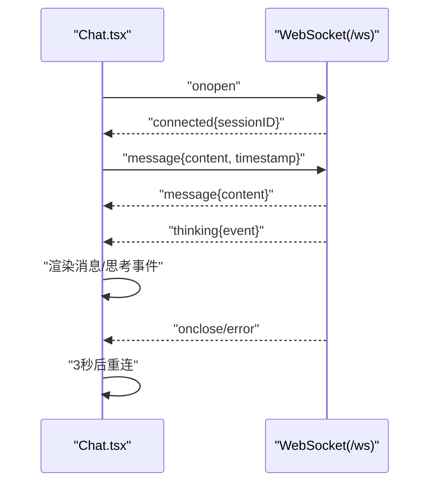
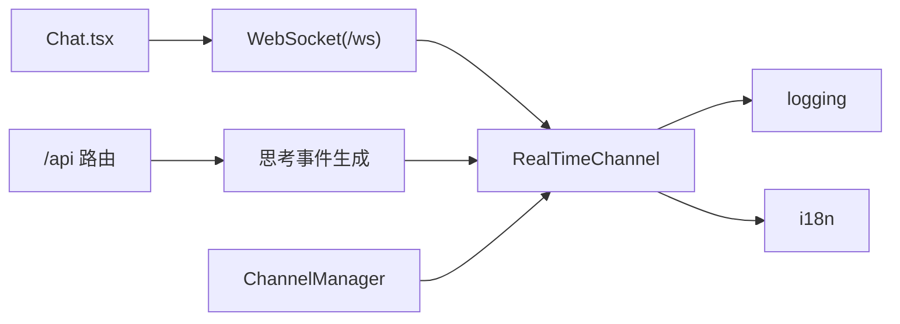

# WebSocket 实时通信

<cite>
**本文引用的文件**
- [internal/adapters/channels/realtime.go](file://internal/adapters/channels/realtime.go)
- [internal/entity/webclient.go](file://internal/entity/webclient.go)
- [internal/usecase/brain/thinking_stream.go](file://internal/usecase/brain/thinking_stream.go)
- [dashboard/src/components/Chat.tsx](file://dashboard/src/components/Chat.tsx)
- [internal/adapters/http/handlers/router.go](file://internal/adapters/http/handlers/router.go)
- [internal/adapters/channels/manager.go](file://internal/adapters/channels/manager.go)
- [internal/adapters/cli/entry.go](file://internal/adapters/cli/entry.go)
- [config/server.yml](file://config/server.yml)
- [internal/adapters/http/middleware/metrics.go](file://internal/adapters/http/middleware/metrics.go)
- [internal/adapters/cli/tui.go](file://internal/adapters/cli/tui.go)
</cite>

## 目录
1. [简介](#简介)
2. [项目结构](#项目结构)
3. [核心组件](#核心组件)
4. [架构总览](#架构总览)
5. [详细组件分析](#详细组件分析)
6. [依赖关系分析](#依赖关系分析)
7. [性能考量](#性能考量)
8. [故障排查指南](#故障排查指南)
9. [结论](#结论)
10. [附录](#附录)

## 简介
本文件面向前端与全栈开发者，系统化阐述 MindX 的 WebSocket 实时通信接口，覆盖连接建立流程、消息格式规范、事件类型定义、思考事件流传输机制、连接管理、心跳检测与错误恢复策略，并提供客户端集成示例与消息处理要点，帮助快速完成 Web UI 与终端 UI 的 WebSocket 集成。

## 项目结构
MindX 的 WebSocket 实时通信由“后端实时通道 + 前端聊天组件 + 会话与能力系统”协同实现：
- 后端实时通道：基于 Gorilla WebSocket，提供 /ws 接口，负责连接升级、心跳、消息分发与健康检查。
- 前端聊天组件：React 组件通过原生 WebSocket 连接 /ws，解析消息类型，渲染消息与思考事件。
- 会话与能力系统：通过 HTTP API 提供会话管理与消息转发，实时通道作为消息出口之一。

图表来源
- [internal/adapters/channels/realtime.go](file://internal/adapters/channels/realtime.go#L95-L115)
- [internal/adapters/http/handlers/router.go](file://internal/adapters/http/handlers/router.go#L18-L148)
- [dashboard/src/components/Chat.tsx](file://dashboard/src/components/Chat.tsx#L75-L152)

章节来源
- [internal/adapters/channels/realtime.go](file://internal/adapters/channels/realtime.go#L95-L115)
- [internal/adapters/http/handlers/router.go](file://internal/adapters/http/handlers/router.go#L18-L148)
- [config/server.yml](file://config/server.yml#L1-L21)

## 核心组件
- RealTimeChannel：基于 Gorilla WebSocket 的实时通道，提供 /ws 路由，支持连接认证、连接数限制、心跳保活、按会话分发消息与思考事件。
- ThinkingEvent：思考事件数据模型，包含事件类型、内容、进度、时间戳与元数据。
- Chat.tsx：前端聊天组件，负责连接 /ws、接收消息与思考事件、发送用户消息、会话切换与错误提示。
- ChannelManager：通道生命周期管理，统一启动/停止与状态查询。
- Gin 路由：提供 /api 下的会话与能力接口，作为 HTTP 入口触发思考事件流。

章节来源
- [internal/adapters/channels/realtime.go](file://internal/adapters/channels/realtime.go#L18-L78)
- [internal/entity/webclient.go](file://internal/entity/webclient.go#L21-L38)
- [dashboard/src/components/Chat.tsx](file://dashboard/src/components/Chat.tsx#L51-L152)
- [internal/adapters/channels/manager.go](file://internal/adapters/channels/manager.go#L15-L147)
- [internal/adapters/http/handlers/router.go](file://internal/adapters/http/handlers/router.go#L18-L148)

## 架构总览
WebSocket 实时通信的关键路径：
- 前端通过 ws://host/ws 建立连接，后端进行 Token 认证与连接数限制校验，升级为 WebSocket 并初始化心跳。
- 前端发送 type=message 的请求，后端通过 HTTP 入口或内部网关触发思考事件流，后端将 ThinkingEvent 以 type=thinking 的消息推送给对应会话。
- 前端根据消息类型渲染消息与思考事件，实现“实时聊天对话 + 思考过程可视化”。

图表来源
- [dashboard/src/components/Chat.tsx](file://dashboard/src/components/Chat.tsx#L92-L140)
- [internal/adapters/channels/realtime.go](file://internal/adapters/channels/realtime.go#L342-L424)
- [internal/adapters/http/handlers/router.go](file://internal/adapters/http/handlers/router.go#L34-L45)

## 详细组件分析

### RealTimeChannel 组件
- 连接建立
  - /ws 路由处理 HTTP 升级为 WebSocket，支持可选 Token 认证与连接数限制。
  - 生成 sessionID（URL 参数或随机），记录客户端信息并初始化 EventChan。
- 心跳与保活
  - 后端定时发送 Ping 帧，设置 PongHandler 重置读超时，维持长连接活性。
- 消息分发
  - 按 sessionID 将消息与思考事件推送到对应连接；支持主动发送消息与思考事件。
- 健康检查
  - 提供 GetStatus，包含运行状态、消息计数、最后消息时间与健康检查结果。

图表来源
- [internal/adapters/channels/realtime.go](file://internal/adapters/channels/realtime.go#L18-L78)
- [internal/entity/webclient.go](file://internal/entity/webclient.go#L29-L38)

章节来源
- [internal/adapters/channels/realtime.go](file://internal/adapters/channels/realtime.go#L95-L115)
- [internal/adapters/channels/realtime.go](file://internal/adapters/channels/realtime.go#L342-L424)
- [internal/adapters/channels/realtime.go](file://internal/adapters/channels/realtime.go#L426-L463)

### ThinkingEvent 与思考事件流
- 事件类型
  - start、progress、chunk、tool_call、tool_result、complete、error。
- 数据结构
  - 包含 type、content、progress、timestamp、metadata。
- 生成与传播
  - 通过 usecase/brain/thinking_stream.go 生成 ThinkingEvent，RealTimeChannel 将其封装为 type=thinking 的消息推送至前端。

图表来源
- [internal/usecase/brain/thinking_stream.go](file://internal/usecase/brain/thinking_stream.go#L24-L72)
- [internal/adapters/channels/realtime.go](file://internal/adapters/channels/realtime.go#L170-L215)
- [dashboard/src/components/Chat.tsx](file://dashboard/src/components/Chat.tsx#L114-L124)

章节来源
- [internal/entity/webclient.go](file://internal/entity/webclient.go#L9-L27)
- [internal/usecase/brain/thinking_stream.go](file://internal/usecase/brain/thinking_stream.go#L24-L72)
- [internal/adapters/channels/realtime.go](file://internal/adapters/channels/realtime.go#L170-L215)
- [dashboard/src/components/Chat.tsx](file://dashboard/src/components/Chat.tsx#L114-L124)

### 前端 Chat.tsx 集成要点
- 连接建立
  - 自动选择 ws/wss 协议与主机，连接 /ws；onopen 设置连接状态；onmessage 解析 type 并分支处理。
- 消息处理
  - type=message：构造助手消息并加入消息列表。
  - type=thinking：追加思考事件，complete/error 后自动清理。
  - type=connected：记录 sessionID，准备就绪。
- 发送消息
  - 将用户消息封装为 type=message 的 JSON，发送至后端。
- 错误与重连
  - onerror/onclose 记录错误与断开；3 秒后自动重连。

图表来源
- [dashboard/src/components/Chat.tsx](file://dashboard/src/components/Chat.tsx#L75-L152)
- [dashboard/src/components/Chat.tsx](file://dashboard/src/components/Chat.tsx#L211-L249)

章节来源
- [dashboard/src/components/Chat.tsx](file://dashboard/src/components/Chat.tsx#L51-L152)
- [dashboard/src/components/Chat.tsx](file://dashboard/src/components/Chat.tsx#L211-L249)

### 连接管理与心跳检测
- 连接认证
  - 可选 token 查询参数，未匹配则返回 401。
- 连接数限制
  - 当前连接数达到上限返回 503。
- 心跳保活
  - 后端按 PingInterval 发送 Ping，PongHandler 将读超时刷新为 2×PingInterval。
- 健康检查
  - GetStatus 返回运行状态、消息计数、最后消息时间与健康检查信息。

章节来源
- [internal/adapters/channels/realtime.go](file://internal/adapters/channels/realtime.go#L342-L360)
- [internal/adapters/channels/realtime.go](file://internal/adapters/channels/realtime.go#L428-L437)
- [internal/adapters/channels/realtime.go](file://internal/adapters/channels/realtime.go#L292-L340)

### 错误恢复策略
- 连接异常
  - onerror/onclose 记录状态，前端 3 秒后自动重连。
- 发送失败
  - 前端捕获发送异常，显示错误并回退到可用状态。
- 后端错误
  - 后端在写入失败时记录错误日志，继续处理其他连接。

章节来源
- [dashboard/src/components/Chat.tsx](file://dashboard/src/components/Chat.tsx#L142-L151)
- [dashboard/src/components/Chat.tsx](file://dashboard/src/components/Chat.tsx#L242-L246)
- [internal/adapters/channels/realtime.go](file://internal/adapters/channels/realtime.go#L195-L201)

### 客户端连接示例与消息处理
- 终端 UI 示例
  - CLI 中提供连接 /ws 的示例，展示如何通过 Dialer 建立连接并循环读取 JSON 消息。
- 前端集成步骤
  - 选择协议与主机，连接 /ws。
  - onmessage 分支处理 type=connected/message/thinking/pong/error。
  - 发送消息时构造 type=message 的 JSON。
  - 断线自动重连。

章节来源
- [internal/adapters/cli/tui.go](file://internal/adapters/cli/tui.go#L428-L451)
- [dashboard/src/components/Chat.tsx](file://dashboard/src/components/Chat.tsx#L75-L152)
- [dashboard/src/components/Chat.tsx](file://dashboard/src/components/Chat.tsx#L234-L241)

## 依赖关系分析
- RealTimeChannel 依赖 Gorilla WebSocket、日志与国际化模块，向上暴露 Start/SetOnMessage/SetOnThinkingEvent/SendMessage/SendThinkingEvent/GetStatus。
- Chat.tsx 依赖 React 上下文与 WebSocket API，负责 UI 交互与消息渲染。
- ChannelManager 统一管理通道生命周期，便于扩展其他通道类型。
- Gin 路由提供 HTTP 入口，触发思考事件流，与 WebSocket 形成互补。

图表来源
- [dashboard/src/components/Chat.tsx](file://dashboard/src/components/Chat.tsx#L75-L152)
- [internal/adapters/channels/realtime.go](file://internal/adapters/channels/realtime.go#L95-L115)
- [internal/adapters/channels/manager.go](file://internal/adapters/channels/manager.go#L123-L147)
- [internal/adapters/http/handlers/router.go](file://internal/adapters/http/handlers/router.go#L34-L45)

章节来源
- [internal/adapters/channels/realtime.go](file://internal/adapters/channels/realtime.go#L1-L78)
- [internal/adapters/channels/manager.go](file://internal/adapters/channels/manager.go#L15-L147)
- [internal/adapters/http/handlers/router.go](file://internal/adapters/http/handlers/router.go#L18-L148)

## 性能考量
- 连接并发
  - 通过 MaxConnections 控制最大连接数，避免资源耗尽。
- 心跳频率
  - PingInterval 默认 30 秒，可根据网络环境调整，降低 CPU 与带宽占用。
- 事件通道容量
  - WebClient.EventChan 缓冲 100，建议结合业务吞吐评估容量。
- 指标监控
  - 提供 ActiveWsConnections 指标，便于观察连接数变化。

章节来源
- [internal/adapters/channels/realtime.go](file://internal/adapters/channels/realtime.go#L44-L49)
- [internal/adapters/channels/realtime.go](file://internal/adapters/channels/realtime.go#L384-L384)
- [internal/adapters/http/middleware/metrics.go](file://internal/adapters/http/middleware/metrics.go#L45-L48)

## 故障排查指南
- 连接失败
  - 检查 Token 是否正确传递；确认 /ws 路由已注册；查看后端日志中的升级失败记录。
- 连接数过多
  - 后端返回 503，需降低并发或提升 MaxConnections。
- 心跳超时
  - 若前端长时间无响应，后端会因读超时关闭连接；检查网络质量与 PingInterval 设置。
- 发送失败
  - 前端捕获发送异常并提示；后端在 WriteJSON 失败时记录错误日志。
- 健康检查异常
  - GetStatus 返回 unhealthy/degraded，检查运行状态与连接数。

章节来源
- [internal/adapters/channels/realtime.go](file://internal/adapters/channels/realtime.go#L345-L360)
- [internal/adapters/channels/realtime.go](file://internal/adapters/channels/realtime.go#L414-L418)
- [internal/adapters/channels/realtime.go](file://internal/adapters/channels/realtime.go#L237-L243)
- [internal/adapters/channels/realtime.go](file://internal/adapters/channels/realtime.go#L292-L340)

## 结论
MindX 的 WebSocket 实时通信以 RealTimeChannel 为核心，结合前端 Chat.tsx 实现“实时聊天对话 + 思考事件流”的完整闭环。通过连接认证、连接数限制、心跳保活与健康检查，系统具备良好的稳定性与可观测性。前端可按消息类型规范快速集成，实现流畅的交互体验。

## 附录

### 消息格式规范
- 连接成功
  - type: "connected"
  - 字段: sessionID, message, timestamp
- 消息
  - type: "message"
  - 字段: content, timestamp
- 思考事件
  - type: "thinking"
  - 字段: event(type, content, progress, timestamp, metadata)
- 心跳
  - type: "pong"
- 错误
  - type: "error"
  - 字段: content

章节来源
- [internal/adapters/channels/realtime.go](file://internal/adapters/channels/realtime.go#L399-L409)
- [internal/adapters/channels/realtime.go](file://internal/adapters/channels/realtime.go#L231-L235)
- [internal/adapters/channels/realtime.go](file://internal/adapters/channels/realtime.go#L184-L188)
- [dashboard/src/components/Chat.tsx](file://dashboard/src/components/Chat.tsx#L28-L34)

### 事件类型定义
- start：开始思考
- progress：进度更新
- chunk：增量片段
- tool_call：调用工具
- tool_result：工具结果
- complete：完成
- error：错误

章节来源
- [internal/entity/webclient.go](file://internal/entity/webclient.go#L11-L19)
- [internal/usecase/brain/thinking_stream.go](file://internal/usecase/brain/thinking_stream.go#L12-L20)

### 服务器配置与端口
- HTTP 服务端口：config/server.yml 中 server.port
- WebSocket 端口：config/server.yml 中 server.ws_port
- CLI 默认端口：1314（用于 HTTP API）

章节来源
- [config/server.yml](file://config/server.yml#L3-L5)
- [internal/adapters/cli/entry.go](file://internal/adapters/cli/entry.go#L109-L110)