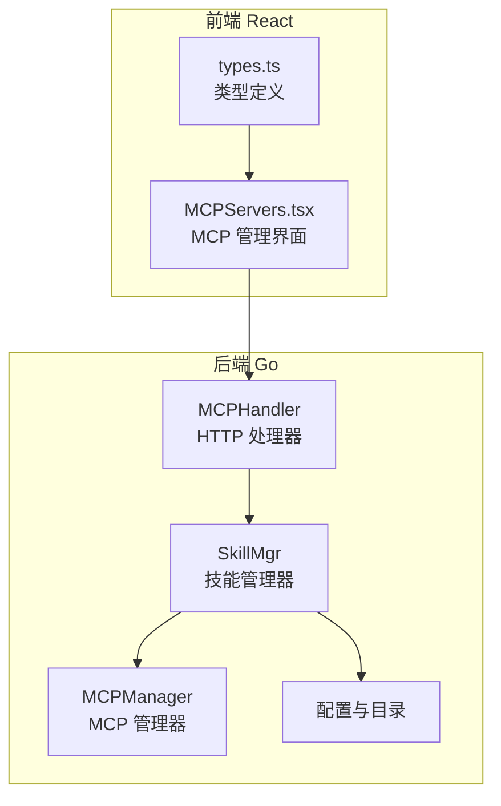
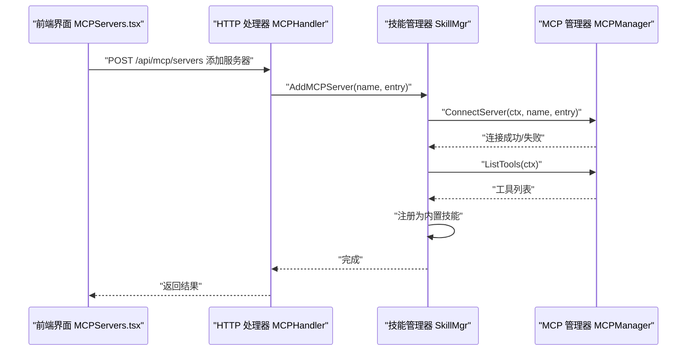
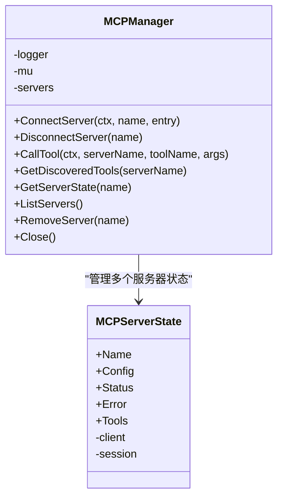
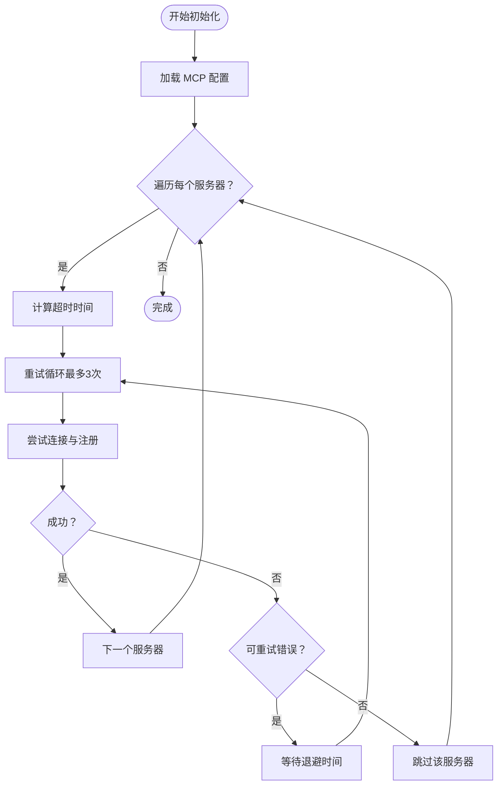
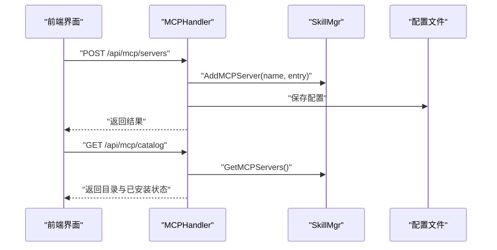
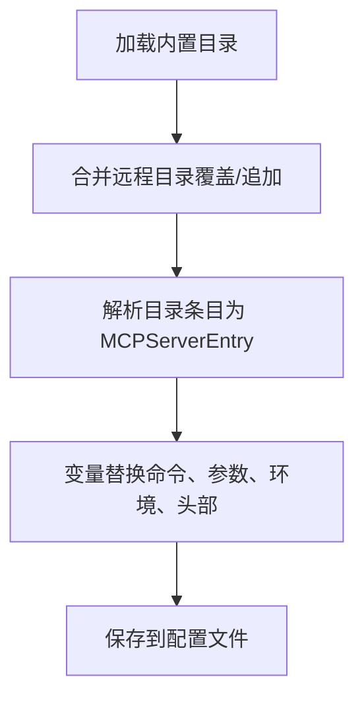
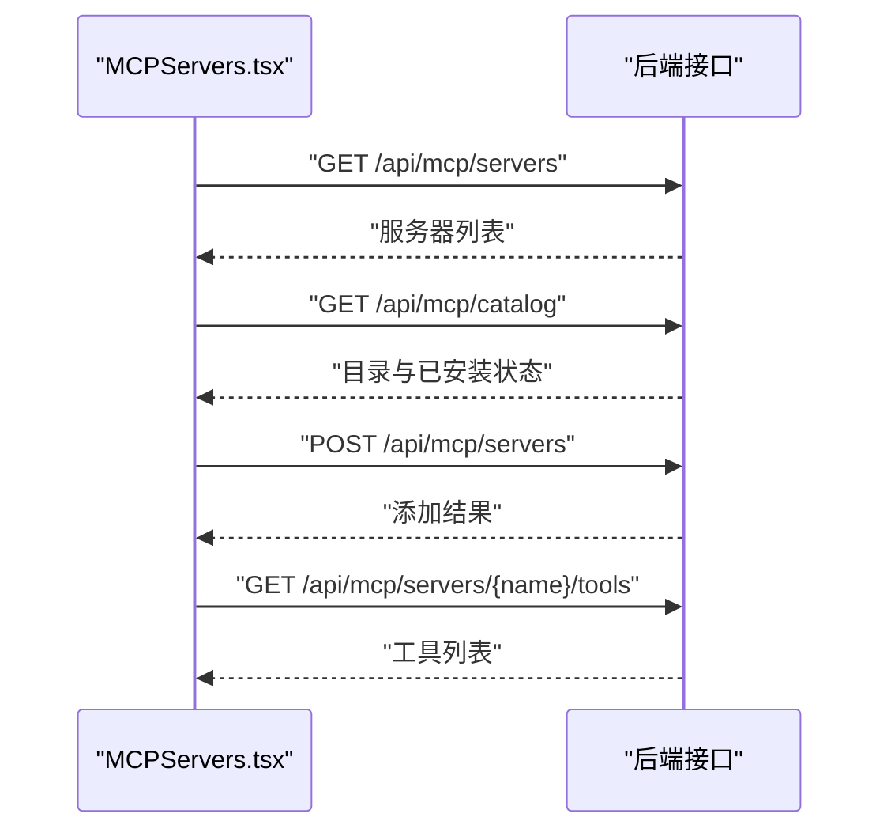
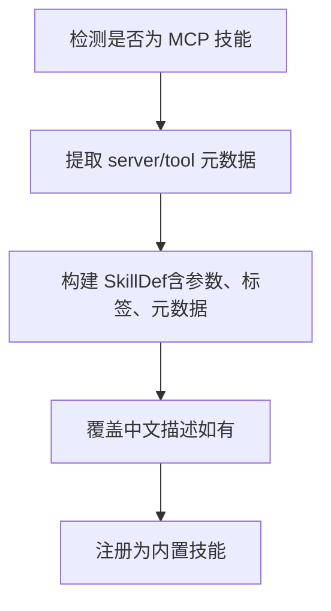
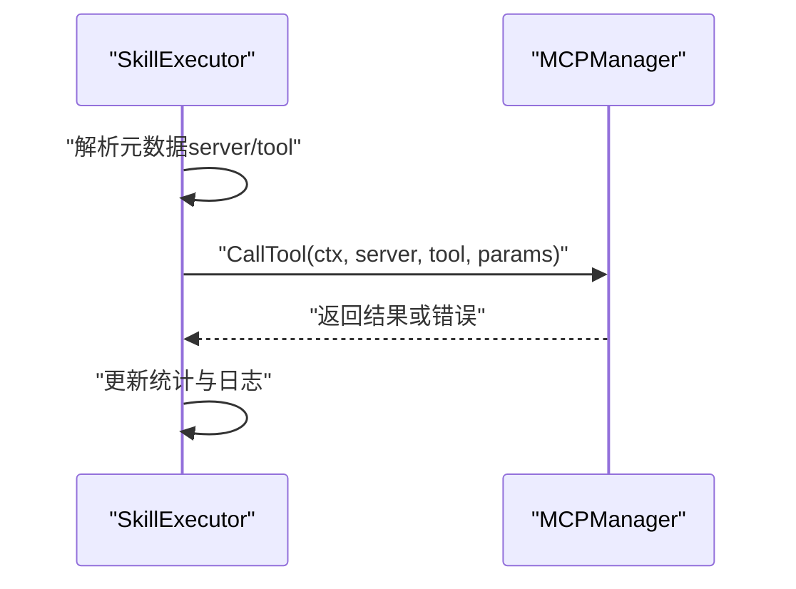
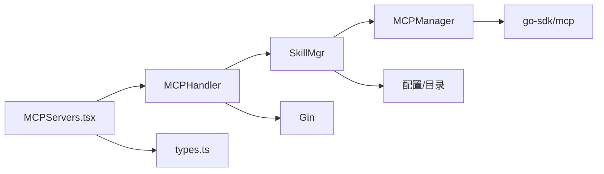

# MCP 协议支持

<cite>
**本文引用的文件**
- [internal/usecase/skills/mcp_manager.go](file://internal/usecase/skills/mcp_manager.go)
- [internal/usecase/skills/mcp_utils.go](file://internal/usecase/skills/mcp_utils.go)
- [internal/usecase/skills/executor.go](file://internal/usecase/skills/executor.go)
- [internal/usecase/skills/skill_mgr.go](file://internal/usecase/skills/skill_mgr.go)
- [internal/config/mcp.go](file://internal/config/mcp.go)
- [internal/config/mcp_catalog.go](file://internal/config/mcp_catalog.go)
- [internal/config/catalog/mcp_catalog.json](file://internal/config/catalog/mcp_catalog.json)
- [config/mcp_servers.json.template](file://config/mcp_servers.json.template)
- [internal/adapters/http/handlers/mcp.go](file://internal/adapters/http/handlers/mcp.go)
- [dashboard/src/components/MCPServers.tsx](file://dashboard/src/components/MCPServers.tsx)
- [dashboard/src/components/mcp/types.ts](file://dashboard/src/components/mcp/types.ts)
- [internal/usecase/skills/SKILL_DEVELOPMENT.md](file://internal/usecase/skills/SKILL_DEVELOPMENT.md)
</cite>

## 目录
1. [简介](#简介)
2. [项目结构](#项目结构)
3. [核心组件](#核心组件)
4. [架构总览](#架构总览)
5. [详细组件分析](#详细组件分析)
6. [依赖关系分析](#依赖关系分析)
7. [性能考量](#性能考量)
8. [故障排查指南](#故障排查指南)
9. [结论](#结论)
10. [附录](#附录)

## 简介
本文件系统性阐述 MindX 对 Model Context Protocol（MCP）协议的支持与实现，涵盖 MCP 管理器、服务器注册与配置、工具发现与调用、与内置技能系统的集成与无感切换、以及开发与运维最佳实践。读者将获得从架构到代码级实现的完整参考。

## 项目结构
MindX 的 MCP 支持横跨后端 Go 服务与前端 React 控制台两大层面：
- 后端 Go 层负责 MCP 服务器连接、工具发现、工具调用、与内置技能系统的统一调度。
- 前端 React 层提供 MCP 服务器管理界面，支持目录安装、自定义添加、工具列表查看与重启等操作。

**图表来源**
- [internal/usecase/skills/skill_mgr.go](file://internal/usecase/skills/skill_mgr.go#L36-L85)
- [internal/usecase/skills/mcp_manager.go](file://internal/usecase/skills/mcp_manager.go#L36-L47)
- [internal/adapters/http/handlers/mcp.go](file://internal/adapters/http/handlers/mcp.go#L13-L23)
- [dashboard/src/components/MCPServers.tsx](file://dashboard/src/components/MCPServers.tsx#L62-L86)

**章节来源**
- [internal/usecase/skills/skill_mgr.go](file://internal/usecase/skills/skill_mgr.go#L36-L85)
- [internal/adapters/http/handlers/mcp.go](file://internal/adapters/http/handlers/mcp.go#L13-L23)
- [dashboard/src/components/MCPServers.tsx](file://dashboard/src/components/MCPServers.tsx#L62-L86)

## 核心组件
- MCP 管理器（MCPManager）：负责与 MCP 服务器建立连接（stdio 或 SSE）、工具发现、工具调用、状态维护与资源清理。
- 技能管理器（SkillMgr）：负责加载与注册 MCP 工具为内置技能、索引构建、重连与重启、与内置技能系统协同。
- HTTP 处理器（MCPHandler）：提供 MCP 服务器的增删改查、目录安装、工具列表查询等接口。
- 配置与目录（config/mcp.go、config/mcp_catalog.go、mcp_catalog.json）：管理 MCP 服务器配置文件、目录项解析与变量替换、工具描述与标签映射。
- 前端界面（MCPServers.tsx、types.ts）：提供 MCP 服务器管理的可视化界面与交互。

**章节来源**
- [internal/usecase/skills/mcp_manager.go](file://internal/usecase/skills/mcp_manager.go#L36-L47)
- [internal/usecase/skills/skill_mgr.go](file://internal/usecase/skills/skill_mgr.go#L20-L34)
- [internal/adapters/http/handlers/mcp.go](file://internal/adapters/http/handlers/mcp.go#L13-L23)
- [internal/config/mcp.go](file://internal/config/mcp.go#L13-L29)
- [internal/config/mcp_catalog.go](file://internal/config/mcp_catalog.go#L16-L56)
- [internal/config/catalog/mcp_catalog.json](file://internal/config/catalog/mcp_catalog.json#L1-L755)
- [dashboard/src/components/MCPServers.tsx](file://dashboard/src/components/MCPServers.tsx#L13-L27)
- [dashboard/src/components/mcp/types.ts](file://dashboard/src/components/mcp/types.ts#L17-L36)

## 架构总览
下图展示 MCP 在 MindX 中的端到端流程：前端发起请求，HTTP 处理器调用技能管理器，技能管理器通过 MCP 管理器连接服务器并进行工具发现与调用，最终将结果返回给前端。

**图表来源**
- [internal/adapters/http/handlers/mcp.go](file://internal/adapters/http/handlers/mcp.go#L33-L90)
- [internal/usecase/skills/skill_mgr.go](file://internal/usecase/skills/skill_mgr.go#L508-L514)
- [internal/usecase/skills/mcp_manager.go](file://internal/usecase/skills/mcp_manager.go#L49-L141)

## 详细组件分析

### MCP 管理器（MCPManager）
职责与特性：
- 连接管理：支持 stdio（子进程）与 SSE（HTTP SSE）两种传输方式，自动注入环境变量与请求头。
- 工具发现：连接成功后调用 ListTools 获取工具清单并缓存。
- 工具调用：按 serverName 与 toolName 执行 CallTool，自动处理错误与状态更新。
- 状态与生命周期：维护连接状态、错误信息、工具列表；支持断开、移除与关闭。

关键实现要点：
- 传输选择与配置：根据配置类型选择 CommandTransport 或 SSEClientTransport，并对 SSE 注入自定义 headers。
- 环境变量与工作目录：stdio 时继承父进程环境并叠加用户配置，工作目录设为用户主目录以降低对 MindX 进程工作目录的依赖。
- 工具调用与内容提取：统一提取 TextContent 为字符串返回，错误时更新状态并返回可诊断的错误信息。

**图表来源**
- [internal/usecase/skills/mcp_manager.go](file://internal/usecase/skills/mcp_manager.go#L36-L47)
- [internal/usecase/skills/mcp_manager.go](file://internal/usecase/skills/mcp_manager.go#L25-L34)

**章节来源**
- [internal/usecase/skills/mcp_manager.go](file://internal/usecase/skills/mcp_manager.go#L49-L141)
- [internal/usecase/skills/mcp_manager.go](file://internal/usecase/skills/mcp_manager.go#L169-L204)
- [internal/usecase/skills/mcp_manager.go](file://internal/usecase/skills/mcp_manager.go#L217-L247)
- [internal/usecase/skills/mcp_manager.go](file://internal/usecase/skills/mcp_manager.go#L249-L278)

### 技能管理器（SkillMgr）与 MCP 集成
职责与特性：
- 初始化：并发初始化配置文件中的 MCP 服务器，每个服务器独立超时与重试策略。
- 工具注册：将 MCP 工具转换为内置技能定义，合并目录标签与中文描述，注册到技能系统并触发向量索引。
- 运行时管理：支持运行时添加、移除、重启 MCP 服务器，保持与内置技能系统的无缝衔接。
- 错误与重试：区分可重试错误（超时、连接拒绝等）与不可重试错误（EOF、方法不允许等），按策略退避重试。

**图表来源**
- [internal/usecase/skills/skill_mgr.go](file://internal/usecase/skills/skill_mgr.go#L373-L393)
- [internal/usecase/skills/skill_mgr.go](file://internal/usecase/skills/skill_mgr.go#L404-L449)
- [internal/usecase/skills/skill_mgr.go](file://internal/usecase/skills/skill_mgr.go#L451-L468)

**章节来源**
- [internal/usecase/skills/skill_mgr.go](file://internal/usecase/skills/skill_mgr.go#L373-L393)
- [internal/usecase/skills/skill_mgr.go](file://internal/usecase/skills/skill_mgr.go#L404-L449)
- [internal/usecase/skills/skill_mgr.go](file://internal/usecase/skills/skill_mgr.go#L470-L506)
- [internal/usecase/skills/skill_mgr.go](file://internal/usecase/skills/skill_mgr.go#L508-L527)
- [internal/usecase/skills/skill_mgr.go](file://internal/usecase/skills/skill_mgr.go#L529-L547)

### HTTP 处理器（MCPHandler）
职责与特性：
- 服务器管理：提供添加、删除、重启、查询工具列表等接口。
- 目录安装：从内置目录解析条目为 MCPServerEntry，持久化配置并异步连接。
- 配置持久化：读取、保存 MCP 服务器配置文件，支持运行时变更即时生效。

**图表来源**
- [internal/adapters/http/handlers/mcp.go](file://internal/adapters/http/handlers/mcp.go#L33-L90)
- [internal/adapters/http/handlers/mcp.go](file://internal/adapters/http/handlers/mcp.go#L162-L181)
- [internal/adapters/http/handlers/mcp.go](file://internal/adapters/http/handlers/mcp.go#L138-L160)

**章节来源**
- [internal/adapters/http/handlers/mcp.go](file://internal/adapters/http/handlers/mcp.go#L25-L136)
- [internal/adapters/http/handlers/mcp.go](file://internal/adapters/http/handlers/mcp.go#L162-L247)

### 配置与目录（config/mcp.go、mcp_catalog.go、mcp_catalog.json）
职责与特性：
- 配置文件：支持 stdio 与 SSE 两类连接方式，支持环境变量与请求头注入，支持启用/禁用。
- 目录解析：内置 MCP 服务器目录，支持变量占位符解析、工具描述与标签映射、远程目录合并。
- 工具描述匹配：提供多种匹配策略（精确、标准化、子串）以增强中文描述覆盖。

**图表来源**
- [internal/config/mcp_catalog.go](file://internal/config/mcp_catalog.go#L92-L117)
- [internal/config/mcp_catalog.go](file://internal/config/mcp_catalog.go#L119-L161)
- [internal/config/mcp.go](file://internal/config/mcp.go#L41-L64)

**章节来源**
- [internal/config/mcp.go](file://internal/config/mcp.go#L13-L29)
- [internal/config/mcp.go](file://internal/config/mcp.go#L41-L64)
- [internal/config/mcp.go](file://internal/config/mcp.go#L84-L105)
- [internal/config/mcp_catalog.go](file://internal/config/mcp_catalog.go#L58-L90)
- [internal/config/mcp_catalog.go](file://internal/config/mcp_catalog.go#L119-L161)
- [internal/config/mcp_catalog.go](file://internal/config/mcp_catalog.go#L185-L251)
- [internal/config/catalog/mcp_catalog.json](file://internal/config/catalog/mcp_catalog.json#L1-L755)

### 前端界面（MCPServers.tsx、types.ts）
职责与特性：
- 三栏视图：目录（catalog）、已安装（installed）、自定义（custom）。
- 目录安装：从内置目录一键安装，支持变量输入与默认值填充。
- 自定义添加：支持 SSE 与 stdio 两种模式，KV 编辑器管理 headers/env。
- 工具列表：按需拉取并展开显示工具名称与描述。
- 服务器管理：支持重启与删除，状态与错误信息直观展示。

**图表来源**
- [dashboard/src/components/MCPServers.tsx](file://dashboard/src/components/MCPServers.tsx#L94-L135)
- [dashboard/src/components/MCPServers.tsx](file://dashboard/src/components/MCPServers.tsx#L143-L188)
- [dashboard/src/components/MCPServers.tsx](file://dashboard/src/components/MCPServers.tsx#L202-L211)

**章节来源**
- [dashboard/src/components/MCPServers.tsx](file://dashboard/src/components/MCPServers.tsx#L62-L118)
- [dashboard/src/components/MCPServers.tsx](file://dashboard/src/components/MCPServers.tsx#L120-L135)
- [dashboard/src/components/MCPServers.tsx](file://dashboard/src/components/MCPServers.tsx#L143-L188)
- [dashboard/src/components/MCPServers.tsx](file://dashboard/src/components/MCPServers.tsx#L202-L211)
- [dashboard/src/components/mcp/types.ts](file://dashboard/src/components/mcp/types.ts#L17-L36)

### MCP 工具到内置技能的转换（mcp_utils.go）
职责与特性：
- 元数据识别：判断技能是否为 MCP 技能，提取 server 与 tool。
- 工具定义转换：将 MCP Tool 转换为内置技能定义，提取 JSON Schema 参数，合并目录标签与中文描述。

**图表来源**
- [internal/usecase/skills/mcp_utils.go](file://internal/usecase/skills/mcp_utils.go#L16-L31)
- [internal/usecase/skills/mcp_utils.go](file://internal/usecase/skills/mcp_utils.go#L33-L54)
- [internal/usecase/skills/mcp_utils.go](file://internal/usecase/skills/mcp_utils.go#L56-L97)

**章节来源**
- [internal/usecase/skills/mcp_utils.go](file://internal/usecase/skills/mcp_utils.go#L16-L54)
- [internal/usecase/skills/mcp_utils.go](file://internal/usecase/skills/mcp_utils.go#L56-L97)

### MCP 技能执行（executor.go）
职责与特性：
- 执行入口：根据技能定义判断是否为 MCP 技能，若是则通过 MCPManager 调用工具。
- 超时控制：按技能定义的超时时间设置上下文超时。
- 结果统计：记录执行成功/失败、耗时与最近执行时间。

**图表来源**
- [internal/usecase/skills/executor.go](file://internal/usecase/skills/executor.go#L105-L136)

**章节来源**
- [internal/usecase/skills/executor.go](file://internal/usecase/skills/executor.go#L105-L136)

## 依赖关系分析
- 组件耦合：
  - SkillMgr 依赖 MCPManager 与配置模块，负责生命周期与注册。
  - MCPHandler 依赖 SkillMgr 与配置模块，负责对外接口与配置持久化。
  - 前端 UI 依赖后端接口，通过 HTTP 与后端交互。
- 外部依赖：
  - go-sdk/mcp：MCP 客户端 SDK，提供 Transport、Client、Session、Tool 等能力。
  - Gin：HTTP 框架，提供路由与中间件。
  - Tauri/React：前端界面，提供 MCP 管理与目录安装体验。

**图表来源**
- [internal/adapters/http/handlers/mcp.go](file://internal/adapters/http/handlers/mcp.go#L13-L23)
- [internal/usecase/skills/skill_mgr.go](file://internal/usecase/skills/skill_mgr.go#L20-L34)
- [internal/usecase/skills/mcp_manager.go](file://internal/usecase/skills/mcp_manager.go#L14-L14)

**章节来源**
- [internal/adapters/http/handlers/mcp.go](file://internal/adapters/http/handlers/mcp.go#L13-L23)
- [internal/usecase/skills/skill_mgr.go](file://internal/usecase/skills/skill_mgr.go#L20-L34)
- [internal/usecase/skills/mcp_manager.go](file://internal/usecase/skills/mcp_manager.go#L14-L14)

## 性能考量
- 连接超时与重试：
  - SSE 默认 30 秒，stdio 默认 120 秒，避免冷启动导致的长时间阻塞。
  - 仅对超时、连接拒绝等可恢复错误进行重试，最多 3 次，按线性退避等待。
- 并发初始化：
  - 启动时并发初始化多个 MCP 服务器，互不影响，缩短整体启动时间。
- 工具索引：
  - 新增 MCP 工具后异步进入索引队列，避免阻塞连接流程，提升响应速度。
- 资源清理：
  - 关闭时释放所有 MCP 会话与客户端，防止资源泄漏。

**章节来源**
- [internal/usecase/skills/skill_mgr.go](file://internal/usecase/skills/skill_mgr.go#L395-L402)
- [internal/usecase/skills/skill_mgr.go](file://internal/usecase/skills/skill_mgr.go#L404-L449)
- [internal/usecase/skills/skill_mgr.go](file://internal/usecase/skills/skill_mgr.go#L243-L260)
- [internal/usecase/skills/mcp_manager.go](file://internal/usecase/skills/mcp_manager.go#L261-L278)

## 故障排查指南
常见问题与定位建议：
- 连接失败（stdio）：
  - 检查命令与参数是否正确，确认工作目录与环境变量。
  - 观察 stderr 输出，必要时增加日志级别。
- 连接失败（SSE）：
  - 校验 URL 与认证头，确认网络可达与证书有效。
  - 检查 headerRoundTripper 是否正确注入了认证信息。
- 工具调用失败：
  - 确认 serverName 与 toolName 是否与发现的一致。
  - 检查参数类型与必填项，核对 JSON Schema。
- 无法重试：
  - 若出现 EOF 或方法不允许等错误，属于不可重试，需手动修复配置后重启。
- 前端安装失败：
  - 查看控制台错误提示，确认必填变量是否填写，网络是否正常。

**章节来源**
- [internal/usecase/skills/mcp_manager.go](file://internal/usecase/skills/mcp_manager.go#L106-L114)
- [internal/usecase/skills/mcp_manager.go](file://internal/usecase/skills/mcp_manager.go#L190-L197)
- [internal/usecase/skills/skill_mgr.go](file://internal/usecase/skills/skill_mgr.go#L451-L468)
- [internal/adapters/http/handlers/mcp.go](file://internal/adapters/http/handlers/mcp.go#L183-L247)

## 结论
MindX 的 MCP 支持以 SkillMgr 为核心，结合 MCPManager 与 HTTP 处理器，实现了 MCP 服务器的灵活接入、工具的自动发现与注册、以及与内置技能系统的无缝融合。通过目录化管理、变量解析、中文描述覆盖与智能重试机制，系统在易用性与稳定性之间取得良好平衡。前端界面进一步降低了 MCP 服务器的使用门槛，使用户能够快速完成安装、配置与运维。

## 附录

### MCP 服务器注册与配置流程
- 配置文件模板：mcp_servers.json.template 定义了 mcpServers 字段结构。
- 运行时添加：通过 HTTP 接口 POST /api/mcp/servers，持久化到配置文件后异步连接。
- 目录安装：GET /api/mcp/catalog 获取目录，POST /api/mcp/catalog/install 安装并异步连接。

**章节来源**
- [config/mcp_servers.json.template](file://config/mcp_servers.json.template#L1-L4)
- [internal/adapters/http/handlers/mcp.go](file://internal/adapters/http/handlers/mcp.go#L33-L90)
- [internal/adapters/http/handlers/mcp.go](file://internal/adapters/http/handlers/mcp.go#L183-L247)

### MCP 与内置技能系统的集成与无感切换
- MCP 技能通过元数据标记（metadata.mcp.server/tool），在工具发现阶段转换为内置技能定义。
- 注册后参与统一的搜索、索引与执行流程，与本地脚本技能无差异。
- 执行时由 SkillExecutor 根据元数据判断走 MCP 路径，保证一致性与透明性。

**章节来源**
- [internal/usecase/skills/mcp_utils.go](file://internal/usecase/skills/mcp_utils.go#L16-L54)
- [internal/usecase/skills/executor.go](file://internal/usecase/skills/executor.go#L105-L136)
- [internal/usecase/skills/skill_mgr.go](file://internal/usecase/skills/skill_mgr.go#L470-L506)

### MCP 服务器开发指南与工具创建示例
- 开发步骤概览：
  - 准备 MCP 服务器（支持 stdio 或 SSE），确保 ListTools 与 CallTool 正常工作。
  - 在目录中新增条目（或自定义添加），配置连接方式、命令/URL、变量与头部。
  - 安装后系统自动发现工具并注册为内置技能，可在前端与对话中使用。
- 最佳实践：
  - 使用清晰的工具命名与描述，便于中文覆盖与匹配。
  - 合理设置超时与错误处理，提升鲁棒性。
  - 通过目录变量机制管理敏感信息（如 API Key）。

**章节来源**
- [internal/usecase/skills/SKILL_DEVELOPMENT.md](file://internal/usecase/skills/SKILL_DEVELOPMENT.md#L365-L416)
- [internal/config/mcp_catalog.go](file://internal/config/mcp_catalog.go#L119-L161)
- [internal/config/catalog/mcp_catalog.json](file://internal/config/catalog/mcp_catalog.json#L1-L755)