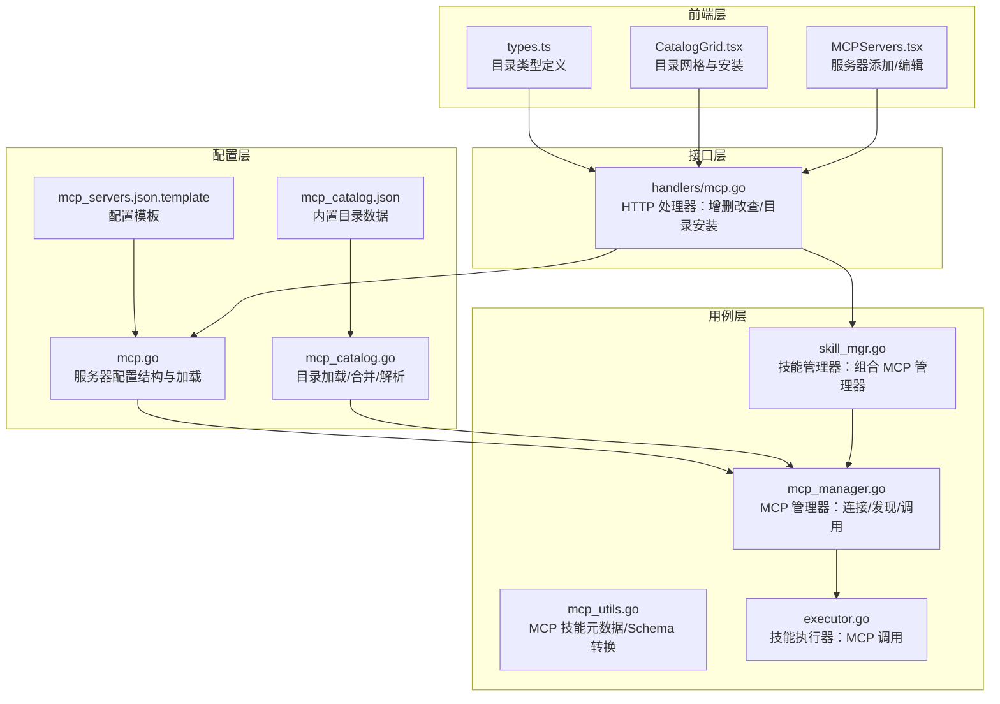
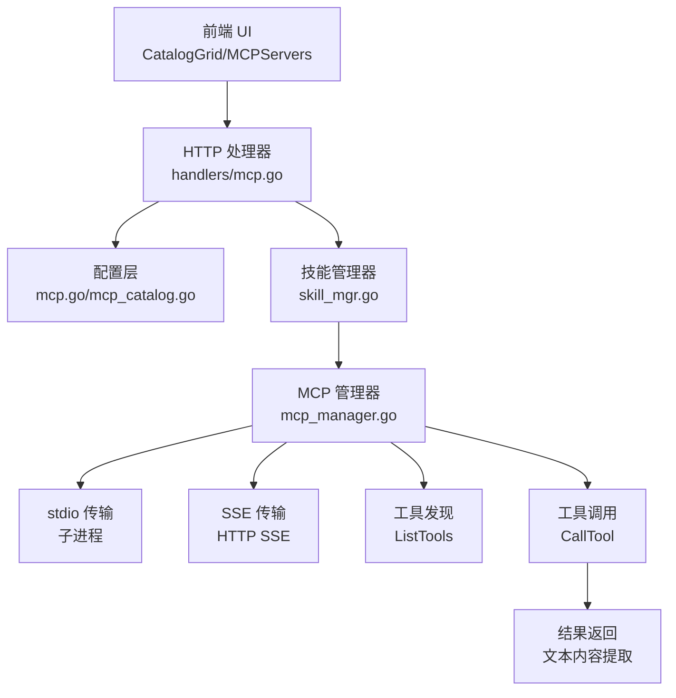
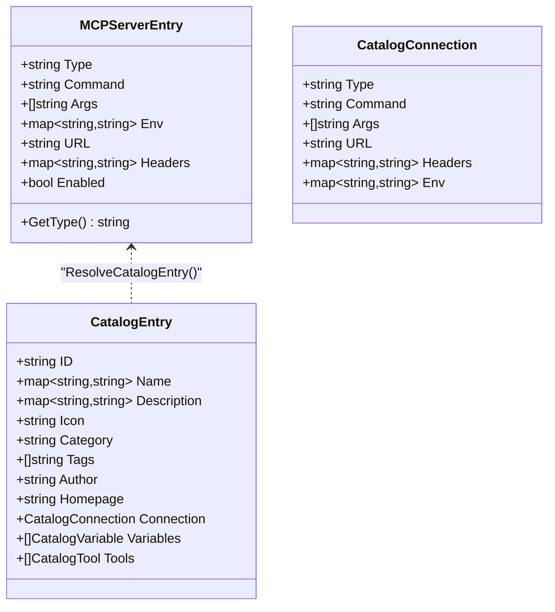
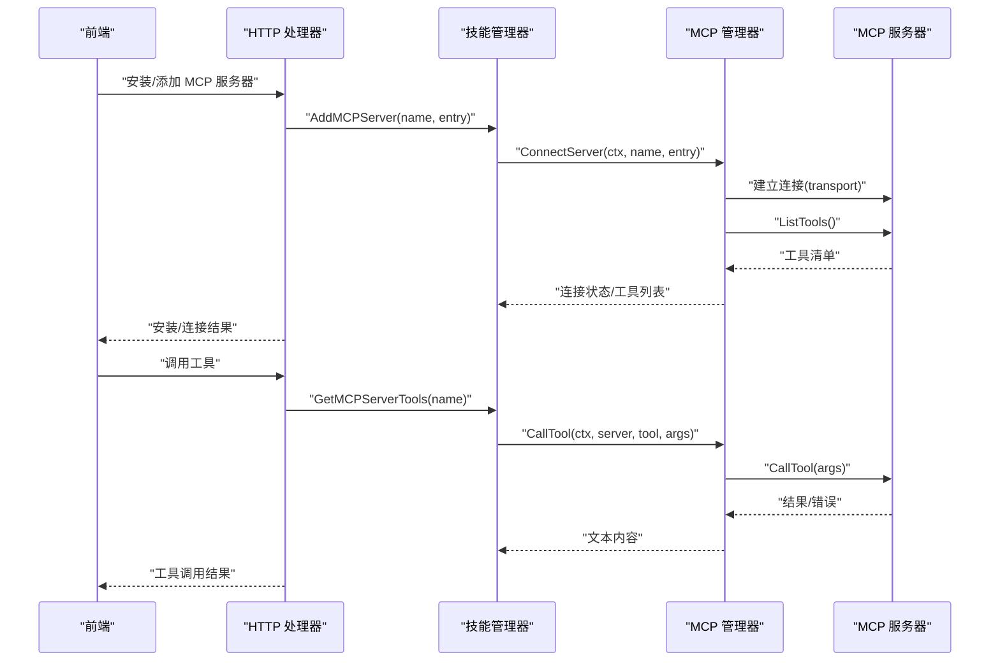
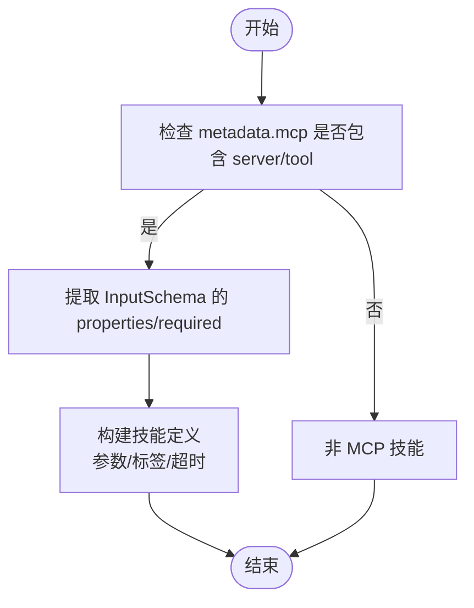
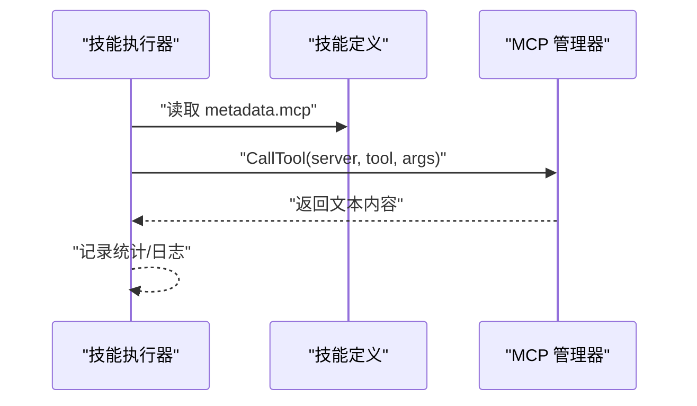
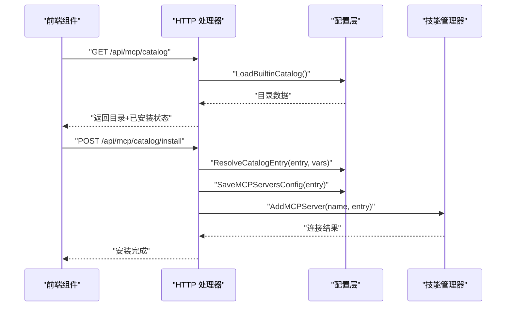
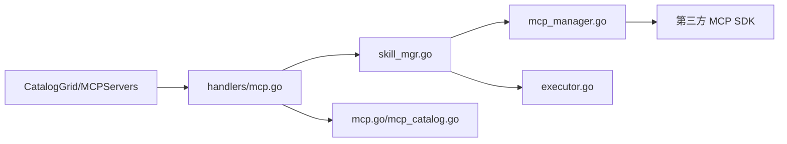

# MCP 协议概述

<cite>
**本文引用的文件**
- [internal/config/mcp.go](file://internal/config/mcp.go)
- [internal/config/mcp_catalog.go](file://internal/config/mcp_catalog.go)
- [internal/config/catalog/mcp_catalog.json](file://internal/config/catalog/mcp_catalog.json)
- [internal/config/mcp_servers.json.template](file://internal/config/mcp_servers.json.template)
- [internal/usecase/skills/mcp_manager.go](file://internal/usecase/skills/mcp_manager.go)
- [internal/usecase/skills/mcp_utils.go](file://internal/usecase/skills/mcp_utils.go)
- [internal/usecase/skills/skill_mgr.go](file://internal/usecase/skills/skill_mgr.go)
- [internal/usecase/skills/executor.go](file://internal/usecase/skills/executor.go)
- [internal/adapters/http/handlers/mcp.go](file://internal/adapters/http/handlers/mcp.go)
- [dashboard/src/components/mcp/types.ts](file://dashboard/src/components/mcp/types.ts)
- [dashboard/src/components/mcp/CatalogGrid.tsx](file://dashboard/src/components/mcp/CatalogGrid.tsx)
- [dashboard/src/components/MCPServers.tsx](file://dashboard/src/components/MCPServers.tsx)
- [internal/entity/tool.go](file://internal/entity/tool.go)
- [internal/usecase/skills/SKILL_DEVELOPMENT.md](file://internal/usecase/skills/SKILL_DEVELOPMENT.md)
</cite>

## 目录
1. [简介](#简介)
2. [项目结构](#项目结构)
3. [核心组件](#核心组件)
4. [架构总览](#架构总览)
5. [详细组件分析](#详细组件分析)
6. [依赖关系分析](#依赖关系分析)
7. [性能考量](#性能考量)
8. [故障排除指南](#故障排除指南)
9. [结论](#结论)
10. [附录](#附录)

## 简介
本文件系统性介绍 MindX 中对 MCP（Model Context Protocol）协议的支持与实现，涵盖协议基本概念、设计理念、核心特性（工具发现、工具调用、内容协商）、与传统 API 的差异与优势、在智能体生态中的价值，并提供使用场景、最佳实践与完整的入门指南。MindX 通过 MCP 实现对外部工具与服务的统一接入，既支持本地子进程（stdio）也支持远端 HTTP SSE 传输，具备灵活的目录化安装与配置管理能力。

## 项目结构
围绕 MCP 的实现主要分布在以下层次：
- 配置层：负责 MCP 服务器配置、目录解析与变量替换
- 用例层：MCP 管理器负责连接、工具发现、工具调用；技能执行器负责将 MCP 技能无缝融入技能体系
- 接口层：HTTP 处理器提供 MCP 服务器管理与目录安装接口
- 前端层：MCP 目录展示、安装对话框与服务器添加界面

**图表来源**
- [internal/config/mcp.go](file://internal/config/mcp.go#L1-L106)
- [internal/config/mcp_catalog.go](file://internal/config/mcp_catalog.go#L1-L252)
- [internal/config/catalog/mcp_catalog.json](file://internal/config/catalog/mcp_catalog.json#L1-L755)
- [internal/config/mcp_servers.json.template](file://internal/config/mcp_servers.json.template#L1-L4)
- [internal/usecase/skills/mcp_manager.go](file://internal/usecase/skills/mcp_manager.go#L1-L292)
- [internal/usecase/skills/mcp_utils.go](file://internal/usecase/skills/mcp_utils.go#L1-L132)
- [internal/usecase/skills/executor.go](file://internal/usecase/skills/executor.go#L1-L200)
- [internal/usecase/skills/skill_mgr.go](file://internal/usecase/skills/skill_mgr.go#L1-L200)
- [internal/adapters/http/handlers/mcp.go](file://internal/adapters/http/handlers/mcp.go#L1-L248)
- [dashboard/src/components/mcp/types.ts](file://dashboard/src/components/mcp/types.ts#L1-L47)
- [dashboard/src/components/mcp/CatalogGrid.tsx](file://dashboard/src/components/mcp/CatalogGrid.tsx#L1-L150)
- [dashboard/src/components/MCPServers.tsx](file://dashboard/src/components/MCPServers.tsx#L309-L353)

**章节来源**
- [internal/config/mcp.go](file://internal/config/mcp.go#L1-L106)
- [internal/config/mcp_catalog.go](file://internal/config/mcp_catalog.go#L1-L252)
- [internal/config/catalog/mcp_catalog.json](file://internal/config/catalog/mcp_catalog.json#L1-L755)
- [internal/config/mcp_servers.json.template](file://internal/config/mcp_servers.json.template#L1-L4)
- [internal/usecase/skills/mcp_manager.go](file://internal/usecase/skills/mcp_manager.go#L1-L292)
- [internal/usecase/skills/mcp_utils.go](file://internal/usecase/skills/mcp_utils.go#L1-L132)
- [internal/usecase/skills/executor.go](file://internal/usecase/skills/executor.go#L1-L200)
- [internal/usecase/skills/skill_mgr.go](file://internal/usecase/skills/skill_mgr.go#L1-L200)
- [internal/adapters/http/handlers/mcp.go](file://internal/adapters/http/handlers/mcp.go#L1-L248)
- [dashboard/src/components/mcp/types.ts](file://dashboard/src/components/mcp/types.ts#L1-L47)
- [dashboard/src/components/mcp/CatalogGrid.tsx](file://dashboard/src/components/mcp/CatalogGrid.tsx#L1-L150)
- [dashboard/src/components/MCPServers.tsx](file://dashboard/src/components/MCPServers.tsx#L309-L353)

## 核心组件
- MCP 服务器配置与解析
  - 服务器配置结构支持 stdio 与 SSE 两类传输，支持命令、参数、环境变量、工作目录、URL、Headers 等字段
  - 提供配置加载/保存、环境变量占位符解析（支持本地上下文与系统环境）
- MCP 目录系统
  - 内置目录包含多个官方与社区 MCP 服务器条目，支持变量定义（字符串/密钥/路径/URL）、连接信息、工具清单与多语言描述
  - 支持内置目录与远程目录合并，远程条目覆盖同 ID 的内置条目
- MCP 管理器
  - 支持 stdio 子进程与 SSE 远端连接，自动建立会话并进行工具发现（ListTools）
  - 提供工具调用封装，统一错误处理与内容提取
- 技能执行器与技能管理器
  - 将 MCP 工具转换为技能定义，支持参数 Schema 自动抽取与标签合并
  - 执行器按技能类型路由：内部函数、MCP 工具、外部脚本
- HTTP 处理器
  - 提供 MCP 服务器增删改查、工具列表查询、目录安装、目录列表等接口
- 前端组件
  - 目录网格展示、变量收集与安装、服务器添加/编辑表单

**章节来源**
- [internal/config/mcp.go](file://internal/config/mcp.go#L13-L106)
- [internal/config/mcp_catalog.go](file://internal/config/mcp_catalog.go#L16-L161)
- [internal/config/catalog/mcp_catalog.json](file://internal/config/catalog/mcp_catalog.json#L1-L755)
- [internal/usecase/skills/mcp_manager.go](file://internal/usecase/skills/mcp_manager.go#L36-L292)
- [internal/usecase/skills/mcp_utils.go](file://internal/usecase/skills/mcp_utils.go#L11-L132)
- [internal/usecase/skills/executor.go](file://internal/usecase/skills/executor.go#L57-L136)
- [internal/adapters/http/handlers/mcp.go](file://internal/adapters/http/handlers/mcp.go#L25-L248)
- [dashboard/src/components/mcp/types.ts](file://dashboard/src/components/mcp/types.ts#L3-L47)
- [dashboard/src/components/mcp/CatalogGrid.tsx](file://dashboard/src/components/mcp/CatalogGrid.tsx#L12-L150)
- [dashboard/src/components/MCPServers.tsx](file://dashboard/src/components/MCPServers.tsx#L309-L353)

## 架构总览
下图展示了 MCP 在 MindX 中的端到端架构：前端通过 HTTP 接口与后端交互，后端根据配置连接 MCP 服务器，完成工具发现与调用，并将结果返回给前端或技能执行器。

**图表来源**
- [internal/adapters/http/handlers/mcp.go](file://internal/adapters/http/handlers/mcp.go#L1-L248)
- [internal/config/mcp.go](file://internal/config/mcp.go#L1-L106)
- [internal/config/mcp_catalog.go](file://internal/config/mcp_catalog.go#L1-L252)
- [internal/usecase/skills/skill_mgr.go](file://internal/usecase/skills/skill_mgr.go#L1-L200)
- [internal/usecase/skills/mcp_manager.go](file://internal/usecase/skills/mcp_manager.go#L49-L204)

## 详细组件分析

### MCP 服务器配置与目录系统
- 配置结构
  - 支持类型：stdio（本地子进程）与 sse（远端 HTTP SSE）
  - stdio：命令、参数、环境变量、工作目录
  - sse：URL、Headers；支持从环境变量与本地上下文中解析占位符
- 目录系统
  - 内置目录包含多个服务器条目，每条目定义连接方式、变量、工具清单与多语言描述
  - 支持远程目录拉取与合并，远程条目覆盖同 ID 的内置条目
  - 提供变量解析、工具描述匹配与标签提取能力

**图表来源**
- [internal/config/mcp.go](file://internal/config/mcp.go#L13-L37)
- [internal/config/mcp_catalog.go](file://internal/config/mcp_catalog.go#L21-L56)
- [internal/config/mcp_catalog.go](file://internal/config/mcp_catalog.go#L119-L161)

**章节来源**
- [internal/config/mcp.go](file://internal/config/mcp.go#L13-L106)
- [internal/config/mcp_catalog.go](file://internal/config/mcp_catalog.go#L58-L161)
- [internal/config/catalog/mcp_catalog.json](file://internal/config/catalog/mcp_catalog.json#L1-L755)

### MCP 管理器：连接、发现与调用
- 连接
  - stdio：继承父进程环境，合并用户配置的环境变量，设置工作目录为用户主目录
  - sse：可选注入 Headers，支持从环境变量与本地上下文解析占位符
- 工具发现
  - 连接成功后调用 ListTools 获取工具清单，记录工具名与描述
- 工具调用
  - CallTool 封装参数传递与错误处理，统一提取文本内容返回

**图表来源**
- [internal/adapters/http/handlers/mcp.go](file://internal/adapters/http/handlers/mcp.go#L33-L136)
- [internal/usecase/skills/skill_mgr.go](file://internal/usecase/skills/skill_mgr.go#L1-L200)
- [internal/usecase/skills/mcp_manager.go](file://internal/usecase/skills/mcp_manager.go#L49-L204)

**章节来源**
- [internal/usecase/skills/mcp_manager.go](file://internal/usecase/skills/mcp_manager.go#L49-L204)

### MCP 技能元数据与参数 Schema 转换
- 元数据识别
  - 通过技能定义中的 metadata.mcp 字段识别 MCP 技能，要求包含 server 与 tool
- 参数 Schema 转换
  - 从工具的 InputSchema 抽取参数定义，支持 properties 与 required 字段
  - 生成技能定义，合并标签（含 server 名称）

**图表来源**
- [internal/usecase/skills/mcp_utils.go](file://internal/usecase/skills/mcp_utils.go#L16-L97)

**章节来源**
- [internal/usecase/skills/mcp_utils.go](file://internal/usecase/skills/mcp_utils.go#L16-L132)

### 技能执行器与 MCP 集成
- 执行路由
  - 内部技能、MCP 技能、外部脚本三类执行路径
- MCP 调用
  - 从技能定义提取 server/tool，设置超时上下文，调用 MCP 管理器
  - 成功/失败统计与日志记录

**图表来源**
- [internal/usecase/skills/executor.go](file://internal/usecase/skills/executor.go#L105-L136)
- [internal/usecase/skills/mcp_utils.go](file://internal/usecase/skills/mcp_utils.go#L33-L54)

**章节来源**
- [internal/usecase/skills/executor.go](file://internal/usecase/skills/executor.go#L57-L136)
- [internal/usecase/skills/mcp_utils.go](file://internal/usecase/skills/mcp_utils.go#L33-L54)

### HTTP 处理器与前端交互
- 服务器管理
  - 列表、新增、删除、重启、查询工具
  - 新增/删除时同步持久化配置文件
- 目录安装
  - 校验必填变量，解析目录条目为配置，先持久化再异步连接
- 前端类型与组件
  - 目录类型定义、目录网格展示与安装对话框、服务器添加/编辑表单

**图表来源**
- [internal/adapters/http/handlers/mcp.go](file://internal/adapters/http/handlers/mcp.go#L162-L248)
- [internal/config/mcp_catalog.go](file://internal/config/mcp_catalog.go#L119-L161)
- [internal/config/mcp.go](file://internal/config/mcp.go#L66-L80)

**章节来源**
- [internal/adapters/http/handlers/mcp.go](file://internal/adapters/http/handlers/mcp.go#L25-L248)
- [dashboard/src/components/mcp/types.ts](file://dashboard/src/components/mcp/types.ts#L3-L47)
- [dashboard/src/components/mcp/CatalogGrid.tsx](file://dashboard/src/components/mcp/CatalogGrid.tsx#L12-L150)
- [dashboard/src/components/MCPServers.tsx](file://dashboard/src/components/MCPServers.tsx#L309-L353)

## 依赖关系分析
- 组件耦合
  - MCP 管理器独立于具体传输类型，通过 Transport 接口抽象 stdio 与 SSE
  - 技能执行器依赖 MCP 管理器，但对上层屏蔽 MCP 细节
  - HTTP 处理器依赖配置层与技能管理器，负责编排与持久化
- 外部依赖
  - 使用第三方 MCP Go SDK 进行客户端会话与工具调用
  - 前端使用 KV 编辑器处理键值对变量（如 Headers）

**图表来源**
- [internal/adapters/http/handlers/mcp.go](file://internal/adapters/http/handlers/mcp.go#L1-L248)
- [internal/usecase/skills/skill_mgr.go](file://internal/usecase/skills/skill_mgr.go#L1-L200)
- [internal/usecase/skills/mcp_manager.go](file://internal/usecase/skills/mcp_manager.go#L1-L292)
- [internal/usecase/skills/executor.go](file://internal/usecase/skills/executor.go#L1-L200)
- [internal/config/mcp.go](file://internal/config/mcp.go#L1-L106)
- [internal/config/mcp_catalog.go](file://internal/config/mcp_catalog.go#L1-L252)

**章节来源**
- [internal/adapters/http/handlers/mcp.go](file://internal/adapters/http/handlers/mcp.go#L1-L248)
- [internal/usecase/skills/skill_mgr.go](file://internal/usecase/skills/skill_mgr.go#L1-L200)
- [internal/usecase/skills/mcp_manager.go](file://internal/usecase/skills/mcp_manager.go#L1-L292)
- [internal/usecase/skills/executor.go](file://internal/usecase/skills/executor.go#L1-L200)
- [internal/config/mcp.go](file://internal/config/mcp.go#L1-L106)
- [internal/config/mcp_catalog.go](file://internal/config/mcp_catalog.go#L1-L252)

## 性能考量
- 连接与会话
  - stdio 传输建议合理设置工作目录与环境变量，避免不必要的权限与路径问题
  - SSE 传输建议复用 HTTP 客户端与连接池，减少握手开销
- 工具调用
  - 为每个技能设置合理的超时时间，避免长时间阻塞
  - 对频繁调用的工具进行缓存与重试策略（结合业务场景）
- 目录与配置
  - 目录合并与变量解析发生在安装阶段，尽量减少运行时解析成本
  - 配置文件读写采用原子写入，避免并发冲突

## 故障排除指南
- 连接失败
  - 检查服务器类型与必要字段（stdio 的 command 或 SSE 的 url）
  - 校验环境变量占位符是否被正确解析（本地上下文优先）
- 工具不可用
  - 确认工具发现是否成功，检查工具名大小写与分隔符差异（支持标准化匹配）
  - 若返回错误内容，检查工具参数与输入 Schema
- 前端安装异常
  - 确认必填变量是否填写或使用默认值
  - 检查网络连通性（SSE）与命令可执行性（stdio）

**章节来源**
- [internal/adapters/http/handlers/mcp.go](file://internal/adapters/http/handlers/mcp.go#L57-L89)
- [internal/config/mcp.go](file://internal/config/mcp.go#L84-L105)
- [internal/config/mcp_catalog.go](file://internal/config/mcp_catalog.go#L212-L251)

## 结论
MindX 对 MCP 的实现提供了统一、可扩展的工具接入能力：通过目录化安装、灵活的传输方式与完善的生命周期管理，既满足了快速集成外部工具的需求，又保持了与现有技能体系的一致性。该能力在智能体生态中具有重要价值，能够降低工具集成门槛、提升互操作性与可移植性。

## 附录

### MCP 协议与传统 API 的区别与优势
- 协议化
  - MCP 以协议形式定义工具发现与调用规范，避免硬编码 API 调用
- 可发现性
  - 通过 ListTools 自动发现工具与参数 Schema，减少手工维护成本
- 内容协商
  - 支持多种内容类型与结构化响应，便于模型理解与消费
- 传输抽象
  - stdio 与 SSE 两种传输方式适配不同部署场景，提升灵活性

### 使用场景与最佳实践
- 使用场景
  - 文件系统操作、网络搜索、浏览器自动化、知识图谱记忆、文档检索、消息推送等
- 最佳实践
  - 使用目录安装标准化工具，明确变量与权限
  - 为每个工具设置合理超时与错误处理
  - 在前端使用目录网格与安装对话框提升用户体验
  - 对关键工具进行监控与日志记录

### 入门指南
- 安装与配置
  - 通过目录选择并安装 MCP 服务器，填写必要变量
  - 或手动添加 stdio/SSE 服务器，保存至配置文件
- 开发 MCP 技能
  - 在 SKILL.md 中通过 metadata.mcp 标注 server 与 tool
  - 参数定义遵循 InputSchema，MindX 自动抽取并生成技能定义
- 调试与运维
  - 使用 HTTP 接口查看工具列表与服务器状态
  - 关注日志与错误信息，及时修复连接与参数问题

**章节来源**
- [internal/usecase/skills/SKILL_DEVELOPMENT.md](file://internal/usecase/skills/SKILL_DEVELOPMENT.md#L365-L452)
- [internal/config/mcp_servers.json.template](file://internal/config/mcp_servers.json.template#L1-L4)
- [internal/adapters/http/handlers/mcp.go](file://internal/adapters/http/handlers/mcp.go#L162-L248)
- [dashboard/src/components/mcp/CatalogGrid.tsx](file://dashboard/src/components/mcp/CatalogGrid.tsx#L12-L150)
- [dashboard/src/components/MCPServers.tsx](file://dashboard/src/components/MCPServers.tsx#L309-L353)