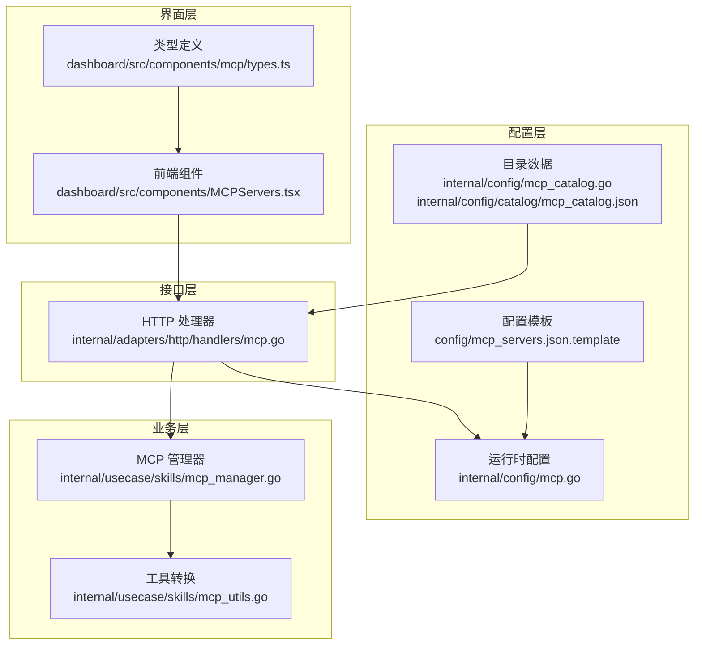
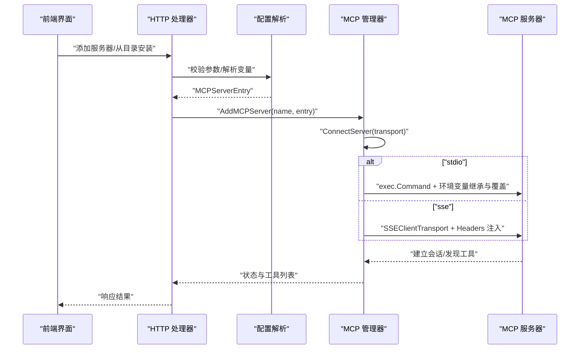
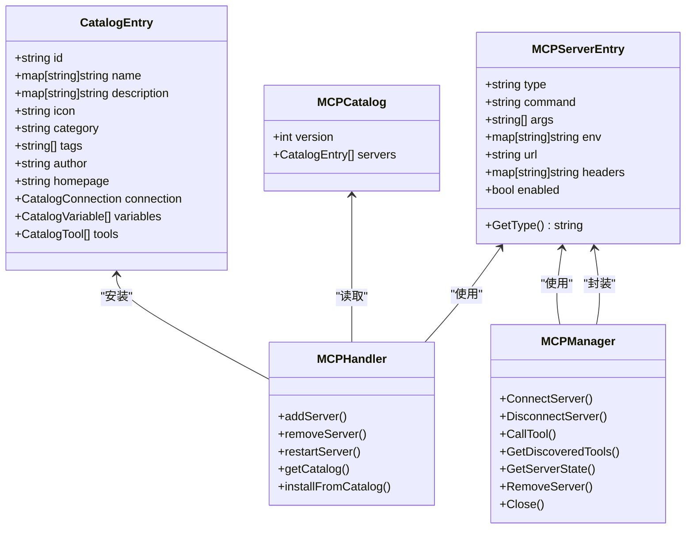

# MCP 服务器配置

<cite>
**本文引用的文件**
- [config/mcp_servers.json.template](file://config/mcp_servers.json.template)
- [internal/config/mcp.go](file://internal/config/mcp.go)
- [internal/config/mcp_catalog.go](file://internal/config/mcp_catalog.go)
- [internal/config/catalog/mcp_catalog.json](file://internal/config/catalog/mcp_catalog.json)
- [internal/adapters/http/handlers/mcp.go](file://internal/adapters/http/handlers/mcp.go)
- [internal/usecase/skills/mcp_manager.go](file://internal/usecase/skills/mcp_manager.go)
- [internal/usecase/skills/mcp_utils.go](file://internal/usecase/skills/mcp_utils.go)
- [dashboard/src/components/MCPServers.tsx](file://dashboard/src/components/MCPServers.tsx)
- [dashboard/src/components/mcp/types.ts](file://dashboard/src/components/mcp/types.ts)
</cite>

## 目录
1. [简介](#简介)
2. [项目结构](#项目结构)
3. [核心组件](#核心组件)
4. [架构总览](#架构总览)
5. [详细组件分析](#详细组件分析)
6. [依赖关系分析](#依赖关系分析)
7. [性能考虑](#性能考虑)
8. [故障排除指南](#故障排除指南)
9. [结论](#结论)
10. [附录](#附录)

## 简介
本文件为 MCP（Model Context Protocol）服务器配置的完整技术文档，涵盖配置格式、参数说明、服务器条目结构、传输方式差异、环境变量解析与占位符替换、注册与目录管理、配置验证、热更新与错误处理机制，并提供配置示例与故障排除指南，帮助开发者快速理解并正确配置 MCP 服务器。

## 项目结构
MCP 服务器配置相关的核心文件分布于以下位置：
- 配置模板与目录：config/mcp_servers.json.template、internal/config/catalog/mcp_catalog.json
- 配置模型与解析：internal/config/mcp.go、internal/config/mcp_catalog.go
- HTTP 接口与持久化：internal/adapters/http/handlers/mcp.go
- 运行时管理与工具转换：internal/usecase/skills/mcp_manager.go、internal/usecase/skills/mcp_utils.go
- 前端界面：dashboard/src/components/MCPServers.tsx、dashboard/src/components/mcp/types.ts

图表来源
- [config/mcp_servers.json.template](file://config/mcp_servers.json.template#L1-L4)
- [internal/config/mcp.go](file://internal/config/mcp.go#L13-L29)
- [internal/config/mcp_catalog.go](file://internal/config/mcp_catalog.go#L16-L56)
- [internal/adapters/http/handlers/mcp.go](file://internal/adapters/http/handlers/mcp.go#L13-L23)
- [internal/usecase/skills/mcp_manager.go](file://internal/usecase/skills/mcp_manager.go#L25-L40)
- [internal/usecase/skills/mcp_utils.go](file://internal/usecase/skills/mcp_utils.go#L11-L14)
- [dashboard/src/components/MCPServers.tsx](file://dashboard/src/components/MCPServers.tsx#L62-L81)
- [dashboard/src/components/mcp/types.ts](file://dashboard/src/components/mcp/types.ts#L17-L36)

章节来源
- [config/mcp_servers.json.template](file://config/mcp_servers.json.template#L1-L4)
- [internal/config/mcp.go](file://internal/config/mcp.go#L13-L29)
- [internal/config/mcp_catalog.go](file://internal/config/mcp_catalog.go#L16-L56)
- [internal/adapters/http/handlers/mcp.go](file://internal/adapters/http/handlers/mcp.go#L13-L23)
- [internal/usecase/skills/mcp_manager.go](file://internal/usecase/skills/mcp_manager.go#L25-L40)
- [internal/usecase/skills/mcp_utils.go](file://internal/usecase/skills/mcp_utils.go#L11-L14)
- [dashboard/src/components/MCPServers.tsx](file://dashboard/src/components/MCPServers.tsx#L62-L81)
- [dashboard/src/components/mcp/types.ts](file://dashboard/src/components/mcp/types.ts#L17-L36)

## 核心组件
- 配置模型与解析
  - MCPServersConfig：顶层配置容器，包含 mcpServers 映射
  - MCPServerEntry：单个 MCP 服务器条目，支持 stdio 与 sse 两种传输方式
  - 环境变量解析：支持 ${VAR} 占位符，优先使用本地上下文，再回退到系统环境
- 目录与变量
  - CatalogEntry：目录条目，包含连接信息、变量定义、工具描述
  - 变量类型：string、secret、path、url；secret 会被放入 env
- HTTP 接口
  - 添加/删除/重启服务器、获取目录、从目录安装、列出服务器、获取工具
- 运行时管理
  - MCPManager：连接/断开/调用工具、状态维护、工具发现
  - 工具元数据转换：将 MCP Tool 转换为技能定义
- 前端界面
  - 服务器卡片、工具列表、添加对话框、目录网格

章节来源
- [internal/config/mcp.go](file://internal/config/mcp.go#L13-L29)
- [internal/config/mcp_catalog.go](file://internal/config/mcp_catalog.go#L21-L56)
- [internal/adapters/http/handlers/mcp.go](file://internal/adapters/http/handlers/mcp.go#L33-L90)
- [internal/usecase/skills/mcp_manager.go](file://internal/usecase/skills/mcp_manager.go#L25-L40)
- [internal/usecase/skills/mcp_utils.go](file://internal/usecase/skills/mcp_utils.go#L11-L14)
- [dashboard/src/components/MCPServers.tsx](file://dashboard/src/components/MCPServers.tsx#L62-L81)

## 架构总览
下图展示了 MCP 服务器配置从目录到运行时的全链路流程。

图表来源
- [internal/adapters/http/handlers/mcp.go](file://internal/adapters/http/handlers/mcp.go#L33-L90)
- [internal/config/mcp.go](file://internal/config/mcp.go#L82-L105)
- [internal/usecase/skills/mcp_manager.go](file://internal/usecase/skills/mcp_manager.go#L49-L141)

## 详细组件分析

### 配置格式与参数说明
- 配置文件位置与命名
  - 运行时配置文件：workspace/config/mcp_servers.json
  - 模板文件：config/mcp_servers.json.template
- 顶层结构
  - mcpServers：字符串到 MCPServerEntry 的映射
- MCPServerEntry 字段
  - type：传输类型，"stdio" 或 "sse"，默认 "stdio"
  - stdio 字段
    - command：命令
    - args：参数数组
    - env：环境变量映射
  - sse 字段
    - url：SSE 端点
    - headers：HTTP 请求头映射
  - enabled：是否启用

章节来源
- [config/mcp_servers.json.template](file://config/mcp_servers.json.template#L1-L4)
- [internal/config/mcp.go](file://internal/config/mcp.go#L13-L29)

### 服务器条目（MCPServerEntry）结构与字段含义
- 结构体定义与默认行为
  - type 默认值：GetType() 返回 "stdio"
  - enabled：布尔开关，决定是否加载该服务器
- stdio 传输
  - command + args：构建子进程命令
  - env：覆盖父进程环境变量
  - 工作目录：用户主目录，避免依赖当前工作目录
- sse 传输
  - url：SSE 端点
  - headers：通过 headerRoundTripper 注入到每次 HTTP 请求
  - env：用于解析 headers 中的 ${VAR} 占位符

章节来源
- [internal/config/mcp.go](file://internal/config/mcp.go#L17-L29)
- [internal/config/mcp.go](file://internal/config/mcp.go#L31-L37)
- [internal/usecase/skills/mcp_manager.go](file://internal/usecase/skills/mcp_manager.go#L49-L141)

### 传输方式差异与使用场景
- stdio（本地子进程）
  - 适用：本地 CLI 服务器（如 npx @modelcontextprotocol/server-xxx）
  - 特点：继承父进程环境，支持 env 覆盖，工作目录固定为主目录
- sse（远端 HTTP SSE）
  - 适用：远端托管的 SSE 服务器
  - 特点：通过 headers 注入认证信息，支持 URL 变量解析

章节来源
- [internal/usecase/skills/mcp_manager.go](file://internal/usecase/skills/mcp_manager.go#L73-L104)

### 环境变量解析与占位符替换机制
- 占位符语法：${VAR_NAME}
- 解析顺序
  - 优先使用 localEnv（仅在 SSE 场景下传入 entry.Env）
  - 回退到 os.Getenv
- 目录变量解析
  - ResolveCatalogEntry：将目录中的变量映射到 MCPServerEntry
  - 支持在 url、args、env、headers 中进行占位符替换
- SSE headers 注入
  - headerRoundTripper：在每次 HTTP 请求中设置自定义头部

章节来源
- [internal/config/mcp.go](file://internal/config/mcp.go#L82-L105)
- [internal/config/mcp_catalog.go](file://internal/config/mcp_catalog.go#L119-L161)
- [internal/usecase/skills/mcp_manager.go](file://internal/usecase/skills/mcp_manager.go#L78-L87)
- [internal/usecase/skills/mcp_manager.go](file://internal/usecase/skills/mcp_manager.go#L280-L291)

### MCP 服务器注册与目录管理
- 目录数据
  - 内置目录：internal/config/catalog/mcp_catalog.json
  - 支持变量定义（key、label、description、type、required、default）
- 从目录安装
  - 校验必填变量，填充默认值
  - ResolveCatalogEntry：解析变量为 MCPServerEntry
  - 立即持久化配置（SaveMCPServersConfig），异步连接（AddMCPServer）
- 前端目录展示
  - 展示服务器图标、分类、标签、作者、主页
  - 支持按已安装状态筛选

章节来源
- [internal/config/mcp_catalog.go](file://internal/config/mcp_catalog.go#L16-L56)
- [internal/config/mcp_catalog.go](file://internal/config/mcp_catalog.go#L119-L161)
- [internal/adapters/http/handlers/mcp.go](file://internal/adapters/http/handlers/mcp.go#L183-L247)
- [dashboard/src/components/MCPServers.tsx](file://dashboard/src/components/MCPServers.tsx#L226-L228)

### 配置验证、热更新与错误处理
- 配置验证
  - HTTP 层：添加服务器时校验必填字段（sse 需要 url，stdio 需要 command）
  - 目录安装：校验必填变量，必要时使用默认值
- 热更新
  - 保存配置后立即生效（SaveMCPServersConfig）
  - 异步连接：避免阻塞 HTTP 响应
- 错误处理
  - 连接失败：记录错误并标记状态为 error
  - 工具调用失败：更新状态并返回错误信息
  - SSE 失败：通过 headers 注入与占位符解析定位问题

章节来源
- [internal/adapters/http/handlers/mcp.go](file://internal/adapters/http/handlers/mcp.go#L57-L69)
- [internal/adapters/http/handlers/mcp.go](file://internal/adapters/http/handlers/mcp.go#L213-L229)
- [internal/usecase/skills/mcp_manager.go](file://internal/usecase/skills/mcp_manager.go#L106-L114)
- [internal/usecase/skills/mcp_manager.go](file://internal/usecase/skills/mcp_manager.go#L190-L197)

### 工具发现与技能转换
- 工具发现
  - 连接成功后调用 ListTools 获取工具列表
  - 记录工具名称与输入模式
- 技能转换
  - MCPToolToSkillDef：将 MCP Tool 转换为 MindX 技能定义
  - 自动提取 JSON Schema 参数，生成参数定义与标签

章节来源
- [internal/usecase/skills/mcp_manager.go](file://internal/usecase/skills/mcp_manager.go#L121-L137)
- [internal/usecase/skills/mcp_utils.go](file://internal/usecase/skills/mcp_utils.go#L56-L97)

## 依赖关系分析
- 配置层
  - mcp.go 定义配置模型与环境变量解析
  - mcp_catalog.go 定义目录模型与变量解析
- 接口层
  - handlers/mcp.go 实现 HTTP API，负责参数校验与持久化
- 业务层
  - mcp_manager.go 负责连接、状态管理、工具发现与调用
  - mcp_utils.go 负责工具到技能的转换
- 界面层
  - MCPServers.tsx 提供用户交互与数据展示
  - types.ts 定义目录项与变量类型

图表来源
- [internal/config/mcp.go](file://internal/config/mcp.go#L17-L29)
- [internal/config/mcp_catalog.go](file://internal/config/mcp_catalog.go#L16-L56)
- [internal/adapters/http/handlers/mcp.go](file://internal/adapters/http/handlers/mcp.go#L13-L23)
- [internal/usecase/skills/mcp_manager.go](file://internal/usecase/skills/mcp_manager.go#L25-L40)

章节来源
- [internal/config/mcp.go](file://internal/config/mcp.go#L17-L29)
- [internal/config/mcp_catalog.go](file://internal/config/mcp_catalog.go#L16-L56)
- [internal/adapters/http/handlers/mcp.go](file://internal/adapters/http/handlers/mcp.go#L13-L23)
- [internal/usecase/skills/mcp_manager.go](file://internal/usecase/skills/mcp_manager.go#L25-L40)

## 性能考虑
- 子进程启动与冷启动
  - stdio 服务器首次启动可能较慢，建议合理设置超时与重试策略
- SSE 连接
  - 通过 headers 注入认证，避免明文参数传递
- 工具发现
  - 仅在连接成功后进行一次 ListTools，避免重复调用
- 并发与锁
  - MCPManager 使用互斥锁保护服务器状态，确保并发安全

[本节为通用指导，无需特定文件来源]

## 故障排除指南
- 连接失败
  - 检查命令/URL 是否正确
  - 检查 env/headers 中的占位符是否被正确解析
  - 查看错误信息中的具体原因（如连接被拒绝、超时）
- 工具调用失败
  - 确认服务器已连接且状态为 connected
  - 检查工具名称是否与服务器返回一致
- SSE 认证问题
  - 确认 headers 中的 Authorization 等字段是否正确
  - 检查变量解析是否成功（${VAR} 是否有对应值）
- stdio 权限问题
  - 确认命令可执行且工作目录权限正常
  - 检查 env 是否覆盖了必要的环境变量

章节来源
- [internal/usecase/skills/mcp_manager.go](file://internal/usecase/skills/mcp_manager.go#L106-L114)
- [internal/usecase/skills/mcp_manager.go](file://internal/usecase/skills/mcp_manager.go#L190-L197)
- [internal/config/mcp.go](file://internal/config/mcp.go#L82-L105)

## 结论
本文档系统性地梳理了 MCP 服务器配置的结构、参数、传输方式、环境变量解析、目录管理、验证与错误处理机制，并提供了前后端交互与运行时管理的关键流程。开发者可据此快速搭建与维护 MCP 服务器，实现稳定可靠的工具扩展能力。

[本节为总结，无需特定文件来源]

## 附录

### 配置示例
- 空配置模板
  - 参考：config/mcp_servers.json.template
- 目录条目示例（节选）
  - 参考：internal/config/catalog/mcp_catalog.json（多个服务器条目）

章节来源
- [config/mcp_servers.json.template](file://config/mcp_servers.json.template#L1-L4)
- [internal/config/catalog/mcp_catalog.json](file://internal/config/catalog/mcp_catalog.json#L1-L755)

### API 参考
- 添加服务器
  - 方法：POST /api/mcp/servers
  - 参数：name、type、command/args/env 或 url/headers、enabled
  - 成功：{"message": "MCP server added", "name": string}
- 删除服务器
  - 方法：DELETE /api/mcp/servers/:name
  - 成功：{"message": "MCP server removed", "name": string}
- 重启服务器
  - 方法：POST /api/mcp/servers/:name/restart
  - 成功：{"message": "MCP server restarted", "name": string}
- 获取目录
  - 方法：GET /api/mcp/catalog
  - 成功：{"servers": [...], "installed": [...]}
- 从目录安装
  - 方法：POST /api/mcp/catalog/install
  - 参数：id、variables
  - 成功：{"message": "installed", "name": string}

章节来源
- [internal/adapters/http/handlers/mcp.go](file://internal/adapters/http/handlers/mcp.go#L33-L90)
- [internal/adapters/http/handlers/mcp.go](file://internal/adapters/http/handlers/mcp.go#L92-L112)
- [internal/adapters/http/handlers/mcp.go](file://internal/adapters/http/handlers/mcp.go#L162-L181)
- [internal/adapters/http/handlers/mcp.go](file://internal/adapters/http/handlers/mcp.go#L183-L247)