# MCP 管理器

<cite>
**本文引用的文件**
- [internal/usecase/skills/mcp_manager.go](file://internal/usecase/skills/mcp_manager.go)
- [internal/config/mcp.go](file://internal/config/mcp.go)
- [internal/config/mcp_catalog.go](file://internal/config/mcp_catalog.go)
- [internal/adapters/http/handlers/mcp.go](file://internal/adapters/http/handlers/mcp.go)
- [internal/usecase/skills/skill_mgr.go](file://internal/usecase/skills/skill_mgr.go)
- [internal/usecase/skills/mcp_utils.go](file://internal/usecase/skills/mcp_utils.go)
- [internal/usecase/skills/executor.go](file://internal/usecase/skills/executor.go)
- [config/mcp_servers.json.template](file://config/mcp_servers.json.template)
- [dashboard/src/components/MCPServers.tsx](file://dashboard/src/components/MCPServers.tsx)
</cite>

## 目录
1. [简介](#简介)
2. [项目结构](#项目结构)
3. [核心组件](#核心组件)
4. [架构总览](#架构总览)
5. [详细组件分析](#详细组件分析)
6. [依赖关系分析](#依赖关系分析)
7. [性能考虑](#性能考虑)
8. [故障排查指南](#故障排查指南)
9. [结论](#结论)
10. [附录](#附录)

## 简介
本文件为 MCP（Model Context Protocol）管理器的完整技术文档，面向开发者与运维人员，系统阐述 MCPManager 的设计架构、核心功能实现与运行机制。重点覆盖以下方面：
- 服务器连接机制：支持 stdio 与 SSE 两种传输方式的实现原理与差异
- 工具发现与工具调用流程：从连接建立到工具注册、执行的全链路
- 状态管理：连接状态、工具列表、错误信息的维护与查询
- 错误处理与重连机制：超时、协议错误、进程崩溃等场景下的策略
- 并发安全、资源管理与性能优化：锁策略、连接生命周期、超时与重试
- 使用示例与最佳实践：如何在系统中集成与使用 MCP 管理器

## 项目结构
MCP 管理器位于后端 Go 代码的 usecase 层，配合配置模块、HTTP 处理器、前端界面以及技能执行器共同构成完整的 MCP 生态：
- usecase/skills：MCP 管理器、工具转换、技能执行器、技能管理器
- config：MCP 服务器配置、目录配置、环境变量解析
- adapters/http/handlers：HTTP 接口，提供 MCP 服务器的增删改查、目录安装、工具列表等接口
- dashboard：前端界面，提供 MCP 服务器的可视化管理与操作入口
- skills：示例 MCP 工具与开发说明

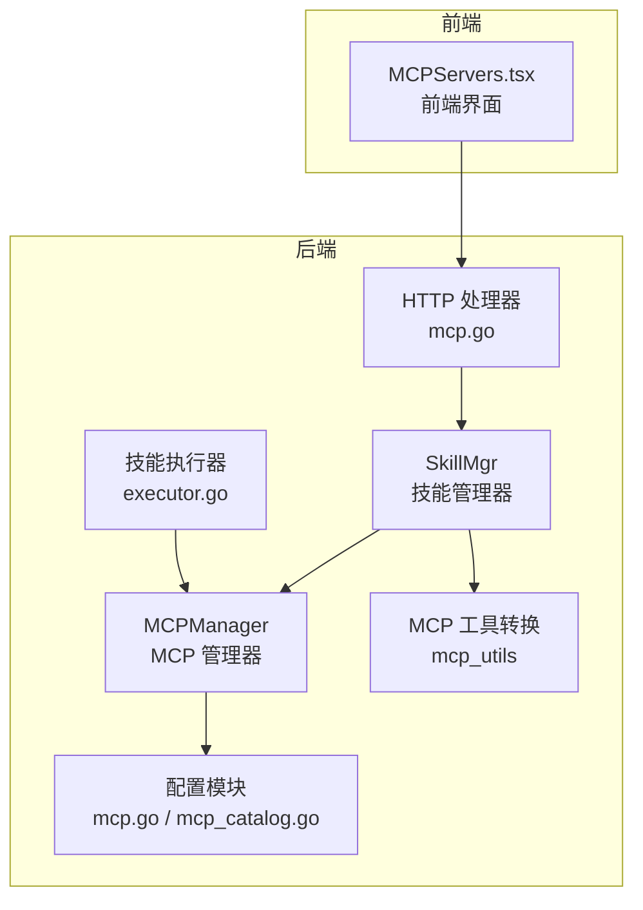

**图表来源**
- [internal/usecase/skills/mcp_manager.go](file://internal/usecase/skills/mcp_manager.go#L36-L47)
- [internal/config/mcp.go](file://internal/config/mcp.go#L13-L37)
- [internal/config/mcp_catalog.go](file://internal/config/mcp_catalog.go#L16-L56)
- [internal/adapters/http/handlers/mcp.go](file://internal/adapters/http/handlers/mcp.go#L13-L23)
- [internal/usecase/skills/skill_mgr.go](file://internal/usecase/skills/skill_mgr.go#L20-L62)
- [internal/usecase/skills/executor.go](file://internal/usecase/skills/executor.go#L105-L136)
- [dashboard/src/components/MCPServers.tsx](file://dashboard/src/components/MCPServers.tsx#L62-L224)

**章节来源**
- [internal/usecase/skills/mcp_manager.go](file://internal/usecase/skills/mcp_manager.go#L1-L292)
- [internal/config/mcp.go](file://internal/config/mcp.go#L1-L106)
- [internal/config/mcp_catalog.go](file://internal/config/mcp_catalog.go#L1-L252)
- [internal/adapters/http/handlers/mcp.go](file://internal/adapters/http/handlers/mcp.go#L1-L248)
- [internal/usecase/skills/skill_mgr.go](file://internal/usecase/skills/skill_mgr.go#L1-L558)
- [internal/usecase/skills/mcp_utils.go](file://internal/usecase/skills/mcp_utils.go#L1-L132)
- [internal/usecase/skills/executor.go](file://internal/usecase/skills/executor.go#L105-L136)
- [config/mcp_servers.json.template](file://config/mcp_servers.json.template#L1-L4)
- [dashboard/src/components/MCPServers.tsx](file://dashboard/src/components/MCPServers.tsx#L62-L224)

## 核心组件
- MCPManager：负责 MCP 服务器的连接、工具发现、工具调用、状态管理与资源释放
- SkillMgr：协调 MCPManager 与技能系统，完成工具注册、同步组件、索引构建与重启流程
- 配置模块：MCPServerEntry、环境变量解析、目录解析与合并
- HTTP 处理器：提供 MCP 服务器的增删改查、目录安装、工具列表等 API
- 前端界面：提供 MCP 服务器的可视化管理与操作入口
- 执行器：根据技能元数据路由到 MCPManager 执行工具调用

**章节来源**
- [internal/usecase/skills/mcp_manager.go](file://internal/usecase/skills/mcp_manager.go#L36-L47)
- [internal/usecase/skills/skill_mgr.go](file://internal/usecase/skills/skill_mgr.go#L20-L62)
- [internal/config/mcp.go](file://internal/config/mcp.go#L13-L37)
- [internal/adapters/http/handlers/mcp.go](file://internal/adapters/http/handlers/mcp.go#L13-L23)
- [internal/usecase/skills/executor.go](file://internal/usecase/skills/executor.go#L105-L136)

## 架构总览
MCP 管理器采用“管理器 + 配置 + 执行器”的分层架构：
- 管理器层：封装 MCP 客户端、传输层（stdio/SSE）、会话管理、工具发现与调用
- 配置层：统一管理 MCP 服务器配置与目录解析，支持环境变量替换与目录合并
- 协调层：SkillMgr 负责连接、注册、索引与重启；HTTP 处理器提供 API；前端提供可视化管理
- 执行层：执行器根据技能元数据定位到具体 MCP 服务器与工具进行调用

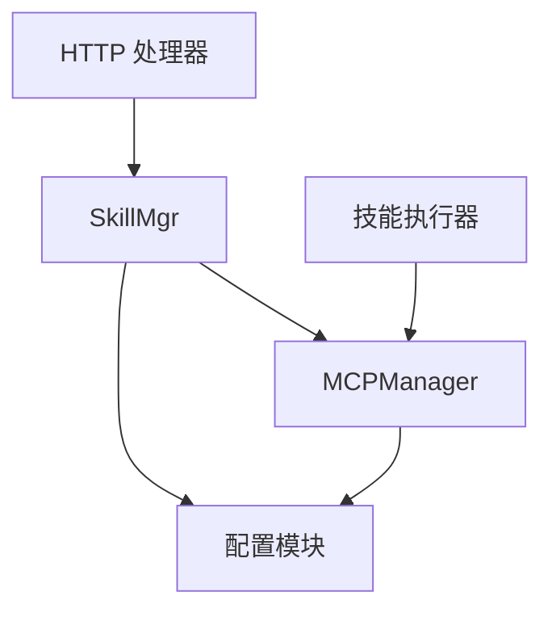

**图表来源**
- [internal/usecase/skills/skill_mgr.go](file://internal/usecase/skills/skill_mgr.go#L470-L506)
- [internal/usecase/skills/mcp_manager.go](file://internal/usecase/skills/mcp_manager.go#L49-L141)
- [internal/config/mcp.go](file://internal/config/mcp.go#L39-L80)
- [internal/adapters/http/handlers/mcp.go](file://internal/adapters/http/handlers/mcp.go#L33-L90)
- [internal/usecase/skills/executor.go](file://internal/usecase/skills/executor.go#L105-L136)

## 详细组件分析

### MCPManager 设计与实现
MCPManager 是 MCP 管理器的核心，负责：
- 连接管理：支持 stdio 与 SSE 两种传输方式，自动发现工具并维护工具列表
- 工具调用：基于会话调用远端工具，处理错误并更新状态
- 状态管理：维护连接状态、错误信息、工具列表
- 资源管理：提供断开连接、移除服务器、关闭所有连接的能力

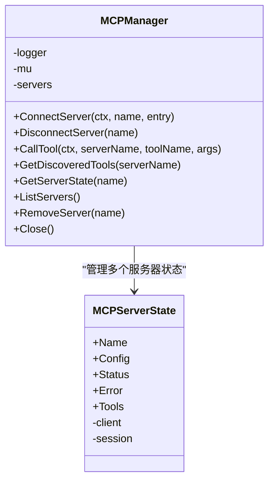

**图表来源**
- [internal/usecase/skills/mcp_manager.go](file://internal/usecase/skills/mcp_manager.go#L36-L47)
- [internal/usecase/skills/mcp_manager.go](file://internal/usecase/skills/mcp_manager.go#L25-L34)

关键实现要点：
- 并发安全：使用读写锁保护服务器状态映射，避免竞态
- 传输选择：根据配置类型选择 SSEClientTransport 或 CommandTransport，并支持 SSE 自定义 headers 与 stdio 环境变量继承与覆盖
- 工具发现：连接成功后调用 ListTools 获取工具列表并记录
- 工具调用：通过会话调用工具，错误时更新状态并返回可诊断信息
- 资源释放：断开连接时关闭会话与客户端，清空状态

**章节来源**
- [internal/usecase/skills/mcp_manager.go](file://internal/usecase/skills/mcp_manager.go#L49-L141)
- [internal/usecase/skills/mcp_manager.go](file://internal/usecase/skills/mcp_manager.go#L169-L204)
- [internal/usecase/skills/mcp_manager.go](file://internal/usecase/skills/mcp_manager.go#L217-L247)
- [internal/usecase/skills/mcp_manager.go](file://internal/usecase/skills/mcp_manager.go#L249-L278)
- [internal/usecase/skills/mcp_manager.go](file://internal/usecase/skills/mcp_manager.go#L280-L291)

### 服务器连接机制：stdio 与 SSE
- stdio 方式
  - 通过命令行启动子进程，继承当前进程环境变量，再叠加用户配置的环境变量
  - 工作目录设置为用户主目录，避免受当前工作目录影响
  - 适用于本地 MCP 服务或通过 npx 等包装器启动的服务
- SSE 方式
  - 基于 HTTP SSE 连接远端 MCP 服务
  - 支持自定义 headers，通过 headerRoundTripper 注入认证头
  - 适用于云托管或远程 MCP 服务

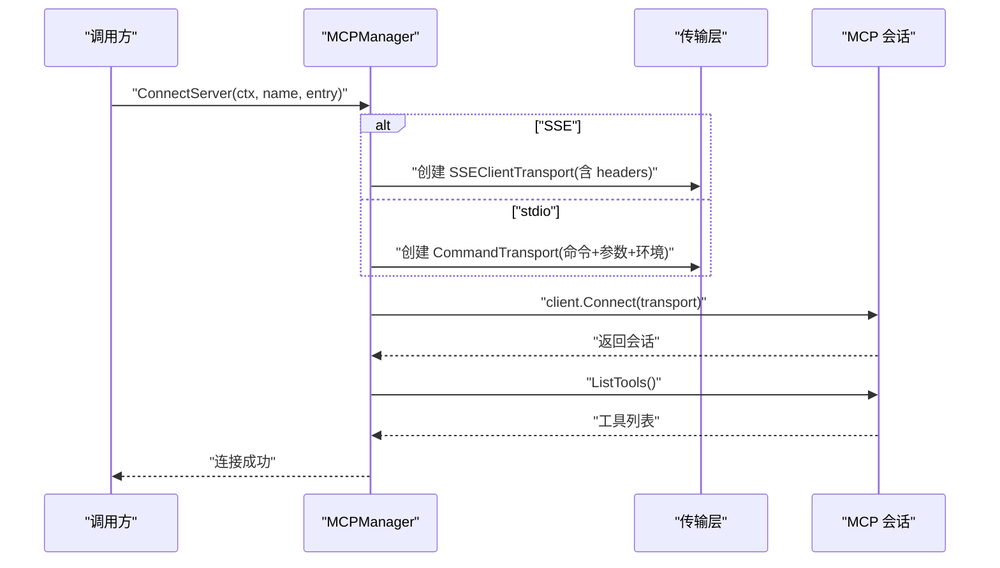

**图表来源**
- [internal/usecase/skills/mcp_manager.go](file://internal/usecase/skills/mcp_manager.go#L71-L104)
- [internal/usecase/skills/mcp_manager.go](file://internal/usecase/skills/mcp_manager.go#L120-L137)

**章节来源**
- [internal/usecase/skills/mcp_manager.go](file://internal/usecase/skills/mcp_manager.go#L71-L104)
- [internal/usecase/skills/mcp_manager.go](file://internal/usecase/skills/mcp_manager.go#L120-L137)

### 工具发现、工具调用与状态管理
- 工具发现：连接成功后调用 ListTools 获取工具列表，记录到服务器状态
- 工具调用：通过会话调用指定工具，错误时更新状态并返回错误信息
- 状态管理：维护连接状态、错误信息、工具列表，支持查询与展示

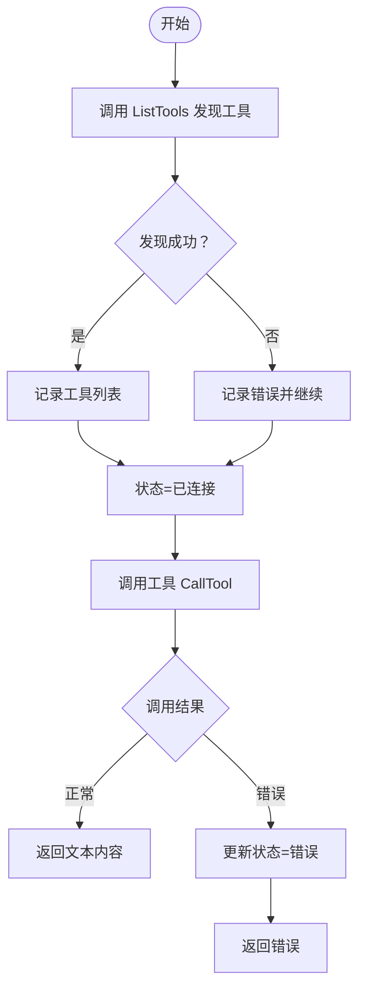

**图表来源**
- [internal/usecase/skills/mcp_manager.go](file://internal/usecase/skills/mcp_manager.go#L120-L137)
- [internal/usecase/skills/mcp_manager.go](file://internal/usecase/skills/mcp_manager.go#L169-L204)

**章节来源**
- [internal/usecase/skills/mcp_manager.go](file://internal/usecase/skills/mcp_manager.go#L120-L137)
- [internal/usecase/skills/mcp_manager.go](file://internal/usecase/skills/mcp_manager.go#L169-L204)

### 错误处理与重连机制
- 连接超时与临时网络错误：支持最多 3 次重试，每次等待 5 秒的递增延迟
- 不可重试错误：如进程崩溃、协议不兼容等，直接放弃
- 超时策略：SSE 默认较短超时，stdio 因冷启动较长，使用更长超时

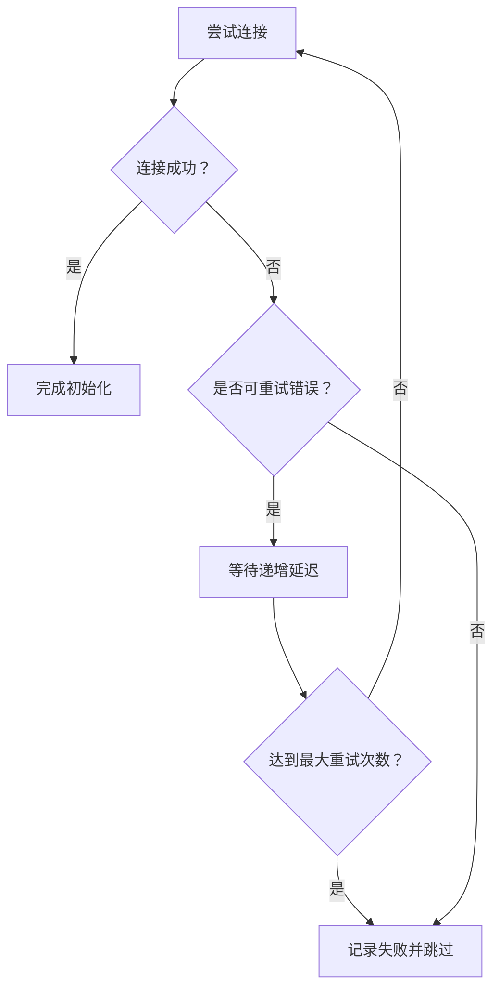

**图表来源**
- [internal/usecase/skills/skill_mgr.go](file://internal/usecase/skills/skill_mgr.go#L404-L449)
- [internal/usecase/skills/skill_mgr.go](file://internal/usecase/skills/skill_mgr.go#L451-L468)

**章节来源**
- [internal/usecase/skills/skill_mgr.go](file://internal/usecase/skills/skill_mgr.go#L395-L402)
- [internal/usecase/skills/skill_mgr.go](file://internal/usecase/skills/skill_mgr.go#L404-L449)
- [internal/usecase/skills/skill_mgr.go](file://internal/usecase/skills/skill_mgr.go#L451-L468)

### 配置与目录解析
- MCPServerEntry：统一描述 MCP 服务器配置，支持 stdio 与 SSE 两类
- 环境变量解析：支持 ${VAR} 占位符，优先从本地上下文解析，否则回退到系统环境
- 目录解析：内置目录与远程目录合并，支持变量替换与工具描述匹配

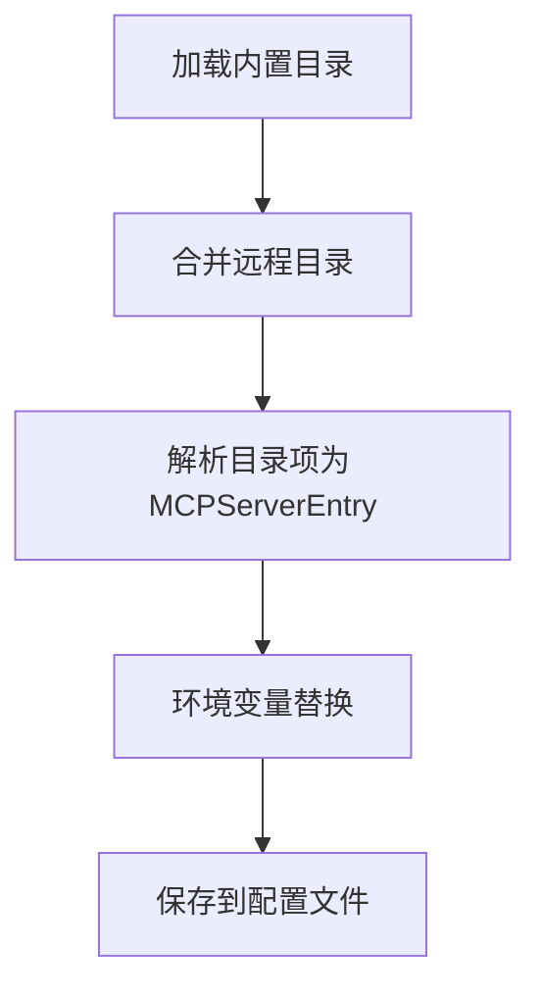

**图表来源**
- [internal/config/mcp_catalog.go](file://internal/config/mcp_catalog.go#L58-L90)
- [internal/config/mcp_catalog.go](file://internal/config/mcp_catalog.go#L92-L117)
- [internal/config/mcp_catalog.go](file://internal/config/mcp_catalog.go#L119-L161)
- [internal/config/mcp.go](file://internal/config/mcp.go#L82-L105)

**章节来源**
- [internal/config/mcp.go](file://internal/config/mcp.go#L13-L37)
- [internal/config/mcp.go](file://internal/config/mcp.go#L82-L105)
- [internal/config/mcp_catalog.go](file://internal/config/mcp_catalog.go#L58-L90)
- [internal/config/mcp_catalog.go](file://internal/config/mcp_catalog.go#L92-L117)
- [internal/config/mcp_catalog.go](file://internal/config/mcp_catalog.go#L119-L161)

### HTTP 接口与前端集成
- HTTP 接口：提供 MCP 服务器的增删改查、目录安装、工具列表等 API
- 前端界面：提供 MCP 服务器的可视化管理与操作入口，支持 SSE 与 stdio 两种类型

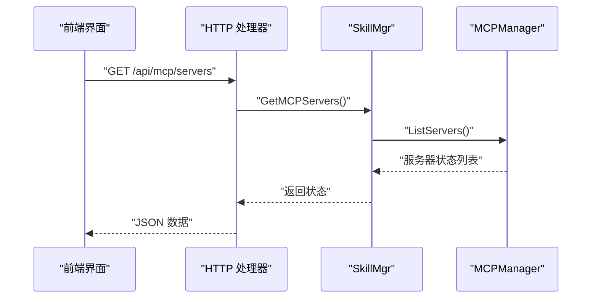

**图表来源**
- [internal/adapters/http/handlers/mcp.go](file://internal/adapters/http/handlers/mcp.go#L25-L31)
- [internal/usecase/skills/skill_mgr.go](file://internal/usecase/skills/skill_mgr.go#L549-L552)
- [internal/usecase/skills/mcp_manager.go](file://internal/usecase/skills/mcp_manager.go#L237-L247)

**章节来源**
- [internal/adapters/http/handlers/mcp.go](file://internal/adapters/http/handlers/mcp.go#L25-L31)
- [internal/adapters/http/handlers/mcp.go](file://internal/adapters/http/handlers/mcp.go#L162-L181)
- [internal/adapters/http/handlers/mcp.go](file://internal/adapters/http/handlers/mcp.go#L183-L247)
- [dashboard/src/components/MCPServers.tsx](file://dashboard/src/components/MCPServers.tsx#L62-L224)

### 工具转换与技能注册
- MCPToolToSkillDef：将 MCP 工具转换为技能定义，提取输入参数、描述、标签等
- 技能注册：由 SkillMgr 调用 MCPManager 连接并注册工具，随后同步组件并索引

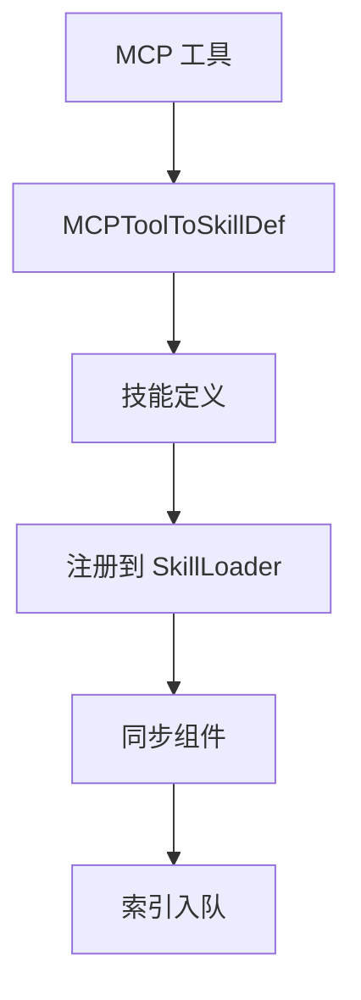

**图表来源**
- [internal/usecase/skills/mcp_utils.go](file://internal/usecase/skills/mcp_utils.go#L56-L97)
- [internal/usecase/skills/skill_mgr.go](file://internal/usecase/skills/skill_mgr.go#L470-L506)

**章节来源**
- [internal/usecase/skills/mcp_utils.go](file://internal/usecase/skills/mcp_utils.go#L56-L97)
- [internal/usecase/skills/skill_mgr.go](file://internal/usecase/skills/skill_mgr.go#L470-L506)

### 工具调用执行链路
- 执行器根据技能元数据解析出 server 与 tool，设置超时并调用 MCPManager
- MCPManager 通过会话调用工具，提取文本内容并返回

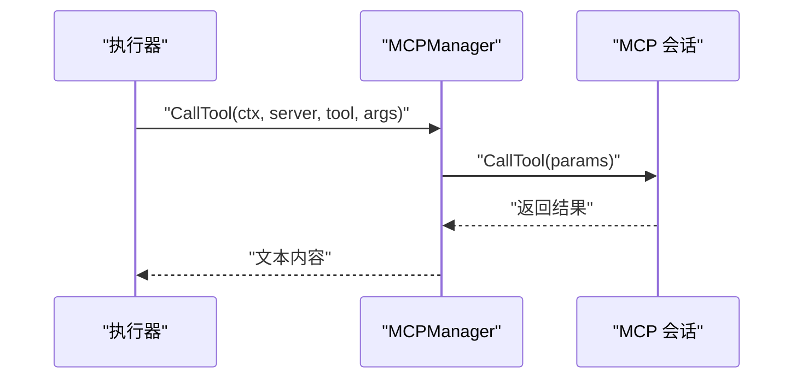

**图表来源**
- [internal/usecase/skills/executor.go](file://internal/usecase/skills/executor.go#L105-L136)
- [internal/usecase/skills/mcp_manager.go](file://internal/usecase/skills/mcp_manager.go#L169-L204)

**章节来源**
- [internal/usecase/skills/executor.go](file://internal/usecase/skills/executor.go#L105-L136)
- [internal/usecase/skills/mcp_manager.go](file://internal/usecase/skills/mcp_manager.go#L169-L204)

## 依赖关系分析
- MCPManager 依赖配置模块提供的 MCPServerEntry 与环境变量解析
- SkillMgr 协调 MCPManager 与技能系统，完成工具注册与索引
- HTTP 处理器提供 API，前端界面提供可视化管理
- 执行器依赖 MCPManager 实现工具调用

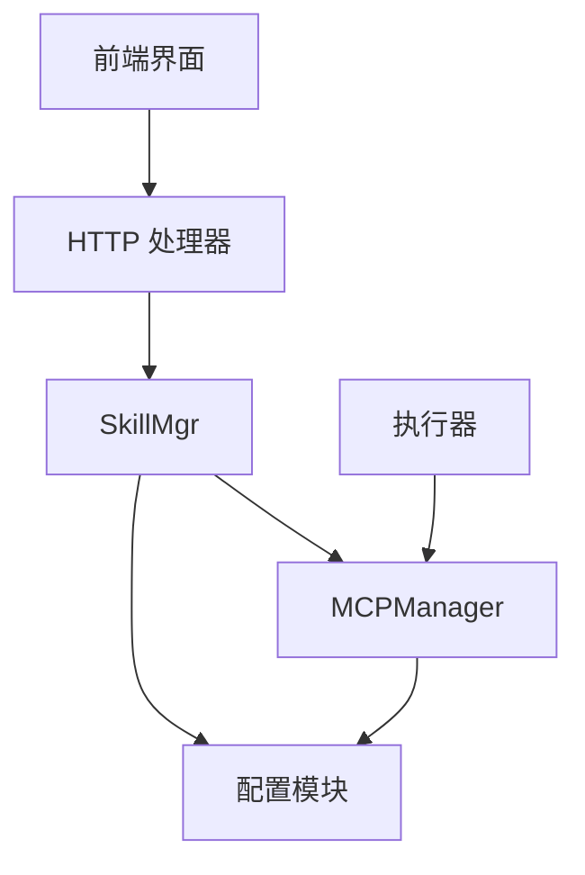

**图表来源**
- [internal/usecase/skills/mcp_manager.go](file://internal/usecase/skills/mcp_manager.go#L36-L47)
- [internal/config/mcp.go](file://internal/config/mcp.go#L39-L80)
- [internal/usecase/skills/skill_mgr.go](file://internal/usecase/skills/skill_mgr.go#L470-L506)
- [internal/adapters/http/handlers/mcp.go](file://internal/adapters/http/handlers/mcp.go#L13-L23)
- [internal/usecase/skills/executor.go](file://internal/usecase/skills/executor.go#L105-L136)
- [dashboard/src/components/MCPServers.tsx](file://dashboard/src/components/MCPServers.tsx#L62-L224)

**章节来源**
- [internal/usecase/skills/mcp_manager.go](file://internal/usecase/skills/mcp_manager.go#L36-L47)
- [internal/config/mcp.go](file://internal/config/mcp.go#L39-L80)
- [internal/usecase/skills/skill_mgr.go](file://internal/usecase/skills/skill_mgr.go#L470-L506)
- [internal/adapters/http/handlers/mcp.go](file://internal/adapters/http/handlers/mcp.go#L13-L23)
- [internal/usecase/skills/executor.go](file://internal/usecase/skills/executor.go#L105-L136)
- [dashboard/src/components/MCPServers.tsx](file://dashboard/src/components/MCPServers.tsx#L62-L224)

## 性能考虑
- 连接超时策略：SSE 使用较短超时，stdio 使用较长超时，以适配不同启动特性
- 重试策略：仅对超时与临时网络错误进行有限次重试，避免无效重试造成资源浪费
- 并发安全：使用读写锁保护服务器状态，降低锁竞争；工具调用前进行状态检查，避免无效调用
- 资源管理：断开连接与关闭会话，防止句柄泄漏；关闭时遍历所有服务器并优雅退出

**章节来源**
- [internal/usecase/skills/skill_mgr.go](file://internal/usecase/skills/skill_mgr.go#L395-L402)
- [internal/usecase/skills/skill_mgr.go](file://internal/usecase/skills/skill_mgr.go#L404-L449)
- [internal/usecase/skills/mcp_manager.go](file://internal/usecase/skills/mcp_manager.go#L143-L167)
- [internal/usecase/skills/mcp_manager.go](file://internal/usecase/skills/mcp_manager.go#L261-L278)

## 故障排查指南
- 连接失败
  - 检查传输类型与配置：SSE 需要正确的 URL 与 headers；stdio 需要正确的命令、参数与环境变量
  - 查看日志中的错误信息，区分超时、协议错误、进程崩溃等
- 工具调用失败
  - 确认服务器状态为已连接；检查工具名称是否正确
  - 查看返回的错误内容，提取文本信息辅助定位问题
- 重试与超时
  - SSE 超时通常为网络不稳定或服务冷启动；stdio 超时常因冷启动耗时较长
  - 对于不可重试错误（如协议不兼容、进程崩溃），需修复配置或服务端问题

**章节来源**
- [internal/usecase/skills/mcp_manager.go](file://internal/usecase/skills/mcp_manager.go#L106-L114)
- [internal/usecase/skills/mcp_manager.go](file://internal/usecase/skills/mcp_manager.go#L190-L197)
- [internal/usecase/skills/skill_mgr.go](file://internal/usecase/skills/skill_mgr.go#L451-L468)

## 结论
MCP 管理器通过清晰的分层设计与完善的错误处理机制，实现了 MCP 服务器的稳定连接、工具发现与调用。其并发安全与资源管理策略确保了在高负载场景下的可靠性；重试与超时策略有效提升了连接成功率。结合配置模块与目录解析，系统能够灵活地接入多种 MCP 服务，满足多样化的工具扩展需求。

## 附录

### 使用示例与最佳实践
- 添加 MCP 服务器
  - SSE：提供 URL 与可选 headers；适合云托管或远程服务
  - stdio：提供命令、参数与环境变量；适合本地或包装器启动的服务
- 目录安装
  - 从内置目录一键安装，支持变量替换与异步连接
- 工具调用
  - 通过执行器按技能元数据调用，设置合理超时并处理错误
- 最佳实践
  - SSE 服务建议开启认证头；stdio 服务建议明确工作目录与环境变量
  - 对于冷启动较慢的服务，适当放宽超时与重试策略
  - 定期检查服务器状态与工具列表，及时发现异常

**章节来源**
- [internal/adapters/http/handlers/mcp.go](file://internal/adapters/http/handlers/mcp.go#L33-L90)
- [internal/adapters/http/handlers/mcp.go](file://internal/adapters/http/handlers/mcp.go#L183-L247)
- [internal/usecase/skills/executor.go](file://internal/usecase/skills/executor.go#L105-L136)
- [internal/config/mcp.go](file://internal/config/mcp.go#L82-L105)

### 配置文件模板
- MCP 服务器配置文件模板：用于存储已配置的 MCP 服务器列表

**章节来源**
- [config/mcp_servers.json.template](file://config/mcp_servers.json.template#L1-L4)