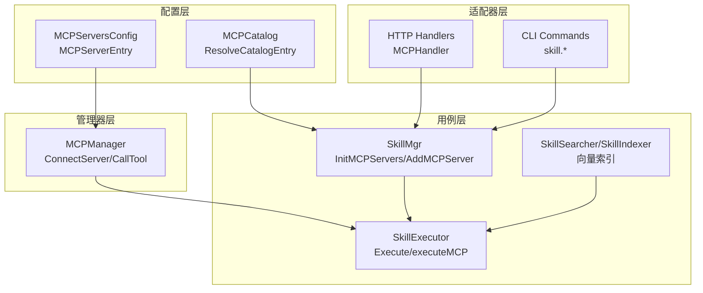
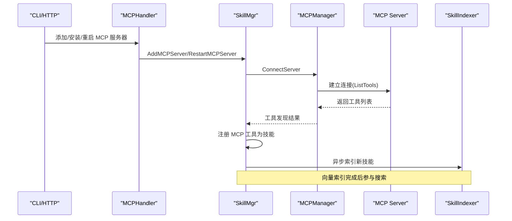
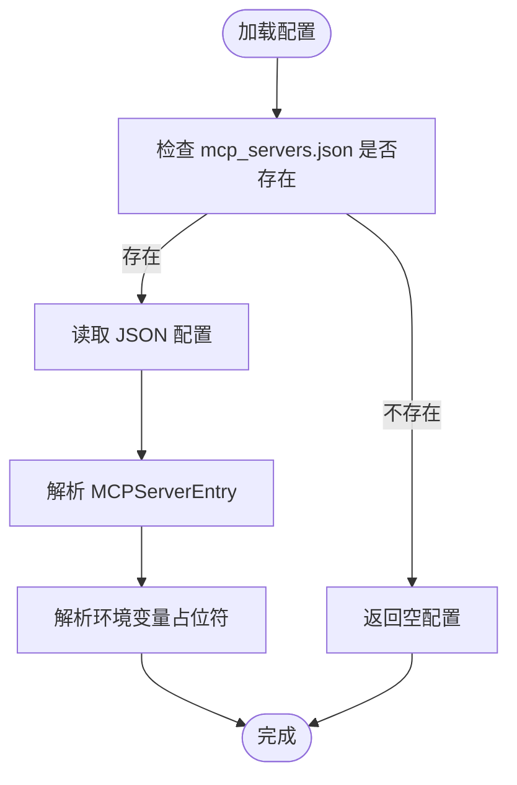
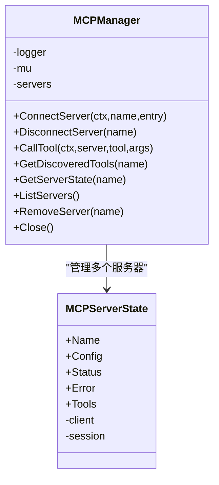
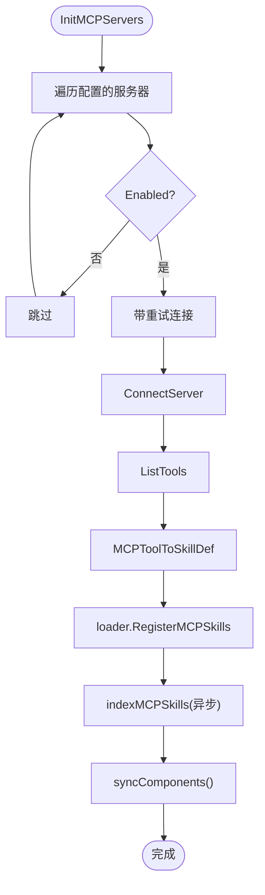
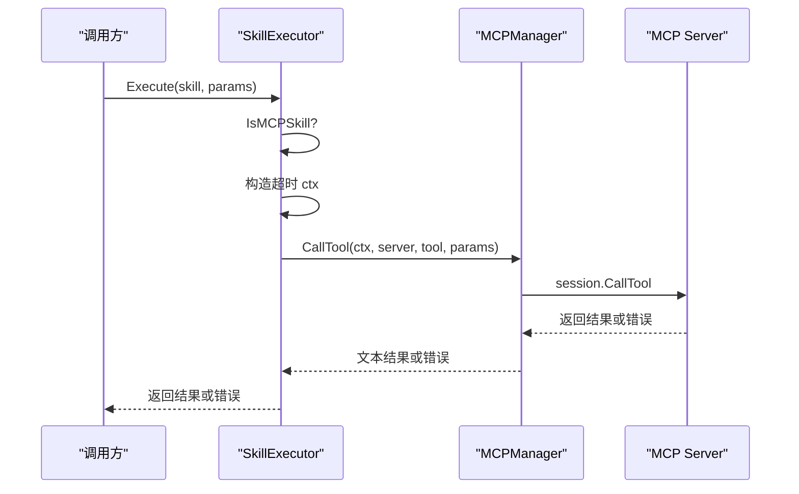
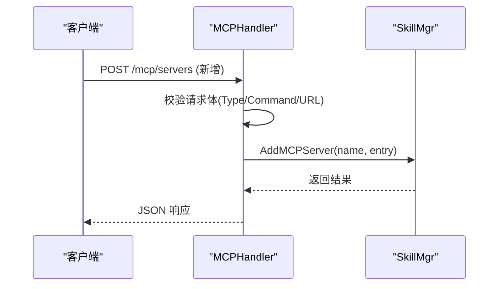
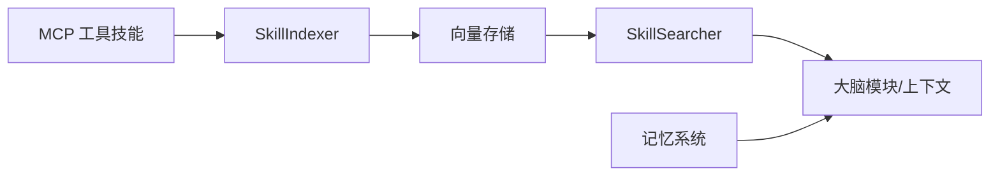
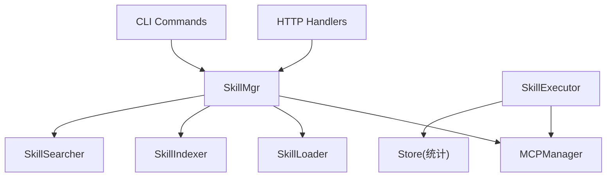

# MCP 集成实现

<cite>
**本文档引用的文件**
- [cmd/main.go](file://cmd/main.go)
- [internal/config/mcp.go](file://internal/config/mcp.go)
- [internal/config/mcp_catalog.go](file://internal/config/mcp_catalog.go)
- [internal/config/mcp_servers.json.template](file://config/mcp_servers.json.template)
- [internal/usecase/skills/mcp_manager.go](file://internal/usecase/skills/mcp_manager.go)
- [internal/usecase/skills/mcp_utils.go](file://internal/usecase/skills/mcp_utils.go)
- [internal/usecase/skills/skill_mgr.go](file://internal/usecase/skills/skill_mgr.go)
- [internal/usecase/skills/executor.go](file://internal/usecase/skills/executor.go)
- [internal/adapters/http/handlers/mcp.go](file://internal/adapters/http/handlers/mcp.go)
- [internal/adapters/cli/skill.go](file://internal/adapters/cli/skill.go)
- [internal/core/memory.go](file://internal/core/memory.go)
- [internal/usecase/memory/search.go](file://internal/usecase/memory/search.go)
- [internal/entity/tool.go](file://internal/entity/tool.go)
- [internal/tests/integration_test.go](file://internal/tests/integration_test.go)
- [config/test_server.yml](file://config/test_server.yml)
</cite>

## 目录
1. [简介](#简介)
2. [项目结构](#项目结构)
3. [核心组件](#核心组件)
4. [架构总览](#架构总览)
5. [详细组件分析](#详细组件分析)
6. [依赖关系分析](#依赖关系分析)
7. [性能考虑](#性能考虑)
8. [故障排查指南](#故障排查指南)
9. [结论](#结论)
10. [附录](#附录)

## 简介
本文件面向开发者，系统性阐述 MindX 与 MCP（Model Context Protocol）的集成实现，重点包括：
- MCP 与内置技能系统的无缝集成机制
- MCP 工具在技能执行器中的调用流程与参数传递
- MCP 与向量化搜索、记忆系统的交互方式
- MCP 服务器的生命周期管理与状态同步
- MCP 工具的注册、发现与调用的完整实现流程
- 错误处理、超时控制与资源清理机制
- 集成测试与调试指南

## 项目结构
MindX 将 MCP 集成划分为配置层、管理器层、用例层与适配器层，形成清晰的分层架构：
- 配置层：负责 MCP 服务器配置的加载、保存与目录解析
- 管理器层：负责 MCP 服务器连接、工具发现、工具调用与生命周期管理
- 用例层：负责技能管理、技能执行、向量化索引与搜索
- 适配器层：提供 HTTP 与 CLI 接口，支持运行时增删改查 MCP 服务器

**图表来源**
- [internal/config/mcp.go](file://internal/config/mcp.go#L13-L64)
- [internal/config/mcp_catalog.go](file://internal/config/mcp_catalog.go#L16-L65)
- [internal/usecase/skills/mcp_manager.go](file://internal/usecase/skills/mcp_manager.go#L36-L141)
- [internal/usecase/skills/skill_mgr.go](file://internal/usecase/skills/skill_mgr.go#L40-L85)
- [internal/usecase/skills/executor.go](file://internal/usecase/skills/executor.go#L19-L42)
- [internal/adapters/http/handlers/mcp.go](file://internal/adapters/http/handlers/mcp.go#L13-L24)

**章节来源**
- [cmd/main.go](file://cmd/main.go#L18-L21)
- [internal/config/mcp.go](file://internal/config/mcp.go#L1-L106)
- [internal/config/mcp_catalog.go](file://internal/config/mcp_catalog.go#L1-L252)
- [internal/usecase/skills/mcp_manager.go](file://internal/usecase/skills/mcp_manager.go#L1-L292)
- [internal/usecase/skills/skill_mgr.go](file://internal/usecase/skills/skill_mgr.go#L1-L558)
- [internal/usecase/skills/executor.go](file://internal/usecase/skills/executor.go#L1-L402)
- [internal/adapters/http/handlers/mcp.go](file://internal/adapters/http/handlers/mcp.go#L1-L248)
- [internal/adapters/cli/skill.go](file://internal/adapters/cli/skill.go#L1-L327)

## 核心组件
- MCP 服务器配置与目录解析
  - 支持本地 stdio 与远端 SSE 两种传输方式
  - 支持环境变量占位符解析与目录变量替换
- MCP 管理器
  - 连接建立、工具发现、工具调用、断开与关闭
  - 线程安全的状态管理与错误传播
- 技能管理器
  - 初始化 MCP 服务器（并发+重试+超时）
  - 注册 MCP 工具为技能，注入标签与描述
  - 触发向量化索引，参与搜索与检索
- 技能执行器
  - 识别 MCP 技能元数据，构造超时上下文
  - 调用 MCP 管理器执行工具，记录统计信息
- HTTP/CLI 适配器
  - 提供 MCP 服务器的增删改查、目录安装与工具查询
  - 异步连接，保证接口响应不阻塞

**章节来源**
- [internal/config/mcp.go](file://internal/config/mcp.go#L13-L106)
- [internal/config/mcp_catalog.go](file://internal/config/mcp_catalog.go#L119-L161)
- [internal/usecase/skills/mcp_manager.go](file://internal/usecase/skills/mcp_manager.go#L36-L278)
- [internal/usecase/skills/skill_mgr.go](file://internal/usecase/skills/skill_mgr.go#L373-L558)
- [internal/usecase/skills/executor.go](file://internal/usecase/skills/executor.go#L57-L136)
- [internal/adapters/http/handlers/mcp.go](file://internal/adapters/http/handlers/mcp.go#L33-L161)

## 架构总览
下图展示 MCP 集成在 MindX 中的整体交互路径：从配置与目录解析，到服务器连接与工具发现，再到技能注册与向量化索引，最终由技能执行器统一调度。

**图表来源**
- [internal/adapters/http/handlers/mcp.go](file://internal/adapters/http/handlers/mcp.go#L33-L112)
- [internal/usecase/skills/skill_mgr.go](file://internal/usecase/skills/skill_mgr.go#L508-L558)
- [internal/usecase/skills/mcp_manager.go](file://internal/usecase/skills/mcp_manager.go#L49-L141)

## 详细组件分析

### MCP 服务器配置与目录解析
- 配置文件结构
  - mcp_servers.json：键为服务器名称，值为 MCPServerEntry
  - 支持 stdio（命令、参数、环境变量）与 SSE（URL、Headers）两种类型
- 目录解析
  - 从内置目录加载 MCP 服务器条目，支持变量替换与占位符解析
  - 支持多语言描述映射与工具描述匹配策略

**图表来源**
- [internal/config/mcp.go](file://internal/config/mcp.go#L41-L80)
- [internal/config/mcp.go](file://internal/config/mcp.go#L84-L105)

**章节来源**
- [internal/config/mcp.go](file://internal/config/mcp.go#L13-L106)
- [internal/config/mcp_catalog.go](file://internal/config/mcp_catalog.go#L58-L161)
- [config/mcp_servers.json.template](file://config/mcp_servers.json.template#L1-L4)

### MCP 管理器：连接、发现与调用
- 连接策略
  - stdio：继承父进程环境，合并用户配置的 Env，设置工作目录为用户主目录
  - SSE：支持自定义 Headers，通过 headerRoundTripper 注入认证头
- 工具发现与状态管理
  - 连接成功后调用 ListTools 获取工具列表，并缓存到状态中
  - 线程安全的服务器状态（连接/断开/错误）与工具列表
- 工具调用
  - 基于工具名调用，错误时更新状态并返回可诊断的错误信息

**图表来源**
- [internal/usecase/skills/mcp_manager.go](file://internal/usecase/skills/mcp_manager.go#L36-L141)
- [internal/usecase/skills/mcp_manager.go](file://internal/usecase/skills/mcp_manager.go#L25-L34)

**章节来源**
- [internal/usecase/skills/mcp_manager.go](file://internal/usecase/skills/mcp_manager.go#L49-L141)
- [internal/usecase/skills/mcp_manager.go](file://internal/usecase/skills/mcp_manager.go#L169-L204)

### 技能管理器：MCP 生命周期与注册
- 初始化 MCP 服务器
  - 并发初始化多个服务器，每个服务器独立超时
  - 对超时类错误进行最多三次重试，指数退避
- 注册 MCP 工具为技能
  - 将 MCP Tool 转换为 SkillDef，提取参数 Schema
  - 合并目录标签与中文描述，增强向量索引质量
- 索引与同步
  - 新注册的 MCP 技能异步进入索引队列，完成后同步到搜索器

**图表来源**
- [internal/usecase/skills/skill_mgr.go](file://internal/usecase/skills/skill_mgr.go#L373-L402)
- [internal/usecase/skills/skill_mgr.go](file://internal/usecase/skills/skill_mgr.go#L404-L449)
- [internal/usecase/skills/skill_mgr.go](file://internal/usecase/skills/skill_mgr.go#L470-L506)

**章节来源**
- [internal/usecase/skills/skill_mgr.go](file://internal/usecase/skills/skill_mgr.go#L373-L558)
- [internal/usecase/skills/mcp_utils.go](file://internal/usecase/skills/mcp_utils.go#L56-L97)

### 技能执行器：MCP 工具调用流程
- 元数据识别
  - 通过 SkillDef 的 Metadata 判断是否为 MCP 技能
- 超时控制
  - 以技能 Timeout 为基准构建 context.WithTimeout
- 参数传递
  - 将请求参数原样传递给 MCP 工具
- 结果处理
  - 成功返回文本内容；错误时更新统计并记录日志

**图表来源**
- [internal/usecase/skills/executor.go](file://internal/usecase/skills/executor.go#L57-L79)
- [internal/usecase/skills/executor.go](file://internal/usecase/skills/executor.go#L105-L136)
- [internal/usecase/skills/mcp_manager.go](file://internal/usecase/skills/mcp_manager.go#L169-L204)

**章节来源**
- [internal/usecase/skills/executor.go](file://internal/usecase/skills/executor.go#L57-L136)

### HTTP 与 CLI：MCP 服务器管理
- HTTP 接口
  - 列表、新增、删除、重启、查询工具、目录安装
  - 异步连接，避免阻塞响应
- CLI 接口
  - 提供技能列表、运行、验证、启用/禁用、重载等命令

**图表来源**
- [internal/adapters/http/handlers/mcp.go](file://internal/adapters/http/handlers/mcp.go#L33-L90)
- [internal/adapters/http/handlers/mcp.go](file://internal/adapters/http/handlers/mcp.go#L184-L247)

**章节来源**
- [internal/adapters/http/handlers/mcp.go](file://internal/adapters/http/handlers/mcp.go#L25-L161)
- [internal/adapters/cli/skill.go](file://internal/adapters/cli/skill.go#L18-L253)

### 与向量化搜索、记忆系统的交互
- MCP 工具注册即纳入技能体系，参与向量索引与搜索
- 记忆系统提供基于关键词与向量的检索能力，辅助上下文构建

**图表来源**
- [internal/usecase/skills/skill_mgr.go](file://internal/usecase/skills/skill_mgr.go#L243-L260)
- [internal/usecase/memory/search.go](file://internal/usecase/memory/search.go#L15-L74)
- [internal/core/memory.go](file://internal/core/memory.go#L24-L40)

**章节来源**
- [internal/usecase/skills/skill_mgr.go](file://internal/usecase/skills/skill_mgr.go#L243-L260)
- [internal/usecase/memory/search.go](file://internal/usecase/memory/search.go#L15-L74)
- [internal/core/memory.go](file://internal/core/memory.go#L8-L22)

## 依赖关系分析
- 组件耦合
  - SkillMgr 依赖 MCPManager 与 SkillLoader/SkillIndexer/SkillSearcher
  - SkillExecutor 依赖 MCPManager 与 Store（统计持久化）
  - HTTP/CLI 适配器依赖 SkillMgr
- 外部依赖
  - MCP SDK：modelcontextprotocol/go-sdk/mcp
  - HTTP 框架：gin-gonic/gin
  - 命令行框架：spf13/cobra

**图表来源**
- [internal/adapters/http/handlers/mcp.go](file://internal/adapters/http/handlers/mcp.go#L13-L24)
- [internal/adapters/cli/skill.go](file://internal/adapters/cli/skill.go#L255-L300)
- [internal/usecase/skills/skill_mgr.go](file://internal/usecase/skills/skill_mgr.go#L40-L62)
- [internal/usecase/skills/executor.go](file://internal/usecase/skills/executor.go#L19-L42)

**章节来源**
- [internal/usecase/skills/skill_mgr.go](file://internal/usecase/skills/skill_mgr.go#L20-L62)
- [internal/usecase/skills/executor.go](file://internal/usecase/skills/executor.go#L19-L42)

## 性能考虑
- 连接超时与重试
  - SSE 默认 30 秒，stdio 默认 120 秒，避免冷启动阻塞
  - 超时类错误最多重试 3 次，间隔递增
- 并发初始化
  - 多个 MCP 服务器并发初始化，缩短启动时间
- 异步索引
  - 新增 MCP 技能后异步进入索引队列，不阻塞连接流程
- 资源清理
  - 关闭会话、清空状态与工具列表，释放连接

**章节来源**
- [internal/usecase/skills/skill_mgr.go](file://internal/usecase/skills/skill_mgr.go#L395-L402)
- [internal/usecase/skills/skill_mgr.go](file://internal/usecase/skills/skill_mgr.go#L404-L449)
- [internal/usecase/skills/mcp_manager.go](file://internal/usecase/skills/mcp_manager.go#L262-L278)

## 故障排查指南
- 常见错误与处理
  - 连接超时：检查服务器启动时间与网络连通性；确认 SSE Headers 正确
  - 工具发现失败：查看服务器返回的工具列表与权限
  - 工具调用错误：检查参数 Schema 与服务器返回内容
- 日志与诊断
  - HTTP/CLI 层记录请求与错误
  - MCP 管理器记录连接、工具发现与调用日志
- 调试建议
  - 使用 CLI 技能命令验证 MCP 技能可用性
  - 通过 HTTP 接口安装/重启服务器，观察异步连接日志

**章节来源**
- [internal/adapters/http/handlers/mcp.go](file://internal/adapters/http/handlers/mcp.go#L138-L160)
- [internal/usecase/skills/mcp_manager.go](file://internal/usecase/skills/mcp_manager.go#L106-L114)
- [internal/adapters/cli/skill.go](file://internal/adapters/cli/skill.go#L129-L167)

## 结论
MindX 的 MCP 集成通过清晰的分层设计实现了与内置技能系统的无缝融合：配置与目录解析确保灵活部署，MCP 管理器提供稳定的连接与工具调用，技能管理器完成注册与索引，执行器统一调度并具备完善的超时与统计机制。该实现兼顾易用性与可靠性，适合在生产环境中扩展与维护。

## 附录

### MCP 工具注册与调用流程（代码级）
- 注册流程
  - 目录解析：ResolveCatalogEntry
  - 连接与发现：connectAndRegisterMCP
  - 转换与注册：MCPToolToSkillDef + RegisterMCPSkills
  - 索引：indexMCPSkills
- 调用流程
  - 元数据识别：IsMCPSkill + GetMCPSkillMetadata
  - 超时上下文：SkillExecutor.executeMCP
  - 工具调用：MCPManager.CallTool

**章节来源**
- [internal/config/mcp_catalog.go](file://internal/config/mcp_catalog.go#L119-L161)
- [internal/usecase/skills/skill_mgr.go](file://internal/usecase/skills/skill_mgr.go#L470-L506)
- [internal/usecase/skills/mcp_utils.go](file://internal/usecase/skills/mcp_utils.go#L16-L54)
- [internal/usecase/skills/executor.go](file://internal/usecase/skills/executor.go#L105-L136)
- [internal/usecase/skills/mcp_manager.go](file://internal/usecase/skills/mcp_manager.go#L169-L204)

### 集成测试与调试
- 集成测试
  - 启动系统并等待索引完成，验证工具发现与调用
- 测试配置
  - test_server.yml 提供模型与向量存储配置示例

**章节来源**
- [internal/tests/integration_test.go](file://internal/tests/integration_test.go#L35-L89)
- [config/test_server.yml](file://config/test_server.yml#L1-L35)