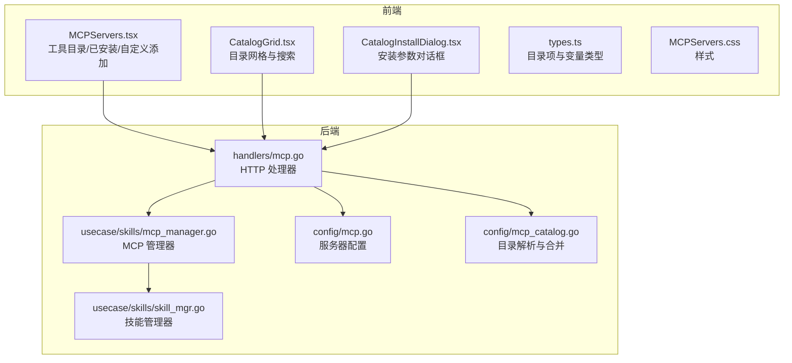
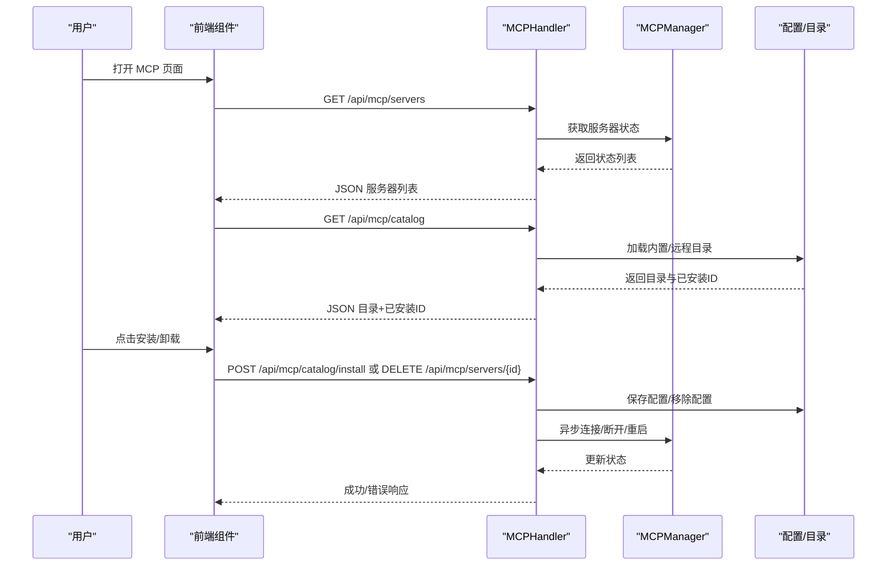
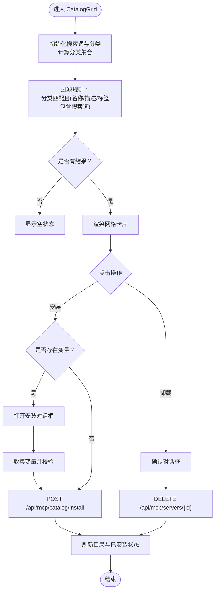
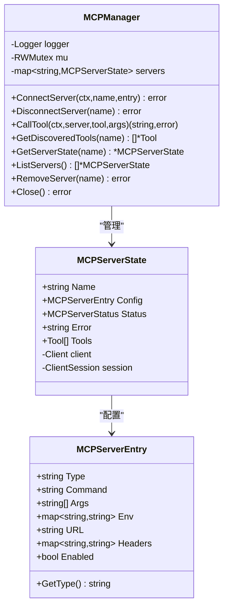
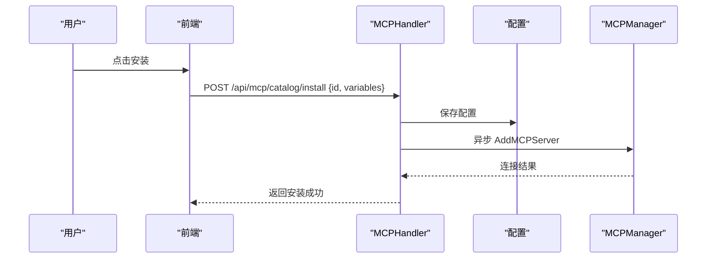
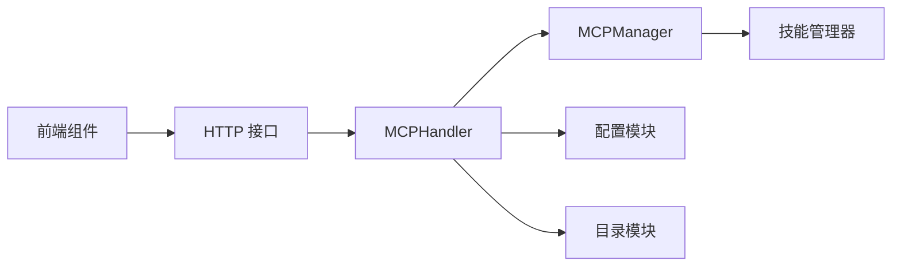

# MCP 服务器管理

<cite>
**本文档引用的文件**
- [dashboard/src/components/MCPServers.tsx](file://dashboard/src/components/MCPServers.tsx)
- [dashboard/src/components/mcp/CatalogGrid.tsx](file://dashboard/src/components/mcp/CatalogGrid.tsx)
- [dashboard/src/components/mcp/CatalogInstallDialog.tsx](file://dashboard/src/components/mcp/CatalogInstallDialog.tsx)
- [dashboard/src/components/mcp/types.ts](file://dashboard/src/components/mcp/types.ts)
- [dashboard/src/components/styles/MCPServers.css](file://dashboard/src/components/styles/MCPServers.css)
- [internal/adapters/http/handlers/mcp.go](file://internal/adapters/http/handlers/mcp.go)
- [internal/usecase/skills/mcp_manager.go](file://internal/usecase/skills/mcp_manager.go)
- [internal/config/mcp.go](file://internal/config/mcp.go)
- [internal/config/mcp_catalog.go](file://internal/config/mcp_catalog.go)
- [config/mcp_servers.json.template](file://config/mcp_servers.json.template)
- [internal/usecase/skills/skill_mgr.go](file://internal/usecase/skills/skill_mgr.go)
- [internal/usecase/skills/executor.go](file://internal/usecase/skills/executor.go)
</cite>

## 目录
1. [简介](#简介)
2. [项目结构](#项目结构)
3. [核心组件](#核心组件)
4. [架构总览](#架构总览)
5. [组件详解](#组件详解)
6. [依赖关系分析](#依赖关系分析)
7. [性能与可靠性](#性能与可靠性)
8. [故障排查指南](#故障排查指南)
9. [结论](#结论)
10. [附录](#附录)

## 简介
本文件面向 MindX MCP 服务器管理界面的技术文档，聚焦于前端组件与后端服务的协作，涵盖工具目录展示与安装对话框、MCP 服务器连接与配置流程、工具目录的浏览与搜索、MCP 工具的安装/卸载/更新机制、服务器状态监控与错误处理，以及定制化开发与扩展方法。同时提供 MCP 协议使用示例与最佳实践，帮助开发者快速理解并扩展 MCP 能力。

## 项目结构
MindX 的 MCP 管理界面由前端 React 组件与后端 Go 服务共同组成，前后端通过 REST 接口交互。前端负责展示与用户交互，后端负责 MCP 服务器生命周期管理、目录解析与工具发现。

**图表来源**
- [dashboard/src/components/MCPServers.tsx](file://dashboard/src/components/MCPServers.tsx#L1-L370)
- [dashboard/src/components/mcp/CatalogGrid.tsx](file://dashboard/src/components/mcp/CatalogGrid.tsx#L1-L150)
- [dashboard/src/components/mcp/CatalogInstallDialog.tsx](file://dashboard/src/components/mcp/CatalogInstallDialog.tsx#L1-L63)
- [dashboard/src/components/mcp/types.ts](file://dashboard/src/components/mcp/types.ts#L1-L47)
- [dashboard/src/components/styles/MCPServers.css](file://dashboard/src/components/styles/MCPServers.css#L1-L604)
- [internal/adapters/http/handlers/mcp.go](file://internal/adapters/http/handlers/mcp.go#L1-L248)
- [internal/usecase/skills/mcp_manager.go](file://internal/usecase/skills/mcp_manager.go#L1-L292)
- [internal/config/mcp.go](file://internal/config/mcp.go#L1-L106)
- [internal/config/mcp_catalog.go](file://internal/config/mcp_catalog.go#L1-L252)
- [internal/usecase/skills/skill_mgr.go](file://internal/usecase/skills/skill_mgr.go#L386-L468)

**章节来源**
- [dashboard/src/components/MCPServers.tsx](file://dashboard/src/components/MCPServers.tsx#L1-L370)
- [internal/adapters/http/handlers/mcp.go](file://internal/adapters/http/handlers/mcp.go#L1-L248)

## 核心组件
- 前端组件
  - MCPServers：主容器，负责标签页切换、服务器列表、目录与自定义添加、消息提示与工具展开。
  - CatalogGrid：目录网格展示，支持按分类与关键词搜索，触发安装或卸载。
  - CatalogInstallDialog：安装参数收集与校验，支持必填变量与类型（字符串/密钥/路径/URL）。
  - 类型定义：CatalogEntry、CatalogVariable、CatalogTool 等，统一前后端数据契约。
  - 样式：完整的 UI 主题与交互样式，适配深色模式与响应式布局。
- 后端组件
  - MCPHandler：提供 /api/mcp/servers、/api/mcp/catalog、/api/mcp/catalog/install 等接口。
  - MCPManager：封装 MCP 客户端连接、工具发现、工具调用与状态管理。
  - 配置与目录
    - MCPServerEntry：服务器配置结构（stdio/sse）。
    - LoadBuiltinCatalog/FetchRemoteCatalog/MergeCatalogs：目录加载、远程拉取与合并。
    - ResolveCatalogEntry：将目录条目与用户变量解析为可运行的 MCPServerEntry。
  - 技能管理器：负责服务器初始化、重连与重试策略。

**章节来源**
- [dashboard/src/components/MCPServers.tsx](file://dashboard/src/components/MCPServers.tsx#L62-L370)
- [dashboard/src/components/mcp/CatalogGrid.tsx](file://dashboard/src/components/mcp/CatalogGrid.tsx#L12-L150)
- [dashboard/src/components/mcp/CatalogInstallDialog.tsx](file://dashboard/src/components/mcp/CatalogInstallDialog.tsx#L11-L63)
- [dashboard/src/components/mcp/types.ts](file://dashboard/src/components/mcp/types.ts#L1-L47)
- [internal/adapters/http/handlers/mcp.go](file://internal/adapters/http/handlers/mcp.go#L13-L248)
- [internal/usecase/skills/mcp_manager.go](file://internal/usecase/skills/mcp_manager.go#L17-L292)
- [internal/config/mcp.go](file://internal/config/mcp.go#L13-L106)
- [internal/config/mcp_catalog.go](file://internal/config/mcp_catalog.go#L16-L252)
- [internal/usecase/skills/skill_mgr.go](file://internal/usecase/skills/skill_mgr.go#L386-L468)

## 架构总览
MCP 管理界面采用“前端展示 + 后端控制”的分层架构。前端通过 HTTP 接口与后端交互，后端基于 MCP SDK 建立连接并进行工具发现与调用；配置持久化在工作区目录下，目录数据可内置或远程拉取并合并。

**图表来源**
- [internal/adapters/http/handlers/mcp.go](file://internal/adapters/http/handlers/mcp.go#L25-L181)
- [internal/usecase/skills/mcp_manager.go](file://internal/usecase/skills/mcp_manager.go#L49-L141)
- [internal/config/mcp.go](file://internal/config/mcp.go#L39-L80)
- [internal/config/mcp_catalog.go](file://internal/config/mcp_catalog.go#L58-L117)

## 组件详解

### 前端：工具目录展示与安装对话框
- CatalogGrid
  - 功能：展示目录条目，支持按分类筛选与关键词搜索；根据已安装集合高亮；触发安装或卸载。
  - 搜索逻辑：对名称、描述、标签进行大小写无关的包含匹配。
  - 安装流程：若目录条目声明变量，则弹出 CatalogInstallDialog 收集参数；否则直接安装。
  - 卸载：确认后调用 DELETE /api/mcp/servers/{id}。
- CatalogInstallDialog
  - 功能：渲染变量表单，支持必填校验与类型（字符串/密钥/路径/URL）。
  - 提交：校验必填后触发父组件安装回调。
- MCPServers
  - 功能：主容器，提供目录/已安装/自定义添加三个标签页；KV 编辑器用于 headers/env；工具列表懒加载。

**图表来源**
- [dashboard/src/components/mcp/CatalogGrid.tsx](file://dashboard/src/components/mcp/CatalogGrid.tsx#L12-L150)
- [dashboard/src/components/mcp/CatalogInstallDialog.tsx](file://dashboard/src/components/mcp/CatalogInstallDialog.tsx#L11-L63)
- [dashboard/src/components/MCPServers.tsx](file://dashboard/src/components/MCPServers.tsx#L226-L228)

**章节来源**
- [dashboard/src/components/mcp/CatalogGrid.tsx](file://dashboard/src/components/mcp/CatalogGrid.tsx#L12-L150)
- [dashboard/src/components/mcp/CatalogInstallDialog.tsx](file://dashboard/src/components/mcp/CatalogInstallDialog.tsx#L11-L63)
- [dashboard/src/components/MCPServers.tsx](file://dashboard/src/components/MCPServers.tsx#L62-L370)

### 后端：MCP 服务器连接与配置流程
- HTTP 接口
  - GET /api/mcp/servers：列出所有服务器及其状态。
  - POST /api/mcp/servers：新增服务器（校验类型与必填字段）。
  - DELETE /api/mcp/servers/{name}：移除服务器。
  - POST /api/mcp/servers/{name}/restart：重启服务器。
  - GET /api/mcp/servers/{name}/tools：获取工具列表。
  - GET /api/mcp/catalog：获取目录与已安装ID。
  - POST /api/mcp/catalog/install：从目录一键安装，异步连接。
- MCPManager
  - 支持 stdio 与 sse 两种传输方式；自动解析环境变量与请求头中的 ${VAR} 占位符。
  - 连接成功后执行工具发现（ListTools），并将工具列表缓存到状态中。
  - 工具调用（CallTool）时进行状态检查与错误处理，异常时更新状态为 error。
- 配置与目录
  - MCPServerEntry：统一服务器配置结构，支持 stdio（命令/参数/环境）与 sse（URL/请求头/环境）。
  - 目录：内置目录 + 远程目录合并，远程条目覆盖同ID的内置条目。
  - 变量解析：将目录中的变量占位符替换为用户提供值或默认值，并写入最终配置。

**图表来源**
- [internal/usecase/skills/mcp_manager.go](file://internal/usecase/skills/mcp_manager.go#L17-L141)
- [internal/config/mcp.go](file://internal/config/mcp.go#L13-L37)

**章节来源**
- [internal/adapters/http/handlers/mcp.go](file://internal/adapters/http/handlers/mcp.go#L25-L181)
- [internal/usecase/skills/mcp_manager.go](file://internal/usecase/skills/mcp_manager.go#L49-L278)
- [internal/config/mcp.go](file://internal/config/mcp.go#L13-L106)
- [internal/config/mcp_catalog.go](file://internal/config/mcp_catalog.go#L58-L161)

### 工具目录的浏览与搜索
- 浏览：GET /api/mcp/catalog 返回目录条目与已安装ID，前端据此高亮已安装卡片。
- 搜索：前端对名称、描述、标签进行包含匹配；分类按钮切换分类过滤。
- 本地化：useLocalized 根据当前语言选择对应文本，回退到英文或中文。

**章节来源**
- [internal/adapters/http/handlers/mcp.go](file://internal/adapters/http/handlers/mcp.go#L162-L181)
- [dashboard/src/components/mcp/CatalogGrid.tsx](file://dashboard/src/components/mcp/CatalogGrid.tsx#L15-L32)
- [dashboard/src/components/mcp/types.ts](file://dashboard/src/components/mcp/types.ts#L38-L47)

### MCP 工具的安装、卸载与更新机制
- 安装
  - 目录安装：POST /api/mcp/catalog/install，后端校验必填变量，解析为 MCPServerEntry 并持久化配置，随后异步尝试连接。
  - 自定义添加：POST /api/mcp/servers，校验类型与必填字段，保存配置并连接。
- 卸载：DELETE /api/mcp/servers/{name}，同时从配置文件移除。
- 更新：当前实现通过重新安装（覆盖同ID）与重启服务器实现；未来可扩展为版本比对与增量更新。

**图表来源**
- [internal/adapters/http/handlers/mcp.go](file://internal/adapters/http/handlers/mcp.go#L183-L247)
- [internal/usecase/skills/mcp_manager.go](file://internal/usecase/skills/mcp_manager.go#L49-L141)
- [internal/config/mcp.go](file://internal/config/mcp.go#L66-L80)

**章节来源**
- [internal/adapters/http/handlers/mcp.go](file://internal/adapters/http/handlers/mcp.go#L33-L112)
- [internal/adapters/http/handlers/mcp.go](file://internal/adapters/http/handlers/mcp.go#L183-L247)
- [internal/config/mcp_catalog.go](file://internal/config/mcp_catalog.go#L119-L161)

### MCP 服务器状态监控与错误处理
- 状态枚举：connected/disconnected/error，工具发现失败时记录错误信息。
- 错误处理：
  - 连接失败：记录错误并标记为 error。
  - 工具调用失败：更新状态为 error，并返回错误内容。
  - 初始化重试：对超时/临时网络错误进行最多三次重试，非可重试错误直接放弃。
- 前端提示：统一的消息提示组件，区分成功与错误状态。

**章节来源**
- [internal/usecase/skills/mcp_manager.go](file://internal/usecase/skills/mcp_manager.go#L17-L34)
- [internal/usecase/skills/mcp_manager.go](file://internal/usecase/skills/mcp_manager.go#L106-L204)
- [internal/usecase/skills/skill_mgr.go](file://internal/usecase/skills/skill_mgr.go#L404-L468)
- [dashboard/src/components/MCPServers.tsx](file://dashboard/src/components/MCPServers.tsx#L88-L92)

## 依赖关系分析
- 前端依赖后端接口，后端依赖 MCP SDK 与配置/目录模块。
- MCPManager 对外暴露连接、断开、工具调用与状态查询能力。
- 配置持久化与目录解析解耦，便于扩展远程目录源与多租户场景。

**图表来源**
- [internal/adapters/http/handlers/mcp.go](file://internal/adapters/http/handlers/mcp.go#L13-L248)
- [internal/usecase/skills/mcp_manager.go](file://internal/usecase/skills/mcp_manager.go#L1-L292)
- [internal/config/mcp.go](file://internal/config/mcp.go#L1-L106)
- [internal/config/mcp_catalog.go](file://internal/config/mcp_catalog.go#L1-L252)

**章节来源**
- [internal/adapters/http/handlers/mcp.go](file://internal/adapters/http/handlers/mcp.go#L1-L248)
- [internal/usecase/skills/mcp_manager.go](file://internal/usecase/skills/mcp_manager.go#L1-L292)

## 性能与可靠性
- 连接超时策略：SSE 默认较短超时，stdio（npx）较长超时，以适应冷启动。
- 重试策略：仅对超时/临时网络错误重试，避免对协议错误/进程崩溃等不可恢复错误重复尝试。
- 异步安装：安装接口立即返回，后台异步连接，提升用户体验。
- 工具发现：连接成功后一次性获取工具列表并缓存，减少后续查询成本。

**章节来源**
- [internal/usecase/skills/skill_mgr.go](file://internal/usecase/skills/skill_mgr.go#L395-L468)
- [internal/adapters/http/handlers/mcp.go](file://internal/adapters/http/handlers/mcp.go#L237-L244)
- [internal/usecase/skills/mcp_manager.go](file://internal/usecase/skills/mcp_manager.go#L120-L137)

## 故障排查指南
- 无法连接 MCP 服务器
  - 检查传输类型与必填字段（SSE 需 URL，stdio 需 command）。
  - 查看服务器状态与错误信息，确认网络连通性与认证头设置。
- 工具调用失败
  - 确认服务器处于 connected 状态，查看错误详情。
  - 检查工具名是否正确，必要时参考工具发现接口返回的工具列表。
- 安装失败
  - 校验目录条目的必填变量是否提供或有默认值。
  - 查看配置文件是否正确写入，确认工作区权限。
- 重试与恢复
  - 若出现超时/拒绝连接，系统会自动重试；若仍失败，检查服务器日志与资源限制。

**章节来源**
- [internal/adapters/http/handlers/mcp.go](file://internal/adapters/http/handlers/mcp.go#L57-L69)
- [internal/usecase/skills/mcp_manager.go](file://internal/usecase/skills/mcp_manager.go#L170-L204)
- [internal/usecase/skills/skill_mgr.go](file://internal/usecase/skills/skill_mgr.go#L451-L468)

## 结论
MindX 的 MCP 服务器管理界面通过清晰的前后端职责划分，提供了完整的工具目录浏览、安装/卸载/重启与状态监控能力。后端以 MCPManager 为核心，结合配置与目录模块，实现了灵活的服务器生命周期管理与工具发现。建议在生产环境中配合日志与告警，持续优化连接超时与重试策略，并考虑引入版本化更新与批量管理能力。

## 附录

### MCP 协议使用示例与最佳实践
- 连接与工具发现
  - 使用 MCPManager.ConnectServer 建立连接，随后调用 ListTools 获取工具清单。
  - 对于 SSE，合理设置 headers 与 URL；对于 stdio，确保命令可执行且环境变量正确。
- 工具调用
  - 使用 CallTool 传入 server 名称、工具名与参数；注意超时设置与错误处理。
  - 对于外部技能，可通过技能元数据识别 MCP 调用并统一走 MCP 管道。
- 配置与目录
  - 优先使用目录条目进行安装，减少手工配置错误。
  - 变量使用 ${ENV_VAR} 占位符，结合本地上下文与系统环境解析。
- 最佳实践
  - 为 stdio 服务器预留足够连接超时，避免误判失败。
  - 对关键服务器启用自动重试与健康检查。
  - 使用工具描述映射（目录）与实际工具名进行匹配，提升兼容性。

**章节来源**
- [internal/usecase/skills/mcp_manager.go](file://internal/usecase/skills/mcp_manager.go#L49-L204)
- [internal/config/mcp_catalog.go](file://internal/config/mcp_catalog.go#L178-L251)
- [internal/usecase/skills/executor.go](file://internal/usecase/skills/executor.go#L105-L135)