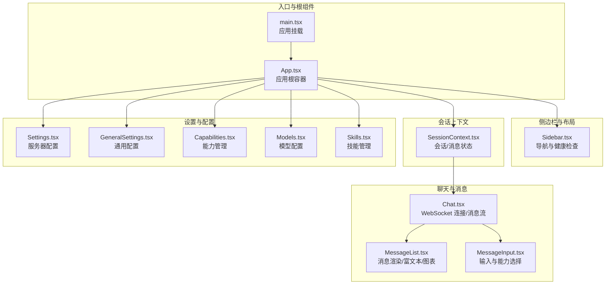
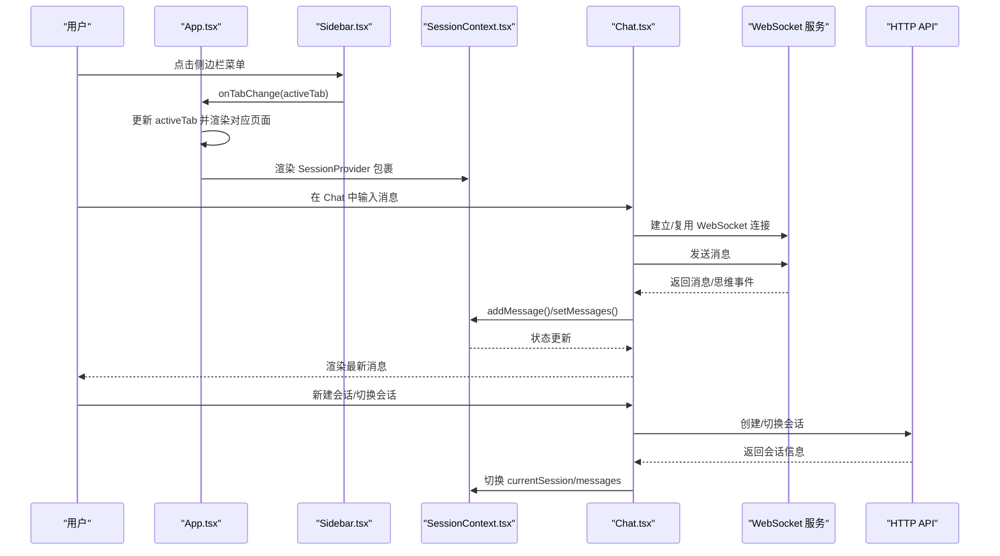
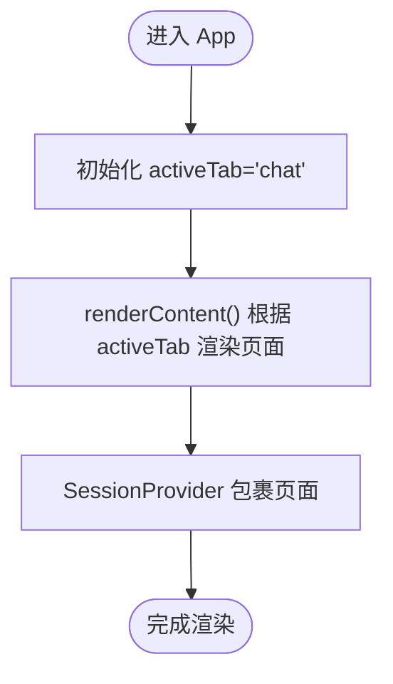
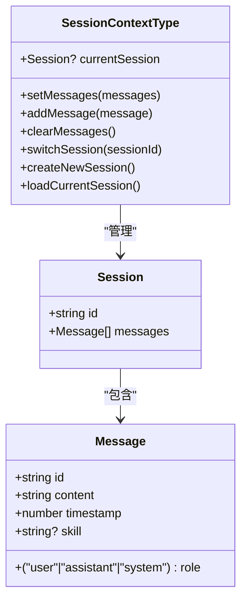
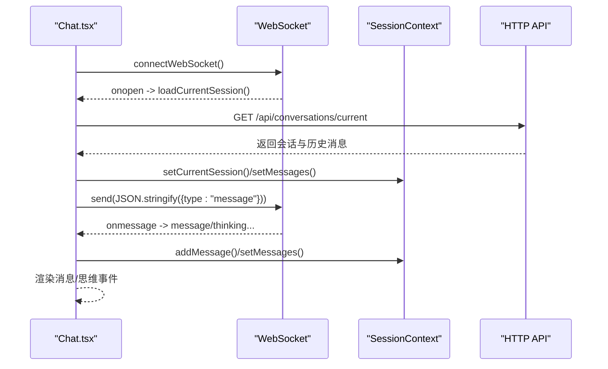
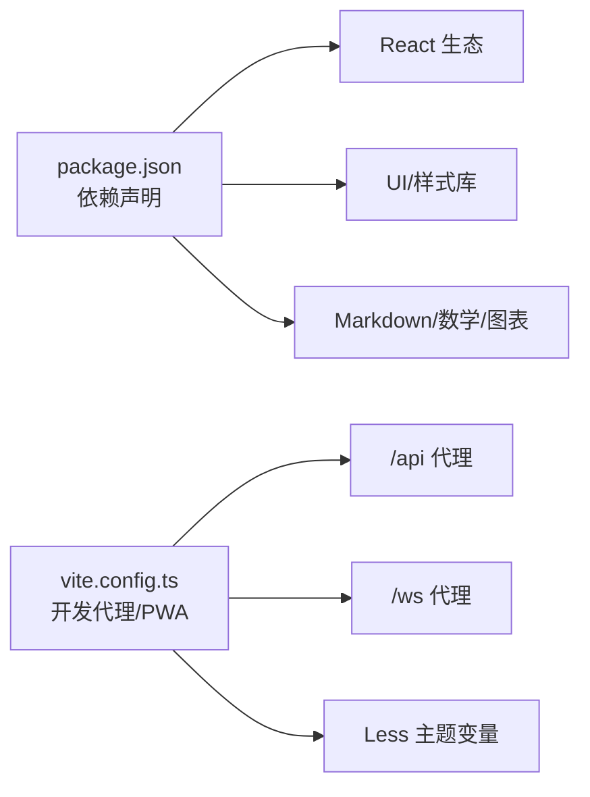

# React 应用架构

<cite>
**本文引用的文件**
- [App.tsx](file://dashboard/src/App.tsx)
- [main.tsx](file://dashboard/src/main.tsx)
- [SessionContext.tsx](file://dashboard/src/contexts/SessionContext.tsx)
- [Sidebar.tsx](file://dashboard/src/components/Sidebar.tsx)
- [Chat.tsx](file://dashboard/src/components/Chat.tsx)
- [MessageList.tsx](file://dashboard/src/components/MessageList.tsx)
- [MessageInput.tsx](file://dashboard/src/components/MessageInput.tsx)
- [Settings.tsx](file://dashboard/src/components/Settings.tsx)
- [GeneralSettings.tsx](file://dashboard/src/components/GeneralSettings.tsx)
- [Skills.tsx](file://dashboard/src/components/Skills.tsx)
- [Capabilities.tsx](file://dashboard/src/components/Capabilities.tsx)
- [Models.tsx](file://dashboard/src/components/Models.tsx)
- [i18n.ts](file://dashboard/src/i18n.ts)
- [package.json](file://dashboard/package.json)
- [vite.config.ts](file://dashboard/vite.config.ts)
</cite>

## 目录
1. [简介](#简介)
2. [项目结构](#项目结构)
3. [核心组件](#核心组件)
4. [架构总览](#架构总览)
5. [组件详解](#组件详解)
6. [依赖关系分析](#依赖关系分析)
7. [性能与可维护性](#性能与可维护性)
8. [故障排查指南](#故障排查指南)
9. [结论](#结论)
10. [附录](#附录)

## 简介
本文件面向 React 开发者，系统梳理 MindX 仪表盘前端的架构设计与实现要点，覆盖组件树结构、路由与标签页切换机制、状态管理模式、上下文作用域、TypeScript 类型体系、国际化与启动流程等。文档以“从上到下”的方式逐步展开，既适合初学者快速上手，也便于资深开发者进行架构复盘与扩展。

## 项目结构
仪表盘前端位于 dashboard/src 目录，采用“按功能域分层 + 组件化”的组织方式：
- 入口与根组件：main.tsx、App.tsx
- 业务页面：Chat、Skills、Capabilities、Models、Settings、GeneralSettings 等
- 通用组件：MessageList、MessageInput、Sidebar 等
- 上下文：SessionContext 提供会话与消息状态
- 国际化：i18n.ts 提供多语言与订阅机制
- 构建与代理：vite.config.ts 提供开发代理与 PWA 配置

图示来源
- [main.tsx](file://dashboard/src/main.tsx#L1-L11)
- [App.tsx](file://dashboard/src/App.tsx#L1-L66)
- [Sidebar.tsx](file://dashboard/src/components/Sidebar.tsx#L1-L127)
- [SessionContext.tsx](file://dashboard/src/contexts/SessionContext.tsx#L1-L138)
- [Chat.tsx](file://dashboard/src/components/Chat.tsx#L1-L354)
- [MessageList.tsx](file://dashboard/src/components/MessageList.tsx#L1-L403)
- [MessageInput.tsx](file://dashboard/src/components/MessageInput.tsx#L1-L144)
- [Settings.tsx](file://dashboard/src/components/Settings.tsx#L1-L399)
- [GeneralSettings.tsx](file://dashboard/src/components/GeneralSettings.tsx#L1-L110)
- [Capabilities.tsx](file://dashboard/src/components/Capabilities.tsx#L1-L498)
- [Models.tsx](file://dashboard/src/components/Models.tsx#L1-L261)
- [Skills.tsx](file://dashboard/src/components/Skills.tsx#L1-L314)

章节来源
- [main.tsx](file://dashboard/src/main.tsx#L1-L11)
- [App.tsx](file://dashboard/src/App.tsx#L1-L66)

## 核心组件
- 应用根组件 App：负责标签页状态与内容渲染，包裹 SessionProvider 提供全局会话上下文。
- 侧边栏 Sidebar：提供导航菜单、服务启停、健康检查、语言切换。
- 会话上下文 SessionContext：集中管理当前会话、消息列表、新增/切换/创建会话等操作。
- 聊天组件 Chat：负责 WebSocket 连接、消息收发、思维事件展示、会话切换与新建。
- 消息列表 MessageList：渲染用户/助手/系统消息，支持 Markdown、数学公式、Mermaid 图表、HTML。
- 消息输入 MessageInput：支持快捷键、能力选择、发送/停止。
- 设置类组件：Settings、GeneralSettings、Capabilities、Models、Skills 等，负责读取/保存配置与管理资源。

章节来源
- [App.tsx](file://dashboard/src/App.tsx#L1-L66)
- [Sidebar.tsx](file://dashboard/src/components/Sidebar.tsx#L1-L127)
- [SessionContext.tsx](file://dashboard/src/contexts/SessionContext.tsx#L1-L138)
- [Chat.tsx](file://dashboard/src/components/Chat.tsx#L1-L354)
- [MessageList.tsx](file://dashboard/src/components/MessageList.tsx#L1-L403)
- [MessageInput.tsx](file://dashboard/src/components/MessageInput.tsx#L1-L144)
- [Settings.tsx](file://dashboard/src/components/Settings.tsx#L1-L399)
- [GeneralSettings.tsx](file://dashboard/src/components/GeneralSettings.tsx#L1-L110)
- [Capabilities.tsx](file://dashboard/src/components/Capabilities.tsx#L1-L498)
- [Models.tsx](file://dashboard/src/components/Models.tsx#L1-L261)
- [Skills.tsx](file://dashboard/src/components/Skills.tsx#L1-L314)

## 架构总览
应用采用“根组件 + 上下文 + 页面组件”的分层架构：
- 根组件 App 仅承担标签页切换与内容渲染职责，不直接管理业务状态。
- SessionContext 将会话与消息状态提升至 Provider，供 Chat 及其子组件共享。
- 各页面组件通过 HTTP 接口与后端交互，部分组件通过 WebSocket 与后端进行实时通信。
- 国际化通过自研 i18n.ts 提供语言切换与订阅更新，避免全量重渲染。

图示来源
- [App.tsx](file://dashboard/src/App.tsx#L19-L62)
- [Sidebar.tsx](file://dashboard/src/components/Sidebar.tsx#L61-L105)
- [SessionContext.tsx](file://dashboard/src/contexts/SessionContext.tsx#L30-L129)
- [Chat.tsx](file://dashboard/src/components/Chat.tsx#L75-L163)

## 组件详解

### App 组件：标签页切换与内容渲染
- 状态：使用 useState 维护 activeTab，默认为 'chat'。
- 渲染策略：renderContent 根据 activeTab 返回对应页面组件，实现“标签页即路由”的轻量路由。
- Provider 包裹：在最外层提供 SessionContext，使所有页面共享会话状态。
- 交互：Sidebar 通过 onTabChange 传入的回调函数更新 activeTab。

图示来源
- [App.tsx](file://dashboard/src/App.tsx#L19-L62)

章节来源
- [App.tsx](file://dashboard/src/App.tsx#L19-L62)

### Sidebar：导航、健康检查与语言切换
- 健康检查：周期性调用 /api/health，更新 healthy 状态并在 UI 展示。
- 服务启停：根据 healthy 状态决定调用 /api/service/start 或 /api/service/stop。
- 语言切换：通过 useTranslation 切换语言并持久化到 localStorage。
- 菜单项：包含 chat/history/models/skills/capabilities/channels/mcp/usage/monitor/cron/advanced 等。

章节来源
- [Sidebar.tsx](file://dashboard/src/components/Sidebar.tsx#L27-L124)
- [i18n.ts](file://dashboard/src/i18n.ts#L446-L521)

### SessionContext：会话与消息状态管理
- 数据模型：Session 与 Message 接口定义清晰，支持 role、content、timestamp、skill 等字段。
- 核心方法：
  - loadCurrentSession：加载当前会话的历史消息。
  - switchSession：切换指定会话。
  - createNewSession：创建新会话。
  - addMessage、clearMessages：增删消息。
- 错误处理：对 fetch 请求进行错误捕获与日志记录。
- 使用约束：useSession 必须在 SessionProvider 内部使用，否则抛出异常。

图示来源
- [SessionContext.tsx](file://dashboard/src/contexts/SessionContext.tsx#L3-L26)
- [SessionContext.tsx](file://dashboard/src/contexts/SessionContext.tsx#L30-L129)

章节来源
- [SessionContext.tsx](file://dashboard/src/contexts/SessionContext.tsx#L1-L138)

### Chat：WebSocket 连接、消息流与会话管理
- WebSocket：根据协议与主机动态拼接 ws/wss 地址，建立连接后自动加载当前会话。
- 消息处理：解析服务端推送的消息类型，区分 message/thinking/pong/error，并更新状态。
- 思维事件：收集 thinking 事件并在 UI 中展示进度与阶段性输出。
- 会话操作：支持新建会话、切换会话、断线重连、能力前缀注入等。
- 输入集成：与 MessageInput 协作，处理发送、停止、能力选择。

图示来源
- [Chat.tsx](file://dashboard/src/components/Chat.tsx#L75-L163)
- [SessionContext.tsx](file://dashboard/src/contexts/SessionContext.tsx#L34-L60)

章节来源
- [Chat.tsx](file://dashboard/src/components/Chat.tsx#L51-L354)

### MessageList：富文本/数学/图表渲染
- 内容判定：优先判断 HTML，其次 Markdown，最后普通文本。
- Markdown：支持 gfm、换行、数学公式（KaTeX）、Mermaid 图表。
- Mermaid：通过 mermaid.initialize 与异步渲染，错误时回退到错误提示。
- 时间格式化：本地化时间字符串。
- 思维事件：当存在 thinking 事件时，额外渲染“思考中/完成/错误”状态与阶段性输出。

章节来源
- [MessageList.tsx](file://dashboard/src/components/MessageList.tsx#L1-L403)

### MessageInput：输入与能力选择
- 快捷键：Enter 发送，Shift+Enter 换行。
- 能力选择：在未选择能力时显示能力菜单；选择后以 tag 形式展示并可移除。
- 禁用逻辑：发送/停止按钮根据 isLoading 与输入内容动态启用/禁用。

章节来源
- [MessageInput.tsx](file://dashboard/src/components/MessageInput.tsx#L1-L144)

### 设置与配置组件
- Settings：服务器配置（含潜意识/意识模型、Token 预算等），支持刷新与保存。
- GeneralSettings：通用配置（工作区、服务器地址/端口），支持保存与反馈。
- Capabilities：能力管理（增删改查、启用/禁用、编辑系统提示词、添加新能力）。
- Models：模型配置（增删改、保存）。
- Skills：技能管理（验证、安装依赖、转换格式、环境变量、启用/禁用、重索引）。

章节来源
- [Settings.tsx](file://dashboard/src/components/Settings.tsx#L64-L399)
- [GeneralSettings.tsx](file://dashboard/src/components/GeneralSettings.tsx#L12-L110)
- [Capabilities.tsx](file://dashboard/src/components/Capabilities.tsx#L41-L498)
- [Models.tsx](file://dashboard/src/components/Models.tsx#L14-L261)
- [Skills.tsx](file://dashboard/src/components/Skills.tsx#L8-L314)

## 依赖关系分析
- 依赖来源：package.json 中声明 React、React DOM、tdesign-icons-react、tailwindcss、mermaid、react-markdown 等。
- 构建与代理：vite.config.ts 提供开发服务器、PWA、Less 变量注入、API 与 WebSocket 代理。
- 代理规则：/api 与 /health 代理到后端 HTTP 服务，/ws 代理到 WebSocket 服务，保证前后端联调顺畅。

图示来源
- [package.json](file://dashboard/package.json#L13-L56)
- [vite.config.ts](file://dashboard/vite.config.ts#L69-L104)

章节来源
- [package.json](file://dashboard/package.json#L1-L58)
- [vite.config.ts](file://dashboard/vite.config.ts#L1-L106)

## 性能与可维护性
- 状态提升与局部更新：SessionContext 将会话状态提升，避免重复请求与跨组件重复计算。
- 懒加载与条件渲染：Chat 在未连接时显示加载提示，减少无效渲染。
- 事件驱动渲染：MessageList 基于 props 变更触发重渲染，配合 Memo/Callback 可进一步优化。
- 国际化订阅：i18n.ts 通过订阅机制仅触发受影响组件的重渲染。
- 代理与缓存：VitePWA 的 Workbox 配置对 /api 与 /ws 使用 NetworkOnly，避免缓存干扰实时数据。

章节来源
- [SessionContext.tsx](file://dashboard/src/contexts/SessionContext.tsx#L30-L129)
- [Chat.tsx](file://dashboard/src/components/Chat.tsx#L318-L354)
- [MessageList.tsx](file://dashboard/src/components/MessageList.tsx#L264-L389)
- [i18n.ts](file://dashboard/src/i18n.ts#L446-L521)
- [vite.config.ts](file://dashboard/vite.config.ts#L48-L62)

## 故障排查指南
- WebSocket 连接失败
  - 确认 /ws 代理配置正确且后端 WebSocket 服务可用。
  - 查看浏览器控制台与 Chat 组件的连接错误提示。
- HTTP 请求失败
  - 检查 /api 代理是否指向正确的后端地址。
  - 关注 Chat/Settings/Skills 等组件中的错误提示与控制台日志。
- 会话切换/创建失败
  - 确认 /api/conversations 与 /api/conversations/{id}/switch 接口可用。
  - 检查 SessionContext 的 switchSession/createNewSession 是否被调用。
- 国际化不生效
  - 确认 i18n.ts 的语言切换逻辑与 localStorage 存储。
  - 检查 useTranslation 的订阅是否正常触发。

章节来源
- [Chat.tsx](file://dashboard/src/components/Chat.tsx#L75-L163)
- [SessionContext.tsx](file://dashboard/src/contexts/SessionContext.tsx#L62-L102)
- [vite.config.ts](file://dashboard/vite.config.ts#L73-L87)
- [i18n.ts](file://dashboard/src/i18n.ts#L446-L521)

## 结论
该前端架构以 App 为核心、SessionContext 为状态中枢、各页面组件围绕 HTTP/WebSocket 与后端协作，形成清晰的职责边界与可扩展性。通过 i18n 与 PWA 能力增强用户体验，结合合理的错误处理与代理配置，整体具备良好的开发效率与运维友好度。建议后续在大型页面引入懒加载与细粒度状态拆分，持续优化渲染性能与可维护性。

## 附录
- 启动流程
  - main.tsx 创建根节点并渲染 App。
  - App 初始化 activeTab 并渲染对应页面。
  - Chat 在首次渲染时建立 WebSocket 连接并加载当前会话。
  - Sidebar 周期性健康检查与语言切换。
- 最佳实践
  - 将跨页面共享的状态尽量提升到 Context，避免 props 深度传递。
  - 对长耗时操作（如技能重索引）提供明确的加载状态与错误提示。
  - 对富文本渲染（Markdown/Math/Mermaid）进行边界校验与错误降级。
  - 使用代理统一管理开发期的 API/WebSocket 路由，避免硬编码。