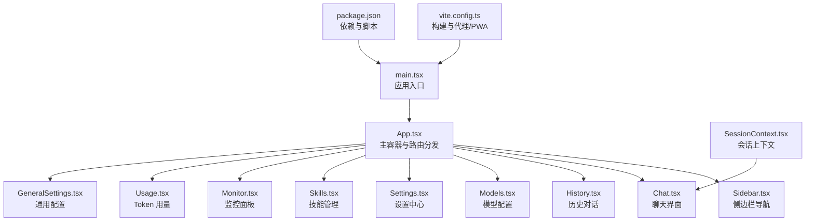
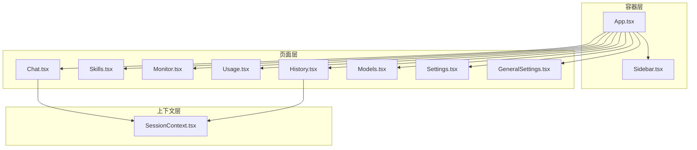
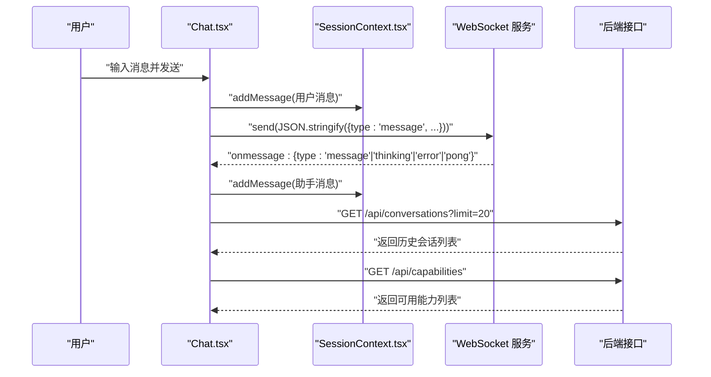
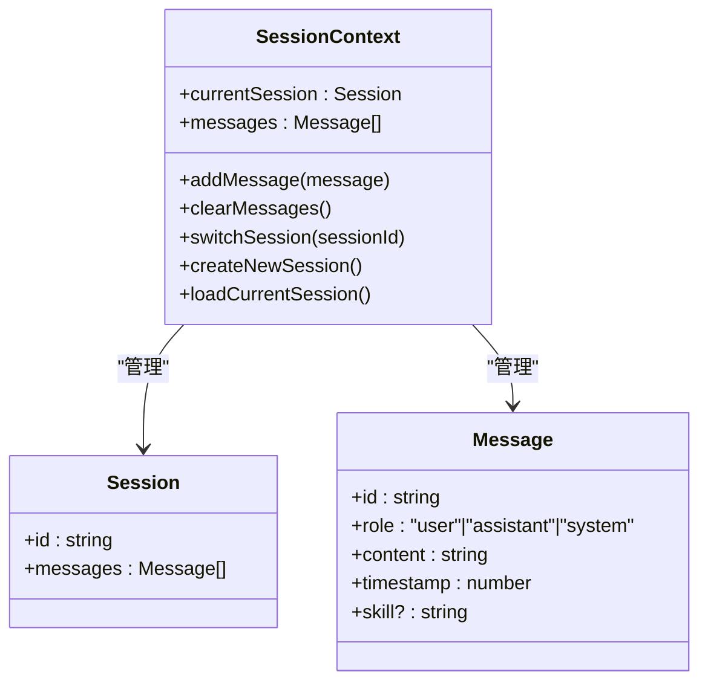
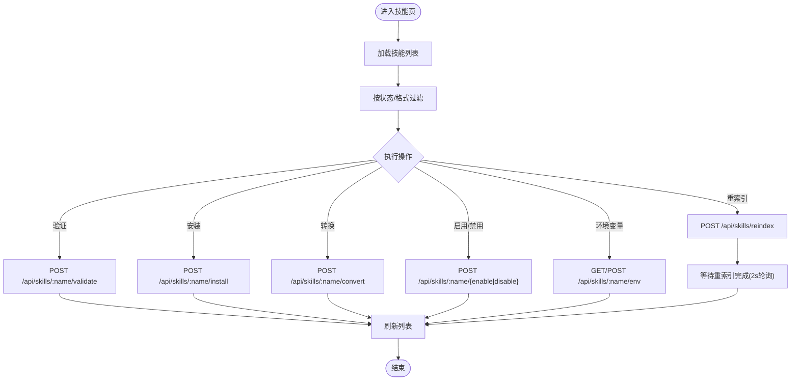
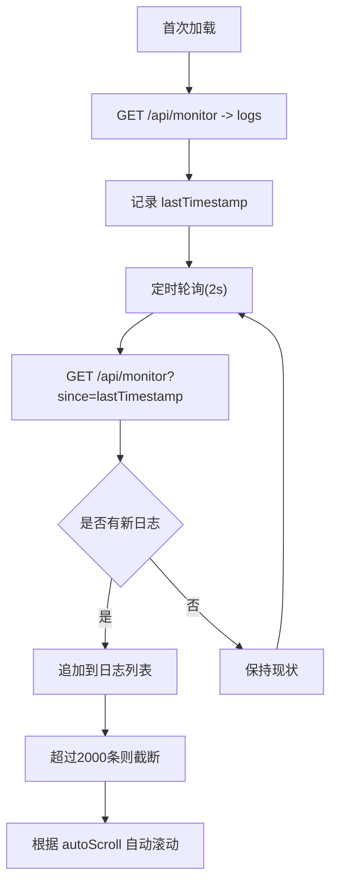
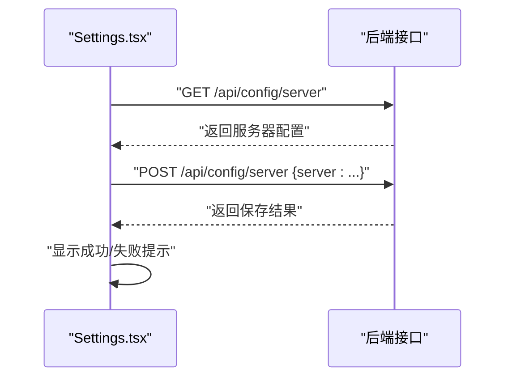
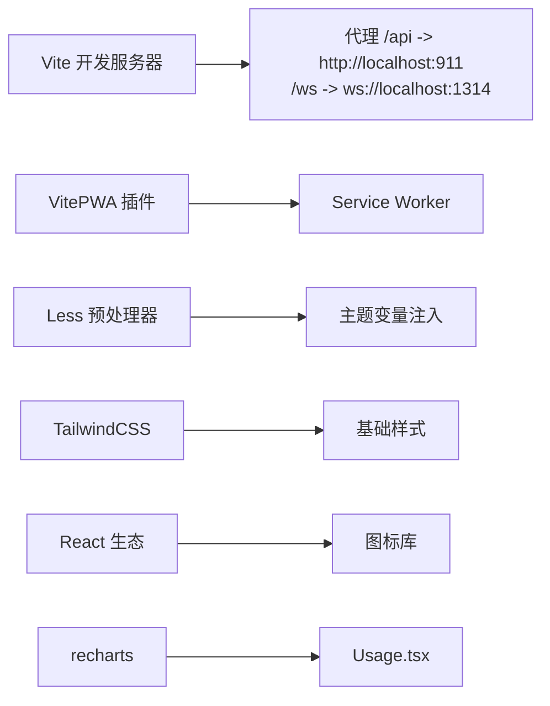

# 前端管理界面

<cite>
**本文引用的文件**   
- [dashboard/src/App.tsx](file://dashboard/src/App.tsx)
- [dashboard/src/main.tsx](file://dashboard/src/main.tsx)
- [dashboard/src/index.css](file://dashboard/src/index.css)
- [dashboard/src/components/Sidebar.tsx](file://dashboard/src/components/Sidebar.tsx)
- [dashboard/src/components/Chat.tsx](file://dashboard/src/components/Chat.tsx)
- [dashboard/src/components/Settings.tsx](file://dashboard/src/components/Settings.tsx)
- [dashboard/src/components/GeneralSettings.tsx](file://dashboard/src/components/GeneralSettings.tsx)
- [dashboard/src/components/Skills.tsx](file://dashboard/src/components/Skills.tsx)
- [dashboard/src/components/History.tsx](file://dashboard/src/components/History.tsx)
- [dashboard/src/components/Models.tsx](file://dashboard/src/components/Models.tsx)
- [dashboard/src/components/Monitor.tsx](file://dashboard/src/components/Monitor.tsx)
- [dashboard/src/components/Usage.tsx](file://dashboard/src/components/Usage.tsx)
- [dashboard/src/contexts/SessionContext.tsx](file://dashboard/src/contexts/SessionContext.tsx)
- [dashboard/vite.config.ts](file://dashboard/vite.config.ts)
- [dashboard/package.json](file://dashboard/package.json)
</cite>

## 目录
1. [简介](#简介)
2. [项目结构](#项目结构)
3. [核心组件](#核心组件)
4. [架构总览](#架构总览)
5. [详细组件分析](#详细组件分析)
6. [依赖关系分析](#依赖关系分析)
7. [性能考量](#性能考量)
8. [故障排查指南](#故障排查指南)
9. [结论](#结论)
10. [附录](#附录)

## 简介
本文件为 MindX 前端管理界面的完整技术文档，面向前端开发者与维护者，系统化阐述基于 React 的管理界面架构设计、组件树结构、状态管理策略、路由与导航、实时通信机制（WebSocket）、以及响应式设计与用户体验优化。文档同时提供组件开发指南、样式定制方法、使用示例与扩展建议，帮助读者快速理解并高效迭代。

## 项目结构
Dashboard 前端采用 Vite + React + TypeScript 构建，TailwindCSS 与 Less 提供样式支持，并通过 PWA 插件提升离线体验与缓存策略。应用入口位于 dashboard/src，核心页面通过侧边栏导航切换，状态通过自定义 Context 在组件间共享。

**图示来源**
- [dashboard/src/main.tsx](file://dashboard/src/main.tsx#L1-L11)
- [dashboard/src/App.tsx](file://dashboard/src/App.tsx#L1-L66)
- [dashboard/src/components/Sidebar.tsx](file://dashboard/src/components/Sidebar.tsx#L1-L127)
- [dashboard/src/components/Chat.tsx](file://dashboard/src/components/Chat.tsx#L1-L354)
- [dashboard/src/components/History.tsx](file://dashboard/src/components/History.tsx#L1-L177)
- [dashboard/src/components/Models.tsx](file://dashboard/src/components/Models.tsx#L1-L261)
- [dashboard/src/components/Settings.tsx](file://dashboard/src/components/Settings.tsx#L1-L399)
- [dashboard/src/components/Skills.tsx](file://dashboard/src/components/Skills.tsx#L1-L314)
- [dashboard/src/components/Monitor.tsx](file://dashboard/src/components/Monitor.tsx#L1-L279)
- [dashboard/src/components/Usage.tsx](file://dashboard/src/components/Usage.tsx#L1-L184)
- [dashboard/src/components/GeneralSettings.tsx](file://dashboard/src/components/GeneralSettings.tsx#L1-L110)
- [dashboard/src/contexts/SessionContext.tsx](file://dashboard/src/contexts/SessionContext.tsx#L1-L138)
- [dashboard/vite.config.ts](file://dashboard/vite.config.ts#L1-L106)
- [dashboard/package.json](file://dashboard/package.json#L1-L58)

**章节来源**
- [dashboard/src/main.tsx](file://dashboard/src/main.tsx#L1-L11)
- [dashboard/src/App.tsx](file://dashboard/src/App.tsx#L1-L66)
- [dashboard/src/components/Sidebar.tsx](file://dashboard/src/components/Sidebar.tsx#L1-L127)
- [dashboard/vite.config.ts](file://dashboard/vite.config.ts#L1-L106)
- [dashboard/package.json](file://dashboard/package.json#L1-L58)

## 核心组件
- 主容器与路由分发：App.tsx 通过状态 activeTab 控制主内容区域渲染，结合 SessionProvider 提供全局会话上下文。
- 侧边栏导航：Sidebar.tsx 提供菜单项切换、服务健康检查与语言切换。
- 聊天界面：Chat.tsx 负责 WebSocket 连接、消息收发、会话选择与“思考事件”展示。
- 设置中心：Settings.tsx 与 GeneralSettings.tsx 分别负责服务器配置与通用配置的读取与保存。
- 技能管理：Skills.tsx 提供技能列表、验证、安装、转换、环境变量管理与重索引。
- 历史对话：History.tsx 展示与切换历史会话。
- 模型配置：Models.tsx 管理多模型配置的增删改查与保存。
- 监控面板：Monitor.tsx 支持日志拉取、增量轮询、过滤与清空。
- Token 用量：Usage.tsx 展示 Token 使用统计与图表。
- 会话上下文：SessionContext.tsx 提供会话加载、切换、创建与消息管理。

**章节来源**
- [dashboard/src/App.tsx](file://dashboard/src/App.tsx#L1-L66)
- [dashboard/src/components/Sidebar.tsx](file://dashboard/src/components/Sidebar.tsx#L1-L127)
- [dashboard/src/components/Chat.tsx](file://dashboard/src/components/Chat.tsx#L1-L354)
- [dashboard/src/components/Settings.tsx](file://dashboard/src/components/Settings.tsx#L1-L399)
- [dashboard/src/components/GeneralSettings.tsx](file://dashboard/src/components/GeneralSettings.tsx#L1-L110)
- [dashboard/src/components/Skills.tsx](file://dashboard/src/components/Skills.tsx#L1-L314)
- [dashboard/src/components/History.tsx](file://dashboard/src/components/History.tsx#L1-L177)
- [dashboard/src/components/Models.tsx](file://dashboard/src/components/Models.tsx#L1-L261)
- [dashboard/src/components/Monitor.tsx](file://dashboard/src/components/Monitor.tsx#L1-L279)
- [dashboard/src/components/Usage.tsx](file://dashboard/src/components/Usage.tsx#L1-L184)
- [dashboard/src/contexts/SessionContext.tsx](file://dashboard/src/contexts/SessionContext.tsx#L1-L138)

## 架构总览
前端采用“容器组件 + 页面组件 + 上下文”的分层架构：
- 容器组件：App.tsx、Sidebar.tsx 负责布局与导航。
- 页面组件：各功能页（Chat、Skills、Monitor、Usage 等）独立封装业务逻辑。
- 上下文：SessionContext.tsx 提供会话与消息的跨组件共享，避免深层传递。

**图示来源**
- [dashboard/src/App.tsx](file://dashboard/src/App.tsx#L1-L66)
- [dashboard/src/components/Sidebar.tsx](file://dashboard/src/components/Sidebar.tsx#L1-L127)
- [dashboard/src/components/Chat.tsx](file://dashboard/src/components/Chat.tsx#L1-L354)
- [dashboard/src/components/Skills.tsx](file://dashboard/src/components/Skills.tsx#L1-L314)
- [dashboard/src/components/Monitor.tsx](file://dashboard/src/components/Monitor.tsx#L1-L279)
- [dashboard/src/components/Usage.tsx](file://dashboard/src/components/Usage.tsx#L1-L184)
- [dashboard/src/components/History.tsx](file://dashboard/src/components/History.tsx#L1-L177)
- [dashboard/src/components/Models.tsx](file://dashboard/src/components/Models.tsx#L1-L261)
- [dashboard/src/components/Settings.tsx](file://dashboard/src/components/Settings.tsx#L1-L399)
- [dashboard/src/components/GeneralSettings.tsx](file://dashboard/src/components/GeneralSettings.tsx#L1-L110)
- [dashboard/src/contexts/SessionContext.tsx](file://dashboard/src/contexts/SessionContext.tsx#L1-L138)

## 详细组件分析

### 聊天界面（Chat.tsx）
- WebSocket 实时通信
  - 连接建立：根据协议自动选择 ws/wss，支持通过环境变量覆盖主机。
  - 消息类型：支持 connected、message、thinking、pong、error 等类型。
  - 错误处理：连接错误、发送失败、断线重连（延迟重试）。
- 会话管理
  - 新建会话、切换会话、加载当前会话。
  - 会话选择下拉框与历史记录联动。
- 思考事件
  - thinking 事件流聚合与自动清理（完成后3秒清空）。
- 用户交互
  - 发送消息、停止生成、重新连接、能力选择（Capability）。

**图示来源**
- [dashboard/src/components/Chat.tsx](file://dashboard/src/components/Chat.tsx#L75-L163)
- [dashboard/src/contexts/SessionContext.tsx](file://dashboard/src/contexts/SessionContext.tsx#L104-L128)
- [dashboard/src/components/Chat.tsx](file://dashboard/src/components/Chat.tsx#L165-L181)

**章节来源**
- [dashboard/src/components/Chat.tsx](file://dashboard/src/components/Chat.tsx#L1-L354)
- [dashboard/src/contexts/SessionContext.tsx](file://dashboard/src/contexts/SessionContext.tsx#L1-L138)

### 会话上下文（SessionContext.tsx）
- 提供的方法与状态
  - currentSession、messages、addMessage、clearMessages、switchSession、createNewSession、loadCurrentSession。
- 数据来源
  - 通过 /api/conversations/* 接口与后端交互，构造消息时间戳与历史消息映射。
- 使用方式
  - 在 Chat.tsx、History.tsx 中通过 useSession 获取上下文并调用相应方法。

**图示来源**
- [dashboard/src/contexts/SessionContext.tsx](file://dashboard/src/contexts/SessionContext.tsx#L3-L26)

**章节来源**
- [dashboard/src/contexts/SessionContext.tsx](file://dashboard/src/contexts/SessionContext.tsx#L1-L138)

### 技能管理（Skills.tsx）
- 功能点
  - 技能列表加载、状态过滤、格式过滤（标准/外部/MCP）。
  - 验证（校验二进制与环境变量）、安装依赖、转换格式、启用/禁用、查看/保存环境变量。
  - 重索引触发与进度反馈。
- 交互流程
  - 列表定时刷新（重索引期间每2秒一次），操作按钮禁用与加载态提示，统一的消息提示与错误弹窗。

**图示来源**
- [dashboard/src/components/Skills.tsx](file://dashboard/src/components/Skills.tsx#L35-L180)

**章节来源**
- [dashboard/src/components/Skills.tsx](file://dashboard/src/components/Skills.tsx#L1-L314)

### 监控面板（Monitor.tsx）
- 日志获取策略
  - 首次加载完整日志；后续以增量轮询方式（since 参数）拉取新日志。
- 用户体验
  - 自动滚动开关、底部跳转按钮、过滤器（级别/关键词）、清空确认。
- 内存保护
  - 限制日志数量（超过2000条截断保留最新）。

**图示来源**
- [dashboard/src/components/Monitor.tsx](file://dashboard/src/components/Monitor.tsx#L55-L98)

**章节来源**
- [dashboard/src/components/Monitor.tsx](file://dashboard/src/components/Monitor.tsx#L1-L279)

### 设置中心（Settings.tsx 与 GeneralSettings.tsx）
- Settings.tsx
  - 服务器配置（主机、端口、模型、预算等）与通用设置（主题、语言、通知、自动保存）。
  - 保存成功/失败反馈与加载态。
- GeneralSettings.tsx
  - 通用配置（工作区、服务器地址与端口）的读取与保存。

**图示来源**
- [dashboard/src/components/Settings.tsx](file://dashboard/src/components/Settings.tsx#L81-L115)

**章节来源**
- [dashboard/src/components/Settings.tsx](file://dashboard/src/components/Settings.tsx#L1-L399)
- [dashboard/src/components/GeneralSettings.tsx](file://dashboard/src/components/GeneralSettings.tsx#L1-L110)

### 历史对话（History.tsx）
- 功能点
  - 加载历史会话、搜索标题、切换当前会话、删除会话。
- 与会话上下文协作
  - 通过 useSession 的 switchSession 实现会话切换。

**章节来源**
- [dashboard/src/components/History.tsx](file://dashboard/src/components/History.tsx#L1-L177)
- [dashboard/src/contexts/SessionContext.tsx](file://dashboard/src/contexts/SessionContext.tsx#L62-L85)

### 模型配置（Models.tsx）
- 功能点
  - 读取模型列表、新增/删除模型、编辑参数（温度、最大 tokens、URL、密钥等）、保存。
- 交互细节
  - 编辑态与只读态切换，保存成功提示。

**章节来源**
- [dashboard/src/components/Models.tsx](file://dashboard/src/components/Models.tsx#L1-L261)

### Token 用量（Usage.tsx）
- 功能点
  - 拉取按模型汇总的 Token 使用数据，展示统计卡片与柱状图，支持刷新与重试。
- 数据准备
  - 将后端返回结构映射为图表所需格式。

**章节来源**
- [dashboard/src/components/Usage.tsx](file://dashboard/src/components/Usage.tsx#L1-L184)

## 依赖关系分析
- 构建与开发工具
  - Vite 提供开发服务器与热更新；PWA 插件提供 Service Worker 与 Manifest；Less 变量注入主题色。
  - 代理配置将 /api 与 /ws 请求转发至后端服务。
- 样式与主题
  - Tailwind 基础类与自定义动画、滚动条样式；Less 变量覆盖品牌色与背景色。
- 依赖库
  - React、React DOM、图标库（tdesign-icons-react、react-icons）、可视化（recharts）、Markdown 渲染（react-markdown）等。

**图示来源**
- [dashboard/vite.config.ts](file://dashboard/vite.config.ts#L73-L87)
- [dashboard/vite.config.ts](file://dashboard/vite.config.ts#L89-L104)
- [dashboard/src/index.css](file://dashboard/src/index.css#L1-L62)
- [dashboard/package.json](file://dashboard/package.json#L13-L36)

**章节来源**
- [dashboard/vite.config.ts](file://dashboard/vite.config.ts#L1-L106)
- [dashboard/src/index.css](file://dashboard/src/index.css#L1-L62)
- [dashboard/package.json](file://dashboard/package.json#L1-L58)

## 性能考量
- WebSocket 连接与重连
  - 断线自动重连（延迟策略），避免频繁重试导致资源浪费。
- 日志增量轮询
  - 使用 since 参数减少无效数据传输，配合内存截断避免内存膨胀。
- 图表渲染
  - 使用 ResponsiveContainer 与预设尺寸，避免频繁重排；仅在数据变化时更新。
- 样式与资源
  - PWA 缓存策略对 /api 与 /ws 采用 NetworkOnly，确保实时性；静态资源缓存优化加载速度。

[本节为通用指导，不直接分析具体文件]

## 故障排查指南
- WebSocket 连接失败
  - 检查 /ws 代理是否正确指向后端 WebSocket 服务；确认协议（ws/wss）与主机配置。
  - 查看浏览器网络面板与控制台错误日志。
- 聊天消息未显示
  - 确认后端返回 message 类型消息；检查 SessionContext 是否正确 addMessage。
- 技能操作失败
  - 观察操作按钮禁用态与 actionMessage 提示；检查对应 API 返回状态码。
- 监控日志不刷新
  - 确认轮询间隔与 lastTimestamp 更新；检查 since 参数是否正确传入。
- 设置保存失败
  - 检查 /api/config/server 的 POST 请求与响应；确认字段映射一致。

**章节来源**
- [dashboard/src/components/Chat.tsx](file://dashboard/src/components/Chat.tsx#L142-L152)
- [dashboard/src/components/Monitor.tsx](file://dashboard/src/components/Monitor.tsx#L75-L98)
- [dashboard/src/components/Skills.tsx](file://dashboard/src/components/Skills.tsx#L50-L72)
- [dashboard/src/components/Settings.tsx](file://dashboard/src/components/Settings.tsx#L94-L115)

## 结论
MindX 前端管理界面以清晰的组件分层、稳定的上下文状态管理与完善的实时通信机制为核心，结合响应式设计与 PWA 能力，提供了良好的开发体验与运维可观测性。通过本文档的架构说明、组件剖析与最佳实践，开发者可快速定位问题、扩展功能并持续优化用户体验。

## 附录

### 组件开发指南
- 新增页面组件
  - 在 dashboard/src/components 下创建新组件文件，遵循现有命名与样式组织。
  - 如需会话相关能力，使用 useSession 并在 App.tsx 的路由分发表中注册。
- 状态管理
  - 优先使用 SessionContext.tsx 管理会话与消息；避免在子组件中重复 fetch。
- WebSocket 交互
  - 统一在 Chat.tsx 中处理连接、消息类型与错误；其他组件通过回调或上下文进行协作。
- 样式定制
  - 使用 Tailwind 基础类与自定义动画；主题变量通过 Less 注入；组件级样式放入对应 styles/*.css。

**章节来源**
- [dashboard/src/App.tsx](file://dashboard/src/App.tsx#L22-L51)
- [dashboard/src/contexts/SessionContext.tsx](file://dashboard/src/contexts/SessionContext.tsx#L112-L128)
- [dashboard/src/components/Chat.tsx](file://dashboard/src/components/Chat.tsx#L75-L152)
- [dashboard/src/index.css](file://dashboard/src/index.css#L1-L62)
- [dashboard/vite.config.ts](file://dashboard/vite.config.ts#L89-L104)

### 使用示例与扩展建议
- 示例：在 Chat.tsx 中新增消息类型
  - 在 WSMessage 类型与 switch 分支中增加新类型处理；在 UI 中渲染对应内容。
- 扩展：引入国际化
  - 现有 i18n 使用方式可复用到新组件；建议统一翻译键命名规范。
- 扩展：监控面板增强
  - 增加日志导出、标签筛选、高亮关键字等功能。

**章节来源**
- [dashboard/src/components/Chat.tsx](file://dashboard/src/components/Chat.tsx#L92-L140)
- [dashboard/src/components/Monitor.tsx](file://dashboard/src/components/Monitor.tsx#L137-L144)