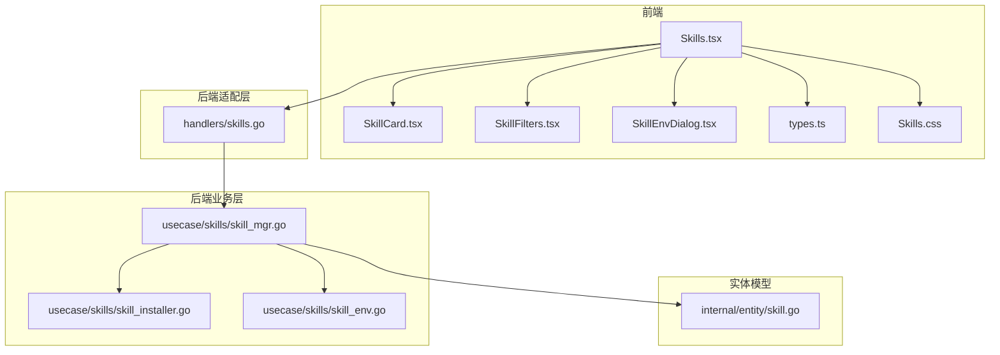
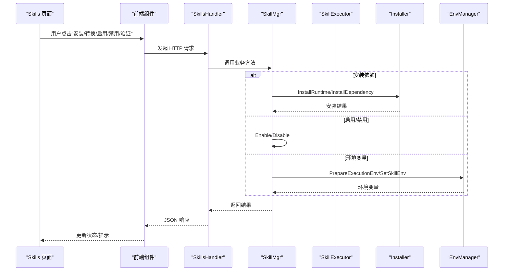
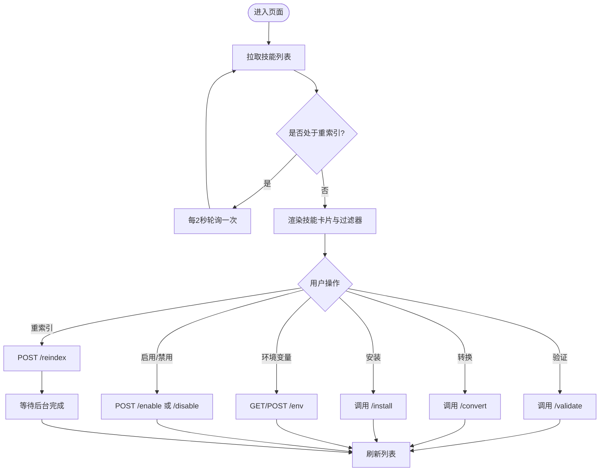
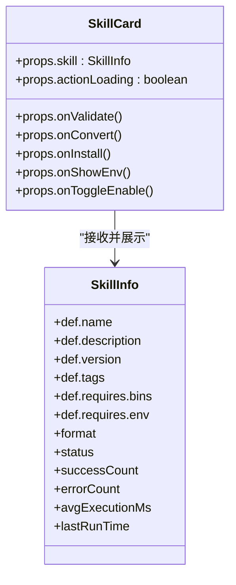
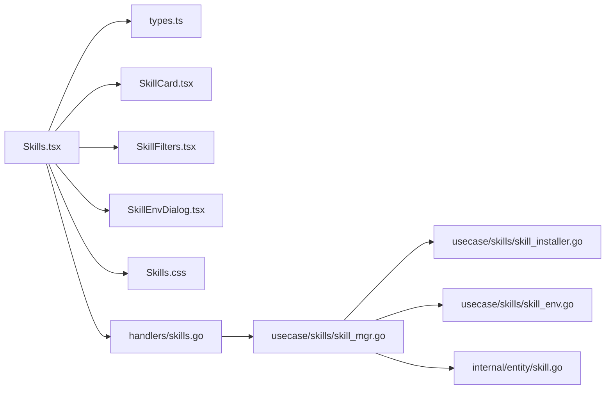

# 技能管理界面

<cite>
**本文引用的文件**
- [dashboard/src/components/Skills.tsx](file://dashboard/src/components/Skills.tsx)
- [dashboard/src/components/skills/SkillCard.tsx](file://dashboard/src/components/skills/SkillCard.tsx)
- [dashboard/src/components/skills/SkillFilters.tsx](file://dashboard/src/components/skills/SkillFilters.tsx)
- [dashboard/src/components/skills/SkillEnvDialog.tsx](file://dashboard/src/components/skills/SkillEnvDialog.tsx)
- [dashboard/src/components/skills/types.ts](file://dashboard/src/components/skills/types.ts)
- [dashboard/src/components/styles/Skills.css](file://dashboard/src/components/styles/Skills.css)
- [internal/adapters/http/handlers/skills.go](file://internal/adapters/http/handlers/skills.go)
- [internal/usecase/skills/skill_mgr.go](file://internal/usecase/skills/skill_mgr.go)
- [internal/usecase/skills/skill_installer.go](file://internal/usecase/skills/skill_installer.go)
- [internal/usecase/skills/skill_env.go](file://internal/usecase/skills/skill_env.go)
- [internal/entity/skill.go](file://internal/entity/skill.go)
- [internal/usecase/skills/README.md](file://internal/usecase/skills/README.md)
- [internal/usecase/skills/SKILL_DEVELOPMENT.md](file://internal/usecase/skills/SKILL_DEVELOPMENT.md)
- [dashboard/src/App.tsx](file://dashboard/src/App.tsx)
- [skills/calculator/SKILL.md](file://skills/calculator/SKILL.md)
- [skills/web_search/SKILL.md](file://skills/web_search/SKILL.md)
</cite>

## 目录
1. [简介](#简介)
2. [项目结构](#项目结构)
3. [核心组件](#核心组件)
4. [架构总览](#架构总览)
5. [详细组件分析](#详细组件分析)
6. [依赖关系分析](#依赖关系分析)
7. [性能考量](#性能考量)
8. [故障排查指南](#故障排查指南)
9. [结论](#结论)
10. [附录](#附录)

## 简介
本文件为 MindX 技能管理界面的完整技术文档，聚焦前端技能列表展示与管理功能，涵盖技能卡片组件、过滤器、环境配置对话框；同时阐述技能安装、卸载、配置流程，技能分类与搜索实现，技能状态管理与错误处理机制，以及技能环境变量的配置与管理。文档还提供定制化开发指南、开发者使用示例与最佳实践，帮助前端开发者快速理解并扩展技能管理功能。

## 项目结构
技能管理界面位于前端 dashboard 子项目中，采用 React + TypeScript 构建，并通过 HTTP 接口与后端技能管理模块交互。核心文件组织如下：
- 前端组件层：Skills.tsx（主页面）、SkillCard.tsx（技能卡片）、SkillFilters.tsx（过滤器）、SkillEnvDialog.tsx（环境变量对话框）、types.ts（类型定义）、Skills.css（样式）
- 后端适配层：handlers/skills.go（HTTP 处理器）
- 后端业务层：usecase/skills 下的 SkillMgr、Installer、EnvManager 等
- 实体模型：internal/entity/skill.go
- 技能开发指南：internal/usecase/skills/SKILL_DEVELOPMENT.md
- 示例技能：skills/calculator、skills/web_search

图表来源
- [dashboard/src/components/Skills.tsx](file://dashboard/src/components/Skills.tsx#L1-L314)
- [dashboard/src/components/skills/SkillCard.tsx](file://dashboard/src/components/skills/SkillCard.tsx#L1-L119)
- [dashboard/src/components/skills/SkillFilters.tsx](file://dashboard/src/components/skills/SkillFilters.tsx#L1-L32)
- [dashboard/src/components/skills/SkillEnvDialog.tsx](file://dashboard/src/components/skills/SkillEnvDialog.tsx#L1-L58)
- [dashboard/src/components/skills/types.ts](file://dashboard/src/components/skills/types.ts#L1-L103)
- [dashboard/src/components/styles/Skills.css](file://dashboard/src/components/styles/Skills.css#L1-L651)
- [internal/adapters/http/handlers/skills.go](file://internal/adapters/http/handlers/skills.go#L1-L496)
- [internal/usecase/skills/skill_mgr.go](file://internal/usecase/skills/skill_mgr.go#L1-L558)
- [internal/usecase/skills/skill_installer.go](file://internal/usecase/skills/skill_installer.go#L1-L67)
- [internal/usecase/skills/skill_env.go](file://internal/usecase/skills/skill_env.go#L1-L151)
- [internal/entity/skill.go](file://internal/entity/skill.go#L1-L83)

章节来源
- [dashboard/src/components/Skills.tsx](file://dashboard/src/components/Skills.tsx#L1-L314)
- [internal/adapters/http/handlers/skills.go](file://internal/adapters/http/handlers/skills.go#L1-L496)

## 核心组件
- 技能列表页面（Skills.tsx）：负责拉取技能数据、渲染卡片、处理安装/转换/启用/禁用/验证/重索引等动作，维护过滤状态与加载状态。
- 技能卡片（SkillCard.tsx）：展示单个技能的基本信息、状态徽章、缺失依赖警告、统计信息与操作按钮。
- 过滤器（SkillFilters.tsx）：提供按状态与格式的双维度筛选。
- 环境变量对话框（SkillEnvDialog.tsx）：展示并编辑技能所需环境变量，支持保存。
- 类型定义（types.ts）：定义技能元数据、信息、验证结果、安装方法等接口。
- 样式（Skills.css）：统一的暗色主题与响应式布局，包含对话框、加载与重索引覆盖层样式。

章节来源
- [dashboard/src/components/Skills.tsx](file://dashboard/src/components/Skills.tsx#L1-L314)
- [dashboard/src/components/skills/SkillCard.tsx](file://dashboard/src/components/skills/SkillCard.tsx#L1-L119)
- [dashboard/src/components/skills/SkillFilters.tsx](file://dashboard/src/components/skills/SkillFilters.tsx#L1-L32)
- [dashboard/src/components/skills/SkillEnvDialog.tsx](file://dashboard/src/components/skills/SkillEnvDialog.tsx#L1-L58)
- [dashboard/src/components/skills/types.ts](file://dashboard/src/components/skills/types.ts#L1-L103)
- [dashboard/src/components/styles/Skills.css](file://dashboard/src/components/styles/Skills.css#L1-L651)

## 架构总览
前端通过 HTTP 接口与后端交互，后端使用 Facade 模式统一协调加载、执行、搜索、索引、转换、安装与环境管理等子模块。

图表来源
- [dashboard/src/components/Skills.tsx](file://dashboard/src/components/Skills.tsx#L50-L180)
- [internal/adapters/http/handlers/skills.go](file://internal/adapters/http/handlers/skills.go#L117-L194)
- [internal/usecase/skills/skill_mgr.go](file://internal/usecase/skills/skill_mgr.go#L151-L183)
- [internal/usecase/skills/skill_installer.go](file://internal/usecase/skills/skill_installer.go#L24-L66)
- [internal/usecase/skills/skill_env.go](file://internal/usecase/skills/skill_env.go#L100-L135)

## 详细组件分析

### 技能列表页面（Skills.tsx）
- 数据获取与轮询：首次加载后定时轮询技能列表，当处于重索引状态时每 2 秒刷新一次。
- 动作处理：
  - 验证：调用 /api/skills/:name/validate，展示缺失二进制与环境变量及错误详情。
  - 转换：调用 /api/skills/:name/convert，成功后刷新列表。
  - 安装：调用 /api/skills/:name/install，安装缺失依赖后刷新列表。
  - 环境变量：GET /api/skills/:name/env，POST /api/skills/:name/env 保存。
  - 启用/禁用：POST /api/skills/:name/enable 或 /api/skills/:name/disable。
  - 重索引：POST /api/skills/reindex，后台触发重建索引。
- 过滤逻辑：根据状态与格式过滤，支持 MCP 技能专用筛选。
- UI 状态：loading、error、actionLoading、reIndexing、reIndexError 等。

图表来源
- [dashboard/src/components/Skills.tsx](file://dashboard/src/components/Skills.tsx#L25-L180)

章节来源
- [dashboard/src/components/Skills.tsx](file://dashboard/src/components/Skills.tsx#L1-L314)

### 技能卡片（SkillCard.tsx）
- 展示字段：名称、版本、表情符号、描述、标签、格式徽章（[std]/[ext]/[MCP]）、状态徽章（就绪/运行中/停止/禁用/错误）。
- 警告提示：缺失二进制与缺失环境变量。
- 统计信息：成功次数、错误次数、平均耗时、最后运行时间。
- 操作按钮：验证、转换格式、安装依赖、环境变量、启用/禁用。

图表来源
- [dashboard/src/components/skills/SkillCard.tsx](file://dashboard/src/components/skills/SkillCard.tsx#L23-L119)
- [dashboard/src/components/skills/types.ts](file://dashboard/src/components/skills/types.ts#L33-L64)

章节来源
- [dashboard/src/components/skills/SkillCard.tsx](file://dashboard/src/components/skills/SkillCard.tsx#L1-L119)
- [dashboard/src/components/skills/types.ts](file://dashboard/src/components/skills/types.ts#L1-L103)

### 过滤器（SkillFilters.tsx）
- 状态过滤：全部、准备就绪、已安装、错误。
- 格式过滤：全部、标准、外部、MCP。
- 与父组件 Skills.tsx 的状态联动，实时影响渲染列表。

章节来源
- [dashboard/src/components/skills/SkillFilters.tsx](file://dashboard/src/components/skills/SkillFilters.tsx#L1-L32)

### 环境变量对话框（SkillEnvDialog.tsx）
- 读取技能定义中的 requires.env，逐项输入并保存。
- 保存后调用后端接口，刷新技能列表。

章节来源
- [dashboard/src/components/skills/SkillEnvDialog.tsx](file://dashboard/src/components/skills/SkillEnvDialog.tsx#L1-L58)
- [dashboard/src/components/Skills.tsx](file://dashboard/src/components/Skills.tsx#L113-L146)

### 类型定义（types.ts）
- SkillMetadata/SkillInfo：技能元数据与完整信息，包含格式、状态、统计、缺失依赖等。
- ValidationResult：验证结果，包含 canRun、缺失项与错误列表。
- isMCPSkill：判断是否为 MCP 技能。

章节来源
- [dashboard/src/components/skills/types.ts](file://dashboard/src/components/skills/types.ts#L1-L103)

### 样式（Skills.css）
- 暗色主题、网格布局、响应式设计。
- 对话框、加载与重索引覆盖层、徽章与状态颜色体系。

章节来源
- [dashboard/src/components/styles/Skills.css](file://dashboard/src/components/styles/Skills.css#L1-L651)

## 依赖关系分析
前端组件与后端处理器之间的依赖关系如下：

图表来源
- [dashboard/src/components/Skills.tsx](file://dashboard/src/components/Skills.tsx#L1-L314)
- [dashboard/src/components/skills/types.ts](file://dashboard/src/components/skills/types.ts#L1-L103)
- [dashboard/src/components/skills/SkillCard.tsx](file://dashboard/src/components/skills/SkillCard.tsx#L1-L119)
- [dashboard/src/components/skills/SkillFilters.tsx](file://dashboard/src/components/skills/SkillFilters.tsx#L1-L32)
- [dashboard/src/components/skills/SkillEnvDialog.tsx](file://dashboard/src/components/skills/SkillEnvDialog.tsx#L1-L58)
- [internal/adapters/http/handlers/skills.go](file://internal/adapters/http/handlers/skills.go#L1-L496)
- [internal/usecase/skills/skill_mgr.go](file://internal/usecase/skills/skill_mgr.go#L1-L558)
- [internal/usecase/skills/skill_installer.go](file://internal/usecase/skills/skill_installer.go#L1-L67)
- [internal/usecase/skills/skill_env.go](file://internal/usecase/skills/skill_env.go#L1-L151)
- [internal/entity/skill.go](file://internal/entity/skill.go#L1-L83)

章节来源
- [internal/usecase/skills/README.md](file://internal/usecase/skills/README.md#L1-L168)

## 性能考量
- 前端轮询策略：重索引期间每 2 秒轮询一次，避免频繁请求造成压力。
- 异步重索引：后端在后台重建向量索引，完成后同步组件状态，减少 UI 阻塞。
- 批量操作：后端提供批量转换与批量安装接口，前端可结合使用以提升效率。
- 响应式布局：CSS 媒体查询适配移动端，减少不必要的重绘与回流。

## 故障排查指南
- 加载失败：前端捕获异常并显示错误消息，检查后端 /api/skills 是否可达。
- 验证失败：后端返回缺失二进制与环境变量列表，前端弹窗提示，按提示补齐。
- 安装失败：检查系统包管理器可用性与权限，查看后端日志。
- 环境变量保存失败：确认请求体格式与键名，检查后端敏感信息屏蔽逻辑。
- 重索引卡住：关注重索引覆盖层与错误提示，必要时手动触发重索引。

章节来源
- [dashboard/src/components/Skills.tsx](file://dashboard/src/components/Skills.tsx#L35-L49)
- [internal/adapters/http/handlers/skills.go](file://internal/adapters/http/handlers/skills.go#L252-L281)

## 结论
MindX 技能管理界面通过清晰的组件划分与前后端协作，实现了技能的可视化管理、安装与配置、状态监控与重索引等核心能力。前端采用响应式设计与直观的交互，后端以 Facade 模式整合多子模块，保证了扩展性与稳定性。开发者可依据本文档快速上手并进行定制化开发。

## 附录

### 技能安装与卸载流程
- 安装依赖：前端调用 /api/skills/:name/install，后端遍历安装方法并执行对应包管理器命令。
- 卸载：当前实现聚焦安装与转换，未提供卸载接口；如需卸载可通过包管理器手动清理。

章节来源
- [dashboard/src/components/Skills.tsx](file://dashboard/src/components/Skills.tsx#L91-L112)
- [internal/adapters/http/handlers/skills.go](file://internal/adapters/http/handlers/skills.go#L171-L194)
- [internal/usecase/skills/skill_installer.go](file://internal/usecase/skills/skill_installer.go#L24-L66)

### 技能分类与搜索
- 分类：技能定义中的 category 字段用于分类展示。
- 搜索：后端使用向量嵌入与关键词匹配相结合的方式进行搜索，前端通过关键词触发搜索。

章节来源
- [internal/usecase/skills/README.md](file://internal/usecase/skills/README.md#L80-L87)
- [internal/entity/skill.go](file://internal/entity/skill.go#L6-L25)

### 技能状态管理
- 状态枚举：installed、ready、running、stopped、disabled、error。
- 启用/禁用：通过 /api/skills/:name/enable 或 /api/skills/:name/disable 控制。

章节来源
- [dashboard/src/components/skills/types.ts](file://dashboard/src/components/skills/types.ts#L52-L54)
- [internal/adapters/http/handlers/skills.go](file://internal/adapters/http/handlers/skills.go#L319-L351)

### 技能环境变量配置与管理
- 配置文件：workspaceDir 下的 skills.yml，保存技能专属环境变量。
- 加载与保存：后端 EnvManager 负责读取与写入，前端通过 /api/skills/:name/env 读取与提交。
- 执行时准备：执行前将技能环境变量转换为 SKILL_<NAME>_<KEY> 的形式注入。

章节来源
- [internal/usecase/skills/skill_env.go](file://internal/usecase/skills/skill_env.go#L14-L151)
- [internal/adapters/http/handlers/skills.go](file://internal/adapters/http/handlers/skills.go#L216-L250)

### 技能开发指南与最佳实践
- SKILL.md 规范：字段齐全、描述清晰、标签与分类合理、参数描述准确。
- 命令行脚本：stdin 接收参数，stdout 输出结果，stderr 输出错误。
- 搜索优化：重视 description、tags、category 与参数描述。
- MCP 技能：通过 metadata.mcp 标记，零学习成本接入。

章节来源
- [internal/usecase/skills/SKILL_DEVELOPMENT.md](file://internal/usecase/skills/SKILL_DEVELOPMENT.md#L1-L452)
- [skills/calculator/SKILL.md](file://skills/calculator/SKILL.md#L1-L37)
- [skills/web_search/SKILL.md](file://skills/web_search/SKILL.md#L1-L67)

### 前端开发者定制化开发指南
- 新增操作按钮：在 Skills.tsx 中新增处理函数，调用相应后端接口，注意 actionLoading 与提示信息。
- 自定义过滤：在 SkillFilters.tsx 增加选项并在 Skills.tsx 中合并过滤逻辑。
- 对话框扩展：复用 SkillEnvDialog.tsx 的结构，封装新的表单组件。
- 样式定制：在 Skills.css 中新增类名或调整现有样式，保持暗色主题一致性。

章节来源
- [dashboard/src/components/Skills.tsx](file://dashboard/src/components/Skills.tsx#L1-L314)
- [dashboard/src/components/skills/SkillFilters.tsx](file://dashboard/src/components/skills/SkillFilters.tsx#L1-L32)
- [dashboard/src/components/skills/SkillEnvDialog.tsx](file://dashboard/src/components/skills/SkillEnvDialog.tsx#L1-L58)
- [dashboard/src/components/styles/Skills.css](file://dashboard/src/components/styles/Skills.css#L1-L651)