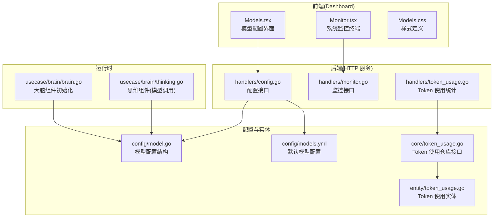
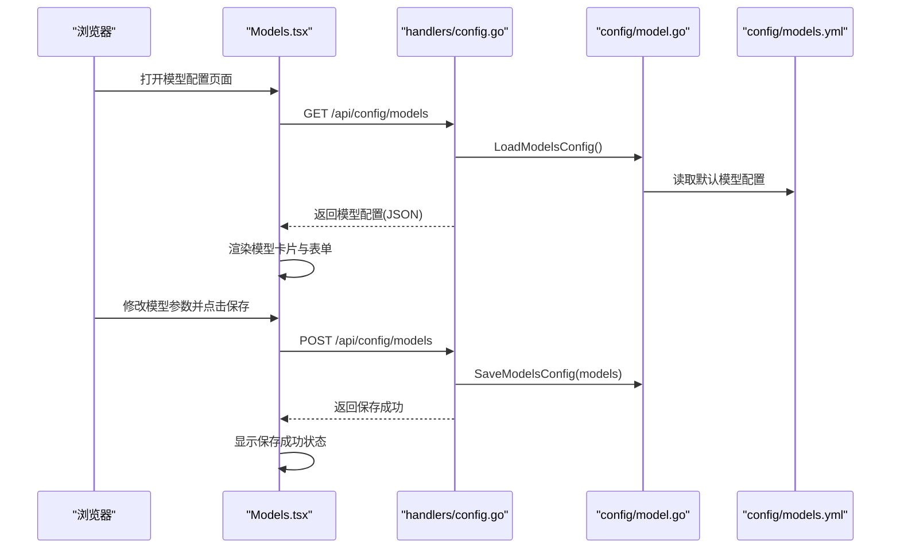
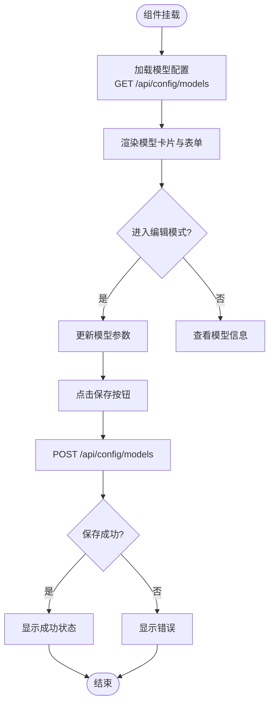
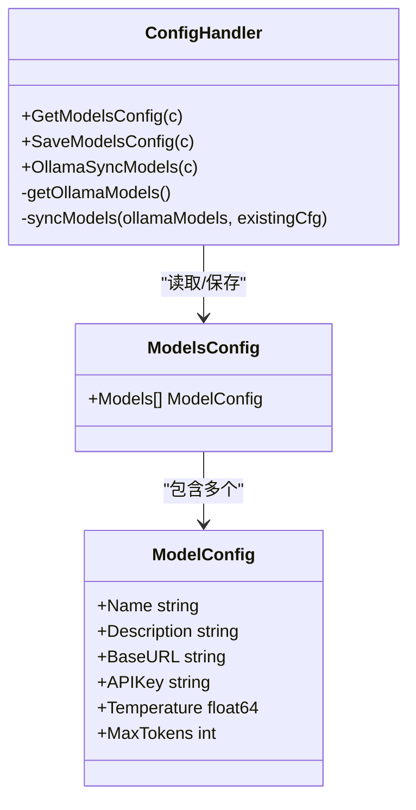
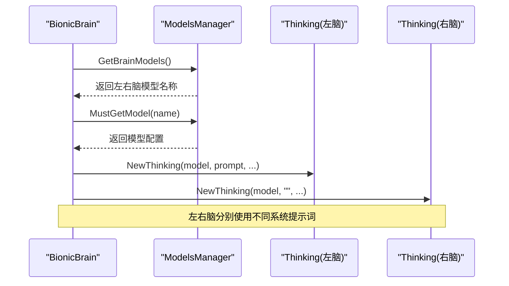
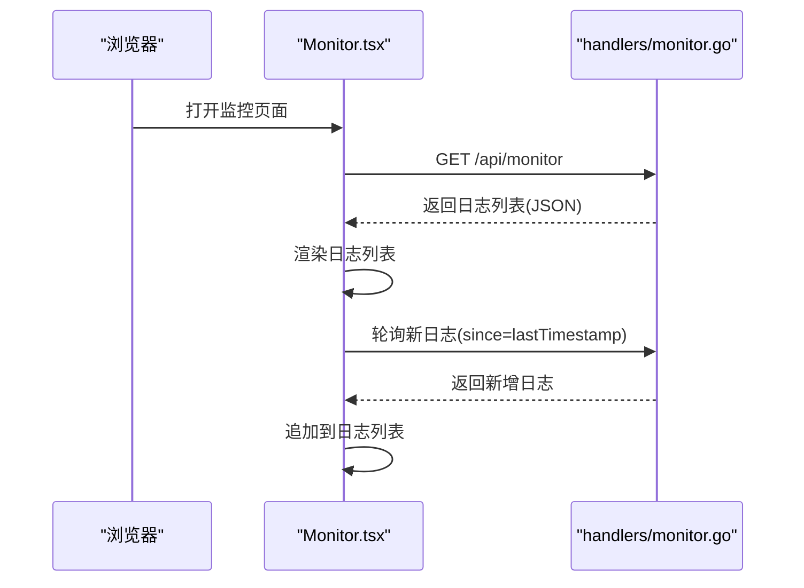
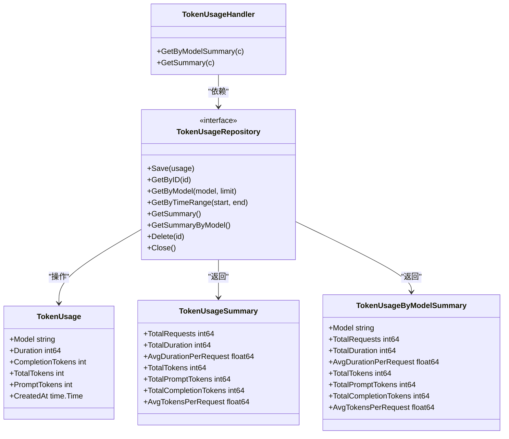
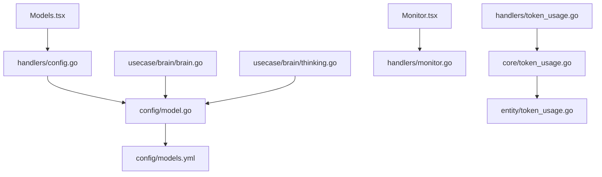

# 模型管理界面

<cite>
**本文档引用的文件**
- [dashboard/src/components/Models.tsx](file://dashboard/src/components/Models.tsx)
- [internal/config/model.go](file://internal/config/model.go)
- [internal/adapters/http/handlers/config.go](file://internal/adapters/http/handlers/config.go)
- [config/models.yml](file://config/models.yml)
- [internal/usecase/brain/brain.go](file://internal/usecase/brain/brain.go)
- [internal/usecase/brain/thinking.go](file://internal/usecase/brain/thinking.go)
- [dashboard/src/components/styles/Models.css](file://dashboard/src/components/styles/Models.css)
- [internal/adapters/http/handlers/monitor.go](file://internal/adapters/http/handlers/monitor.go)
- [dashboard/src/components/Monitor.tsx](file://dashboard/src/components/Monitor.tsx)
- [internal/adapters/http/handlers/token_usage.go](file://internal/adapters/http/handlers/token_usage.go)
- [internal/core/token_usage.go](file://internal/core/token_usage.go)
- [internal/entity/token_usage.go](file://internal/entity/token_usage.go)
</cite>

## 目录
1. [简介](#简介)
2. [项目结构](#项目结构)
3. [核心组件](#核心组件)
4. [架构概览](#架构概览)
5. [详细组件分析](#详细组件分析)
6. [依赖关系分析](#依赖关系分析)
7. [性能考虑](#性能考虑)
8. [故障排除指南](#故障排除指南)
9. [结论](#结论)
10. [附录](#附录)

## 简介
本文件面向 MindX 模型管理界面的技术文档，深入解析模型配置页面的前端实现、后端配置管理以及模型运行时的行为。文档涵盖以下关键主题：
- 可用模型的展示与选择机制
- 模型参数的配置与调整方法
- 模型切换与热更新的实现原理
- 模型性能监控与使用统计
- 开发指南与配置优化建议
- 最佳实践与故障排除方法

## 项目结构
MindX 的模型管理界面由前端 React 组件与后端 Go 服务共同组成。前端通过 HTTP 接口与后端交互，后端负责模型配置的持久化与运行时的模型选择。

**图表来源**
- [dashboard/src/components/Models.tsx](file://dashboard/src/components/Models.tsx#L1-L261)
- [internal/adapters/http/handlers/config.go](file://internal/adapters/http/handlers/config.go#L1-L256)
- [internal/adapters/http/handlers/monitor.go](file://internal/adapters/http/handlers/monitor.go#L1-L188)
- [internal/adapters/http/handlers/token_usage.go](file://internal/adapters/http/handlers/token_usage.go#L1-L49)
- [internal/config/model.go](file://internal/config/model.go#L1-L29)
- [config/models.yml](file://config/models.yml#L1-L92)
- [internal/usecase/brain/brain.go](file://internal/usecase/brain/brain.go#L1-L674)
- [internal/usecase/brain/thinking.go](file://internal/usecase/brain/thinking.go#L1-L200)

**章节来源**
- [dashboard/src/components/Models.tsx](file://dashboard/src/components/Models.tsx#L1-L261)
- [internal/adapters/http/handlers/config.go](file://internal/adapters/http/handlers/config.go#L1-L256)
- [internal/config/model.go](file://internal/config/model.go#L1-L29)

## 核心组件
本节聚焦于模型管理界面的关键组件及其职责：
- Models 页面组件：负责模型列表的展示、增删改查、参数调整与保存。
- 配置处理器：提供模型配置的获取与保存接口，并支持从 Ollama 同步模型。
- 运行时大脑组件：根据配置选择模型，构建思维组件并进行推理。
- 思维组件：封装 OpenAI 客户端，执行模型调用，支持流式响应与 Token 预算控制。
- 监控终端：实时显示系统日志，支持过滤与增量拉取。
- Token 使用统计：提供按模型分组的使用统计与总统计。

**章节来源**
- [dashboard/src/components/Models.tsx](file://dashboard/src/components/Models.tsx#L1-L261)
- [internal/adapters/http/handlers/config.go](file://internal/adapters/http/handlers/config.go#L45-L69)
- [internal/usecase/brain/brain.go](file://internal/usecase/brain/brain.go#L56-L131)
- [internal/usecase/brain/thinking.go](file://internal/usecase/brain/thinking.go#L33-L63)
- [dashboard/src/components/Monitor.tsx](file://dashboard/src/components/Monitor.tsx#L21-L135)
- [internal/adapters/http/handlers/token_usage.go](file://internal/adapters/http/handlers/token_usage.go#L20-L48)

## 架构概览
模型管理界面采用前后端分离架构。前端通过 HTTP 接口与后端交互，后端负责配置持久化与运行时模型选择。运行时的大脑组件根据配置选择左脑与右脑模型，思维组件负责实际的模型调用与流式响应。

**图表来源**
- [dashboard/src/components/Models.tsx](file://dashboard/src/components/Models.tsx#L24-L60)
- [internal/adapters/http/handlers/config.go](file://internal/adapters/http/handlers/config.go#L45-L69)
- [internal/config/model.go](file://internal/config/model.go#L3-L22)
- [config/models.yml](file://config/models.yml#L1-L92)

## 详细组件分析

### 模型配置页面组件
Models 页面组件负责模型配置的增删改查与保存。其核心逻辑包括：
- 初始化加载：组件挂载时自动调用加载函数获取模型配置。
- 保存流程：将当前模型列表提交到后端，保存成功后显示成功状态。
- 新增模型：添加一个默认配置的模型项，并进入编辑模式。
- 删除模型：移除指定索引的模型项。
- 参数调整：通过受控表单更新模型字段，包括名称、描述、API 密钥、基础 URL、温度与最大 Token 数。

**图表来源**
- [dashboard/src/components/Models.tsx](file://dashboard/src/components/Models.tsx#L20-L88)

**章节来源**
- [dashboard/src/components/Models.tsx](file://dashboard/src/components/Models.tsx#L14-L261)
- [dashboard/src/components/styles/Models.css](file://dashboard/src/components/styles/Models.css#L1-L457)

### 配置处理器与模型结构
配置处理器提供模型配置的获取与保存接口，并支持从 Ollama 同步模型。模型结构定义了模型的基本属性，如名称、描述、基础 URL、API 密钥、温度与最大 Token 数等。

**图表来源**
- [internal/adapters/http/handlers/config.go](file://internal/adapters/http/handlers/config.go#L45-L255)
- [internal/config/model.go](file://internal/config/model.go#L3-L22)

**章节来源**
- [internal/adapters/http/handlers/config.go](file://internal/adapters/http/handlers/config.go#L45-L255)
- [internal/config/model.go](file://internal/config/model.go#L3-L22)
- [config/models.yml](file://config/models.yml#L1-L92)

### 运行时大脑与思维组件
大脑组件在启动时根据配置选择左脑与右脑模型，并创建相应的思维组件。思维组件封装 OpenAI 客户端，执行模型调用，支持流式响应与 Token 预算控制。

**图表来源**
- [internal/usecase/brain/brain.go](file://internal/usecase/brain/brain.go#L68-L111)
- [internal/usecase/brain/thinking.go](file://internal/usecase/brain/thinking.go#L33-L63)

**章节来源**
- [internal/usecase/brain/brain.go](file://internal/usecase/brain/brain.go#L56-L131)
- [internal/usecase/brain/thinking.go](file://internal/usecase/brain/thinking.go#L121-L200)

### 监控终端与日志处理
监控终端提供系统日志的实时查看与过滤功能。后端通过监控处理器读取系统日志文件，支持按级别过滤与增量拉取。

**图表来源**
- [dashboard/src/components/Monitor.tsx](file://dashboard/src/components/Monitor.tsx#L34-L98)
- [internal/adapters/http/handlers/monitor.go](file://internal/adapters/http/handlers/monitor.go#L48-L159)

**章节来源**
- [dashboard/src/components/Monitor.tsx](file://dashboard/src/components/Monitor.tsx#L21-L279)
- [internal/adapters/http/handlers/monitor.go](file://internal/adapters/http/handlers/monitor.go#L1-L188)

### Token 使用统计
Token 使用统计提供按模型分组的使用情况与总统计。后端通过 TokenUsageHandler 暴露接口，核心接口定义在 TokenUsageRepository 中。

**图表来源**
- [internal/adapters/http/handlers/token_usage.go](file://internal/adapters/http/handlers/token_usage.go#L10-L48)
- [internal/core/token_usage.go](file://internal/core/token_usage.go#L8-L33)
- [internal/entity/token_usage.go](file://internal/entity/token_usage.go#L5-L37)

**章节来源**
- [internal/adapters/http/handlers/token_usage.go](file://internal/adapters/http/handlers/token_usage.go#L20-L48)
- [internal/core/token_usage.go](file://internal/core/token_usage.go#L8-L33)
- [internal/entity/token_usage.go](file://internal/entity/token_usage.go#L16-L37)

## 依赖关系分析
模型管理界面涉及多个层次的依赖关系：
- 前端组件依赖后端接口，通过 HTTP 请求获取与保存配置。
- 后端处理器依赖配置结构与 YAML 文件，确保默认配置的可用性。
- 运行时组件依赖配置结构，动态选择模型并创建思维组件。
- 监控与统计模块独立于模型配置，提供运行时可观测性。

**图表来源**
- [dashboard/src/components/Models.tsx](file://dashboard/src/components/Models.tsx#L27-L47)
- [internal/adapters/http/handlers/config.go](file://internal/adapters/http/handlers/config.go#L45-L69)
- [internal/config/model.go](file://internal/config/model.go#L3-L22)
- [config/models.yml](file://config/models.yml#L1-L92)
- [internal/usecase/brain/brain.go](file://internal/usecase/brain/brain.go#L68-L111)
- [internal/usecase/brain/thinking.go](file://internal/usecase/brain/thinking.go#L33-L63)
- [dashboard/src/components/Monitor.tsx](file://dashboard/src/components/Monitor.tsx#L61-L92)
- [internal/adapters/http/handlers/monitor.go](file://internal/adapters/http/handlers/monitor.go#L48-L72)
- [internal/adapters/http/handlers/token_usage.go](file://internal/adapters/http/handlers/token_usage.go#L20-L48)
- [internal/core/token_usage.go](file://internal/core/token_usage.go#L8-L33)
- [internal/entity/token_usage.go](file://internal/entity/token_usage.go#L5-L37)

**章节来源**
- [internal/adapters/http/handlers/config.go](file://internal/adapters/http/handlers/config.go#L1-L256)
- [internal/usecase/brain/brain.go](file://internal/usecase/brain/brain.go#L1-L674)

## 性能考虑
- 模型参数调优
  - 温度：影响生成随机性，较低温度适合需要稳定输出的任务，较高温度适合创意类任务。
  - 最大 Token 数：控制上下文长度，过大可能导致延迟增加与成本上升。
- Token 预算管理
  - 思维组件内置 Token 预算管理器，根据模型 MaxTokens 与预留输出 Token 动态计算历史轮次上限，避免超出模型上下文限制。
- 流式响应
  - 思维组件支持流式响应，结合事件通道可实现实时进度反馈，提升用户体验。
- 日志轮询
  - 监控终端采用增量轮询策略，仅在有新日志时更新，减少不必要的网络开销。

[本节为通用性能指导，无需特定文件引用]

## 故障排除指南
- 模型配置保存失败
  - 检查后端日志，确认配置保存接口返回的状态码与错误信息。
  - 确认前端请求体格式正确，包含 models 字段。
- 模型列表为空
  - 确认后端已正确加载 YAML 默认配置。
  - 检查前端网络请求是否成功返回模型数据。
- 监控日志不显示
  - 确认日志文件路径存在且可读。
  - 检查过滤条件是否过于严格，尝试清除过滤器。
- Token 统计异常
  - 确认 Token 使用仓库已正确初始化。
  - 检查数据库连接与表结构是否正常。

**章节来源**
- [internal/adapters/http/handlers/config.go](file://internal/adapters/http/handlers/config.go#L54-L69)
- [internal/adapters/http/handlers/monitor.go](file://internal/adapters/http/handlers/monitor.go#L48-L98)
- [internal/adapters/http/handlers/token_usage.go](file://internal/adapters/http/handlers/token_usage.go#L20-L48)

## 结论
模型管理界面通过清晰的前后端分工实现了模型配置的可视化管理与持久化存储。后端提供稳定的配置接口与运行时模型选择机制，前端提供直观的参数调整与保存体验。配合监控与统计模块，系统具备良好的可观测性与可维护性。建议在生产环境中结合业务场景合理设置模型参数与 Token 预算，并定期检查日志与统计数据以优化性能。

[本节为总结性内容，无需特定文件引用]

## 附录
- 开发指南
  - 前端：在 Models.tsx 中扩展新的模型字段时，需同步更新后端配置结构与保存逻辑。
  - 后端：新增配置接口时，遵循现有路由命名规范与错误处理模式。
- 配置优化建议
  - 根据任务类型选择合适的模型与参数组合，避免过度配置导致资源浪费。
  - 定期清理日志文件，避免磁盘空间占用过高。
  - 使用 Token 预算管理器控制上下文长度，平衡性能与准确性。

[本节为通用指导内容，无需特定文件引用]