# 渠道管理界面

<cite>
**本文档引用的文件**
- [dashboard/src/components/channels/ChannelCard.tsx](file://dashboard/src/components/channels/ChannelCard.tsx)
- [dashboard/src/components/channels/ChannelConfigForm.tsx](file://dashboard/src/components/channels/ChannelConfigForm.tsx)
- [dashboard/src/components/channels/types.ts](file://dashboard/src/components/channels/types.ts)
- [dashboard/src/components/Channels.tsx](file://dashboard/src/components/Channels.tsx)
- [dashboard/src/components/styles/Channels.css](file://dashboard/src/components/styles/Channels.css)
- [internal/adapters/http/handlers/channels.go](file://internal/adapters/http/handlers/channels.go)
- [internal/config/channels.go](file://internal/config/channels.go)
- [internal/entity/channel.go](file://internal/entity/channel.go)
- [internal/core/channel.go](file://internal/core/channel.go)
- [internal/adapters/channels/manager.go](file://internal/adapters/channels/manager.go)
- [internal/adapters/channels/webhook_channel.go](file://internal/adapters/channels/webhook_channel.go)
- [internal/adapters/channels/registry.go](file://internal/adapters/channels/registry.go)
- [internal/adapters/channels/feishu.go](file://internal/adapters/channels/feishu.go)
- [config/channels.yml](file://config/channels.yml)
- [internal/config/feishu.go](file://internal/config/feishu.go)
- [internal/config/wechat.go](file://internal/config/wechat.go)
</cite>

## 目录
1. [简介](#简介)
2. [项目结构](#项目结构)
3. [核心组件](#核心组件)
4. [架构概览](#架构概览)
5. [详细组件分析](#详细组件分析)
6. [依赖关系分析](#依赖关系分析)
7. [性能考虑](#性能考虑)
8. [故障排除指南](#故障排除指南)
9. [结论](#结论)
10. [附录](#附录)

## 简介

MindX 渠道管理界面是一个完整的通信渠道管理系统，支持多种即时通讯平台的集成和管理。该系统提供了直观的图形用户界面，允许用户轻松配置、启停和监控各种通信渠道。

本系统的核心特性包括：
- 多平台支持：飞书、微信、QQ、钉钉、WhatsApp、Facebook、Telegram、iMessage
- 实时状态监控：显示每个渠道的运行状态和健康状况
- 配置管理：提供针对不同平台的专用配置界面
- 操作控制：支持启用/禁用、启动/停止等操作
- 安全验证：支持平台特定的安全令牌和验证机制

## 项目结构

MindX 渠道管理界面采用前后端分离的架构设计，主要分为以下层次：

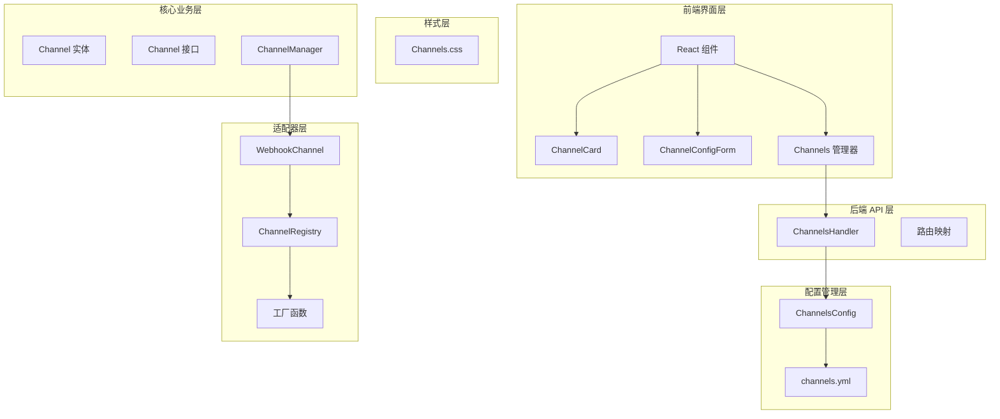

**图表来源**
- [dashboard/src/components/Channels.tsx](file://dashboard/src/components/Channels.tsx#L1-L182)
- [internal/adapters/http/handlers/channels.go](file://internal/adapters/http/handlers/channels.go#L1-L214)
- [internal/config/channels.go](file://internal/config/channels.go#L1-L149)

**章节来源**
- [dashboard/src/components/Channels.tsx](file://dashboard/src/components/Channels.tsx#L1-L182)
- [dashboard/src/components/styles/Channels.css](file://dashboard/src/components/styles/Channels.css#L1-L377)

## 核心组件

### 渠道卡片组件 (ChannelCard)

ChannelCard 是渠道管理界面的核心展示组件，负责显示单个渠道的状态和提供基本操作按钮。

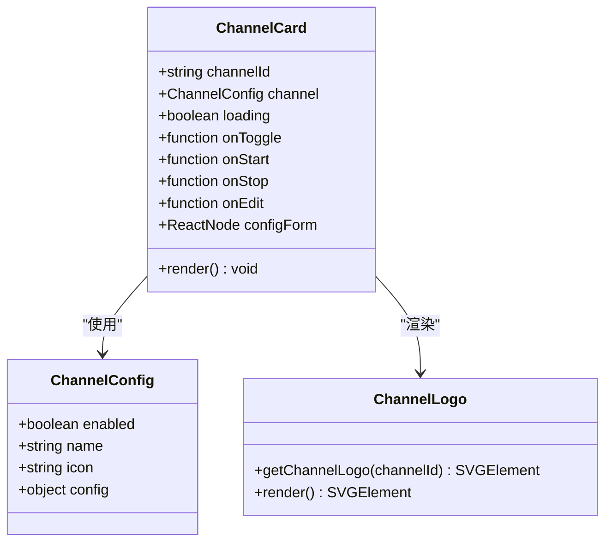

**图表来源**
- [dashboard/src/components/channels/ChannelCard.tsx](file://dashboard/src/components/channels/ChannelCard.tsx#L73-L134)
- [dashboard/src/components/channels/types.ts](file://dashboard/src/components/channels/types.ts#L1-L16)

### 配置表单组件 (ChannelConfigForm)

ChannelConfigForm 提供了针对不同渠道类型的专用配置界面，支持动态字段生成和表单验证。

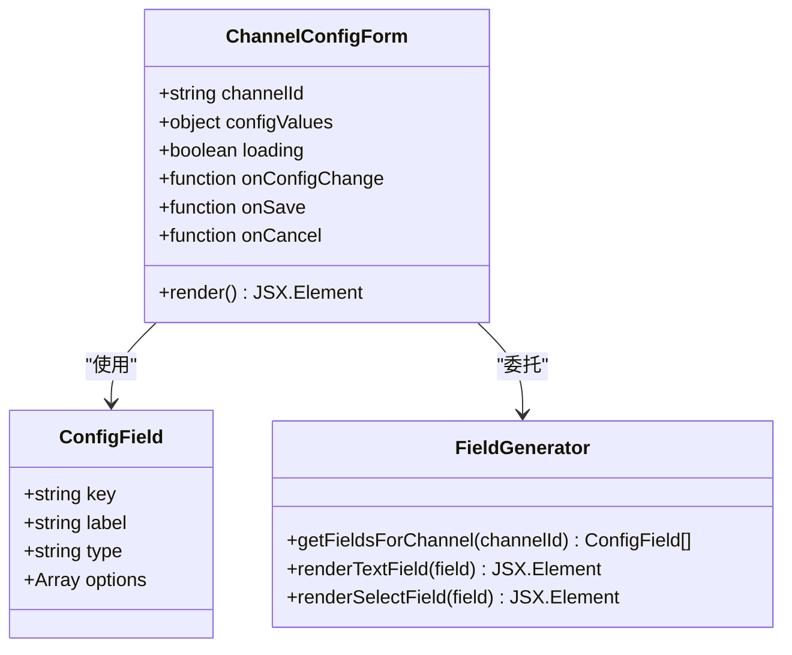

**图表来源**
- [dashboard/src/components/channels/ChannelConfigForm.tsx](file://dashboard/src/components/channels/ChannelConfigForm.tsx#L10-L153)

### 渠道管理器 (Channels)

Channels 组件作为整个渠道管理界面的控制器，负责协调所有子组件和处理用户交互。

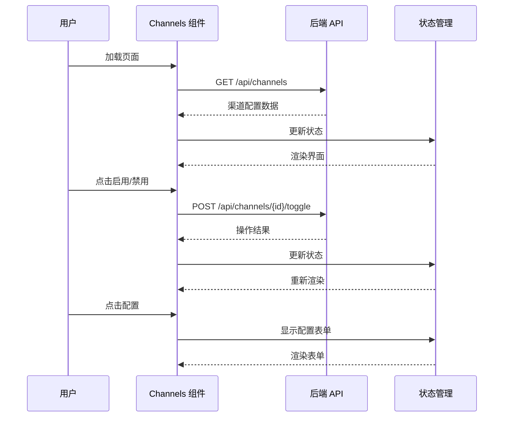

**图表来源**
- [dashboard/src/components/Channels.tsx](file://dashboard/src/components/Channels.tsx#L18-L127)

**章节来源**
- [dashboard/src/components/channels/ChannelCard.tsx](file://dashboard/src/components/channels/ChannelCard.tsx#L1-L134)
- [dashboard/src/components/channels/ChannelConfigForm.tsx](file://dashboard/src/components/channels/ChannelConfigForm.tsx#L1-L153)
- [dashboard/src/components/Channels.tsx](file://dashboard/src/components/Channels.tsx#L1-L182)

## 架构概览

MindX 渠道管理系统的整体架构采用分层设计，确保了良好的可维护性和扩展性。

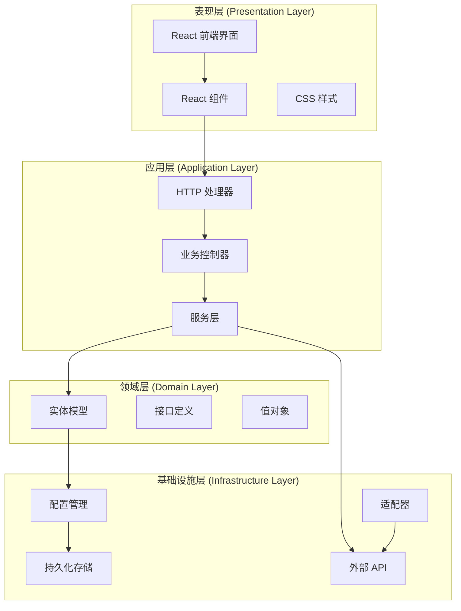

**图表来源**
- [internal/adapters/http/handlers/channels.go](file://internal/adapters/http/handlers/channels.go#L1-L214)
- [internal/config/channels.go](file://internal/config/channels.go#L1-L149)
- [internal/entity/channel.go](file://internal/entity/channel.go#L1-L203)

### 数据流架构

```mermaid
flowchart TD
Start([用户操作]) --> Action{操作类型}
Action --> |加载渠道| Load[获取渠道配置]
Action --> |启用/禁用| Toggle[切换渠道状态]
Action --> |启动/停止| Control[控制渠道运行]
Action --> |配置保存| Save[保存配置更改]
Load --> FetchAPI[调用 /api/channels]
FetchAPI --> ParseData[解析配置数据]
ParseData --> RenderUI[渲染界面]
Toggle --> UpdateAPI[调用 /api/channels/{id}/toggle]
UpdateAPI --> Reload[重新加载配置]
Control --> StartAPI[调用 /api/channels/{id}/start]
Control --> StopAPI[调用 /api/channels/{id}/stop]
Save --> ConfigAPI[调用 /api/channels/{id}/config]
ConfigAPI --> Success[保存成功]
ConfigAPI --> Error[保存失败]
RenderUI --> End([完成])
Reload --> RenderUI
Success --> RenderUI
Error --> RenderUI
```

**图表来源**
- [dashboard/src/components/Channels.tsx](file://dashboard/src/components/Channels.tsx#L36-L127)

## 详细组件分析

### 渠道状态管理

系统实现了完整的渠道状态管理机制，包括启用状态、运行状态和健康状态的跟踪。

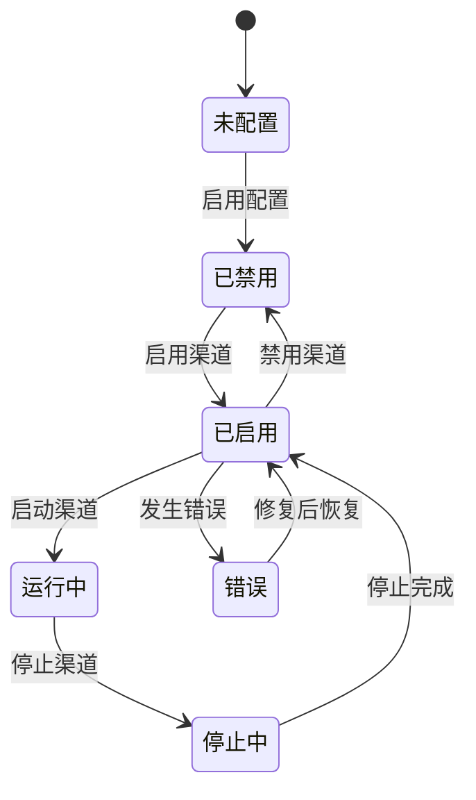

**图表来源**
- [internal/entity/channel.go](file://internal/entity/channel.go#L141-L184)
- [internal/config/channels.go](file://internal/config/channels.go#L61-L89)

### 渠道配置验证机制

系统提供了多层次的配置验证机制，确保配置的安全性和有效性。

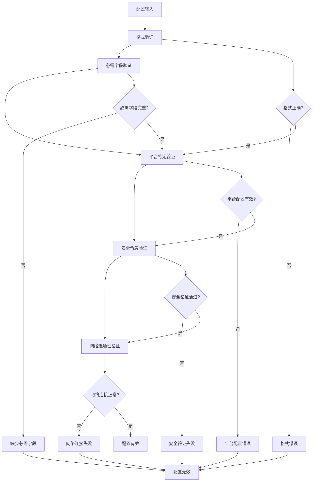

**图表来源**
- [dashboard/src/components/channels/ChannelConfigForm.tsx](file://dashboard/src/components/channels/ChannelConfigForm.tsx#L19-L108)
- [internal/adapters/http/handlers/channels.go](file://internal/adapters/http/handlers/channels.go#L56-L100)

### 渠道操作流程

系统支持多种渠道操作，每种操作都有明确的执行流程和错误处理机制。

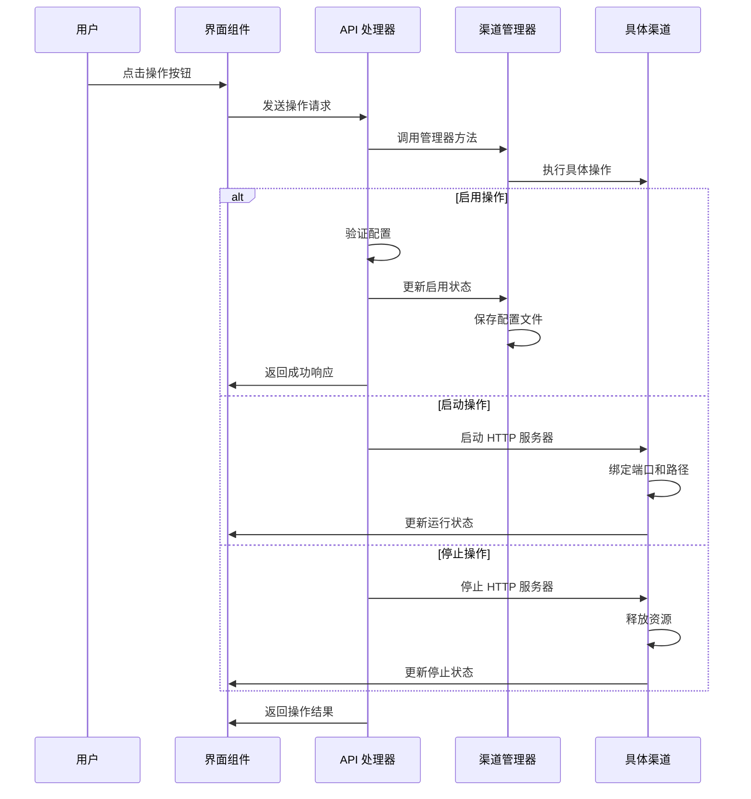

**图表来源**
- [dashboard/src/components/Channels.tsx](file://dashboard/src/components/Channels.tsx#L36-L96)
- [internal/adapters/http/handlers/channels.go](file://internal/adapters/http/handlers/channels.go#L102-L184)

**章节来源**
- [internal/entity/channel.go](file://internal/entity/channel.go#L141-L184)
- [internal/config/channels.go](file://internal/config/channels.go#L61-L100)
- [dashboard/src/components/Channels.tsx](file://dashboard/src/components/Channels.tsx#L36-L127)

## 依赖关系分析

### 组件依赖图

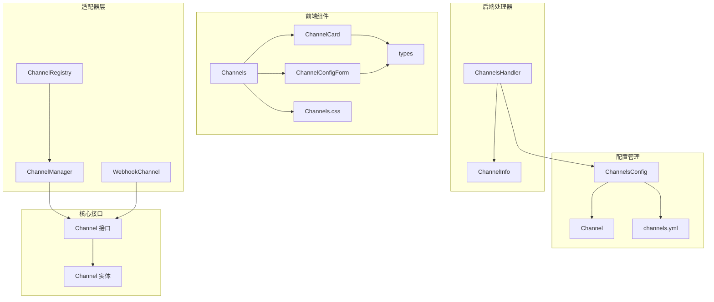

**图表来源**
- [dashboard/src/components/Channels.tsx](file://dashboard/src/components/Channels.tsx#L1-L182)
- [internal/adapters/http/handlers/channels.go](file://internal/adapters/http/handlers/channels.go#L13-L29)
- [internal/config/channels.go](file://internal/config/channels.go#L11-L21)
- [internal/adapters/channels/manager.go](file://internal/adapters/channels/manager.go#L15-L29)

### 数据依赖关系

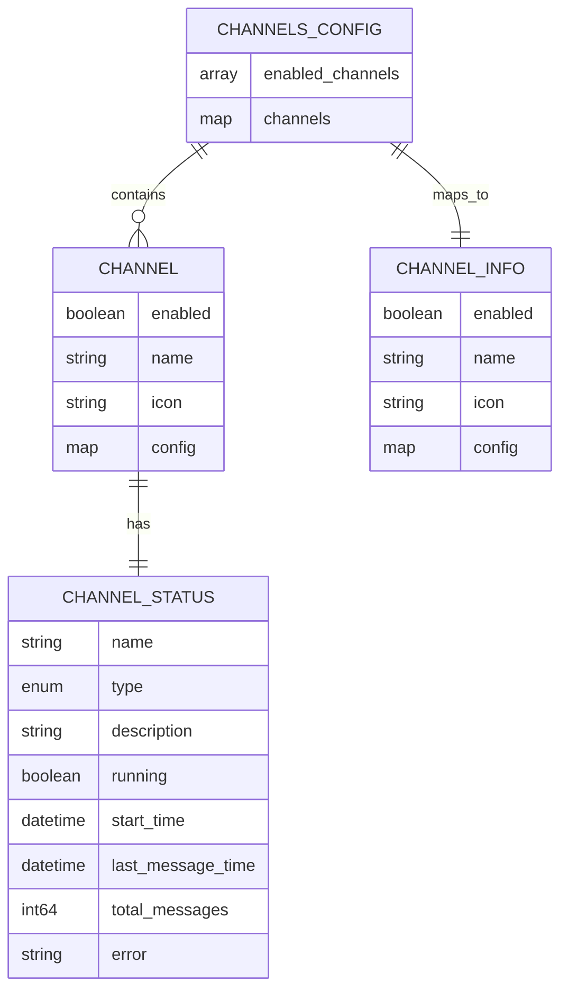

**图表来源**
- [internal/config/channels.go](file://internal/config/channels.go#L11-L21)
- [internal/adapters/http/handlers/channels.go#L17-L22)
- [internal/entity/channel.go](file://internal/entity/channel.go#L141-L169)

**章节来源**
- [internal/adapters/channels/registry.go](file://internal/adapters/channels/registry.go#L1-L142)
- [internal/adapters/channels/webhook_channel.go](file://internal/adapters/channels/webhook_channel.go#L1-L306)

## 性能考虑

### 前端性能优化

系统在前端层面采用了多项性能优化策略：

1. **组件懒加载**：渠道卡片组件按需加载，减少初始渲染负担
2. **状态缓存**：使用 React hooks 管理组件状态，避免不必要的重新渲染
3. **事件节流**：对频繁触发的操作进行防抖处理
4. **虚拟滚动**：对于大量渠道的情况，考虑实现虚拟滚动优化

### 后端性能优化

后端系统通过以下机制确保高性能运行：

1. **并发处理**：使用 goroutine 处理多个渠道的并发操作
2. **连接池管理**：对外部 API 调用使用连接池复用
3. **缓存策略**：对配置数据进行缓存，减少磁盘 I/O
4. **资源监控**：实时监控渠道运行状态，及时发现性能问题

### 网络性能优化

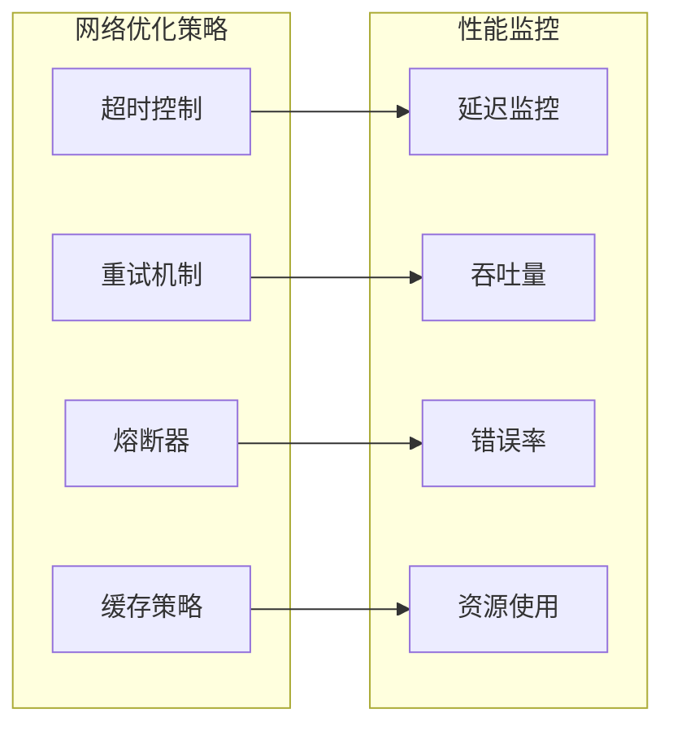

## 故障排除指南

### 常见问题及解决方案

#### 渠道无法启动

**症状**：点击启动按钮后，渠道状态保持不变

**可能原因**：
1. 端口被占用
2. 配置文件格式错误
3. 外部 API 认证失败

**解决步骤**：
1. 检查端口占用情况
2. 验证配置文件语法
3. 确认 API 密钥有效性

#### 配置保存失败

**症状**：修改配置后点击保存无响应

**可能原因**：
1. 网络连接异常
2. 权限不足
3. 配置格式不正确

**解决步骤**：
1. 检查网络连接状态
2. 验证文件写入权限
3. 使用配置验证工具检查格式

#### 渠道状态显示异常

**症状**：渠道状态与实际运行状态不符

**可能原因**：
1. 状态同步延迟
2. 缓存数据过期
3. 异常中断导致状态未更新

**解决步骤**：
1. 手动刷新页面
2. 清除浏览器缓存
3. 重启相关服务

### 调试工具和日志

系统提供了完善的日志记录机制，便于问题诊断：

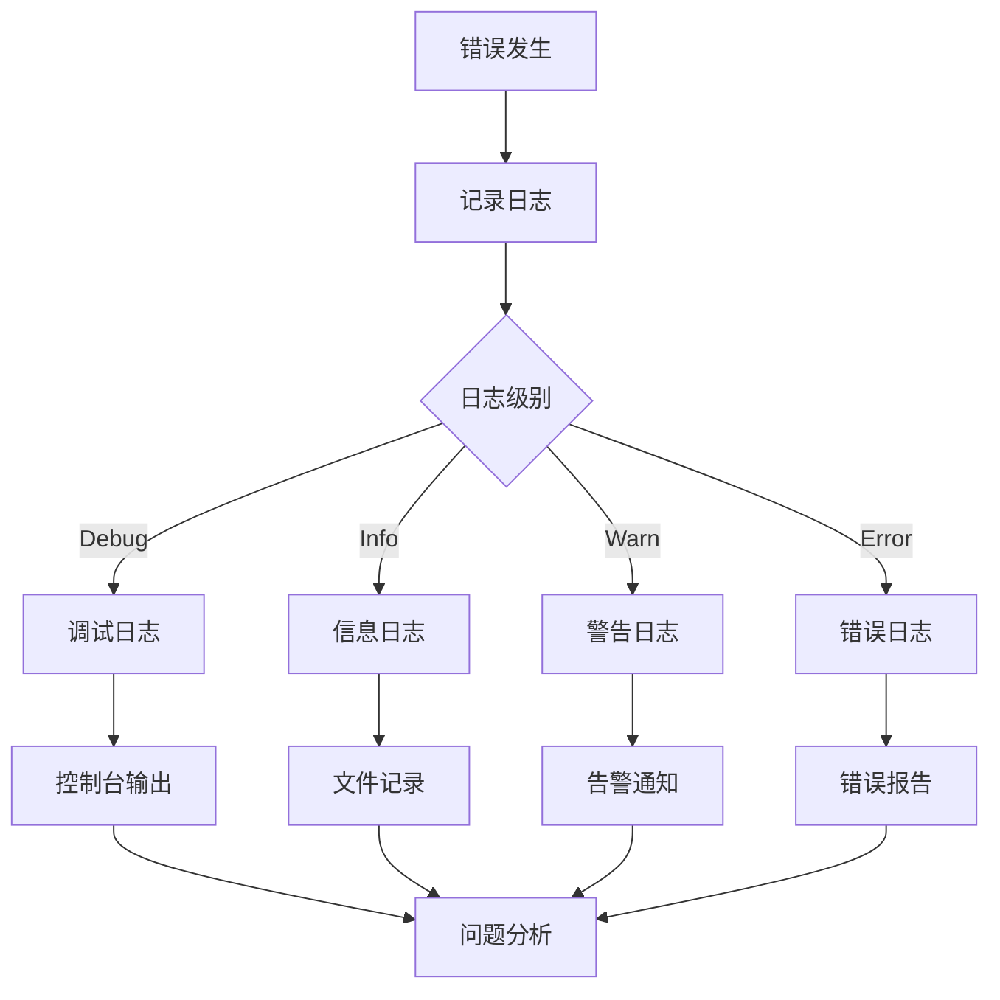

**章节来源**
- [internal/adapters/http/handlers/channels.go](file://internal/adapters/http/handlers/channels.go#L31-L54)
- [internal/config/channels.go](file://internal/config/channels.go#L23-L41)

## 结论

MindX 渠道管理界面是一个功能完善、架构清晰的通信渠道管理系统。通过前后端分离的设计，系统实现了良好的用户体验和高效的业务处理能力。

### 主要优势

1. **多平台支持**：全面支持主流即时通讯平台
2. **直观界面**：简洁易用的图形用户界面
3. **强大功能**：完整的配置、监控和管理功能
4. **可扩展性**：模块化的架构设计便于功能扩展
5. **稳定性**：完善的错误处理和监控机制

### 技术亮点

- 响应式设计，支持多种设备访问
- 实时状态更新，提供良好的用户体验
- 安全的配置管理，支持敏感信息加密
- 完善的日志记录，便于问题诊断
- 可靠的错误处理，确保系统稳定性

## 附录

### 新渠道适配指南

#### 1. 配置文件添加

在 `config/channels.yml` 中添加新渠道的基本配置：

```yaml
new_channel:
    enabled: false
    name: 新渠道名称
    icon: 渠道图标
    config:
        # 平台特定配置项
        port: 8080
        path: /new_channel/webhook
```

#### 2. 配置结构定义

创建对应的配置结构体：

```go
type NewChannelConfig struct {
    Port int    `mapstructure:"port" json:"port" yaml:"port"`
    Path string `mapstructure:"path" json:"path" yaml:"path"`
    // 其他配置字段...
}

func (c *NewChannelConfig) GetPort() int  { return c.Port }
func (c *NewChannelConfig) GetPath() string { return c.Path }
```

#### 3. 渠道工厂注册

在渠道包的 `init()` 函数中注册工厂函数：

```go
func init() {
    Register("new_channel", func(cfg map[string]interface{}) (core.Channel, error) {
        return NewNewChannel(&NewChannelConfig{
            Port: getIntFromConfig(cfg, "port", 8080),
            Path: getStringFromConfigWithDefault(cfg, "path", "/new_channel/webhook"),
            // 初始化其他配置...
        }), nil
    })
}
```

#### 4. 渠道实现

实现具体的渠道逻辑，继承 WebhookChannel 或实现 Channel 接口：

```go
type NewChannel struct {
    *WebhookChannel
    config *NewChannelConfig
}

func NewNewChannel(cfg *NewChannelConfig) *NewChannel {
    baseChannel := NewWebhookChannel("new_channel", entity.ChannelTypeNewChannel, cfg.Path, cfg)
    return &NewChannel{
        WebhookChannel: baseChannel,
        config:         cfg,
    }
}

func (c *NewChannel) Start(ctx context.Context) error {
    // 实现启动逻辑
    return nil
}

func (c *NewChannel) SendMessage(ctx context.Context, msg *entity.OutgoingMessage) error {
    // 实现消息发送逻辑
    return nil
}
```

#### 5. 前端配置表单

在 `ChannelConfigForm.tsx` 中添加新渠道的配置字段：

```typescript
case 'new_channel':
    return [
        { key: 'api_key', label: 'API Key', type: 'text' },
        { key: 'endpoint', label: 'API 端点', type: 'text' },
        { key: 'timeout', label: '超时时间', type: 'number' },
        // 其他配置字段...
    ];
```

#### 6. 渠道图标

在 `ChannelCard.tsx` 中添加渠道图标：

```typescript
case 'new_channel':
    return (
        <svg>...</svg>
    );
```

### 最佳实践

#### 配置管理最佳实践

1. **配置验证**：始终验证配置的有效性
2. **默认值设置**：为关键配置提供合理的默认值
3. **安全存储**：敏感信息使用加密存储
4. **版本兼容**：确保配置文件的向后兼容性

#### 开发规范

1. **代码注释**：为复杂逻辑添加详细的注释
2. **错误处理**：完善错误处理和用户反馈
3. **日志记录**：记录关键操作和错误信息
4. **单元测试**：为重要功能编写单元测试

#### 部署建议

1. **环境隔离**：开发、测试、生产环境分离
2. **备份策略**：定期备份配置文件和数据
3. **监控告警**：建立完善的监控和告警机制
4. **性能优化**：根据实际使用情况进行性能调优