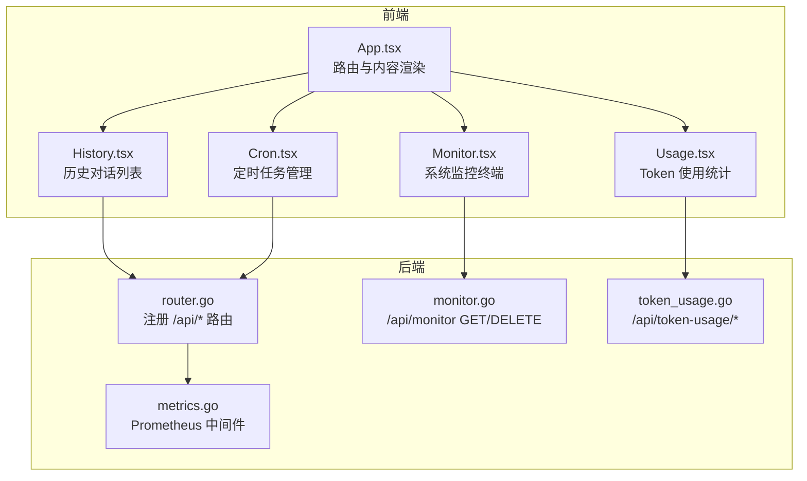
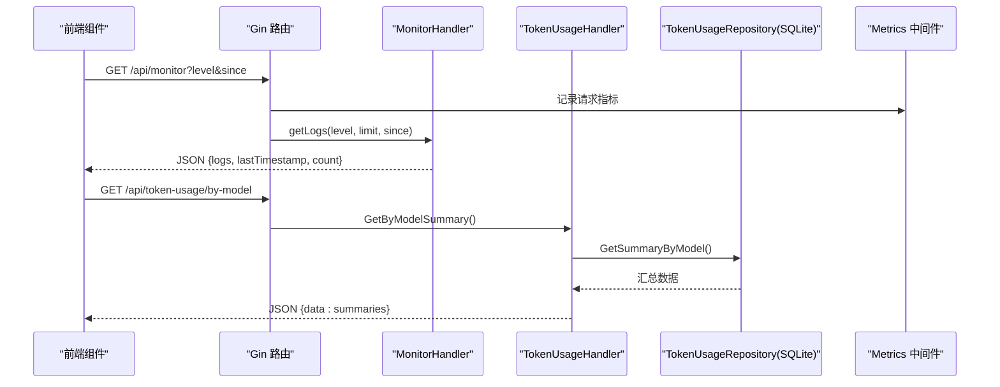
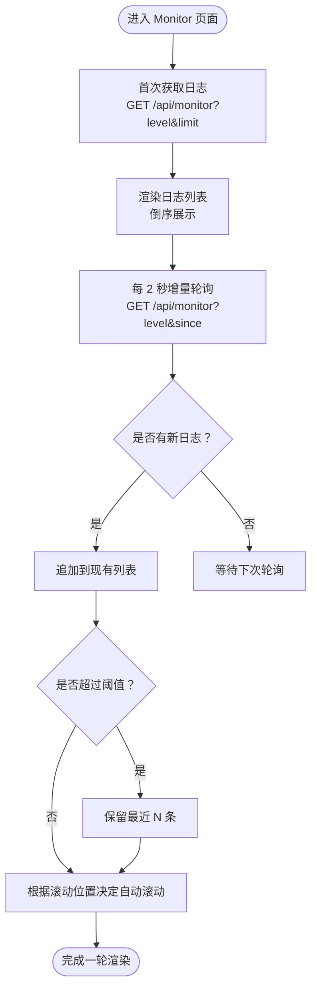
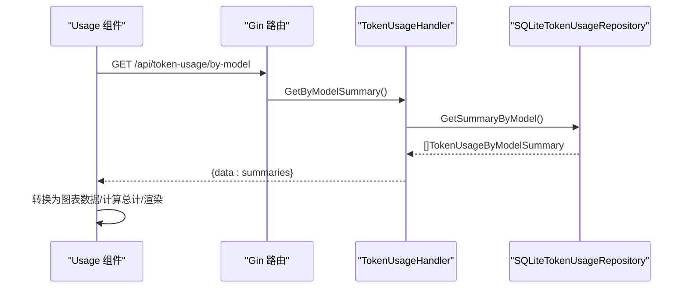
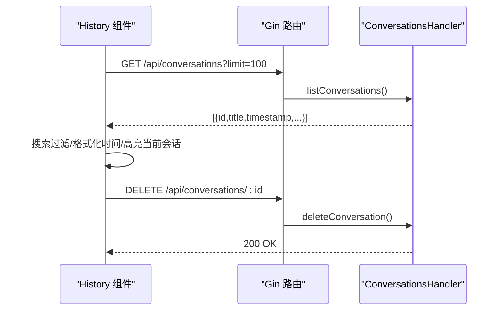
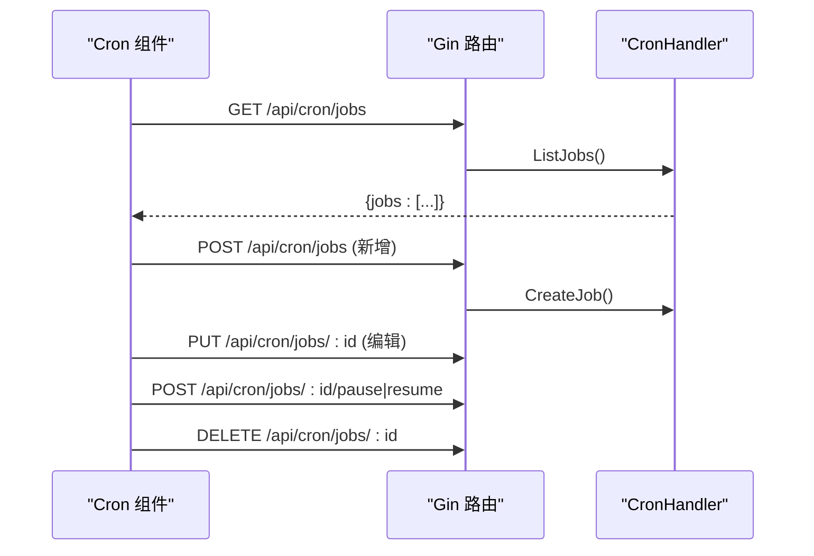
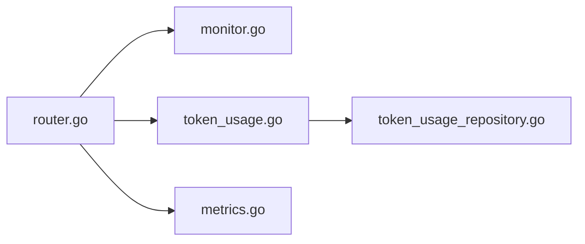

# 监控仪表板

<cite>
**本文引用的文件**
- [dashboard/src/components/Monitor.tsx](file://dashboard/src/components/Monitor.tsx)
- [internal/adapters/http/handlers/monitor.go](file://internal/adapters/http/handlers/monitor.go)
- [dashboard/src/components/Usage.tsx](file://dashboard/src/components/Usage.tsx)
- [internal/adapters/http/handlers/token_usage.go](file://internal/adapters/http/handlers/token_usage.go)
- [internal/infrastructure/persistence/token_usage_repository.go](file://internal/infrastructure/persistence/token_usage_repository.go)
- [dashboard/src/components/History.tsx](file://dashboard/src/components/History.tsx)
- [dashboard/src/components/styles/History.css](file://dashboard/src/components/styles/History.css)
- [dashboard/src/components/Cron.tsx](file://dashboard/src/components/Cron.tsx)
- [dashboard/src/components/styles/Cron.css](file://dashboard/src/components/styles/Cron.css)
- [internal/adapters/http/handlers/router.go](file://internal/adapters/http/handlers/router.go)
- [internal/adapters/http/middleware/metrics.go](file://internal/adapters/http/middleware/metrics.go)
- [dashboard/src/App.tsx](file://dashboard/src/App.tsx)
</cite>

## 目录
1. [简介](#简介)
2. [项目结构](#项目结构)
3. [核心组件](#核心组件)
4. [架构总览](#架构总览)
5. [组件详解](#组件详解)
6. [依赖关系分析](#依赖关系分析)
7. [性能考量](#性能考量)
8. [故障排查指南](#故障排查指南)
9. [结论](#结论)
10. [附录](#附录)

## 简介
本文件面向 MindX 监控仪表板，系统性梳理“系统监控”“使用统计”“历史记录”“定时任务管理”四大模块的前端组件与后端实现，阐明监控数据的获取与展示机制、图表组件的使用方式、历史记录的查询与过滤、定时任务的配置与管理界面，并提供定制化开发指南与性能监控最佳实践。

## 项目结构
监控仪表板由前端 React 组件与后端 Gin 路由/处理器构成，通过 REST API 交互；同时内置 Prometheus 指标中间件用于运行时指标采集。

**图示来源**
- [dashboard/src/App.tsx](file://dashboard/src/App.tsx#L19-L63)
- [internal/adapters/http/handlers/router.go](file://internal/adapters/http/handlers/router.go#L18-L149)
- [internal/adapters/http/handlers/monitor.go](file://internal/adapters/http/handlers/monitor.go#L48-L98)
- [internal/adapters/http/handlers/token_usage.go](file://internal/adapters/http/handlers/token_usage.go#L20-L48)
- [internal/adapters/http/middleware/metrics.go](file://internal/adapters/http/middleware/metrics.go#L51-L68)

**章节来源**
- [dashboard/src/App.tsx](file://dashboard/src/App.tsx#L19-L63)
- [internal/adapters/http/handlers/router.go](file://internal/adapters/http/handlers/router.go#L18-L149)

## 核心组件
- 系统监控（Monitor）：实时日志终端，支持级别过滤、关键字搜索、自动滚动、增量轮询与清空。
- 使用统计（Usage）：基于 Recharts 的 Token 使用统计图表与表格，支持刷新与错误提示。
- 历史记录（History）：对话历史列表，支持搜索、切换会话、删除、格式化时间显示。
- 定时任务（Cron）：任务增删改查、启停、状态展示、表单校验与加载态。

**章节来源**
- [dashboard/src/components/Monitor.tsx](file://dashboard/src/components/Monitor.tsx#L21-L279)
- [dashboard/src/components/Usage.tsx](file://dashboard/src/components/Usage.tsx#L17-L184)
- [dashboard/src/components/History.tsx](file://dashboard/src/components/History.tsx#L19-L177)
- [dashboard/src/components/Cron.tsx](file://dashboard/src/components/Cron.tsx#L22-L381)

## 架构总览
前端组件通过 fetch 请求调用后端 /api/* 接口；后端路由统一挂载在 /api 下，监控与统计分别由独立处理器负责；Prometheus 中间件对 HTTP 请求进行指标采集。

**图示来源**
- [internal/adapters/http/handlers/router.go](file://internal/adapters/http/handlers/router.go#L121-L132)
- [internal/adapters/http/handlers/monitor.go](file://internal/adapters/http/handlers/monitor.go#L48-L72)
- [internal/adapters/http/handlers/token_usage.go](file://internal/adapters/http/handlers/token_usage.go#L20-L33)
- [internal/infrastructure/persistence/token_usage_repository.go](file://internal/infrastructure/persistence/token_usage_repository.go#L226-L271)
- [internal/adapters/http/middleware/metrics.go](file://internal/adapters/http/middleware/metrics.go#L51-L68)

## 组件详解

### 系统监控（Monitor）
- 数据来源：后端读取工作区 logs/system.log，支持按级别过滤与增量 since 时间戳筛选。
- 展示逻辑：首次加载倒序返回固定条数，随后以 2 秒间隔增量拉取新日志；支持自动滚动与手动跳转到底部。
- 过滤与搜索：按日志级别与消息/logger/caller 关键字过滤；支持清空系统日志。
- 性能保护：超过阈值自动截断，避免内存膨胀。

**图示来源**
- [dashboard/src/components/Monitor.tsx](file://dashboard/src/components/Monitor.tsx#L34-L98)
- [internal/adapters/http/handlers/monitor.go](file://internal/adapters/http/handlers/monitor.go#L48-L72)
- [internal/adapters/http/handlers/monitor.go](file://internal/adapters/http/handlers/monitor.go#L100-L159)

**章节来源**
- [dashboard/src/components/Monitor.tsx](file://dashboard/src/components/Monitor.tsx#L21-L279)
- [internal/adapters/http/handlers/monitor.go](file://internal/adapters/http/handlers/monitor.go#L48-L98)

### 使用统计（Usage）
- 数据来源：后端聚合 token_usage 表，按模型分组统计请求次数、Token 数、平均耗时等。
- 展示逻辑：统计卡片 + 柱状图（Recharts）+ 详细表格；支持手动刷新与错误提示。
- 数据准备：将后端返回的模型汇总转换为图表数据集。

**图示来源**
- [dashboard/src/components/Usage.tsx](file://dashboard/src/components/Usage.tsx#L22-L42)
- [internal/adapters/http/handlers/token_usage.go](file://internal/adapters/http/handlers/token_usage.go#L20-L33)
- [internal/infrastructure/persistence/token_usage_repository.go](file://internal/infrastructure/persistence/token_usage_repository.go#L226-L271)

**章节来源**
- [dashboard/src/components/Usage.tsx](file://dashboard/src/components/Usage.tsx#L17-L184)
- [internal/adapters/http/handlers/token_usage.go](file://internal/adapters/http/handlers/token_usage.go#L20-L48)
- [internal/infrastructure/persistence/token_usage_repository.go](file://internal/infrastructure/persistence/token_usage_repository.go#L12-L64)

### 历史记录（History）
- 数据来源：后端列出会话（对话）列表，前端支持搜索标题、切换当前会话、删除会话。
- 展示逻辑：搜索框过滤、列表项高亮当前会话、格式化时间显示（今天/昨天/相对日期）。
- 交互流程：点击切换触发会话切换，确认删除后从列表移除。

**图示来源**
- [dashboard/src/components/History.tsx](file://dashboard/src/components/History.tsx#L28-L42)
- [dashboard/src/components/History.tsx](file://dashboard/src/components/History.tsx#L48-L69)
- [internal/adapters/http/handlers/router.go](file://internal/adapters/http/handlers/router.go#L34-L45)

**章节来源**
- [dashboard/src/components/History.tsx](file://dashboard/src/components/History.tsx#L19-L177)
- [dashboard/src/components/styles/History.css](file://dashboard/src/components/styles/History.css#L1-L190)

### 定时任务（Cron）
- 数据来源：后端 Cron 调度器，提供任务 CRUD、启停、状态展示。
- 展示逻辑：卡片式布局，支持添加/编辑弹窗、状态徽章、错误信息展示、加载覆盖层。
- 交互流程：新增/编辑保存、启停切换、删除确认。

**图示来源**
- [dashboard/src/components/Cron.tsx](file://dashboard/src/components/Cron.tsx#L39-L58)
- [dashboard/src/components/Cron.tsx](file://dashboard/src/components/Cron.tsx#L128-L156)
- [dashboard/src/components/Cron.tsx](file://dashboard/src/components/Cron.tsx#L105-L126)
- [dashboard/src/components/Cron.tsx](file://dashboard/src/components/Cron.tsx#L78-L103)
- [internal/adapters/http/handlers/router.go](file://internal/adapters/http/handlers/router.go#L93-L97)

**章节来源**
- [dashboard/src/components/Cron.tsx](file://dashboard/src/components/Cron.tsx#L22-L381)
- [dashboard/src/components/styles/Cron.css](file://dashboard/src/components/styles/Cron.css#L1-L417)

## 依赖关系分析
- 路由注册：统一在 router.go 中注册 /api/*，监控与统计分别由 MonitorHandler、TokenUsageHandler 处理。
- 指标采集：MetricsMiddleware 在每个请求结束后上报 HTTP 请求数、耗时、LLM 调用次数与耗时、Token 使用量、渠道消息量、WebSocket 连接数等。
- 数据持久化：Token 使用统计依赖 SQLiteTokenUsageRepository，提供按模型分组统计与汇总统计能力。

**图示来源**
- [internal/adapters/http/handlers/router.go](file://internal/adapters/http/handlers/router.go#L18-L149)
- [internal/adapters/http/handlers/monitor.go](file://internal/adapters/http/handlers/monitor.go#L38-L46)
- [internal/adapters/http/handlers/token_usage.go](file://internal/adapters/http/handlers/token_usage.go#L14-L18)
- [internal/infrastructure/persistence/token_usage_repository.go](file://internal/infrastructure/persistence/token_usage_repository.go#L12-L43)
- [internal/adapters/http/middleware/metrics.go](file://internal/adapters/http/middleware/metrics.go#L12-L49)

**章节来源**
- [internal/adapters/http/handlers/router.go](file://internal/adapters/http/handlers/router.go#L18-L149)
- [internal/adapters/http/middleware/metrics.go](file://internal/adapters/http/middleware/metrics.go#L51-L68)

## 性能考量
- 前端轮询策略：Monitor 使用 2 秒增量轮询，仅在有新数据时更新，避免频繁全量刷新；同时设置最大缓存条目数，防止内存增长。
- 后端日志读取：MonitorHandler 支持 since 时间戳增量读取，避免重复解析历史日志；limit 参数控制首次加载数量。
- 图表渲染：Usage 使用响应式容器与预设主题色，建议在大数据量时开启虚拟化或分页。
- 指标中间件：MetricsMiddleware 仅在请求完成后上报指标，避免阻塞业务逻辑；建议结合 Prometheus/Grafana 进行可视化与告警。

**章节来源**
- [dashboard/src/components/Monitor.tsx](file://dashboard/src/components/Monitor.tsx#L40-L47)
- [internal/adapters/http/handlers/monitor.go](file://internal/adapters/http/handlers/monitor.go#L100-L159)
- [dashboard/src/components/Usage.tsx](file://dashboard/src/components/Usage.tsx#L109-L138)
- [internal/adapters/http/middleware/metrics.go](file://internal/adapters/http/middleware/metrics.go#L51-L68)

## 故障排查指南
- 系统监控无法加载日志
  - 检查后端日志路径配置与文件是否存在；MonitorHandler 会在文件不存在时返回空数组。
  - 确认前端请求参数 level、since、limit 是否正确传递。
- 使用统计无数据
  - 确认 token_usage 表是否存在且有数据；GetSummaryByModel 依赖数据库查询结果。
  - 检查后端错误响应与前端错误提示。
- 历史记录列表为空
  - 检查 /api/conversations 接口返回格式与 limit 参数；确认前端过滤条件是否过严。
- 定时任务管理异常
  - 检查 /api/cron/jobs 相关接口返回；确认任务状态与错误信息。
- 指标未上报
  - 确认 MetricsMiddleware 已注册到路由；Prometheus 服务端是否正常抓取。

**章节来源**
- [internal/adapters/http/handlers/monitor.go](file://internal/adapters/http/handlers/monitor.go#L48-L72)
- [internal/adapters/http/handlers/token_usage.go](file://internal/adapters/http/handlers/token_usage.go#L20-L33)
- [internal/infrastructure/persistence/token_usage_repository.go](file://internal/infrastructure/persistence/token_usage_repository.go#L226-L271)
- [internal/adapters/http/middleware/metrics.go](file://internal/adapters/http/middleware/metrics.go#L51-L68)

## 结论
MindX 监控仪表板通过清晰的前后端职责划分与 REST 接口，实现了系统日志、Token 使用统计、历史对话与定时任务的可视化管理。前端组件注重用户体验（自动滚动、增量轮询、状态反馈），后端提供稳定的数据访问与指标采集能力。建议在生产环境中结合 Prometheus/Grafana 实现更全面的可观测性，并持续优化数据存储与查询性能。

## 附录
- 定制化开发建议
  - 新增监控视图：在前端新增组件并接入 /api/* 接口；在 App.tsx 中注册路由与侧边栏入口。
  - 扩展图表类型：在 Usage 中引入更多 Recharts 组件（折线、饼图等）以满足不同统计需求。
  - 优化搜索体验：在 History 与 Monitor 中增加高级过滤器（时间范围、日志来源等）。
  - 指标扩展：在 MetricsMiddleware 中新增自定义指标维度，如用户会话、技能调用次数等。
- 最佳实践
  - 前端：合理设置轮询间隔与缓存上限，避免过度请求；对错误进行分类提示与重试。
  - 后端：对日志文件与数据库查询进行限流与超时控制；确保接口幂等与事务一致性。
  - 运维：定期清理日志与统计数据，监控关键指标阈值并配置告警。