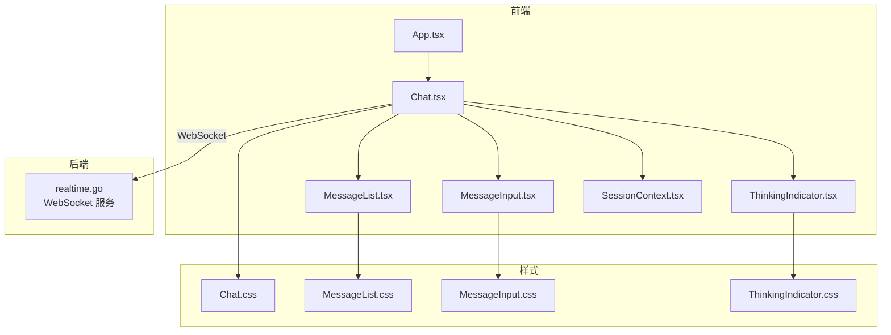
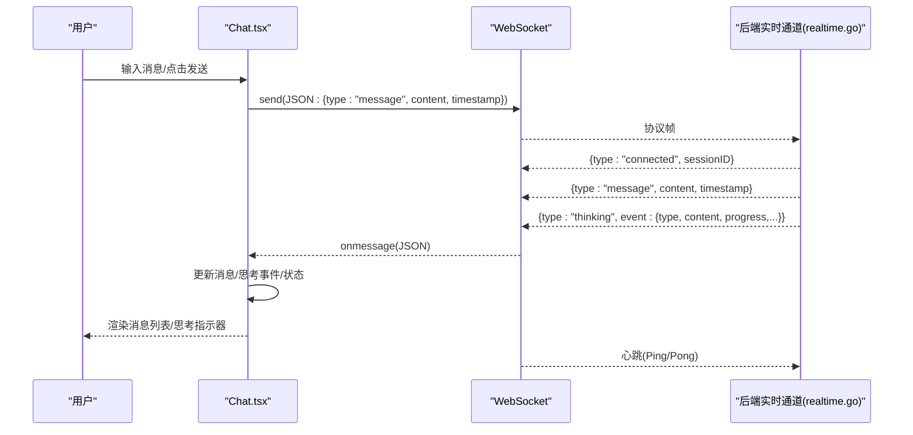
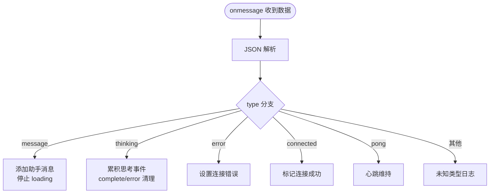
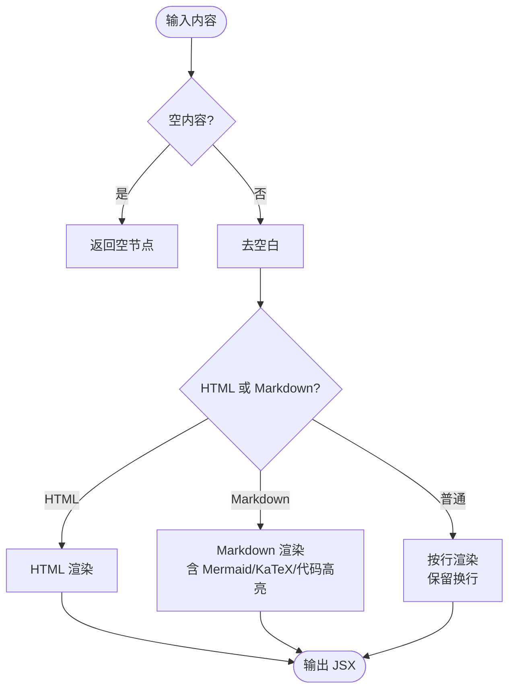
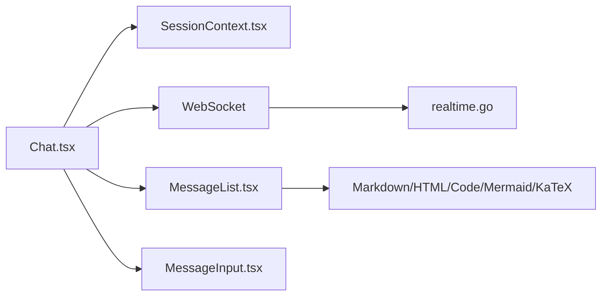

# 聊天界面

<cite>
**本文引用的文件**   
- [Chat.tsx](file://dashboard/src/components/Chat.tsx)
- [MessageList.tsx](file://dashboard/src/components/MessageList.tsx)
- [MessageInput.tsx](file://dashboard/src/components/MessageInput.tsx)
- [ThinkingIndicator.tsx](file://dashboard/src/components/ThinkingIndicator.tsx)
- [SessionContext.tsx](file://dashboard/src/contexts/SessionContext.tsx)
- [Chat.css](file://dashboard/src/components/styles/Chat.css)
- [MessageList.css](file://dashboard/src/components/styles/MessageList.css)
- [MessageInput.css](file://dashboard/src/components/styles/MessageInput.css)
- [ThinkingIndicator.css](file://dashboard/src/components/styles/ThinkingIndicator.css)
- [App.tsx](file://dashboard/src/App.tsx)
- [realtime.go](file://internal/adapters/channels/realtime.go)
</cite>

## 目录
1. [简介](#简介)
2. [项目结构](#项目结构)
3. [核心组件](#核心组件)
4. [架构总览](#架构总览)
5. [组件详解](#组件详解)
6. [依赖关系分析](#依赖关系分析)
7. [性能考量](#性能考量)
8. [故障排查指南](#故障排查指南)
9. [结论](#结论)
10. [附录：定制与扩展](#附录定制与扩展)

## 简介
本文件面向 MindX 的聊天界面，系统性梳理前端组件实现与后端 WebSocket 通信机制，涵盖消息列表渲染、输入框处理、思考指示器、消息状态管理、思考过程可视化与富文本显示，并提供定制化开发指南与性能优化建议。

## 项目结构
聊天界面位于前端仪表盘（dashboard）中，采用 React + TypeScript 开发，通过上下文管理会话与消息，通过 WebSocket 与后端实时通信。主入口在 App 中挂载 Sidebar 与 Chat 组件；Chat 作为顶层容器负责连接建立、消息派发与状态管理；子组件分别承担消息列表、输入框与思考指示器的展示与交互。

**图表来源**
- [App.tsx](file://dashboard/src/App.tsx#L19-L62)
- [Chat.tsx](file://dashboard/src/components/Chat.tsx#L51-L354)
- [MessageList.tsx](file://dashboard/src/components/MessageList.tsx#L264-L403)
- [MessageInput.tsx](file://dashboard/src/components/MessageInput.tsx#L31-L144)
- [ThinkingIndicator.tsx](file://dashboard/src/components/ThinkingIndicator.tsx#L22-L132)
- [SessionContext.tsx](file://dashboard/src/contexts/SessionContext.tsx#L30-L138)
- [realtime.go](file://internal/adapters/channels/realtime.go#L343-L463)

**章节来源**
- [App.tsx](file://dashboard/src/App.tsx#L19-L62)
- [Chat.tsx](file://dashboard/src/components/Chat.tsx#L51-L354)

## 核心组件
- Chat 容器：负责 WebSocket 连接、消息分发、错误处理、会话切换与能力选择。
- MessageList：渲染历史消息与思考流，支持 Markdown、HTML、Mermaid、数学公式、代码高亮等富文本。
- MessageInput：输入框与发送/停止控制，支持快捷键与能力菜单。
- ThinkingIndicator：独立的思考过程指示器（可与 MessageList 的思考态共存）。
- SessionContext：全局会话与消息状态管理，封装加载/切换/新建会话等 API。

**章节来源**
- [Chat.tsx](file://dashboard/src/components/Chat.tsx#L51-L354)
- [MessageList.tsx](file://dashboard/src/components/MessageList.tsx#L264-L403)
- [MessageInput.tsx](file://dashboard/src/components/MessageInput.tsx#L31-L144)
- [ThinkingIndicator.tsx](file://dashboard/src/components/ThinkingIndicator.tsx#L22-L132)
- [SessionContext.tsx](file://dashboard/src/contexts/SessionContext.tsx#L30-L138)

## 架构总览
前端通过 WebSocket 与后端实时通道通信，后端以 gorilla/websocket 实现升级与心跳，按会话 ID 将消息与思考事件推送给对应连接。前端根据消息类型进行不同处理：消息消息直接加入历史，思考事件驱动思考态渲染，错误与断连触发重连与提示。

**图表来源**
- [Chat.tsx](file://dashboard/src/components/Chat.tsx#L75-L152)
- [realtime.go](file://internal/adapters/channels/realtime.go#L399-L420)
- [realtime.go](file://internal/adapters/channels/realtime.go#L217-L255)
- [realtime.go](file://internal/adapters/channels/realtime.go#L257-L263)

## 组件详解

### Chat.tsx：聊天容器与 WebSocket 通信
- 连接建立
  - 使用环境变量或当前主机决定 ws/wss 地址，连接 /ws。
  - onopen：标记连接成功、清空错误、拉取当前会话。
  - onerror/onclose：记录错误、尝试自动重连（3 秒间隔）。
- 消息处理
  - message：解析 JSON，按 type 分发：
    - message：构造 assistant 消息并追加到历史。
    - thinking：累积事件，complete/error 后延时清理。
    - error：设置连接错误提示。
  - connected/pong：维持连接状态。
- 发送消息
  - 若选中能力，将内容前缀改写为“/能力名 内容”。
  - 构造 user 消息并立即本地渲染，同时发送至后端。
  - 失败时设置错误提示并恢复状态。
- 会话管理
  - 新建会话、切换会话、加载当前会话，均通过 HTTP API 与 WebSocket 协同。
- UI 与状态
  - loading/connecting/error 状态组合，滚动到底部，能力选择下拉。

**图表来源**
- [Chat.tsx](file://dashboard/src/components/Chat.tsx#L92-L140)

**章节来源**
- [Chat.tsx](file://dashboard/src/components/Chat.tsx#L51-L354)
- [realtime.go](file://internal/adapters/channels/realtime.go#L343-L463)

### MessageList.tsx：消息列表与富文本渲染
- 渲染策略
  - 历史消息：逐条渲染头像、时间、正文。
  - 思考态：当存在思考事件时，渲染“正在思考/完成/出错”的头部与增量输出流。
  - 流式输出：若存在 isStreaming 与 streamingMessage，渲染带光标闪烁的流式消息。
- 内容格式化
  - HTML 优先检测：若为 HTML，直接以安全方式注入。
  - Markdown 检测：标题、粗斜体、代码块、行内代码、链接、列表、表格、Mermaid、数学公式等。
  - Mermaid：初始化主题与安全级别，异步渲染 SVG，错误时展示错误信息。
  - 数学公式：使用 KaTeX，支持行内与块级。
  - 代码高亮：基于 Prism，按语言高亮。
  - 图片：自适应宽度，圆角边框。
  - 表格：外层滚动容器，悬停高亮。
  - 任务列表与删除线等增强。
- 时间格式化：本地时区 HH:mm。
- 技能徽章：若消息携带 skill 字段，显示工具图标与名称。

**图表来源**
- [MessageList.tsx](file://dashboard/src/components/MessageList.tsx#L113-L135)
- [MessageList.tsx](file://dashboard/src/components/MessageList.tsx#L229-L255)

**章节来源**
- [MessageList.tsx](file://dashboard/src/components/MessageList.tsx#L264-L403)
- [MessageList.css](file://dashboard/src/components/styles/MessageList.css#L115-L585)

### MessageInput.tsx：输入框与能力菜单
- 基础功能
  - 受控 textarea，支持 Enter 发送、Shift+Enter 换行。
  - 发送按钮禁用条件：无内容或正在加载；加载时显示停止按钮。
- 能力集成
  - 顶部显示已选能力标签，支持移除。
  - 菜单滚动展示可用能力，点击后写入选中并隐藏菜单。
- 提示信息
  - 底部显示快捷键提示，支持显示/隐藏能力菜单。

**章节来源**
- [MessageInput.tsx](file://dashboard/src/components/MessageInput.tsx#L31-L144)
- [MessageInput.css](file://dashboard/src/components/styles/MessageInput.css#L1-L343)

### ThinkingIndicator.tsx：思考过程指示器（独立组件）
- 展示逻辑
  - 当存在事件时显示；最新事件类型决定状态图标与文案。
  - 支持展开/收起，点击切换。
- 事件列表
  - 按事件类型着色（开始/进度/工具调用/结果/完成/错误）。
  - 工具名、进度条、结果摘要等元信息展示。
- 动画与交互
  - 加载动画、进度脉冲、悬停高亮等。

**章节来源**
- [ThinkingIndicator.tsx](file://dashboard/src/components/ThinkingIndicator.tsx#L22-L132)
- [ThinkingIndicator.css](file://dashboard/src/components/styles/ThinkingIndicator.css#L1-L234)

### SessionContext.tsx：消息与会话状态管理
- 状态
  - currentSession：当前会话对象（含 id 与 messages）。
  - messages：历史消息数组。
- 方法
  - addMessage：追加消息。
  - loadCurrentSession：拉取当前会话历史并回填。
  - switchSession：切换到指定会话并刷新消息。
  - createNewSession：创建新会话并清空消息。
- 与 Chat 的协作
  - Chat 在 onopen 后调用 loadCurrentSession，确保首次进入即有历史。
  - 发送消息时 addMessage 先本地渲染，再通过 WebSocket 推送后端。

**章节来源**
- [SessionContext.tsx](file://dashboard/src/contexts/SessionContext.tsx#L30-L138)
- [Chat.tsx](file://dashboard/src/components/Chat.tsx#L85-L90)
- [Chat.tsx](file://dashboard/src/components/Chat.tsx#L211-L249)

## 依赖关系分析
- 组件耦合
  - Chat 依赖 SessionContext 与 WebSocket，向下传递消息与思考事件。
  - MessageList 仅消费 props，低耦合，便于复用。
  - MessageInput 仅暴露回调，便于替换。
  - ThinkingIndicator 可独立于聊天界面使用。
- 外部依赖
  - WebSocket：浏览器原生 WebSocket。
  - Markdown/HTML/数学/Mermaid：第三方库，按需渲染。
  - 后端：gorilla/websocket，按会话推送消息与思考事件。

**图表来源**
- [Chat.tsx](file://dashboard/src/components/Chat.tsx#L1-L10)
- [MessageList.tsx](file://dashboard/src/components/MessageList.tsx#L1-L14)
- [realtime.go](file://internal/adapters/channels/realtime.go#L1-L50)

**章节来源**
- [Chat.tsx](file://dashboard/src/components/Chat.tsx#L1-L10)
- [MessageList.tsx](file://dashboard/src/components/MessageList.tsx#L1-L14)
- [realtime.go](file://internal/adapters/channels/realtime.go#L1-L50)

## 性能考量
- 渲染优化
  - MessageList 对 Markdown/HTML/Mermaid/代码块采用按需渲染与懒渲染策略，避免全量计算。
  - Mermaid 渲染异步执行，失败时降级显示错误信息，不阻塞主线程。
- 事件聚合
  - 思考事件按类型拆分，仅将 chunk 类型拼接为流式输出，减少 DOM 更新频率。
- 滚动与布局
  - 使用 smooth 滚动与 useLayoutEffect 保证消息与思考态出现后自动滚动到底部。
- WebSocket
  - 心跳 Ping/Pong 保持连接活性，异常断开定时重连，降低用户感知延迟。
- 样式
  - 使用 CSS 动画与过渡，避免 JavaScript 驱动的高频动画造成卡顿。

[本节为通用指导，无需特定文件引用]

## 故障排查指南
- 连接失败
  - 现象：显示“连接中”或错误提示，按钮可点击尝试重连。
  - 排查：检查后端 WebSocket 是否启动、端口与协议匹配、Token 校验（如启用）、网络连通性。
  - 参考
    - [Chat.tsx](file://dashboard/src/components/Chat.tsx#L142-L151)
    - [realtime.go](file://internal/adapters/channels/realtime.go#L343-L361)
- 发送失败
  - 现象：发送按钮禁用或报错，消息未进入历史。
  - 排查：确认 WebSocket OPEN 状态、网络中断、后端限流或会话无效。
  - 参考
    - [Chat.tsx](file://dashboard/src/components/Chat.tsx#L211-L249)
- 思考事件未显示
  - 现象：无“正在思考/完成/出错”提示。
  - 排查：确认后端是否推送 thinking 类型消息、前端 onmessage 是否解析成功、事件队列是否被清理。
  - 参考
    - [Chat.tsx](file://dashboard/src/components/Chat.tsx#L114-L124)
    - [MessageList.tsx](file://dashboard/src/components/MessageList.tsx#L318-L370)
- 富文本渲染异常
  - 现象：Markdown/HTML/Mermaid/公式显示异常或报错。
  - 排查：检查内容是否符合格式、Mermaid 语法、KaTeX 支持范围、代码语言标识。
  - 参考
    - [MessageList.tsx](file://dashboard/src/components/MessageList.tsx#L113-L135)
    - [MessageList.tsx](file://dashboard/src/components/MessageList.tsx#L62-L100)
    - [MessageList.css](file://dashboard/src/components/styles/MessageList.css#L273-L316)

**章节来源**
- [Chat.tsx](file://dashboard/src/components/Chat.tsx#L142-L151)
- [Chat.tsx](file://dashboard/src/components/Chat.tsx#L211-L249)
- [MessageList.tsx](file://dashboard/src/components/MessageList.tsx#L318-L370)
- [MessageList.tsx](file://dashboard/src/components/MessageList.tsx#L62-L100)
- [realtime.go](file://internal/adapters/channels/realtime.go#L343-L361)

## 结论
MindX 聊天界面以清晰的组件边界与状态管理实现消息渲染、输入处理与思考可视化，结合后端 WebSocket 的稳定推送与心跳机制，提供了流畅的实时对话体验。通过富文本与多插件渲染能力，满足多样化内容展示需求；通过会话上下文与自动重连策略，保障了易用性与可靠性。

[本节为总结，无需特定文件引用]

## 附录：定制与扩展

### 消息状态管理扩展
- 待发送/已发送/响应中
  - 当前实现：前端本地渲染“已发送”，后端返回“响应中”通过 thinking 事件体现。
  - 扩展建议：在消息结构中增加 status 字段，配合 addMessage 与 setMessages 实现更细粒度的状态流转。
  - 参考
    - [SessionContext.tsx](file://dashboard/src/contexts/SessionContext.tsx#L104-L106)
    - [Chat.tsx](file://dashboard/src/components/Chat.tsx#L211-L249)

### 思考过程可视化增强
- 事件类型扩展：可在后端新增更多事件类型并在前端映射相应 UI。
- 进度条与结果面板：利用现有样式与组件结构，扩展事件详情面板。
- 参考
  - [ThinkingIndicator.tsx](file://dashboard/src/components/ThinkingIndicator.tsx#L114-L131)
  - [MessageList.tsx](file://dashboard/src/components/MessageList.tsx#L352-L366)

### 富文本与内容格式化
- 新增语法支持：在 isMarkdown/isHTML 检测与渲染器中增加新模式。
- 自定义组件：在 MessageList 的组件映射中注册新的渲染组件。
- 参考
  - [MessageList.tsx](file://dashboard/src/components/MessageList.tsx#L113-L135)
  - [MessageList.tsx](file://dashboard/src/components/MessageList.tsx#L144-L217)

### WebSocket 通信定制
- 认证与鉴权：后端支持 Token 校验，前端可传参或在握手阶段处理。
- 心跳与保活：调整 Ping/Pong 间隔与超时，平衡资源占用与稳定性。
- 参考
  - [realtime.go](file://internal/adapters/channels/realtime.go#L345-L351)
  - [realtime.go](file://internal/adapters/channels/realtime.go#L428-L437)

### UI 与交互定制
- 主题与配色：通过 CSS 变量与主题文件统一调整。
- 键盘快捷键：在 MessageInput 中扩展快捷键行为。
- 参考
  - [MessageInput.tsx](file://dashboard/src/components/MessageInput.tsx#L50-L55)
  - [MessageInput.css](file://dashboard/src/components/styles/MessageInput.css#L328-L343)

### 使用示例与最佳实践
- 发送消息
  - 通过 MessageInput 的 onSend 回调触发，内部自动处理本地预渲染与 WebSocket 推送。
  - 参考
    - [MessageInput.tsx](file://dashboard/src/components/MessageInput.tsx#L43-L48)
    - [Chat.tsx](file://dashboard/src/components/Chat.tsx#L211-L249)
- 切换会话
  - 使用 SessionContext 的 switchSession 并刷新消息列表。
  - 参考
    - [SessionContext.tsx](file://dashboard/src/contexts/SessionContext.tsx#L62-L85)
    - [Chat.tsx](file://dashboard/src/components/Chat.tsx#L269-L272)
- 新建会话
  - 调用 createNewSession 清空消息并重置状态。
  - 参考
    - [SessionContext.tsx](file://dashboard/src/contexts/SessionContext.tsx#L87-L102)
    - [Chat.tsx](file://dashboard/src/components/Chat.tsx#L255-L260)