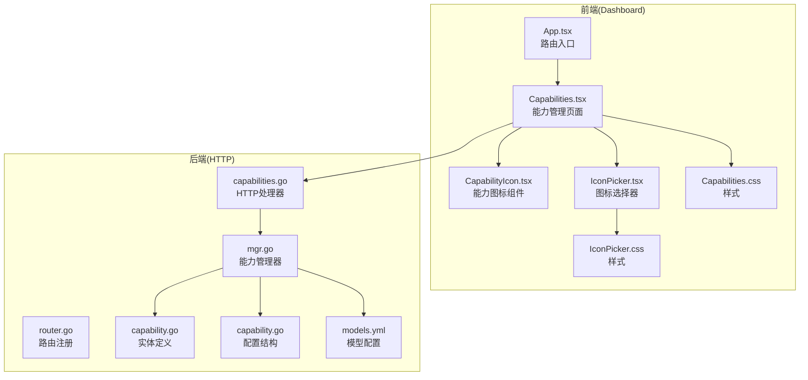
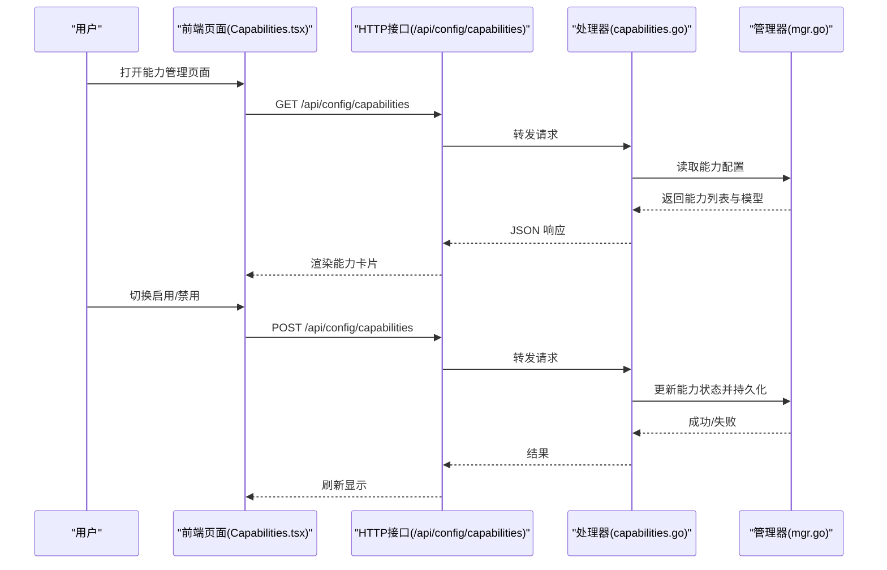
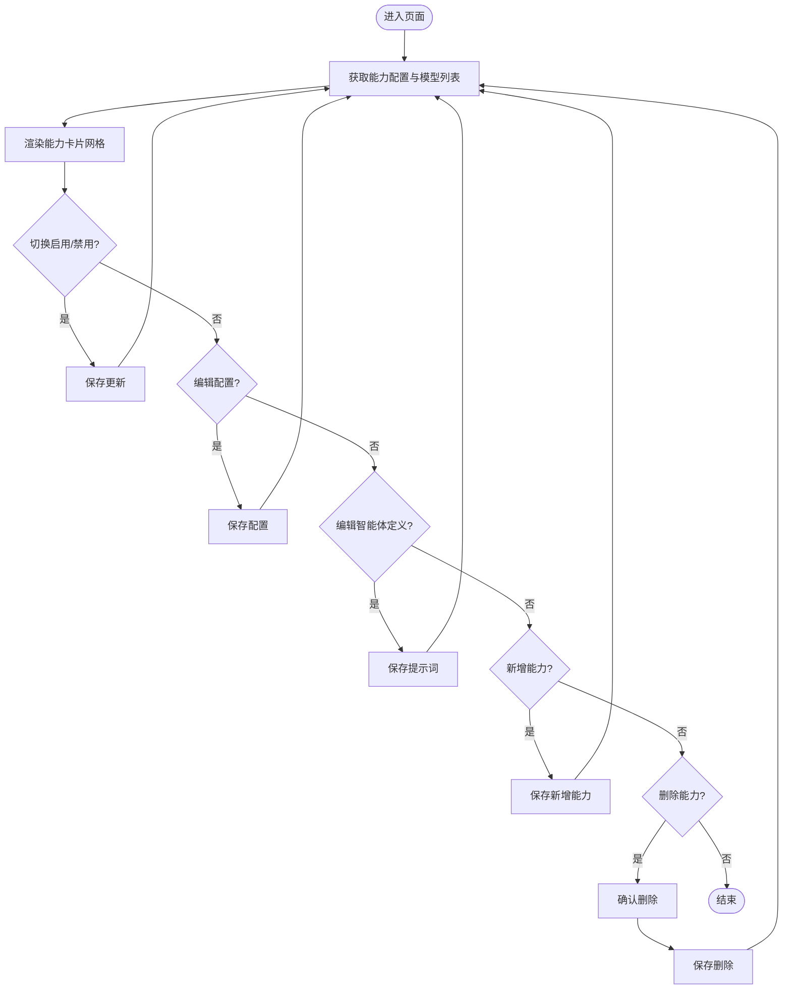
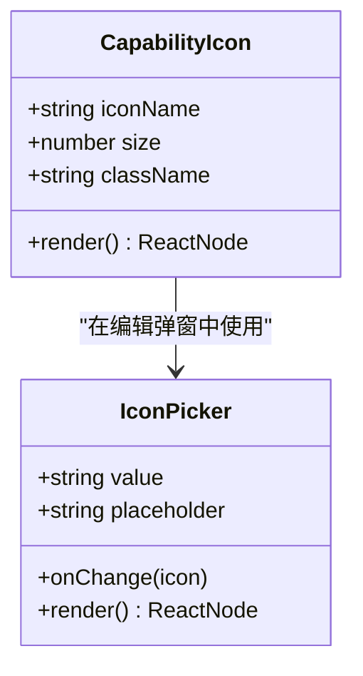
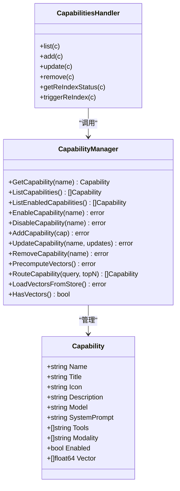
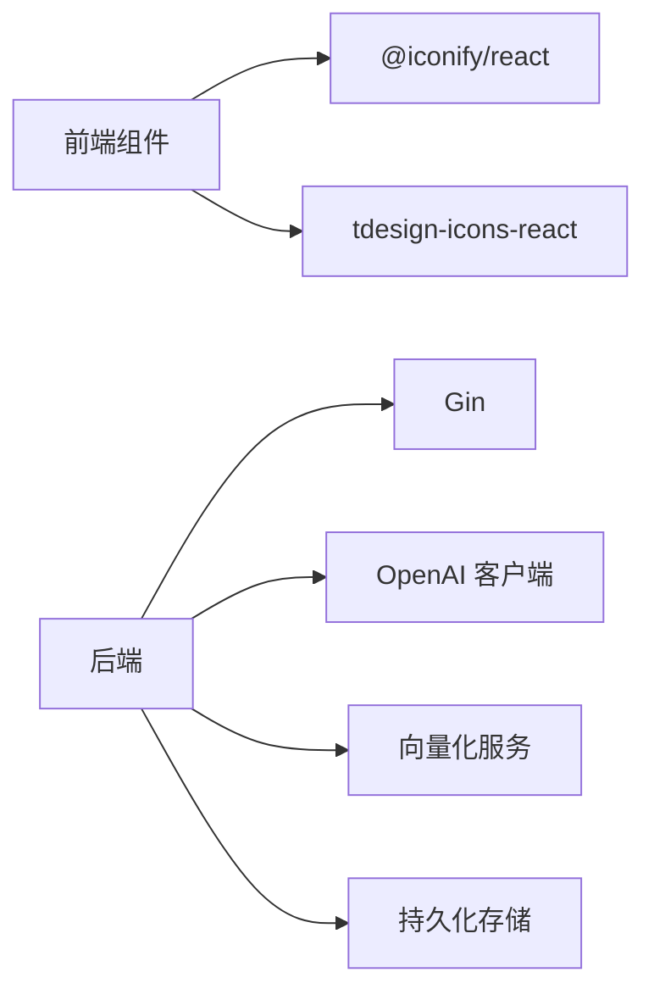

# 能力管理界面

<cite>
**本文档引用的文件**
- [dashboard/src/components/Capabilities.tsx](file://dashboard/src/components/Capabilities.tsx)
- [dashboard/src/components/CapabilityIcon.tsx](file://dashboard/src/components/CapabilityIcon.tsx)
- [dashboard/src/components/IconPicker.tsx](file://dashboard/src/components/IconPicker.tsx)
- [dashboard/src/components/Capabilities.css](file://dashboard/src/components/Capabilities.css)
- [dashboard/src/components/IconPicker.css](file://dashboard/src/components/IconPicker.css)
- [internal/usecase/capability/mgr.go](file://internal/usecase/capability/mgr.go)
- [internal/entity/capability.go](file://internal/entity/capability.go)
- [internal/adapters/http/handlers/capabilities.go](file://internal/adapters/http/handlers/capabilities.go)
- [internal/adapters/http/handlers/router.go](file://internal/adapters/http/handlers/router.go)
- [internal/config/capability.go](file://internal/config/capability.go)
- [config/models.yml](file://config/models.yml)
- [dashboard/src/App.tsx](file://dashboard/src/App.tsx)
</cite>

## 目录
1. [简介](#简介)
2. [项目结构](#项目结构)
3. [核心组件](#核心组件)
4. [架构总览](#架构总览)
5. [详细组件分析](#详细组件分析)
6. [依赖关系分析](#依赖关系分析)
7. [性能考虑](#性能考虑)
8. [故障排除指南](#故障排除指南)
9. [结论](#结论)
10. [附录](#附录)

## 简介
本文件面向 MindX 能力管理界面的技术文档，聚焦于前端能力管理页面与后端能力管理器的协作机制。文档深入解析能力列表展示、能力图标组件、能力状态管理与配置项、图标选择器的使用与定制、能力的启用/禁用与排序策略，并提供开发指南与扩展建议。同时给出能力系统的使用示例与最佳实践，帮助开发者快速上手并安全地扩展能力体系。

## 项目结构
能力管理界面由前端 React 组件与后端 Go 服务共同组成，通过 HTTP 接口进行数据交互。前端负责用户交互与可视化，后端负责能力配置的持久化与业务逻辑。

**图表来源**
- [dashboard/src/App.tsx](file://dashboard/src/App.tsx#L19-L63)
- [dashboard/src/components/Capabilities.tsx](file://dashboard/src/components/Capabilities.tsx#L41-L268)
- [dashboard/src/components/CapabilityIcon.tsx](file://dashboard/src/components/CapabilityIcon.tsx#L1-L49)
- [dashboard/src/components/IconPicker.tsx](file://dashboard/src/components/IconPicker.tsx#L1-L187)
- [internal/adapters/http/handlers/router.go](file://internal/adapters/http/handlers/router.go#L18-L149)
- [internal/adapters/http/handlers/capabilities.go](file://internal/adapters/http/handlers/capabilities.go#L12-L141)
- [internal/usecase/capability/mgr.go](file://internal/usecase/capability/mgr.go#L16-L120)
- [internal/entity/capability.go](file://internal/entity/capability.go#L3-L16)
- [internal/config/capability.go](file://internal/config/capability.go#L3-L29)
- [config/models.yml](file://config/models.yml#L1-L92)

**章节来源**
- [dashboard/src/App.tsx](file://dashboard/src/App.tsx#L19-L63)
- [internal/adapters/http/handlers/router.go](file://internal/adapters/http/handlers/router.go#L18-L149)

## 核心组件
- 能力管理页面：负责加载、展示、编辑、删除、新增能力；支持启用/禁用切换与智能体定义编辑。
- 能力图标组件：统一渲染能力图标，支持内置图标与 Iconify 图标集。
- 图标选择器：提供 Ant Design 图标库的搜索与选择，支持自定义图标字符串。
- 能力管理器：后端核心，负责能力的增删改查、启用/禁用、向量化与路由。

**章节来源**
- [dashboard/src/components/Capabilities.tsx](file://dashboard/src/components/Capabilities.tsx#L41-L268)
- [dashboard/src/components/CapabilityIcon.tsx](file://dashboard/src/components/CapabilityIcon.tsx#L26-L49)
- [dashboard/src/components/IconPicker.tsx](file://dashboard/src/components/IconPicker.tsx#L106-L187)
- [internal/usecase/capability/mgr.go](file://internal/usecase/capability/mgr.go#L16-L120)

## 架构总览
前端通过 HTTP 路由与后端交互，后端能力管理器负责能力配置的持久化与业务规则校验。能力状态与配置项通过配置文件与内存映射共同维护，支持运行时动态修改。

**图表来源**
- [internal/adapters/http/handlers/router.go](file://internal/adapters/http/handlers/router.go#L81-L91)
- [internal/adapters/http/handlers/capabilities.go](file://internal/adapters/http/handlers/capabilities.go#L22-L100)
- [internal/usecase/capability/mgr.go](file://internal/usecase/capability/mgr.go#L174-L272)
- [dashboard/src/components/Capabilities.tsx](file://dashboard/src/components/Capabilities.tsx#L56-L104)

## 详细组件分析

### 能力管理页面组件分析
- 数据流：组件挂载时发起请求获取能力配置与模型列表；保存时将更新后的配置提交至后端。
- 状态管理：使用 React hooks 管理加载状态、错误状态、编辑态与弹窗状态。
- 功能点：
  - 列表展示：网格布局展示能力卡片，包含图标、标题、名称徽标、状态徽标、描述与模型信息。
  - 启用/禁用：切换开关即时调用保存接口。
  - 编辑配置：弹窗支持修改标题、图标、描述与模型。
  - 编辑智能体定义：弹窗支持编辑 system_prompt，提供字符数与估算 tokens 统计。
  - 新增能力：弹窗收集必要字段并提交。
  - 删除能力：二次确认后移除。

**图表来源**
- [dashboard/src/components/Capabilities.tsx](file://dashboard/src/components/Capabilities.tsx#L56-L131)

**章节来源**
- [dashboard/src/components/Capabilities.tsx](file://dashboard/src/components/Capabilities.tsx#L41-L268)
- [dashboard/src/components/Capabilities.css](file://dashboard/src/components/Capabilities.css#L186-L407)

### 能力图标组件分析
- 支持类型：
  - 内置图标：通过映射表直接渲染 TDesign 图标组件。
  - Iconify 图标：当图标字符串包含冒号分隔符时，使用 @iconify/react 渲染。
  - 文本回退：若不满足上述条件，直接以文本形式显示。
- 可定制性：通过传入图标名称、尺寸与类名实现样式覆盖。

**图表来源**
- [dashboard/src/components/CapabilityIcon.tsx](file://dashboard/src/components/CapabilityIcon.tsx#L26-L49)
- [dashboard/src/components/IconPicker.tsx](file://dashboard/src/components/IconPicker.tsx#L106-L187)

**章节来源**
- [dashboard/src/components/CapabilityIcon.tsx](file://dashboard/src/components/CapabilityIcon.tsx#L1-L49)
- [dashboard/src/components/IconPicker.tsx](file://dashboard/src/components/IconPicker.tsx#L1-L187)
- [dashboard/src/components/IconPicker.css](file://dashboard/src/components/IconPicker.css#L1-L157)

### 能力管理器与后端处理流程
- 能力实体：包含名称、标题、图标、描述、模型、system_prompt、工具列表、模态类型、启用状态与向量等字段。
- 管理器职责：
  - 加载与持久化：从工作区配置文件加载或写入配置。
  - 启用/禁用：更新状态并按需初始化/清理客户端。
  - 更新与删除：支持部分字段更新与完整删除。
  - 路由与向量化：基于向量检索能力，或默认返回启用能力。
- HTTP 处理器：
  - 提供列出、新增、更新、删除能力的接口。
  - 提供重新索引状态查询与触发接口。

**图表来源**
- [internal/entity/capability.go](file://internal/entity/capability.go#L3-L16)
- [internal/usecase/capability/mgr.go](file://internal/usecase/capability/mgr.go#L16-L120)
- [internal/adapters/http/handlers/capabilities.go](file://internal/adapters/http/handlers/capabilities.go#L12-L141)

**章节来源**
- [internal/entity/capability.go](file://internal/entity/capability.go#L3-L16)
- [internal/usecase/capability/mgr.go](file://internal/usecase/capability/mgr.go#L174-L338)
- [internal/adapters/http/handlers/capabilities.go](file://internal/adapters/http/handlers/capabilities.go#L22-L100)

## 依赖关系分析
- 前端依赖：
  - @iconify/react：用于渲染第三方图标集。
  - tdesign-icons-react：用于内置图标组件。
  - 样式文件：独立的 CSS 文件管理视觉表现。
- 后端依赖：
  - Gin：HTTP 路由与中间件。
  - OpenAI 客户端：按模型配置初始化客户端，仅对启用能力生效。
  - 向量化服务与持久化存储：用于能力向量的生成与存储。

**图表来源**
- [dashboard/src/components/CapabilityIcon.tsx](file://dashboard/src/components/CapabilityIcon.tsx#L1-L12)
- [internal/usecase/capability/mgr.go](file://internal/usecase/capability/mgr.go#L124-L143)

**章节来源**
- [dashboard/src/components/CapabilityIcon.tsx](file://dashboard/src/components/CapabilityIcon.tsx#L1-L12)
- [internal/usecase/capability/mgr.go](file://internal/usecase/capability/mgr.go#L124-L143)

## 性能考虑
- 启用/禁用切换：仅更新内存映射与配置文件，避免不必要的网络往返。
- 向量化预计算：在系统启动或后台任务中执行，减少在线查询延迟。
- 图标渲染：内置图标与 Iconify 图标分别采用组件与远程渲染，建议在编辑场景使用内置图标提升首屏性能。
- 列表渲染：网格布局与懒加载结合，避免一次性渲染大量卡片。

## 故障排除指南
- 加载失败：检查后端健康状态与配置文件路径，确认工作区配置是否正确生成。
- 保存失败：核对必填字段（名称、模型、智能体定义），确保配置验证通过。
- 启用失败：确认模型配置有效且 API Key/BaseURL 正确，客户端初始化成功。
- 图标不显示：检查图标字符串格式，确保符合内置映射或 Iconify 规范。

**章节来源**
- [dashboard/src/components/Capabilities.tsx](file://dashboard/src/components/Capabilities.tsx#L56-L104)
- [internal/adapters/http/handlers/capabilities.go](file://internal/adapters/http/handlers/capabilities.go#L22-L100)
- [internal/usecase/capability/mgr.go](file://internal/usecase/capability/mgr.go#L340-L382)

## 结论
能力管理界面通过清晰的前后端分工实现了能力的全生命周期管理：从配置加载、状态切换、图标定制到智能体定义编辑与新增删除。后端能力管理器提供了稳健的业务逻辑与持久化保障，前端组件则提供了直观易用的操作体验。遵循本文的最佳实践与扩展建议，可安全高效地构建与维护复杂的能力体系。

## 附录

### 能力状态与配置项说明
- 状态管理：
  - enabled：布尔值，决定能力是否参与路由与调用。
  - fallback_to_local：布尔值，决定是否回退到本地模型。
- 配置项：
  - name/title/icon/description/system_prompt：能力元数据与提示词。
  - model：关联模型名称，用于初始化客户端。
  - tools/modality：能力工具与模态类型（可选）。
  - vector：向量表示（可选），用于语义路由。

**章节来源**
- [internal/entity/capability.go](file://internal/entity/capability.go#L3-L16)
- [internal/config/capability.go](file://internal/config/capability.go#L3-L29)
- [config/models.yml](file://config/models.yml#L1-L92)

### 能力图标使用与定制
- 内置图标：通过映射表直接渲染，适合常用图标。
- Iconify 图标：支持形如“集合:名称”的字符串，便于扩展更多图标集。
- 自定义文本：当无法识别时以文本回显，便于调试。

**章节来源**
- [dashboard/src/components/CapabilityIcon.tsx](file://dashboard/src/components/CapabilityIcon.tsx#L14-L48)
- [dashboard/src/components/IconPicker.tsx](file://dashboard/src/components/IconPicker.tsx#L5-L104)

### 能力启用/禁用与排序
- 启用/禁用：通过切换开关即时更新状态并持久化，仅启用能力会被初始化客户端。
- 排序：当前实现未提供显式排序功能，可通过调整配置文件顺序间接影响展示顺序。

**章节来源**
- [dashboard/src/components/Capabilities.tsx](file://dashboard/src/components/Capabilities.tsx#L99-L118)
- [internal/usecase/capability/mgr.go](file://internal/usecase/capability/mgr.go#L242-L272)

### 开发指南与扩展方法
- 新增能力字段：在实体与配置结构中添加字段，更新前端表单与后端校验逻辑。
- 自定义图标集：在图标选择器中扩展可用图标列表，或允许用户输入任意 Iconify 字符串。
- 扩展路由策略：在管理器中增加新的路由算法（如基于工具/模态的过滤）。
- 性能优化：对向量化与客户端初始化进行异步化与缓存策略优化。

**章节来源**
- [internal/entity/capability.go](file://internal/entity/capability.go#L3-L16)
- [internal/config/capability.go](file://internal/config/capability.go#L11-L29)
- [internal/usecase/capability/mgr.go](file://internal/usecase/capability/mgr.go#L422-L474)

### 使用示例与最佳实践
- 示例：创建一个写作能力，设置标题为“网络爆文”，图标为“ant-design:edit-outlined”，模型为“qwen3:1.7b”，system_prompt 描述智能体角色与行为规范。
- 最佳实践：
  - 为每个能力提供清晰的 system_prompt，确保语义路由效果。
  - 合理设置温度与最大 tokens，平衡质量与成本。
  - 对关键能力启用向量化，提升查询效率。
  - 定期触发重新索引，保持向量与描述同步。

**章节来源**
- [config/models.yml](file://config/models.yml#L1-L92)
- [internal/usecase/capability/mgr.go](file://internal/usecase/capability/mgr.go#L389-L420)