# 设置配置界面

<cite>
**本文档引用的文件**
- [dashboard/src/components/Settings.tsx](file://dashboard/src/components/Settings.tsx)
- [dashboard/src/components/GeneralSettings.tsx](file://dashboard/src/components/GeneralSettings.tsx)
- [dashboard/src/components/settings/types.ts](file://dashboard/src/components/settings/types.ts)
- [dashboard/src/components/settings/BasicConfigSection.tsx](file://dashboard/src/components/settings/BasicConfigSection.tsx)
- [dashboard/src/components/settings/BrainModelSection.tsx](file://dashboard/src/components/settings/BrainModelSection.tsx)
- [dashboard/src/components/settings/MemorySection.tsx](file://dashboard/src/components/settings/MemorySection.tsx)
- [dashboard/src/components/settings/OllamaSection.tsx](file://dashboard/src/components/settings/OllamaSection.tsx)
- [dashboard/src/components/settings/TokenBudgetSection.tsx](file://dashboard/src/components/settings/TokenBudgetSection.tsx)
- [dashboard/src/components/settings/VectorStoreSection.tsx](file://dashboard/src/components/settings/VectorStoreSection.tsx)
- [internal/config/global.go](file://internal/config/global.go)
- [internal/config/model.go](file://internal/config/model.go)
- [internal/config/manager.go](file://internal/config/manager.go)
- [internal/config/config.go](file://internal/config/config.go)
- [internal/adapters/http/handlers/settings.go](file://internal/adapters/http/handlers/settings.go)
</cite>

## 目录
1. [简介](#简介)
2. [项目结构](#项目结构)
3. [核心组件](#核心组件)
4. [架构概览](#架构概览)
5. [详细组件分析](#详细组件分析)
6. [依赖关系分析](#依赖关系分析)
7. [性能考虑](#性能考虑)
8. [故障排除指南](#故障排除指南)
9. [结论](#结论)
10. [附录](#附录)

## 简介

MindX 设置配置界面是一个完整的前端配置管理系统，提供了多种配置区域的管理和编辑功能。该系统采用模块化设计，支持通用设置、大脑模型设置、内存配置、Ollama 设置等各个配置区域的独立管理。

系统的核心特性包括：
- 响应式配置界面设计
- 实时数据绑定和验证机制
- 多层次配置管理
- 热更新和持久化存储
- 国际化支持
- 错误处理和状态管理

## 项目结构

设置配置界面主要由前端 React 组件和后端 Go 服务组成，采用分层架构设计：

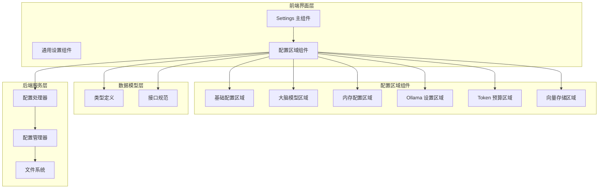

**图表来源**
- [dashboard/src/components/Settings.tsx](file://dashboard/src/components/Settings.tsx#L1-L399)
- [dashboard/src/components/settings/types.ts](file://dashboard/src/components/settings/types.ts#L1-L61)

**章节来源**
- [dashboard/src/components/Settings.tsx](file://dashboard/src/components/Settings.tsx#L1-L399)
- [dashboard/src/components/settings/types.ts](file://dashboard/src/components/settings/types.ts#L1-L61)

## 核心组件

### 主设置组件

主设置组件是整个配置界面的核心，负责管理多个配置区域的状态和交互逻辑。

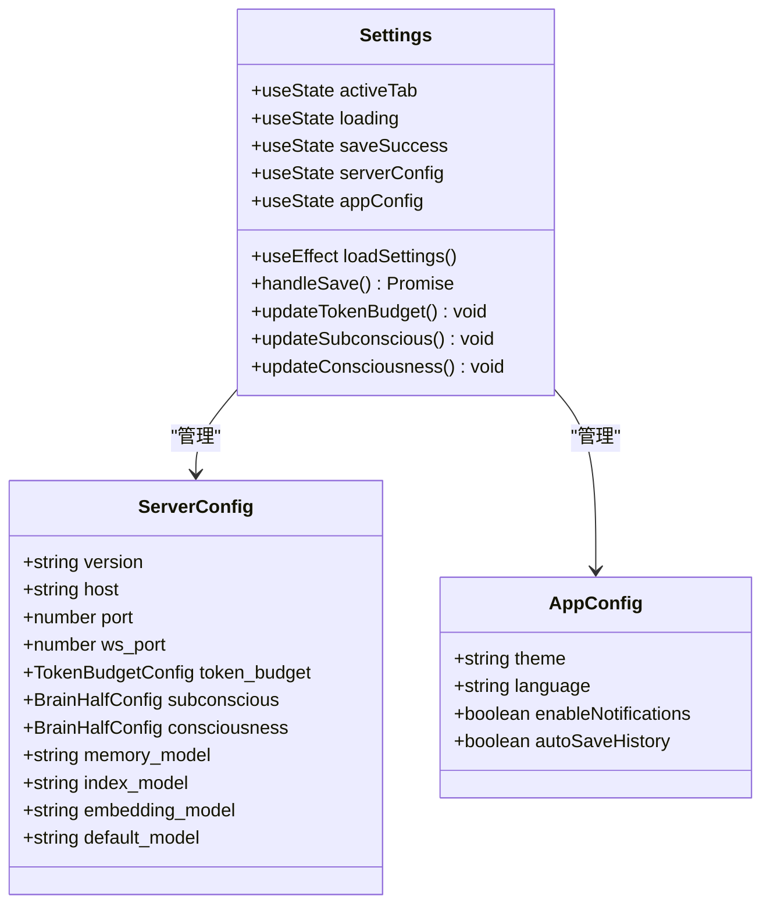

**图表来源**
- [dashboard/src/components/Settings.tsx](file://dashboard/src/components/Settings.tsx#L64-L137)

### 配置区域组件

系统提供多个专门的配置区域组件，每个组件负责特定类型的配置管理：

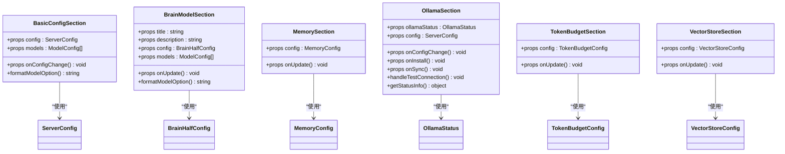

**图表来源**
- [dashboard/src/components/settings/BasicConfigSection.tsx](file://dashboard/src/components/settings/BasicConfigSection.tsx#L1-L58)
- [dashboard/src/components/settings/BrainModelSection.tsx](file://dashboard/src/components/settings/BrainModelSection.tsx#L1-L66)
- [dashboard/src/components/settings/MemorySection.tsx](file://dashboard/src/components/settings/MemorySection.tsx#L1-L60)
- [dashboard/src/components/settings/OllamaSection.tsx](file://dashboard/src/components/settings/OllamaSection.tsx#L1-L111)
- [dashboard/src/components/settings/TokenBudgetSection.tsx](file://dashboard/src/components/settings/TokenBudgetSection.tsx#L1-L49)
- [dashboard/src/components/settings/VectorStoreSection.tsx](file://dashboard/src/components/settings/VectorStoreSection.tsx#L1-L39)

**章节来源**
- [dashboard/src/components/Settings.tsx](file://dashboard/src/components/Settings.tsx#L64-L137)
- [dashboard/src/components/settings/BasicConfigSection.tsx](file://dashboard/src/components/settings/BasicConfigSection.tsx#L1-L58)
- [dashboard/src/components/settings/BrainModelSection.tsx](file://dashboard/src/components/settings/BrainModelSection.tsx#L1-L66)
- [dashboard/src/components/settings/MemorySection.tsx](file://dashboard/src/components/settings/MemorySection.tsx#L1-L60)
- [dashboard/src/components/settings/OllamaSection.tsx](file://dashboard/src/components/settings/OllamaSection.tsx#L1-L111)
- [dashboard/src/components/settings/TokenBudgetSection.tsx](file://dashboard/src/components/settings/TokenBudgetSection.tsx#L1-L49)
- [dashboard/src/components/settings/VectorStoreSection.tsx](file://dashboard/src/components/settings/VectorStoreSection.tsx#L1-L39)

## 架构概览

设置配置界面采用前后端分离的架构模式，前端使用 React 构建用户界面，后端使用 Go 提供配置管理服务。

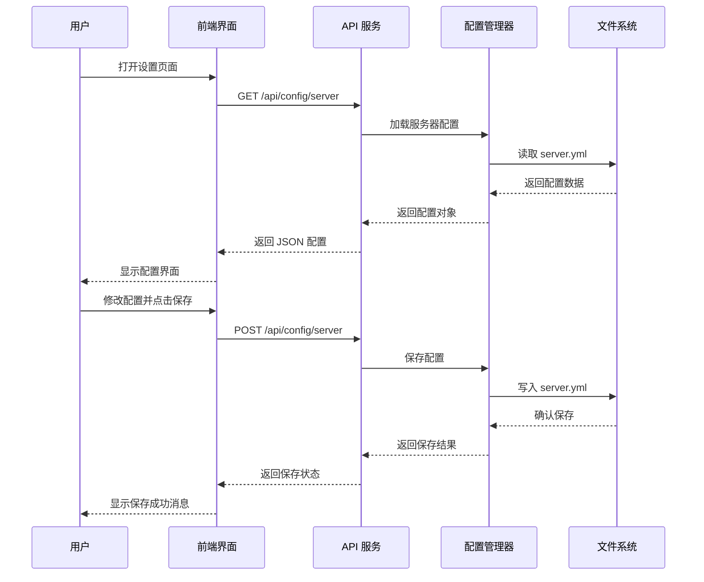

**图表来源**
- [dashboard/src/components/Settings.tsx](file://dashboard/src/components/Settings.tsx#L81-L115)
- [internal/config/config.go](file://internal/config/config.go#L215-L231)

### 数据流架构

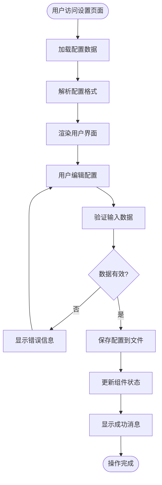

**图表来源**
- [dashboard/src/components/Settings.tsx](file://dashboard/src/components/Settings.tsx#L94-L115)
- [internal/config/config.go](file://internal/config/config.go#L215-L231)

**章节来源**
- [dashboard/src/components/Settings.tsx](file://dashboard/src/components/Settings.tsx#L81-L115)
- [internal/config/config.go](file://internal/config/config.go#L215-L231)

## 详细组件分析

### 通用设置组件

通用设置组件提供应用程序级别的配置选项，包括主题、语言、通知和历史记录管理等功能。

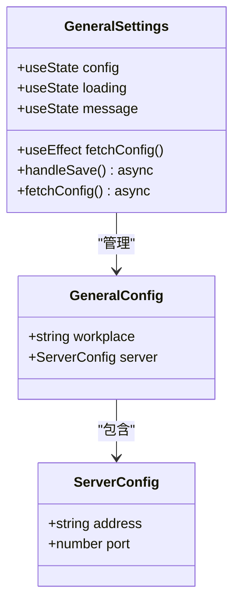

**图表来源**
- [dashboard/src/components/GeneralSettings.tsx](file://dashboard/src/components/GeneralSettings.tsx#L1-L110)

通用设置组件的主要功能包括：
- 工作区路径配置
- 服务器地址和端口设置
- 实时配置保存和反馈
- 错误处理和状态管理

**章节来源**
- [dashboard/src/components/GeneralSettings.tsx](file://dashboard/src/components/GeneralSettings.tsx#L1-L110)

### 大脑模型设置区域

大脑模型设置区域负责管理左右脑半球的模型配置，支持潜意识和意识两个层面的模型选择。

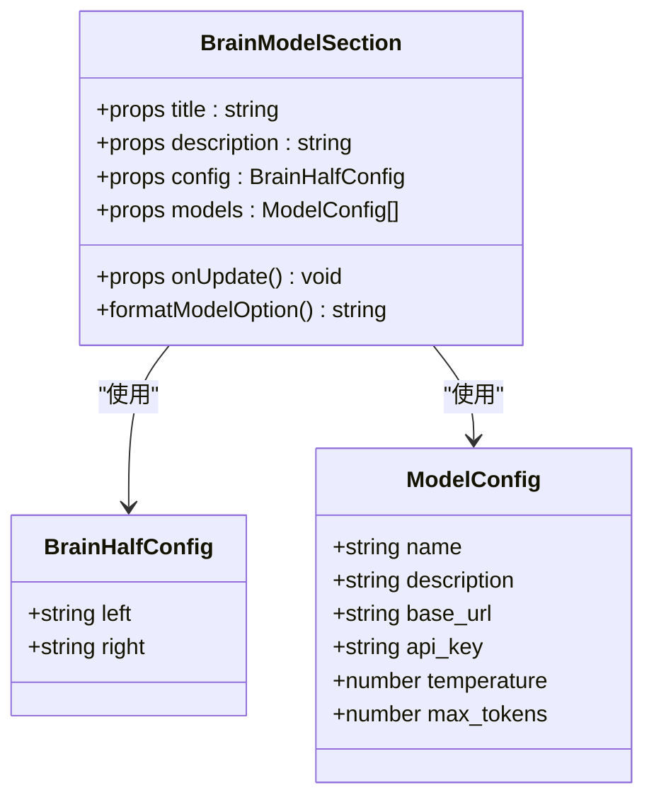

**图表来源**
- [dashboard/src/components/settings/BrainModelSection.tsx](file://dashboard/src/components/settings/BrainModelSection.tsx#L1-L66)

大脑模型设置的关键特性：
- 左右脑半球独立配置
- 模型选项动态加载
- 实时配置更新
- 描述信息格式化显示

**章节来源**
- [dashboard/src/components/settings/BrainModelSection.tsx](file://dashboard/src/components/settings/BrainModelSection.tsx#L1-L66)

### 内存配置区域

内存配置区域管理系统的记忆功能设置，包括记忆启用状态、摘要模型、关键词模型和调度计划等配置。

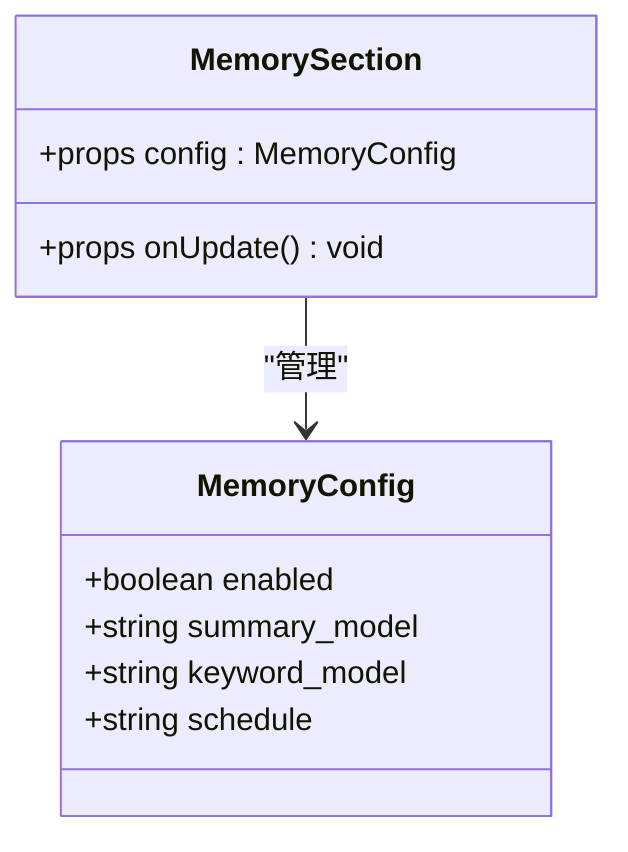

**图表来源**
- [dashboard/src/components/settings/MemorySection.tsx](file://dashboard/src/components/settings/MemorySection.tsx#L1-L60)

内存配置的主要功能：
- 启用/禁用记忆功能
- 配置摘要生成模型
- 设置关键词提取模型
- 定义维护调度计划

**章节来源**
- [dashboard/src/components/settings/MemorySection.tsx](file://dashboard/src/components/settings/MemorySection.tsx#L1-L60)

### Ollama 设置区域

Ollama 设置区域提供本地大模型服务的配置和管理功能，包括连接测试、模型同步和安装指导。

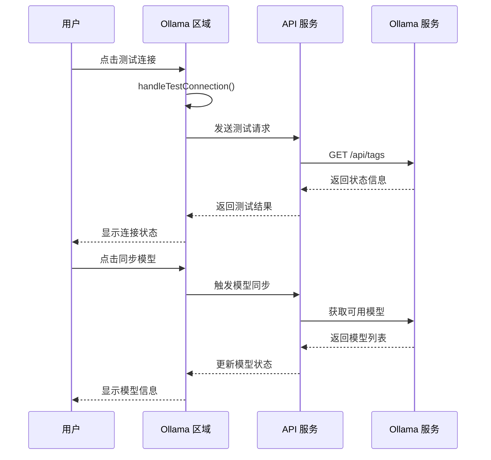

**图表来源**
- [dashboard/src/components/settings/OllamaSection.tsx](file://dashboard/src/components/settings/OllamaSection.tsx#L24-L39)

Ollama 设置的核心功能：
- 连接状态检测
- 模型列表展示
- 安装和同步指导
- 实时状态反馈

**章节来源**
- [dashboard/src/components/settings/OllamaSection.tsx](file://dashboard/src/components/settings/OllamaSection.tsx#L1-L111)

### Token 预算配置区域

Token 预算配置区域管理系统的令牌使用预算设置，确保模型调用的资源控制和成本管理。

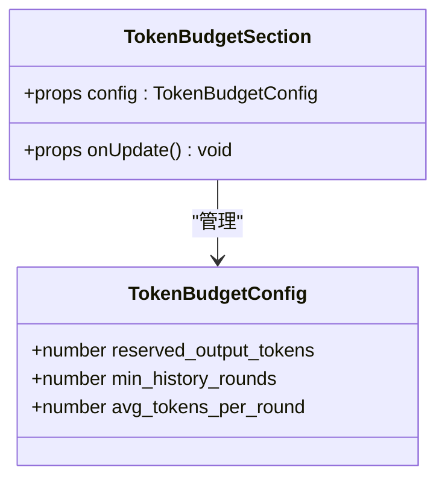

**图表来源**
- [dashboard/src/components/settings/TokenBudgetSection.tsx](file://dashboard/src/components/settings/TokenBudgetSection.tsx#L1-L49)

Token 预算配置的关键参数：
- 预留输出令牌数量
- 最小历史对话轮数
- 平均每轮令牌消耗

**章节来源**
- [dashboard/src/components/settings/TokenBudgetSection.tsx](file://dashboard/src/components/settings/TokenBudgetSection.tsx#L1-L49)

### 向量存储配置区域

向量存储配置区域管理系统的向量数据库设置，支持内存和 Badger 存储引擎的选择和配置。

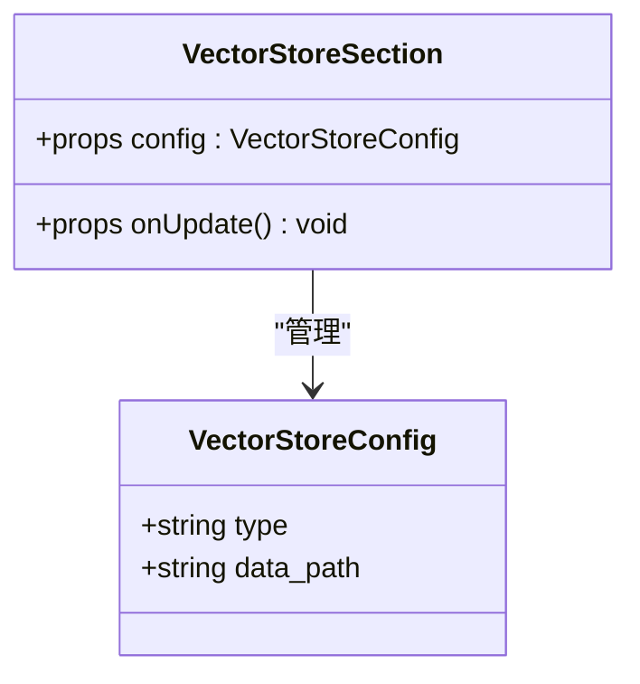

**图表来源**
- [dashboard/src/components/settings/VectorStoreSection.tsx](file://dashboard/src/components/settings/VectorStoreSection.tsx#L1-L39)

向量存储配置的主要选项：
- 存储类型选择（内存/Badger）
- 数据文件路径配置
- 动态配置更新

**章节来源**
- [dashboard/src/components/settings/VectorStoreSection.tsx](file://dashboard/src/components/settings/VectorStoreSection.tsx#L1-L39)

## 依赖关系分析

设置配置界面的依赖关系体现了清晰的分层架构和模块化设计。

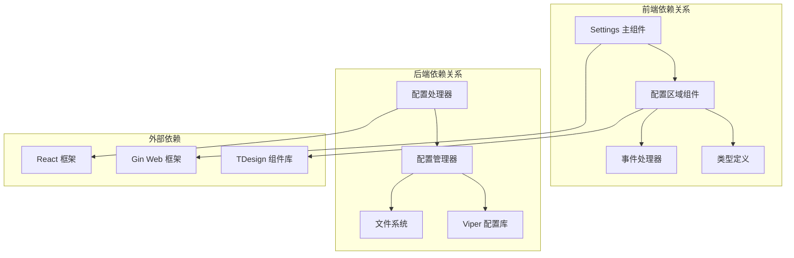

**图表来源**
- [dashboard/src/components/Settings.tsx](file://dashboard/src/components/Settings.tsx#L1-L399)
- [internal/adapters/http/handlers/settings.go](file://internal/adapters/http/handlers/settings.go#L1-L112)

### 数据模型依赖

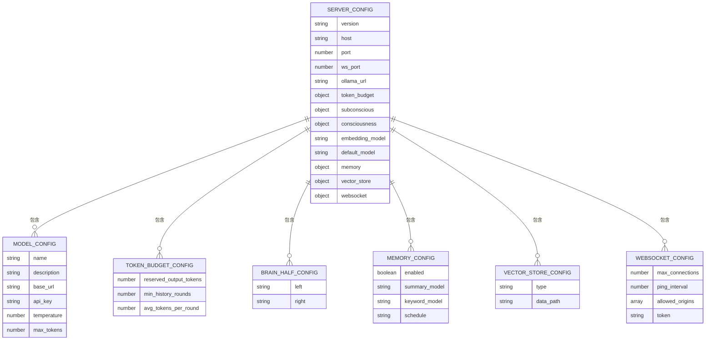

**图表来源**
- [internal/config/global.go](file://internal/config/global.go#L3-L42)
- [internal/config/model.go](file://internal/config/model.go#L3-L29)

**章节来源**
- [internal/config/global.go](file://internal/config/global.go#L1-L42)
- [internal/config/model.go](file://internal/config/model.go#L1-L29)

## 性能考虑

设置配置界面在设计时充分考虑了性能优化和用户体验：

### 前端性能优化

- **状态管理优化**：使用 React hooks 进行细粒度状态管理，避免不必要的重渲染
- **懒加载策略**：配置区域按需加载，减少初始渲染负担
- **防抖处理**：输入验证采用防抖机制，提升用户体验
- **虚拟滚动**：对于大量模型选项，采用虚拟滚动技术

### 后端性能优化

- **配置缓存**：配置文件读取后进行缓存，减少磁盘 I/O 操作
- **并发处理**：支持多用户同时访问配置界面
- **资源池管理**：数据库连接和文件句柄使用池化管理
- **增量更新**：只更新变更的配置项，减少写入操作

### 网络性能优化

- **HTTP 缓存**：配置数据使用适当的缓存头
- **压缩传输**：配置数据采用 Gzip 压缩传输
- **连接复用**：使用 HTTP/2 连接复用技术
- **CDN 加速**：静态资源通过 CDN 分发

## 故障排除指南

### 常见问题及解决方案

#### 配置加载失败

**问题症状**：设置页面无法显示配置数据或显示默认值

**可能原因**：
- 配置文件不存在或权限不足
- 配置文件格式错误
- 文件系统权限问题

**解决步骤**：
1. 检查配置文件是否存在：`~/.bot/server.yml`
2. 验证配置文件格式是否正确
3. 确认文件权限设置
4. 查看应用日志获取详细错误信息

#### 配置保存失败

**问题症状**：点击保存按钮后无响应或显示保存失败

**可能原因**：
- 文件写入权限不足
- 磁盘空间不足
- 配置格式验证失败

**解决步骤**：
1. 检查目标目录写入权限
2. 确认磁盘空间充足
3. 验证配置数据格式
4. 查看后端服务日志

#### Ollama 连接问题

**问题症状**：Ollama 连接测试失败或模型同步异常

**可能原因**：
- Ollama 服务未启动
- 网络连接问题
- 端口被占用

**解决步骤**：
1. 检查 Ollama 服务状态
2. 验证网络连通性
3. 确认端口配置正确
4. 查看防火墙设置

### 调试工具和技巧

#### 前端调试

- 使用浏览器开发者工具检查网络请求
- 在控制台查看 React 组件状态
- 使用 Redux DevTools（如果适用）监控状态变化

#### 后端调试

- 启用详细日志记录
- 使用 pprof 分析性能瓶颈
- 检查配置文件的序列化/反序列化过程

**章节来源**
- [internal/config/config.go](file://internal/config/config.go#L215-L231)
- [dashboard/src/components/settings/OllamaSection.tsx](file://dashboard/src/components/settings/OllamaSection.tsx#L24-L39)

## 结论

MindX 设置配置界面是一个设计精良、功能完整的配置管理系统。通过模块化的组件设计、清晰的分层架构和完善的错误处理机制，为用户提供了直观易用的配置体验。

系统的主要优势包括：
- **模块化设计**：各配置区域独立开发和维护
- **实时反馈**：配置更改即时生效并提供状态反馈
- **数据验证**：内置数据验证机制确保配置有效性
- **扩展性强**：支持新的配置区域和功能扩展
- **用户体验**：响应式设计和友好的交互界面

未来可以考虑的功能增强：
- 配置导入导出功能
- 配置模板管理
- 配置版本控制
- 更高级的验证规则
- 配置审计日志

## 附录

### 配置项分类和组织方式

系统按照功能域对配置项进行分类组织：

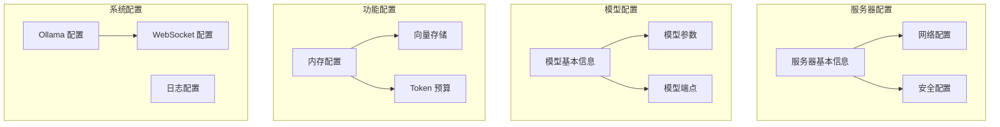

### 配置扩展开发指南

#### 添加新的配置区域

1. **创建组件文件**：在 `dashboard/src/components/settings/` 下创建新组件
2. **定义类型接口**：在 `types.ts` 中添加相应的 TypeScript 接口
3. **实现组件逻辑**：编写组件的渲染和状态管理代码
4. **集成到主设置界面**：在主设置组件中注册新组件
5. **添加路由和 API**：在后端添加相应的 API 处理逻辑

#### 配置验证最佳实践

- 使用受控组件确保数据一致性
- 实现即时验证反馈
- 提供清晰的错误消息
- 支持配置预览功能
- 实现配置重置功能

#### 热更新实现要点

- 使用 React hooks 管理组件状态
- 实现配置变更的实时同步
- 处理配置冲突和优先级
- 支持配置回滚功能
- 实现配置版本管理