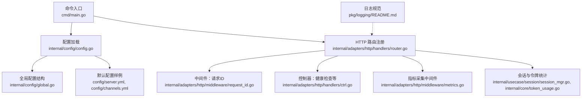
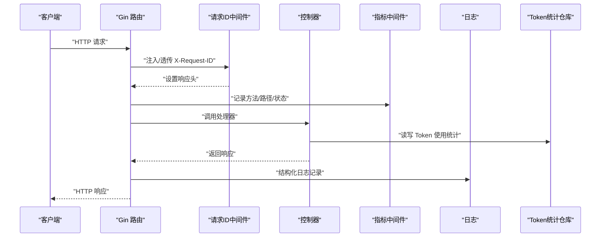
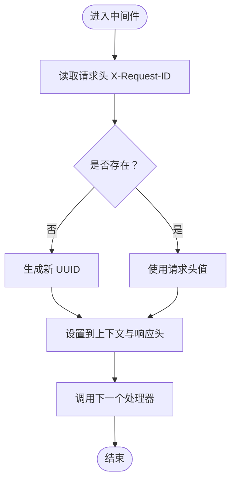
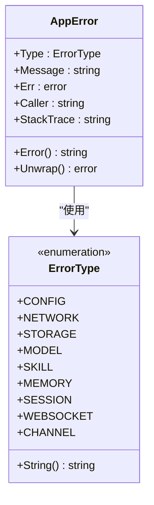
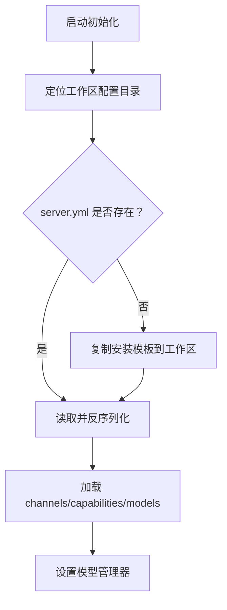
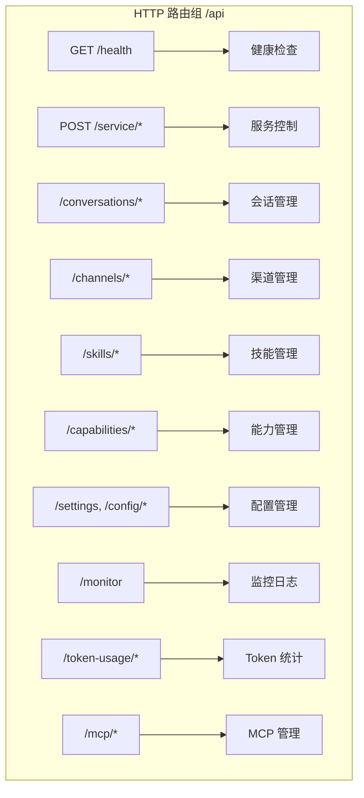
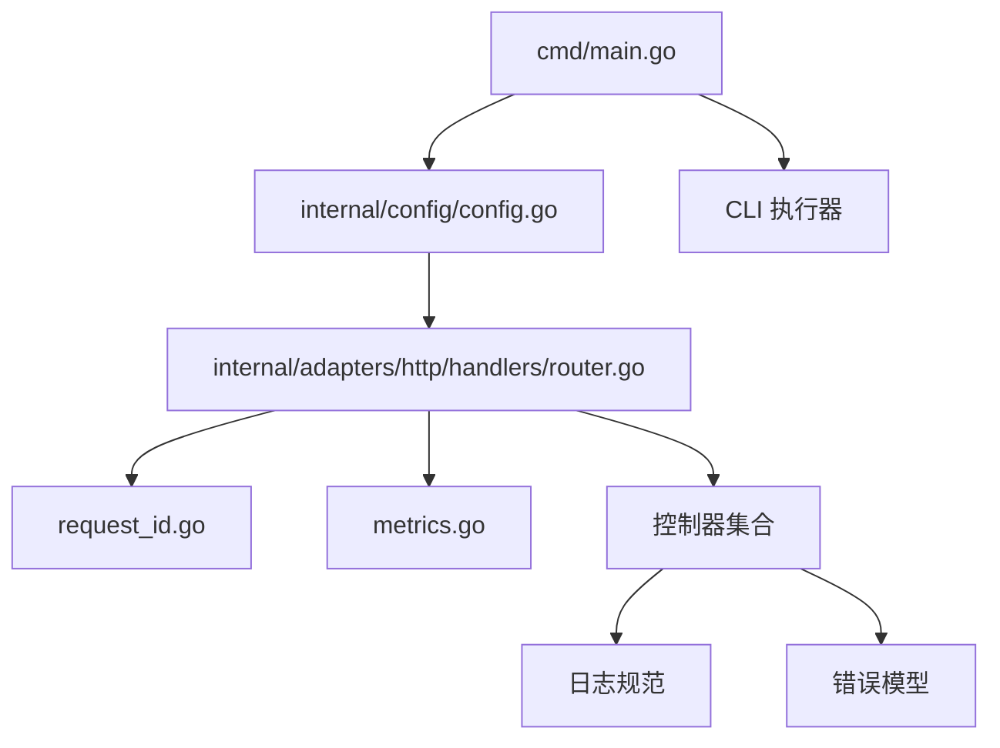

# 安全和权限

<cite>
**本文引用的文件**
- [cmd/main.go](file://cmd/main.go)
- [internal/adapters/http/middleware/request_id.go](file://internal/adapters/http/middleware/request_id.go)
- [internal/errors/errors.go](file://internal/errors/errors.go)
- [internal/config/config.go](file://internal/config/config.go)
- [internal/config/global.go](file://internal/config/global.go)
- [internal/adapters/http/handlers/router.go](file://internal/adapters/http/handlers/router.go)
- [config/server.yml](file://config/server.yml)
- [config/channels.yml](file://config/channels.yml)
- [pkg/logging/README.md](file://pkg/logging/README.md)
- [internal/core/token_usage.go](file://internal/core/token_usage.go)
- [internal/usecase/session/session_mgr.go](file://internal/usecase/session/session_mgr.go)
- [internal/adapters/http/middleware/metrics.go](file://internal/adapters/http/middleware/metrics.go)
- [internal/adapters/http/handlers/ctrl.go](file://internal/adapters/http/handlers/ctrl.go)
- [releases/README.md](file://releases/README.md)
</cite>

## 目录
1. [简介](#简介)
2. [项目结构](#项目结构)
3. [核心组件](#核心组件)
4. [架构总览](#架构总览)
5. [详细组件分析](#详细组件分析)
6. [依赖关系分析](#依赖关系分析)
7. [性能与安全特性](#性能与安全特性)
8. [故障排查指南](#故障排查指南)
9. [结论](#结论)
10. [附录](#附录)

## 简介
本文件面向安全工程师与开发者，系统化梳理 MindX 的安全与权限体系，涵盖认证与授权现状、数据保护策略、错误与异常管理、请求追踪（请求 ID）、隐私保护（数据本地化与用户控制）、安全配置与合规建议、安全审计与漏洞防护策略。由于当前代码库未内置集中式认证与细粒度授权机制，本文基于现有实现进行严谨解读，并给出可落地的加固建议。

## 项目结构
MindX 后端采用 Go 语言开发，入口位于命令行入口，HTTP 路由注册于适配器层，配置加载与持久化位于配置包，错误模型与日志规范在独立包中定义。前端仪表盘负责配置与运维操作，后端通过 HTTP API 提供能力管理、会话、技能、监控等功能。

**图表来源**
- [cmd/main.go](file://cmd/main.go#L1-L21)
- [internal/config/config.go](file://internal/config/config.go#L1-L37)
- [internal/adapters/http/handlers/router.go](file://internal/adapters/http/handlers/router.go#L1-L150)
- [internal/adapters/http/middleware/request_id.go](file://internal/adapters/http/middleware/request_id.go#L1-L23)
- [internal/adapters/http/handlers/ctrl.go](file://internal/adapters/http/handlers/ctrl.go#L1-L17)
- [internal/config/global.go](file://internal/config/global.go#L1-L42)
- [config/server.yml](file://config/server.yml#L1-L21)
- [config/channels.yml](file://config/channels.yml#L1-L96)
- [internal/adapters/http/middleware/metrics.go](file://internal/adapters/http/middleware/metrics.go#L1-L43)
- [internal/usecase/session/session_mgr.go](file://internal/usecase/session/session_mgr.go#L309-L367)
- [internal/core/token_usage.go](file://internal/core/token_usage.go#L1-L33)
- [pkg/logging/README.md](file://pkg/logging/README.md#L147-L237)

**章节来源**
- [cmd/main.go](file://cmd/main.go#L1-L21)
- [internal/adapters/http/handlers/router.go](file://internal/adapters/http/handlers/router.go#L1-L150)

## 核心组件
- 请求 ID 中间件：为每个请求生成或透传请求 ID，便于跨服务链路追踪。
- 错误模型与异常管理：统一错误类型、包装与堆栈记录，便于定位问题。
- 配置加载与持久化：集中加载 server.yml、channels.yml 等配置，支持模板初始化与保存。
- HTTP 路由与控制器：提供健康检查、服务控制、会话、技能、能力、监控、配置等接口。
- 指标采集中间件：Prometheus 指标统计，辅助安全监控与异常检测。
- 日志规范：结构化日志字段与安全注意事项，避免敏感信息泄露。
- 会话与令牌统计：会话生命周期管理与 Token 使用统计接口，支撑资源与用量审计。

**章节来源**
- [internal/adapters/http/middleware/request_id.go](file://internal/adapters/http/middleware/request_id.go#L1-L23)
- [internal/errors/errors.go](file://internal/errors/errors.go#L1-L234)
- [internal/config/config.go](file://internal/config/config.go#L1-L37)
- [internal/adapters/http/handlers/router.go](file://internal/adapters/http/handlers/router.go#L1-L150)
- [internal/adapters/http/middleware/metrics.go](file://internal/adapters/http/middleware/metrics.go#L1-L43)
- [pkg/logging/README.md](file://pkg/logging/README.md#L147-L237)
- [internal/usecase/session/session_mgr.go](file://internal/usecase/session/session_mgr.go#L309-L367)
- [internal/core/token_usage.go](file://internal/core/token_usage.go#L1-L33)

## 架构总览
下图展示从客户端到后端各组件的交互路径，以及安全相关的关键节点（请求 ID、指标、日志）。

**图表来源**
- [internal/adapters/http/middleware/request_id.go](file://internal/adapters/http/middleware/request_id.go#L10-L22)
- [internal/adapters/http/middleware/metrics.go](file://internal/adapters/http/middleware/metrics.go#L12-L43)
- [internal/adapters/http/handlers/router.go](file://internal/adapters/http/handlers/router.go#L18-L149)
- [internal/core/token_usage.go](file://internal/core/token_usage.go#L8-L33)
- [pkg/logging/README.md](file://pkg/logging/README.md#L186-L237)

## 详细组件分析

### 请求 ID 中间件
- 作用：从请求头读取 X-Request-ID，若缺失则生成新 UUID；随后在响应头回传，贯穿后续日志与指标采集。
- 实现要点：中间件在 c.Next() 前后设置与透传头部，确保下游可观测性。
- 安全意义：统一请求标识，便于审计、限流与追踪，降低跨服务定位问题成本。

**图表来源**
- [internal/adapters/http/middleware/request_id.go](file://internal/adapters/http/middleware/request_id.go#L10-L22)

**章节来源**
- [internal/adapters/http/middleware/request_id.go](file://internal/adapters/http/middleware/request_id.go#L1-L23)

### 错误处理与异常管理
- 错误类型：按配置、网络、存储、模型、技能、记忆、会话、WebSocket、渠道等分类，便于分类处置与告警。
- 错误包装：支持 Wrap/Wrapf 包装既有错误，保留原始错误与调用栈信息。
- 工具函数：IsAppError、GetAppError 提供类型断言与提取，利于统一处理。
- 建议：结合请求 ID 在日志中输出错误上下文，便于关联用户请求与错误根因。

**图表来源**
- [internal/errors/errors.go](file://internal/errors/errors.go#L9-L81)

**章节来源**
- [internal/errors/errors.go](file://internal/errors/errors.go#L1-L234)

### 配置加载与安全基线
- 配置来源：优先加载工作区 server.yml、channels.yml、capabilities.yml、models.yml；若缺失则从安装模板复制默认值。
- 结构定义：全局配置包含主机、端口、WebSocket、Token 预算、大脑左右半球模型、向量存储等。
- 安全建议：默认配置中不应包含敏感信息；敏感项（如渠道密钥）应通过环境变量或外部密管注入，避免明文落盘。

**图表来源**
- [internal/config/config.go](file://internal/config/config.go#L13-L37)
- [internal/config/global.go](file://internal/config/global.go#L3-L42)
- [config/server.yml](file://config/server.yml#L1-L21)
- [config/channels.yml](file://config/channels.yml#L1-L96)

**章节来源**
- [internal/config/config.go](file://internal/config/config.go#L1-L294)
- [internal/config/global.go](file://internal/config/global.go#L1-L42)
- [config/server.yml](file://config/server.yml#L1-L21)
- [config/channels.yml](file://config/channels.yml#L1-L96)

### HTTP 路由与访问控制现状
- 路由覆盖：健康检查、服务启停、会话管理、渠道管理、技能与能力管理、配置与高级配置、监控日志、Token 使用统计、MCP 服务器与目录。
- 访问控制：当前路由未见集中式鉴权/授权中间件，所有接口均为开放访问。建议在网关或中间件层引入认证与授权策略。

**图表来源**
- [internal/adapters/http/handlers/router.go](file://internal/adapters/http/handlers/router.go#L18-L149)
- [internal/adapters/http/handlers/ctrl.go](file://internal/adapters/http/handlers/ctrl.go#L15-L17)

**章节来源**
- [internal/adapters/http/handlers/router.go](file://internal/adapters/http/handlers/router.go#L1-L150)
- [internal/adapters/http/handlers/ctrl.go](file://internal/adapters/http/handlers/ctrl.go#L1-L17)

### 指标与可观测性（安全监控基础）
- 指标维度：HTTP 请求总量/时延、LLM 调用次数/时延、Token 使用、渠道消息量等。
- 安全价值：异常流量模式、频繁失败、高时延可作为入侵探测信号；结合请求 ID 可进行关联分析。

**图表来源**
- [internal/adapters/http/middleware/metrics.go](file://internal/adapters/http/middleware/metrics.go#L12-L43)

**章节来源**
- [internal/adapters/http/middleware/metrics.go](file://internal/adapters/http/middleware/metrics.go#L1-L43)

### 日志与隐私保护
- 结构化字段：系统日志与对话日志均采用结构化字段，便于检索与审计。
- 安全建议：避免记录敏感信息（密码、token），对用户数据进行脱敏；生产环境建议使用较高日志级别，对话日志注意存储空间与保留策略。

**章节来源**
- [pkg/logging/README.md](file://pkg/logging/README.md#L147-L237)

### 会话与令牌统计（数据保护与审计）
- 会话管理：并发安全（互斥锁），会话持久化与清理，支持删除与切换。
- 令牌统计：提供按模型、时间范围查询与汇总统计接口，支撑用量审计与预算控制。

**章节来源**
- [internal/usecase/session/session_mgr.go](file://internal/usecase/session/session_mgr.go#L309-L367)
- [internal/core/token_usage.go](file://internal/core/token_usage.go#L8-L33)

## 依赖关系分析
- 入口依赖配置与 CLI 执行器，配置再驱动 HTTP 路由注册。
- 路由依赖控制器与领域用例（会话、技能、能力、定时任务等）。
- 中间件层提供请求 ID 与指标采集，贯穿所有路由。
- 日志与错误模型为横切关注点，被各层复用。

**图表来源**
- [cmd/main.go](file://cmd/main.go#L14-L20)
- [internal/config/config.go](file://internal/config/config.go#L13-L37)
- [internal/adapters/http/handlers/router.go](file://internal/adapters/http/handlers/router.go#L18-L149)
- [internal/adapters/http/middleware/request_id.go](file://internal/adapters/http/middleware/request_id.go#L10-L22)
- [internal/adapters/http/middleware/metrics.go](file://internal/adapters/http/middleware/metrics.go#L12-L43)
- [pkg/logging/README.md](file://pkg/logging/README.md#L147-L237)
- [internal/errors/errors.go](file://internal/errors/errors.go#L1-L234)

**章节来源**
- [cmd/main.go](file://cmd/main.go#L1-L21)
- [internal/config/config.go](file://internal/config/config.go#L1-L37)
- [internal/adapters/http/handlers/router.go](file://internal/adapters/http/handlers/router.go#L1-L150)

## 性能与安全特性
- 性能：中间件层仅做轻量处理（请求 ID 生成、指标计数），对延迟影响极小。
- 安全：当前未发现内置认证/授权与加密存储，建议在网关层引入鉴权与 TLS；敏感配置通过密管注入；日志脱敏与最小化记录。

[本节为通用指导，无需列出具体文件来源]

## 故障排查指南
- 请求追踪：结合请求 ID 与日志字段快速定位问题；若出现异常，优先查看错误类型与调用栈。
- 配置问题：确认工作区配置文件是否存在与可读；必要时恢复安装模板并重新生成。
- 指标异常：关注 HTTP 失败率、时延突增、Token 使用异常波动，结合请求 ID 进行交叉验证。
- 会话与统计：核对会话持久化与删除逻辑，确保统计接口可用。

**章节来源**
- [internal/errors/errors.go](file://internal/errors/errors.go#L130-L141)
- [internal/config/config.go](file://internal/config/config.go#L45-L82)
- [internal/adapters/http/middleware/metrics.go](file://internal/adapters/http/middleware/metrics.go#L12-L43)
- [internal/usecase/session/session_mgr.go](file://internal/usecase/session/session_mgr.go#L348-L367)

## 结论
MindX 当前安全与权限体系以“可观测性”为基础，通过请求 ID、指标与日志形成闭环；但尚未实现集中式认证与授权。建议尽快引入鉴权中间件、TLS、密管集成与敏感配置加密，完善渠道 Webhook 签名校验，并建立安全告警与应急响应流程，以满足更严格的合规与安全要求。

[本节为总结性内容，无需列出具体文件来源]

## 附录

### 安全配置与合规建议
- 认证与授权
  - 在网关或中间件层引入统一鉴权（如基于 API Key 或 JWT），并对关键接口（配置、监控、服务控制）强制启用。
  - 对外暴露的 Webhook 接口增加签名验证与 IP 白名单。
- 数据保护
  - 敏感配置（渠道密钥、模型 API Key 等）通过环境变量或密管注入，避免明文落盘。
  - 日志脱敏与最小化记录，避免记录敏感字段。
- 隐私与本地化
  - 默认采用本地存储，不上传用户数据至云端；明确数据留存与删除策略。
- 审计与告警
  - 基于指标与日志建立异常检测规则（失败率、时延、Token 使用异常），结合请求 ID 进行关联分析。
- 发布与打包
  - 发布包应包含安全说明与最小权限配置示例，便于部署方遵循最小权限原则。

[本节为通用指导，无需列出具体文件来源]