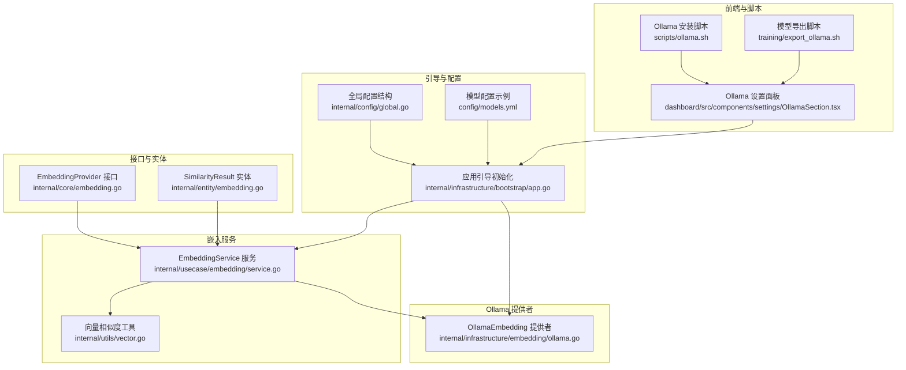
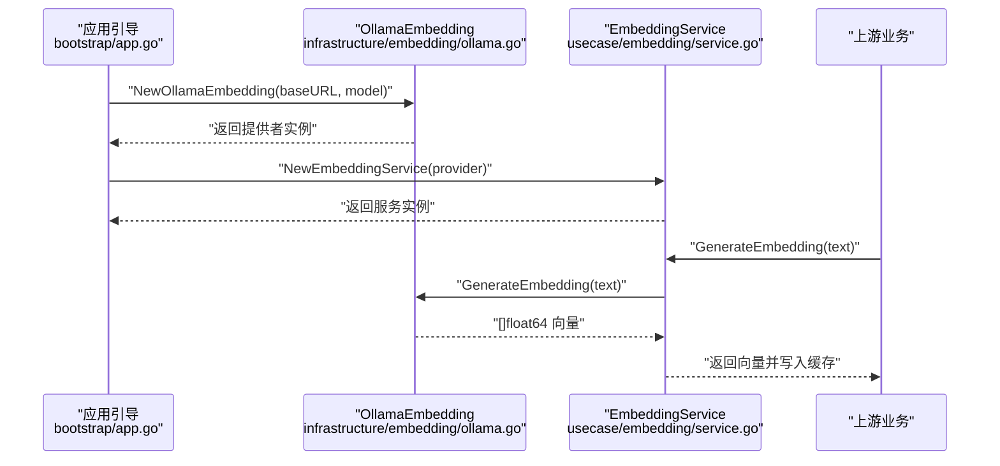
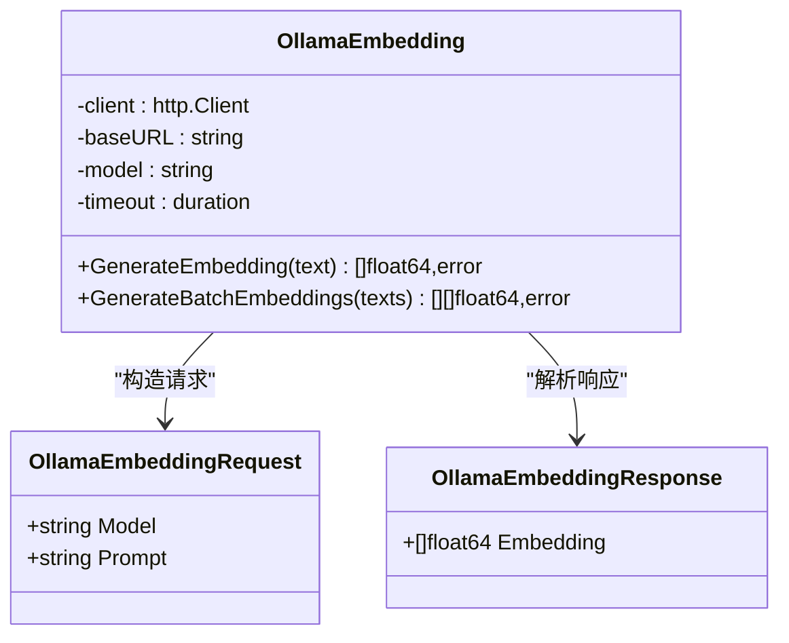
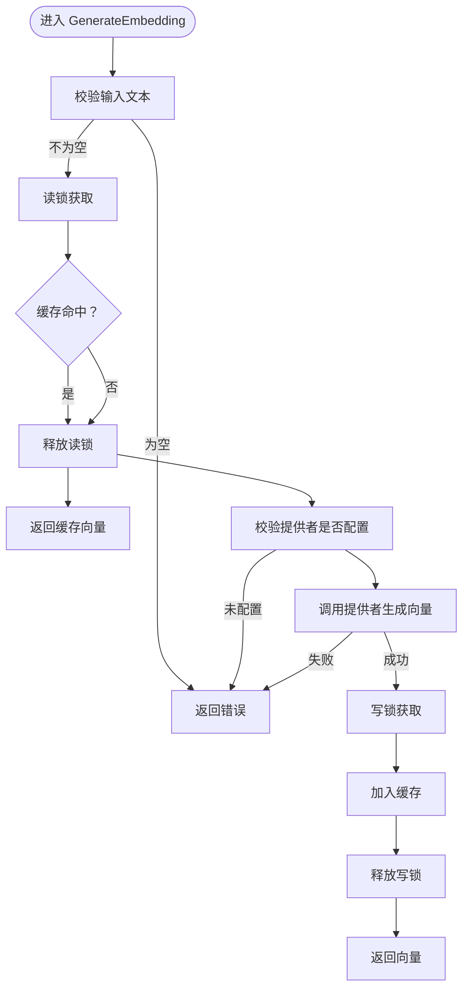
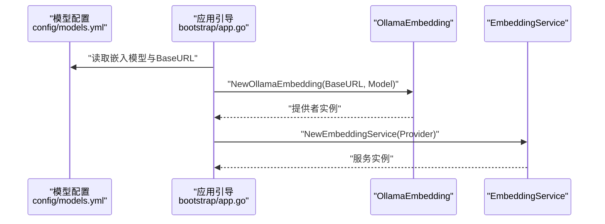
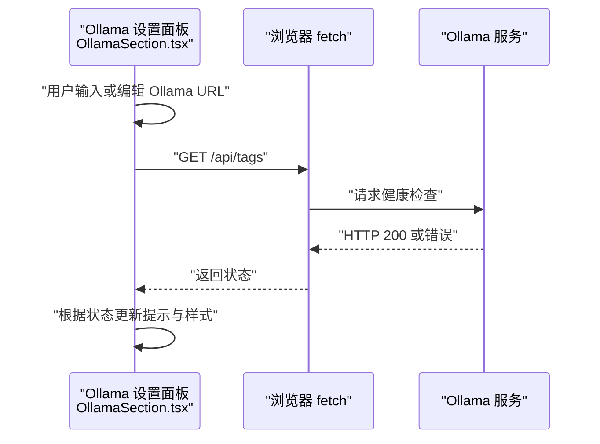
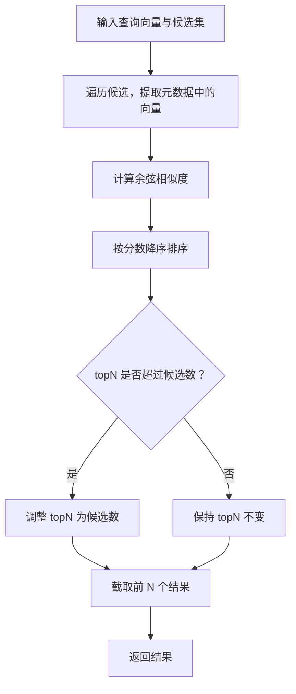
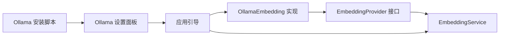

# Ollama 嵌入集成

<cite>
**本文引用的文件**
- [internal/infrastructure/embedding/ollama.go](file://internal/infrastructure/embedding/ollama.go)
- [internal/usecase/embedding/service.go](file://internal/usecase/embedding/service.go)
- [internal/core/embedding.go](file://internal/core/embedding.go)
- [internal/entity/embedding.go](file://internal/entity/embedding.go)
- [internal/infrastructure/bootstrap/app.go](file://internal/infrastructure/bootstrap/app.go)
- [config/models.yml](file://config/models.yml)
- [internal/config/global.go](file://internal/config/global.go)
- [dashboard/src/components/settings/OllamaSection.tsx](file://dashboard/src/components/settings/OllamaSection.tsx)
- [scripts/ollama.sh](file://scripts/ollama.sh)
- [training/export_ollama.sh](file://training/export_ollama.sh)
- [internal/utils/vector.go](file://internal/utils/vector.go)
</cite>

## 目录
1. [简介](#简介)
2. [项目结构](#项目结构)
3. [核心组件](#核心组件)
4. [架构总览](#架构总览)
5. [组件详细分析](#组件详细分析)
6. [依赖关系分析](#依赖关系分析)
7. [性能考量](#性能考量)
8. [故障排查指南](#故障排查指南)
9. [结论](#结论)
10. [附录](#附录)

## 简介
本文件面向 MindX 中的 Ollama 嵌入集成，系统性阐述如何将本地 Ollama 服务作为嵌入向量生成提供者接入 MindX 的嵌入服务层。内容涵盖：
- Ollama 作为本地 AI 模型服务的集成方式与配置方法
- 嵌入生成的实现原理（模型选择、请求格式、响应处理）
- Ollama 服务的启动、连接与健康检查机制
- 与主嵌入服务的接口适配与集成流程
- Ollama 服务器部署指南与配置示例
- 常见问题排查与性能优化建议

## 项目结构
围绕 Ollama 嵌入集成的相关代码分布在以下层次：
- 接口与实体：定义嵌入提供者接口与相似度结果实体
- 嵌入服务：统一的嵌入服务封装与缓存策略
- Ollama 提供者：HTTP 客户端对接 Ollama Embedding API
- 引导与配置：应用启动时初始化 Ollama 提供者与嵌入服务
- 前端设置页：Ollama 状态检测、URL 配置与模型同步
- 部署脚本：Ollama 安装与模型拉取
- 工具函数：向量相似度计算与最相似结果查找

图表来源
- [internal/core/embedding.go](file://internal/core/embedding.go#L1-L8)
- [internal/entity/embedding.go](file://internal/entity/embedding.go#L1-L9)
- [internal/usecase/embedding/service.go](file://internal/usecase/embedding/service.go#L1-L97)
- [internal/infrastructure/embedding/ollama.go](file://internal/infrastructure/embedding/ollama.go#L1-L136)
- [internal/infrastructure/bootstrap/app.go](file://internal/infrastructure/bootstrap/app.go#L119-L136)
- [internal/config/global.go](file://internal/config/global.go#L1-L42)
- [config/models.yml](file://config/models.yml#L1-L92)
- [dashboard/src/components/settings/OllamaSection.tsx](file://dashboard/src/components/settings/OllamaSection.tsx#L1-L111)
- [scripts/ollama.sh](file://scripts/ollama.sh#L1-L27)
- [training/export_ollama.sh](file://training/export_ollama.sh#L1-L109)
- [internal/utils/vector.go](file://internal/utils/vector.go#L1-L71)

章节来源
- [internal/core/embedding.go](file://internal/core/embedding.go#L1-L8)
- [internal/entity/embedding.go](file://internal/entity/embedding.go#L1-L9)
- [internal/usecase/embedding/service.go](file://internal/usecase/embedding/service.go#L1-L97)
- [internal/infrastructure/embedding/ollama.go](file://internal/infrastructure/embedding/ollama.go#L1-L136)
- [internal/infrastructure/bootstrap/app.go](file://internal/infrastructure/bootstrap/app.go#L119-L136)
- [internal/config/global.go](file://internal/config/global.go#L1-L42)
- [config/models.yml](file://config/models.yml#L1-L92)
- [dashboard/src/components/settings/OllamaSection.tsx](file://dashboard/src/components/settings/OllamaSection.tsx#L1-L111)
- [scripts/ollama.sh](file://scripts/ollama.sh#L1-L27)
- [training/export_ollama.sh](file://training/export_ollama.sh#L1-L109)
- [internal/utils/vector.go](file://internal/utils/vector.go#L1-L71)

## 核心组件
- 嵌入提供者接口：定义统一的单条与批量嵌入生成方法，便于替换不同后端提供者。
- EmbeddingService：封装缓存与并发安全，向上游业务提供一致的嵌入生成能力。
- OllamaEmbedding：基于 HTTP 客户端对接 Ollama Embedding API，支持单条与批量生成。
- 应用引导：在启动阶段根据模型配置选择 Ollama BaseURL 与模型名，初始化嵌入服务。
- 前端设置：提供 Ollama URL 配置、连接测试、安装与模型同步入口。

章节来源
- [internal/core/embedding.go](file://internal/core/embedding.go#L1-L8)
- [internal/usecase/embedding/service.go](file://internal/usecase/embedding/service.go#L1-L97)
- [internal/infrastructure/embedding/ollama.go](file://internal/infrastructure/embedding/ollama.go#L1-L136)
- [internal/infrastructure/bootstrap/app.go](file://internal/infrastructure/bootstrap/app.go#L119-L136)
- [dashboard/src/components/settings/OllamaSection.tsx](file://dashboard/src/components/settings/OllamaSection.tsx#L1-L111)

## 架构总览
MindX 将 Ollama 作为嵌入提供者注入到 EmbeddingService，后者对外暴露统一的嵌入生成接口。应用启动时读取模型配置，决定 Ollama 的 BaseURL 与模型名；前端设置页负责健康检查与配置同步。

图表来源
- [internal/infrastructure/bootstrap/app.go](file://internal/infrastructure/bootstrap/app.go#L119-L136)
- [internal/infrastructure/embedding/ollama.go](file://internal/infrastructure/embedding/ollama.go#L32-L55)
- [internal/usecase/embedding/service.go](file://internal/usecase/embedding/service.go#L22-L59)

## 组件详细分析

### Ollama 嵌入提供者（OllamaEmbedding）
- 功能职责
  - 单条嵌入生成：构造请求体，调用 Ollama Embedding API，解析响应。
  - 批量嵌入生成：逐条调用单条生成，聚合结果并过滤失败项。
  - 响应兼容：同时支持标准格式与直接数组两种返回形态。
- 关键点
  - BaseURL 自动清理尾部斜杠与“/v1”后缀，确保指向正确的 Embedding 端点。
  - 默认模型名与默认本地端口，便于零配置启动。
  - 错误处理覆盖序列化、网络、状态码与空向量等场景。

图表来源
- [internal/infrastructure/embedding/ollama.go](file://internal/infrastructure/embedding/ollama.go#L13-L30)
- [internal/infrastructure/embedding/ollama.go](file://internal/infrastructure/embedding/ollama.go#L57-L111)
- [internal/infrastructure/embedding/ollama.go](file://internal/infrastructure/embedding/ollama.go#L113-L135)

章节来源
- [internal/infrastructure/embedding/ollama.go](file://internal/infrastructure/embedding/ollama.go#L32-L55)
- [internal/infrastructure/embedding/ollama.go](file://internal/infrastructure/embedding/ollama.go#L57-L111)
- [internal/infrastructure/embedding/ollama.go](file://internal/infrastructure/embedding/ollama.go#L113-L135)

### 嵌入服务（EmbeddingService）
- 功能职责
  - 缓存：以文本为键的 LRU 缓存，避免重复请求 Ollama。
  - 并发安全：读写锁保护缓存访问。
  - 批量生成：对每个文本调用单条生成，聚合结果。
- 关键点
  - 对上游提供者的空校验，防止未配置导致的运行时错误。
  - 缓存命中直接返回，提升性能与稳定性。

图表来源
- [internal/usecase/embedding/service.go](file://internal/usecase/embedding/service.go#L31-L59)

章节来源
- [internal/usecase/embedding/service.go](file://internal/usecase/embedding/service.go#L13-L97)

### 应用引导与配置集成
- 启动流程
  - 从模型管理器获取嵌入模型名与 BaseURL（优先使用模型配置中的 BaseURL）。
  - 创建 OllamaEmbedding 提供者并注入 EmbeddingService。
  - 初始化向量存储与其它子系统。
- 配置要点
  - 模型配置示例中包含 Ollama Embedding 模型项，BaseURL 指向本地 11434 端口。
  - 全局配置结构包含 ollama_url 字段，可用于外部覆盖。

图表来源
- [internal/infrastructure/bootstrap/app.go](file://internal/infrastructure/bootstrap/app.go#L119-L136)
- [config/models.yml](file://config/models.yml#L86-L92)

章节来源
- [internal/infrastructure/bootstrap/app.go](file://internal/infrastructure/bootstrap/app.go#L119-L136)
- [internal/config/global.go](file://internal/config/global.go#L8)
- [config/models.yml](file://config/models.yml#L86-L92)

### 前端设置与健康检查
- 功能
  - 展示 Ollama 安装状态、运行状态与已安装模型列表。
  - 支持配置 Ollama URL，点击“测试连接”调用 /api/tags 进行健康检查。
  - 提供“安装 Ollama”与“同步模型”按钮，联动后端或脚本。
- 交互
  - 测试连接成功显示成功提示，失败显示失败提示。
  - 安装按钮触发安装脚本，同步按钮触发模型同步逻辑。

图表来源
- [dashboard/src/components/settings/OllamaSection.tsx](file://dashboard/src/components/settings/OllamaSection.tsx#L24-L39)

章节来源
- [dashboard/src/components/settings/OllamaSection.tsx](file://dashboard/src/components/settings/OllamaSection.tsx#L1-L111)

### 相似度计算与检索
- 相似度计算
  - 采用余弦相似度，支持任意维度向量比较，输出 [-1,1] 区间分数。
- 结果筛选
  - 对候选集合按相似度降序排序，返回前 N 个结果。
- 数据结构
  - SimilarityResult 包含目标标识、分数与元数据（其中可包含候选向量）。

图表来源
- [internal/utils/vector.go](file://internal/utils/vector.go#L31-L70)
- [internal/entity/embedding.go](file://internal/entity/embedding.go#L3-L9)

章节来源
- [internal/utils/vector.go](file://internal/utils/vector.go#L1-L71)
- [internal/entity/embedding.go](file://internal/entity/embedding.go#L1-L9)

## 依赖关系分析
- 接口与实现
  - EmbeddingProvider 接口被 EmbeddingService 依赖，OllamaEmbedding 实现该接口。
- 上下文耦合
  - 应用引导在启动阶段完成提供者与服务的装配，降低上层调用复杂度。
- 前后端协作
  - 前端设置页负责配置与健康检查，后端通过脚本与配置文件支撑部署与模型管理。

图表来源
- [internal/core/embedding.go](file://internal/core/embedding.go#L3-L7)
- [internal/usecase/embedding/service.go](file://internal/usecase/embedding/service.go#L15-L29)
- [internal/infrastructure/embedding/ollama.go](file://internal/infrastructure/embedding/ollama.go#L24-L30)
- [internal/infrastructure/bootstrap/app.go](file://internal/infrastructure/bootstrap/app.go#L119-L136)
- [dashboard/src/components/settings/OllamaSection.tsx](file://dashboard/src/components/settings/OllamaSection.tsx#L1-L111)
- [scripts/ollama.sh](file://scripts/ollama.sh#L1-L27)

章节来源
- [internal/core/embedding.go](file://internal/core/embedding.go#L1-L8)
- [internal/usecase/embedding/service.go](file://internal/usecase/embedding/service.go#L1-L97)
- [internal/infrastructure/embedding/ollama.go](file://internal/infrastructure/embedding/ollama.go#L1-L136)
- [internal/infrastructure/bootstrap/app.go](file://internal/infrastructure/bootstrap/app.go#L119-L136)
- [dashboard/src/components/settings/OllamaSection.tsx](file://dashboard/src/components/settings/OllamaSection.tsx#L1-L111)
- [scripts/ollama.sh](file://scripts/ollama.sh#L1-L27)

## 性能考量
- 缓存策略
  - EmbeddingService 内置 LRU 缓存，减少重复请求，建议结合业务文本特征合理设置缓存容量。
- 批量生成
  - 批量接口逐条调用单条生成，若对延迟敏感可考虑在提供者侧引入并发或队列优化。
- 超时与重试
  - 当前提供者使用固定超时，建议在高延迟网络环境下增加重试与指数退避策略。
- 相似度计算
  - 余弦相似度时间复杂度与向量维度线性相关，建议控制向量维度与预处理归一化以提升效率。

[本节为通用性能建议，无需特定文件引用]

## 故障排查指南
- 连接失败
  - 检查 Ollama 服务是否运行以及端口可达；前端“测试连接”可快速验证。
  - 若 BaseURL 配置错误，确认是否包含“/v1”，提供者会自动去除。
- 嵌入为空或错误
  - 确认模型已在 Ollama 中拉取并可用；提供者会尝试两种响应格式，仍失败则检查模型与文本长度。
  - 单条生成失败不会影响批量生成的整体结果，但需关注日志定位具体失败项。
- 配置问题
  - 模型配置文件中嵌入模型 BaseURL 应指向本地 11434 端口；全局配置可覆盖 ollama_url。
  - 如需同步模型，可在前端点击“同步 Ollama 模型”。

章节来源
- [dashboard/src/components/settings/OllamaSection.tsx](file://dashboard/src/components/settings/OllamaSection.tsx#L24-L39)
- [internal/infrastructure/embedding/ollama.go](file://internal/infrastructure/embedding/ollama.go#L32-L55)
- [config/models.yml](file://config/models.yml#L86-L92)
- [internal/config/global.go](file://internal/config/global.go#L8)

## 结论
MindX 通过统一的嵌入提供者接口与嵌入服务，将 Ollama 无缝集成到本地嵌入向量生成流程中。应用启动时自动装配 Ollama 提供者，前端提供便捷的健康检查与配置同步能力。配合缓存与相似度工具，系统在易用性与性能之间取得良好平衡。建议在生产环境中结合网络状况与负载情况进一步优化超时与并发策略。

[本节为总结性内容，无需特定文件引用]

## 附录

### 部署与配置指南
- 安装 Ollama
  - 使用安装脚本一键安装并拉取常用模型；也可手动安装后拉取所需模型。
- 配置 Ollama URL
  - 在前端设置页填写 Ollama 服务地址；或通过全局配置字段覆盖。
- 模型同步
  - 在前端点击“同步 Ollama 模型”，确保本地模型与配置一致。
- 导出与创建自定义模型
  - 使用训练导出脚本将微调后的模型转换为 GGUF 并创建 Ollama 模型，便于在 MindX 中使用。

章节来源
- [scripts/ollama.sh](file://scripts/ollama.sh#L1-L27)
- [dashboard/src/components/settings/OllamaSection.tsx](file://dashboard/src/components/settings/OllamaSection.tsx#L94-L106)
- [training/export_ollama.sh](file://training/export_ollama.sh#L78-L109)