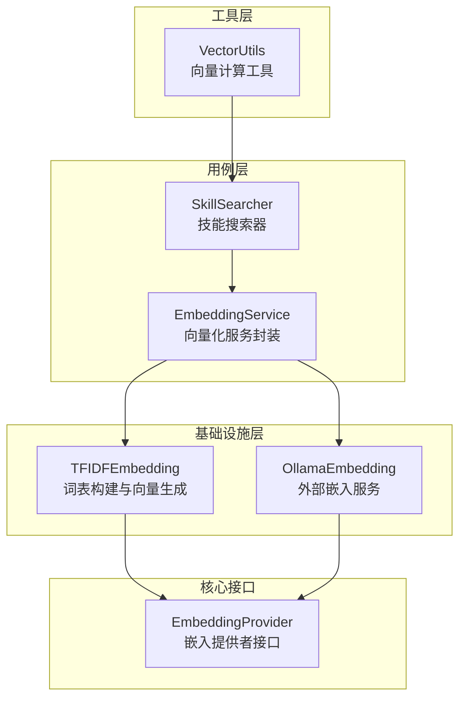
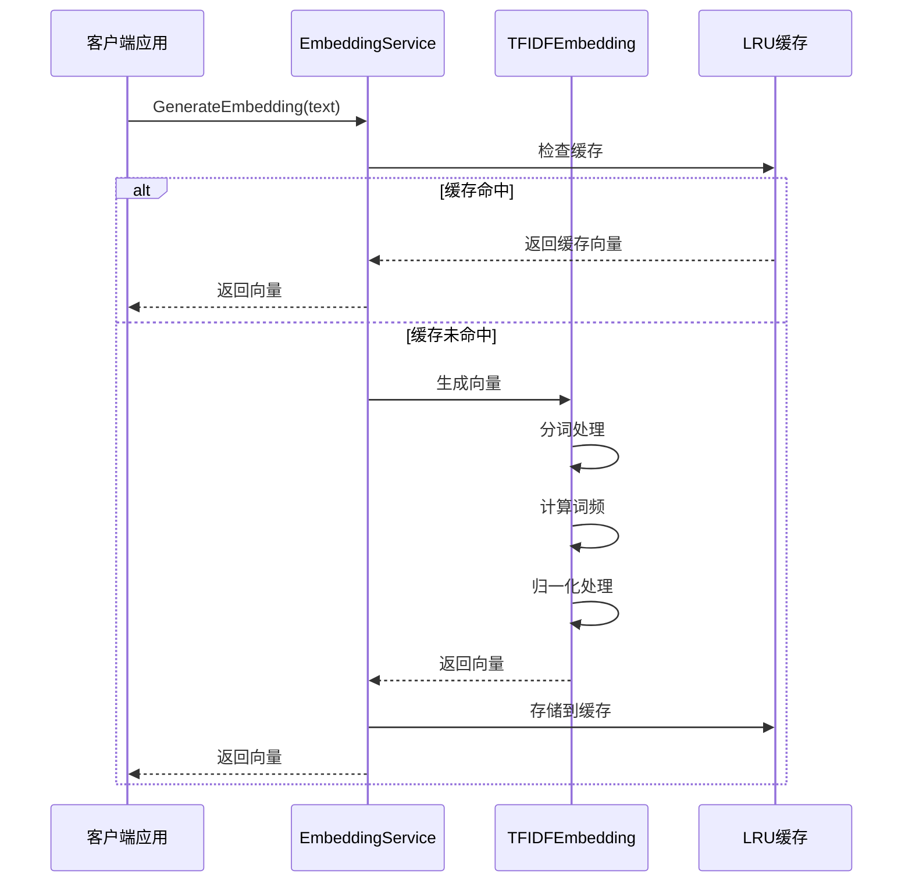
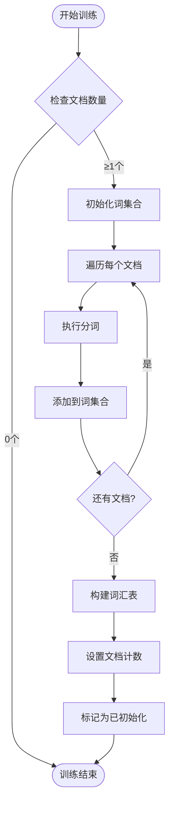
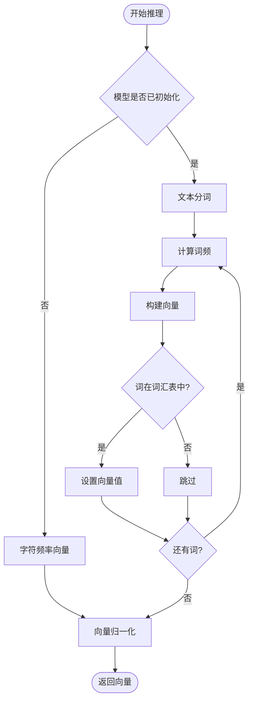
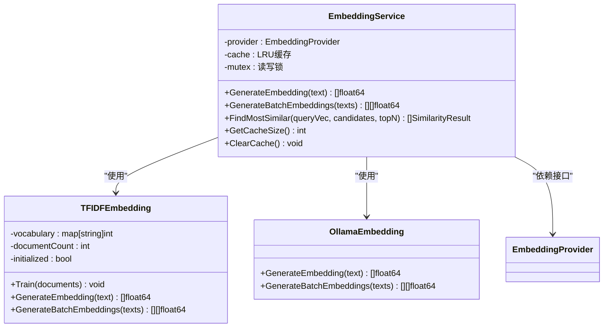
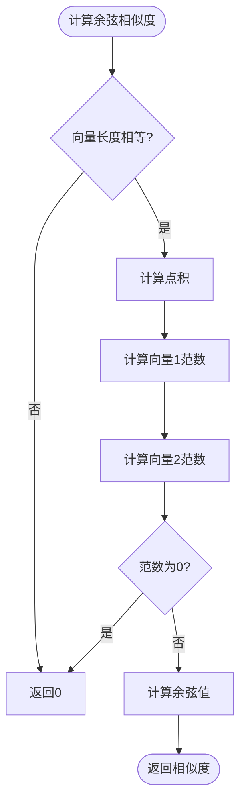
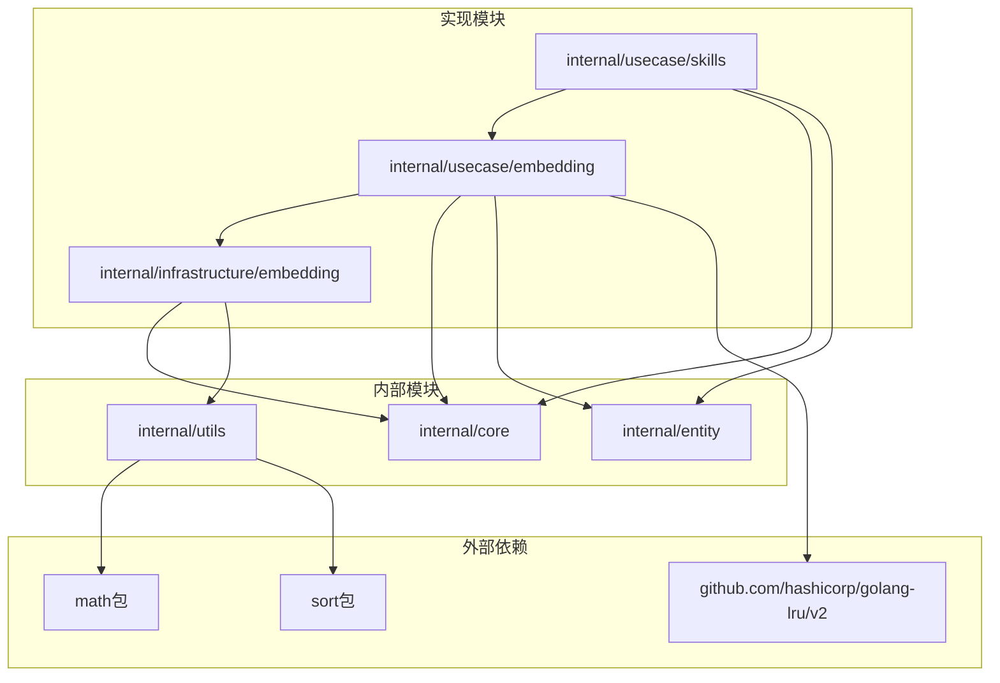

# TF-IDF 向量实现

<cite>
**本文档引用的文件**
- [tfidfe.go](file://internal/infrastructure/embedding/tfidfe.go)
- [service.go](file://internal/usecase/embedding/service.go)
- [embedding.go](file://internal/core/embedding.go)
- [vector.go](file://internal/utils/vector.go)
- [searcher.go](file://internal/usecase/skills/searcher.go)
- [app.go](file://internal/infrastructure/bootstrap/app.go)
- [models.yml](file://config/models.yml)
- [searcher_test.go](file://internal/usecase/skills/searcher_test.go)
</cite>

## 目录
1. [简介](#简介)
2. [项目结构](#项目结构)
3. [核心组件](#核心组件)
4. [架构概览](#架构概览)
5. [详细组件分析](#详细组件分析)
6. [依赖关系分析](#依赖关系分析)
7. [性能考虑](#性能考虑)
8. [故障排除指南](#故障排除指南)
9. [结论](#结论)
10. [附录](#附录)

## 简介

MindX 项目中的 TF-IDF 向量实现是一个简化的文本向量化解决方案，专为不需要外部服务依赖的场景设计。该实现提供了完整的 TF-IDF 算法流程，包括词表构建、权重计算和向量生成，并集成了缓存机制以提高性能。

TF-IDF（Term Frequency-Inverse Document Frequency）是一种广泛使用的文本挖掘技术，通过结合词频和逆文档频率来衡量词语在文档中的重要性。在 MindX 中，这个实现被用于技能搜索、能力管理和文本相似度计算等场景。

## 项目结构

TF-IDF 向量实现主要分布在以下目录结构中：



**图表来源**
- [tfidfe.go](file://internal/infrastructure/embedding/tfidfe.go#L1-L144)
- [service.go](file://internal/usecase/embedding/service.go#L1-L97)
- [embedding.go](file://internal/core/embedding.go#L1-L8)

**章节来源**
- [tfidfe.go](file://internal/infrastructure/embedding/tfidfe.go#L1-L144)
- [service.go](file://internal/usecase/embedding/service.go#L1-L97)
- [embedding.go](file://internal/core/embedding.go#L1-L8)

## 核心组件

### TFIDFEmbedding 结构体

TFIDFEmbedding 是核心的向量生成组件，包含以下关键属性：

- **vocabulary**: 词到索引的映射表，用于将文本转换为向量
- **documentCount**: 文档总数，用于 TF-IDF 计算中的逆文档频率
- **initialized**: 标记模型是否已训练完成

### 分词器实现

实现了简单但有效的中文文本分词功能：

- 支持空格、制表符、换行符等空白字符
- 处理常见的中文标点符号
- 自动转换为小写以提高匹配准确性
- 支持英文单词的正确分割

### 向量归一化

采用 L2 归一化技术，确保向量具有单位长度，便于相似度计算。

**章节来源**
- [tfidfe.go](file://internal/infrastructure/embedding/tfidfe.go#L5-L10)
- [tfidfe.go](file://internal/infrastructure/embedding/tfidfe.go#L85-L104)
- [tfidfe.go](file://internal/infrastructure/embedding/tfidfe.go#L117-L131)

## 架构概览

TF-IDF 向量实现遵循分层架构设计，各层职责明确：



**图表来源**
- [service.go](file://internal/usecase/embedding/service.go#L31-L59)
- [tfidfe.go](file://internal/infrastructure/embedding/tfidfe.go#L45-L70)

**章节来源**
- [service.go](file://internal/usecase/embedding/service.go#L1-L97)
- [tfidfe.go](file://internal/infrastructure/embedding/tfidfe.go#L1-L144)

## 详细组件分析

### TF-IDF 算法实现

#### 训练阶段

训练过程负责构建词汇表并统计文档信息：



**图表来源**
- [tfidfe.go](file://internal/infrastructure/embedding/tfidfe.go#L19-L43)

#### 推理阶段

推理过程将文本转换为向量表示：



**图表来源**
- [tfidfe.go](file://internal/infrastructure/embedding/tfidfe.go#L45-L70)

**章节来源**
- [tfidfe.go](file://internal/infrastructure/embedding/tfidfe.go#L19-L70)

### EmbeddingService 缓存机制

EmbeddingService 提供了完整的缓存管理功能：



**图表来源**
- [service.go](file://internal/usecase/embedding/service.go#L13-L29)
- [tfidfe.go](file://internal/infrastructure/embedding/tfidfe.go#L5-L10)

**章节来源**
- [service.go](file://internal/usecase/embedding/service.go#L13-L97)

### 相似度计算

系统实现了两种相似度计算方法：

#### 余弦相似度计算

标准余弦相似度公式：cos(θ) = A·B / (||A|| × ||B||)



**图表来源**
- [vector.go](file://internal/utils/vector.go#L10-L29)

#### 最相似结果查找

支持批量相似度计算和排序：

**章节来源**
- [vector.go](file://internal/utils/vector.go#L10-L71)

## 依赖关系分析

### 组件依赖图



**图表来源**
- [service.go](file://internal/usecase/embedding/service.go#L3-L11)
- [vector.go](file://internal/utils/vector.go#L3-L8)

**章节来源**
- [service.go](file://internal/usecase/embedding/service.go#L3-L11)
- [vector.go](file://internal/utils/vector.go#L3-L8)

### 接口契约

EmbeddingProvider 接口定义了统一的向量化接口：

**章节来源**
- [embedding.go](file://internal/core/embedding.go#L3-L7)

## 性能考虑

### 缓存策略

系统采用了 LRU（Least Recently Used）缓存策略：

- **缓存大小**: 500 个条目，适合个人使用场景
- **线程安全**: 使用读写锁确保并发访问的安全性
- **自动清理**: 当缓存满时自动移除最少使用的条目

### 内存优化

- **词表压缩**: 使用紧凑的数据结构存储词汇映射
- **向量稀疏性**: 利用词频为0的特性避免存储零值
- **批量处理**: 支持批量向量生成减少重复开销

### 性能基准

基于现有实现的性能特征：

| 操作类型 | 时间复杂度 | 空间复杂度 | 特点 |
|---------|-----------|-----------|------|
| 分词 | O(n) | O(k) | n为字符数，k为词汇数 |
| 词频统计 | O(k) | O(k) | k为词汇数 |
| 向量生成 | O(k) | O(k) | k为词汇表大小 |
| 相似度计算 | O(k) | O(1) | k为向量维度 |

**章节来源**
- [service.go](file://internal/usecase/embedding/service.go#L22-L29)
- [tfidfe.go](file://internal/infrastructure/embedding/tfidfe.go#L117-L131)

## 故障排除指南

### 常见问题及解决方案

#### 1. 向量维度不匹配

**问题**: 相似度计算时报错，提示向量维度不一致

**解决方案**: 
- 确保所有向量来自同一词汇表
- 检查训练数据的一致性
- 验证向量生成过程中的词汇过滤

#### 2. 相似度结果异常

**问题**: 相似度计算结果不符合预期

**排查步骤**:
- 检查向量是否正确归一化
- 验证词汇表构建过程
- 确认分词器的正确性

#### 3. 缓存性能问题

**问题**: 缓存命中率低或内存占用过高

**优化建议**:
- 调整缓存大小参数
- 分析热点数据模式
- 考虑使用更高效的缓存策略

**章节来源**
- [searcher_test.go](file://internal/usecase/skills/searcher_test.go#L212-L271)

## 结论

MindX 项目中的 TF-IDF 向量实现提供了一个轻量级但功能完整的文本向量化解决方案。该实现具有以下优势：

1. **独立性强**: 不依赖外部服务，部署简单
2. **性能优良**: 采用缓存机制和优化的数据结构
3. **易于扩展**: 清晰的接口设计便于集成其他嵌入方式
4. **实用性强**: 专门针对中文文本处理进行了优化

相比传统的深度学习嵌入方式，TF-IDF 的优势在于：
- **计算效率高**: 线性时间复杂度，适合大规模文本处理
- **可解释性强**: 权重计算过程透明，便于调试和优化
- **资源消耗少**: 不需要 GPU 或大量内存
- **部署简单**: 无需额外的模型文件或服务依赖

## 附录

### 使用示例

#### 基本使用流程

```go
// 创建 TF-IDF 向量提供者
provider := NewTFIDFEmbedding()

// 训练模型（可选）
documents := []string{"文档1内容", "文档2内容", "文档3内容"}
provider.Train(documents)

// 生成单个向量
text := "要向量化的内容"
vector, err := provider.GenerateEmbedding(text)

// 批量生成向量
texts := []string{"文本1", "文本2", "文本3"}
vectors, err := provider.GenerateBatchEmbeddings(texts)
```

#### 集成到系统中

```go
// 在应用启动时配置
embeddingSvc := NewEmbeddingService(tfidfProvider)

// 在技能搜索中使用
searcher := NewSkillSearcher(embeddingSvc, logger)
results, err := searcher.Search("关键词1", "关键词2")
```

### 参数调优指南

#### 词汇表大小优化

- **小型项目**: 词汇表大小 1000-5000
- **中型项目**: 词汇表大小 5000-20000  
- **大型项目**: 词汇表大小 20000+

#### 缓存配置

- **高并发场景**: 缓存大小 1000-5000
- **低并发场景**: 缓存大小 100-1000
- **内存受限环境**: 缓存大小 50-500

#### 相似度阈值

- **严格匹配**: 0.8-0.9
- **一般匹配**: 0.6-0.8
- **宽松匹配**: 0.4-0.6

### 扩展和定制指南

#### 自定义分词器

```go
// 实现自定义分词逻辑
func (t *TFIDFEmbedding) CustomTokenize(text string) []string {
    // 添加自定义分词规则
    return tokens
}
```

#### 集成其他嵌入方式

```go
// 实现 EmbeddingProvider 接口
type CustomEmbeddingProvider struct{}

func (c *CustomEmbeddingProvider) GenerateEmbedding(text string) ([]float64, error) {
    // 实现自定义嵌入逻辑
    return vector, nil
}
```

#### 性能监控

```go
// 获取缓存统计信息
cacheSize := embeddingSvc.GetCacheSize()
// 清空缓存进行重置
embeddingSvc.ClearCache()
```

**章节来源**
- [app.go](file://internal/infrastructure/bootstrap/app.go#L119-L136)
- [models.yml](file://config/models.yml#L86-L92)