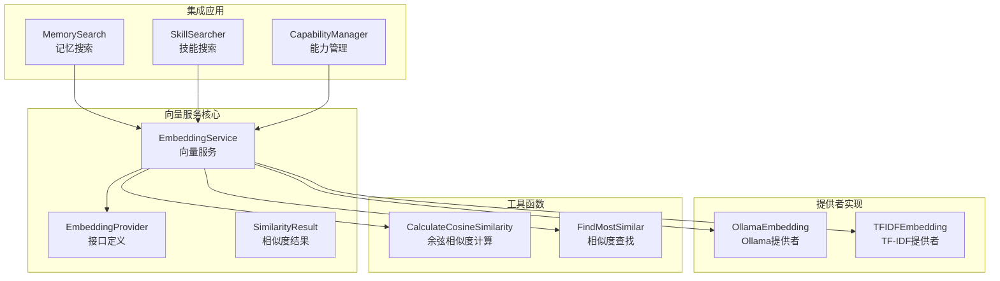
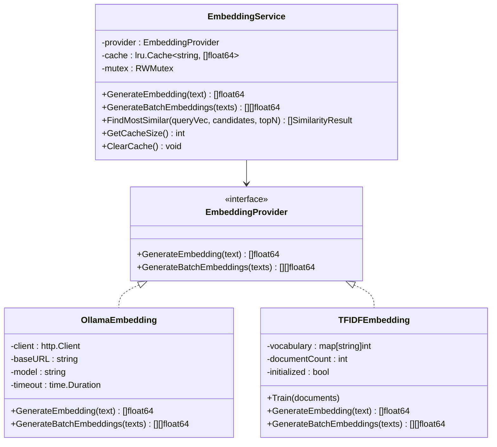
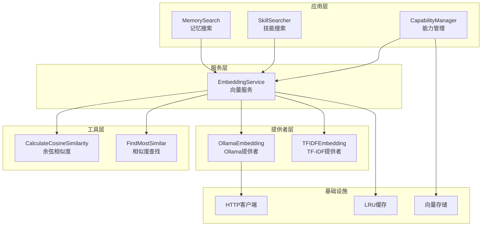
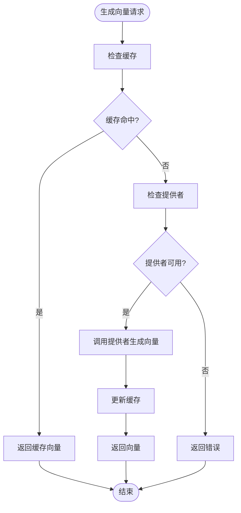
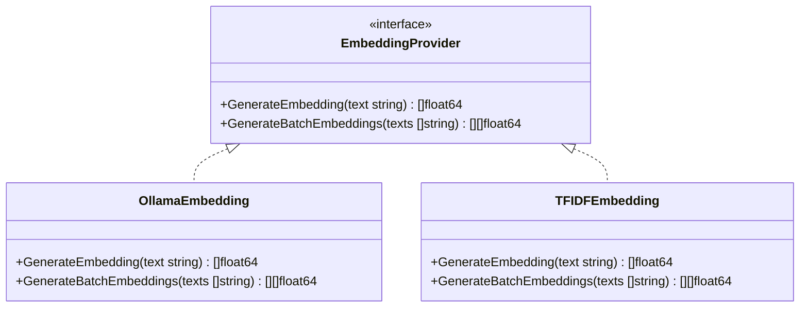
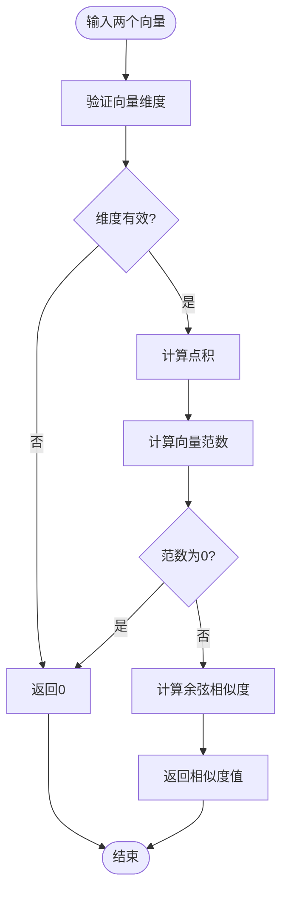
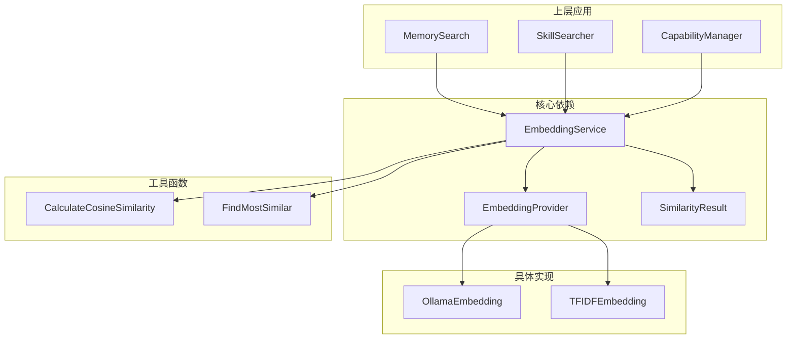

# 向量服务核心实现

<cite>
**本文档引用的文件**
- [internal/usecase/embedding/service.go](file://internal/usecase/embedding/service.go)
- [internal/core/embedding.go](file://internal/core/embedding.go)
- [internal/entity/embedding.go](file://internal/entity/embedding.go)
- [internal/infrastructure/embedding/ollama.go](file://internal/infrastructure/embedding/ollama.go)
- [internal/infrastructure/embedding/tfidfe.go](file://internal/infrastructure/embedding/tfidfe.go)
- [internal/utils/vector.go](file://internal/utils/vector.go)
- [internal/infrastructure/bootstrap/app.go](file://internal/infrastructure/bootstrap/app.go)
- [internal/usecase/memory/search.go](file://internal/usecase/memory/search.go)
- [internal/usecase/skills/searcher.go](file://internal/usecase/skills/searcher.go)
- [internal/usecase/capability/mgr.go](file://internal/usecase/capability/mgr.go)
- [internal/adapters/channels/test_utils.go](file://internal/adapters/channels/test_utils.go)
</cite>

## 目录
1. [简介](#简介)
2. [项目结构](#项目结构)
3. [核心组件](#核心组件)
4. [架构概览](#架构概览)
5. [详细组件分析](#详细组件分析)
6. [依赖关系分析](#依赖关系分析)
7. [性能考虑](#性能考虑)
8. [故障排除指南](#故障排除指南)
9. [结论](#结论)
10. [附录](#附录)

## 简介

MindX 向量服务是整个系统的核心组件之一，负责文本向量的生成、缓存管理和相似度计算。该服务采用 LRU 缓存机制来提升性能，通过线程安全的读写锁确保并发访问的安全性，并提供了完整的嵌入生成流程。

本文档深入分析了 EmbeddingService 结构体的设计和实现，包括其缓存策略、线程安全控制和嵌入生成流程。同时详细说明了批量向量生成、相似度查找和缓存管理功能，以及与核心 EmbeddingProvider 接口的交互方式。

## 项目结构

MindX 向量服务位于 internal/usecase/embedding 目录下，主要包含以下关键文件：



**图表来源**
- [internal/usecase/embedding/service.go](file://internal/usecase/embedding/service.go#L13-L19)
- [internal/core/embedding.go](file://internal/core/embedding.go#L3-L7)
- [internal/infrastructure/embedding/ollama.go](file://internal/infrastructure/embedding/ollama.go#L24-L30)
- [internal/infrastructure/embedding/tfidfe.go](file://internal/infrastructure/embedding/tfidfe.go#L5-L10)

**章节来源**
- [internal/usecase/embedding/service.go](file://internal/usecase/embedding/service.go#L1-L97)
- [internal/core/embedding.go](file://internal/core/embedding.go#L1-L8)

## 核心组件

### EmbeddingService 结构体

EmbeddingService 是向量服务的核心实现，具有以下关键特性：

- **LRU 缓存机制**：使用 golang-lru/v2 库实现高效的缓存管理
- **线程安全控制**：采用 RWMutex 确保并发访问的安全性
- **提供者接口**：通过 EmbeddingProvider 接口支持多种向量生成算法
- **批量处理能力**：支持批量向量生成和相似度计算



**图表来源**
- [internal/usecase/embedding/service.go](file://internal/usecase/embedding/service.go#L15-L19)
- [internal/core/embedding.go](file://internal/core/embedding.go#L4-L6)
- [internal/infrastructure/embedding/ollama.go](file://internal/infrastructure/embedding/ollama.go#L25-L30)
- [internal/infrastructure/embedding/tfidfe.go](file://internal/infrastructure/embedding/tfidfe.go#L6-L10)

**章节来源**
- [internal/usecase/embedding/service.go](file://internal/usecase/embedding/service.go#L13-L29)
- [internal/core/embedding.go](file://internal/core/embedding.go#L3-L7)

### SimilarityResult 数据结构

SimilarityResult 用于表示相似度计算的结果，包含目标文本、相似度分数和元数据信息。

**章节来源**
- [internal/entity/embedding.go](file://internal/entity/embedding.go#L3-L8)

## 架构概览

MindX 向量服务采用分层架构设计，实现了清晰的职责分离和良好的扩展性：



**图表来源**
- [internal/infrastructure/bootstrap/app.go](file://internal/infrastructure/bootstrap/app.go#L119-L136)
- [internal/usecase/memory/search.go](file://internal/usecase/memory/search.go#L15-L36)
- [internal/usecase/skills/searcher.go](file://internal/usecase/skills/searcher.go#L72-L91)
- [internal/usecase/capability/mgr.go](file://internal/usecase/capability/mgr.go#L389-L420)

## 详细组件分析

### EmbeddingService 实现分析

#### 缓存机制设计

EmbeddingService 采用了 LRU（Least Recently Used）缓存策略来提升性能：



**图表来源**
- [internal/usecase/embedding/service.go](file://internal/usecase/embedding/service.go#L32-L59)

#### 线程安全控制

服务使用 RWMutex 实现读写锁，确保并发访问的安全性：

- **读锁**：多个 goroutine 可以同时读取缓存
- **写锁**：独占访问以保证缓存更新的一致性

**章节来源**
- [internal/usecase/embedding/service.go](file://internal/usecase/embedding/service.go#L37-L56)

### EmbeddingProvider 接口

EmbeddingProvider 定义了向量生成的标准接口：



**图表来源**
- [internal/core/embedding.go](file://internal/core/embedding.go#L4-L7)
- [internal/infrastructure/embedding/ollama.go](file://internal/infrastructure/embedding/ollama.go#L57-L111)
- [internal/infrastructure/embedding/tfidfe.go](file://internal/infrastructure/embedding/tfidfe.go#L45-L83)

**章节来源**
- [internal/core/embedding.go](file://internal/core/embedding.go#L3-L7)

### 相似度计算实现

服务提供了两种相似度计算方式：

#### 余弦相似度计算



**图表来源**
- [internal/utils/vector.go](file://internal/utils/vector.go#L10-L29)

#### 最相似向量查找

FindMostSimilar 函数实现了基于余弦相似度的向量相似度查找：

**章节来源**
- [internal/utils/vector.go](file://internal/utils/vector.go#L31-L70)

### 批量向量生成

服务支持批量向量生成，提高了处理效率：

**章节来源**
- [internal/usecase/embedding/service.go](file://internal/usecase/embedding/service.go#L61-L77)

## 依赖关系分析

### 组件耦合度分析



**图表来源**
- [internal/usecase/embedding/service.go](file://internal/usecase/embedding/service.go#L3-L11)
- [internal/utils/vector.go](file://internal/utils/vector.go#L3-L8)

### 外部依赖分析

- **golang-lru/v2**：提供 LRU 缓存实现
- **net/http**：用于 HTTP 请求处理
- **encoding/json**：用于 JSON 序列化和反序列化

**章节来源**
- [internal/usecase/embedding/service.go](file://internal/usecase/embedding/service.go#L10)
- [internal/infrastructure/embedding/ollama.go](file://internal/infrastructure/embedding/ollama.go#L3-L11)

## 性能考虑

### 缓存策略优化

当前实现采用 LRU 缓存，大小为 500，适用于个人使用场景。对于长文本，建议考虑：

- **内容哈希缓存**：基于文本内容的哈希值作为缓存键
- **分片缓存**：将缓存分为多个分片以提高并发性能
- **自适应缓存**：根据使用频率动态调整缓存大小

### 并发性能优化

- **读写分离**：使用 RWMutex 实现读多写少场景的优化
- **批量处理**：支持批量向量生成减少网络往返
- **异步处理**：在可能的情况下使用异步处理提升响应速度

### 内存管理

- **缓存清理**：定期清理过期或低频使用的缓存项
- **内存监控**：监控缓存内存使用情况，防止内存泄漏
- **垃圾回收**：合理管理大对象的生命周期

## 故障排除指南

### 常见问题及解决方案

#### 向量生成失败

**问题**：向量生成过程中出现错误
**原因**：
- 提供者未正确初始化
- 网络连接异常
- 模型参数配置错误

**解决方案**：
- 检查 EmbeddingProvider 的初始化状态
- 验证网络连接和模型配置
- 查看详细的错误日志

#### 缓存失效问题

**问题**：缓存无法正常工作
**原因**：
- 缓存键冲突
- 并发访问导致的数据竞争
- 缓存容量不足

**解决方案**：
- 检查缓存键的唯一性
- 确保正确的锁使用
- 调整缓存大小配置

#### 相似度计算异常

**问题**：相似度计算结果异常
**原因**：
- 向量维度不匹配
- 向量归一化问题
- 数值精度问题

**解决方案**：
- 验证向量维度一致性
- 检查向量归一化逻辑
- 使用适当的数值精度处理

**章节来源**
- [internal/usecase/embedding/service.go](file://internal/usecase/embedding/service.go#L33-L51)
- [internal/utils/vector.go](file://internal/utils/vector.go#L13-L28)

### 调试技巧

#### 日志记录

建议在关键路径添加详细的日志记录：

- 向量生成时间统计
- 缓存命中率监控
- 错误发生的具体位置

#### 性能监控

- 监控缓存命中率
- 跟踪向量生成延迟
- 分析内存使用情况

## 结论

MindX 向量服务通过精心设计的架构实现了高效、可靠的向量生成功能。其核心特点包括：

1. **高效的缓存机制**：LRU 缓存显著提升了性能
2. **线程安全设计**：RWMutex 确保了并发访问的安全性
3. **灵活的提供者接口**：支持多种向量生成算法
4. **完整的相似度计算**：提供了丰富的相似度计算功能

该服务为整个 MindX 系统提供了坚实的基础，支持记忆搜索、技能搜索和能力管理等核心功能。通过合理的性能优化和故障排除策略，可以进一步提升系统的稳定性和可靠性。

## 附录

### 使用示例

#### 基本使用

```go
// 创建 Ollama 提供者
provider, err := NewOllamaEmbedding("http://localhost:11434", "nomic-embed-text")
if err != nil {
    // 处理错误
}

// 创建向量服务
service := NewEmbeddingService(provider)

// 生成单个向量
vector, err := service.GenerateEmbedding("Hello World")
if err != nil {
    // 处理错误
}

// 生成批量向量
texts := []string{"text1", "text2", "text3"}
vectors, err := service.GenerateBatchEmbeddings(texts)
```

#### 集成使用

```go
// 在记忆系统中使用
memory := NewMemory(config, embeddingService, store)

// 在技能搜索中使用
searcher := NewSkillSearcher(embeddingService, logger)

// 在能力管理中使用
manager := NewCapabilityManager(config, store, embeddingService, workspace)
```

### 最佳实践

1. **缓存策略**：根据实际使用场景调整缓存大小
2. **错误处理**：始终检查和处理向量生成过程中的错误
3. **资源管理**：及时清理不再使用的向量数据
4. **性能监控**：定期监控缓存命中率和系统性能
5. **配置管理**：合理配置提供者的超时和重试机制