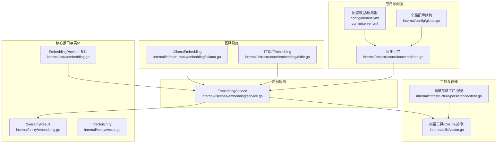
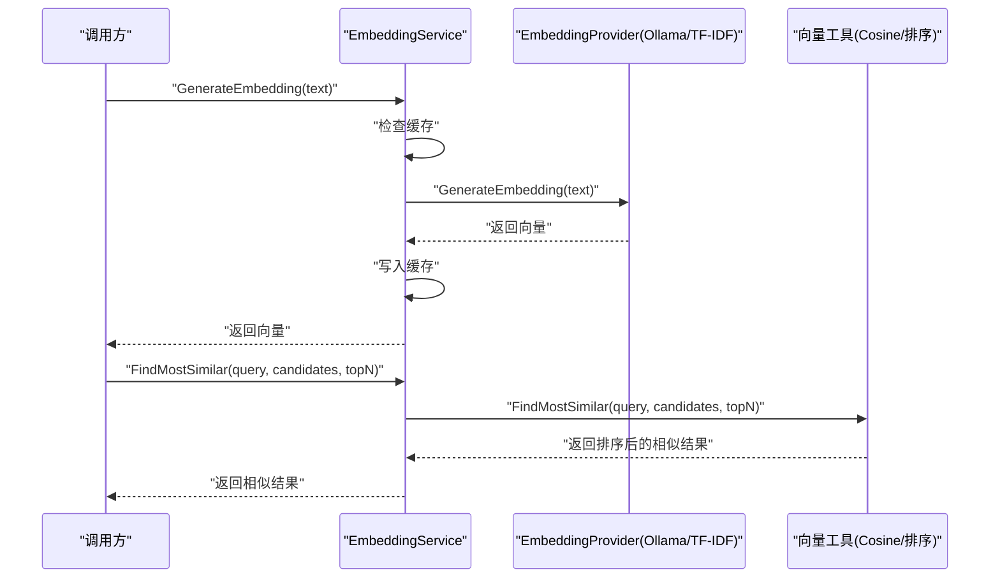
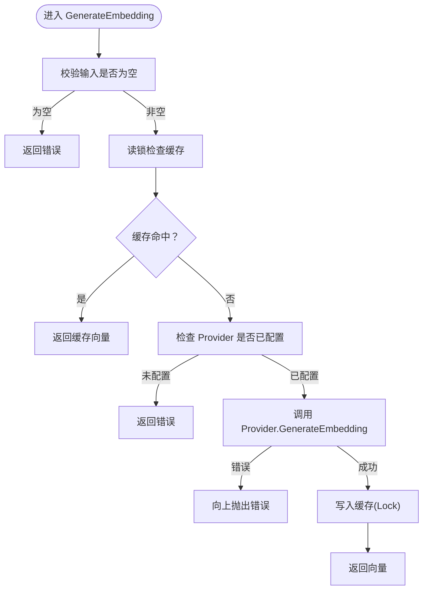
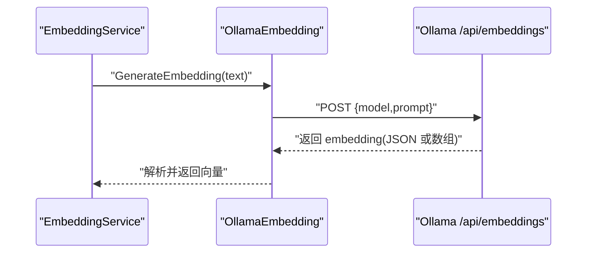
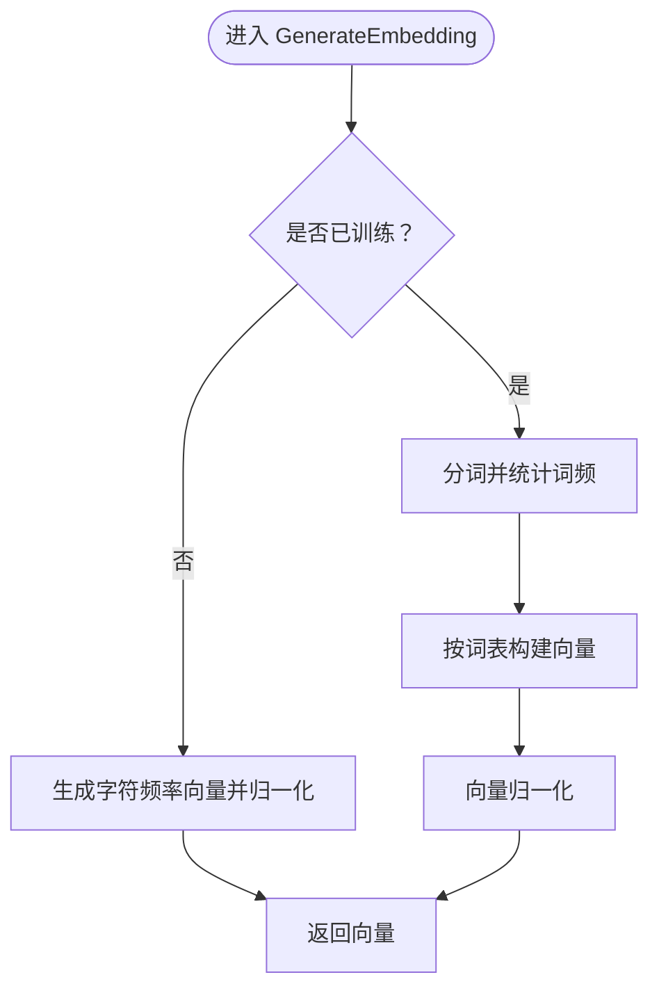
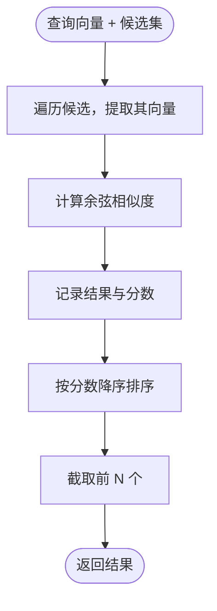
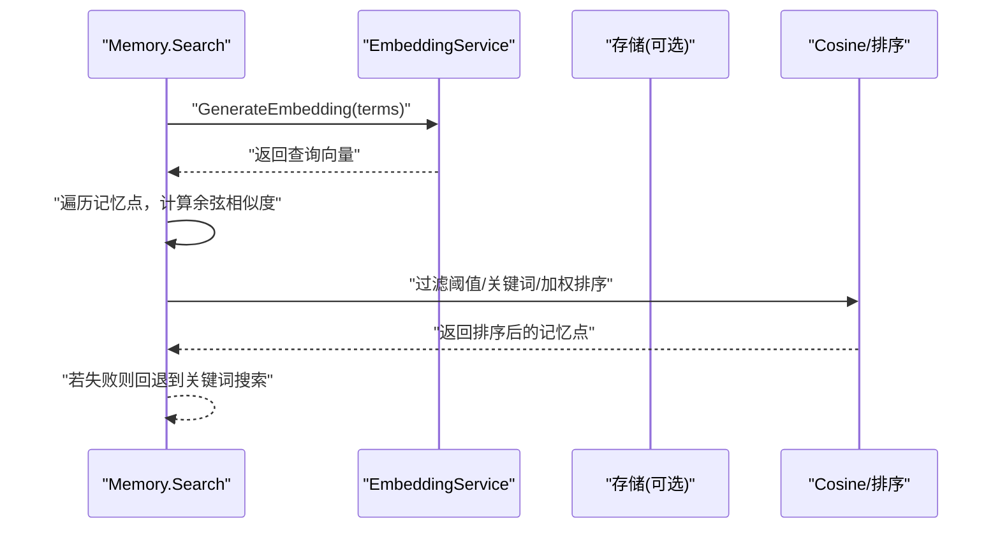
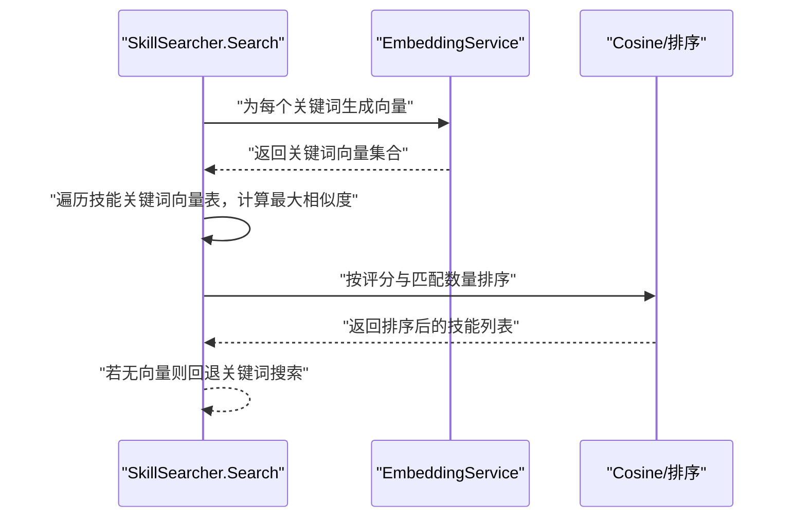
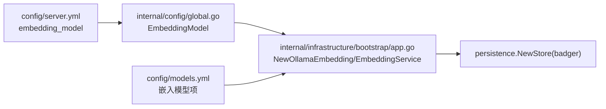
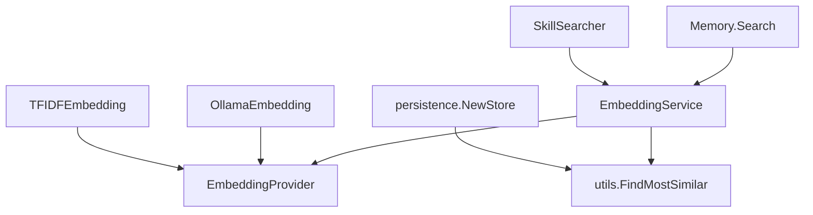

# 嵌入向量服务

<cite>
**本文引用的文件**
- [internal/core/embedding.go](file://internal/core/embedding.go)
- [internal/usecase/embedding/service.go](file://internal/usecase/embedding/service.go)
- [internal/infrastructure/embedding/ollama.go](file://internal/infrastructure/embedding/ollama.go)
- [internal/infrastructure/embedding/tfidfe.go](file://internal/infrastructure/embedding/tfidfe.go)
- [internal/entity/embedding.go](file://internal/entity/embedding.go)
- [internal/utils/vector.go](file://internal/utils/vector.go)
- [internal/usecase/memory/search.go](file://internal/usecase/memory/search.go)
- [internal/usecase/skills/searcher.go](file://internal/usecase/skills/searcher.go)
- [internal/infrastructure/persistence/store.go](file://internal/infrastructure/persistence/store.go)
- [internal/entity/vector.go](file://internal/entity/vector.go)
- [config/models.yml](file://config/models.yml)
- [config/server.yml](file://config/server.yml)
- [internal/config/global.go](file://internal/config/global.go)
- [internal/infrastructure/bootstrap/app.go](file://internal/infrastructure/bootstrap/app.go)
- [internal/adapters/channels/test_utils.go](file://internal/adapters/channels/test_utils.go)
- [cmd/main.go](file://cmd/main.go)
- [internal/tests/integration_test.go](file://internal/tests/integration_test.go)
</cite>

## 目录
1. [简介](#简介)
2. [项目结构](#项目结构)
3. [核心组件](#核心组件)
4. [架构总览](#架构总览)
5. [组件详解](#组件详解)
6. [依赖关系分析](#依赖关系分析)
7. [性能考量](#性能考量)
8. [故障排查指南](#故障排查指南)
9. [结论](#结论)
10. [附录](#附录)

## 简介
本文件面向 MindX 的嵌入向量服务，系统性阐述嵌入生成、向量计算与相似度匹配机制，对比 Ollama 与 TF-IDF 两种嵌入方式的实现原理与适用场景，并说明向量服务在记忆系统与技能搜索中的应用。文档还覆盖嵌入模型选择与优化策略、配置项与性能调优建议、使用示例与集成方法，以及扩展与定制参考。

## 项目结构
围绕嵌入向量服务的关键目录与文件如下：
- 接口与实体：core 层定义 EmbeddingProvider 接口，entity 层定义相似度结果与向量条目。
- 用例服务：usecase/embedding 提供统一的 EmbeddingService，封装缓存与批量生成。
- 基础设施：infrastructure/embedding 实现 Ollama 与 TF-IDF 两种嵌入提供者。
- 工具函数：utils 提供余弦相似度与“最相似”排序逻辑。
- 存储与持久化：infrastructure/persistence 提供向量存储工厂与相似度服务。
- 配置：config 提供模型与服务器配置，global 定义全局配置结构。
- 应用引导：infrastructure/bootstrap 在启动时装配嵌入服务与向量存储。
- 使用示例与测试：adapters/channels/test_utils 提供模拟嵌入服务；tests 展示集成测试流程。



图表来源
- [internal/core/embedding.go](file://internal/core/embedding.go#L1-L8)
- [internal/usecase/embedding/service.go](file://internal/usecase/embedding/service.go#L1-L97)
- [internal/infrastructure/embedding/ollama.go](file://internal/infrastructure/embedding/ollama.go#L1-L136)
- [internal/infrastructure/embedding/tfidfe.go](file://internal/infrastructure/embedding/tfidfe.go#L1-L144)
- [internal/utils/vector.go](file://internal/utils/vector.go#L1-L71)
- [internal/infrastructure/persistence/store.go](file://internal/infrastructure/persistence/store.go#L1-L57)
- [config/models.yml](file://config/models.yml#L1-L92)
- [config/server.yml](file://config/server.yml#L1-L21)
- [internal/config/global.go](file://internal/config/global.go#L1-L17)
- [internal/infrastructure/bootstrap/app.go](file://internal/infrastructure/bootstrap/app.go#L131-L163)

章节来源
- [internal/core/embedding.go](file://internal/core/embedding.go#L1-L8)
- [internal/usecase/embedding/service.go](file://internal/usecase/embedding/service.go#L1-L97)
- [internal/infrastructure/embedding/ollama.go](file://internal/infrastructure/embedding/ollama.go#L1-L136)
- [internal/infrastructure/embedding/tfidfe.go](file://internal/infrastructure/embedding/tfidfe.go#L1-L144)
- [internal/utils/vector.go](file://internal/utils/vector.go#L1-L71)
- [internal/infrastructure/persistence/store.go](file://internal/infrastructure/persistence/store.go#L1-L57)
- [config/models.yml](file://config/models.yml#L1-L92)
- [config/server.yml](file://config/server.yml#L1-L21)
- [internal/config/global.go](file://internal/config/global.go#L1-L17)
- [internal/infrastructure/bootstrap/app.go](file://internal/infrastructure/bootstrap/app.go#L131-L163)

## 核心组件
- EmbeddingProvider 接口：抽象嵌入生成能力，支持单条与批量生成。
- EmbeddingService：统一的嵌入服务，内置 LRU 缓存、并发安全、批量生成与相似度查询。
- OllamaEmbedding：对接本地或远程 Ollama 服务，生成嵌入向量。
- TFIDFEmbedding：本地化 TF-IDF 实现，无需外部服务，适合小规模或离线场景。
- SimilarityResult/VectorEntry：相似度结果与向量条目结构，支撑记忆与技能搜索。
- VectorService/工具函数：提供余弦相似度计算与“最相似”排序。

章节来源
- [internal/core/embedding.go](file://internal/core/embedding.go#L1-L8)
- [internal/usecase/embedding/service.go](file://internal/usecase/embedding/service.go#L1-L97)
- [internal/infrastructure/embedding/ollama.go](file://internal/infrastructure/embedding/ollama.go#L1-L136)
- [internal/infrastructure/embedding/tfidfe.go](file://internal/infrastructure/embedding/tfidfe.go#L1-L144)
- [internal/entity/embedding.go](file://internal/entity/embedding.go#L1-L9)
- [internal/entity/vector.go](file://internal/entity/vector.go#L1-L11)
- [internal/utils/vector.go](file://internal/utils/vector.go#L1-L71)
- [internal/infrastructure/persistence/store.go](file://internal/infrastructure/persistence/store.go#L45-L56)

## 架构总览
嵌入向量服务贯穿“生成—缓存—相似度匹配—应用集成”的完整链路。系统通过 EmbeddingService 统一调度底层 EmbeddingProvider（Ollama 或 TF-IDF），并在记忆与技能搜索中复用相似度计算工具。



图表来源
- [internal/usecase/embedding/service.go](file://internal/usecase/embedding/service.go#L31-L82)
- [internal/utils/vector.go](file://internal/utils/vector.go#L31-L70)
- [internal/infrastructure/embedding/ollama.go](file://internal/infrastructure/embedding/ollama.go#L57-L111)
- [internal/infrastructure/embedding/tfidfe.go](file://internal/infrastructure/embedding/tfidfe.go#L45-L83)

## 组件详解

### 接口与实体
- EmbeddingProvider：定义 GenerateEmbedding 与 GenerateBatchEmbeddings，确保不同提供者的一致行为。
- SimilarityResult：包含目标标识、相似度分数与元数据，用于记忆与技能搜索的候选结果。
- VectorEntry：向量条目，包含键、向量与元数据 JSON，便于持久化与检索。

```mermaid
classDiagram
class EmbeddingProvider {
+GenerateEmbedding(text) []float64
+GenerateBatchEmbeddings(texts) [][]float64
}
class SimilarityResult {
+string Target
+float64 Score
+map[string]interface{} Metadata
}
class VectorEntry {
+string Key
+[]float64 Vector
+json.RawMessage Metadata
}
```

图表来源
- [internal/core/embedding.go](file://internal/core/embedding.go#L3-L7)
- [internal/entity/embedding.go](file://internal/entity/embedding.go#L3-L8)
- [internal/entity/vector.go](file://internal/entity/vector.go#L5-L10)

章节来源
- [internal/core/embedding.go](file://internal/core/embedding.go#L1-L8)
- [internal/entity/embedding.go](file://internal/entity/embedding.go#L1-L9)
- [internal/entity/vector.go](file://internal/entity/vector.go#L1-L11)

### EmbeddingService（统一服务）
- 功能要点
  - 单条嵌入生成：带缓存命中、并发互斥、错误处理。
  - 批量嵌入：遍历调用单条生成，聚合结果。
  - 相似度匹配：委托 utils.FindMostSimilar，按余弦相似度排序。
  - 缓存管理：LRU 缓存大小固定，支持清空与查询长度。
- 并发与一致性：读写锁保护缓存，避免竞态。
- 错误处理：对空文本、未配置 Provider、子调用错误进行明确反馈。



图表来源
- [internal/usecase/embedding/service.go](file://internal/usecase/embedding/service.go#L31-L59)

章节来源
- [internal/usecase/embedding/service.go](file://internal/usecase/embedding/service.go#L1-L97)

### Ollama 嵌入提供者
- 设计要点
  - 请求体包含模型名与提示文本，调用 /api/embeddings。
  - 支持两种响应格式：标准 {"embedding": []} 与直接数组 []，自动兼容。
  - 默认超时与客户端配置，移除 URL 中的 /v1 后缀以适配嵌入 API。
  - 批量生成：逐条调用，单条失败不影响整体。
- 适用场景
  - 需要高质量语义向量的场景，如技能搜索、记忆检索。
  - 本地或远程 Ollama 服务均可，便于扩展与迁移。



图表来源
- [internal/infrastructure/embedding/ollama.go](file://internal/infrastructure/embedding/ollama.go#L57-L111)

章节来源
- [internal/infrastructure/embedding/ollama.go](file://internal/infrastructure/embedding/ollama.go#L1-L136)

### TF-IDF 嵌入提供者
- 设计要点
  - 本地化实现，无需外部服务，适合离线或小规模场景。
  - 训练阶段构建词表，未训练时回退为字符频率向量并归一化。
  - 分词策略：按空白与常见标点分割，转小写。
  - 批量生成：逐条生成，聚合返回。
- 适用场景
  - 资源受限或隐私敏感的本地部署。
  - 对实时性要求不高、语义精度要求相对较低的任务。



图表来源
- [internal/infrastructure/embedding/tfidfe.go](file://internal/infrastructure/embedding/tfidfe.go#L45-L131)

章节来源
- [internal/infrastructure/embedding/tfidfe.go](file://internal/infrastructure/embedding/tfidfe.go#L1-L144)

### 相似度计算与匹配
- 余弦相似度：计算两个向量的夹角余弦值，范围 [-1,1]，越接近 1 表示越相似。
- “最相似”排序：对候选集按相似度降序排列，支持 topN 返回。
- 应用入口：EmbeddingService.FindMostSimilar 与 VectorService.FindMostSimilar 均委托 utils.FindMostSimilar。



图表来源
- [internal/utils/vector.go](file://internal/utils/vector.go#L31-L70)

章节来源
- [internal/utils/vector.go](file://internal/utils/vector.go#L1-L71)
- [internal/infrastructure/persistence/store.go](file://internal/infrastructure/persistence/store.go#L53-L56)

### 记忆系统中的应用
- 搜索流程
  - 若嵌入服务可用：将查询词生成向量，与记忆向量计算余弦相似度，过滤阈值后二次关键词过滤与加权排序。
  - 若不可用：回退到纯关键词匹配与排序。
- 关键阈值与权重：相似度阈值与排序权重在用例中体现，保证召回与排序质量。



图表来源
- [internal/usecase/memory/search.go](file://internal/usecase/memory/search.go#L15-L74)

章节来源
- [internal/usecase/memory/search.go](file://internal/usecase/memory/search.go#L1-L160)

### 技能搜索中的应用
- 向量搜索优先：当存在技能关键词向量表且嵌入服务可用时，对每个关键词生成向量，计算与技能关键词向量的最大相似度，综合评分与匹配数量排序。
- 关键词回退：若向量不可用或无匹配，回退到关键词正反向匹配与加权排序。
- 性能与阈值：对低阈值场景返回前 N 个候选，高阈值场景返回最佳匹配。



图表来源
- [internal/usecase/skills/searcher.go](file://internal/usecase/skills/searcher.go#L72-L188)

章节来源
- [internal/usecase/skills/searcher.go](file://internal/usecase/skills/searcher.go#L1-L307)

### 配置与启动集成
- 模型配置：models.yml 定义多种模型（含嵌入模型 qllama/bge-small-zh-v1.5:latest）。
- 服务器配置：server.yml 指定 embedding_model 字段，作为默认嵌入模型。
- 全局配置：global.go 定义 EmbeddingModel 字段，供引导程序读取。
- 应用引导：bootstrap/app.go 依据配置创建 Ollama 嵌入提供者与 EmbeddingService，并初始化 Badger 向量存储。



图表来源
- [config/server.yml](file://config/server.yml#L18-L18)
- [internal/config/global.go](file://internal/config/global.go#L12-L12)
- [internal/infrastructure/bootstrap/app.go](file://internal/infrastructure/bootstrap/app.go#L131-L146)
- [config/models.yml](file://config/models.yml#L86-L92)

章节来源
- [config/models.yml](file://config/models.yml#L1-L92)
- [config/server.yml](file://config/server.yml#L1-L21)
- [internal/config/global.go](file://internal/config/global.go#L1-L17)
- [internal/infrastructure/bootstrap/app.go](file://internal/infrastructure/bootstrap/app.go#L131-L163)

## 依赖关系分析
- 松耦合接口：EmbeddingProvider 抽象了具体实现，EmbeddingService 仅依赖接口，便于替换与扩展。
- 工具复用：utils.FindMostSimilar 被记忆与技能搜索广泛使用，保持相似度计算一致性。
- 存储解耦：persistence.NewStore 支持 badger 与 memory 两种存储类型，便于测试与生产切换。
- 引导装配：bootstrap 负责读取配置、创建提供者与服务，形成清晰的启动流程。



图表来源
- [internal/usecase/embedding/service.go](file://internal/usecase/embedding/service.go#L1-L97)
- [internal/infrastructure/embedding/ollama.go](file://internal/infrastructure/embedding/ollama.go#L1-L136)
- [internal/infrastructure/embedding/tfidfe.go](file://internal/infrastructure/embedding/tfidfe.go#L1-L144)
- [internal/utils/vector.go](file://internal/utils/vector.go#L31-L70)
- [internal/usecase/memory/search.go](file://internal/usecase/memory/search.go#L15-L74)
- [internal/usecase/skills/searcher.go](file://internal/usecase/skills/searcher.go#L72-L188)
- [internal/infrastructure/persistence/store.go](file://internal/infrastructure/persistence/store.go#L25-L43)

章节来源
- [internal/usecase/embedding/service.go](file://internal/usecase/embedding/service.go#L1-L97)
- [internal/utils/vector.go](file://internal/utils/vector.go#L1-L71)
- [internal/infrastructure/persistence/store.go](file://internal/infrastructure/persistence/store.go#L1-L57)

## 性能考量
- 缓存策略
  - EmbeddingService 使用 LRU 缓存，命中后直接返回，显著降低重复嵌入开销。
  - 建议根据业务规模调整缓存容量，注意内存占用与命中率平衡。
- 并发与锁
  - 读多写少场景下，读写锁提升并发性能；批量生成时建议合并请求以减少锁竞争。
- 相似度计算
  - 余弦相似度计算为 O(n) 线性扫描，候选集规模较大时建议引入索引或近似最近邻（ANN）加速。
- I/O 与网络
  - Ollama 嵌入依赖网络请求，建议设置合理超时与重试；批量生成时考虑并发限制与队列控制。
- 存储与索引
  - Badger 存储适合中小规模向量索引；大规模场景可结合外部向量数据库或 ANN 索引库。

## 故障排查指南
- 常见错误与定位
  - 输入为空：GenerateEmbedding 对空文本返回错误，检查上游调用参数。
  - Provider 未配置：未注入 EmbeddingProvider 时返回错误，确认引导流程与配置。
  - Ollama 请求失败：检查 Ollama 地址、模型是否存在、网络连通性与响应格式。
  - TF-IDF 未训练：未训练时回退字符频率向量，若语义效果差，建议先训练词表。
- 日志与可观测性
  - 记忆与技能搜索均记录调试与错误日志，便于定位向量化失败与回退路径。
- 集成测试参考
  - tests/integration_test 展示系统启动与索引流程，可用于验证嵌入服务与存储初始化是否正常。

章节来源
- [internal/usecase/embedding/service.go](file://internal/usecase/embedding/service.go#L31-L59)
- [internal/infrastructure/embedding/ollama.go](file://internal/infrastructure/embedding/ollama.go#L82-L111)
- [internal/infrastructure/embedding/tfidfe.go](file://internal/infrastructure/embedding/tfidfe.go#L47-L50)
- [internal/tests/integration_test.go](file://internal/tests/integration_test.go#L68-L88)

## 结论
MindX 的嵌入向量服务以接口抽象与统一服务为核心，结合 Ollama 与 TF-IDF 两种嵌入方式，满足不同场景下的语义向量需求。通过缓存、并发控制与相似度工具，服务在记忆检索与技能搜索中发挥关键作用。配合完善的配置与引导流程，系统可在本地与云端环境中灵活部署与扩展。

## 附录

### 嵌入模型选择与优化策略
- 模型选择
  - 高质量语义：优先选择经训练的嵌入模型（如 models.yml 中的 qllama/bge-small-zh-v1.5:latest）。
  - 本地优先：Ollama 本地部署，降低延迟与隐私风险。
- 优化建议
  - 预热：启动时批量生成常用短语向量，减少首查询延迟。
  - 缓存：根据业务热点调整缓存容量与淘汰策略。
  - 索引：大规模候选集引入 ANN 索引，提升相似度匹配吞吐。

章节来源
- [config/models.yml](file://config/models.yml#L86-L92)
- [config/server.yml](file://config/server.yml#L18-L18)

### 配置选项与性能调优
- 配置项
  - embedding_model：指定嵌入模型名称。
  - vector_store.type：向量存储类型（badger/memory）。
  - token_budget.*：令牌预算相关配置，间接影响上下文与向量长度。
- 调优建议
  - 向量维度：根据嵌入模型输出维度选择合适的相似度阈值与排序策略。
  - 批量大小：控制批量嵌入大小，避免 Ollama 服务压力过大。
  - 超时与重试：为 Ollama 请求设置合理超时与重试次数。

章节来源
- [config/server.yml](file://config/server.yml#L6-L20)
- [internal/config/global.go](file://internal/config/global.go#L8-L16)

### 使用示例与集成方法
- 示例一：使用 EmbeddingService 生成向量并查找最相似
  - 步骤
    - 创建 EmbeddingProvider（Ollama/TF-IDF）。
    - 构造 EmbeddingService。
    - 调用 GenerateEmbedding 获取查询向量。
    - 准备候选集（含元数据中的向量字段），调用 FindMostSimilar 获取排序结果。
- 示例二：在记忆系统中检索
  - 步骤
    - 调用 Memory.Search(terms)，内部自动调用 EmbeddingService 生成向量并计算相似度。
    - 若失败则回退关键词搜索。
- 示例三：在技能搜索中检索
  - 步骤
    - 调用 SkillSearcher.Search(keywords)，内部对关键词生成向量并计算与技能关键词向量的最大相似度。
    - 若无向量则回退关键词匹配。
- 示例四：单元测试与模拟
  - 使用 adapters/channels/test_utils 提供的 mockEmbeddingService 快速搭建测试环境。

章节来源
- [internal/usecase/embedding/service.go](file://internal/usecase/embedding/service.go#L31-L82)
- [internal/usecase/memory/search.go](file://internal/usecase/memory/search.go#L15-L74)
- [internal/usecase/skills/searcher.go](file://internal/usecase/skills/searcher.go#L72-L188)
- [internal/adapters/channels/test_utils.go](file://internal/adapters/channels/test_utils.go#L12-L52)

### 扩展与定制参考
- 新增嵌入提供者
  - 实现 EmbeddingProvider 接口，支持单条与批量生成。
  - 在引导流程中注入新提供者，或通过配置切换。
- 自定义相似度
  - 替换 utils.FindMostSimilar 的实现，或在上层用例中自定义排序规则。
- 存储扩展
  - 在 persistence.NewStore 中新增存储类型，适配不同后端（如外部向量数据库）。
- 启动流程
  - 在 bootstrap/app.go 中扩展初始化逻辑，加载新提供者与存储。

章节来源
- [internal/core/embedding.go](file://internal/core/embedding.go#L3-L7)
- [internal/infrastructure/persistence/store.go](file://internal/infrastructure/persistence/store.go#L25-L43)
- [internal/infrastructure/bootstrap/app.go](file://internal/infrastructure/bootstrap/app.go#L131-L146)