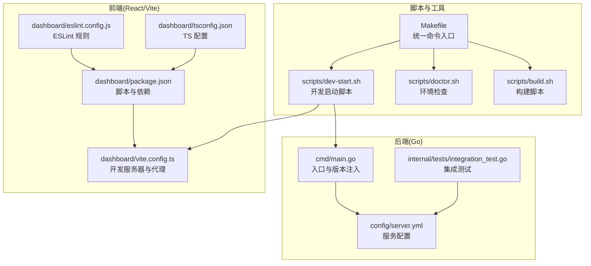
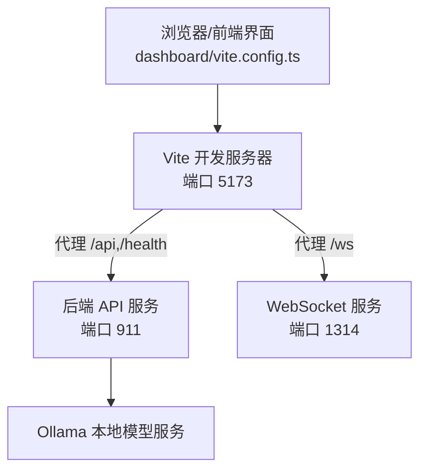
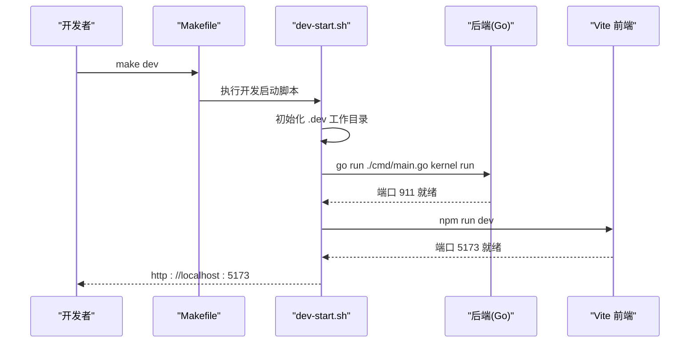
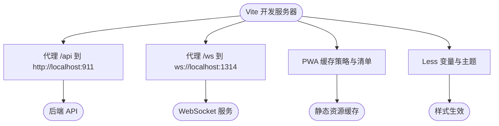
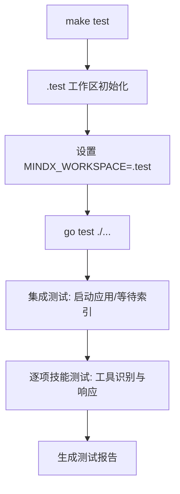
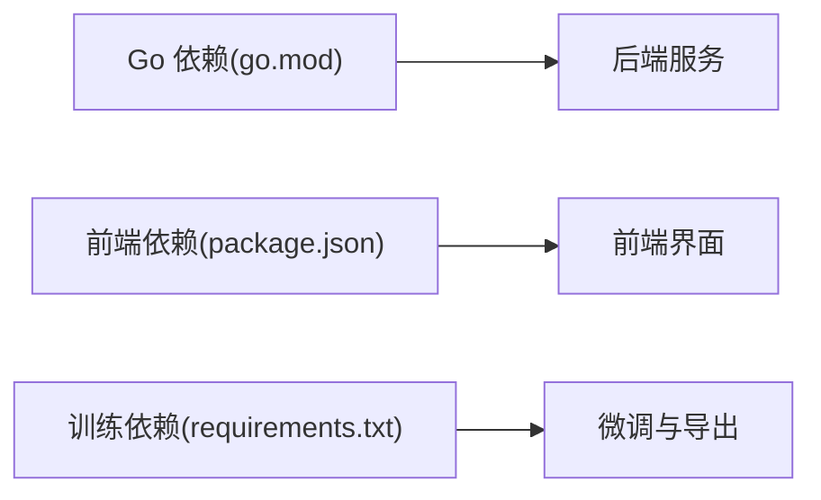

# 开发环境

<cite>
**本文引用的文件**
- [README.md](file://README.md)
- [go.mod](file://go.mod)
- [Makefile](file://Makefile)
- [cmd/main.go](file://cmd/main.go)
- [scripts/dev-start.sh](file://scripts/dev-start.sh)
- [scripts/doctor.sh](file://scripts/doctor.sh)
- [scripts/build.sh](file://scripts/build.sh)
- [dashboard/package.json](file://dashboard/package.json)
- [dashboard/vite.config.ts](file://dashboard/vite.config.ts)
- [dashboard/eslint.config.js](file://dashboard/eslint.config.js)
- [dashboard/tsconfig.json](file://dashboard/tsconfig.json)
- [config/server.yml](file://config/server.yml)
- [internal/tests/integration_test.go](file://internal/tests/integration_test.go)
- [.golangci.yml](file://.golangci.yml)
- [training/requirements.txt](file://training/requirements.txt)
</cite>

## 目录
1. [简介](#简介)
2. [项目结构](#项目结构)
3. [核心组件](#核心组件)
4. [架构总览](#架构总览)
5. [详细组件分析](#详细组件分析)
6. [依赖关系分析](#依赖关系分析)
7. [性能考虑](#性能考虑)
8. [故障排除指南](#故障排除指南)
9. [结论](#结论)
10. [附录](#附录)

## 简介
本指南面向 MindX 的开发者，提供从硬件与软件要求、工具链配置、开发服务器启动与配置、测试环境搭建与流程，到调试技巧与常见问题排查的全流程说明。MindX 采用 Go 后端与 React/Vite 前端的混合架构，配合 Ollama 提供本地大模型推理能力，并通过 Makefile 与脚本实现统一的构建、安装与开发启动流程。

## 项目结构
- 后端（Go）位于 cmd/main.go，CLI 子命令由 internal/adapters/cli 分发；核心业务逻辑分布在 internal/ 目录下。
- 前端（React/Vite）位于 dashboard/，通过 Vite 开发服务器提供热重载，代理后端 API 与 WebSocket。
- 配置文件位于 config/，如 server.yml 定义了服务主机、端口、向量存储类型、Token 预算与模型选择等。
- 开发与测试脚本位于 scripts/，包括开发启动、环境检查、打包与构建脚本。
- 测试位于 internal/tests/ 与 dashboard/src/components/**.test.tsx，覆盖集成测试与前端单元测试。
- 训练相关依赖位于 training/requirements.txt，用于微调与导出。

**图表来源**
- [cmd/main.go](file://cmd/main.go#L1-L21)
- [config/server.yml](file://config/server.yml#L1-L21)
- [dashboard/package.json](file://dashboard/package.json#L1-L58)
- [dashboard/vite.config.ts](file://dashboard/vite.config.ts#L1-L106)
- [dashboard/eslint.config.js](file://dashboard/eslint.config.js#L1-L29)
- [dashboard/tsconfig.json](file://dashboard/tsconfig.json#L1-L8)
- [Makefile](file://Makefile#L1-L299)
- [scripts/dev-start.sh](file://scripts/dev-start.sh#L1-L285)
- [scripts/doctor.sh](file://scripts/doctor.sh#L1-L328)
- [scripts/build.sh](file://scripts/build.sh#L1-L145)

**章节来源**
- [README.md](file://README.md#L64-L143)
- [Makefile](file://Makefile#L1-L299)

## 核心组件
- 后端入口与版本注入：cmd/main.go 负责初始化构建信息并执行 CLI。
- 服务配置：config/server.yml 定义主机、端口、向量存储类型、Token 预算、模型选择等。
- 前端开发与代理：dashboard/vite.config.ts 提供开发服务器、代理后端 API 与 WebSocket、PWA 配置与 CSS 变量。
- 开发启动：scripts/dev-start.sh 自动初始化开发工作目录、设置环境变量、启动后端与前端并处理端口占用与清理。
- 环境检查：scripts/doctor.sh 检查 Go、Node.js、Ollama、模型、安装路径、工作目录权限与端口占用。
- 构建与打包：scripts/build.sh 与 Makefile 的 build 目标负责前端构建与多平台二进制打包。
- 测试：internal/tests/integration_test.go 提供技能集成测试；dashboard 使用 Vitest 进行单元测试。

**章节来源**
- [cmd/main.go](file://cmd/main.go#L1-L21)
- [config/server.yml](file://config/server.yml#L1-L21)
- [dashboard/vite.config.ts](file://dashboard/vite.config.ts#L1-L106)
- [scripts/dev-start.sh](file://scripts/dev-start.sh#L1-L285)
- [scripts/doctor.sh](file://scripts/doctor.sh#L1-L328)
- [scripts/build.sh](file://scripts/build.sh#L1-L145)
- [Makefile](file://Makefile#L26-L36)
- [internal/tests/integration_test.go](file://internal/tests/integration_test.go#L1-L259)

## 架构总览
MindX 的开发环境由“后端服务 + 前端开发服务器 + 本地模型服务”组成。开发启动脚本统一管理后端与前端的生命周期，Vite 代理将前端请求转发至后端 API 与 WebSocket，确保前后端联调顺畅。

**图表来源**
- [scripts/dev-start.sh](file://scripts/dev-start.sh#L112-L143)
- [dashboard/vite.config.ts](file://dashboard/vite.config.ts#L69-L88)
- [config/server.yml](file://config/server.yml#L3-L5)

**章节来源**
- [scripts/dev-start.sh](file://scripts/dev-start.sh#L70-L143)
- [dashboard/vite.config.ts](file://dashboard/vite.config.ts#L69-L88)
- [config/server.yml](file://config/server.yml#L3-L5)

## 详细组件分析

### 后端服务启动与配置
- 启动方式
  - 开发模式：make dev 或直接执行 scripts/dev-start.sh，自动设置开发工作目录与环境变量，启动后端与前端。
  - 运行模式：make run-dashboard、make run-tui、make run-kernel 等。
- 端口与配置
  - HTTP 服务默认监听 911，WebSocket 监听 1314。
  - 向量存储类型可在 server.yml 中配置。
- 环境变量
  - MINDX_WORKSPACE 指向开发工作目录，用于持久化配置、数据与日志。
  - DEV_MODE 用于开发模式开关。

**图表来源**
- [Makefile](file://Makefile#L47-L51)
- [scripts/dev-start.sh](file://scripts/dev-start.sh#L70-L143)
- [cmd/main.go](file://cmd/main.go#L1-L21)

**章节来源**
- [Makefile](file://Makefile#L47-L51)
- [scripts/dev-start.sh](file://scripts/dev-start.sh#L47-L109)
- [config/server.yml](file://config/server.yml#L3-L5)

### 前端开发服务器与代理
- 开发服务器
  - Vite 在 5173 端口提供热重载与开发体验。
- 代理规则
  - /api → http://localhost:911
  - /health → http://localhost:911
  - /ws → ws://localhost:1314
- PWA 与样式
  - PWA 自动更新、图标与主题色配置；Less 变量覆盖以适配深色主题。

**图表来源**
- [dashboard/vite.config.ts](file://dashboard/vite.config.ts#L69-L88)
- [dashboard/vite.config.ts](file://dashboard/vite.config.ts#L48-L62)
- [dashboard/vite.config.ts](file://dashboard/vite.config.ts#L89-L104)

**章节来源**
- [dashboard/vite.config.ts](file://dashboard/vite.config.ts#L69-L106)

### 数据与配置
- 工作目录
  - 开发工作目录 .dev 下包含 config、logs、data/{memory,sessions,vectors,training} 等子目录。
- 配置文件
  - server.yml 定义服务、向量存储、Token 预算与模型选择。
- 日志
  - 集成测试中使用系统日志配置输出到 /tmp/integration_test.log。

**章节来源**
- [scripts/dev-start.sh](file://scripts/dev-start.sh#L26-L45)
- [config/server.yml](file://config/server.yml#L1-L21)
- [internal/tests/integration_test.go](file://internal/tests/integration_test.go#L48-L61)

### 测试环境与流程
- 单元测试（前端）
  - 使用 Vitest，测试入口与环境在 dashboard/vite.config.ts 中配置。
- 集成测试（后端）
  - internal/tests/integration_test.go 启动应用、等待索引完成，对多个技能进行测试，断言工具识别与响应有效性。
- 运行方式
  - make test 会在 .test 工作区运行所有 Go 测试。

**图表来源**
- [Makefile](file://Makefile#L63-L70)
- [internal/tests/integration_test.go](file://internal/tests/integration_test.go#L35-L89)

**章节来源**
- [Makefile](file://Makefile#L63-L70)
- [internal/tests/integration_test.go](file://internal/tests/integration_test.go#L1-L259)

### 开发工具链配置
- Go 版本
  - go.mod 指定 Go 版本，建议使用与 go.mod 一致或更高版本。
- Node.js 与前端依赖
  - dashboard/package.json 定义脚本与依赖；首次运行会自动安装 node_modules。
- 代码格式化与静态检查
  - make fmt 与 make lint 分别调用 go fmt、go vet 与前端 ESLint。
  - .golangci.yml 启用 govet、errcheck、staticcheck、unused 等 linter。

**章节来源**
- [go.mod](file://go.mod#L3-L3)
- [dashboard/package.json](file://dashboard/package.json#L6-L12)
- [Makefile](file://Makefile#L224-L236)
- [.golangci.yml](file://.golangci.yml#L1-L7)

### 构建与打包
- 构建流程
  - scripts/build.sh 先构建前端，再为多平台编译后端二进制，复制静态资源与安装脚本。
  - Makefile 的 build 目标委托给 scripts/build.sh。
- 平台与产物
  - 生成 dist/mindx-<version>-<platform>-<arch> 目录与 bin/mindx 本地二进制。
- 安装与卸载
  - Makefile 的 install/uninstall 目标分别调用安装/卸载脚本。

**章节来源**
- [scripts/build.sh](file://scripts/build.sh#L39-L126)
- [Makefile](file://Makefile#L26-L36)
- [Makefile](file://Makefile#L38-L42)

## 依赖关系分析
- 后端依赖
  - Gin、WebSocket、Badger、SQLite、OpenAI SDK、Prometheus、i18n、Viper、Cobra 等。
- 前端依赖
  - React、TailwindCSS、Mermaid、TDesign、Vite 插件与 PWA。
- 训练依赖
  - PyTorch、Transformers、PEFT、Accelerate、Datasets、Trl、SentencePiece、GGUF 导出等。

**图表来源**
- [go.mod](file://go.mod#L5-L29)
- [dashboard/package.json](file://dashboard/package.json#L13-L56)
- [training/requirements.txt](file://training/requirements.txt#L1-L14)

**章节来源**
- [go.mod](file://go.mod#L1-L113)
- [dashboard/package.json](file://dashboard/package.json#L1-L58)
- [training/requirements.txt](file://training/requirements.txt#L1-L14)

## 性能考虑
- 向量存储与模型
  - server.yml 中的 vector_store 类型与模型选择直接影响性能与资源占用。
- 端口与代理
  - Vite 代理减少跨域与网络往返，提高开发联调效率。
- 构建优化
  - 多平台交叉编译与静态资源内嵌，便于分发与运行。

[本节为通用指导，无需特定文件引用]

## 故障排除指南
- 环境检查
  - 使用 make doctor 或 scripts/doctor.sh 检查 Go、Node.js、Ollama、模型、安装路径、工作目录权限与端口占用。
- 常见问题
  - Ollama 未安装或未启动：根据 doctor 输出安装并启动 Ollama。
  - 端口被占用：修改 config/server.yml 中的 host/port/ws_port，或释放端口。
  - 缺少模型：按 doctor 输出执行 ollama pull 拉取所需模型。
  - 权限不足：确保工作目录可写。
- 开发启动失败
  - 检查 .dev 目录初始化与权限；确认后端 911 与前端 5173 端口可用；必要时清理 Badger 锁文件并重启。

**章节来源**
- [scripts/doctor.sh](file://scripts/doctor.sh#L58-L92)
- [scripts/doctor.sh](file://scripts/doctor.sh#L233-L243)
- [scripts/dev-start.sh](file://scripts/dev-start.sh#L74-L78)
- [config/server.yml](file://config/server.yml#L3-L5)

## 结论
通过 Makefile 与脚本的统一管理，MindX 的开发环境实现了“一键启动、一键构建、一键测试”。结合 doctor 脚本的环境检查与 Vite 的代理机制，开发者可以高效地进行前后端联调与功能迭代。建议在开发前先执行 doctor 检查，确保 Go、Node.js、Ollama 与模型均已就绪，并遵循 Makefile 提供的标准命令进行构建与测试。

[本节为总结，无需特定文件引用]

## 附录

### 硬件与软件要求
- 操作系统：macOS / Linux / Windows
- 内存：建议 8GB 以上
- 硬盘空间：建议 20GB 以上
- 网络：首次安装需下载模型，后续可离线使用
- Go 版本：以 go.mod 指定为准
- Node.js：用于构建前端（可选，开发构建时需要）

**章节来源**
- [README.md](file://README.md#L66-L71)
- [go.mod](file://go.mod#L3-L3)
- [scripts/doctor.sh](file://scripts/doctor.sh#L47-L56)

### 开发工具链与 IDE 设置
- Go
  - 使用 go fmt 与 go vet；启用 .golangci.yml 中的 linters。
- 前端
  - 使用 ESLint 与 TypeScript；Vitest 进行单元测试。
- 代码格式化
  - make fmt 与 make lint 分别格式化与检查 Go 与前端代码。

**章节来源**
- [.golangci.yml](file://.golangci.yml#L1-L7)
- [dashboard/eslint.config.js](file://dashboard/eslint.config.js#L1-L29)
- [Makefile](file://Makefile#L224-L236)

### 开发服务器启动与配置
- 开发启动
  - make dev 或 scripts/dev-start.sh；自动初始化 .dev 工作目录，设置 MINDX_WORKSPACE 与 DEV_MODE。
- 后端
  - go run ./cmd/main.go kernel run；监听 911，WebSocket 监听 1314。
- 前端
  - npm run dev；Vite 代理 /api 与 /ws 至后端。
- 配置
  - 修改 config/server.yml 中的 host/port/ws_port 与模型选择。

**章节来源**
- [Makefile](file://Makefile#L47-L51)
- [scripts/dev-start.sh](file://scripts/dev-start.sh#L70-L143)
- [dashboard/vite.config.ts](file://dashboard/vite.config.ts#L69-L88)
- [config/server.yml](file://config/server.yml#L3-L5)

### 测试环境搭建与流程
- 单元测试（前端）
  - npm run test；使用 Vitest 与 jsdom。
- 集成测试（后端）
  - make test；在 .test 工作区运行，等待技能索引完成，逐项测试技能工具识别与响应。
- 端到端测试
  - 通过浏览器访问 http://localhost:5173 进行手动联调与验证。

**章节来源**
- [dashboard/package.json](file://dashboard/package.json#L10-L10)
- [Makefile](file://Makefile#L63-L70)
- [internal/tests/integration_test.go](file://internal/tests/integration_test.go#L128-L215)

### 调试技巧与常用命令
- 查看日志
  - 集成测试日志输出到 /tmp/integration_test.log；开发日志可通过配置调整。
- 性能分析
  - 后端使用 Prometheus 指标；前端关注 Vite 热重载与代理延迟。
- 问题排查
  - make doctor 检查环境；scripts/dev-start.sh 清理 Badger 锁文件；确认端口占用与权限。

**章节来源**
- [internal/tests/integration_test.go](file://internal/tests/integration_test.go#L48-L61)
- [scripts/doctor.sh](file://scripts/doctor.sh#L1-L328)
- [scripts/dev-start.sh](file://scripts/dev-start.sh#L74-L78)