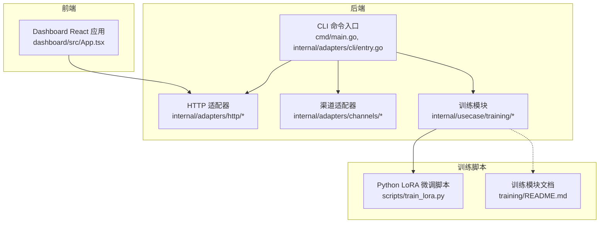
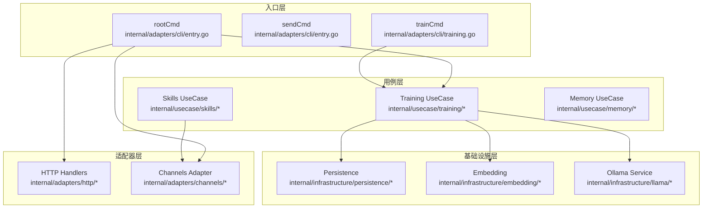
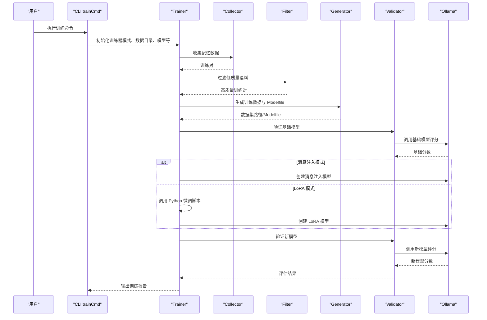
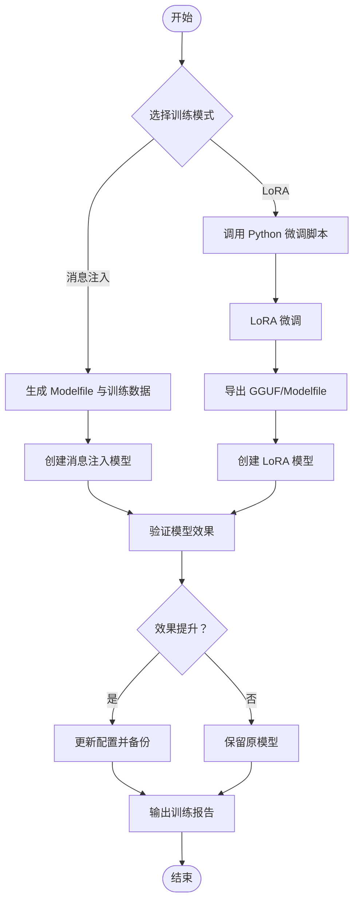
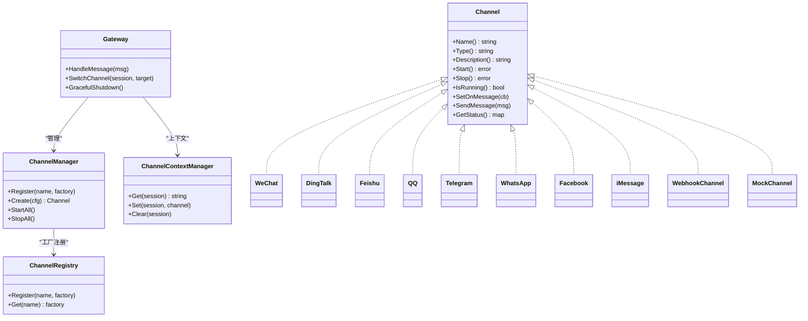
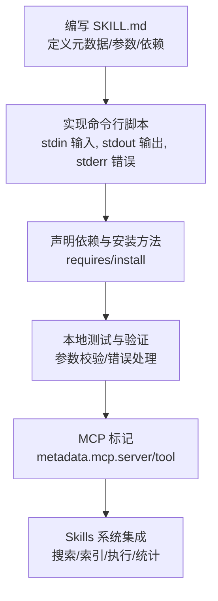
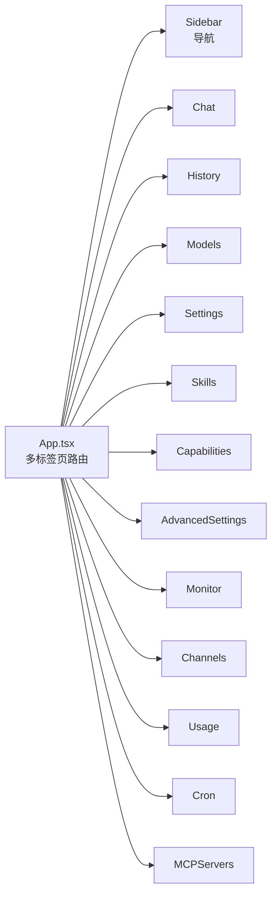
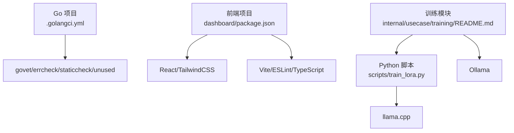

# 开发者指南

<cite>
**本文档引用的文件**
- [CONTRIBUTING.md](file://CONTRIBUTING.md)
- [README.md](file://README.md)
- [cmd/main.go](file://cmd/main.go)
- [internal/adapters/cli/entry.go](file://internal/adapters/cli/entry.go)
- [internal/adapters/cli/training.go](file://internal/adapters/cli/training.go)
- [internal/adapters/channels/README.md](file://internal/adapters/channels/README.md)
- [internal/usecase/training/README.md](file://internal/usecase/training/README.md)
- [scripts/train_lora.py](file://scripts/train_lora.py)
- [training/README.md](file://training/README.md)
- [internal/usecase/skills/SKILL_DEVELOPMENT.md](file://internal/usecase/skills/SKILL_DEVELOPMENT.md)
- [dashboard/src/App.tsx](file://dashboard/src/App.tsx)
- [Makefile](file://Makefile)
- [.golangci.yml](file://.golangci.yml)
- [dashboard/package.json](file://dashboard/package.json)
- [scripts/dev-start.sh](file://scripts/dev-start.sh)
- [INSTALL.md](file://INSTALL.md)
</cite>

## 目录
1. [简介](#简介)
2. [项目结构](#项目结构)
3. [核心组件](#核心组件)
4. [架构总览](#架构总览)
5. [详细组件分析](#详细组件分析)
6. [依赖分析](#依赖分析)
7. [性能考量](#性能考量)
8. [故障排除指南](#故障排除指南)
9. [结论](#结论)
10. [附录](#附录)

## 简介
本指南面向 MindX 开发者，提供从开发环境搭建、代码规范、贡献流程、扩展开发（技能与渠道）、训练系统实现（LoRA 微调与消息注入）、调试工具使用到最佳实践与常见问题的完整说明。文档同时涵盖社区参与与贡献者计划，帮助新加入的开发者快速上手。

## 项目结构
MindX 采用前后端分离与模块化架构：
- 后端：Go 语言实现，CLI 命令入口统一管理，适配器层负责 HTTP、CLI、渠道接入等。
- 前端：React/Vite Dashboard，提供可视化配置与监控界面。
- 训练系统：Go 训练模块与 Python LoRA 微调脚本协作，支持消息注入与 LoRA 微调两种模式。
- 扩展：技能生态兼容 OpenClaw，支持 MCP 协议；渠道适配器支持多平台即时通讯。

**图表来源**
- [cmd/main.go](file://cmd/main.go#L1-L21)
- [internal/adapters/cli/entry.go](file://internal/adapters/cli/entry.go#L1-L123)
- [dashboard/src/App.tsx](file://dashboard/src/App.tsx#L1-L66)
- [internal/adapters/channels/README.md](file://internal/adapters/channels/README.md#L1-L160)
- [internal/usecase/training/README.md](file://internal/usecase/training/README.md#L1-L401)
- [scripts/train_lora.py](file://scripts/train_lora.py#L1-L263)
- [training/README.md](file://training/README.md#L1-L173)

**章节来源**
- [Makefile](file://Makefile#L1-L299)
- [INSTALL.md](file://INSTALL.md#L1-L491)

## 核心组件
- CLI 命令体系：统一入口，支持 dashboard、tui、kernel、model、skill、train、send 等子命令。
- HTTP 适配器：提供 REST API 与中间件（metrics、request_id）。
- 渠道适配器：多渠道接入（微信、钉钉、飞书、QQ、Telegram、WhatsApp、Facebook、iMessage、Webhook、Mock），统一抽象与生命周期管理。
- 训练系统：消息注入与 LoRA 微调双模式，数据收集、过滤、生成、验证、配置更新闭环。
- 技能系统：OpenClaw 生态兼容，支持任意语言 CLI，MCP 协议扩展。
- 前端 Dashboard：多标签页界面，支持聊天、历史、模型、设置、技能、能力、监控、渠道、用量、定时任务、MCP 服务器等。

**章节来源**
- [internal/adapters/cli/entry.go](file://internal/adapters/cli/entry.go#L1-L123)
- [internal/adapters/channels/README.md](file://internal/adapters/channels/README.md#L1-L160)
- [internal/usecase/training/README.md](file://internal/usecase/training/README.md#L1-L401)
- [internal/usecase/skills/SKILL_DEVELOPMENT.md](file://internal/usecase/skills/SKILL_DEVELOPMENT.md#L1-L452)
- [dashboard/src/App.tsx](file://dashboard/src/App.tsx#L1-L66)

## 架构总览
MindX 采用“CLI 统一入口 + 适配器层 + 用例层 + 基础设施层”的分层架构。CLI 将命令解析为用例层操作，用例层通过基础设施层（持久化、嵌入、Ollama 等）完成业务逻辑；HTTP 适配器对外提供 API；渠道适配器统一接入多平台消息；前端通过 API 与后端交互。

**图表来源**
- [internal/adapters/cli/entry.go](file://internal/adapters/cli/entry.go#L1-L123)
- [internal/adapters/cli/training.go](file://internal/adapters/cli/training.go#L1-L208)
- [internal/adapters/channels/README.md](file://internal/adapters/channels/README.md#L1-L160)
- [internal/usecase/training/README.md](file://internal/usecase/training/README.md#L1-L401)

## 详细组件分析

### 训练系统实现（消息注入与 LoRA 微调）
训练系统分为两条主线：消息注入（默认）与 LoRA 微调（需 Python 环境）。消息注入通过 Modelfile 的 MESSAGE 指令将对话历史注入模型，快速但非永久；LoRA 微调通过 Python 脚本进行权重更新，效果持久但耗时较长。

**图表来源**
- [internal/adapters/cli/training.go](file://internal/adapters/cli/training.go#L1-L208)
- [internal/usecase/training/README.md](file://internal/usecase/training/README.md#L171-L220)

**图表来源**
- [internal/usecase/training/README.md](file://internal/usecase/training/README.md#L145-L220)
- [scripts/train_lora.py](file://scripts/train_lora.py#L1-L263)

**章节来源**
- [internal/adapters/cli/training.go](file://internal/adapters/cli/training.go#L1-L208)
- [internal/usecase/training/README.md](file://internal/usecase/training/README.md#L1-L401)
- [scripts/train_lora.py](file://scripts/train_lora.py#L1-L263)
- [training/README.md](file://training/README.md#L1-L173)

### 渠道适配器（多平台接入）
渠道适配器提供统一接口，支持多种即时通讯平台与 Webhook、Mock 等。核心包括：
- Channel 接口：统一的名称、类型、生命周期与消息收发方法。
- Gateway：消息路由、渠道切换、优雅关闭、活跃消息计数。
- ChannelManager：渠道注册、批量启停、配置驱动创建。
- ChannelRegistry：工厂模式注册表。
- ChannelContextManager：会话级渠道上下文管理。

**图表来源**
- [internal/adapters/channels/README.md](file://internal/adapters/channels/README.md#L46-L160)

**章节来源**
- [internal/adapters/channels/README.md](file://internal/adapters/channels/README.md#L1-L160)

### 技能开发（OpenClaw 生态与 MCP 协议）
技能系统支持本地 CLI 脚本与 MCP 协议扩展。技能通过 SKILL.md 定义元数据与参数，前端统一展示与搜索；执行通过标准输入输出与错误输出约定，支持跨平台与超时控制。

**图表来源**
- [internal/usecase/skills/SKILL_DEVELOPMENT.md](file://internal/usecase/skills/SKILL_DEVELOPMENT.md#L1-L452)

**章节来源**
- [internal/usecase/skills/SKILL_DEVELOPMENT.md](file://internal/usecase/skills/SKILL_DEVELOPMENT.md#L1-L452)

### 前端 Dashboard 架构
Dashboard 采用 React + Vite，多标签页布局，通过 SessionProvider 管理会话上下文，按需渲染不同功能模块。

**图表来源**
- [dashboard/src/App.tsx](file://dashboard/src/App.tsx#L1-L66)

**章节来源**
- [dashboard/src/App.tsx](file://dashboard/src/App.tsx#L1-L66)
- [dashboard/package.json](file://dashboard/package.json#L1-L58)

## 依赖分析
- 后端依赖管理：Go Modules，使用 golangci-lint 配置启用 vet、errcheck、staticcheck、unused。
- 前端依赖：React、TailwindCSS、Mermaid、Recharts、Vite、ESLint、TypeScript 等。
- 训练依赖：Python 虚拟环境、llama.cpp（LoRA 微调）、Ollama（模型推理与创建）。

**图表来源**
- [.golangci.yml](file://.golangci.yml#L1-L7)
- [dashboard/package.json](file://dashboard/package.json#L1-L58)
- [internal/usecase/training/README.md](file://internal/usecase/training/README.md#L1-L401)
- [scripts/train_lora.py](file://scripts/train_lora.py#L1-L263)

**章节来源**
- [.golangci.yml](file://.golangci.yml#L1-L7)
- [dashboard/package.json](file://dashboard/package.json#L1-L58)
- [internal/usecase/training/README.md](file://internal/usecase/training/README.md#L1-L401)

## 性能考量
- 训练模式对比：
  - 消息注入：低内存、低磁盘、秒级完成，适合快速迭代。
  - LoRA（CPU）：4-8GB 内存、2-5GB 磁盘、分钟至小时，适合深度个性化。
- 记忆与向量：Badger 存储支撑向量索引，注意磁盘锁文件清理与进程占用。
- 前端热重载：Vite 开发服务器自动热更新，减少等待时间。
- 端口占用：默认端口 911（Dashboard）、1314（WebSocket），冲突时需调整配置。

[本节为通用指导，无需特定文件引用]

## 故障排除指南
- 环境检查：使用 `make doctor` 检查 Go、Node、Ollama、端口、权限等。
- 端口冲突：修改 `$MINDX_WORKSPACE/config/server.yml` 中的端口配置。
- 权限问题：确保工作目录可读写，Linux/macOS 使用 `chmod -R 755 ~/.mindx`。
- 模型连接失败：检查 API 密钥与 base_url，确认 Ollama 服务运行。
- 训练失败：检查 Python 环境与 llama.cpp 安装，确认训练数据格式有效。
- 渠道异常：查看渠道日志与健康检查，确认配置与令牌有效。

**章节来源**
- [INSTALL.md](file://INSTALL.md#L360-L491)
- [scripts/dev-start.sh](file://scripts/dev-start.sh#L1-L285)

## 结论
MindX 提供了从开发环境到生产部署的完整工具链：统一的 CLI 命令、模块化的适配器层、完善的训练系统与技能生态、现代化的前端界面。通过本文档的规范与最佳实践，新开发者可以快速上手并高效贡献。

[本节为总结，无需特定文件引用]

## 附录

### 贡献指南与代码规范
- 贡献流程：Fork 仓库 → 提交 PR（文档纠错、功能建议、代码修复均可） → 审核通过后加入核心贡献者。
- 代码风格：后端使用 golangci-lint 检查；前端使用 ESLint + TypeScript；Makefile 提供 fmt/lint/deps 辅助命令。
- 提交流程：建议先在本地运行 `make test` 与 `make lint`，并在 PR 描述中说明变更动机、影响范围与测试结果。

**章节来源**
- [CONTRIBUTING.md](file://CONTRIBUTING.md#L1-L4)
- [.golangci.yml](file://.golangci.yml#L1-L7)
- [Makefile](file://Makefile#L224-L244)

### 开发环境搭建与调试工具
- 环境准备：Go 1.21+、Node.js 18+、Ollama；安装后可通过 `make doctor` 检查。
- 开发模式：`make dev` 启动后端（911）+ 前端（5173）热重载；临时工作目录 `.dev`。
- 调试工具：后端日志位于 `$MINDX_WORKSPACE/logs/`；前端使用 Vite DevTools；训练系统输出训练报告与模型评分。
- 常用命令：`make build/install/run/test/doctor`；`mindx train --run-once` 运行一次训练。

**章节来源**
- [INSTALL.md](file://INSTALL.md#L1-L491)
- [scripts/dev-start.sh](file://scripts/dev-start.sh#L1-L285)
- [Makefile](file://Makefile#L1-L299)

### 扩展开发方法
- 新功能开发：遵循分层架构，CLI → 适配器 → 用例 → 基础设施；保持低耦合高内聚。
- 渠道适配器：实现 Channel 接口，注册到 ChannelRegistry，在配置中启用。
- 技能开发：编写 SKILL.md，实现命令行脚本，支持参数校验与错误处理；MCP 技能通过 metadata.mcp 标记。
- 训练扩展：支持新训练模式时，需在 CLI 与 Trainer 中扩展参数与流程，并完善验证与回滚机制。

**章节来源**
- [internal/adapters/channels/README.md](file://internal/adapters/channels/README.md#L1-L160)
- [internal/usecase/skills/SKILL_DEVELOPMENT.md](file://internal/usecase/skills/SKILL_DEVELOPMENT.md#L1-L452)
- [internal/adapters/cli/training.go](file://internal/adapters/cli/training.go#L1-L208)

### 社区参与与贡献者计划
- 成为核心贡献者：提交首个 PR（文档优化/功能修复/建议均可），即可加入核心贡献者行列。
- 展示与支持：核心贡献者可在 README/官网展示，享受优先体验与技术支持。
- 路线规划：核心贡献者可参与产品路线规划，共同决定 MindX 的发展方向。

**章节来源**
- [README.md](file://README.md#L171-L177)