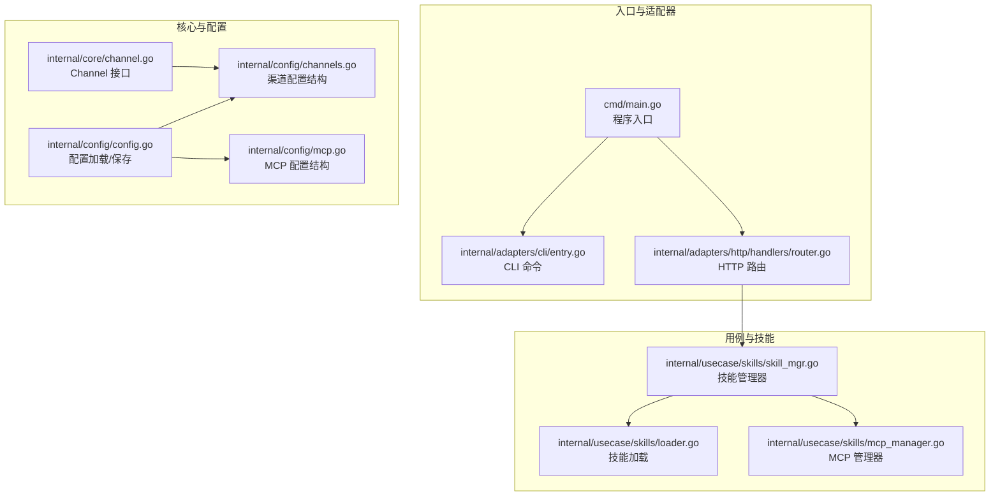
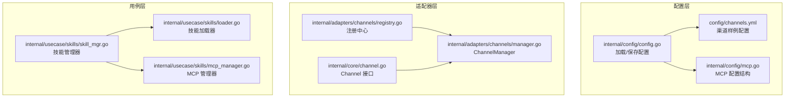
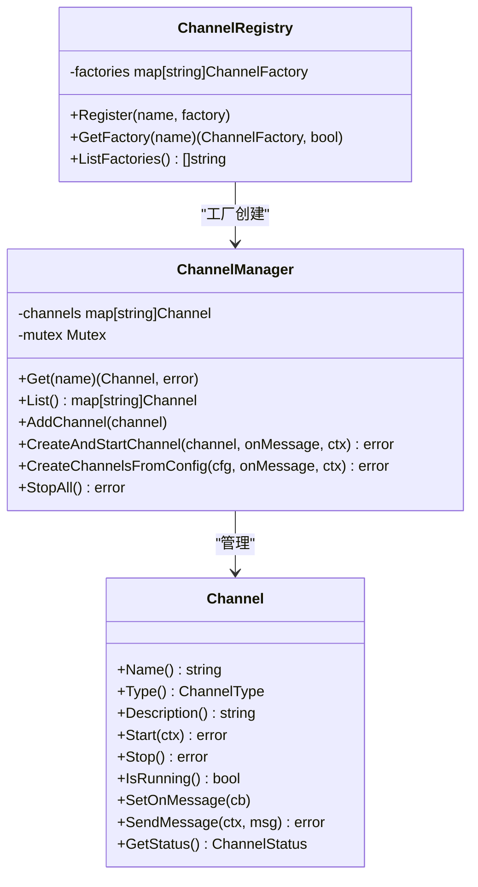
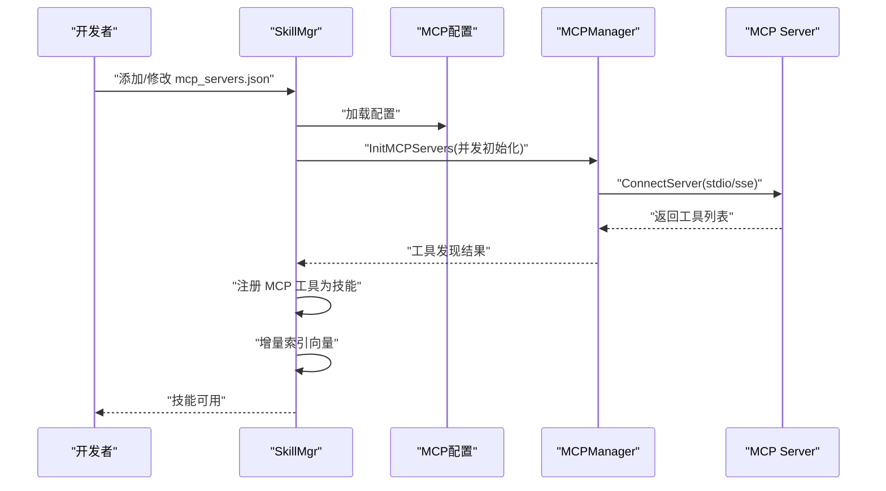
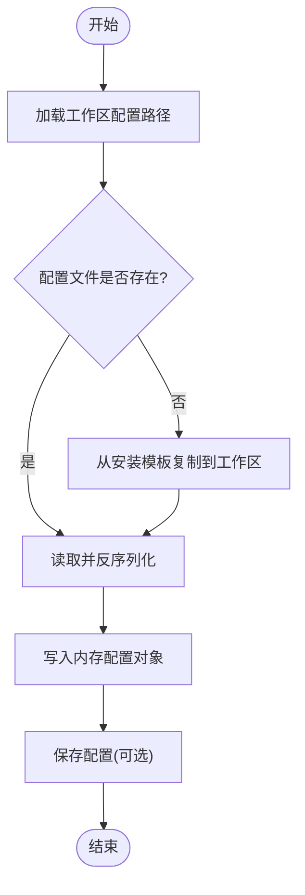
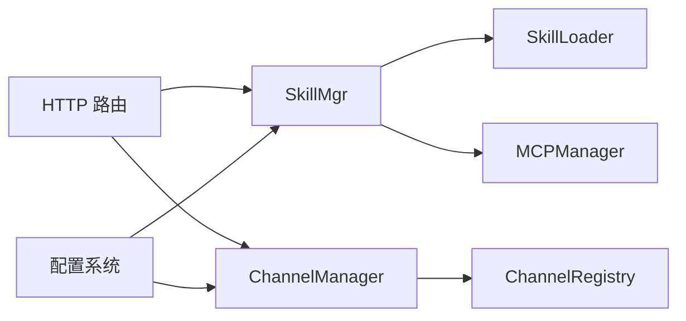

# 扩展开发

<cite>
**本文引用的文件**
- [cmd/main.go](file://cmd/main.go)
- [internal/adapters/cli/entry.go](file://internal/adapters/cli/entry.go)
- [internal/adapters/http/handlers/router.go](file://internal/adapters/http/handlers/router.go)
- [internal/adapters/channels/manager.go](file://internal/adapters/channels/manager.go)
- [internal/adapters/channels/registry.go](file://internal/adapters/channels/registry.go)
- [internal/core/channel.go](file://internal/core/channel.go)
- [internal/config/config.go](file://internal/config/config.go)
- [internal/config/channels.go](file://internal/config/channels.go)
- [internal/config/mcp.go](file://internal/config/mcp.go)
- [internal/usecase/skills/loader.go](file://internal/usecase/skills/loader.go)
- [internal/usecase/skills/skill_mgr.go](file://internal/usecase/skills/skill_mgr.go)
- [internal/usecase/skills/mcp_manager.go](file://internal/usecase/skills/mcp_manager.go)
- [config/channels.yml](file://config/channels.yml)
- [skills/calculator/SKILL.md](file://skills/calculator/SKILL.md)
</cite>

## 目录
1. [简介](#简介)
2. [项目结构](#项目结构)
3. [核心组件](#核心组件)
4. [架构总览](#架构总览)
5. [详细组件分析](#详细组件分析)
6. [依赖关系分析](#依赖关系分析)
7. [性能考量](#性能考量)
8. [故障排查指南](#故障排查指南)
9. [结论](#结论)
10. [附录](#附录)

## 简介
本文件面向 MindX 扩展开发者，系统化阐述如何在 MindX 基础上开发新功能模块与扩展点，涵盖以下主题：
- 架构设计原则与模块划分方法
- 渠道适配器开发（接口规范、实现步骤、测试方法）
- 技能开发流程（技能定义规范、CLI 技能编写、MCP 技能开发与部署）
- 配置系统扩展（新增配置项与动态配置管理）
- 最佳实践（错误处理、性能优化、安全考虑）
- 开发示例与调试技巧

## 项目结构
MindX 采用分层与领域驱动相结合的组织方式：
- cmd 层：程序入口与构建信息初始化
- internal/adapters：适配器层，包含 CLI、HTTP 路由与渠道适配器
- internal/config：配置加载、保存与模型管理
- internal/core：核心接口与实体
- internal/usecase：业务用例与工作流编排
- internal/infrastructure：基础设施（持久化、嵌入、调度等）
- config：工作区配置模板与样例
- skills：内置技能集合与示例

图表来源
- [cmd/main.go](file://cmd/main.go#L1-L21)
- [internal/adapters/http/handlers/router.go](file://internal/adapters/http/handlers/router.go#L18-L149)
- [internal/config/config.go](file://internal/config/config.go#L13-L37)
- [internal/config/channels.go](file://internal/config/channels.go#L11-L21)
- [internal/config/mcp.go](file://internal/config/mcp.go#L13-L29)
- [internal/usecase/skills/loader.go](file://internal/usecase/skills/loader.go#L18-L33)
- [internal/usecase/skills/skill_mgr.go](file://internal/usecase/skills/skill_mgr.go#L20-L34)
- [internal/usecase/skills/mcp_manager.go](file://internal/usecase/skills/mcp_manager.go#L36-L47)
- [internal/core/channel.go](file://internal/core/channel.go#L8-L40)

章节来源
- [cmd/main.go](file://cmd/main.go#L1-L21)
- [internal/adapters/http/handlers/router.go](file://internal/adapters/http/handlers/router.go#L18-L149)

## 核心组件
- 程序入口与 CLI
  - 入口负责设置构建信息并在 main 中调用 CLI 执行器
  - CLI 提供版本、发送消息、训练、内核控制等命令
- HTTP 路由与控制器
  - 路由集中注册各类 API，包括会话、渠道、技能、能力、配置、监控、MCP 等
- Channel 接口与注册中心
  - Channel 接口统一了消息通道的生命周期与消息收发
  - 注册中心通过工厂函数实现配置驱动的 Channel 创建
- 配置系统
  - Viper 驱动的配置加载/保存，支持 server、channels、capabilities、models
  - 渠道配置结构与 MCP 配置结构分别管理不同扩展点
- 技能管理器
  - 负责技能加载、索引、搜索、执行、MCP 工具注册与重连策略
  - 提供批量转换、安装依赖、后台重建索引等能力

章节来源
- [internal/adapters/cli/entry.go](file://internal/adapters/cli/entry.go#L17-L123)
- [internal/adapters/http/handlers/router.go](file://internal/adapters/http/handlers/router.go#L18-L149)
- [internal/core/channel.go](file://internal/core/channel.go#L8-L40)
- [internal/adapters/channels/registry.go](file://internal/adapters/channels/registry.go#L9-L38)
- [internal/config/config.go](file://internal/config/config.go#L13-L37)
- [internal/config/channels.go](file://internal/config/channels.go#L11-L21)
- [internal/config/mcp.go](file://internal/config/mcp.go#L13-L29)
- [internal/usecase/skills/skill_mgr.go](file://internal/usecase/skills/skill_mgr.go#L20-L84)

## 架构总览
MindX 以“配置驱动 + 接口抽象 + 用例编排”为核心设计原则：
- 配置驱动：channels.yml、server.yml、models.yml、capabilities.yml 与 mcp_servers.json 控制系统行为
- 接口抽象：Channel 接口统一多渠道接入；Skill 接口统一技能执行
- 用例编排：SkillMgr 统一管理技能生命周期、索引与执行；ChannelManager 统一管理渠道生命周期

图表来源
- [config/channels.yml](file://config/channels.yml#L1-L96)
- [internal/config/config.go](file://internal/config/config.go#L13-L37)
- [internal/config/mcp.go](file://internal/config/mcp.go#L41-L64)
- [internal/adapters/channels/registry.go](file://internal/adapters/channels/registry.go#L9-L38)
- [internal/adapters/channels/manager.go](file://internal/adapters/channels/manager.go#L15-L29)
- [internal/core/channel.go](file://internal/core/channel.go#L8-L40)
- [internal/usecase/skills/skill_mgr.go](file://internal/usecase/skills/skill_mgr.go#L20-L34)
- [internal/usecase/skills/loader.go](file://internal/usecase/skills/loader.go#L18-L33)
- [internal/usecase/skills/mcp_manager.go](file://internal/usecase/skills/mcp_manager.go#L36-L47)

## 详细组件分析

### 渠道适配器开发
- 接口规范
  - Channel 接口定义了名称、类型、描述、生命周期、消息回调、消息发送与状态查询等方法
- 工厂与注册
  - 通过注册中心注册工厂函数，ChannelManager 根据配置并行创建与启动 Channel
- 实现步骤
  - 定义 Channel 结构体并实现 Channel 接口
  - 在包的 init 中注册工厂函数
  - 在 channels.yml 中配置启用与参数
  - 通过 ChannelManager.CreateChannelsFromConfig 从配置驱动创建
- 测试方法
  - 单元测试覆盖启动/停止、消息回调、状态查询
  - 集成测试覆盖并发创建、优雅停机、资源使用与稳定性

图表来源
- [internal/core/channel.go](file://internal/core/channel.go#L8-L40)
- [internal/adapters/channels/manager.go](file://internal/adapters/channels/manager.go#L15-L230)
- [internal/adapters/channels/registry.go](file://internal/adapters/channels/registry.go#L9-L38)

章节来源
- [internal/core/channel.go](file://internal/core/channel.go#L8-L40)
- [internal/adapters/channels/registry.go](file://internal/adapters/channels/registry.go#L9-L38)
- [internal/adapters/channels/manager.go](file://internal/adapters/channels/manager.go#L123-L230)
- [internal/config/channels.go](file://internal/config/channels.go#L11-L21)
- [config/channels.yml](file://config/channels.yml#L1-L96)

### 技能开发流程
- 技能定义规范
  - 技能以 SKILL.md 为标准定义，采用 YAML frontmatter 声明元数据、参数、依赖与标签
  - 示例：计算器技能定义包含名称、描述、版本、分类、标签、OS、启用状态、超时、命令与参数说明
- CLI 技能编写
  - 在技能目录下提供可执行脚本或二进制，并在 SKILL.md 中声明 command
  - Loader 读取 SKILL.md 并解析为 SkillDef，校验依赖（二进制与环境变量）
- MCP 技能开发与部署
  - 通过 mcp_servers.json 配置 MCP server（stdio 或 sse），SkillMgr 并发初始化并带重试
  - MCPManager 负责连接、工具发现、调用与状态管理
  - 新增/移除/重启 MCP server 支持运行时变更
- 索引与检索
  - SkillMgr 负责技能索引与向量检索，支持后台重建索引与增量索引 MCP 工具

图表来源
- [internal/usecase/skills/skill_mgr.go](file://internal/usecase/skills/skill_mgr.go#L373-L506)
- [internal/usecase/skills/mcp_manager.go](file://internal/usecase/skills/mcp_manager.go#L49-L141)
- [internal/config/mcp.go](file://internal/config/mcp.go#L41-L64)

章节来源
- [internal/usecase/skills/loader.go](file://internal/usecase/skills/loader.go#L60-L123)
- [internal/usecase/skills/loader.go](file://internal/usecase/skills/loader.go#L165-L184)
- [internal/usecase/skills/skill_mgr.go](file://internal/usecase/skills/skill_mgr.go#L243-L260)
- [internal/usecase/skills/mcp_manager.go](file://internal/usecase/skills/mcp_manager.go#L49-L141)
- [internal/config/mcp.go](file://internal/config/mcp.go#L41-L64)
- [skills/calculator/SKILL.md](file://skills/calculator/SKILL.md#L1-L37)

### 配置系统扩展
- 新增配置项
  - 在对应配置结构体中添加字段（如 ChannelsConfig、GlobalConfig、ModelsConfig、CapabilityConfig）
  - 在 config.go 中增加 Load*/Save* 方法，确保工作区路径与模板复制逻辑正确
- 动态配置管理
  - 通过 HTTP 接口读取/保存配置（/api/config/*）
  - ChannelManager 与 SkillMgr 通过配置驱动创建与更新行为
- 环境变量解析
  - MCP 配置支持环境变量占位符解析，支持本地上下文与系统环境

图表来源
- [internal/config/config.go](file://internal/config/config.go#L39-L82)
- [internal/config/config.go](file://internal/config/config.go#L84-L122)
- [internal/config/config.go](file://internal/config/config.go#L124-L162)
- [internal/config/config.go](file://internal/config/config.go#L164-L203)

章节来源
- [internal/config/config.go](file://internal/config/config.go#L13-L37)
- [internal/config/config.go](file://internal/config/config.go#L205-L250)
- [internal/config/channels.go](file://internal/config/channels.go#L23-L59)
- [internal/config/mcp.go](file://internal/config/mcp.go#L66-L80)

## 依赖关系分析
- 组件耦合
  - SkillMgr 依赖 Loader、MCPManager、索引与嵌入服务，形成高内聚低耦合的技能域
  - ChannelManager 依赖注册中心与配置，解耦具体渠道实现
- 外部依赖
  - Gin 用于 HTTP 路由与控制器
  - Viper 用于配置加载
  - Model Context Protocol SDK 用于 MCP 通信
- 潜在循环依赖
  - 通过接口与用例层隔离，避免直接循环引用

图表来源
- [internal/adapters/http/handlers/router.go](file://internal/adapters/http/handlers/router.go#L18-L149)
- [internal/usecase/skills/skill_mgr.go](file://internal/usecase/skills/skill_mgr.go#L36-L62)
- [internal/adapters/channels/manager.go](file://internal/adapters/channels/manager.go#L151-L155)
- [internal/adapters/channels/registry.go](file://internal/adapters/channels/registry.go#L25-L32)
- [internal/config/config.go](file://internal/config/config.go#L13-L37)

章节来源
- [internal/adapters/http/handlers/router.go](file://internal/adapters/http/handlers/router.go#L18-L149)
- [internal/usecase/skills/skill_mgr.go](file://internal/usecase/skills/skill_mgr.go#L36-L62)
- [internal/adapters/channels/manager.go](file://internal/adapters/channels/manager.go#L151-L155)

## 性能考量
- 并发初始化
  - ChannelManager 与 SkillMgr 对多实例初始化采用并发与等待组，缩短启动时间
- 异步索引
  - 技能与 MCP 工具索引采用后台工作线程与队列，避免阻塞主流程
- 超时与重试
  - MCP 连接按传输类型设定不同超时，仅对可重试错误进行有限次重试
- 资源管理
  - 优雅停机与资源释放，确保 Channel 与 MCP 会话正确关闭

## 故障排查指南
- 渠道相关
  - 启动失败：检查配置 enabled 与参数合法性；查看 ChannelManager 日志
  - 消息回调未触发：确认 SetOnMessage 回调设置与上下文传播
- 技能相关
  - 依赖缺失：检查二进制与环境变量；使用 GetMissingDependencies 获取缺失项
  - 索引异常：触发后台重建索引；关注索引工作线程状态
- MCP 相关
  - 连接失败：区分超时与协议错误；stdio 冷启动慢需更长超时
  - 工具不可用：确认工具发现与描述覆盖；检查 catalog 配置
- 配置相关
  - 配置未生效：确认工作区配置路径与模板复制；通过 HTTP 接口验证保存

章节来源
- [internal/adapters/channels/manager.go](file://internal/adapters/channels/manager.go#L123-L147)
- [internal/usecase/skills/skill_mgr.go](file://internal/usecase/skills/skill_mgr.go#L404-L449)
- [internal/usecase/skills/loader.go](file://internal/usecase/skills/loader.go#L186-L204)
- [internal/config/mcp.go](file://internal/config/mcp.go#L82-L105)

## 结论
MindX 通过清晰的接口抽象、配置驱动与用例编排，提供了可扩展的渠道与技能生态。开发者可遵循本文档的接口规范、开发流程与最佳实践，在保证性能与安全的前提下快速扩展新功能模块。

## 附录
- 开发示例
  - 新建渠道：实现 Channel 接口并在 init 中注册工厂；在 channels.yml 启用；通过 ChannelManager 创建
  - 新建技能：编写 SKILL.md 与可执行脚本；Loader 自动加载；必要时手动触发 ReIndex
  - 新增 MCP：在 mcp_servers.json 中配置；SkillMgr 并发初始化；运行时可增删改
- 调试技巧
  - 使用 CLI send 子命令向本地服务发送消息进行端到端验证
  - 通过 HTTP /api/monitor 查看实时日志
  - 使用 /api/config/* 与 /api/settings 验证配置生效